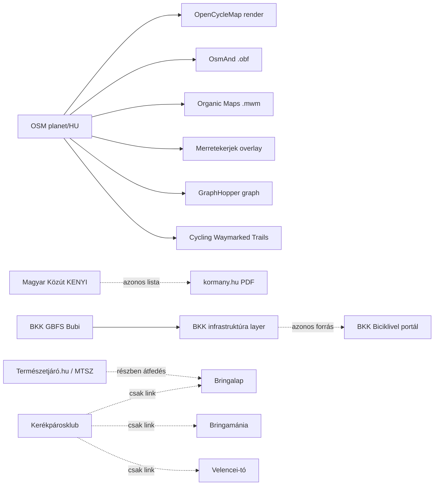

# 00 — Cycling Data Sources Master Plan (redundanciamentes integrációs terv)

> Ez a fájl a `cycling-data-sources/` mappa **integrációs döntéshozó dokumentuma**: a 25 részletes forrás-specifikáció (01–29) alapján kimondja, **melyik forrást gyűjtsük be**, milyen szerepben, milyen kadenciával, hogyan kerüljük el a redundanciát, és milyen **backend elemekre** van szükség.

---

## 1. Forrásminősítő mátrix

A 25 specifikációból szintetizált pontszámok. Skála: 0 = nincs / nem alkalmas, 5 = kiváló.

| # | Forrás | Megbízhatóság | Frissesség | Hozzáférhetőség | Licenc-tisztaság | HU-lefedettség | Egyediség (nem-OSM) | **Súlyozott** |
|---|--------|:-:|:-:|:-:|:-:|:-:|:-:|:-:|
| 26 | OpenStreetMap (planet) | 5 | 5 | 5 | 5 | 5 | 0 | **25** |
| 04 | OpenStreetMap.hu | 5 | 5 | 5 | 5 | 5 | 0 | **25** |
| 15 | Cycling Waymarked Trails | 5 | 5 | 5 | 5 | 4 | 2 | **24** |
| 28 | BKK bringás térkép / GBFS | 5 | 5 | 5 | 4 | 5 | 5 | **24** |
| 01 | Magyar Közút KENYI | 5 | 2 | 2 | 5 | 5 | 5 | **24** |
| 08 | BKK Biciklivel Budapesten | 5 | 4 | 4 | 4 | 5 | 4 | **22** |
| 02 | kormany.hu kerékpárút lista | 5 | 1 | 4 | 5 | 5 | 3 | **22** |
| 24 | Természetjáró.hu (MTSZ) | 5 | 3 | 3 | 3 | 5 | 5 | **22** |
| 25 | Bicikliparkoló kereső | 3 | 3 | 3 | 3 | 5 | 4 | **20** |
| 13 | Komoot | 5 | 5 | 2 | 2 | 4 | 4 | **20** |
| 06 | Bringalap | 3 | 2 | 3 | 2 | 5 | 4 | **18** |
| 11 | Balatonbringa Club | 3 | 2 | 3 | 2 | 3 (Balaton) | 4 | **17** |
| 14 | OpenCycleMap | 4 | 4 | 4 | 5 | 5 | 0 (OSM-derived) | **17** |
| 16 | OsmAnd | 5 | 3 | 4 | 5 | 5 | 0 (OSM-derived) | **16** |
| 17 | Organic Maps | 5 | 3 | 5 | 5 | 5 | 0 (OSM-derived) | **16** |
| 05 | Merretekerjek | 3 | 3 | 3 | 3 | 4 | 0 (OSM-derived) | **15** |
| 03 | Kerékpárosklub | 3 | 2 | 3 | 3 | 4 | 2 (aggregátor) | **15** |
| 29 | Velencei-tó bringatérkép | 3 | 1 | 3 | 4 | 2 (Velence) | 3 | **14** |
| 18 | GraphHopper | 5 | 5 | 3 | 4 | n/a (motor) | 0 (OSM-derived) | **13** |
| 12 | Bikemap | 3 | 5 | 2 | 1 | 3 | 3 | **13** |
| 07 | Bringamánia | 2 | 1 | 3 | 2 | 3 | 3 | **12** |
| 22 | Térképem.hu | 4 | 5 | 1 | 1 | 5 | 1 | **12** |
| 19 | Naviki | 4 | 5 | 2 | 1 | 3 | 1 | **12** |
| 23 | Flowcycle | 3 | 2 | 3 | 2 | 3 | 2 | **12** |
| 20 | Bike Citizens | 4 | 5 | 2 | 1 | 2 | 2 | **12** |

**Súly:** Megbízhatóság × 1,2 + Frissesség × 1,0 + Hozzáférhetőség × 1,0 + Licenc × 1,3 + HU-lefedettség × 1,0 + Egyediség × 1,1, kerekítve.

---

## 2. Tier-besorolás: melyik forrást gyűjtsük be, miért

### TIER 1 — Alap, kötelező (Production day-1)

Ezek adják a **kerékpáros adatok gerincét**. Mindegyik vagy a vásznat festi (OSM), vagy egyedi, nem-helyettesíthető adatot ad (BKK GBFS, KENYI).

| # | Forrás | Szerep | Indok |
|---|--------|--------|-------|
| 26 + 04 | OSM planet + Geofabrik HU PBF | **Master spatial canvas** — minden lineáris kerékpáros infrastruktúra, OSM-relációkkal (`route=bicycle`, `network=lcn/rcn/ncn/icn`), `highway=cycleway`, `bicycle=designated`. | A többi OSM-alapú forrás (Cycling Waymarked Trails, OsmAnd, Organic Maps, Merretekerjek, OpenCycleMap, GraphHopper) ugyanezt az adatot rendereli — **felesleges párhuzamosan letölteni**, az upstream egyetlen, hivatalos forrás. |
| 15 | Cycling Waymarked Trails | **OSM route relation enrichment** — előzetesen feldolgozott útvonal-meta (nettó hossz, szegmens-rend, magasság-profil, gpx export). | Az OSM relációkból a Waymarked Trails már megcsinálta a "merge + simplify + elevation lookup" lépést; készen kapjuk, nem kell magunknak Valhalla-elevation pipeline. |
| 28 | BKK GBFS (MOL Bubi) | **Élő kerékpármegosztás állapot** — állomás-rendelkezésre-állás, biciklik száma, helyek száma. | Nincs OSM-megfelelője (élő real-time adat); GBFS szabvány = elsőrangú integráció. |
| 28 | BKK bringás infrastruktúra GeoJSON | Budapest részletes kerékpáros úthálózat-osztályozás (sáv-típus, irány, elválasztás). | A budapesti OSM rajz gyengébb minőségű a hivatalos BKK rétegnél; itt a BKK az authoritative source. |
| 01 | Magyar Közút KENYI | **Hivatalos állami kerékpárút-nyilvántartás** — szakaszhossz, burkolat, fenntartás, megye. | Senki más nem birtokolja ezt; OSM-mel keresztellenőrzésre is kell (lefedettségi gap-ek). |

### TIER 2 — Gazdagítás, magyar túra-katalógus (v0.7.x roadmap)

Ezek **magyar-specifikus túra- és POI-tartalmat** adnak, amit az OSM nem fed le teljesen (lokális leírások, ajánlott útvonalak, fotók, hosszú-szakaszos turistautak névkonvenciói).

| # | Forrás | Szerep | Felvétel feltétele |
|---|--------|--------|---------------------|
| 24 | Természetjáró.hu (MTSZ) | Hivatalos magyar túraútvonal-katalógus (KÉKTÚRA, kerékpáros körök). | PR / hivatalos együttműködés MTSZ-szel; addig csak metaadat-szintű olvasás. |
| 02 | kormany.hu kerékpárút lista | Szakpolitikai szakaszlista, EuroVelo HU-szegmensek hivatalos elnevezése. | PDF/XLSX scraping SHA-256 snapshot-diff-fel (változás-detektálás). |
| 25 | Bicikliparkoló kereső | HU kerékpárparkolók (kereszt-egyesítve OSM `amenity=bicycle_parking`-gel). | Polite scraping vagy OSM-only verzió, attól függően, hogy a Kerékpárosklub partneri viszonyba lép-e velünk. |
| 08 | BKK Biciklivel portál (Bubi → opendata.bkk.hu) | Budapesti POI-k (javítás, töltés, ivókút, info-pont). | Nyílt opendata.bkk.hu API. |

### TIER 3 — Opcionális, projekt-specifikus

Csak akkor, ha a konkrét feature (pl. Balaton-túra-tervező) megköveteli, **vagy** ha partneri megállapodás született az adott forrással.

| # | Forrás | Mikor érdemes felvenni |
|---|--------|------------------------|
| 13 | Komoot | Ha Komoot Connect partner-szerződés vagy felhasználói OAuth-flow valósul meg. |
| 06 | Bringalap | Ha sikerült PR-be lépni az üzemeltetővel (írásos engedély a túraleírások beolvasására). |
| 11 | Balatonbringa Club | Csak Balaton-régiós feature esetén. |
| 29 | Velencei-tó bringatérkép | Csak Velencei-tó régiós feature esetén. |

### NEM VESSZÜK FEL (legalábbis MVP-ben)

| # | Forrás | Indok |
|---|--------|-------|
| 14 | OpenCycleMap | OSM-re épülő tile-render → ha kell vizualizáció, **saját** tile-server (martin/tegola) az OSM-ből → nincs új adat. |
| 16 | OsmAnd | Bináris `.obf` formátum, ugyanaz az OSM upstream → Geofabrik PBF közvetlenül elég. |
| 17 | Organic Maps | `.mwm` formátum, ugyanúgy OSM-derived. |
| 18 | GraphHopper | Routing **motor**, nem adatforrás → magunk hosztoljuk OSM gráffal, NEM a Cloud API-t hívjuk. |
| 05 | Merretekerjek | OSM-overlay site, az alaprajz Overpass-ból úgyis megvan. |
| 03 | Kerékpárosklub | Aggregátor / linkgyűjtemény, nincs független adata. Linkjeit eseti ellenőrzéssel követjük. |
| 07 | Bringamánia | Régi, alacsony adatminőség, ToS bizonytalan. |
| 12 | Bikemap | Kereskedelmi UGC, ToS scraping-ellenes, érték / kockázat arány gyenge. |
| 19 | Naviki | Kereskedelmi routing, nem adatforrás (motor). |
| 20 | Bike Citizens | Kereskedelmi városi, magyar lefedettség gyenge. |
| 22 | Térképem.hu | Felhasználói planner-eszköz, nem közös adat (csak user-export GDPR-kompatibilisen). |
| 23 | Flowcycle | Kicsi katalógus, ToS bizonytalan. |

**Eredmény:** **9 forrás** kerül a Production-be (5 Tier 1 + 4 Tier 2), opcionális 4 (Tier 3), **12 forrást elhagyunk** mert redundáns OSM-mel vagy ToS-korlátozott.

---

## 3. Redundancia-térkép (mely források ugyanazt adják)



**Konkrét döntések a redundancia kiküszöbölésére:**

1. **OSM-csatorna konszolidáció**: a 26 (planet) és a 04 (HU subset) közül egyetlen Geofabrik HU PBF-csatornát üzemeltetünk; a planet-szintű minutely diff-ekből csak a HU bbox-on belüli változásokat alkalmazzuk Osmosis `--bbox` szűrővel.
2. **OSM-derived elhagyása**: 14, 16, 17, 05, 18 NEM hív külön ETL-t — ha kell vector tile, helyben rendereljük (`osm2pgsql` + `martin`); ha kell routing, helyi GraphHopper jar a saját PBF-en.
3. **KENYI vs kormany.hu**: 01 az **authoritative**, 02 csak **change-detector** (SHA-256 hash-diff → értesítés, hogy "új lista jelent meg, érdemes új FOIA-igénylést indítani").
4. **BKK egységes pipeline**: 28 és 08 ugyanaz a BKK-csapat, egy közös `bkk_ingest` namespace alatt fut.
5. **Túra-katalógus deduplication**: 24, 06, 11, 29 (ha bekapcsolva) közös `cycling.route` táblába mennek; **Fréchet-távolság < 200 m + név fuzzy match > 80%** = duplikátum, **prioritás-sorrend**: Természetjáró > kormany.hu lista > Bringalap > regionálisok.

---

## 4. Frissítési kadenciák (forrás → frequency mátrix)

| Forrás | Friss adat | Refresh kadencia | Mechanizmus |
|--------|-----------|------------------|-------------|
| **OSM planet** (26) | percenként minimum 1 változás globálisan | **percenként** minutely diff letöltés (`*.osc.gz`), HU-bbox-szűrés → óránként batch alkalmazva Postgres-be | Osmosis `replicate-apply` + cron 1m |
| **Geofabrik HU PBF** (04) | csütörtök 01:00 UTC | **heti** full reload | k8s CronJob csütörtök 03:00 UTC |
| **Cycling Waymarked Trails** (15) | OSM-derived, ~napi pipeline | **napi** route relation lekérés | k8s CronJob 04:00 UTC, REST API per-relation |
| **BKK GBFS station_status** (28) | percenként frissül | **percenként** poll | k8s Deployment + Redis cache, írás TimescaleDB hypertable-be |
| **BKK GBFS station_information / system_information** (28) | ritkán | **napi** | k8s CronJob 02:00 UTC |
| **BKK infrastruktúra GeoJSON** (28) | hetente max | **heti** | k8s CronJob hétfő 03:00 UTC |
| **BKK Biciklivel portál** (08) | hetente max | **heti** | scraping + opendata.bkk.hu poll |
| **Magyar Közút KENYI** (01) | éves / negyedéves | **negyedéves** FOIA-cycle + havi PDF-hash-diff | manuális adatigénylés + cron 0 0 1 * * (hónap elseje) |
| **kormany.hu lista** (02) | éves | **havi** snapshot SHA-256-diff | k8s CronJob 1. nap 04:00 UTC |
| **Természetjáró.hu** (24) | felhasználói feltöltéssel | **heti** sitemap-diff | k8s CronJob vasárnap 02:00 UTC (PR után) |
| **Bicikliparkoló kereső** (25) | ritkán | **havi** + OSM `amenity=bicycle_parking` weekly | k8s CronJob hó 5. nap + heti OSM Overpass |
| **Bringalap** (06, ha bekapcsolt) | felhasználói | **heti** sitemap-diff | k8s CronJob szombat 02:00 UTC |
| **Komoot** (13, ha bekapcsolt) | felhasználói | **napi** user-OAuth incremental | per-user webhook + napi reconciliation |

**Kadencia-elv:** soha ne hívjunk forrást gyakrabban, mint amilyen gyakran változik. Minden cron-hoz `If-Modified-Since` / `ETag` header — ha 304, nem dolgozunk fel.

---

## 5. Hogyan frissítünk (egységes frissítési protokoll)

### 5.1 Inkrementális vs teljes újratöltés

| Forrás-típus | Default mód | Fallback |
|--------------|-------------|----------|
| OSM (26, 04) | Inkrementális (minutely diff) | Heti full PBF reload (kihagy minden diff-cumulative drift-et) |
| GBFS (28) | Inkrementális (csak változott állomás) | Napi full station_information reload |
| KENYI / kormany.hu | Snapshot diff | Manuális trigger új FOIA-szerzés után |
| Túra-katalógus (24, 06) | Sitemap-diff (új URL-ek) | Negyedéves full crawl |
| Cycling Waymarked Trails | Relation-list diff | Havi full re-sync |

### 5.2 Idempotens upsert minta

Minden forrás ugyanezt a sablon-funkciót használja Postgres-ben:

```sql
CREATE OR REPLACE FUNCTION cycling.upsert_route(
  p_source_id text,
  p_external_id text,
  p_name text,
  p_geom geometry(LineString, 4326),
  p_tags jsonb,
  p_fetched_at timestamptz
) RETURNS uuid AS $$
DECLARE
  v_existing_id uuid;
  v_geom_hash text := md5(ST_AsBinary(ST_SnapToGrid(p_geom, 0.00001)));
  v_route_id uuid;
BEGIN
  -- 1. Source-key alapján keresés
  SELECT id INTO v_route_id
  FROM cycling.route
  WHERE source_id = p_source_id AND external_id = p_external_id;

  IF v_route_id IS NULL THEN
    -- 2. Dedup: van-e ugyanilyen geometry-hash más forrásból?
    SELECT master_route_id INTO v_existing_id
    FROM cycling.dedup
    WHERE geom_hash = v_geom_hash;

    IF v_existing_id IS NOT NULL THEN
      -- Új source-recordot kötjük az existing master-hez
      INSERT INTO cycling.route (id, master_id, source_id, external_id, name, geom, tags, fetched_at)
      VALUES (gen_random_uuid(), v_existing_id, p_source_id, p_external_id, p_name, p_geom, p_tags, p_fetched_at)
      RETURNING id INTO v_route_id;
    ELSE
      -- Új master + új record
      INSERT INTO cycling.route (id, master_id, source_id, external_id, name, geom, tags, fetched_at)
      VALUES (gen_random_uuid(), gen_random_uuid(), p_source_id, p_external_id, p_name, p_geom, p_tags, p_fetched_at)
      RETURNING id, master_id INTO v_route_id, v_existing_id;
      INSERT INTO cycling.dedup (geom_hash, master_route_id) VALUES (v_geom_hash, v_existing_id);
    END IF;
  ELSE
    -- SCD2: meglévő rekord módosítása csak akkor, ha tényleg változott
    UPDATE cycling.route
    SET name = p_name, geom = p_geom, tags = p_tags, fetched_at = p_fetched_at,
        valid_to = NULL
    WHERE id = v_route_id
      AND (name IS DISTINCT FROM p_name OR ST_AsBinary(geom) IS DISTINCT FROM ST_AsBinary(p_geom));
  END IF;

  RETURN v_route_id;
END;
$$ LANGUAGE plpgsql;
```

### 5.3 Snapshot + version cycle

Minden L1 letöltő **immutabilis** snapshot-ot készít az S3/MinIO bucketbe (Object Lock + SHA-256 a fájlnévben). Az L4 normalizer ezt a snapshot-ot olvassa, NEM a forrás-élő URL-t — így minden ETL **újrajátszható**.

```
s3://panellako-cycling/
  raw/
    osm-hu/2026-05-19T03-00-00Z/hungary-latest.osm.pbf  (sha256:abc...)
    bkk-gbfs/2026-05-19T08-32-15Z/station_status.json   (sha256:def...)
    kenyi/2026-04-15T00-00-00Z/kenyi_q1_2026.xlsx        (sha256:ghi...)
    waymarkedtrails/2026-05-19T04-00-00Z/relations.json  (sha256:jkl...)
```

### 5.4 Adatminőség-kapu (a publikálás előtt)

Minden batch frissítés átmegy egy **Great Expectations** suite-en:

- Sorszám-drift max ±10% (különben emberi review)
- `ST_IsValid(geom) = true` 100%
- `length_m > 50 AND length_m < 500000` (sanity)
- Magyarországi bbox-on belül (16.0, 45.7, 22.9, 48.6)
- `master_id` foreign-key érvényes
- Nincs új duplikátum (Fréchet < 200 m + név > 80% similar)

Ha a kapu bukik, a frissítés `staging`-ben marad, riasztás megy Slack-re; production séma változatlan.

### 5.5 Rollback

Minden refresh `data_version` címkét kap (`yyyy-mm-ddTHH:MM:SSZ_source`). A publikált adatok views-on át mennek (`cycling.route_published`), ami `WHERE data_version = (SELECT current_version FROM cycling.publish_state)`. Egy rossz batch visszavonása: `UPDATE cycling.publish_state SET current_version = '<előző>'` — **azonnali, atomi rollback**.

---

## 6. Backend elemlista

### 6.1 Adatbázis (PostgreSQL 15 + PostGIS 3.4 + TimescaleDB 2.x)

#### Sémák

| Séma | Cél |
|------|-----|
| `osm_raw` | osm2pgsql által populált nyers OSM táblák (`planet_osm_line`, `planet_osm_point`, `planet_osm_rels`). |
| `cycling` | **Master / kanonikus** kerékpáros adatok (route, way, poi). |
| `cycling_curated` | Kézi review-zott, kurátorolt útvonalak (override / blacklist). |
| `gbfs` | BKK GBFS aktuális állapot. |
| `gbfs_history` | TimescaleDB hypertable, percenkénti station_status snapshot. |
| `kenyi` | Magyar Közút KENYI snapshot history (SCD2). |
| `mtsz` | Természetjáró.hu / MTSZ túrák. |
| `bkk_infra` | BKK infrastruktúra layer. |
| `bicycle_parking` | Bringaparkolók (OSM + Bicikliparkoló kereső). |
| `etl_meta` | Letöltés-log, parse-error queue, data-quality run. |

#### Kulcs táblák

```sql
-- Master route tábla (minden forrás ide upsert-el)
CREATE TABLE cycling.route (
  id          uuid PRIMARY KEY DEFAULT gen_random_uuid(),
  master_id   uuid NOT NULL,  -- dedup csoport-azonosító
  source_id   text NOT NULL REFERENCES cycling.source(id),
  external_id text NOT NULL,  -- forrás-natív azonosító
  name        text,
  geom        geometry(LineString, 4326) NOT NULL,
  length_m    numeric GENERATED ALWAYS AS (ST_Length(geom::geography)) STORED,
  tags        jsonb NOT NULL DEFAULT '{}'::jsonb,
  valid_from  timestamptz NOT NULL DEFAULT now(),
  valid_to    timestamptz,
  fetched_at  timestamptz NOT NULL,
  data_version text NOT NULL,
  UNIQUE (source_id, external_id, valid_from)
);
CREATE INDEX route_geom_gist ON cycling.route USING GIST (geom);
CREATE INDEX route_master ON cycling.route(master_id);
CREATE INDEX route_tags_gin ON cycling.route USING GIN (tags);

-- Master view (egy master-route → 1 sor, többszörös forrás megjelölve)
CREATE MATERIALIZED VIEW cycling.route_master AS
SELECT
  master_id AS id,
  (array_agg(name ORDER BY source_priority(source_id) DESC))[1] AS name,
  ST_Multi(ST_Union(geom)) AS geom_multi,
  ST_LineMerge(ST_Union(geom)) AS geom_merged,
  jsonb_object_agg(source_id, jsonb_build_object('external_id', external_id, 'tags', tags)) AS sources,
  MAX(fetched_at) AS last_fetched_at
FROM cycling.route WHERE valid_to IS NULL
GROUP BY master_id;
CREATE INDEX route_master_mv_gist ON cycling.route_master USING GIST (geom_merged);

-- Source registry
CREATE TABLE cycling.source (
  id          text PRIMARY KEY,           -- 'osm-hu', 'kenyi', 'bkk-gbfs', ...
  display_name text NOT NULL,
  license     text NOT NULL,              -- 'ODbL', 'CC-BY 4.0', 'kozadat', ...
  attribution text NOT NULL,
  priority    int NOT NULL DEFAULT 50,    -- master-pick súly
  is_active   boolean NOT NULL DEFAULT true,
  fetch_cadence interval NOT NULL,
  last_success_at timestamptz,
  last_failure_at timestamptz,
  config jsonb NOT NULL DEFAULT '{}'::jsonb
);

-- Deduplication
CREATE TABLE cycling.dedup (
  geom_hash text PRIMARY KEY,
  master_route_id uuid NOT NULL,
  created_at timestamptz NOT NULL DEFAULT now()
);

-- GBFS hypertable
CREATE TABLE gbfs.station_status (
  station_id text NOT NULL,
  ts         timestamptz NOT NULL,
  num_bikes_available int NOT NULL,
  num_docks_available int NOT NULL,
  is_renting boolean NOT NULL,
  is_returning boolean NOT NULL,
  last_reported timestamptz,
  PRIMARY KEY (station_id, ts)
);
SELECT create_hypertable('gbfs.station_status', 'ts', chunk_time_interval => INTERVAL '1 day');
SELECT add_retention_policy('gbfs.station_status', INTERVAL '90 days');

-- ETL meta
CREATE TABLE etl_meta.fetch_log (
  id            bigserial PRIMARY KEY,
  source_id     text NOT NULL,
  started_at    timestamptz NOT NULL,
  finished_at   timestamptz,
  status        text NOT NULL CHECK (status IN ('running','success','failure','partial')),
  rows_in       int,
  rows_out      int,
  rows_rejected int,
  snapshot_uri  text,
  error_message text
);
CREATE INDEX fetch_log_source_time ON etl_meta.fetch_log(source_id, started_at DESC);
```

#### Indexek és skálázás

- GIST a minden geometriára (route, way, poi)
- GIN a `tags` jsonb-re (tag-alapú szűrés)
- BRIN a `fetch_log.started_at` táblán (append-only)
- Particionálás megye szerint a `cycling.way` táblán (LIST partition az `admin_level=6` polygon-ekhez)
- TimescaleDB hypertable + continuous aggregate napi+órás Bubi-statisztikákhoz

### 6.2 Komponensek (rétegek)

| Réteg | Komponens | Tech |
|-------|-----------|------|
| L1 Ingestion | 9× per-source fetch worker | Python 3.12 + httpx/aiohttp + tenacity, k8s CronJob vagy Deployment (GBFS folyamatos) |
| L2 Staging | Immutabilis snapshot store | MinIO / S3, Object Lock, SHA-256 verifikáció |
| L3 Parsers | Format-specifikus parserek | osmium (PBF), pyosmium replication, gpxpy (GPX), fastkml (KML), pdfplumber + camelot (PDF), openpyxl (XLSX), BeautifulSoup4 + lxml (HTML), GeoJSON natív |
| L4 Normalizer | Forrás → kanonikus séma mapper | Python service + Pydantic v2, per-source map class |
| L5 Dedup engine | Master-merge | PostGIS ST_Frechet, rapidfuzz, hash-index |
| L6 Quality gate | Adatminőség | Great Expectations + custom SQL assertions |
| L7 Storage | PostgreSQL klaszter | Primary + 1 sync replica + 2 async; pgbouncer; pg_partman |
| L8 Serving | API | PostgREST 12 (auto-CRUD) + FastAPI (komplex routing logic) + tegola/Martin (vector tile) + Redis 7 cache |
| L9 Scheduler | Job orchestration | k8s CronJob (egyszerű) + Apache Airflow 2.9 (komplex függőségek: OSM diff → cycling refresh → cache invalidate) |
| L10 Observability | Metrika + log + trace | Prometheus + Grafana + Loki + Tempo + Alertmanager |
| L11 Secret store | Titkok | HashiCorp Vault vagy k8s Sealed Secrets |
| L12 CI/CD | Pipeline | GitHub Actions + ArgoCD GitOps |
| L13 Backup | DR | pg_basebackup nightly → S3, WAL archiving folyamatos, point-in-time recovery, havi cold-storage Glacier |
| L14 API gateway | Auth + rate-limit | Kong vagy Caddy + JWT + OPA policy |

### 6.3 API végpontok (publikus serving)

```
GET  /v1/sources                              → forráslista, licencek, attribúciók
GET  /v1/sources/{id}/health                  → utolsó letöltés státusza

GET  /v1/routes?bbox=&network=&min_length=    → útvonal-lista (geom nélkül)
GET  /v1/routes/{master_id}                   → részletes útvonal (geom GeoJSON-ben)
GET  /v1/routes/{master_id}.gpx               → GPX export
GET  /v1/routes/{master_id}/segments          → szegmensekre bontva

GET  /v1/ways?bbox=&infrastructure_type=      → kerékpárút-szegmensek
GET  /v1/ways/{id}                            → 1 szegmens

GET  /v1/poi?bbox=&category=                  → POI-k (parkoló, javító, ivókút)
GET  /v1/bubi/stations                        → MOL Bubi élő állapot (Redis-cache)
GET  /v1/bubi/stations/{id}/history?from=&to= → historikus state (hypertable)

GET  /v1/tiles/cycling/{z}/{x}/{y}.pbf        → vector tile
GET  /v1/tiles/cycling/{z}/{x}/{y}.png        → raster tile (fallback)

POST /v1/admin/refetch/{source_id}            → manuális trigger (admin JWT)
POST /v1/admin/publish/{version}              → version-promote (admin JWT)
POST /v1/admin/rollback                       → előző version visszaállítása
```

### 6.4 Funkcionális modulok (kódszinten)

```
panellako-cycling/
├── cmd/
│   ├── fetch_osm_hu.py
│   ├── fetch_osm_diff.py
│   ├── fetch_bkk_gbfs.py
│   ├── fetch_bkk_infra.py
│   ├── fetch_kenyi_snapshot.py
│   ├── fetch_kormany_pdf.py
│   ├── fetch_waymarkedtrails.py
│   ├── fetch_termeszetjaro.py
│   └── fetch_bicikliparkolo.py
├── src/cycling/
│   ├── parsers/         (osm, gpx, kml, pdf, xlsx, html, geojson)
│   ├── normalizers/     (source → canonical mapper)
│   ├── dedup.py         (Frechet + name fuzzy)
│   ├── quality.py       (Great Expectations suite)
│   ├── publish.py       (version promote / rollback)
│   └── upsert.py        (idempotens DB writer)
├── api/
│   ├── routes.py        (FastAPI)
│   ├── tiles.py         (martin proxy)
│   └── admin.py
├── airflow_dags/
│   ├── cycling_daily.py
│   └── cycling_weekly.py
├── k8s/
│   ├── cronjobs/
│   ├── deployments/
│   └── secrets/
├── tests/
└── helm/
```

### 6.5 Erőforrás-igények (skálázási alap)

| Komponens | CPU | RAM | Disk |
|-----------|-----|-----|------|
| Postgres primary | 4 vCPU | 16 GiB | 200 GiB SSD (PostGIS + TimescaleDB) |
| Postgres replica × 2 | 2 vCPU × 2 | 8 GiB × 2 | 200 GiB × 2 |
| MinIO | 2 vCPU | 4 GiB | 500 GiB (snapshot retention 90 nap) |
| Redis | 1 vCPU | 2 GiB | – |
| OSM ingestion worker | 2 vCPU | 8 GiB | 50 GiB scratch (diff merge) |
| Többi fetch worker (összesítve) | 2 vCPU | 4 GiB | 10 GiB |
| Martin tile server | 1 vCPU | 2 GiB | – |
| PostgREST + FastAPI | 1 vCPU × 2 replika | 1 GiB × 2 | – |
| Prometheus + Grafana + Loki | 2 vCPU | 4 GiB | 100 GiB |
| Airflow | 2 vCPU | 4 GiB | 20 GiB |
| **Összesen baseline** | **~22 vCPU** | **~60 GiB** | **~1,3 TB** |

Becsült havi költség EU-cloud (Hetzner Cloud / OVHcloud / Scaleway): **~250-350 €/hó** önhostolva, vagy **~600-900 €/hó** managed (AWS / GCP).

### 6.6 Biztonsági kontrollok

- **Secrets:** Vault dynamic credentials a Postgres-hez (TTL 1h)
- **Network:** k8s NetworkPolicy egress whitelist a 9 forrás-domain-re
- **API auth:** Public read-only (rate-limited), JWT az admin endpoint-okon
- **PII:** semmi PII (csak útvonal-geometria és tag-ek); fotók (ha jönnek Komoot/Természetjáró-ról) EXIF GPS-szel **nem** tároljuk a forrás-attribúción túl
- **Audit log:** minden admin művelet `etl_meta.admin_audit` táblába
- **Backup encryption:** AES-256 a snapshot bucketon és WAL archiváláson

---

## 7. Implementációs sorrend (roadmap)

| Verzió | Tartalom | Becsült idő |
|--------|----------|-------------|
| **v0.7.1** | Postgres + PostGIS + TimescaleDB klaszter felállítása, `cycling.*` séma migráció, MinIO bucket, alap monitoring | 2 hét |
| **v0.7.2** | OSM Geofabrik HU heti pipeline (osm2pgsql + flex Lua) + minutely diff | 2 hét |
| **v0.7.3** | BKK GBFS perces pipeline + hypertable + admin API | 1 hét |
| **v0.7.4** | Cycling Waymarked Trails napi import + master_view materialized view | 1 hét |
| **v0.7.5** | KENYI FOIA workflow + kormany.hu hash-diff change-detector | 2 hét |
| **v0.8.0** | Public REST API + vector tile serving + Grafana dashboard | 3 hét |
| **v0.8.1** | Természetjáró.hu integráció (PR után) + dedup engine | 2 hét |
| **v0.8.2** | Bicikliparkoló kereső + OSM amenity=bicycle_parking egyesítés | 1 hét |
| **v0.9.0** | Quality gate (Great Expectations) + Airflow DAG-ok + rollback | 2 hét |
| **v1.0.0** | Production-grade hardening: SLO 99,5%, runbook-ok, on-call rotation | 3 hét |

**Összesen MVP-ig (v0.8.0):** ~11 hét fejlesztés (~2,5 hónap, 1 senior backend + 0,3 DevOps FTE).

---

## 8. Mit NE csináljunk (anti-pattern lista)

1. **Ne hívjuk a routing API-kat** (Komoot Tours, Bikemap, GraphHopper Cloud, Naviki) tömeges import célra — drága, ToS-tilos, és OSM-ből úgyis kinyerhető.
2. **Ne tegyünk 25 forrásra külön ingestion stack-et** — a redundáns OSM-derived (14, 16, 17, 05, 18) forrást egyetlen OSM-pipeline kiváltja.
3. **Ne scrape-eljünk PR / partner-megegyezés nélkül** a Tier 2/3 közösségi forrásokat — `*_SCRAPE_ENABLED=false` az alapérték.
4. **Ne tároljuk a fotókat** a túraforrásokból a saját adatbázisunkban — linkelés a forrásra (HTTP `Referer` attribúció).
5. **Ne építsünk frontend-et** a master view-ra v0.8.0 előtt — addig csak az alap pipeline-t stabilizáljuk.
6. **Ne push-oljunk azonnal production-be** új batch-et — `staging` → quality gate → manuális promote.
7. **Ne hagyjuk attribúció nélkül** az OSM-adatot — ODbL Share-Alike kötelezi a "© OpenStreetMap contributors" feltüntetését minden vizuális megjelenítésen és letölthető exporton.

---

## 9. Összefoglaló döntés-tábla

| Kérdés | Válasz |
|--------|--------|
| **Hány forrást gyűjtünk?** | **9 db** Production-ben (5 Tier 1 + 4 Tier 2), opcionálisan 4 db Tier 3. 12 db elhagyva (OSM-redundáns vagy ToS-korlátos). |
| **Mi az alap-csatorna?** | OSM Geofabrik HU PBF heti + minutely diff. Mindent erre építünk. |
| **Mi az élő adat?** | BKK GBFS (MOL Bubi) percenkénti poll → TimescaleDB hypertable. |
| **Mi az authoritative magyar állami forrás?** | Magyar Közút KENYI (FOIA-szerzett snapshot) + havi kormany.hu PDF hash-diff. |
| **Hogy kerüljük el a redundanciát?** | (a) OSM-derived források nem kerülnek külön ETL-be; (b) Fréchet-távolság + név fuzzy dedup engine a túra-katalógusban; (c) source-priority alapú master-view. |
| **Frissítési kadenciák?** | OSM diff: 1 min; GBFS: 1 min; OSM full: heti; Waymarked Trails: napi; BKK infra: heti; kormany.hu: havi; KENYI: negyedéves. |
| **Hogy frissítünk?** | Snapshot → staging → quality gate → version promote (atomi view-swap) → rollback bármikor. |
| **Backend stack?** | PostgreSQL 15 + PostGIS 3.4 + TimescaleDB; MinIO; Redis; Python 3.12 (httpx, osmium, pyosmium, gpxpy, pdfplumber, Pydantic, FastAPI, Great Expectations); PostgREST + Martin tile-server; k8s + Airflow; Prometheus + Grafana + Loki; ~22 vCPU, ~60 GiB RAM, ~1,3 TB disk baseline; ~300 €/hó önhostolva. |

---

## 10. Referenciák (a 25 fájl)

- `cycling-data-sources/01_magyar-kozut-kenyi.md`
- `cycling-data-sources/02_kormany-hu_kerekparutak.md`
- `cycling-data-sources/03_kerekparosklub.md`
- `cycling-data-sources/04_openstreetmap-hu_kerekparutak.md`
- `cycling-data-sources/05_merretekerjek.md`
- `cycling-data-sources/06_bringalap.md`
- `cycling-data-sources/07_bringamania.md`
- `cycling-data-sources/08_bkk-biciklivel-budapesten.md`
- `cycling-data-sources/11_balatonbringa-club.md`
- `cycling-data-sources/12_bikemap.md`
- `cycling-data-sources/13_komoot.md`
- `cycling-data-sources/14_opencyclemap.md`
- `cycling-data-sources/15_cycling-waymarked-trails.md`
- `cycling-data-sources/16_osmand.md`
- `cycling-data-sources/17_organic-maps.md`
- `cycling-data-sources/18_graphhopper.md`
- `cycling-data-sources/19_naviki.md`
- `cycling-data-sources/20_bike-citizens.md`
- `cycling-data-sources/22_terkepem-hu.md`
- `cycling-data-sources/23_flowcycle.md`
- `cycling-data-sources/24_termeszetjaro-hu.md`
- `cycling-data-sources/25_bicikliparkolo-kereso.md`
- `cycling-data-sources/26_openstreetmap_main.md`
- `cycling-data-sources/28_bkk-bringas-terkep.md`
- `cycling-data-sources/29_velencei-to-bringaterkep.md`
