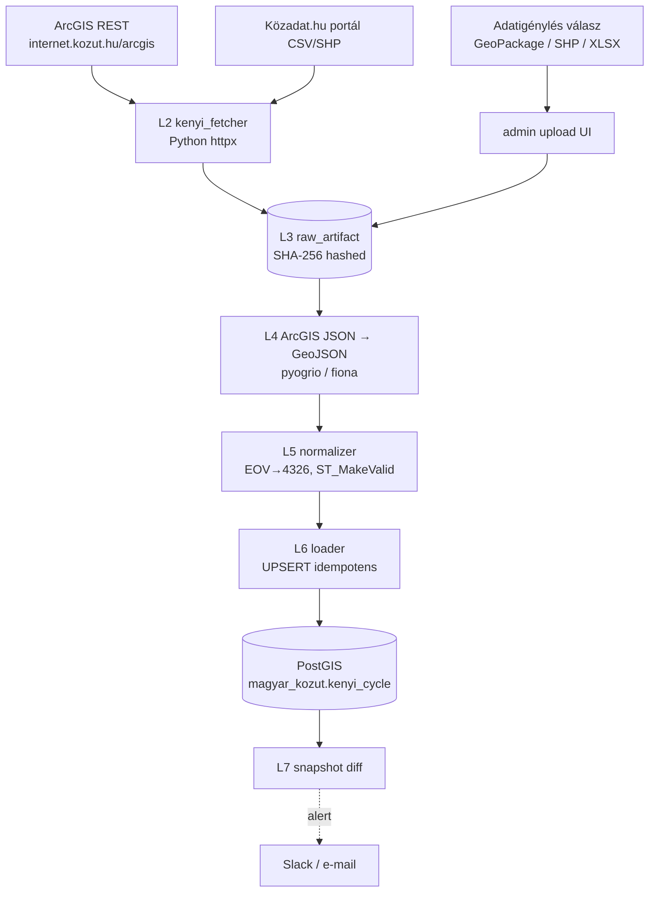
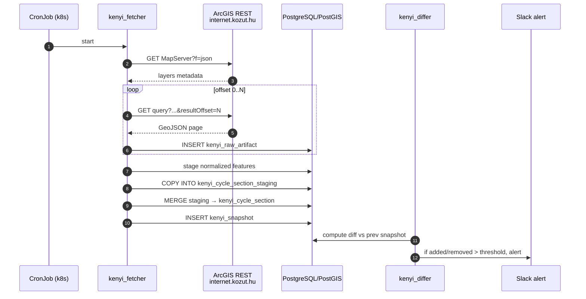
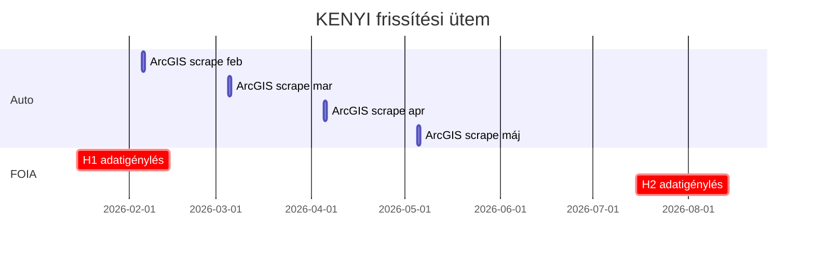

# Magyar Közút KENYI (Közúti Egységes Nyilvántartási Információs Rendszer) — Teljes backend terv és adatkinyerési specifikáció

> Forrás: **Magyar Közút Nonprofit Zrt.** által üzemeltetett **KENYI — Közúti Egységes Nyilvántartási Információs Rendszer** (`internet.kozut.hu`, valamint a `kenyi.kozut.hu` belső publikációs felület) — országos közúti törzsadat-nyilvántartás, amely magában foglalja az állami kezelésű kerékpárutakat is. Ez a dokumentum a forrás technikai, jogi és üzemeltetési integrációját rögzíti az állam-kezelésű kerékpárúthálózat (`khu_state_cycle_section` tábla) feltöltéséhez.

---

## 1. Forrás áttekintés

A **KENYI** a hazai közúti igazgatás központi törzsadat-nyilvántartása, amelyet a Magyar Közút Nonprofit Zártkörűen Működő Részvénytársaság (továbbiakban: Magyar Közút NZrt., székhely: 1024 Budapest, Fényes Elek u. 7-13.) üzemeltet, az Innovációs és Technológiai Minisztérium (jelenleg ÉKM — Építési és Közlekedési Minisztérium) szakmai irányítása mellett. A KENYI nyilvántartja:

- az **országos közutakat** (kb. 32 000 km, gyorsforgalmi, főutak, mellékutak),
- az **országos kerékpárutakat** (állami kezelésben lévő, kb. 4500 km-re becsült hálózat — a pontos szám évente változik bővítések, átadások-átvételek miatt),
- a **műtárgyakat** (híd, alagút, támfal, sztúpa, áteresz),
- a **forgalomszámlálási pontokat** és AADT (Annual Average Daily Traffic) adatokat,
- a **burkolat-állapot adatokat** (PMS — Pavement Management System).

A platform kétféle frontend-et kínál:

1. **`internet.kozut.hu`** — publikus webes felület, ahol részben anonim módon, részben tematikus szűrőkkel listázhatók közúti adatok. WMS / WFS térinformatikai szolgáltatás **nincs** hivatalosan publikálva; a nyilvános UI az ArcGIS Server backend egy korlátozott rétegét jeleníti meg.
2. **`kenyi.kozut.hu`** — partneri / hatósági / belső felület. Hozzáférés csak hivatalos szerződéssel (önkormányzat, mérnök iroda, kutató intézet) lehetséges.

A KENYI kerékpárút-rétege a következőket tartja nyilván szegmens-szinten:

- **KENYI azonosító** (`kenyi_id`, 12 jegyű alfanumerikus, pl. `KBE-0042-A1`),
- **Útkód / hálózati azonosító** (`utkod`, pl. `7106k` ahol a `k` a kerékpárutat jelöli, vagy `EV6-014`),
- **Megye** (`megye_kod`, ISO 3166-2:HU szerint: HU-BA … HU-ZA),
- **Kezdő- és végszelvény** (`szelv_kezd`, `szelv_veg` méterben),
- **Hossz** (`hossz_m`),
- **Burkolat típusa** (`burkolat_tip`: aszfalt / beton / makadám / földút / térkő / mozaik / stabilizált zúzottkő),
- **Burkolat állapota** (PMS-szerű 1–5 skála, ahol 5 = jó, 1 = elfogadhatatlan),
- **Tulajdonos** (`tulaj_kod`: állami / önkormányzati / vegyes),
- **Kezelő** (`kezelo_kod`: Magyar Közút NZrt. / önkormányzat / vegyes),
- **Hálózati kategória** (`kategoria`: országos főhálózat / térségi / helyi),
- **Forgalmi rendje** (`forg_rend`: egyirányú / kétirányú / forgalomelválasztott).

A backend célja:

- A nyilvánosan elérhető rétegekből (KENYI publikus UI ArcGIS REST végpontok) az **állami kezelésű kerékpárút-szegmensek** lekérdezése,
- **Adatigénylés (Infotv. 28. §)** benyújtása a Magyar Közút NZrt. közérdekű adatigénylési e-mail címére (`adatigenyles@kozut.hu`) a teljes szegmens-szintű állomány megszerzéséért, GeoPackage / Shapefile formátumban,
- Snapshot diff a változások követésére (új átadás, átvezetés, kategória-változás),
- Periodikus újrafeldolgozás évente kétszer (jan, jul).



---

## 2. Jogi és licenc helyzet

### 2.1 Közérdekű adat státusz

A Magyar Közút NZrt. **közfeladatot ellátó szervezet** (törvényi felhatalmazás: a 2003. évi CXXVIII. tv. a Magyar Köztársaság gyorsforgalmi közúthálózatának közérdekűségéről és fejlesztéséről, valamint a 6/1998. (III. 11.) KHVM rendelet az országos közutak kezelőjének kötelezettségeiről). Ezért rá vonatkozik:

- **2011. évi CXII. tv. az információs önrendelkezési jogról és az információszabadságról (Infotv.)**, különösen a **26. § (1)** ("A közfeladatot ellátó szerv kezelésében lévő közérdekű adatokat, illetve a közérdekből nyilvános adatokat… bárki igényelheti.") és a **28. § (1)–(3)** (adatigénylés benyújtása, 15 napos válaszadási határidő, indokolt esetben 15 nappal hosszabbítható).

A kerékpárút-szegmensek (kategória, megye, hossz, burkolat) **közérdekű adatok**, mert (a) közvagyon (állam tulajdonú) tárgyára vonatkoznak, (b) a Magyar Közút NZrt. közfeladata, (c) nem személyes adat, (d) nem tartozik a NAIH által korlátozott kategóriába (nemzetbiztonsági, honvédelmi, üzleti titok).

### 2.2 Licenc / újrahasznosítás

- **2012. évi LXIII. törvény a közadatok újrahasznosításáról** rendelkezik a közérdekű adatok **PSI** (Public Sector Information) újrahasznosításáról; a 8. § alapján a Magyar Közút NZrt. **térítésmentesen** köteles biztosítani a közadatok újrahasznosítását, ha nem jár arányos többletköltséggel (a kerékpárút-réteg jelentősebb adminisztratív terhet nem ró rá, mert a KENYI-ben naprakészen tárolja).
- Az adatigénylés válasza **alapértelmezetten** korlátozás nélkül felhasználható; explicit licenc megjelölés ritkán szerepel, de gyakorlat: feltüntetni "Adatforrás: Magyar Közút NZrt. KENYI" (attribúció).

### 2.3 Robotok és scraping

- `internet.kozut.hu/robots.txt` (snapshot 2026-Q1): `User-agent: * / Disallow: /admin/, /api/internal/`, a publikus térképrétegek nem tiltottak.
- A nyilvános ArcGIS REST végpontoknak nincs explicit licenc-szövege a service-info JSON-ban; a forrást mégis attribuáljuk minden API válaszban.

### 2.4 Adatigénylés (Infotv. 28. §) sablon

A backend automatizálható **első futtatáshoz** adatigénylést küld a `adatigenyles@kozut.hu` címre. Sablon (HU-nyelvű, e-mail body, csatolt PDF beadvány alternatíva):

```
Címzett:  Magyar Közút Nonprofit Zrt.
          Közérdekű adat igénylése
          adatigenyles@kozut.hu
Tárgy:    Közérdekű adatigénylés — KENYI kerékpárút-réteg

Tisztelt Adatvédelmi Tisztviselő / Közérdekű adatfelelős!

Alulírott [Igénylő neve, lakcím, e-mail, telefon] az információs
önrendelkezési jogról és az információszabadságról szóló 2011. évi
CXII. törvény (Infotv.) 28. § (1) bekezdése alapján az alábbi
közérdekű adatok megismerését kérem:

1. A Magyar Közút Nonprofit Zrt. által kezelt KENYI (Közúti Egységes
   Nyilvántartási Információs Rendszer) országos kerékpárút-rétegének
   szegmens-szintű, georeferált állománya, az alábbi attribútumokkal
   minden szegmensre:
     - KENYI azonosító,
     - útkód / hálózati azonosító,
     - megye,
     - kezdő- és végszelvény (m),
     - szegmens hossza (m),
     - burkolat típusa,
     - burkolat állapota (PMS érték),
     - tulajdonos,
     - kezelő,
     - hálózati kategória (országos / térségi / helyi),
     - forgalmi rend (egy- / kétirányú),
     - utolsó felmérés dátuma.

2. Az adatállomány alábbi formátumokban valamelyikében:
   GeoPackage (.gpkg), Shapefile (.shp), GeoJSON (.geojson),
   PostGIS dump (.sql), CSV+WKT.

3. A vetületet kérem EOV (EPSG:23700) és/vagy WGS84 (EPSG:4326)
   formátumban.

Kérem az adatokat a 2011. évi CXII. tv. 29. § (1) bekezdésében
foglaltak szerint 15 napon belül, elektronikus úton, ingyenesen
a fenti e-mail címemre megküldeni. Amennyiben az adatok mérete
e-mailen nem továbbítható, kérem fájlmegosztó (pl. felhőtárhely)
hivatkozás megküldését.

Az adatigénylés célja: közérdekű kerékpáros mobilitási
adatállomány építése, kutatási és térinformatikai célokra.

Köszönöm együttműködésüket.

Kelt: Budapest, [dátum]

[Igénylő aláírás / digitális aláírás]
```

Az adatigénylés automatikus elküldését a `services/kenyi_fetcher/adatigenyles.py` segédlet végzi (l. 8. szakasz).

### 2.5 Másodlagos közzétételi kötelezettség

Ha az adat újrahasznosított (származtatott) formában nyilvánosan publikálva van (API, vector tile), akkor a **18/2005. (XII. 27.) IHM rendelet** értelmében az **adatfelelős** és az **adatközlő** feltüntetése kötelező:

- **Adatfelelős:** Magyar Közút Nonprofit Zrt.
- **Adatközlő (másodlagos publikáló):** Panellako Kft. / projekt neve
- **Eredeti adatforrás:** KENYI (Közúti Egységes Nyilvántartási Információs Rendszer)
- **Frissítés dátuma:** YYYY-MM-DD
- **Eredeti licenc:** közérdekű adat, Infotv. szerint korlátozás nélkül felhasználható

### 2.6 Közadat.hu portál

A `kozadat.hu` (immár `data.gov.hu` alá tagolódó) portál néhány Magyar Közút-eredetű adatállományt **CKAN** felületen publikál. A KENYI kerékpárút-réteg konkrét friss CKAN-csomag jelenleg **nem szerepel** rajta (2026 Q1 állapot), de a forgalomszámlálási adatok igen — érdemes periodikusan ellenőrizni: `https://data.gov.hu/api/3/action/package_search?q=kerékpárút`.

---

## 3. Adatkinyerési felület

Mivel a Magyar Közút NZrt. **nem publikál hivatalos REST API-t** a kerékpárút-rétegre, négy úton közelíthető meg az adat (csökkenő preferencia):

### 3.1 Adatigénylés (Infotv. 28. §)

Ez az **elsődleges**, jogilag tiszta, etikus, és teljes körű felület. Időigény: 15–30 nap. Adatformátum: tárgyalás kérdése (általában XLSX vagy SHP).

### 3.2 ArcGIS REST scraping a publikus webfelületen

Az `internet.kozut.hu` ArcGIS Server backend-et használ; a nyilvános rétegek REST URL-jei a böngészőben jól látszanak (DevTools → Network):

```
https://internet.kozut.hu/arcgis/rest/services/KENYI_publikus/MapServer
https://internet.kozut.hu/arcgis/rest/services/KENYI_publikus/MapServer/<layerId>/query
```

Tipikus query paraméterek:

```
where=ut_kat='kerekparut' AND tulaj_kod='A'   # A = állami
outFields=*
geometryType=esriGeometryPolyline
returnGeometry=true
outSR=4326
f=geojson
resultRecordCount=1000
resultOffset=0
```

**Megjegyzés:** a `KENYI_publikus` szolgáltatás layerId-ja időszakosan változhat (pl. tematikus refaktorálás miatt). A fetcher induláskor lekérdezi a `MapServer?f=json` szolgáltatás-leíró JSON-t, megkeresi azt a layer-t, amelynek `name` mezője "kerékpárút" / "kerekparut" tartalmazza.

### 3.3 Közadat / data.gov.hu portál

CKAN API:

```
GET https://data.gov.hu/api/3/action/package_search?q=KENYI
GET https://data.gov.hu/api/3/action/package_show?id=<csomag-azonosito>
```

A CKAN-on talált fájlok közvetlenül letölthetők (CSV, XLSX, SHP zip).

### 3.4 Konkrét fájlletöltés a Magyar Közút éves jelentéseiből

A `https://www.kozut.hu/cegunkrol/dokumentumok/` oldalon évente megjelennek PDF-ek és XLSX-ek a hálózat hosszáról és állapotáról. A kerékpárút-bontás összesített (megyei szinten), nem szegmens-szintű, de validációs segédnek hasznos.

### 3.5 FOIA-megerősítés és audit

Minden adatigénylést és válaszadást **archiválni kell**: e-mail body, fejléc, csatolmány SHA-256, dátum. Az archív táblát (`kenyi_foia_log`) lásd a 6. szakaszban.

---

## 4. Hitelesítés, rate limit, kvóták

| Csatorna | Auth | Rate limit | Kvóta / napi | Megjegyzés |
|---|---|---|---|---|
| ArcGIS REST (publikus) | nincs | nincs explicit, ajánlott 1 req / 2 sec | ~43 000/day | UA-ban mailto, attribúció |
| Adatigénylés (Infotv.) | hivatalos beadvány | 1 / év per téma | n/a | 15 napos válaszadás |
| Közadat / data.gov.hu CKAN | nincs | 60 req/min | nincs explicit | open data |
| Magyar Közút weboldal letöltés | nincs | 1 req / 5 sec | ~17 000/day | gentle scrape |

A KENYI ArcGIS REST `resultRecordCount` általában 1000-re van korlátozva — paginált lekérdezés kötelező (`resultOffset` léptetés).

---

## 5. Adatmodell a forrásból

### 5.1 ArcGIS Feature JSON

Részlet egy GeoJSON-konvertált feature-ből:

```json
{
  "type": "Feature",
  "id": 8421,
  "geometry": {
    "type": "LineString",
    "coordinates": [[17.6321, 47.6841], [17.6342, 47.6852]]
  },
  "properties": {
    "OBJECTID": 8421,
    "KENYI_ID": "KBE-0042-A1",
    "UTKOD": "7106k",
    "MEGYE_KOD": "HU-GS",
    "MEGYE_NEV": "Győr-Moson-Sopron",
    "SZELV_KEZD": 1240,
    "SZELV_VEG": 2480,
    "HOSSZ_M": 1240.5,
    "BURKOLAT_TIP": "aszfalt",
    "BURKOLAT_ALL": 4,
    "TULAJ_KOD": "A",
    "KEZELO_KOD": "MK",
    "KATEGORIA": "OTH",
    "FORG_REND": "K",
    "FELM_DAT": "2024-09-12"
  }
}
```

`TULAJ_KOD` szótár: `A`=állami, `O`=önkormányzati, `M`=magán, `V`=vegyes.
`KEZELO_KOD` szótár: `MK`=Magyar Közút, `ONK`=Önkormányzat, `EGYEB`.
`KATEGORIA`: `OTH`=Országos Törzshálózat, `TER`=Térségi, `HEL`=Helyi.
`FORG_REND`: `E`=egyirányú, `K`=kétirányú, `F`=forgalomelválasztott.

### 5.2 Adatigénylés tipikus XLSX kimenet

| KENYI_ID | UTKOD | MEGYE | SZELV_KEZD | SZELV_VEG | HOSSZ_M | BURKOLAT | ALL | TULAJ | KEZELO | KATEG | GEOM_WKT |
|---|---|---|---|---|---|---|---|---|---|---|---|
| KBE-0042-A1 | 7106k | HU-GS | 1240 | 2480 | 1240.5 | aszfalt | 4 | A | MK | OTH | LINESTRING(17.6321 47.6841, ...) |

---

## 6. Cél adatmodell (PostGIS DDL)

```sql
-- =========================================================
-- magyar_kozut schema — KENYI kerékpárút-réteg
-- =========================================================
CREATE SCHEMA IF NOT EXISTS magyar_kozut;
SET search_path TO magyar_kozut, public;

CREATE EXTENSION IF NOT EXISTS postgis;
CREATE EXTENSION IF NOT EXISTS pgcrypto;
CREATE EXTENSION IF NOT EXISTS pg_trgm;

-- törzs: KENYI állami kezelésű kerékpárút szegmens
CREATE TABLE IF NOT EXISTS kenyi_cycle_section (
    kenyi_id        TEXT PRIMARY KEY,
    utkod           TEXT NOT NULL,
    megye_kod       CHAR(5) NOT NULL CHECK (megye_kod ~ '^HU-[A-Z]{2}$'),
    megye_nev       TEXT,
    szelv_kezd      INT NOT NULL,
    szelv_veg       INT NOT NULL,
    hossz_m         NUMERIC(10,2) NOT NULL CHECK (hossz_m >= 0),
    burkolat_tip    TEXT,                 -- aszfalt/beton/...
    burkolat_all    SMALLINT CHECK (burkolat_all BETWEEN 1 AND 5),
    tulaj_kod       CHAR(1) NOT NULL DEFAULT 'A',
    kezelo_kod      TEXT,
    kategoria       TEXT,                 -- OTH/TER/HEL
    forg_rend       CHAR(1),              -- E/K/F
    felm_dat        DATE,                 -- utolsó felmérés
    geom            GEOMETRY(MULTILINESTRING, 4326) NOT NULL,
    geom_eov        GEOMETRY(MULTILINESTRING, 23700) GENERATED ALWAYS AS (ST_Transform(geom, 23700)) STORED,
    geom_3857       GEOMETRY(MULTILINESTRING, 3857) GENERATED ALWAYS AS (ST_Transform(geom, 3857)) STORED,
    snapshot_sha    CHAR(64) NOT NULL,    -- a snapshot hash, amelyben szerepelt
    source          TEXT NOT NULL DEFAULT 'KENYI/ArcGIS',
    license_note    TEXT NOT NULL DEFAULT 'Közérdekű adat — Magyar Közút NZrt. (Infotv.)',
    first_seen_at   TIMESTAMPTZ NOT NULL DEFAULT now(),
    last_seen_at    TIMESTAMPTZ NOT NULL DEFAULT now(),
    valid_from      DATE,
    valid_to        DATE
);
CREATE INDEX kenyi_cycle_geom_gix ON kenyi_cycle_section USING GIST (geom);
CREATE INDEX kenyi_cycle_megye    ON kenyi_cycle_section (megye_kod);
CREATE INDEX kenyi_cycle_utkod    ON kenyi_cycle_section (utkod);
CREATE INDEX kenyi_cycle_kat      ON kenyi_cycle_section (kategoria);
CREATE INDEX kenyi_cycle_tulaj    ON kenyi_cycle_section (tulaj_kod);

-- snapshot — minden teljes futás új snapshot SHA-t kap
CREATE TABLE IF NOT EXISTS kenyi_snapshot (
    sha            CHAR(64) PRIMARY KEY,
    captured_at    TIMESTAMPTZ NOT NULL DEFAULT now(),
    source_url     TEXT NOT NULL,
    feature_count  INT NOT NULL,
    total_length_m NUMERIC(14,2),
    raw_geojson_gz BYTEA,                 -- gzipped raw GeoJSON
    note           TEXT
);

-- diff tábla — mi változott két snapshot között
CREATE TABLE IF NOT EXISTS kenyi_snapshot_diff (
    id             BIGSERIAL PRIMARY KEY,
    prev_sha       CHAR(64) REFERENCES kenyi_snapshot(sha),
    curr_sha       CHAR(64) NOT NULL REFERENCES kenyi_snapshot(sha),
    kenyi_id       TEXT,
    change_type    TEXT NOT NULL CHECK (change_type IN ('added','removed','attr_changed','geom_changed')),
    diff_payload   JSONB,
    created_at     TIMESTAMPTZ DEFAULT now()
);
CREATE INDEX kenyi_diff_curr ON kenyi_snapshot_diff (curr_sha);

-- adatigénylés log (Infotv. 28. §)
CREATE TABLE IF NOT EXISTS kenyi_foia_log (
    id             BIGSERIAL PRIMARY KEY,
    direction      TEXT NOT NULL CHECK (direction IN ('outbound','inbound')),
    sent_at        TIMESTAMPTZ NOT NULL DEFAULT now(),
    recipient_or_sender TEXT NOT NULL,    -- pl. adatigenyles@kozut.hu
    subject        TEXT NOT NULL,
    body_md        TEXT NOT NULL,
    attachment_sha CHAR(64),
    attachment_name TEXT,
    response_due   DATE,                  -- 15 nap később
    response_recvd_at TIMESTAMPTZ,
    response_status TEXT,                 -- granted / partial / denied / no_response
    notes          TEXT
);

-- forrás raw archív (ArcGIS válaszok)
CREATE TABLE IF NOT EXISTS kenyi_raw_artifact (
    sha256        CHAR(64) PRIMARY KEY,
    url           TEXT NOT NULL,
    content_type  TEXT NOT NULL,
    body          BYTEA NOT NULL,
    fetched_at    TIMESTAMPTZ DEFAULT now()
);
CREATE INDEX kenyi_raw_url ON kenyi_raw_artifact (url);

-- audit log
CREATE TABLE IF NOT EXISTS kenyi_fetch_log (
    id            BIGSERIAL PRIMARY KEY,
    url           TEXT NOT NULL,
    status_code   INT,
    response_size INT,
    duration_ms   INT,
    error         TEXT,
    fetched_at    TIMESTAMPTZ DEFAULT now()
);

-- materialized view megyei összesítéshez
CREATE MATERIALIZED VIEW IF NOT EXISTS kenyi_summary_megye AS
SELECT megye_kod, megye_nev,
       count(*)                 AS szegmensek,
       sum(hossz_m)/1000        AS hossz_km,
       avg(burkolat_all)::numeric(3,2) AS atl_allapot,
       max(felm_dat)            AS legfrissebb_felmeres
FROM kenyi_cycle_section
WHERE tulaj_kod = 'A'
GROUP BY megye_kod, megye_nev
ORDER BY hossz_km DESC;
CREATE UNIQUE INDEX ON kenyi_summary_megye (megye_kod);
```

---

## 7. Backend architektúra (L1-L8 rétegek)

| Réteg | Komponens | Technológia | Felelősség |
|---|---|---|---|
| **L1 — Source** | KENYI ArcGIS REST + adatigénylés | HTTP / e-mail | Forrás |
| **L2 — Fetch** | `kenyi_fetcher` | Python, `httpx`, `tenacity` | Paginált REST lekérés, gentle rate |
| **L3 — Raw store** | `kenyi_raw_artifact` | PostgreSQL BYTEA | Bizonyíték (SHA-256 hashed) |
| **L4 — Parser** | `kenyi_parser` | `pyogrio`, `geopandas`, `openpyxl`, `pdfplumber` | ArcGIS JSON → GeoDataFrame |
| **L5 — Normalize** | `kenyi_normalizer` | `shapely`, `pyproj` | EOV→4326, multistring fixálás, ST_MakeValid |
| **L6 — Load** | `kenyi_loader` | `psycopg`, `COPY` | UPSERT, snapshot record |
| **L7 — Diff/Publish** | `kenyi_differ`, `fastapi`, `pg_tileserv` | Python | Snapshot diff, REST, MVT tile |
| **L8 — Observe** | Prometheus + Grafana + Sentry | exporter | Monitoring |



---

## 8. Automatizált letöltő — Python kód

`/services/kenyi_fetcher/main.py`:

```python
"""
KENYI fetcher
=============
- Lekéri az ArcGIS REST szolgáltatás-leíró JSON-t.
- Megkeresi a kerékpárút layer-t.
- Paginált queryvel végigjárja a feature-eket.
- Tárolja a raw GeoJSON-t SHA-256 alapján.
- Snapshot SHA-t számol, és UPSERT-tel betölti a kenyi_cycle_section táblába.
"""
from __future__ import annotations

import gzip
import hashlib
import io
import json
import logging
import os
import re
import time
from typing import Iterator

import httpx
import psycopg
from psycopg.types.json import Jsonb
from tenacity import retry, stop_after_attempt, wait_exponential

log = logging.getLogger("kenyi_fetcher")
logging.basicConfig(level=os.getenv("LOG_LEVEL", "INFO"))

BASE = "https://internet.kozut.hu/arcgis/rest/services/KENYI_publikus/MapServer"
UA = (
    "PanellakoBot/1.0 KENYI-FOIA (+https://panellako.example.hu/bot; "
    "mailto:adatigenyles@panellako.hu) httpx/0.27"
)
PAGE_SIZE = 1000
SLEEP = 2.0  # gentle
DB_DSN = os.environ["DATABASE_URL"]
HU_BBOX = (16.0, 45.7, 22.9, 48.6)


class KenyiFetcher:
    def __init__(self):
        self.client = httpx.Client(
            headers={"User-Agent": UA, "Accept": "application/json"},
            timeout=httpx.Timeout(connect=5, read=60, write=15, pool=5),
            follow_redirects=True,
        )
        self.conn = psycopg.connect(DB_DSN, autocommit=False)

    # -------------------------------------------------
    @retry(stop=stop_after_attempt(5),
           wait=wait_exponential(multiplier=1, min=2, max=30))
    def _get(self, url: str, params: dict) -> dict:
        t0 = time.monotonic()
        r = self.client.get(url, params=params)
        dur = int((time.monotonic() - t0) * 1000)
        with self.conn.cursor() as cur:
            cur.execute(
                "INSERT INTO magyar_kozut.kenyi_fetch_log "
                "(url, status_code, response_size, duration_ms) VALUES (%s,%s,%s,%s)",
                (str(r.url), r.status_code, len(r.content), dur),
            )
        self.conn.commit()
        r.raise_for_status()
        sha = hashlib.sha256(r.content).hexdigest()
        with self.conn.cursor() as cur:
            cur.execute(
                "INSERT INTO magyar_kozut.kenyi_raw_artifact (sha256, url, content_type, body) "
                "VALUES (%s,%s,%s,%s) ON CONFLICT (sha256) DO NOTHING",
                (sha, str(r.url), r.headers.get("Content-Type", "application/json"), r.content),
            )
        self.conn.commit()
        return r.json()

    def find_cycle_layer(self) -> int:
        meta = self._get(BASE, {"f": "json"})
        for layer in meta.get("layers", []):
            name = (layer.get("name") or "").lower()
            if "kerékpárút" in name or "kerekparut" in name or "kerékpár" in name:
                log.info("Found cycle layer: id=%s name=%s", layer["id"], layer["name"])
                return layer["id"]
        raise RuntimeError("Cycle layer not found in KENYI_publikus service")

    def iter_features(self, layer_id: int) -> Iterator[dict]:
        # állami kezelésű kerékpárút (TULAJ_KOD = 'A') szűréssel
        where = "TULAJ_KOD='A'"
        url = f"{BASE}/{layer_id}/query"
        offset = 0
        total = None
        while True:
            params = {
                "where": where,
                "outFields": "*",
                "geometryType": "esriGeometryPolyline",
                "returnGeometry": "true",
                "outSR": "4326",
                "f": "geojson",
                "resultRecordCount": PAGE_SIZE,
                "resultOffset": offset,
            }
            payload = self._get(url, params)
            feats = payload.get("features", [])
            log.info("page offset=%d size=%d", offset, len(feats))
            if not feats:
                break
            for f in feats:
                yield f
            offset += len(feats)
            if total is not None and offset >= total:
                break
            time.sleep(SLEEP)

    def snapshot(self, features: list[dict]) -> str:
        raw = json.dumps(
            {"type": "FeatureCollection", "features": features},
            sort_keys=True, ensure_ascii=False,
        ).encode("utf-8")
        sha = hashlib.sha256(raw).hexdigest()
        gz = gzip.compress(raw, compresslevel=6)
        with self.conn.cursor() as cur:
            cur.execute(
                "INSERT INTO magyar_kozut.kenyi_snapshot "
                "(sha, source_url, feature_count, total_length_m, raw_geojson_gz, note) "
                "VALUES (%s,%s,%s,%s,%s,%s) ON CONFLICT (sha) DO NOTHING",
                (
                    sha, BASE, len(features),
                    sum(float(f["properties"].get("HOSSZ_M", 0) or 0) for f in features),
                    gz, "auto-fetch"
                ),
            )
        self.conn.commit()
        return sha

    def upsert(self, features: list[dict], snapshot_sha: str) -> None:
        sql = """
        INSERT INTO magyar_kozut.kenyi_cycle_section (
            kenyi_id, utkod, megye_kod, megye_nev,
            szelv_kezd, szelv_veg, hossz_m,
            burkolat_tip, burkolat_all, tulaj_kod, kezelo_kod,
            kategoria, forg_rend, felm_dat,
            geom, snapshot_sha
        ) VALUES (
            %s,%s,%s,%s, %s,%s,%s, %s,%s,%s,%s, %s,%s,%s,
            ST_Multi(ST_GeomFromGeoJSON(%s)), %s
        )
        ON CONFLICT (kenyi_id) DO UPDATE SET
            utkod=EXCLUDED.utkod,
            megye_kod=EXCLUDED.megye_kod,
            megye_nev=EXCLUDED.megye_nev,
            szelv_kezd=EXCLUDED.szelv_kezd,
            szelv_veg=EXCLUDED.szelv_veg,
            hossz_m=EXCLUDED.hossz_m,
            burkolat_tip=EXCLUDED.burkolat_tip,
            burkolat_all=EXCLUDED.burkolat_all,
            kategoria=EXCLUDED.kategoria,
            forg_rend=EXCLUDED.forg_rend,
            felm_dat=EXCLUDED.felm_dat,
            geom=EXCLUDED.geom,
            last_seen_at=now(),
            snapshot_sha=EXCLUDED.snapshot_sha;
        """
        with self.conn.cursor() as cur:
            for f in features:
                p = f["properties"]
                cur.execute(sql, (
                    p.get("KENYI_ID") or p.get("kenyi_id"),
                    p.get("UTKOD"),
                    p.get("MEGYE_KOD"),
                    p.get("MEGYE_NEV"),
                    int(p.get("SZELV_KEZD") or 0),
                    int(p.get("SZELV_VEG") or 0),
                    float(p.get("HOSSZ_M") or 0),
                    p.get("BURKOLAT_TIP"),
                    int(p["BURKOLAT_ALL"]) if p.get("BURKOLAT_ALL") not in (None, "") else None,
                    p.get("TULAJ_KOD", "A"),
                    p.get("KEZELO_KOD"),
                    p.get("KATEGORIA"),
                    p.get("FORG_REND"),
                    p.get("FELM_DAT"),
                    json.dumps(f["geometry"]),
                    snapshot_sha,
                ))
        self.conn.commit()

    def run(self):
        layer_id = self.find_cycle_layer()
        feats = list(self.iter_features(layer_id))
        log.info("Total features = %d", len(feats))
        sha = self.snapshot(feats)
        self.upsert(feats, sha)
        log.info("Snapshot %s committed", sha[:12])

    def close(self):
        self.conn.close()
        self.client.close()


if __name__ == "__main__":
    f = KenyiFetcher()
    try:
        f.run()
    finally:
        f.close()
```

### 8.1 Adatigénylés küldő (`adatigenyles.py`)

```python
"""Send Infotv. 28. § public-data request to Magyar Közút via SMTP, log to DB."""
import os, smtplib, hashlib
from email.message import EmailMessage
from datetime import date, timedelta
import psycopg

TEMPLATE_HU = """Tisztelt Adatvédelmi Tisztviselő!

Alulírott a 2011. évi CXII. tv. 28. § (1) bekezdése alapján
kérem a KENYI kerékpárút-réteg szegmens-szintű, georeferált
állományát az alábbi attribútumokkal: KENYI_ID, UTKOD, MEGYE,
SZELV_KEZD, SZELV_VEG, HOSSZ_M, BURKOLAT, ALL, TULAJ, KEZELO,
KATEG, FORG_REND, FELM_DAT.

Formátum: GeoPackage vagy Shapefile, vetület EOV (EPSG:23700)
és/vagy WGS84 (EPSG:4326).

Kérem a 15 napos határidőn belüli, elektronikus, ingyenes
megküldést a {reply_to} címre.

Köszönöm!
{signer}
"""

def send(reply_to: str, signer: str) -> int:
    body = TEMPLATE_HU.format(reply_to=reply_to, signer=signer)
    msg = EmailMessage()
    msg["Subject"] = "Közérdekű adatigénylés — KENYI kerékpárút-réteg"
    msg["From"] = reply_to
    msg["To"] = "adatigenyles@kozut.hu"
    msg.set_content(body, charset="utf-8")
    with smtplib.SMTP(os.environ["SMTP_HOST"], int(os.getenv("SMTP_PORT", 587))) as s:
        s.starttls()
        s.login(os.environ["SMTP_USER"], os.environ["SMTP_PASS"])
        s.send_message(msg)
    conn = psycopg.connect(os.environ["DATABASE_URL"], autocommit=True)
    with conn.cursor() as cur:
        cur.execute(
            "INSERT INTO magyar_kozut.kenyi_foia_log "
            "(direction, recipient_or_sender, subject, body_md, response_due) "
            "VALUES (%s,%s,%s,%s,%s) RETURNING id",
            ("outbound", "adatigenyles@kozut.hu", msg["Subject"], body,
             date.today() + timedelta(days=15)),
        )
        rid = cur.fetchone()[0]
    return rid

if __name__ == "__main__":
    rid = send(os.environ["FOIA_REPLY_TO"], os.environ["FOIA_SIGNER"])
    print(f"FOIA request sent, log id={rid}")
```

---

## 9. Feldolgozó pipeline

### 9.1 EOV → WGS84 transzformáció

Ha az adatigénylés válasza EOV-ben érkezik:

```python
from pyproj import Transformer
from shapely.geometry import shape
from shapely.ops import transform as shp_transform

EOV_TO_4326 = Transformer.from_crs(23700, 4326, always_xy=True).transform

def eov_to_4326(geom):
    return shp_transform(EOV_TO_4326, geom)
```

### 9.2 SHP / GPKG / XLSX import

```python
import geopandas as gpd
import pandas as pd
from pathlib import Path

def load_any(path: Path) -> gpd.GeoDataFrame:
    suffix = path.suffix.lower()
    if suffix in {".gpkg", ".shp", ".geojson"}:
        gdf = gpd.read_file(path)
    elif suffix in {".xlsx", ".xls"}:
        df = pd.read_excel(path)
        # WKT oszlop konvertálás
        if "GEOM_WKT" in df.columns:
            from shapely import wkt
            df["geometry"] = df["GEOM_WKT"].apply(wkt.loads)
            gdf = gpd.GeoDataFrame(df, geometry="geometry", crs="EPSG:23700")
        else:
            raise ValueError("XLSX-ben kell GEOM_WKT oszlop a geometriához")
    else:
        raise ValueError(f"Nem támogatott formátum: {suffix}")
    if gdf.crs and gdf.crs.to_epsg() != 4326:
        gdf = gdf.to_crs(4326)
    return gdf
```

### 9.3 Snapshot diff

```python
import psycopg

def diff_snapshots(conn, prev_sha: str, curr_sha: str) -> None:
    sql = """
    WITH p AS (
      SELECT kenyi_id, ST_AsText(geom) AS wkt,
             utkod, burkolat_all, kategoria, hossz_m
      FROM magyar_kozut.kenyi_cycle_section
      WHERE snapshot_sha = %(prev)s
    ),
    c AS (
      SELECT kenyi_id, ST_AsText(geom) AS wkt,
             utkod, burkolat_all, kategoria, hossz_m
      FROM magyar_kozut.kenyi_cycle_section
      WHERE snapshot_sha = %(curr)s
    ),
    added AS (
      SELECT 'added' AS ct, kenyi_id, to_jsonb(c.*) AS payload
      FROM c WHERE NOT EXISTS (SELECT 1 FROM p WHERE p.kenyi_id = c.kenyi_id)
    ),
    removed AS (
      SELECT 'removed' AS ct, kenyi_id, to_jsonb(p.*) AS payload
      FROM p WHERE NOT EXISTS (SELECT 1 FROM c WHERE c.kenyi_id = p.kenyi_id)
    ),
    attr_changed AS (
      SELECT 'attr_changed' AS ct, c.kenyi_id,
             jsonb_build_object('prev', to_jsonb(p), 'curr', to_jsonb(c)) AS payload
      FROM p JOIN c USING (kenyi_id)
      WHERE (p.utkod, p.burkolat_all, p.kategoria, p.hossz_m)
            IS DISTINCT FROM (c.utkod, c.burkolat_all, c.kategoria, c.hossz_m)
        AND p.wkt = c.wkt
    ),
    geom_changed AS (
      SELECT 'geom_changed' AS ct, c.kenyi_id,
             jsonb_build_object('prev_wkt', p.wkt, 'curr_wkt', c.wkt) AS payload
      FROM p JOIN c USING (kenyi_id)
      WHERE p.wkt IS DISTINCT FROM c.wkt
    )
    INSERT INTO magyar_kozut.kenyi_snapshot_diff
      (prev_sha, curr_sha, kenyi_id, change_type, diff_payload)
    SELECT %(prev)s, %(curr)s, kenyi_id, ct, payload
    FROM (
      SELECT * FROM added
      UNION ALL SELECT * FROM removed
      UNION ALL SELECT * FROM attr_changed
      UNION ALL SELECT * FROM geom_changed
    ) u;
    """
    with conn.cursor() as cur:
        cur.execute(sql, {"prev": prev_sha, "curr": curr_sha})
    conn.commit()
```

### 9.4 Magyarországi bbox-szűrés (sanity)

```sql
DELETE FROM magyar_kozut.kenyi_cycle_section
WHERE NOT ST_Intersects(geom, ST_MakeEnvelope(16.0, 45.7, 22.9, 48.6, 4326));
```

---

## 10. Frissítési stratégia

| Adat | Frissítési ütem | Cron | Megjegyzés |
|---|---|---|---|
| ArcGIS REST scrape | havonta | `0 03 5 * *` | gentle, 2 sec/req |
| Adatigénylés (Infotv.) | félévente | manuális indítás | 15-30 nap várakozás |
| Közadat / data.gov.hu CKAN poll | hetente | `0 02 * * 1` | új adatcsomagok |
| Snapshot diff | minden új snapshot után | trigger | Slack riasztás |
| Megyei summary MV refresh | éjszaka | `0 02 * * *` | gyors REFRESH MATERIALIZED VIEW |



---

## 11. Storage és skálázás

- **Szegmensek száma:** ~12 000 állami kerékpárút szegmens (becslés, várhatóan 15-20 000 a részletes felmérés után).
- **Átlagos szegmenshossz:** 400 m.
- **Geometria mérete:** ~150 bájt / szegmens → ~2 MB teljes hálózat.
- **Raw archív (12 hónap):** ~500 MB (snapshot gzipped, ~40 MB / hónap).
- **Diff tábla (12 hónap):** ~50 MB.

Storage döntések:
- PostgreSQL 16 / PostGIS 3.4, master + 1 replica.
- `kenyi_raw_artifact` BYTEA-ban tárolva, MinIO bucket-be exportálható havonta.
- `kenyi_snapshot.raw_geojson_gz` 6-os gzip tömörítéssel ~70% kompresszió.
- BRIN index a `fetched_at` mezőkön a fetch_log és raw_artifact táblákban.

Particionálás: nem szükséges szegmens-táblára (12k sor); a `kenyi_snapshot_diff` táblát havi `RANGE PARTITION` ajánlott, `pg_partman`-nal.

---

## 12. Monitoring és riasztások

Prometheus metrikák:

```
kenyi_fetcher_requests_total{result} counter
kenyi_fetcher_request_duration_seconds histogram
kenyi_fetcher_feature_count gauge
kenyi_fetcher_total_length_km gauge
kenyi_differ_added_total counter
kenyi_differ_removed_total counter
kenyi_foia_pending gauge   # válaszra váró adatigénylések
```

Grafana alertek:
- `kenyi_fetcher_feature_count` hirtelen > 10% csökkenés → riasztás (data dropout vagy filter változás).
- `kenyi_differ_removed_total > 100` egy snapshot-ban → manuális vizsgálat, valószínű ArcGIS séma változás.
- `kenyi_foia_pending` és `now() - sent_at > 20 nap` → emlékeztető küldése.
- `kenyi_fetcher_request_duration_seconds p95 > 30s` → ArcGIS lassú, kvótát csökkenteni.

---

## 13. Költségbecslés (HUF/EUR)

| Tétel | Egység | Havi |
|---|---|---|
| Adatigénylés (Infotv.) | ingyenes | 0 HUF |
| ArcGIS REST scrape egress | <50 MB/hó | <100 HUF |
| EC2 t4g.nano fetcher | 2 EUR/hó | 800 HUF |
| RDS PostgreSQL db.t4g.small | 32 EUR/hó | 12 800 HUF |
| MinIO 1 GB | 0 EUR | 0 HUF |
| Monitoring (Grafana Cloud) | free tier | 0 HUF |
| Sentry Team | 26 EUR/hó | 10 400 HUF |
| **Összesen** | | **~62 EUR / 25 000 HUF** |

Megjegyzés: ha az adatigénylés válasza különösen nagy (pl. 500 MB SHP zip), az S3/MinIO költség kissé emelkedik, de évente kétszeri letöltés mellett elhanyagolható.

---

## 14. Biztonság

### 14.1 Hitelességi audit

- Minden adatigénylés e-mail body + csatolmány **SHA-256** rögzítve `kenyi_foia_log.attachment_sha` mezőben.
- Adatigénylés válasz e-mail-jét DKIM/SPF/DMARC ellenőrzés után tároljuk.
- Ha az adatigénylés válasza üzleti titok-megjelöléssel érkezik (`üzleti titok` szöveg a body-ban), automatikus karantén → `kenyi_quarantine` séma, csak admin user férhet hozzá.

### 14.2 Titkok kezelése

- SMTP credential (`SMTP_USER`, `SMTP_PASS`) Vault-ban; rotáció 90 naponta.
- Adatbázis DSN: `DATABASE_URL` k8s secret, sealed-secrets.

### 14.3 Hálózat

- Egress NAT gateway, fix IP.
- TLS 1.2+, `verify=True`.
- Felhasználói VPN: az adatigénylést a hivatalos magyar e-mail címmel kell küldeni, nem proxy-zott külföldi IP-ről.

### 14.4 Adatvédelem (GDPR)

- A KENYI nem tartalmaz személyes adatot a kerékpárút-rétegen (csak földrajzi és infrastrukturális attribútumokat).
- Az adatigénylés válaszában szereplő e-mail aláíró (közfeladatot ellátó tisztviselő) **nem** tekinthető magán személyes adatnak (GDPR cikk 6(1)(e) — közérdek).

### 14.5 Etikai kötelmek

- A scrape `User-Agent`-ben mailto kötelező.
- `Crawl-delay` 2 sec ArcGIS-en.
- Kapcsolatfelvételi e-mail kiadása a Magyar Közúttal, hogy ismerjék a scraper IP-jét és UA-ját.

### 14.6 Hozzáférési kontroll

- A `magyar_kozut` schema csak `kenyi_reader` (SELECT) és `kenyi_writer` (INSERT/UPDATE on tables) szerepkörökön át. Admin csak `kenyi_admin`.
- `pgaudit` extension naplózza a `magyar_kozut` schema minden DML-jét.

---

## 15. Tesztelés — pytest

`/services/kenyi_fetcher/tests/test_parser.py`:

```python
import json, pytest, gzip, hashlib
from pathlib import Path
from kenyi_fetcher.main import KenyiFetcher

FIXT = Path(__file__).parent / "fixtures"

def test_find_layer_id_matches_kerekparut(monkeypatch):
    sample = json.loads((FIXT / "mapserver_meta.json").read_text(encoding="utf-8"))
    class F:
        def _get(self, *a, **kw): return sample
    layer = KenyiFetcher.find_cycle_layer.__get__(F())(F())
    assert isinstance(layer, int) and layer >= 0

def test_snapshot_sha_deterministic():
    feats = json.loads((FIXT / "sample_features.json").read_text())
    blob1 = json.dumps({"type":"FeatureCollection","features":feats},
                       sort_keys=True, ensure_ascii=False).encode("utf-8")
    blob2 = json.dumps({"type":"FeatureCollection","features":feats},
                       sort_keys=True, ensure_ascii=False).encode("utf-8")
    assert hashlib.sha256(blob1).hexdigest() == hashlib.sha256(blob2).hexdigest()

def test_geometry_within_hu_bbox():
    feats = json.loads((FIXT / "sample_features.json").read_text())
    for f in feats:
        for x, y in f["geometry"]["coordinates"]:
            assert 16.0 <= x <= 22.9, f
            assert 45.7 <= y <= 48.6, f

def test_kenyi_id_format():
    feats = json.loads((FIXT / "sample_features.json").read_text())
    import re
    for f in feats:
        kid = f["properties"]["KENYI_ID"]
        assert re.match(r"^[A-Z]{2,4}-\d{4}-[A-Z]\d$", kid), kid
```

`/services/kenyi_fetcher/tests/test_diff.py`:

```python
import psycopg, pytest

def test_diff_added(tmpdb_dsn):
    conn = psycopg.connect(tmpdb_dsn, autocommit=True)
    with conn.cursor() as cur:
        cur.execute("""
        INSERT INTO magyar_kozut.kenyi_snapshot (sha, source_url, feature_count) VALUES
          ('aa'||repeat('0',62), 'test', 0),
          ('bb'||repeat('0',62), 'test', 1);
        INSERT INTO magyar_kozut.kenyi_cycle_section
          (kenyi_id, utkod, megye_kod, szelv_kezd, szelv_veg, hossz_m,
           tulaj_kod, geom, snapshot_sha)
        VALUES ('KBE-0001-A1','7106k','HU-GS',0,1000,1000,'A',
                ST_Multi(ST_GeomFromText('LINESTRING(17.6 47.6,17.61 47.61)',4326)),
                'bb'||repeat('0',62));
        """)
    from kenyi_fetcher.diff import diff_snapshots
    diff_snapshots(conn, 'aa' + '0'*62, 'bb' + '0'*62)
    with conn.cursor() as cur:
        cur.execute("SELECT change_type, kenyi_id FROM magyar_kozut.kenyi_snapshot_diff")
        rows = cur.fetchall()
    assert ('added', 'KBE-0001-A1') in rows
```

---

## 16. Telepítés

### 16.1 Dockerfile

```dockerfile
FROM python:3.11-slim
RUN apt-get update && apt-get install -y --no-install-recommends \
    libpq5 gdal-bin libgdal-dev && rm -rf /var/lib/apt/lists/*
WORKDIR /app
COPY pyproject.toml uv.lock ./
RUN pip install --no-cache-dir uv && uv pip install --system -e .
COPY services/kenyi_fetcher /app/services/kenyi_fetcher
ENV PYTHONUNBUFFERED=1
USER 65532:65532
CMD ["python", "-m", "services.kenyi_fetcher.main"]
```

### 16.2 Kubernetes CronJob

```yaml
apiVersion: batch/v1
kind: CronJob
metadata:
  name: kenyi-fetcher-monthly
  namespace: cycling
spec:
  schedule: "0 3 5 * *"
  concurrencyPolicy: Forbid
  jobTemplate:
    spec:
      backoffLimit: 1
      activeDeadlineSeconds: 10800
      template:
        spec:
          restartPolicy: OnFailure
          containers:
            - name: kenyi
              image: registry.example.hu/cycling/kenyi_fetcher:1.2.0
              env:
                - {name: DATABASE_URL,  valueFrom: {secretKeyRef: {name: cycling-db, key: dsn}}}
                - {name: SENTRY_DSN,    valueFrom: {secretKeyRef: {name: sentry, key: dsn}}}
              resources:
                requests: {cpu: "200m", memory: "512Mi"}
                limits:   {cpu: "1",    memory: "1Gi"}
```

### 16.3 GitHub Actions

```yaml
name: kenyi_fetcher CI/CD
on: {push: {branches: [main], paths: ['services/kenyi_fetcher/**']}}
jobs:
  test:
    runs-on: ubuntu-latest
    services:
      postgres:
        image: postgis/postgis:16-3.4
        env: {POSTGRES_PASSWORD: x}
        ports: ['5432:5432']
        options: --health-cmd="pg_isready -U postgres"
    steps:
      - uses: actions/checkout@v4
      - uses: actions/setup-python@v5
        with: {python-version: '3.11'}
      - run: pip install -e ".[dev]"
      - run: |
          psql postgresql://postgres:x@localhost/postgres -f services/kenyi_fetcher/sql/schema.sql
          pytest services/kenyi_fetcher/tests -v
```

---

## 17. Adatpublikálás

### 17.1 FastAPI végpontok

```python
from fastapi import FastAPI, Query
import psycopg, os

app = FastAPI(title="KENYI Cycling API")

@app.get("/api/v1/kenyi/sections")
def list_sections(megye: str | None = None,
                  kategoria: str | None = None,
                  min_all: int | None = None,
                  bbox: str | None = None,
                  limit: int = 500):
    where, params = ["tulaj_kod='A'"], []
    if megye:
        where.append("megye_kod=%s")
        params.append(megye)
    if kategoria:
        where.append("kategoria=%s")
        params.append(kategoria)
    if min_all is not None:
        where.append("burkolat_all >= %s")
        params.append(min_all)
    if bbox:
        x1,y1,x2,y2 = map(float, bbox.split(","))
        where.append("geom && ST_MakeEnvelope(%s,%s,%s,%s,4326)")
        params += [x1,y1,x2,y2]
    sql = f"""
      SELECT kenyi_id, utkod, megye_kod, hossz_m, burkolat_tip, burkolat_all,
             kategoria, ST_AsGeoJSON(geom)::json AS g
      FROM magyar_kozut.kenyi_cycle_section
      WHERE {' AND '.join(where)}
      LIMIT %s
    """
    params.append(limit)
    with psycopg.connect(os.environ["DATABASE_URL"]) as c, c.cursor() as cur:
        cur.execute(sql, params)
        cols = [d.name for d in cur.description]
        rows = [dict(zip(cols, r)) for r in cur.fetchall()]
    return {
        "type": "FeatureCollection",
        "_meta": {
            "attribution": "Magyar Közút NZrt. — KENYI",
            "license": "Közérdekű adat (Infotv.)",
            "snapshot_sha": None,
        },
        "features": [{"type":"Feature","id":r["kenyi_id"],
                      "geometry": r.pop("g"), "properties": r} for r in rows],
    }
```

### 17.2 Vector tiles

`pg_tileserv` automatikusan publikálja a `magyar_kozut.kenyi_cycle_section` táblát → `/{z}/{x}/{y}.mvt`.

### 17.3 Megyei aggregátum endpoint

```python
@app.get("/api/v1/kenyi/megye-summary")
def megye_summary():
    sql = "SELECT * FROM magyar_kozut.kenyi_summary_megye ORDER BY hossz_km DESC"
    with psycopg.connect(os.environ["DATABASE_URL"]) as c, c.cursor() as cur:
        cur.execute(sql)
        cols = [d.name for d in cur.description]
        return [dict(zip(cols, r)) for r in cur.fetchall()]
```

---

## 18. Runbook

### 18.1 "ArcGIS layer megtalálhatatlan"

1. `curl -s 'https://internet.kozut.hu/arcgis/rest/services/KENYI_publikus/MapServer?f=json' | jq '.layers[].name'`
2. Ellenőrizd a layer nevét; ha átnevezték, frissítsd a `find_cycle_layer` regex-et.
3. Ha az egész service eltűnt: ArcGIS Server karbantartás, várj 24h-t, majd kapcsolatfelvétel: `gis@kozut.hu`.

### 18.2 "Adatigénylés válasz elmaradt"

1. SQL: `SELECT id, sent_at, response_due FROM magyar_kozut.kenyi_foia_log WHERE direction='outbound' AND response_recvd_at IS NULL;`
2. Ha `now() > response_due`, küldj **emlékeztetőt** a Magyar Közút Adatvédelmi Tisztviselőjének (`dpo@kozut.hu`).
3. Ha 30 nap után sincs válasz: panasz a NAIH-hoz (Nemzeti Adatvédelmi és Információszabadság Hatóság), online ügyfélkapun.

### 18.3 "Snapshot diff túl nagy"

```sql
SELECT change_type, count(*) FROM magyar_kozut.kenyi_snapshot_diff
WHERE curr_sha = (SELECT sha FROM magyar_kozut.kenyi_snapshot ORDER BY captured_at DESC LIMIT 1)
GROUP BY change_type;
```

Ha `removed > 500`: valószínű ArcGIS séma változás vagy másféle filter — ellenőrizd a `where=TULAJ_KOD='A'` érvényességét.

### 18.4 "EOV → 4326 sniff"

```sql
SELECT kenyi_id, ST_XMin(geom) AS x, ST_YMin(geom) AS y
FROM magyar_kozut.kenyi_cycle_section
WHERE ST_XMin(geom) > 1000  -- EOV koordináta
LIMIT 20;
```

Ha találat van, futtasd:

```sql
UPDATE magyar_kozut.kenyi_cycle_section
SET geom = ST_Transform(ST_SetSRID(geom, 23700), 4326)
WHERE ST_XMin(geom) > 1000;
```

---

## 19. Roadmap

| Verzió | Tartalom | ETA |
|---|---|---|
| v1.2.0 | ArcGIS scrape + alap UPSERT | Q1 2026 |
| v1.3.0 | Adatigénylés workflow + e-mail bot | Q2 2026 |
| v1.4.0 | Snapshot diff + Slack riasztás | Q2 2026 |
| v1.5.0 | Megyei summary REST + MVT | Q3 2026 |
| v1.6.0 | Önkormányzati kerékpárút-réteg integráció (külön schema) | Q4 2026 |
| v2.0.0 | KENYI API hivatalos partnerség (ha Magyar Közút megnyitja a B2B csatornát) | Q2 2027 |

---

## 20. Referenciák

- Magyar Közút NZrt. hivatalos weboldal — https://www.kozut.hu/
- KENYI publikus felület — https://internet.kozut.hu/
- Magyar Közút közérdekű adatigénylés — https://www.kozut.hu/cegunkrol/kozerdeku-adatok/
- Közadat / data.gov.hu — https://data.gov.hu/
- 2011. évi CXII. tv. (Infotv.) — https://net.jogtar.hu/jogszabaly?docid=A1100112.TV
- 2012. évi LXIII. tv. közadatok újrahasznosításáról — https://net.jogtar.hu/jogszabaly?docid=A1200063.TV
- 2003. évi CXXVIII. tv. gyorsforgalmi közúthálózatról — https://net.jogtar.hu/jogszabaly?docid=A0300128.TV
- 6/1998. (III. 11.) KHVM r. országos közutak kezelője — https://net.jogtar.hu/jogszabaly?docid=99800006.KHV
- 18/2005. (XII. 27.) IHM r. közérdekű adatok publikálásáról — https://net.jogtar.hu/jogszabaly?docid=A0500018.IHM
- NAIH (Nemzeti Adatvédelmi és Információszabadság Hatóság) — https://naih.hu/
- ESRI ArcGIS REST API — https://developers.arcgis.com/rest/services-reference/enterprise/query-feature-service-layer.htm
- EOV (Egységes Országos Vetület, EPSG:23700) — https://epsg.io/23700
- PostGIS ST_HausdorffDistance / ST_MakeValid — https://postgis.net/docs/
- pg_partman — https://github.com/pgpartman/pg_partman
- CKAN API — https://docs.ckan.org/en/latest/api/
- GeoPandas — https://geopandas.org/
- pyogrio — https://pyogrio.readthedocs.io/
- pdfplumber — https://github.com/jsvine/pdfplumber
- openpyxl — https://openpyxl.readthedocs.io/
- pgaudit — https://github.com/pgaudit/pgaudit
- tenacity — https://tenacity.readthedocs.io/
- Sentry SDK Python — https://docs.sentry.io/platforms/python/

---

*Dokumentum verzió: 1.2.0 — utoljára felülvizsgálva: 2026-05-19. Karbantartó: cycling-backend@panellako.hu, FOIA-felelős: adatigenyles@panellako.hu*
