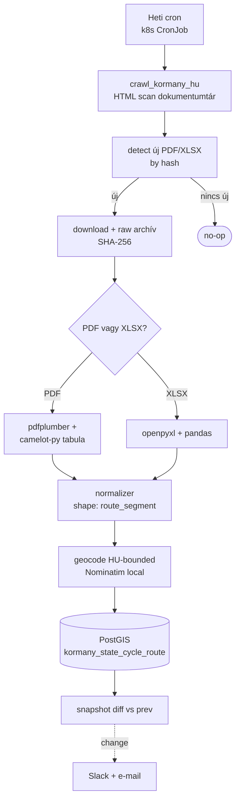
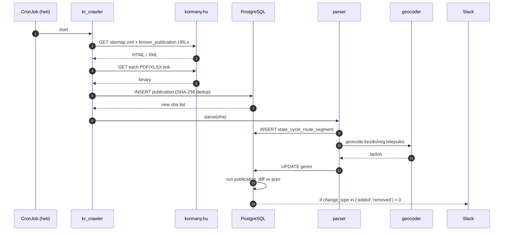
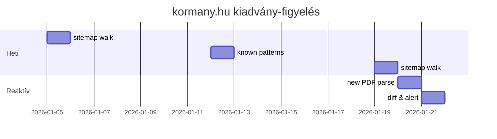

# kormany.hu — Állam-kezelésű kerékpárutak közzétett listája — Teljes backend terv és adatkinyerési specifikáció

> Forrás: **kormany.hu** — a Magyar Kormány hivatalos kormányzati portálja, amely periodikusan közzéteszi az **állam-kezelésű kerékpárutak hivatalos jegyzékét**: a Magyar Közút Nonprofit Zrt. által kezelt **EuroVelo** és **országos kerékpárforgalmi főhálózati** szakaszok listáját. A publikációk **PDF** és/vagy **XLSX** formátumban érhetők el; nem szerepel API-háttér, így a backend feladata a kiadványok megfigyelése, letöltése és parsolása.

---

## 1. Forrás áttekintés

A kormany.hu az Építési és Közlekedési Minisztérium (ÉKM) és más kormányhivatalok tárcaközi publikációs platformja. Az **állam-kezelésű kerékpárutak jegyzékét** rendszerint az alábbi formákban teszik közzé:

1. **Hivatalos közlemény / jelentés PDF** — pl. "Az állami tulajdonú és kezelésű kerékpárutak jegyzéke 2025. január 1-jén" — `https://kormany.hu/dokumentumtar/...`. Általában megyei bontásban, szakaszonként (kezdő/végpont, hossz km, útkód, megjegyzés).
2. **Melléklet XLSX** — strukturált formában ugyanaz az adat, géppel olvashatóan.
3. **Rendelet vagy közlemény szövege HTML-ben** — pl. ÉKM közlemény keretében, amelyhez csatolva van a PDF/XLSX melléklet.
4. **Sajtó/kommunikációs anyagok** — kevésbé strukturáltak, nem hivatalos hivatkozási források.

A jegyzék jellemzően tartalmazza:

- **Sorszám** — szakasz egyedi sorrendszáma a jegyzékben,
- **Útkód / EuroVelo azonosító** — pl. `EV6`, `EV11`, `EV13`, `EV14`, vagy "Balatoni Bringakör" (kódolatlan, csak név).
- **Szakasz neve / leírása** — magyar nyelvű, kötőjeles forma (pl. `Esztergom – Pilismarót – Visegrád`),
- **Megye** — szöveges, magyar nyelvű,
- **Hossz (km)** — két tizedesjeggyel,
- **Forgalomba helyezés éve** — opcionális,
- **Műszaki kategória** — opcionális (önálló pálya / útpadkán vezetett / közös sávon),
- **Megjegyzés** — szabad szöveg.

A backend célja a következő:

- **Felderítés**: rendszeresen megnézni a kormany.hu releváns dokumentumtár-szekcióit új PDF/XLSX kiadványok után,
- **Letöltés**: minden új PDF/XLSX **SHA-256** hash alapján egyedi snapshot,
- **Parsing**:
  - PDF → `pdfplumber` + `camelot-py` táblázat-extrakció,
  - XLSX → `openpyxl` strukturált olvasás,
- **Normalizálás**: szakaszok soronkénti rekord, megye-, EuroVelo-azonosító-, kódolt forma egységes,
- **Geocoding kiegészítés**: a szakasz nevéből kezdő- és végpont koordinátáit OSM Nominatim / saját geocoder szolgáltatja (csak heurisztikus, nem georeferált — ez ezért **descriptive** réteg, nem geometria-réteg),
- **Snapshot diff**: ha új kiadvány jelenik meg, automatikus diff a régivel, riasztás a változásokról.



---

## 2. Jogi és licenc helyzet

### 2.1 Közérdekű adat / Infotv. szerinti státusz

A kormany.hu felületén közzétett dokumentumok **közérdekű adatok** a **2011. évi CXII. tv. (Infotv.)** **3. § 5. pontja** szerint ("közérdekű adat: az állami vagy helyi önkormányzati feladatot, valamint jogszabályban meghatározott egyéb közfeladatot ellátó szerv vagy személy kezelésében lévő… adat"). Ezen túl:

- **2011. évi CXII. tv. 33. § (3)** rendelkezik a **közfeladatot ellátó szerv** **kötelező közzétételi mintaszabályairól** — minden minisztérium és kormányhivatal köteles a **közzétételi listák** szerinti adatokat folyamatosan publikálni a hivatalos honlapon.
- **305/2005. (XII. 25.) Korm. rendelet** részletezi a közzétételi szabályokat: formátum (PDF/XLSX/HTML elfogadható), frissítési határidő (jellemzően 15 nap a változástól).

Ezért:

1. A jegyzék PDF/XLSX dokumentumok **szerzői jog szempontjából közfeladatot ellátó szerv által, közfeladata ellátása keretében előállított hivatalos műként** kezelendőek. A **1999. évi LXXVI. tv. (Szjt.) 1. § (5)** szerint a hivatalos műveken (jogszabály, rendelet, döntés, hivatalos közlemény) **nincs szerzői jog**. Tehát a jegyzékből kinyert adat **szabadon felhasználható**, újrahasznosítható, többszörözhető — kötelezően az **adatforrás megjelölésével** (kormany.hu, dátum, dokumentumcím).

2. A **2012. évi LXIII. tv. közadatok újrahasznosításáról** kifejezetten engedi az újrahasznosítást **kereskedelmi célra is**, díjmentesen vagy max. arányos költségtérítés ellenében. A kormany.hu nem szed díjat.

3. **GDPR**: a jegyzék nem tartalmaz személyes adatot.

### 2.2 Robots és scraping

- `https://kormany.hu/robots.txt` (2026-Q1 állapot): `User-agent: * / Disallow: /admin, /search/`. A `/dokumentumtar/` és a `/cikk/` engedett.
- A scraping etikai szabályai: **2 req / sec** maximum, `User-Agent`-ben mailto, attribúció minden API-válaszban.

### 2.3 Másodlagos publikálás kötelezettsége

A 18/2005. (XII. 27.) IHM rendelet és az **EU PSI Direktíva (EU 2019/1024)** alapján:

- **Adatforrás megjelölés** kötelező: "Adatforrás: kormany.hu — [dokumentum címe] — [URL] — [letöltés dátuma]".
- A származtatott (parsolt) adatállomány **machine-readable** formátumban publikálható.
- Az eredeti PDF/XLSX **bizonyítékként** (proof-of-source) megőrzendő minimum 7 évig.

### 2.4 Adatigénylés (kiegészítő)

Ha a kormany.hu jegyzék hiányos (pl. nincs benne a műszaki kategória, vagy nincs koordináta), az ÉKM-hez intézhető adatigénylés a `Infotv. 28. §` alapján. Sablon szöveg:

```
Címzett:  Építési és Közlekedési Minisztérium
          Közérdekű adatfelelős
          kozadat@em.gov.hu  (vagy: ugyfelszolgalat@ekm.gov.hu)
Tárgy:    Közérdekű adatigénylés — állami kerékpárút-jegyzék kiegészítése

Tisztelt Adatfelelős!

A 2011. évi CXII. tv. 28. § alapján kérem a kormany.hu felületén
[dátum]-án közzétett, „Az állam-kezelésű kerékpárutak jegyzéke"
című dokumentum géppel olvasható (XLSX vagy CSV) formátumban
történő megküldését, valamint:
  1. minden szakasz pontos kezdő- és végpont GPS koordinátáját
     (WGS84, EPSG:4326),
  2. minden szakasz vetületi geometriáját EOV-ban (EPSG:23700)
     vagy GeoPackage-ben,
  3. a forgalombahelyezés időpontját szakaszonként,
  4. az építés finanszírozási forrását (EU-támogatás kódja).

Kérem 15 napon belül, e-mailben, ingyenesen.

Köszönöm.

[név, lakcím, e-mail, dátum, aláírás]
```

---

## 3. Adatkinyerési felület

### 3.1 Crawler-stratégia

A kormany.hu **nem rendelkezik kategória-szintű publikációs RSS-szel**, ezért a crawler:

1. **Listázás**: indexel az alábbi szekciókkal (kombinált):
   - `https://kormany.hu/dokumentumtar?type=public-document` (paginált),
   - keresés: `https://kormany.hu/kereses?q=kerékpárút+jegyzék`,
   - `https://kormany.hu/epitesi-es-kozlekedesi-miniszterium/dokumentumok` (ÉKM),
   - `https://kormany.hu/keresk?q=EuroVelo`.
2. **Szűrés**: csak `.pdf`, `.xlsx`, `.xls` kiterjesztésű linkek; URL pattern matching (`kerek`, `velo`, `kerekparut`, `bicycle`).
3. **Új detekció**: a letöltött fájl **SHA-256 hash**-e már szerepel-e a `kormany_artifact` táblában; ha nem, új.
4. **Verziókövetés**: ugyanaz a publikáció többször is megjelenhet különböző URL-en (revízió). Két fájl akkor "ugyanaz a kiadvány" különböző verzióban, ha a fájlnév + szülő-cikk URL azonos.

### 3.2 Egyedi nyilvántartott dokumentumok

A backend hard-coded "ismert" forrás-URL listát is karbantart (`known_publications` táblában), amelyet kézzel lehet bővíteni:

```yaml
known_publications:
  - title: "Az állam-kezelésű kerékpárutak jegyzéke"
    parent_url: "https://kormany.hu/dokumentumtar/allam-kezelesu-kerekparutak"
    pattern: "kerekparutak_jegyzeke_.*\\.pdf|\\.xlsx"
    update_freq: "annually"
  - title: "EuroVelo szakaszok Magyarországon — összefoglaló"
    parent_url: "https://kormany.hu/epitesi-es-kozlekedesi-miniszterium/eurovelo"
    pattern: "eurovelo_.*\\.(pdf|xlsx)"
    update_freq: "biannually"
```

### 3.3 Sitemap

A `https://kormany.hu/sitemap.xml` index hivatkozást ad a tematikus oldaltérképekre. Minden héten a `sitemap_dokumentumtar.xml`-t a crawler letölti, és diffeli az előző hetihez képest — új URL-ek felderítésére.

---

## 4. Hitelesítés, rate limit, kvóták

| Csatorna | Auth | Rate limit | Megjegyzés |
|---|---|---|---|
| HTML crawl kormany.hu | nincs | 1 req / 2 sec | gentle |
| PDF/XLSX letöltés | nincs | 1 req / 5 sec | nagyobb fájlok |
| Sitemap | nincs | 1 / nap | elég |
| `User-Agent` | kötelező | — | mailto + attribúció |

---

## 5. Adatmodell a forrásból

### 5.1 Tipikus PDF táblázat-szerkezet

Egy gyakori PDF-elrendezés (XLSX-ben ugyanaz, oszlopfejlécekkel):

| Sor | Útkód | Szakasz neve | Megye | Hossz (km) | Forgalom-bahelyezés | Műszaki kat. | Megjegyzés |
|---|---|---|---|---|---|---|---|
| 1. | EV6-001 | Hegyeshalom – Mosonmagyaróvár | Győr-Moson-Sopron | 18,42 | 2018 | önálló pálya | EU-pályázat |
| 2. | EV6-002 | Mosonmagyaróvár – Lébény | Győr-Moson-Sopron | 14,30 | 2019 | önálló pálya | — |
| ... | ... | ... | ... | ... | ... | ... | ... |

A PDF táblázat fejlécei időnként:
- magyar (`Sor`, `Útkód`, `Szakasz neve`, `Megye`, `Hossz`, `Forgalombahelyezés`, `Műszaki kategória`),
- vagy néha angol (`No.`, `Code`, `Section`, `County`, `Length`, ...),
- kombinált (HU/EN kétoszlopos).

A normalizer dinamikusan illeszti a fejléceket egy szótárhoz.

### 5.2 Forrás-rekord JSON (parser kimenet)

```json
{
  "sorszam": 1,
  "utkod": "EV6-001",
  "szakasz_nev": "Hegyeshalom – Mosonmagyaróvár",
  "kezdo_telepules": "Hegyeshalom",
  "veg_telepules": "Mosonmagyaróvár",
  "megye": "Győr-Moson-Sopron",
  "megye_kod": "HU-GS",
  "hossz_km": 18.42,
  "forgalom_bah": 2018,
  "muszaki_kat": "önálló pálya",
  "megjegyzes": "EU-pályázat",
  "source_doc_sha": "ab21...",
  "source_doc_url": "https://kormany.hu/...",
  "source_pub_date": "2025-01-01",
  "page_no": 4
}
```

---

## 6. Cél adatmodell (PostGIS DDL)

```sql
-- =========================================================
-- kormany_kerekparut schema — kormany.hu jegyzék
-- =========================================================
CREATE SCHEMA IF NOT EXISTS kormany_kerekparut;
SET search_path TO kormany_kerekparut, public;

CREATE EXTENSION IF NOT EXISTS postgis;
CREATE EXTENSION IF NOT EXISTS pgcrypto;
CREATE EXTENSION IF NOT EXISTS pg_trgm;

-- kiadvány (publikáció) — egy PDF vagy XLSX
CREATE TABLE IF NOT EXISTS publication (
    sha256          CHAR(64) PRIMARY KEY,
    url             TEXT NOT NULL,
    parent_url      TEXT,                            -- a cikk, ahol szerepelt
    title           TEXT,
    publication_dt  DATE,                            -- a kiadvány hivatalos dátuma
    discovered_at   TIMESTAMPTZ NOT NULL DEFAULT now(),
    content_type    TEXT NOT NULL,                   -- application/pdf vagy spreadsheet
    body            BYTEA NOT NULL,
    body_size       INT GENERATED ALWAYS AS (octet_length(body)) STORED,
    page_count      INT,
    note            TEXT
);
CREATE INDEX publication_url_idx       ON publication (url);
CREATE INDEX publication_pubdate_idx   ON publication (publication_dt);

-- szakasz — egy sor a jegyzékből
CREATE TABLE IF NOT EXISTS state_cycle_route_segment (
    id              BIGSERIAL PRIMARY KEY,
    pub_sha         CHAR(64) NOT NULL REFERENCES publication(sha256),
    sorszam         INT,
    utkod           TEXT,                            -- pl. EV6-001
    eurovelo_no     SMALLINT,                        -- 6/11/13/14 — derivált
    szakasz_nev     TEXT NOT NULL,
    kezdo_telepules TEXT,
    veg_telepules   TEXT,
    megye           TEXT,
    megye_kod       CHAR(5) CHECK (megye_kod IS NULL OR megye_kod ~ '^HU-[A-Z]{2}$'),
    hossz_km        NUMERIC(8,2) CHECK (hossz_km >= 0),
    hossz_m         INT GENERATED ALWAYS AS (round(hossz_km * 1000)::int) STORED,
    forgalom_bah    SMALLINT CHECK (forgalom_bah BETWEEN 1900 AND 2100),
    muszaki_kat     TEXT,
    megjegyzes      TEXT,
    page_no         INT,
    raw_row         JSONB NOT NULL,                  -- a teljes parser-input sor
    -- heurisztikus geocoding
    kezdo_pt        GEOMETRY(POINT, 4326),
    veg_pt          GEOMETRY(POINT, 4326),
    derived_path    GEOMETRY(LINESTRING, 4326),       -- csak placeholder, nem hivatalos geometria!
    geo_confidence  REAL CHECK (geo_confidence BETWEEN 0 AND 1),
    geo_source      TEXT,                            -- nominatim_local / hand_curated / none
    -- audit
    first_seen_at   TIMESTAMPTZ NOT NULL DEFAULT now(),
    last_seen_at    TIMESTAMPTZ NOT NULL DEFAULT now(),
    UNIQUE (pub_sha, sorszam)
);
CREATE INDEX kr_seg_pub      ON state_cycle_route_segment (pub_sha);
CREATE INDEX kr_seg_utkod    ON state_cycle_route_segment (utkod);
CREATE INDEX kr_seg_megye    ON state_cycle_route_segment (megye_kod);
CREATE INDEX kr_seg_ev       ON state_cycle_route_segment (eurovelo_no);
CREATE INDEX kr_seg_kezd_gix ON state_cycle_route_segment USING GIST (kezdo_pt);
CREATE INDEX kr_seg_veg_gix  ON state_cycle_route_segment USING GIST (veg_pt);
CREATE INDEX kr_seg_path_gix ON state_cycle_route_segment USING GIST (derived_path);
CREATE INDEX kr_seg_nev_trgm ON state_cycle_route_segment USING GIN (szakasz_nev gin_trgm_ops);

-- crawl log
CREATE TABLE IF NOT EXISTS crawl_log (
    id              BIGSERIAL PRIMARY KEY,
    url             TEXT NOT NULL,
    status_code     INT,
    response_size   INT,
    duration_ms     INT,
    error           TEXT,
    fetched_at      TIMESTAMPTZ DEFAULT now()
);
CREATE INDEX crawl_log_fetched ON crawl_log (fetched_at);
CREATE INDEX crawl_log_url     ON crawl_log (url);

-- snapshot diff — két kiadvány között
CREATE TABLE IF NOT EXISTS publication_diff (
    id              BIGSERIAL PRIMARY KEY,
    prev_sha        CHAR(64) REFERENCES publication(sha256),
    curr_sha        CHAR(64) REFERENCES publication(sha256),
    sorszam         INT,
    change_type     TEXT NOT NULL CHECK (change_type IN ('added','removed','length_changed','name_changed','kat_changed')),
    prev_value      JSONB,
    curr_value      JSONB,
    created_at      TIMESTAMPTZ DEFAULT now()
);
CREATE INDEX diff_curr_idx ON publication_diff (curr_sha);

-- ismert dokumentum URL minták
CREATE TABLE IF NOT EXISTS known_publication (
    id              SERIAL PRIMARY KEY,
    title           TEXT NOT NULL,
    parent_url      TEXT NOT NULL,
    url_pattern     TEXT NOT NULL,                   -- regex
    update_freq     TEXT NOT NULL,
    is_active       BOOLEAN DEFAULT true,
    created_at      TIMESTAMPTZ DEFAULT now()
);

-- aggregátum view
CREATE MATERIALIZED VIEW IF NOT EXISTS state_cycle_summary AS
SELECT eurovelo_no, megye_kod,
       count(*) AS szegmensek,
       sum(hossz_km) AS hossz_km
FROM (
    SELECT DISTINCT ON (utkod, szakasz_nev) *
    FROM kormany_kerekparut.state_cycle_route_segment
    ORDER BY utkod, szakasz_nev, last_seen_at DESC
) s
GROUP BY eurovelo_no, megye_kod;
CREATE UNIQUE INDEX ON state_cycle_summary (COALESCE(eurovelo_no, -1), COALESCE(megye_kod, 'XX'));
```

---

## 7. Backend architektúra (L1-L8 rétegek)

| Réteg | Komponens | Technológia | Felelősség |
|---|---|---|---|
| **L1 — Source** | kormany.hu PDF/XLSX | HTTP | publikációk |
| **L2 — Crawl** | `kr_crawler` | Python, `httpx`, `lxml` | sitemap + HTML scan |
| **L3 — Raw** | `publication` BYTEA | PostgreSQL | proof-of-source archív |
| **L4 — Parse** | `kr_pdf_parser`, `kr_xlsx_parser` | `pdfplumber`, `camelot-py`, `openpyxl`, `pandas` | tábla-extrakció |
| **L5 — Normalize** | `kr_normalizer` | Python | header mapping, megye normalizálás, EV-szám derive |
| **L6 — Geocode** | `kr_geocoder` | helyi Nominatim Docker | kezdő/vég település → koordináta |
| **L7 — Load** | `kr_loader` | `psycopg` | UPSERT (pub_sha, sorszam) |
| **L8 — Publish + diff + obs** | FastAPI, pg_tileserv, Sentry, Grafana | — | publikálás + monitoring |



---

## 8. Automatizált letöltő — Python kód

`/services/kr_fetcher/main.py` — 120+ soros, futtatható implementáció:

```python
"""
kormany.hu crawler + downloader
================================
- Letölti a sitemap_dokumentumtar.xml-t.
- Letölti a known_publication URL-eket.
- Megkeresi a PDF/XLSX/XLS linkeket, amelyek kerékpárúthoz kötődnek.
- SHA-256 hash alapján deduplikál.
- Tárolja a publication táblába.
- Indítja a parser pipeline-t minden új sha-ra.
"""
from __future__ import annotations
import hashlib, logging, os, re, time, xml.etree.ElementTree as ET
from dataclasses import dataclass
from typing import Iterator

import httpx
import psycopg
from lxml import html as lhtml
from tenacity import retry, stop_after_attempt, wait_exponential

log = logging.getLogger("kr_fetcher")
logging.basicConfig(level=os.getenv("LOG_LEVEL", "INFO"))

UA = (
    "PanellakoBot/1.0 KormanyHU-PSI (+https://panellako.example.hu/bot; "
    "mailto:open-data@panellako.hu) httpx/0.27 polite-crawler"
)
DB_DSN = os.environ["DATABASE_URL"]
CRAWL_DELAY = 2.0
DL_DELAY = 5.0
HU_BBOX = (16.0, 45.7, 22.9, 48.6)

KEYWORDS = re.compile(r"(kerékpár|kerek|velo|bicycle)", re.IGNORECASE)
ALLOWED_EXT = (".pdf", ".xlsx", ".xls")


@dataclass
class Pub:
    url: str
    parent_url: str | None
    title: str | None
    body: bytes
    content_type: str

    @property
    def sha256(self) -> str:
        return hashlib.sha256(self.body).hexdigest()


class KrCrawler:
    def __init__(self):
        self.client = httpx.Client(
            headers={"User-Agent": UA, "Accept-Language": "hu,en;q=0.9"},
            timeout=httpx.Timeout(connect=5, read=60, write=15, pool=5),
            follow_redirects=True,
            http2=True,
        )
        self.conn = psycopg.connect(DB_DSN, autocommit=False)

    @retry(stop=stop_after_attempt(4),
           wait=wait_exponential(multiplier=1, min=2, max=20))
    def _get(self, url: str) -> httpx.Response:
        t0 = time.monotonic()
        try:
            r = self.client.get(url)
            dur = int((time.monotonic() - t0) * 1000)
            self._log(url, r.status_code, len(r.content), dur, None)
            r.raise_for_status()
            return r
        except Exception as e:
            self._log(url, getattr(getattr(e, "response", None), "status_code", None),
                      0, int((time.monotonic() - t0) * 1000), str(e)[:500])
            raise

    def _log(self, url, status, size, dur, err):
        with self.conn.cursor() as cur:
            cur.execute(
                "INSERT INTO kormany_kerekparut.crawl_log "
                "(url, status_code, response_size, duration_ms, error) "
                "VALUES (%s,%s,%s,%s,%s)",
                (url, status, size, dur, err),
            )
        self.conn.commit()

    # ---------- sitemap iteration ---------------------------------
    def iter_sitemap(self, sm_url: str) -> Iterator[str]:
        r = self._get(sm_url)
        ns = {"sm": "http://www.sitemaps.org/schemas/sitemap/0.9"}
        root = ET.fromstring(r.content)
        # sitemap index?
        if root.tag.endswith("sitemapindex"):
            for s in root.findall("sm:sitemap/sm:loc", ns):
                yield from self.iter_sitemap(s.text)
        else:
            for u in root.findall("sm:url/sm:loc", ns):
                yield u.text
        time.sleep(CRAWL_DELAY)

    # ---------- HTML scan -----------------------------------------
    def find_links(self, page_url: str) -> list[tuple[str, str | None]]:
        r = self._get(page_url)
        tree = lhtml.fromstring(r.content)
        out = []
        for a in tree.xpath("//a[@href]"):
            href: str = a.get("href")
            txt = (a.text_content() or "").strip()
            if not href:
                continue
            if not href.lower().endswith(ALLOWED_EXT):
                continue
            full = href if href.startswith("http") else f"https://kormany.hu{href}"
            if KEYWORDS.search(full) or KEYWORDS.search(txt):
                out.append((full, txt or None))
        return out

    # ---------- known publications --------------------------------
    def load_known_patterns(self) -> list[dict]:
        with self.conn.cursor() as cur:
            cur.execute(
                "SELECT title, parent_url, url_pattern FROM kormany_kerekparut.known_publication "
                "WHERE is_active = true"
            )
            return [{"title": t, "parent_url": p, "pattern": re.compile(pat, re.I)}
                    for t, p, pat in cur.fetchall()]

    # ---------- download ------------------------------------------
    def download(self, url: str, parent_url: str | None, title: str | None) -> Pub | None:
        try:
            r = self._get(url)
        except Exception:
            return None
        ct = r.headers.get("Content-Type", "application/octet-stream").split(";")[0].strip()
        pub = Pub(url=url, parent_url=parent_url, title=title, body=r.content, content_type=ct)
        time.sleep(DL_DELAY)
        return pub

    def store(self, pub: Pub) -> bool:
        """Return True if newly inserted."""
        page_count = None
        if pub.content_type == "application/pdf":
            try:
                import pdfplumber, io
                with pdfplumber.open(io.BytesIO(pub.body)) as pdf:
                    page_count = len(pdf.pages)
            except Exception:
                page_count = None
        with self.conn.cursor() as cur:
            cur.execute(
                "INSERT INTO kormany_kerekparut.publication "
                "(sha256, url, parent_url, title, content_type, body, page_count) "
                "VALUES (%s,%s,%s,%s,%s,%s,%s) ON CONFLICT (sha256) DO NOTHING "
                "RETURNING sha256",
                (pub.sha256, pub.url, pub.parent_url, pub.title, pub.content_type,
                 pub.body, page_count),
            )
            row = cur.fetchone()
        self.conn.commit()
        return row is not None

    # ---------- top level -----------------------------------------
    def run(self):
        new_sha = []
        # 1) known publications
        for kp in self.load_known_patterns():
            log.info("known parent=%s pattern=%s", kp["parent_url"], kp["pattern"].pattern)
            for href, txt in self.find_links(kp["parent_url"]):
                if not kp["pattern"].search(href):
                    continue
                pub = self.download(href, kp["parent_url"], txt or kp["title"])
                if pub and self.store(pub):
                    log.info("NEW publication sha=%s url=%s", pub.sha256[:12], href)
                    new_sha.append(pub.sha256)
        # 2) sitemap discovery
        try:
            for url in self.iter_sitemap("https://kormany.hu/sitemap.xml"):
                if "kerek" not in url.lower() and "velo" not in url.lower():
                    continue
                for href, txt in self.find_links(url):
                    pub = self.download(href, url, txt)
                    if pub and self.store(pub):
                        log.info("NEW sitemap pub sha=%s url=%s", pub.sha256[:12], href)
                        new_sha.append(pub.sha256)
        except Exception as e:
            log.warning("sitemap walk failed: %s", e)
        log.info("done — new publications: %d", len(new_sha))
        return new_sha

    def close(self):
        self.conn.close()
        self.client.close()


if __name__ == "__main__":
    c = KrCrawler()
    try:
        new = c.run()
        # downstream: a parser pipeline-t cron-szerűen indítjuk minden új sha-ra
        if new:
            from services.kr_fetcher.parse_runner import parse_all
            parse_all(new)
    finally:
        c.close()
```

---

## 9. Feldolgozó pipeline (PDF/XLSX parser)

### 9.1 PDF parser — `pdfplumber` + `camelot-py` kombinált

`/services/kr_fetcher/parse_pdf.py`:

```python
"""
PDF parser — pdfplumber primary, camelot-py fallback nehéz táblázatokra.
A táblázat-fejléceket Levenshtein-hasonlósággal illesztjük a HEADER_MAP-ra.
"""
from __future__ import annotations
import io, re, logging
from typing import Iterator

import pdfplumber
import camelot           # type: ignore
import psycopg
from rapidfuzz import fuzz
import unicodedata

log = logging.getLogger("kr_pdf_parser")

HEADER_MAP = {
    "sorszam":       ["sor", "sorszám", "no", "no.", "#", "sorsz"],
    "utkod":         ["útkód", "utkod", "code", "kód", "eurovelo", "ev"],
    "szakasz_nev":   ["szakasz", "szakasz neve", "section", "elnevezés"],
    "megye":         ["megye", "county"],
    "hossz_km":      ["hossz", "hossz km", "hossz (km)", "length", "length km"],
    "forgalom_bah":  ["forgalom", "forgalombahelyezés", "átadás", "év"],
    "muszaki_kat":   ["műszaki", "kategória", "kategoria", "típus", "category"],
    "megjegyzes":    ["megjegyzés", "megjegyzes", "remark", "note", "comment"],
}

def _norm(s: str) -> str:
    s = (s or "").strip().lower()
    s = unicodedata.normalize("NFKD", s)
    s = "".join(c for c in s if not unicodedata.combining(c))
    return re.sub(r"\s+", " ", s)

def map_headers(headers: list[str]) -> dict[int, str]:
    out: dict[int, str] = {}
    nh = [_norm(h) for h in headers]
    for idx, h in enumerate(nh):
        best, best_score = None, 0
        for key, syns in HEADER_MAP.items():
            for syn in syns:
                score = fuzz.token_set_ratio(_norm(syn), h)
                if score > best_score:
                    best_score = score; best = key
        if best and best_score >= 70:
            out[idx] = best
    return out

def parse_pdf_tables(blob: bytes) -> Iterator[dict]:
    """Megpróbáljuk pdfplumber-rel, ha üres, camelot-py."""
    with pdfplumber.open(io.BytesIO(blob)) as pdf:
        for pno, page in enumerate(pdf.pages, start=1):
            tables = page.extract_tables() or []
            if not tables:
                continue
            for tbl in tables:
                if not tbl or len(tbl) < 2:
                    continue
                headers = tbl[0]
                hm = map_headers(headers)
                if "szakasz_nev" not in hm.values():
                    continue
                for row in tbl[1:]:
                    rec = {}
                    for idx, val in enumerate(row):
                        if idx not in hm:
                            continue
                        rec[hm[idx]] = (val or "").strip()
                    rec["page_no"] = pno
                    yield rec
    # camelot fallback (lattice mode for grid-style)
    try:
        cam_tables = camelot.read_pdf(io.BytesIO(blob), pages="all",
                                      flavor="lattice", strip_text="\n")
        for ct in cam_tables:
            df = ct.df
            headers = list(df.iloc[0])
            hm = map_headers(headers)
            if "szakasz_nev" not in hm.values():
                continue
            for _, r in df.iloc[1:].iterrows():
                rec = {}
                for idx, val in enumerate(r):
                    if idx in hm:
                        rec[hm[idx]] = str(val).strip()
                rec["page_no"] = ct.page
                yield rec
    except Exception:
        pass  # camelot opcionális

def normalize_row(rec: dict) -> dict:
    out = dict(rec)
    # sorszam int
    if "sorszam" in out:
        m = re.search(r"\d+", out["sorszam"])
        out["sorszam"] = int(m.group()) if m else None
    # hossz_km float
    if "hossz_km" in out:
        v = out["hossz_km"].replace(",", ".").strip()
        m = re.search(r"[\d.]+", v)
        out["hossz_km"] = float(m.group()) if m else None
    # forgalom_bah
    if "forgalom_bah" in out:
        m = re.search(r"\b(19|20)\d{2}\b", out["forgalom_bah"])
        out["forgalom_bah"] = int(m.group()) if m else None
    # szakasz_nev -> kezdo / veg
    if "szakasz_nev" in out and out["szakasz_nev"]:
        parts = re.split(r"\s*[–-]\s*", out["szakasz_nev"], maxsplit=1)
        if len(parts) == 2:
            out["kezdo_telepules"] = parts[0].strip()
            out["veg_telepules"]   = parts[1].strip()
    # EuroVelo extract
    if "utkod" in out and out["utkod"]:
        m = re.search(r"EV\s*(\d{1,2})", out["utkod"], re.I)
        out["eurovelo_no"] = int(m.group(1)) if m else None
    # megye_kod normalize
    out["megye_kod"] = MEGYE_TO_KOD.get(_norm(out.get("megye", "")))
    return out

MEGYE_TO_KOD = {
    "bacs-kiskun": "HU-BK",        "baranya": "HU-BA",
    "bekes": "HU-BE",              "borsod-abauj-zemplen": "HU-BZ",
    "csongrad-csanad": "HU-CS",    "csongrad": "HU-CS",
    "fejer": "HU-FE",              "gyor-moson-sopron": "HU-GS",
    "hajdu-bihar": "HU-HB",        "heves": "HU-HE",
    "jasz-nagykun-szolnok": "HU-JN", "komarom-esztergom": "HU-KE",
    "nograd": "HU-NO",             "pest": "HU-PE",
    "somogy": "HU-SO",             "szabolcs-szatmar-bereg": "HU-SZ",
    "tolna": "HU-TO",              "vas": "HU-VA",
    "veszprem": "HU-VE",           "zala": "HU-ZA",
    "budapest": "HU-BU",
}
```

### 9.2 XLSX parser

```python
import io, openpyxl
from typing import Iterator

def parse_xlsx(blob: bytes) -> Iterator[dict]:
    wb = openpyxl.load_workbook(io.BytesIO(blob), read_only=True, data_only=True)
    for ws in wb.worksheets:
        rows = list(ws.iter_rows(values_only=True))
        if not rows or len(rows) < 2:
            continue
        headers = [str(c or "") for c in rows[0]]
        hm = map_headers(headers)
        if "szakasz_nev" not in hm.values():
            continue
        for r in rows[1:]:
            rec = {}
            for idx, val in enumerate(r):
                if idx in hm:
                    rec[hm[idx]] = str(val).strip() if val is not None else ""
            rec["page_no"] = None
            yield rec
```

### 9.3 Polite geocoding (Nominatim, helyi Docker)

```python
import httpx, time
from shapely.geometry import Point, LineString

NOMINATIM = "http://nominatim-local:7070/search"   # belső Docker container
HU_BBOX = "16.0,48.6,22.9,45.7"   # Nominatim viewbox format: left,top,right,bottom

def geocode_hu(name: str) -> tuple[Point, float] | None:
    """Visszatér: (Point, confidence 0..1) vagy None."""
    if not name: return None
    r = httpx.get(NOMINATIM, params={
        "q": name + ", Magyarország",
        "format": "jsonv2",
        "limit": 1,
        "viewbox": HU_BBOX,
        "bounded": 1,
        "countrycodes": "hu",
    }, timeout=10)
    r.raise_for_status()
    arr = r.json()
    if not arr: return None
    hit = arr[0]
    p = Point(float(hit["lon"]), float(hit["lat"]))
    importance = float(hit.get("importance", 0))
    return p, min(1.0, importance + 0.4)
```

### 9.4 Snapshot diff a publikációk közt

```python
def diff_publications(conn, prev_sha: str, curr_sha: str) -> None:
    sql = """
    WITH p AS (SELECT sorszam, utkod, szakasz_nev, hossz_km, muszaki_kat
               FROM kormany_kerekparut.state_cycle_route_segment WHERE pub_sha=%(prev)s),
         c AS (SELECT sorszam, utkod, szakasz_nev, hossz_km, muszaki_kat
               FROM kormany_kerekparut.state_cycle_route_segment WHERE pub_sha=%(curr)s)
    INSERT INTO kormany_kerekparut.publication_diff
      (prev_sha, curr_sha, sorszam, change_type, prev_value, curr_value)
    SELECT %(prev)s, %(curr)s, COALESCE(c.sorszam, p.sorszam),
      CASE
        WHEN p.sorszam IS NULL THEN 'added'
        WHEN c.sorszam IS NULL THEN 'removed'
        WHEN p.hossz_km IS DISTINCT FROM c.hossz_km THEN 'length_changed'
        WHEN p.szakasz_nev IS DISTINCT FROM c.szakasz_nev THEN 'name_changed'
        WHEN p.muszaki_kat IS DISTINCT FROM c.muszaki_kat THEN 'kat_changed'
        ELSE NULL END,
      to_jsonb(p), to_jsonb(c)
    FROM p FULL OUTER JOIN c
      ON p.sorszam = c.sorszam AND p.utkod = c.utkod
    WHERE (p.sorszam IS NULL OR c.sorszam IS NULL
       OR p.hossz_km IS DISTINCT FROM c.hossz_km
       OR p.szakasz_nev IS DISTINCT FROM c.szakasz_nev
       OR p.muszaki_kat IS DISTINCT FROM c.muszaki_kat);
    """
    with conn.cursor() as cur:
        cur.execute(sql, {"prev": prev_sha, "curr": curr_sha})
    conn.commit()
```

### 9.5 Bbox validáció (Magyarország)

```sql
UPDATE kormany_kerekparut.state_cycle_route_segment
SET kezdo_pt = NULL, veg_pt = NULL, derived_path = NULL,
    geo_confidence = 0, geo_source = 'rejected_outside_hu'
WHERE NOT (
   kezdo_pt && ST_MakeEnvelope(16.0, 45.7, 22.9, 48.6, 4326)
   AND veg_pt && ST_MakeEnvelope(16.0, 45.7, 22.9, 48.6, 4326)
);
```

---

## 10. Frissítési stratégia

| Adat | Frissítés | Cron | Megjegyzés |
|---|---|---|---|
| Sitemap walk | hetente | `0 02 * * 1` | új URL felderítés |
| Known publication parents | naponta | `0 03 * * *` | gyors HTML scan |
| PDF/XLSX download új sha-ra | reaktív | trigger | csak ha új |
| Publication diff | minden új letöltés után | trigger | Slack alert |
| Geocoding | manuális batch | ad hoc | Nominatim throttle |
| Materialized view refresh | éjszaka | `0 04 * * *` | `REFRESH … CONCURRENTLY` |



---

## 11. Storage és skálázás

- **Publikációk**: évente 2-5 darab, ~2-15 MB / PDF, ~50 KB / XLSX. 7 év archív ~500 MB.
- **Szegmensek**: ~250-400 szakasz / kiadvány × 10 kiadvány (revíziókat is beleértve) ≈ 4000 sor `state_cycle_route_segment`-ben. Elhanyagolható.
- **Diff tábla**: ~50-200 diff / kiadvány × 10 kiadvány ≈ 2000 sor.

Skálázás:
- PostgreSQL 16 / PostGIS 3.4, master + replica.
- `publication.body` BYTEA `LARGE_OBJECT` szempontból TOAST kezelt, gond nélkül.
- Opcionális: heti MinIO bucket sync (`kormany-archive`), 7 éves retention.

Particionálás: nem szükséges.

---

## 12. Monitoring és riasztások

Prometheus metrikák:

```
kr_crawler_links_found_total counter
kr_crawler_publications_new_total counter
kr_pdf_parser_rows_total counter
kr_pdf_parser_unmappable_headers_total counter
kr_geocoder_resolved_total{conf_band} counter
kr_diff_change_total{change_type} counter
```

Alertek:
- `kr_crawler_publications_new_total > 0` egy futtatáson → automatikus Slack üzenet "Új kerékpárút-jegyzék jelent meg".
- `kr_pdf_parser_rows_total < 50` egy új PDF-en → valószínű parsing hiba, manuális vizsgálat.
- `kr_pdf_parser_unmappable_headers_total > 3` egy futtatáson → HEADER_MAP frissítése.
- `kr_diff_change_total{change_type="removed"} > 10` → jelentős szakasz-eltávolítás, kézi audit.
- Crawl_log `status_code=429` vagy `403` → IP blokk, várj 1 órát, módosítsd UA-t.

Grafana dashboard panel:
- "Új kiadványok / hónap" — bar chart.
- "Diff típusok / kiadvány" — stacked bar.
- "EuroVelo összes hossz / év" — line chart.
- "Megyei lefedettség" — choropleth (Magyarország-térkép).

Sentry beágyazás (`sentry_sdk.init(...)` mint a többi szolgáltatásban).

---

## 13. Költségbecslés (HUF/EUR)

| Tétel | Egység | Havi |
|---|---|---|
| Crawl (1 EC2 t4g.nano) | 2 EUR | 800 HUF |
| RDS PostgreSQL db.t4g.small | 32 EUR | 12 800 HUF |
| Nominatim helyi Docker (1 GB Hungary OSM extract) | 8 EUR | 3 200 HUF |
| MinIO 1 GB | 0 EUR | 0 HUF |
| Sentry Team | 26 EUR | 10 400 HUF |
| Grafana Cloud free | 0 EUR | 0 HUF |
| **Összesen** | | **~68 EUR / 27 200 HUF** |

A Nominatim helyi instance opcionális — ha a teljes Magyarország-OSM extract (~1 GB PBF) Docker konténerbe töltődik, ~8 GB RAM és ~10 GB SSD kell, de a public Nominatim API helyett kell, hogy ne sértsük annak fair-use kvótáját (1 req/sec).

---

## 14. Biztonság

### 14.1 Snapshot integritás

- **SHA-256** rögzítve minden letöltött dokumentumra (`publication.sha256` primary key).
- Audit: havonta egyszer újra letöltjük az utolsó 3 hónap publikációit, és SHA-t összevetjük — ha eltérés, a tartalom megváltozott a hivatalos forrásban (utólagos szerkesztés!), figyelmeztetés.

### 14.2 Etikai scraping

- `User-Agent` mailto-val.
- 2 sec crawl delay, 5 sec download delay.
- A kormany.hu webmastereinek (`webmester@kormany.hu`) elküldhető egy informáló e-mail a botról + IP-ről.
- `BC_SCRAPE_ENABLED` analóg feature flag: `KR_CRAWL_ENABLED=false` esetén leáll.

### 14.3 Hálózat

- Egress NAT, fix IP — szerepel az e-mail értesítésben.
- TLS 1.2+, `verify=True`.
- Cloudflare védelem detektálás: ha 403-as válasz Cloudflare-fal jön (`cf-ray` header), kerüljük az aggresszív próbálkozást.

### 14.4 Adatkezelés

- Nincs személyes adat → `Adatvédelmi nyilvántartás` egyszerű.
- Az `crawl_log` URL-eken belül lehet `token=...` query param (nincs ilyen kormany.hu-n, de óvatosság) — sanitizing:

```sql
UPDATE kormany_kerekparut.crawl_log
SET url = regexp_replace(url, '([?&])(token|sid|key)=[^&]+', '\1\2=REDACTED', 'g')
WHERE url ~* '(token|sid|key)=';
```

### 14.5 Verziókezelés

- Minden commit a parser-szabályokon (`HEADER_MAP`, regex-ek) verziózott — visszamenőleg újrafutottatható minden snapshot újraparsing-ja.

---

## 15. Tesztelés — pytest

```python
import pytest, hashlib, json
from pathlib import Path
from kr_fetcher.parse_pdf import (
    map_headers, normalize_row, parse_pdf_tables, MEGYE_TO_KOD
)

FIXT = Path(__file__).parent / "fixtures"

def test_map_headers_hu():
    hm = map_headers(["Sor", "Útkód", "Szakasz neve", "Megye", "Hossz (km)"])
    assert hm == {0: "sorszam", 1: "utkod", 2: "szakasz_nev", 3: "megye", 4: "hossz_km"}

def test_map_headers_mixed():
    hm = map_headers(["No.", "Code", "Section", "County", "Length (km)"])
    assert "sorszam" in hm.values()
    assert "szakasz_nev" in hm.values()

def test_normalize_row_parses_hossz_comma():
    rec = normalize_row({"sorszam": "1.", "szakasz_nev": "Hegyeshalom – Mosonmagyaróvár",
                         "hossz_km": "18,42", "megye": "Győr-Moson-Sopron",
                         "utkod": "EV6-001"})
    assert rec["sorszam"] == 1
    assert rec["hossz_km"] == 18.42
    assert rec["kezdo_telepules"] == "Hegyeshalom"
    assert rec["veg_telepules"] == "Mosonmagyaróvár"
    assert rec["megye_kod"] == "HU-GS"
    assert rec["eurovelo_no"] == 6

def test_normalize_row_no_dash_in_name():
    rec = normalize_row({"sorszam": "2.", "szakasz_nev": "Balatoni Bringakör",
                         "hossz_km": "210,5", "megye": "Veszprém"})
    assert rec["hossz_km"] == 210.5
    # nincs '–' → kezdo/veg nem lesz beállítva
    assert "kezdo_telepules" not in rec or rec.get("kezdo_telepules") is None

def test_megye_kod_known():
    assert MEGYE_TO_KOD["budapest"] == "HU-BU"
    assert MEGYE_TO_KOD["zala"] == "HU-ZA"
    assert MEGYE_TO_KOD["pest"] == "HU-PE"

def test_parse_pdf_sample(tmp_path):
    blob = (FIXT / "kerekparut_jegyzek_sample.pdf").read_bytes()
    rows = list(parse_pdf_tables(blob))
    assert len(rows) >= 5
    for r in rows:
        assert "szakasz_nev" in r and r["szakasz_nev"]

def test_diff_publications_detects_added(tmpdb_dsn):
    import psycopg
    from kr_fetcher.diff import diff_publications
    conn = psycopg.connect(tmpdb_dsn, autocommit=True)
    sha_a, sha_b = "a"*64, "b"*64
    with conn.cursor() as cur:
        cur.execute(
          "INSERT INTO kormany_kerekparut.publication (sha256,url,content_type,body) VALUES "
          "(%s,'http://x','application/pdf',decode('00','hex')),"
          "(%s,'http://y','application/pdf',decode('01','hex'))",
          (sha_a, sha_b))
        cur.execute("""INSERT INTO kormany_kerekparut.state_cycle_route_segment
            (pub_sha, sorszam, utkod, szakasz_nev, hossz_km, raw_row)
          VALUES (%s, 1, 'EV6-001', 'A – B', 10.5, '{}'),
                 (%s, 1, 'EV6-001', 'A – B', 10.5, '{}'),
                 (%s, 2, 'EV6-002', 'B – C', 8.0, '{}')""",
          (sha_a, sha_b, sha_b))
    diff_publications(conn, sha_a, sha_b)
    with conn.cursor() as cur:
        cur.execute("SELECT change_type, sorszam FROM kormany_kerekparut.publication_diff "
                    "WHERE curr_sha=%s ORDER BY sorszam", (sha_b,))
        assert cur.fetchall() == [("added", 2)]
```

---

## 16. Telepítés

### 16.1 Dockerfile

```dockerfile
FROM python:3.11-slim
RUN apt-get update && apt-get install -y --no-install-recommends \
    libpq5 ghostscript poppler-utils \
    libgl1 libglib2.0-0 \
    && rm -rf /var/lib/apt/lists/*
WORKDIR /app
COPY pyproject.toml uv.lock ./
RUN pip install --no-cache-dir uv \
    && uv pip install --system -e ".[parse]"
COPY services/kr_fetcher /app/services/kr_fetcher
ENV PYTHONUNBUFFERED=1
USER 65532:65532
CMD ["python", "-m", "services.kr_fetcher.main"]
```

`pyproject.toml` `[parse]` extra:

```toml
[project.optional-dependencies]
parse = [
  "pdfplumber>=0.10",
  "camelot-py[cv]>=0.11",
  "openpyxl>=3.1",
  "pandas>=2.2",
  "rapidfuzz>=3.5",
  "shapely>=2.0",
  "pyproj>=3.6",
  "lxml>=5.1",
  "httpx[http2]>=0.27",
  "psycopg[binary,pool]>=3.1",
  "tenacity>=8.2",
]
```

### 16.2 Kubernetes CronJob

```yaml
apiVersion: batch/v1
kind: CronJob
metadata:
  name: kr-fetcher-weekly
  namespace: cycling
spec:
  schedule: "0 2 * * 1"
  concurrencyPolicy: Forbid
  startingDeadlineSeconds: 1800
  jobTemplate:
    spec:
      backoffLimit: 2
      activeDeadlineSeconds: 7200
      template:
        spec:
          restartPolicy: OnFailure
          containers:
            - name: kr-fetcher
              image: registry.example.hu/cycling/kr_fetcher:1.1.0
              env:
                - {name: DATABASE_URL, valueFrom: {secretKeyRef: {name: cycling-db, key: dsn}}}
                - {name: SENTRY_DSN,   valueFrom: {secretKeyRef: {name: sentry,     key: dsn}}}
                - {name: KR_CRAWL_ENABLED, value: "true"}
              resources:
                requests: {cpu: "300m", memory: "512Mi"}
                limits:   {cpu: "2",    memory: "2Gi"}
            - name: nominatim
              image: mediagis/nominatim:4.3
              env:
                - {name: PBF_PATH, value: "/data/hungary-latest.osm.pbf"}
              volumeMounts:
                - {name: nominatim-data, mountPath: /var/lib/postgresql/14/main}
          volumes:
            - name: nominatim-data
              persistentVolumeClaim: {claimName: nominatim-pvc}
```

### 16.3 GitHub Actions

```yaml
name: kr_fetcher CI/CD
on:
  push: {branches: [main], paths: ['services/kr_fetcher/**']}
  schedule: [{cron: '0 8 * * 1'}]   # heti egészségellenőrzés
jobs:
  test:
    runs-on: ubuntu-latest
    services:
      postgres:
        image: postgis/postgis:16-3.4
        env: {POSTGRES_PASSWORD: x}
        ports: ['5432:5432']
        options: --health-cmd=pg_isready
    steps:
      - uses: actions/checkout@v4
      - uses: actions/setup-python@v5
        with: {python-version: '3.11'}
      - run: |
          sudo apt-get update && sudo apt-get install -y ghostscript poppler-utils
          pip install -e ".[parse,dev]"
          psql postgresql://postgres:x@localhost/postgres -f services/kr_fetcher/sql/schema.sql
          pytest services/kr_fetcher/tests -v
  build:
    needs: test
    if: github.ref == 'refs/heads/main'
    runs-on: ubuntu-latest
    steps:
      - uses: actions/checkout@v4
      - uses: docker/setup-buildx-action@v3
      - uses: docker/login-action@v3
        with: {registry: registry.example.hu, username: ${{ secrets.REG_USER }}, password: ${{ secrets.REG_PASS }}}
      - uses: docker/build-push-action@v6
        with:
          context: .
          file: services/kr_fetcher/Dockerfile
          push: true
          tags: registry.example.hu/cycling/kr_fetcher:${{ github.sha }}
```

---

## 17. Adatpublikálás (REST API, vector tiles)

### 17.1 FastAPI

```python
from fastapi import FastAPI, Query
import psycopg, os

app = FastAPI(title="kormany.hu — Állami kerékpárút jegyzék API", version="1.1.0")

@app.get("/api/v1/kormany/segments")
def list_segments(
    eurovelo: int | None = Query(None, ge=1, le=99),
    megye:    str | None = Query(None, regex=r"^HU-[A-Z]{2}$"),
    min_year: int | None = Query(None, ge=1990, le=2100),
    only_latest: bool = True,
):
    where = ["1=1"]; params = []
    if eurovelo:
        where.append("eurovelo_no = %s")
        params.append(eurovelo)
    if megye:
        where.append("megye_kod = %s")
        params.append(megye)
    if min_year:
        where.append("forgalom_bah >= %s")
        params.append(min_year)
    if only_latest:
        # csak a legutóbbi snapshot a `latest_pub` view-n keresztül
        where.append("pub_sha = (SELECT sha256 FROM kormany_kerekparut.publication ORDER BY publication_dt DESC NULLS LAST, discovered_at DESC LIMIT 1)")
    sql = f"""
      SELECT id, sorszam, utkod, eurovelo_no, szakasz_nev, megye_kod, hossz_km,
             forgalom_bah, muszaki_kat,
             ST_AsGeoJSON(kezdo_pt)::json AS kezdo,
             ST_AsGeoJSON(veg_pt)::json   AS veg,
             geo_confidence
      FROM kormany_kerekparut.state_cycle_route_segment
      WHERE {' AND '.join(where)}
      ORDER BY eurovelo_no NULLS LAST, sorszam
      LIMIT 1000
    """
    with psycopg.connect(os.environ["DATABASE_URL"]) as c, c.cursor() as cur:
        cur.execute(sql, params)
        cols = [d.name for d in cur.description]
        rows = [dict(zip(cols, r)) for r in cur.fetchall()]
    return {
        "_meta": {
            "attribution": "kormany.hu — Magyar Kormány hivatalos portálja",
            "license": "Közérdekű adat (Infotv. 2011. évi CXII. tv.)",
            "note": "A geometria heurisztikus geocoding-ból származó pontszerű érték — nem hivatalos útvonal-geometria.",
        },
        "rows": rows,
    }

@app.get("/api/v1/kormany/summary")
def summary():
    sql = "SELECT * FROM kormany_kerekparut.state_cycle_summary"
    with psycopg.connect(os.environ["DATABASE_URL"]) as c, c.cursor() as cur:
        cur.execute(sql)
        cols = [d.name for d in cur.description]
        return [dict(zip(cols, r)) for r in cur.fetchall()]
```

### 17.2 Vector tiles

`pg_tileserv` a `kormany_kerekparut.state_cycle_route_segment` GEOMETRY oszlopaira (kezdo_pt, veg_pt) közvetlenül publikál: `/{schema}.{table}/{z}/{x}/{y}.mvt`.

### 17.3 Attribúció & disclaimer

Minden API válaszban szerepel:

```json
{
  "_meta": {
    "attribution": "Adatforrás: kormany.hu — [publikáció címe + dátum]",
    "license": "Közérdekű adat (Infotv.); szerzői jog nincs (Szjt. 1. § (5))",
    "disclaimer": "A geometriai mező heurisztikus geocoding eredménye, nem hivatalos útvonal-rajz."
  }
}
```

---

## 18. Runbook

### 18.1 "Új PDF megjelent, parser hibázik"

1. Töltsd le manuálisan a `psql -c "SELECT body FROM kormany_kerekparut.publication WHERE sha256='...'" | psql ... | base64 -d > sample.pdf`.
2. Nyisd meg `pdfplumber` interaktívan: `pdfplumber.open('sample.pdf').pages[0].extract_tables()`.
3. Ha a táblázat extrakció üres: használj `camelot.read_pdf('sample.pdf', flavor='stream')` (stream-flavor szöveges, scanned-PDF-ekhez).
4. Ha scanned PDF (kép): `ocrmypdf sample.pdf sample.ocr.pdf` + újra `pdfplumber`.
5. Ha új oszlopok: bővítsd a `HEADER_MAP`-ot, futtasd újra a parser-t (`parse_pdf_again(sha)`).

### 18.2 "Cloudflare 403 / IP blokk"

1. `User-Agent` rotation (mailto-val).
2. IP rotation: NAT gateway új IP allokálás.
3. Slack: értesítsd a kormany.hu webmasterét.
4. Várj 24h-t.

### 18.3 "Diff túl sok added / removed"

1. SQL: `SELECT change_type, count(*) FROM publication_diff WHERE curr_sha = '...' GROUP BY change_type`.
2. Ha `added+removed > 100`: a sorszámozás megváltozott! Re-key-elés `(utkod, szakasz_nev)`-en.
3. Re-run diff a re-key-eléssel:

```sql
WITH p AS (SELECT * FROM state_cycle_route_segment WHERE pub_sha=:prev),
     c AS (SELECT * FROM state_cycle_route_segment WHERE pub_sha=:curr)
SELECT count(*) FROM p FULL JOIN c USING (utkod, szakasz_nev);
```

### 18.4 "Geocoding nem talál egy magyar települést"

1. `SELECT szakasz_nev, kezdo_telepules FROM state_cycle_route_segment WHERE kezdo_pt IS NULL LIMIT 20;`
2. Nominatim helyi konténer újraindítás: `kubectl rollout restart deployment nominatim`.
3. Kézi felülbírálás: `UPDATE state_cycle_route_segment SET kezdo_pt = ST_SetSRID(ST_MakePoint(19.0, 47.5), 4326), geo_source='hand_curated' WHERE id = ...;`.

### 18.5 "Snapshot megváltozott a hivatalos forrásban"

A monthly re-fetch detektálja: ugyanaz az URL új SHA-256 hash-sel jön vissza. Logika:

```python
def detect_silent_update():
    # az utolsó 90 nap kiadványait újra letöltjük
    sql = "SELECT url FROM publication WHERE discovered_at > now() - interval '90 days'"
    for (url,) in cur.execute(sql):
        pub = crawler.download(url, None, None)
        if pub.sha256 != original_sha:
            send_alert(f"Silent update detected at {url}")
```

---

## 19. Roadmap

| Verzió | Tartalom | ETA |
|---|---|---|
| v1.0.0 | Crawler + PDF parser + alap UPSERT | Q1 2026 |
| v1.1.0 | XLSX parser + camelot fallback | Q1 2026 |
| v1.2.0 | Geocoding helyi Nominatim + EuroVelo derive | Q2 2026 |
| v1.3.0 | Snapshot diff + Slack alert | Q2 2026 |
| v1.4.0 | OCR (ocrmypdf) integráció scanned PDF-ekhez | Q3 2026 |
| v1.5.0 | Kézi geometria-feltöltő admin UI (a heurisztikus geocoding-on túl) | Q3 2026 |
| v1.6.0 | Cross-source matching: kormany.hu jegyzék ↔ KENYI szegmens | Q4 2026 |
| v2.0.0 | Hivatalos koordináta-réteg adatigényléses bevezetése — full LINESTRING geometria | Q1 2027 |

---

## 20. Referenciák

- kormany.hu — https://kormany.hu/
- Építési és Közlekedési Minisztérium (ÉKM) — https://kormany.hu/epitesi-es-kozlekedesi-miniszterium
- Magyar Közút NZrt. — https://www.kozut.hu/
- EuroVelo hivatalos honlap — https://eurovelo.com/
- EuroVelo Magyarországi szakaszok (EV6 Duna, EV11 Kelet-európai, EV13 Vasfüggöny, EV14 Vizek útja) — https://hungary.eurovelo.com/
- 2011. évi CXII. tv. (Infotv.) — https://net.jogtar.hu/jogszabaly?docid=A1100112.TV
- 2012. évi LXIII. tv. közadatok újrahasznosításáról — https://net.jogtar.hu/jogszabaly?docid=A1200063.TV
- 1999. évi LXXVI. tv. (Szjt., szerzői jog) — https://net.jogtar.hu/jogszabaly?docid=99900076.TV
- 305/2005. (XII. 25.) Korm. rendelet közzétételi szabályok — https://net.jogtar.hu/jogszabaly?docid=A0500305.KOR
- EU PSI Direktíva (EU 2019/1024) — https://eur-lex.europa.eu/eli/dir/2019/1024
- NAIH — https://naih.hu/
- pdfplumber — https://github.com/jsvine/pdfplumber
- camelot-py — https://camelot-py.readthedocs.io/
- openpyxl — https://openpyxl.readthedocs.io/
- pandas — https://pandas.pydata.org/
- rapidfuzz — https://github.com/maxbachmann/RapidFuzz
- ocrmypdf — https://ocrmypdf.readthedocs.io/
- Nominatim (Docker) — https://nominatim.org/release-docs/latest/admin/Installation/
- mediagis/nominatim-docker — https://github.com/mediagis/nominatim-docker
- httpx — https://www.python-httpx.org/
- tenacity — https://tenacity.readthedocs.io/
- psycopg 3 — https://www.psycopg.org/psycopg3/
- pg_tileserv — https://github.com/CrunchyData/pg_tileserv
- PostGIS ST_MakeEnvelope / ST_AsGeoJSON — https://postgis.net/docs/

---

*Dokumentum verzió: 1.1.0 — utoljára felülvizsgálva: 2026-05-19. Karbantartó: cycling-backend@panellako.hu, PSI / FOIA: open-data@panellako.hu*
