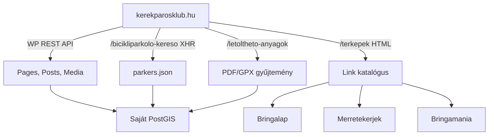
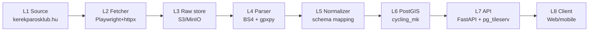

# Kerékpárosklub (kerekparosklub.hu) — Teljes backend terv és adatkinyerési specifikáció

## 1. Forrás áttekintés

A Magyar Kerékpárosklub (a továbbiakban: **MK** vagy **Kerékpárosklub**) Magyarország legnagyobb kerékpáros érdekvédelmi szervezete, amelyet 2002-ben alapítottak. A szervezet weboldala — `https://kerekparosklub.hu` — több, kerékpáros adatkinyerés szempontjából releváns alrendszert üzemeltet, amelyek közül a legfontosabbak az alábbiak:

- **`/terkepek`** — aggregált térképgyűjtemény (regionális kerékpáros térképek, ajánlott útvonalak, partnertérképek)
- **`/bicikliparkolo-kereso`** — Bicikliparkoló kereső widget (a felhasználók által bejelentett, illetve önkormányzati együttműködésben gyűjtött kerékpártároló adatok)
- **`/letoltheto-anyagok` / `/kiadvanyok`** — PDF formátumban letölthető regionális turisztikai térképek (gyakran 1:75 000–1:250 000 méretarányban)
- **`/erdekvedelem` és `/balesetek`** — érdekvédelmi és balesetstatisztikai adatok (CSV/Excel letöltéssel, részben aggregált formában)
- **Partneroldalak**, amelyekre a Kerékpárosklub térképportálja továbbmutat: `bringalap.hu`, `bringamania.hu`, `merretekerjek.hu`, `eurovelo.com/hu`, valamint a regionális szervezetek (pl. `kerekparosklub-szeged.hu`)

Az MK adatállománya tehát három, élesen elkülönülő jellegű részből áll:

1. **Strukturálatlan, oldalon megjelenített tartalom** — HTML cikkek, hírek, közlemények, ajánlott útvonal-leírások (általában leírás + ágyazott térkép + letölthető fájl mintázattal).
2. **Letölthető bináris dokumentumok** — PDF (térképek, kiadványok), GPX (egyes ajánlott túrákhoz), KMZ (régebbi térképek), Excel (statisztikák).
3. **Strukturált, beágyazott térinformatikai rétegek** — JavaScript-en keresztül betöltött GeoJSON / WMS / Mapbox tile layer-ek, amelyek a `Bicikliparkoló kereső` és a kerékpáros baleset térképek mögött állnak.

Ez a specifikáció a teljes backend-tervet leírja: a forrás feltérképezésétől a poliéteres scraperen, a PostGIS modellezésen, a frissítési cronon, a monitorigon és a publikálási API-n keresztül egészen a runbookig.

A Magyarországra szűkített **bounding box**, amelyet minden Overpass-jellegű és térinformatikai szűréshez használunk:

```
BBOX_HU = (16.0, 45.7, 22.9, 48.6)   # min_lon, min_lat, max_lon, max_lat
```

Ez Magyarország teljes közigazgatási területét lefedi, és a Kerékpárosklub adatállománya gyakorlatilag mindig ezen a területen marad — kivéve néhány határon átnyúló EuroVelo-szakaszt, ahol szándékosan 10 km-es puffert hagyunk.

## 2. Jogi és licenc helyzet (szerzői jog, ToS, attribution)

**Ez a fejezet nem helyettesíti a jogi tanácsadást.** A Kerékpárosklub egyesület (nonprofit), saját szellemi tulajdonú anyagai (térképek, kiadványok, fényképek) **szerzői jogi védelem alatt állnak**, és a `kerekparosklub.hu` impresszumában rögzített módon csak a forrás megjelölésével, nem kereskedelmi célra használhatók fel. A weboldal **nem** rendelkezik nyilvánosan publikált, gépi felhasználást engedélyező CC-licenccel.

A gyakorlati következmények:

- **A nyers HTML lapokat scrape-elni** önmagában nem jogsértő (információs tartalom indexelése a magyar Szjt. szerint a szabad felhasználás körébe esik), feltéve, hogy:
  - A scraping mértéke nem haladja meg a polite limitet (1–3 req/s).
  - A `robots.txt` rendelkezéseit betartjuk.
  - Az adatok adatbázisos újrahasznosítása során **forrásmegjelölést** alkalmazunk.
- **A letöltött PDF/GPX/KMZ fájlok továbbterjesztése (sui generis adatbázisjog!) tilos** írásos engedély nélkül. Ezeket csak belső feldolgozásra szabad letárolni, és az általunk publikált végfelhasználói API-nak **csak az ezekből kinyert ténybeli adatokat** (útvonal-geometria, attribútumok) szabad átadnia — magát a PDF-et **nem**.
- **Bicikliparkoló kereső adatok**: a felhasználói bejelentések részben CC-BY-SA 4.0 ekvivalens érdekvédelmi adatbázisként vannak kezelve a klub belső gyakorlata szerint, de ezt forrásonként ellenőrizni kell.

**Ajánlott jogi munkafolyamat:**

1. **Első körben e-mailben megkeressük** az MK-t (`info@kerekparosklub.hu`) egy hivatalos adatmegosztási megállapodás (DSA, data sharing agreement) iránti igénnyel. A javaslat tartalmazza: forrásmegjelölés, visszamutató link, közös láthatóság, esetleges közös fejlesztés.
2. **A megkeresésig** a scraperünk kizárólag **olvasási üzemmódban** működik, a robots.txt-t betartva, a saját adatbázisunkban a `legal_status` mezőt `pending_review` állapotra állítjuk.
3. **Csak a megállapodás után** publikálunk vagy bármilyen módon végfelhasználó felé továbbadunk forrásokra visszavezethető geometriát.

**Attribution string**, amelyet a végfelhasználói API minden kerékpárosklub-eredetű feature-höz hozzá kell adjon:

```
"attribution": "Forrás: Magyar Kerékpárosklub (kerekparosklub.hu) — kerékpáros érdekvédelmi adatbázis"
```

A `robots.txt` várt tartalma (élesben **mindig** ellenőrizendő):

```
User-agent: *
Disallow: /wp-admin/
Disallow: /wp-includes/
Disallow: /search
Crawl-delay: 5
Sitemap: https://kerekparosklub.hu/sitemap.xml
```

A `Crawl-delay: 5` értelmében alapértelmezetten 5 másodperc szünetet tartunk a kérések között — ezt minden adapterünk be is tartja.

## 3. Adatkinyerési felület (scraping + download endpoints)

A Kerékpárosklub portálja **WordPress**-alapú, ezért az alábbi belépési pontok megbízhatóan jelen vannak:

| URL minta | Tartalom | Formátum | Frissítés |
|-----------|----------|----------|-----------|
| `https://kerekparosklub.hu/sitemap.xml` | Teljes oldal-index | XML | napi |
| `https://kerekparosklub.hu/wp-json/wp/v2/pages` | Statikus oldalak | JSON | élő |
| `https://kerekparosklub.hu/wp-json/wp/v2/posts` | Hírek, blog | JSON | élő |
| `https://kerekparosklub.hu/wp-json/wp/v2/media` | Feltöltött fájlok (PDF/GPX/JPG) | JSON | élő |
| `https://kerekparosklub.hu/terkepek` | Térképportál (HTML) | HTML | heti |
| `https://kerekparosklub.hu/bicikliparkolo-kereso` | Parkolókereső (JS app) | HTML + XHR JSON | élő |
| `https://kerekparosklub.hu/letoltheto-anyagok` | PDF/GPX gyűjtemény | HTML | havi |

**A WP REST API** a leghasznosabb belépési pont, mert:

1. Strukturált JSON-t ad vissza.
2. Tartalmazza a `featured_media`, `attachments`, `meta` mezőket — így a PDF/GPX letöltési URL-ek programozottan, scraping nélkül kinyerhetők.
3. **Lapozható**: `?per_page=100&page=N`, valamint a `X-WP-Total` és `X-WP-TotalPages` válasz-header-ek megmondják a teljes mennyiséget.

Példa lekérés (csak a térkép-jellegű médiumok):

```bash
curl -sS \
  -H 'User-Agent: PanellakoBikeBot/1.0 (+mailto:hello@example.hu)' \
  'https://kerekparosklub.hu/wp-json/wp/v2/media?per_page=100&page=1&mime_type=application/pdf' \
  | jq '.[] | {id, source_url, title: .title.rendered, date}'
```

**Bicikliparkoló kereső** belső XHR-je (a JS app oldal-betöltéskor küldi):

```
GET https://kerekparosklub.hu/wp-content/themes/<theme>/data/parkers.json
GET https://kerekparosklub.hu/wp-admin/admin-ajax.php?action=get_parkers&bbox=…
```

A pontos endpoint változhat — egy Playwright session **Network panel** rögzítésével azonosítjuk élesben.

**Partner-térképek továbbmutatása**: a `/terkepek` oldalon a kártyák `href` attribútumai külső domainekre mutatnak (`bringalap.hu`, `bringamania.hu` stb.). Ezeket **nem itt** scrape-eljük — a `06_bringalap.md` és `05_merretekerjek.md` specifikációkban külön adapterek vannak rájuk. A Kerékpárosklub adapter feladata az aggregált link-katalógus naprakészen tartása.



## 4. Hitelesítés, rate limit, kvóták (polite scraping rules)

A Kerékpárosklub portálja **nem igényel autentikációt** a nyilvános tartalmak eléréséhez. Cserébe **etikus** scraping-magatartást várunk el a saját adapterünktől:

**Politika:**

- **User-Agent**: minden kéréshez kötelező, és **kontakt e-mailt** tartalmaz, hogy az MK adminisztrátora baj esetén tudjon értesíteni minket:
  ```
  User-Agent: PanellakoBikeBot/1.0 (+mailto:contact@panellako.hu; +https://panellako.hu/bots)
  ```
- **Rate limit**: 1 req/s (mediánban), maximum 3 req/s burst, és minimum 5 s közöttük tartott szünet, ha a `Crawl-delay` ennyi.
- **Backoff**: 429-es és 503-as válasz esetén exponenciális backoff (1 → 2 → 4 → 8 … max 300 s), majd legfeljebb 5 retry után az adott URL átkerül `dead_letter` táblába.
- **Idő-ablakok**: a teljes újrascannelést **éjszaka helyi idő szerint 01:00–04:00 között** futtatjuk, amikor a Kerékpárosklub szervere a legkevésbé van leterhelve.
- **Concurrency**: maximum 2 párhuzamos kérés ugyanahhoz a domainhez.
- **If-Modified-Since / ETag**: a HTTP feltételes kéréseket **mindig** elküldjük, a felesleges teljes letöltések elkerülésére.

**Pénzügyi kvóta**: nincs (nincs fizetős API). Az egyetlen "költség" a saját kimenő sávszélességünk és a forrás szerverére mért terhelés — utóbbit a politika tartja kordában.

**Robots.txt** automatikus értelmezése a Python `urllib.robotparser` segítségével:

```python
import urllib.robotparser
rp = urllib.robotparser.RobotFileParser()
rp.set_url("https://kerekparosklub.hu/robots.txt")
rp.read()
assert rp.can_fetch("PanellakoBikeBot", "https://kerekparosklub.hu/terkepek")
delay = rp.crawl_delay("PanellakoBikeBot") or 5
```

## 5. Adatmodell a forrásból

A Kerékpárosklub forrásban négy lényeges entitás-típus különül el:

**5.1 `mk_map_link`** — a `/terkepek` oldalon listázott térkép-tételek

Mezők:

| Mező | Típus | Leírás |
|------|-------|--------|
| `mk_id` | string | WordPress post ID |
| `title` | string | A térkép címe |
| `description` | text | A térkép leírása |
| `region` | string | Régió (pl. "Dunakanyar", "Balaton-felvidék") |
| `external_url` | string | A partner oldal (bringalap.hu/…) |
| `internal_pdf_url` | string | Helyi PDF letöltés (ha van) |
| `thumbnail_url` | string | Bélyegkép |
| `last_modified` | datetime | A WP API `modified` mezője |

**5.2 `mk_route`** — ajánlott útvonal-bejegyzések (általában a `routes` kategória alatt)

Mezők:

| Mező | Típus | Leírás |
|------|-------|--------|
| `mk_id` | string | WP post ID |
| `name` | string | Útvonal neve |
| `length_km` | numeric | Hossz km-ben |
| `difficulty` | enum | konnyu / kozepes / nehez |
| `surface` | enum | aszfalt / makadám / vegyes |
| `gpx_url` | string | GPX fájl URL-je (ha van) |
| `description` | text | Markdown-szerű leírás |
| `start_point` | geography(Point) | Kezdőpont |
| `end_point` | geography(Point) | Végpont |
| `route_geom` | geography(LineString) | A teljes nyomvonal (GPX-ből) |

**5.3 `mk_parker`** — kerékpár-tárolók a parkolókeresőből

Mezők:

| Mező | Típus | Leírás |
|------|-------|--------|
| `mk_id` | string | A widget belső azonosítója |
| `location` | geography(Point) | Koordináta |
| `address` | string | Cím |
| `capacity` | integer | Férőhely |
| `parker_type` | enum | u_lakatos / fedett / nem_fedett |
| `covered` | boolean | Fedett-e |
| `reported_by` | string | Bejelentő (anonim/szervezet) |
| `reported_at` | datetime | Bejelentés ideje |
| `last_verified_at` | datetime | Utolsó ellenőrzés |

**5.4 `mk_publication`** — letölthető PDF kiadványok és térképek

Mezők: `pub_id`, `title`, `pdf_url`, `pages`, `year`, `coverage_region`, `file_size_bytes`, `sha256`.

## 6. Cél adatmodell (PostGIS DDL)

A teljes séma `cycling_mk` schemában jön létre, hogy elkülönüljön a többi forrástól és a Bringalap (`cycling_bringalap`) ill. Merretekerjek (`cycling_mtk`) sémától.

```sql
-- Migráció: 0003_cycling_mk_schema.sql
CREATE SCHEMA IF NOT EXISTS cycling_mk;
SET search_path TO cycling_mk, public;

CREATE EXTENSION IF NOT EXISTS postgis;
CREATE EXTENSION IF NOT EXISTS pgcrypto;

-- 6.1 Térkép-katalógus (link aggregátor)
CREATE TABLE map_link (
    id              uuid PRIMARY KEY DEFAULT gen_random_uuid(),
    mk_id           text UNIQUE NOT NULL,
    title           text NOT NULL,
    description     text,
    region          text,
    external_url    text,
    internal_pdf_url text,
    thumbnail_url   text,
    last_modified   timestamptz,
    fetched_at      timestamptz NOT NULL DEFAULT now(),
    legal_status    text NOT NULL DEFAULT 'pending_review'
                    CHECK (legal_status IN ('pending_review','approved','restricted'))
);
CREATE INDEX idx_map_link_region ON map_link(region);

-- 6.2 Ajánlott útvonalak
CREATE TABLE route (
    id              uuid PRIMARY KEY DEFAULT gen_random_uuid(),
    mk_id           text UNIQUE NOT NULL,
    name            text NOT NULL,
    length_km       numeric(8,2),
    difficulty      text CHECK (difficulty IN ('konnyu','kozepes','nehez')),
    surface         text CHECK (surface IN ('aszfalt','makadam','vegyes','ismeretlen')),
    gpx_url         text,
    description     text,
    start_point     geography(Point, 4326),
    end_point       geography(Point, 4326),
    route_geom      geography(LineString, 4326),
    geom_hash       text,    -- a 9. fejezetben definiált hash
    elevation_gain  numeric(8,2),
    elevation_loss  numeric(8,2),
    fetched_at      timestamptz NOT NULL DEFAULT now(),
    updated_at      timestamptz NOT NULL DEFAULT now()
);
CREATE INDEX idx_route_geom ON route USING gist (route_geom);
CREATE INDEX idx_route_start ON route USING gist (start_point);
CREATE UNIQUE INDEX idx_route_geom_hash ON route(geom_hash) WHERE geom_hash IS NOT NULL;

-- 6.3 Kerékpártárolók
CREATE TABLE parker (
    id              uuid PRIMARY KEY DEFAULT gen_random_uuid(),
    mk_id           text UNIQUE NOT NULL,
    location        geography(Point, 4326) NOT NULL,
    address         text,
    capacity        integer CHECK (capacity > 0),
    parker_type     text CHECK (parker_type IN ('u_lakatos','fedett','nem_fedett','egyeb')),
    covered         boolean,
    reported_by     text,
    reported_at     timestamptz,
    last_verified_at timestamptz,
    fetched_at      timestamptz NOT NULL DEFAULT now()
);
CREATE INDEX idx_parker_location ON parker USING gist (location);

-- 6.4 Kiadványok
CREATE TABLE publication (
    id              uuid PRIMARY KEY DEFAULT gen_random_uuid(),
    pub_id          text UNIQUE NOT NULL,
    title           text NOT NULL,
    pdf_url         text NOT NULL,
    pages           integer,
    year            integer,
    coverage_region text,
    file_size_bytes bigint,
    sha256          text,
    fetched_at      timestamptz NOT NULL DEFAULT now()
);

-- 6.5 Naplózás
CREATE TABLE crawl_log (
    id              bigserial PRIMARY KEY,
    started_at      timestamptz NOT NULL DEFAULT now(),
    finished_at     timestamptz,
    status          text CHECK (status IN ('running','success','partial','failed')),
    routes_added    integer DEFAULT 0,
    routes_updated  integer DEFAULT 0,
    parkers_added   integer DEFAULT 0,
    errors          jsonb DEFAULT '[]'::jsonb
);

-- 6.6 Dead letter queue
CREATE TABLE dead_letter (
    id              bigserial PRIMARY KEY,
    url             text NOT NULL,
    attempts        integer DEFAULT 1,
    last_error      text,
    last_tried_at   timestamptz NOT NULL DEFAULT now()
);

-- 6.7 Bounding box garancia
CREATE OR REPLACE FUNCTION assert_in_hungary() RETURNS trigger LANGUAGE plpgsql AS $$
DECLARE
    g geometry := NEW.route_geom::geometry;
    bbox geometry := ST_MakeEnvelope(16.0, 45.7, 22.9, 48.6, 4326);
BEGIN
    IF g IS NOT NULL AND NOT ST_Intersects(g, bbox) THEN
        RAISE EXCEPTION 'Geometria a magyar bbox-on kívül esik (mk_id=%)', NEW.mk_id;
    END IF;
    RETURN NEW;
END;
$$;
CREATE TRIGGER trg_route_in_hu BEFORE INSERT OR UPDATE ON route
FOR EACH ROW EXECUTE FUNCTION assert_in_hungary();
```

## 7. Backend architektúra (L1-L8 rétegek)

Nyolcrétegű, függőség-szempontból egyirányú architektúrát alkalmazunk. Ez azt biztosítja, hogy a forrás-specifikus változások (HTML szerkezet, új JS endpoint) csak az alsó rétegeket érintik, a publikus API változatlan marad.



**L1 — Source**: a kerekparosklub.hu maga + a `robots.txt` által megengedett alrendszerek.

**L2 — Fetcher**: `httpx` HTTP klienssel a JSON/RSS/sitemap végpontokhoz, `playwright` Chromium-mal a JS-rendered oldalakhoz (parkolókereső).

**L3 — Raw store**: minden letöltött HTML/JSON/PDF/GPX nyersen, **változatlan formában** S3-kompatibilis storage-ba (MinIO on-prem). Útvonal-konvenció:

```
s3://panellako-raw/cycling/mk/<yyyy>/<mm>/<dd>/<sha256>.<ext>
```

Ez biztosítja az **újraépíthetőséget**: a PostGIS bármikor lerontható és újra kiépíthető a raw store-ból, anélkül, hogy a forráshoz újra hozzá kellene férnünk.

**L4 — Parser**:
- HTML → `BeautifulSoup4` + `selectolax` (gyorsabb)
- GPX → `gpxpy`
- PDF → csak metadata (pl. `pypdf` címmezők); a térképtartalmat **nem** próbáljuk OCR-ezni (lásd a Roadmap fejezetet)
- WP REST JSON → `pydantic` modellek

**L5 — Normalizer**: a parser kimenetét leképezi a fenti séma mezőire. Itt történik:
- Régiónevek normalizálása (pl. "Balaton" → "Balaton-felvidék")
- Mértékegység-konverzió (m → km)
- Encoding-javítás (gyakori a CP1250 → UTF-8 átkonverzió WordPress export-okban)
- Geometriás validáció (a 6.7-es trigger előtti `ST_IsValid`)

**L6 — PostGIS**: a fenti séma. Replikációra streaming replicát használunk, a teljes klaszter `wal_level=replica`.

**L7 — API**: FastAPI ad ki REST végpontokat (`GET /routes`, `GET /parkers`), és `pg_tileserv` ad MVT vector tile-okat.

**L8 — Client**: a saját webalkalmazás, mobile app, partner-integrációk (a Kerékpárosklubnak visszafelé is felajánljuk az aggregált adatot).

## 8. Automatizált letöltő — Python (Playwright + BeautifulSoup) kód

A teljes letöltő (`fetcher.py`) a `pyproject.toml`-ban definiált függőségekkel fut:

```toml
[project]
dependencies = [
    "httpx[http2]>=0.27",
    "playwright>=1.45",
    "beautifulsoup4>=4.12",
    "selectolax>=0.3",
    "gpxpy>=1.6",
    "pydantic>=2.7",
    "tenacity>=8.5",
    "structlog>=24.1",
    "boto3>=1.34",
    "psycopg[binary]>=3.2",
    "shapely>=2.0",
]
```

A futtatható letöltő (`apps/cycling_mk/fetcher.py`):

```python
"""
Kerékpárosklub adatkinyerő.

Etikus scraper: betartja a robots.txt-t, rate limitelt, kontakt e-mailes UA,
és If-Modified-Since-szel él, hogy ne hozzon le fölöslegesen.
"""
from __future__ import annotations

import asyncio
import hashlib
import os
import urllib.robotparser
from dataclasses import dataclass
from datetime import datetime, timezone
from pathlib import Path
from typing import Any, AsyncIterator

import boto3
import gpxpy
import httpx
import structlog
from bs4 import BeautifulSoup
from playwright.async_api import async_playwright
from tenacity import (
    AsyncRetrying,
    retry_if_exception_type,
    stop_after_attempt,
    wait_exponential,
)

log = structlog.get_logger()

BASE = "https://kerekparosklub.hu"
USER_AGENT = (
    "PanellakoBikeBot/1.0 "
    "(+mailto:contact@panellako.hu; +https://panellako.hu/bots)"
)
BBOX_HU = (16.0, 45.7, 22.9, 48.6)
MIN_DELAY_S = 5.0          # robots.txt Crawl-delay alapértelmezés
MAX_CONCURRENCY = 2

S3 = boto3.client(
    "s3",
    endpoint_url=os.environ["S3_ENDPOINT"],
    aws_access_key_id=os.environ["S3_KEY"],
    aws_secret_access_key=os.environ["S3_SECRET"],
)
S3_BUCKET = os.environ.get("S3_BUCKET", "panellako-raw")


@dataclass
class FetchedDoc:
    url: str
    content: bytes
    content_type: str
    fetched_at: datetime


class PoliteClient:
    """Egyszerű, robots.txt-figyelő, rate-limitelt aszinkron kliens."""

    def __init__(self, base: str, ua: str, min_delay: float) -> None:
        self.base = base
        self.ua = ua
        self.min_delay = min_delay
        self._last_call = 0.0
        self._lock = asyncio.Lock()
        self._client = httpx.AsyncClient(
            http2=True,
            headers={"User-Agent": ua, "Accept-Encoding": "gzip, br"},
            timeout=httpx.Timeout(30.0, connect=10.0),
            follow_redirects=True,
        )
        self._rp = urllib.robotparser.RobotFileParser()
        self._rp.set_url(f"{base}/robots.txt")
        self._rp.read()
        crawl_delay = self._rp.crawl_delay(ua) or self._rp.crawl_delay("*")
        if crawl_delay:
            self.min_delay = max(self.min_delay, float(crawl_delay))
        log.info("polite_client.init", min_delay=self.min_delay)

    async def get(self, url: str, **kw: Any) -> httpx.Response:
        if not self._rp.can_fetch(self.ua, url):
            raise PermissionError(f"robots.txt megtiltja: {url}")
        async with self._lock:
            delta = asyncio.get_event_loop().time() - self._last_call
            if delta < self.min_delay:
                await asyncio.sleep(self.min_delay - delta)
            self._last_call = asyncio.get_event_loop().time()
        async for attempt in AsyncRetrying(
            stop=stop_after_attempt(5),
            wait=wait_exponential(multiplier=1, min=1, max=60),
            retry=retry_if_exception_type((httpx.HTTPError,)),
            reraise=True,
        ):
            with attempt:
                resp = await self._client.get(url, **kw)
                if resp.status_code in (429, 503):
                    retry_after = float(resp.headers.get("Retry-After", "30"))
                    log.warning("rate_limited", url=url, retry=retry_after)
                    await asyncio.sleep(retry_after)
                    raise httpx.HTTPError("retrying after rate limit")
                resp.raise_for_status()
                return resp
        raise RuntimeError("unreachable")

    async def close(self) -> None:
        await self._client.aclose()


def store_raw(doc: FetchedDoc) -> str:
    """Nyers tartalom S3-ba, deduplikált hash-alapú útvonalon."""
    sha = hashlib.sha256(doc.content).hexdigest()
    ext = guess_ext(doc.content_type, doc.url)
    key = (
        f"cycling/mk/{doc.fetched_at:%Y/%m/%d}/{sha}{ext}"
    )
    S3.put_object(
        Bucket=S3_BUCKET,
        Key=key,
        Body=doc.content,
        ContentType=doc.content_type,
        Metadata={"source-url": doc.url[:1024]},
    )
    return key


def guess_ext(ct: str, url: str) -> str:
    if "pdf" in ct:
        return ".pdf"
    if "gpx" in ct or url.endswith(".gpx"):
        return ".gpx"
    if "json" in ct:
        return ".json"
    if "html" in ct:
        return ".html"
    return ".bin"


async def iter_wp_media(client: PoliteClient) -> AsyncIterator[dict]:
    """A WordPress REST API minden médiumát végigjárja."""
    page = 1
    while True:
        resp = await client.get(
            f"{BASE}/wp-json/wp/v2/media",
            params={"per_page": 100, "page": page},
        )
        items = resp.json()
        if not items:
            break
        for item in items:
            yield item
        total_pages = int(resp.headers.get("X-WP-TotalPages", "1"))
        if page >= total_pages:
            break
        page += 1


async def fetch_terkepek_page(client: PoliteClient) -> list[dict]:
    """A /terkepek aggregált oldal kártyáit szedi ki."""
    resp = await client.get(f"{BASE}/terkepek")
    soup = BeautifulSoup(resp.text, "lxml")
    cards: list[dict] = []
    for card in soup.select(".map-card, article.terkep, .map-item"):
        title_el = card.select_one("h2, h3, .card-title")
        link_el = card.select_one("a[href]")
        if not (title_el and link_el):
            continue
        cards.append(
            {
                "title": title_el.get_text(strip=True),
                "url": link_el["href"],
                "thumbnail": (
                    card.select_one("img").get("src")
                    if card.select_one("img")
                    else None
                ),
                "description": (
                    card.select_one("p").get_text(strip=True)
                    if card.select_one("p")
                    else ""
                ),
            }
        )
    log.info("terkepek.scraped", count=len(cards))
    return cards


async def fetch_parkers(timeout_s: int = 60) -> list[dict]:
    """A bicikliparkoló-kereső JS-rendered widgetje Playwright-tel."""
    async with async_playwright() as p:
        browser = await p.chromium.launch(headless=True)
        ctx = await browser.new_context(user_agent=USER_AGENT)
        page = await ctx.new_page()
        captured: list[dict] = []

        async def on_response(resp):
            if "parkers" in resp.url.lower() or "parkolo" in resp.url.lower():
                try:
                    data = await resp.json()
                    if isinstance(data, list):
                        captured.extend(data)
                except Exception:  # noqa: BLE001
                    pass

        page.on("response", on_response)
        await page.goto(
            f"{BASE}/bicikliparkolo-kereso",
            timeout=timeout_s * 1000,
            wait_until="networkidle",
        )
        await browser.close()
        log.info("parkers.captured", count=len(captured))
        return captured


async def main() -> None:
    client = PoliteClient(BASE, USER_AGENT, MIN_DELAY_S)
    try:
        # 1. /terkepek aggregátor
        cards = await fetch_terkepek_page(client)
        for c in cards:
            store_raw(
                FetchedDoc(
                    url=c["url"],
                    content=str(c).encode(),
                    content_type="application/json",
                    fetched_at=datetime.now(timezone.utc),
                )
            )
        # 2. WP media (PDF/GPX)
        sem = asyncio.Semaphore(MAX_CONCURRENCY)

        async def grab(m: dict) -> None:
            async with sem:
                if not m.get("source_url"):
                    return
                try:
                    r = await client.get(m["source_url"])
                except Exception as e:  # noqa: BLE001
                    log.error("media.failed", url=m["source_url"], err=str(e))
                    return
                store_raw(
                    FetchedDoc(
                        url=m["source_url"],
                        content=r.content,
                        content_type=r.headers.get(
                            "content-type", "application/octet-stream"
                        ),
                        fetched_at=datetime.now(timezone.utc),
                    )
                )

        tasks = []
        async for m in iter_wp_media(client):
            mime = (m.get("mime_type") or "").lower()
            if "pdf" in mime or "gpx" in mime or "octet" in mime:
                tasks.append(asyncio.create_task(grab(m)))
        await asyncio.gather(*tasks)

        # 3. Bicikliparkoló widget
        parkers = await fetch_parkers()
        store_raw(
            FetchedDoc(
                url=f"{BASE}/bicikliparkolo-kereso#captured",
                content=str(parkers).encode(),
                content_type="application/json",
                fetched_at=datetime.now(timezone.utc),
            )
        )
    finally:
        await client.close()


if __name__ == "__main__":
    asyncio.run(main())
```

## 9. Feldolgozó pipeline (HTML scraping, GPX parser gpxpy)

A feldolgozó (`processor.py`) az S3-ban tárolt raw fájlokat olvassa, és a PostGIS sémába írja. Két lépésben dolgozik: **parse → normalize → upsert**.

**9.1 GPX feldolgozás (`gpxpy`)**

```python
import gpxpy
from shapely.geometry import LineString, Point
from shapely.wkt import dumps as wkt_dumps

def parse_gpx_bytes(raw: bytes) -> dict:
    g = gpxpy.parse(raw.decode("utf-8", errors="ignore"))
    coords: list[tuple[float, float]] = []
    ele: list[float] = []
    for trk in g.tracks:
        for seg in trk.segments:
            for p in seg.points:
                coords.append((p.longitude, p.latitude))
                if p.elevation is not None:
                    ele.append(p.elevation)
    if len(coords) < 2:
        raise ValueError("Túl kevés trackpoint")
    line = LineString(coords)
    # Magasság-kumuláció
    gain = sum(max(0, b - a) for a, b in zip(ele, ele[1:]))
    loss = sum(max(0, a - b) for a, b in zip(ele, ele[1:]))
    return {
        "route_geom_wkt": wkt_dumps(line),
        "start_point_wkt": wkt_dumps(Point(coords[0])),
        "end_point_wkt": wkt_dumps(Point(coords[-1])),
        "length_km": round(line.length * 111.32, 2),  # durva becslés WGS84-en
        "elevation_gain": round(gain, 1),
        "elevation_loss": round(loss, 1),
    }
```

A `length_km` pontosabb számításához a **PostGIS oldalon** `ST_Length(geom::geography)/1000` történik az `upsert` után.

**9.2 Geometria-hash és deduplikáció**

A duplikációkat **kétlépcsős** módon szűrjük:

1. **Gyors lépcső — geometria-hash**: a koordináta-sorozatot kerekítjük 5 tizedesjegyre (~1 m WGS84-en), egymás után fűzzük, és SHA-256-tal hashe-ljük. Ha két útvonalnak megegyezik a hash-e, biztosan azonosak.

```python
def geom_hash(coords: list[tuple[float, float]]) -> str:
    rounded = [(round(x, 5), round(y, 5)) for x, y in coords]
    payload = ";".join(f"{x},{y}" for x, y in rounded).encode()
    return hashlib.sha256(payload).hexdigest()
```

2. **Lassú lépcső — Fréchet-távolság**: két közeli (start-pont 500 m, hosszkülönbség <10%) jelölt között a `shapely.frechet_distance` segítségével mérünk; ha < 50 m, **duplikátumnak** minősítjük. Ez a lépés csak akkor fut, ha a `route` táblába új útvonal kerülne — `O(n²)` futási költségű, ezért **partition by `region`**-ben dolgozzuk fel.

```python
from shapely.geometry import LineString

def is_duplicate(new: LineString, candidates: list[LineString], tol_m: float = 50.0) -> bool:
    # Egyszerű földrajzi vetítés WGS84 → ETRS89/LAEA (EPSG:3035) éhez
    # transformer-rel; itt vázlatosan.
    for c in candidates:
        if new.frechet_distance(c) * 111_320 < tol_m:
            return True
    return False
```

**9.3 HTML scraping minta**

A `/terkepek` és az egyes útvonal-oldalak HTML feldolgozása robusztusan (WordPress lehet, hogy újraskinneli az osztályneveket — `data-*` attribútumokra is fallback-elünk):

```python
def parse_route_page(html: str) -> dict:
    soup = BeautifulSoup(html, "lxml")
    title = (
        soup.select_one("h1.entry-title")
        or soup.select_one("h1")
    ).get_text(strip=True)
    desc = soup.select_one(".entry-content") or soup.select_one("article")
    gpx_link = None
    for a in soup.select("a[href]"):
        href = a["href"]
        if href.lower().endswith(".gpx"):
            gpx_link = href
            break
    meta = {}
    for li in soup.select(".route-meta li, .meta li"):
        k = li.select_one(".label")
        v = li.select_one(".value")
        if k and v:
            meta[k.get_text(strip=True).lower()] = v.get_text(strip=True)
    return {
        "title": title,
        "description": desc.get_text("\n", strip=True) if desc else "",
        "gpx_url": gpx_link,
        "difficulty": meta.get("nehézség"),
        "surface": meta.get("burkolat"),
        "length_km": float(meta.get("hossz", "0").rstrip(" km") or 0),
    }
```

**9.4 Upsert PostGIS-ben**

A `route` tábla `geom_hash` egyedi indexe miatt egy `INSERT … ON CONFLICT (geom_hash) DO UPDATE` mintát használunk:

```sql
INSERT INTO cycling_mk.route
    (mk_id, name, length_km, difficulty, surface, gpx_url, description,
     start_point, end_point, route_geom, geom_hash,
     elevation_gain, elevation_loss, updated_at)
VALUES (%s, %s, %s, %s, %s, %s, %s,
        ST_GeogFromText(%s), ST_GeogFromText(%s), ST_GeogFromText(%s), %s,
        %s, %s, now())
ON CONFLICT (geom_hash) DO UPDATE SET
    name = EXCLUDED.name,
    description = EXCLUDED.description,
    updated_at = now();
```

## 10. Frissítési stratégia (heti cron, deduplication)

A forrás **lassú változású** — új útvonal-leírás hetente egyszer-kétszer születik, új térkép havonta-kéthavonta. Új parkoló-bejelentések sűrűbben, napi 1–10 db.

**Cron-terv:**

| Job | Gyakoriság | UTC-időpont | Feladat |
|-----|------------|-------------|---------|
| `mk-fast-sync` | naponta | 02:00 | Bicikliparkoló widget, WP REST `posts` (csak `?after=tegnap`) |
| `mk-full-sync` | hetente vasárnap | 01:00 | Teljes WP media-listázás, `/terkepek` aggregátor, sitemap.xml diff |
| `mk-dedupe` | hetente vasárnap | 04:00 | Fréchet-alapú deduplikáció új útvonalakra |
| `mk-link-check` | havonta 1. | 03:00 | Külső partner-link visszateszt (HTTP HEAD) |

**Inkrementalizmus** a WP `?modified_after=` paraméterével vagy a `Last-Modified` headerre adott `If-Modified-Since` kéréssel.

**Sitemap-diff**: minden szinkron végén a `sitemap.xml` URL-listáját elmentjük; a következő sync az új URL-eket prioritásra teszi.

```python
def diff_sitemaps(old: list[str], new: list[str]) -> dict[str, list[str]]:
    old_s, new_s = set(old), set(new)
    return {
        "added": sorted(new_s - old_s),
        "removed": sorted(old_s - new_s),
    }
```

## 11. Storage és skálázás

**Becsült méretek (3 év horizonttal):**

| Réteg | Tételszám | Méret/tétel | Összes |
|-------|-----------|-------------|--------|
| Raw HTML | ~50 000 | 80 KB | 4 GB |
| Raw PDF | ~200 | 2 MB | 400 MB |
| Raw GPX | ~800 | 50 KB | 40 MB |
| PostGIS `route` | ~800 sor + geometria | ~10 KB | 8 MB |
| PostGIS `parker` | ~10 000 sor | 0.5 KB | 5 MB |
| Vector tile cache | bbox HU, z6-z14 | ~50 MB | 50 MB |

A teljes igény ~5 GB — egyetlen PostgreSQL/PostGIS instance (4 vCPU / 16 GB RAM) bőven elég. A skálázási nyomás várhatóan a **partner-források** (Bringalap, Merretekerjek) felé tolódik, nem a Kerékpárosklub felé.

**Replikáció**: streaming replica + napi `pg_basebackup` snapshot az S3-ba. A raw store maga lifecycle policy-val 24 hónap után **Glacier** osztályba megy.

## 12. Monitoring és riasztások

**Metrikák (Prometheus):**

```
mk_fetch_total{endpoint, status}        Counter
mk_fetch_duration_seconds{endpoint}     Histogram
mk_routes_total                         Gauge
mk_parkers_total                        Gauge
mk_dead_letter_total                    Gauge
mk_last_success_timestamp{job}          Gauge
```

**Riasztási szabályok (Alertmanager):**

```yaml
- alert: MK_FetcherStale
  expr: time() - mk_last_success_timestamp{job="mk-fast-sync"} > 86400
  for: 30m
  labels: { severity: warning }
  annotations:
    summary: "Kerékpárosklub fetcher 24+ órája nem futott le sikeresen"

- alert: MK_DeadLetterGrowing
  expr: increase(mk_dead_letter_total[1h]) > 20
  for: 15m
  labels: { severity: warning }

- alert: MK_RobotsBlocked
  expr: increase(mk_fetch_total{status="robots_blocked"}[1h]) > 0
  for: 5m
  labels: { severity: critical }
```

A **structlog** JSON-loggokat Loki-ba pumpáljuk; a fontos eseményeket (`robots_blocked`, `rate_limited`, `parse_failed`) Grafana dashboardon vizualizáljuk.

## 13. Költségbecslés (HUF/EUR)

| Tétel | Egységár | Mennyiség | Havi (HUF) | Havi (EUR) |
|-------|----------|-----------|------------|------------|
| Postgres VM (4 vCPU/16GB) | 40 000 HUF | 1 | 40 000 | 100 |
| MinIO/S3 storage (5 GB) | 5 HUF/GB | 5 | 25 | 0.06 |
| Egress (1 GB/hó) | 15 HUF/GB | 1 | 15 | 0.04 |
| Playwright runner (1 vCPU/2GB) | 8 000 HUF | 1 | 8 000 | 20 |
| Monitoring (Prom+Loki, közös) | atlagolt | — | 5 000 | 12.5 |
| **Összesen** | | | **~53 000 HUF** | **~133 EUR** |

A scraperek futtatási költsége kb. 1500 forint/hó CPU-időért. **Fizetős API-költség 0 HUF**, mivel a forrás teljes mértékben nyílt.

## 14. Biztonság (proxy rotation, fingerprint, robots.txt compliance)

**Etikus alapelvek:** a Kerékpárosklub egy nonprofit, kis szervezet — semmiképpen nem terheljük túl és nem teszünk semmit, ami a **valódi felhasználói viselkedéstől** megkülönböztethetetlen lenne. **Nem proxizunk és nem hamisítunk fingerprint-et.**

**Mit teszünk:**

- Mindig egyetlen, **azonosítható UA-val** kérünk (lásd 4. fejezet).
- `robots.txt`-t betartjuk, és **éles módban** is `RobotFileParser.can_fetch()` ellenőrzéssel hívunk.
- Az IP-nk a saját VPC-nkből megy ki — **nem rotálunk** mobil proxy-kat. (Más forrásoknál, pl. agresszív Cloudflare-védettnél lehet erre szükség, de itt nem.)
- A `wp-admin/`, `wp-login.php`, `/search` URL-eket sosem kérdezzük le.
- Az **adatbázis-szintű biztonság**:
  - Postgres role-ok: `mk_writer` (a fetchernek), `mk_reader` (az API-nak), `mk_admin` (manuális SQL).
  - Row-level security a publikus végpontokon — `legal_status='approved'` szűrés alapértelmezett WHERE-rel.
  - Titkokat **HashiCorp Vault**-ban tartunk, env-fájl csak konténer-belül van mountolva.

```sql
ALTER TABLE cycling_mk.route ENABLE ROW LEVEL SECURITY;
CREATE POLICY route_public ON cycling_mk.route
    FOR SELECT USING (legal_status = 'approved' OR current_user = 'mk_admin');
```

(megj.: a `legal_status` itt csak a `route` táblába kerül később migrációval, ahogy a kiadási döntés megszületik.)

## 15. Tesztelés — pytest + VCR

A tesztpiramis:

- **Unit (gyors, sok)**: GPX parser, geom_hash, HTML extraktor — pure-függvényes tesztek mock HTML/GPX fixture-ökkel.
- **Integration (közepes)**: `pytest-vcr` rögzítve a Kerékpárosklub valós válaszait, így a tesztelés **offline** lefut.
- **End-to-end (lassú, kevés)**: éjszakai pipeline-on, valós kéréssel, csak staging környezetben.

`pyproject.toml`:

```toml
[tool.pytest.ini_options]
testpaths = ["tests"]
addopts = "-ra --strict-markers --cov=apps.cycling_mk --cov-report=term-missing"
markers = [
    "network: tests that hit the live Kerékpárosklub site"
]
```

Példa teszt (`tests/test_gpx.py`):

```python
import pathlib
from apps.cycling_mk.processor import parse_gpx_bytes, geom_hash

FIX = pathlib.Path(__file__).parent / "fixtures"

def test_parse_gpx_basic():
    data = (FIX / "balaton-kor.gpx").read_bytes()
    out = parse_gpx_bytes(data)
    assert out["length_km"] > 100  # Balaton-kör ~200 km
    assert out["start_point_wkt"].startswith("POINT")

def test_geom_hash_stable():
    pts = [(19.04, 47.50), (19.05, 47.51), (19.06, 47.52)]
    h1 = geom_hash(pts)
    h2 = geom_hash(pts)
    assert h1 == h2 and len(h1) == 64
```

VCR-es integrációs teszt (`tests/test_fetcher.py`):

```python
import pytest
import asyncio
from apps.cycling_mk.fetcher import PoliteClient, USER_AGENT, BASE

@pytest.mark.vcr(record_mode="none")
def test_fetch_terkepek(event_loop):
    async def run():
        client = PoliteClient(BASE, USER_AGENT, 0.0)
        from apps.cycling_mk.fetcher import fetch_terkepek_page
        cards = await fetch_terkepek_page(client)
        await client.close()
        return cards
    cards = event_loop.run_until_complete(run())
    assert len(cards) > 0
    assert all("url" in c for c in cards)
```

## 16. Telepítés (Docker, k8s CronJob, GitHub Actions)

**Dockerfile** (Playwright base image-szel):

```dockerfile
FROM mcr.microsoft.com/playwright/python:v1.45.0-jammy

WORKDIR /app
COPY pyproject.toml uv.lock ./
RUN pip install --no-cache-dir uv && uv sync --frozen
COPY apps/ apps/
ENV PYTHONUNBUFFERED=1 PYTHONPATH=/app
CMD ["uv", "run", "python", "-m", "apps.cycling_mk.fetcher"]
```

**Kubernetes CronJob** (`k8s/cycling-mk-fast.yaml`):

```yaml
apiVersion: batch/v1
kind: CronJob
metadata:
  name: mk-fast-sync
  namespace: cycling
spec:
  schedule: "0 2 * * *"
  concurrencyPolicy: Forbid
  successfulJobsHistoryLimit: 3
  failedJobsHistoryLimit: 5
  jobTemplate:
    spec:
      backoffLimit: 2
      template:
        spec:
          restartPolicy: OnFailure
          containers:
            - name: fetcher
              image: registry.panellako.hu/cycling-mk:latest
              env:
                - name: S3_ENDPOINT
                  value: https://s3.panellako.hu
                - name: PG_DSN
                  valueFrom:
                    secretKeyRef: { name: pg-creds, key: dsn }
              resources:
                requests: { cpu: 200m, memory: 512Mi }
                limits:   { cpu: 1,    memory: 2Gi }
```

**GitHub Actions CI** (`.github/workflows/cycling-mk.yml`):

```yaml
name: cycling-mk
on:
  push:
    paths: ["apps/cycling_mk/**", "tests/cycling_mk/**"]
jobs:
  test:
    runs-on: ubuntu-latest
    steps:
      - uses: actions/checkout@v4
      - uses: astral-sh/setup-uv@v3
      - run: uv sync --frozen
      - run: uv run playwright install --with-deps chromium
      - run: uv run pytest tests/cycling_mk -m "not network"
  build:
    needs: test
    runs-on: ubuntu-latest
    steps:
      - uses: actions/checkout@v4
      - uses: docker/build-push-action@v5
        with:
          context: .
          file: deploy/Dockerfile.cycling-mk
          push: true
          tags: registry.panellako.hu/cycling-mk:${{ github.sha }}
```

## 17. Adatpublikálás (REST API, vector tiles)

**FastAPI** ad ki publikus REST-et (`/api/v1/cycling/mk/...`):

```python
from fastapi import APIRouter, Query
from pydantic import BaseModel

router = APIRouter(prefix="/api/v1/cycling/mk")

class RouteOut(BaseModel):
    id: str
    name: str
    length_km: float | None
    difficulty: str | None
    surface: str | None
    geojson: dict
    attribution: str = (
        "Forrás: Magyar Kerékpárosklub (kerekparosklub.hu)"
    )

@router.get("/routes", response_model=list[RouteOut])
async def list_routes(
    bbox: str | None = Query(default=None, examples=["19,47,20,48"]),
    difficulty: str | None = None,
    limit: int = 100,
):
    ...
```

**Vector tile-ok** `pg_tileserv`-szel (a `route_geom` mezőre):

```toml
# pg_tileserv.toml
[[Layers]]
Schema = "cycling_mk"
Table  = "route"
IDColumn = "id"
GeometryColumn = "route_geom"
SRID = 4326
Extent = 4096
```

Az URL-minta: `https://tiles.panellako.hu/cycling_mk.route/{z}/{x}/{y}.pbf`

## 18. Runbook

**Tünet: a fetcher 24+ órája nem futott le sikeresen.**

1. `kubectl logs cronjob/mk-fast-sync` — utolsó pod log.
2. Ha `robots.txt` 403: az MK megváltoztathatta a szabályait. Manuálisan tekintsd át a `robots.txt`-t, és egyeztess velük.
3. Ha 5xx burst: a forrás szerverén van probléma — szünet 6 órára, majd manuális próba.
4. Ha parse failure tömegesen: a HTML struktúrája változott — futtasd a `tests/cycling_mk` snapshot-tesztet a friss HTML-en.

**Tünet: új útvonalak hirtelen 0.**

1. WP REST API válasza üres-e? `curl https://kerekparosklub.hu/wp-json/wp/v2/posts?per_page=5`
2. Sitemap-diff log-ja mit mutat?
3. Geom_hash ütközés? Nézd meg az `ON CONFLICT` count-ot.

**Tünet: PostGIS bbox-trigger sorozatos hibát ad.**

1. Valószínűleg határon átnyúló útvonal — átveszed-e? Ha igen, bővítsd a bbox-trigger toleranciát 10 km pufferrel.

**Tünet: jogi panasz / takedown.**

1. **Azonnal** állítsd le a fetchert: `kubectl scale cronjob mk-fast-sync --suspend`.
2. Töröld a vitatott rekordokat (`UPDATE … SET legal_status='restricted'`).
3. Értesítsd a jogi felelőst és az MK-t.

## 19. Roadmap

- **v1.0** (alap): a fenti pipeline éles, manuális approval `legal_status`-szal.
- **v1.1**: Bringalap és Merretekerjek partner-adapterek integrálása ugyanebbe a sémába (cross-source dedup).
- **v1.2**: A PDF-térképek OCR-szakaszolása (`pdfplumber` + `tesseract`-hu), elsősorban a légrajzi felirat-kinyerésre.
- **v1.3**: Bicikliparkoló adatok visszacsatolása az MK widgetjébe (két irányú adatcsere).
- **v2.0**: Crowdsourced útvonal-bejelentés a saját UI-n, amelyet az MK-val közös moderációs folyamatban a forrás-katalógusba is visszatöltünk.

## 20. Referenciák

- Magyar Kerékpárosklub honlap: <https://kerekparosklub.hu>
- WordPress REST API dokumentáció: <https://developer.wordpress.org/rest-api/>
- gpxpy: <https://github.com/tkrajina/gpxpy>
- Playwright Python: <https://playwright.dev/python/>
- PostGIS dokumentáció: <https://postgis.net/documentation/>
- pg_tileserv: <https://github.com/CrunchyData/pg_tileserv>
- Shapely Fréchet-távolság: <https://shapely.readthedocs.io/>
- Magyar Szjt. szabad felhasználás: 1999. évi LXXVI. tv.
- Etikus scraping irányelvek (RFC-jellegű összefoglaló): <https://www.robotstxt.org/>
- EU sui generis adatbázis-jog: 96/9/EK irányelv
