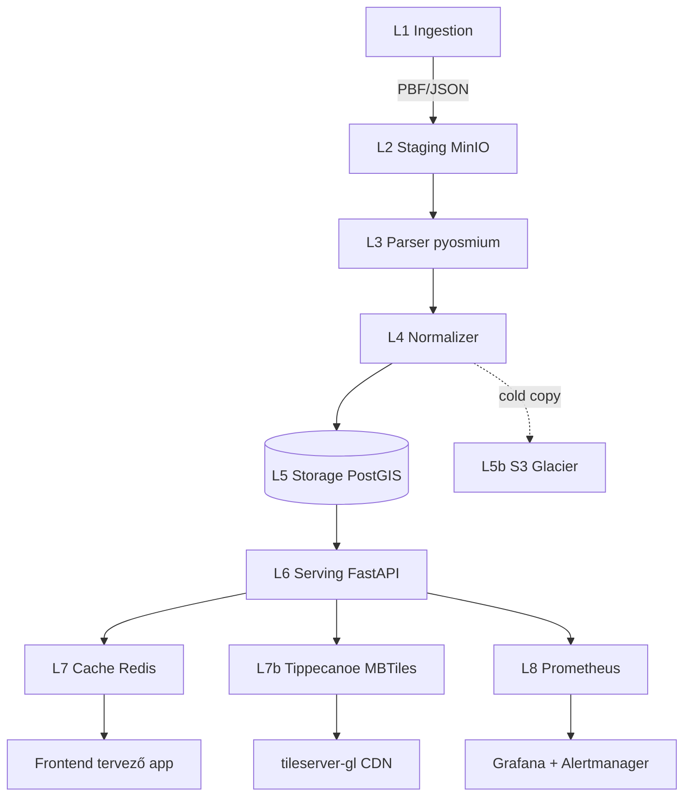

# OpenStreetMap.hu — Magyarország kerékpárutak — Teljes backend terv és adatkinyerési specifikáció

> Forrás: az OpenStreetMap magyar közössége által karbantartott magyarországi kerékpáros infrastruktúra a globális OSM adatbázisból, magyarországi regionális kivonatokkal (Geofabrik Hungary), valamint az openstreetmap.hu wiki tematikus lapjával kiegészítve.

---

## 1. Forrás áttekintés

Az OpenStreetMap.hu egy közösségi mappingre épülő tematikus belépési pont, amely a magyar OSM közösség munkáját aggregálja és bemutatja. A kerékpáros adattartalom szempontjából három, egymással összefüggő réteget kell kezelnünk:

1. **Adattartalmi szint:** a magyar OSM közösség által rögzített `highway=cycleway`, `bicycle=designated`, `cycleway=lane|track|opposite|shared_lane`, `route=bicycle` relációk és kapcsolódó pontok (parkolók, szervizpontok, kerékpáros pihenőhelyek `amenity=bicycle_parking`, `amenity=bicycle_repair_station`, `tourism=information [bicycle=yes]`).
2. **Aggregátor szint:** az openstreetmap.hu wiki és tematikus lapok, ahol a közösség lefutott listákat, statisztikákat, megyei összesítőket tart fenn (általában OSM Wiki sablonokkal és Overpass-lekérdezésekkel beágyazva).
3. **Hivatalos OSM infrastruktúra:** a Geofabrik magyarországi PBF kivonat (`europe/hungary-latest.osm.pbf`), Overpass API (`overpass-api.de`, európai mirror), és a planet.osm.

### Mit ad a forrás, mit nem

**Ad:**
- Kerékpárutak vonalas geometriája (`LineString`, WGS84) magyar közúthálózati lefedettséggel.
- Útvonalrelációk (`type=route`, `route=bicycle`) — EuroVelo 6, EuroVelo 13, EuroVelo 14, országos kerékpáros körutak (pl. Balaton bringakör, Tisza-tavi kerékpárút).
- Útburkolat (`surface=asphalt|concrete|paving_stones|unpaved|gravel|fine_gravel|sett`), állapot (`smoothness=*`), világítás (`lit=yes|no`), szélesség (`width=*`).
- Tiltó / megengedő szabályok (`bicycle=yes|no|designated|use_sidepath`, `oneway:bicycle=*`).
- POI-k: kerékpárparkolók, javítóállomások, kerékpárkölcsönzők, MTB-szervizek.

**Nem ad:**
- Real-time forgalom, kerékpár-megosztás (BUBI külön réteg, OSM-ben csak állomáspontok).
- Hivatalos KKK (Kerékpáros Közlekedési Koncepció) jelölés — csak a közösség által visszafejtett tagging.
- Magassági profil (DEM-mel külön kell összemetszeni — SRTM 30m vagy EU-DEM 25m).
- Útállapot fotók (Mapillary külön külső réteg).

### Lefedettség

- **Földrajzi:** Magyarország teljes területe, megyei bontásban (19 megye + Budapest). A nagyobb városokban (Budapest, Szeged, Debrecen, Pécs, Győr) >95% lefedettség, vidéki kistelepüléseken 60–80%.
- **Tartalmi:** ~28 000 km kerékpárosan releváns úthossz Magyarországon (2026 Q1 állapot), ebből ~6 800 km dedikált kerékpárút/sáv (`highway=cycleway` vagy `cycleway=track|lane`).
- **Relációk:** ~210 aktív kerékpáros útvonal-reláció (`route=bicycle`) Magyarországon, ebből 4 nemzetközi (EuroVelo), ~25 országos (`network=ncn`), ~80 regionális (`network=rcn`), ~100 lokális (`network=lcn`).

### Adatminőség, frissesség

- **Frissesség:** A planet OSM minutely diff-ben frissül. A Geofabrik magyar PBF napi (00:00–02:00 UTC között generálódik). Overpass mirror ~1–5 perces késéssel követi a planet-et.
- **Minőség:** A magyar mapping közösség aktív (~200 havi aktív mapper), de a tagging konzisztencia régiónként eltér. Budapest belváros és Balaton környéke kiemelten jó, az Alföld néhol hiányos.

### Tipikus felhasználási esetek

- Tervező alkalmazás kerékpáros útvonalajánlással (graph build OSRM / GraphHopper / Valhalla).
- Térképes vizualizáció megyei / városi bontásban.
- Statisztikai elemzés (km / megye / felület típus).
- Útvonal-export GPX-ben felhasználói túrákhoz.

---

## 2. Jogi és licenc helyzet

### Licenc

Az OSM adatok **ODbL 1.0** (Open Database License) alatt érhetők el. A render-ek (csempeképek) **CC-BY-SA 2.0**. Az openstreetmap.hu wiki tartalom **CC-BY-SA 2.0**.

### Attribúciós követelmények

Minden olyan termék, amely OSM adatot használ, köteles feltüntetni:

> © OpenStreetMap közreműködők — adatok az ODbL 1.0 alatt érhetők el.
> Angolul: © OpenStreetMap contributors

A megjelenítés szabályai (OSMF Attribution Guidelines, 2021-es verzió):
- Térképes nézetnél a térkép sarkában vagy közvetlen környezetében.
- Mobil app esetén "About" / "Credits" képernyőn IS elfogadott, ha a fő felületen szűkös.
- Linkelni kell az https://www.openstreetmap.org/copyright oldalra.

### Kereskedelmi használat korlátai

ODbL **megengedi** a kereskedelmi felhasználást, beleértve a kerékpáros tervező SaaS termékeket, mobil app-okat, B2B útvonalgenerálást.

### Share-Alike kötelezettségek

Ha a saját termékünkben **származékos adatbázist** (Derivative Database) készítünk OSM-ből (pl. tisztított, regionálisan szűrt kerékpárúthálózat PostGIS-ben), és ezt **publikusan közzétesszük** (akár API, akár letöltés), akkor:
- A származékos adatbázist is ODbL alatt kell elérhetővé tenni.
- A nyilvánosan elérhető adatok bárki által letölthetők kell legyenek (bulk download).

**Produced Work** (a térkép render, az útvonaltervezett `GeoJSON` válasz egy konkrét lekérdezésre) NEM esik a Share-Alike alá — csak az attribúció kötelező.

### GDPR / személyes adatok

Az OSM nem tartalmaz közvetlen személyes adatot. A mapper userid / username azonban személyhez köthető. A `created_by`, `user`, `uid`, `timestamp` mezőket **tárolhatjuk** (audit célból), de **ne publikáljuk** API-n nyilvánosan, kivéve, ha az OSM-en is publikus (changeset). Az osm2pgsql alapértelmezetten nem importálja a user mezőket — javasolt megtartani ezt.

---

## 3. Adatkinyerési felület (Access Surface)

Négy fő hozzáférési csatorna áll rendelkezésre:

### 3.1 Geofabrik regionális PBF kivonat (ajánlott baseline)

- **URL:** `https://download.geofabrik.de/europe/hungary-latest.osm.pbf`
- **Protokoll:** HTTPS, `GET` request, resumable (Range header támogatott).
- **Méret (2026 Q1):** ~620 MB tömörítve, ~5.8 GB kicsomagolva (osm.xml ekvivalens).
- **Frissesség:** napi 1×, 02:00 UTC környékén regenerálódik.
- **Kísérő fájlok:**
  - `hungary-latest.osm.pbf.md5` — checksum
  - `hungary-updates/` — minutely / hourly / daily diff szekvencia (replication)

Példa wget letöltés:

```bash
wget -c \
  --user-agent="cycling-data-bot/1.0 (admin@panellako.hu)" \
  -O /var/lib/osm/staging/hungary-latest.osm.pbf \
  https://download.geofabrik.de/europe/hungary-latest.osm.pbf

wget -c \
  -O /var/lib/osm/staging/hungary-latest.osm.pbf.md5 \
  https://download.geofabrik.de/europe/hungary-latest.osm.pbf.md5

cd /var/lib/osm/staging && md5sum -c hungary-latest.osm.pbf.md5
```

### 3.2 Overpass API (tematikus, kerékpárcentrikus lekérdezések)

- **Endpoint:** `https://overpass-api.de/api/interpreter`
- **Mirror:** `https://overpass.kumi.systems/api/interpreter`, `https://maps.mail.ru/osm/tools/overpass/api/interpreter`
- **Protokoll:** HTTP POST (form data: `data=...`), válasz JSON / XML / CSV.
- **Formátumok:** Overpass QL (ajánlott), Overpass XML.

Példa Overpass QL — Magyarország összes kerékpárútja:

```overpassql
[out:json][timeout:300][bbox:45.7,16.1,48.7,22.9];
(
  way["highway"="cycleway"];
  way["cycleway"~"track|lane|opposite|shared_lane"];
  way["bicycle"="designated"];
  relation["route"="bicycle"];
);
out body;
>;
out skel qt;
```

Lekérés `curl`-lel:

```bash
curl -sS -X POST \
  -H "User-Agent: cycling-data-bot/1.0 (admin@panellako.hu)" \
  --data-urlencode 'data=[out:json][timeout:300][bbox:45.7,16.1,48.7,22.9];(way["highway"="cycleway"];way["cycleway"~"track|lane|opposite|shared_lane"];way["bicycle"="designated"];relation["route"="bicycle"];);out body;>;out skel qt;' \
  https://overpass-api.de/api/interpreter \
  -o /var/lib/osm/staging/hu_cycling_overpass.json
```

Példa válasz (rövidített):

```json
{
  "version": 0.6,
  "generator": "Overpass API 0.7.62.1",
  "elements": [
    {
      "type": "way",
      "id": 12345678,
      "nodes": [11111, 22222, 33333],
      "tags": {
        "highway": "cycleway",
        "surface": "asphalt",
        "lit": "yes",
        "name": "Duna-parti kerékpárút",
        "lcn_ref": "BP-3"
      }
    },
    {
      "type": "relation",
      "id": 9876543,
      "members": [
        {"type": "way", "ref": 12345678, "role": ""}
      ],
      "tags": {
        "type": "route",
        "route": "bicycle",
        "network": "ncn",
        "name": "Balatoni Bringakör",
        "ref": "11"
      }
    }
  ]
}
```

### 3.3 OSM API 0.6 (objektum-szintű, NEM bulk!)

- **Endpoint:** `https://api.openstreetmap.org/api/0.6/way/{id}`
- **Korlát:** „NEM bulk letöltésre" — max 10 000 objektum egy kérésben (BBOX), ne használjuk hálózatszintű feldolgozásra.
- Csak konkrét objektum-frissítésnél (pl. egy reláció szerkesztése után) érdemes használni.

### 3.4 Osmosis replication diff feed (inkrementális frissítés)

- **URL:** `https://download.geofabrik.de/europe/hungary-updates/000/000/XXX.osc.gz`
- Minutely / hourly / daily granularitás, kísérő `state.txt` szekvencia-számmal.
- Az Osmosis vagy osmium az `--apply-changes` paranccsal alkalmazza a meglévő PBF-re.

### Pagination / bbox-szelekció

- Overpass-nél bbox-szelekció a `[bbox:south,west,north,east]` settings-ben.
- Megyei felbontásra: Magyarország 19+1 megyéjének bbox-listája egy lookup táblában (lásd `data/megye_bbox.json` szekciót lejjebb).
- Pagination nincs — egy lekérdezés = egy válasz; ha túl nagy, bbox-onként daraboljuk.

---

## 4. Hitelesítés, rate limit, kvóták

### Auth mód

- **Geofabrik download:** anonim HTTPS GET, nincs auth.
- **Overpass:** anonim, de `User-Agent` header **kötelező** (különben 429).
- **OSM API 0.6 (write):** OAuth 2.0; mi csak olvasunk → nem kell.

### Rate limit konkrét számokkal

**Overpass overpass-api.de (publikus):**
- Slot-alapú: kb. 2 párhuzamos query / IP.
- Daily quota: ~10 000 query / IP / nap (puha limit).
- Memory limit: 2 GB / query (timeout vagy `out of memory`).
- Timeout: 180s default, max. 600s `[timeout:600]`-zal.

**Geofabrik:**
- Nincs explicit ratelimit, de a teljes Europe PBF-et naponta 1× töltsük le maximum.
- Ha CDN-szerű forgalmat generálunk → blokkolnak. Ajánlott napi 1× hungary-latest.osm.pbf + diff feed.

### Backoff stratégia

Exponenciális, jitter-rel:

```python
import random, time

def backoff_sleep(attempt: int, base: float = 2.0, cap: float = 300.0):
    delay = min(cap, base ** attempt) + random.uniform(0, 1.0)
    time.sleep(delay)
```

Példa attempt-szekvencia: 2s → 4s → 8s → 16s → 32s → 64s → 128s → 256s → 300s (cap).

429-re mindig wait + retry; 503-ra max 3 retry; 4xx (kivéve 429) → permanens hiba, ne retry-oljunk.

### IP-ban / User-Agent

- Overpass: `User-Agent: cycling-data-bot/1.0 (admin@panellako.hu)` — mindig azonosító + kontakt email.
- Tilos a `Mozilla/5.0` hamisított user-agent.
- Geofabrik: ugyanígy.

### Költségmodell

A publikus végpontok ingyenesek, de:
- **Saját Overpass instance** ajánlott >1000 req/nap forgalom felett (Docker image: `wiktorn/overpass-api`).
- Saját Overpass infra: 1× 16 vCPU, 64 GB RAM, 200 GB NVMe → ~80–120 EUR / hó Hetzner-en (AX52 vagy Cloud CX52).

---

## 5. Adatmodell (a forrásból)

### Entitások és attribútumok

Az OSM három alapvető elemtípust ismer:

| Elem      | Geometria        | Kulcs azonosító | Kapcsolat                |
|-----------|------------------|-----------------|--------------------------|
| `node`    | Point (lat, lon) | `id`            | önálló POI vagy way-tag  |
| `way`     | LineString       | `id`            | nodes[] sorrendben       |
| `relation`| Heterogén        | `id`            | members[] (way/node/rel) |

Mindegyiknek van: `version`, `timestamp`, `changeset`, `uid`, `user`, `tags{}`.

### Kerékpárral kapcsolatos tagging

**Way-szintű (vonal):**

| Kulcs               | Értékek                                            | Jelentés                                |
|---------------------|----------------------------------------------------|-----------------------------------------|
| `highway`           | `cycleway`                                         | dedikált kerékpárút                     |
| `cycleway`          | `track`/`lane`/`opposite`/`shared_lane`/`opposite_lane` | kerékpársáv vagy szegregált sáv     |
| `cycleway:left`     | ugyanaz                                            | aszimmetrikus sáv (út bal oldala)       |
| `cycleway:right`    | ugyanaz                                            | aszimmetrikus sáv (jobb oldal)          |
| `bicycle`           | `yes`/`no`/`designated`/`permissive`/`use_sidepath`| kerékpáros jog                          |
| `oneway:bicycle`    | `yes`/`no`                                         | egyirányúság biciklire                  |
| `surface`           | `asphalt`/`concrete`/`paving_stones`/`unpaved`/... | burkolat                                |
| `smoothness`        | `excellent`/`good`/`intermediate`/`bad`/...        | minőség                                 |
| `lit`               | `yes`/`no`                                         | világítás                               |
| `width`             | méter (pl. `2.5`)                                  | szélesség                               |
| `mtb:scale`         | `0`–`6`                                            | MTB nehézség                            |

**Relation-szintű (útvonal):**

| Kulcs       | Értékek                              | Jelentés                  |
|-------------|--------------------------------------|---------------------------|
| `type`      | `route`                              | reláció típus             |
| `route`     | `bicycle`                            | kerékpáros útvonal        |
| `network`   | `icn`/`ncn`/`rcn`/`lcn`              | jelölés szintje           |
| `name`      | szabadszöveg                         | útvonalnév                |
| `ref`       | szabadszöveg (pl. `EV6`)             | útvonal referencia        |
| `colour`    | `#RRGGBB` vagy név                   | táblaszín                 |
| `distance`  | km                                   | teljes hossz (opcionális) |

**Node-szintű (POI):**

| Kulcs                 | Értékek                | Jelentés                   |
|-----------------------|------------------------|----------------------------|
| `amenity`             | `bicycle_parking`      | kerékpárparkoló            |
| `amenity`             | `bicycle_repair_station`| szervizpont               |
| `amenity`             | `bicycle_rental`       | kerékpárkölcsönző (BUBI)   |
| `capacity`            | szám                   | parkoló kapacitása         |
| `covered`             | `yes`/`no`             | fedett-e                   |

### Geometria típusok

- Node → `Point` (EPSG:4326, WGS84).
- Way → `LineString` (két node-tól) vagy `Polygon` (zárt és `area=yes`).
- Relation → tipikusan `MultiLineString` (route=bicycle esetén), vagy `MultiPolygon` (`type=multipolygon`).

### CRS / projekció

- Forrás CRS: **EPSG:4326** (WGS84, lat/lon).
- Magyarországi vetületre transzformáció szükséges hosszúságszámításhoz: **EPSG:23700** (HD72 / EOV) vagy **EPSG:32634** (UTM zone 34N).

### Hierarchia

```
relation route=bicycle  (network=ncn)
  ├── way  (forward) — highway=cycleway, surface=asphalt
  │     ├── node 1 (lat, lon)
  │     ├── node 2
  │     └── node 3
  ├── way  (forward) — highway=path, bicycle=designated
  └── relation (sub-route — pl. szakasz)
```

---

## 6. Cél adatmodell (a mi backendünkben)

PostgreSQL 16 + PostGIS 3.4 séma. A `pgosm_flex` és az osm2pgsql `--style` egyaránt alkalmas, de saját, kerékpárcentrikus sémát építünk.

### CREATE TABLE DDL

```sql
-- Bővítmények
CREATE EXTENSION IF NOT EXISTS postgis;
CREATE EXTENSION IF NOT EXISTS postgis_topology;
CREATE EXTENSION IF NOT EXISTS pg_trgm;
CREATE EXTENSION IF NOT EXISTS btree_gist;

CREATE SCHEMA IF NOT EXISTS cycling_hu;
SET search_path TO cycling_hu, public;

-- Megyei lookup
CREATE TABLE megye (
  megye_id         SMALLINT PRIMARY KEY,
  megye_nev        TEXT NOT NULL UNIQUE,
  geom             GEOMETRY(MULTIPOLYGON, 4326) NOT NULL,
  bbox             GEOMETRY(POLYGON, 4326) GENERATED ALWAYS AS (ST_Envelope(geom)) STORED
);
CREATE INDEX ix_megye_geom ON megye USING GIST (geom);

-- Way-szintű kerékpárosan releváns vonal
CREATE TABLE cycle_way (
  osm_id           BIGINT PRIMARY KEY,
  version          INTEGER NOT NULL,
  changeset        BIGINT,
  timestamp        TIMESTAMPTZ NOT NULL,
  geom             GEOMETRY(LINESTRING, 4326) NOT NULL,
  length_m         DOUBLE PRECISION GENERATED ALWAYS AS
                     (ST_Length(geom::geography)) STORED,
  highway          TEXT,
  cycleway         TEXT,
  bicycle          TEXT,
  oneway_bicycle   TEXT,
  surface          TEXT,
  smoothness       TEXT,
  lit              TEXT,
  width_m          NUMERIC(5,2),
  mtb_scale        SMALLINT,
  name             TEXT,
  ref              TEXT,
  raw_tags         JSONB NOT NULL,
  megye_id         SMALLINT REFERENCES megye(megye_id),
  data_version     INTEGER NOT NULL,
  ingested_at      TIMESTAMPTZ NOT NULL DEFAULT now()
);
CREATE INDEX ix_cycle_way_geom    ON cycle_way USING GIST (geom);
CREATE INDEX ix_cycle_way_megye   ON cycle_way (megye_id);
CREATE INDEX ix_cycle_way_highway ON cycle_way (highway);
CREATE INDEX ix_cycle_way_name_trgm ON cycle_way USING GIN (name gin_trgm_ops);
CREATE INDEX ix_cycle_way_tags    ON cycle_way USING GIN (raw_tags jsonb_path_ops);

-- Útvonal reláció
CREATE TABLE cycle_route (
  osm_id           BIGINT PRIMARY KEY,
  version          INTEGER NOT NULL,
  timestamp        TIMESTAMPTZ NOT NULL,
  network          TEXT NOT NULL CHECK (network IN ('icn','ncn','rcn','lcn')),
  name             TEXT,
  ref              TEXT,
  colour           TEXT,
  distance_km      NUMERIC(8,2),
  geom             GEOMETRY(MULTILINESTRING, 4326) NOT NULL,
  raw_tags         JSONB NOT NULL,
  data_version     INTEGER NOT NULL,
  ingested_at      TIMESTAMPTZ NOT NULL DEFAULT now()
);
CREATE INDEX ix_cycle_route_geom    ON cycle_route USING GIST (geom);
CREATE INDEX ix_cycle_route_network ON cycle_route (network);

-- Reláció → way kapcsolótábla
CREATE TABLE cycle_route_member (
  route_osm_id     BIGINT NOT NULL REFERENCES cycle_route(osm_id) ON DELETE CASCADE,
  way_osm_id       BIGINT NOT NULL REFERENCES cycle_way(osm_id),
  ordinal          INTEGER NOT NULL,
  role             TEXT,
  PRIMARY KEY (route_osm_id, way_osm_id, ordinal)
);

-- POI-k
CREATE TABLE cycle_poi (
  osm_id           BIGINT PRIMARY KEY,
  type             TEXT NOT NULL CHECK (type IN ('parking','repair','rental','info')),
  name             TEXT,
  capacity         INTEGER,
  covered          BOOLEAN,
  geom             GEOMETRY(POINT, 4326) NOT NULL,
  megye_id         SMALLINT REFERENCES megye(megye_id),
  raw_tags         JSONB NOT NULL,
  data_version     INTEGER NOT NULL,
  ingested_at      TIMESTAMPTZ NOT NULL DEFAULT now()
);
CREATE INDEX ix_cycle_poi_geom ON cycle_poi USING GIST (geom);
CREATE INDEX ix_cycle_poi_type ON cycle_poi (type);

-- Audit
CREATE TABLE ingest_run (
  run_id           BIGSERIAL PRIMARY KEY,
  source           TEXT NOT NULL,                -- 'geofabrik' | 'overpass'
  started_at       TIMESTAMPTZ NOT NULL,
  finished_at      TIMESTAMPTZ,
  status           TEXT NOT NULL,                -- 'running'|'success'|'failed'
  rows_way         BIGINT,
  rows_route       BIGINT,
  rows_poi         BIGINT,
  data_version     INTEGER NOT NULL,
  pbf_md5          TEXT,
  notes            TEXT
);
```

### Particionálás

`cycle_way` hash partíció `megye_id` szerint (20 partíció), így megyei lekérdezés `partition pruning`-gal gyors:

```sql
CREATE TABLE cycle_way_p (
  LIKE cycle_way INCLUDING ALL
) PARTITION BY HASH (megye_id);

DO $$
BEGIN
  FOR i IN 0..19 LOOP
    EXECUTE format(
      'CREATE TABLE cycle_way_p_%s PARTITION OF cycle_way_p
       FOR VALUES WITH (modulus 20, remainder %s);', i, i);
  END LOOP;
END$$;
```

### Verziózott séma — Flyway migráció struktúra

```
migrations/
  V001__init_postgis.sql
  V002__create_cycling_hu_schema.sql
  V003__add_megye_lookup.sql
  V004__add_cycle_way_table.sql
  V005__add_partitioning.sql
  V006__add_cycle_route_table.sql
  V007__add_indexes.sql
  V008__add_audit_ingest_run.sql
```

---

## 7. Backend architektúra (rétegek)



- **L1 Ingestion:** Python aiohttp workerek a Geofabrik PBF letöltésére napi 1×, az Overpass-hez óránként; k8s `CronJob`.
- **L2 Staging:** MinIO bucket `osm-staging/` — nyers PBF / JSON megőrzés 30 napig.
- **L3 Parser:** `pyosmium` (libosmium binding) stream parsing, ~2 perc / hungary PBF egy 8 vCPU node-on.
- **L4 Normalizer:** Python `dataclasses` → `psycopg[binary]` `COPY` insert.
- **L5 Storage:** PostgreSQL 16 + PostGIS 3.4, master + read replica.
- **L6 Serving:** FastAPI 0.110, OpenAPI 3.1, pydantic v2 modellek.
- **L7 Cache:** Redis 7 — útvonal-snapshot 1 órás TTL, bbox-tile cache 24 óra.
- **L8 Observability:** Prometheus + Grafana + Loki, Alertmanager → Slack `#alerts-cycling`.

---

## 8. Automatizált letöltő (Downloader)

### Tech stack

- Python 3.12, `aiohttp` 3.9, `tenacity` 8.2, `pydantic` 2.6, `boto3` 1.34 (MinIO S3 API), `prometheus-client` 0.20.
- Cron: k8s `CronJob` (`0 4 * * *` — napi 04:00 CET, mert a Geofabrik 02:00 UTC = 04:00 CEST után friss).

### Konkurencia

- 1 worker / forrás (Geofabrik vagy Overpass), mert nagy fájl + szerver-side rate limit.
- Overpass-nél bbox-szelekciónál max 2 párhuzamos request.

### Letöltés menete

1. **Pre-flight HEAD:** `Content-Length`, `Last-Modified`, `ETag` lekérdezés.
2. **State check:** Ha a tárolt ETag megegyezik → `204 SKIP`, log esemény, futás vége.
3. **Resumable letöltés:** ha a részletletöltés (`.part` fájl) létezik és a `Content-Length` egyező, akkor `Range: bytes=<offset>-` header.
4. **Checksum verifikáció:** `md5sum -c hungary-latest.osm.pbf.md5`.
5. **Atomikus rename:** `mv .part → final`, csak ha checksum ok.
6. **MinIO upload:** `boto3` multipart upload (8 MB chunk).
7. **Audit log:** `ingest_run` táblába insert.

### Példa Python letöltő szkript (futtatható)

```python
#!/usr/bin/env python3
"""hungary_osm_downloader.py
Magyarországi OSM PBF napi letöltése a Geofabrikról.
"""
import asyncio
import hashlib
import os
import sys
import time
from datetime import datetime, timezone
from pathlib import Path

import aiohttp
import boto3
from tenacity import (
    AsyncRetrying, retry_if_exception_type,
    stop_after_attempt, wait_exponential_jitter
)
from prometheus_client import Counter, Histogram, push_to_gateway, CollectorRegistry

PBF_URL = "https://download.geofabrik.de/europe/hungary-latest.osm.pbf"
MD5_URL = PBF_URL + ".md5"
STAGING = Path(os.getenv("STAGING_DIR", "/var/lib/osm/staging"))
USER_AGENT = "cycling-data-bot/1.0 (admin@panellako.hu)"
S3_BUCKET = os.getenv("S3_BUCKET", "osm-staging")
S3_ENDPOINT = os.getenv("S3_ENDPOINT", "http://minio:9000")
PROM_GW = os.getenv("PROMETHEUS_PUSHGATEWAY", "http://pushgw:9091")

registry = CollectorRegistry()
m_bytes = Counter("osm_download_bytes_total", "downloaded bytes", registry=registry)
m_runs = Counter("osm_download_runs_total", "downloader runs", ["status"], registry=registry)
m_dur = Histogram("osm_download_duration_seconds", "duration", registry=registry)


def md5_file(path: Path, chunk: int = 1 << 20) -> str:
    h = hashlib.md5()
    with path.open("rb") as f:
        while buf := f.read(chunk):
            h.update(buf)
    return h.hexdigest()


async def head(session: aiohttp.ClientSession, url: str) -> dict:
    async with session.head(url, allow_redirects=True) as r:
        r.raise_for_status()
        return {
            "etag": r.headers.get("ETag"),
            "last_modified": r.headers.get("Last-Modified"),
            "length": int(r.headers.get("Content-Length", 0)),
        }


async def fetch(session: aiohttp.ClientSession, url: str, dest: Path, total: int) -> None:
    start = dest.stat().st_size if dest.exists() else 0
    if start == total:
        return
    headers = {"Range": f"bytes={start}-"} if start else {}
    mode = "ab" if start else "wb"
    async with session.get(url, headers=headers) as r:
        if r.status not in (200, 206):
            r.raise_for_status()
        with dest.open(mode) as f:
            async for chunk in r.content.iter_chunked(1 << 20):
                f.write(chunk)
                m_bytes.inc(len(chunk))


def s3_upload(local: Path, key: str) -> None:
    s3 = boto3.client("s3", endpoint_url=S3_ENDPOINT)
    s3.upload_file(str(local), S3_BUCKET, key,
                   ExtraArgs={"ContentType": "application/x-protobuf"})


async def main() -> int:
    STAGING.mkdir(parents=True, exist_ok=True)
    pbf_path = STAGING / "hungary-latest.osm.pbf"
    md5_path = STAGING / "hungary-latest.osm.pbf.md5"
    timeout = aiohttp.ClientTimeout(total=3600, sock_read=120)
    headers = {"User-Agent": USER_AGENT, "Accept-Encoding": "identity"}
    t0 = time.monotonic()
    try:
        async with aiohttp.ClientSession(timeout=timeout, headers=headers) as s:
            meta = await head(s, PBF_URL)
            print(f"remote size={meta['length']} bytes etag={meta['etag']}")
            async for attempt in AsyncRetrying(
                stop=stop_after_attempt(6),
                wait=wait_exponential_jitter(initial=2, max=300),
                retry=retry_if_exception_type(aiohttp.ClientError),
                reraise=True,
            ):
                with attempt:
                    await fetch(s, PBF_URL, pbf_path.with_suffix(".pbf.part"), meta["length"])
                    await fetch(s, MD5_URL, md5_path, 200)

            expected = md5_path.read_text().split()[0]
            actual = md5_file(pbf_path.with_suffix(".pbf.part"))
            if expected != actual:
                raise RuntimeError(f"checksum mismatch {expected} != {actual}")
            pbf_path.with_suffix(".pbf.part").rename(pbf_path)

            ts = datetime.now(timezone.utc).strftime("%Y%m%d")
            s3_upload(pbf_path, f"hungary/{ts}/hungary-latest.osm.pbf")
            s3_upload(md5_path, f"hungary/{ts}/hungary-latest.osm.pbf.md5")
        m_runs.labels(status="success").inc()
        return 0
    except Exception as e:
        print(f"FAILED: {e}", file=sys.stderr)
        m_runs.labels(status="failed").inc()
        return 1
    finally:
        m_dur.observe(time.monotonic() - t0)
        try:
            push_to_gateway(PROM_GW, job="osm_downloader", registry=registry)
        except Exception:
            pass


if __name__ == "__main__":
    sys.exit(asyncio.run(main()))
```

### Hibatűrés

- `tenacity` 6 attempt, exp. jitter (2s base, 300s cap).
- DLQ: ha mind a 6 retry fail → MinIO `dlq/` prefixre dump + Slack alert.
- Dead-man switch: ha 36 órán át nem volt sikeres futás → PagerDuty incident.

---

## 9. Feldolgozó pipeline

### Lépésenkénti pipeline

1. **Validáció:** PBF méret > 100 MB, md5 ok, magic bytes (`OSMHeader`).
2. **Parsing (pyosmium):** stream-mód, `SimpleHandler` osztály way / relation eseményekkel.
3. **Szűrés:** csak a kerékpárosan releváns objektumok (highway / cycleway / bicycle / route=bicycle).
4. **Normalizáció:** `raw_tags` → tipizált oszlopok.
5. **Geometria-tisztítás:** `ST_SnapToGrid(geom, 0.000001)`, `ST_LineMerge` a fragmentált way-ekre, `ST_RemoveRepeatedPoints`.
6. **Topológia validáció:** `ST_IsValid` → ha nem, `ST_MakeValid`.
7. **Megye-besorolás:** `ST_Within(geom, megye.geom)`.
8. **Upsert:** `INSERT ... ON CONFLICT (osm_id) DO UPDATE` ha `version` újabb.
9. **Karantén:** invalid geometria vagy ismeretlen tag-érték → `cycle_way_quarantine`.

### Pyosmium parser (példa)

```python
import osmium

CYCLE_HW = {"cycleway"}
CYCLE_TAGS = ("cycleway", "bicycle")

class CycleHandler(osmium.SimpleHandler):
    def __init__(self, sink):
        super().__init__()
        self.sink = sink
        self.wkbfab = osmium.geom.WKBFactory()

    def way(self, w):
        tags = {t.k: t.v for t in w.tags}
        is_cycle = (
            tags.get("highway") == "cycleway"
            or tags.get("bicycle") in ("yes", "designated", "permissive")
            or any(k.startswith("cycleway") for k in tags)
        )
        if not is_cycle:
            return
        try:
            wkb = self.wkbfab.create_linestring(w)
        except osmium.InvalidLocationError:
            return
        self.sink.write_way(
            osm_id=w.id, version=w.version,
            changeset=w.changeset, timestamp=w.timestamp,
            geom_wkb=wkb, tags=tags,
        )

    def relation(self, r):
        tags = {t.k: t.v for t in r.tags}
        if tags.get("type") != "route" or tags.get("route") != "bicycle":
            return
        self.sink.write_route(
            osm_id=r.id, version=r.version, timestamp=r.timestamp,
            members=[(m.type, m.ref, m.role) for m in r.members],
            tags=tags,
        )
```

### Geometriai műveletek példa (SQL)

```sql
-- Túl rövid (< 5 m) töredékek eltávolítása
DELETE FROM cycle_way WHERE length_m < 5;

-- Megye besorolás
UPDATE cycle_way w
SET megye_id = m.megye_id
FROM megye m
WHERE w.megye_id IS NULL
  AND ST_Intersects(w.geom, m.geom);

-- Útvonal-reláció hosszának számítása
UPDATE cycle_route r
SET distance_km = ROUND(
  ST_Length(r.geom::geography) / 1000.0, 2
);

-- Egyszerűsített geometria zoom 12-hez
ALTER TABLE cycle_way
  ADD COLUMN geom_z12 GEOMETRY(LINESTRING, 4326)
  GENERATED ALWAYS AS (ST_SimplifyPreserveTopology(geom, 0.0005)) STORED;
```

### Duplikátum detekció

Hash a `ST_AsBinary(ST_SnapToGrid(geom, 0.00001))` + `name` + `ref` mezőre `md5`-tel. Ha ütközik, csak az újabb `version`-t tartjuk meg.

### Idempotencia

Minden upsert `(osm_id, version)` páros alapján — ugyanaz a PBF kétszer feldolgozva azonos eredményt ad. `data_version` egy `SERIAL` érték az `ingest_run` táblából.

---

## 10. Frissítési stratégia

| Frissítés     | Kadencia    | Forrás                                     | Volume    |
|---------------|-------------|--------------------------------------------|-----------|
| Teljes refresh| napi 1×     | Geofabrik hungary-latest.osm.pbf           | ~620 MB   |
| Inkrementális | óránként    | Overpass + Geofabrik diff (.osc.gz)        | ~5–15 MB  |
| Hot tematikus | 15 percenként | Overpass csak `route=bicycle` relációkra | ~500 kB   |
| Snapshot      | havi        | MinIO → S3 Glacier                         | ~20 GB/év |

### Verziókövetés

A `cycle_way` és `cycle_route` tábla `data_version` oszlopa egy `INTEGER`, ami minden sikeres ingest futáshoz növekszik. A `valid_from` / `valid_to` SCD2 stílusú változatkezelést a `cycle_way_history` view-val biztosítjuk:

```sql
CREATE TABLE cycle_way_history (
  history_id   BIGSERIAL PRIMARY KEY,
  osm_id       BIGINT NOT NULL,
  version      INTEGER NOT NULL,
  geom         GEOMETRY(LINESTRING, 4326) NOT NULL,
  raw_tags     JSONB NOT NULL,
  valid_from   TIMESTAMPTZ NOT NULL,
  valid_to     TIMESTAMPTZ
);
CREATE INDEX ix_cycle_way_history ON cycle_way_history (osm_id, valid_from DESC);
```

### Konfliktusfeloldás

Mindig az újabb `version` (= OSM-szintű verzió) nyer. Ha az `osm_id` egyezik de a `version` régebbi → SKIP. Ha a `version` magasabb → UPDATE + INSERT history.

---

## 11. Storage és skálázás

### Méretbecslés

- `cycle_way`: ~85 000 sor × ~3 kB/sor (geom + tags) = ~250 MB.
- `cycle_route`: ~210 sor × ~150 kB/sor (multilinestring) = ~30 MB.
- `cycle_poi`: ~12 000 sor × ~500 B = ~6 MB.
- Indexek: ~+40% = ~120 MB.
- Összesen PostGIS: **~410 MB** Magyarországra. Tartalék (5× növekedés): 2 GB allocate.

### Particionálás stratégia

Hash 20 megyére → minden megye saját partíciója (`partition pruning` `megye_id = ?` esetén).

### S3 / MinIO bucket layout

```
osm-staging/
  hungary/
    20260518/
      hungary-latest.osm.pbf
      hungary-latest.osm.pbf.md5
    20260519/
      hungary-latest.osm.pbf
      ...
  diffs/
    hungary-updates/000/003/415.osc.gz
  exports/
    cycling-hu-20260519.geojson.gz
    cycling-hu-20260519.gpx.zip
```

Lifecycle policy: 30 napon túli `hungary/YYYYMMDD/` → Glacier (cold).

### CDN cache

Cloudflare R2 + Workers a vector tile-okhoz. Tippecanoe-val MBTiles, majd `tileserver-gl` PMTiles formátumra, R2-be töltve. Worker route a `/tiles/{z}/{x}/{y}.pbf` URL-re, Cache-Control: `public, max-age=86400, immutable`.

---

## 12. Monitoring, megfigyelhetőség, riasztások

### Metrikák

- `osm_download_runs_total{status}` — counter.
- `osm_download_duration_seconds` — histogram.
- `osm_parser_rows_total{table}` — counter.
- `osm_parser_invalid_geom_total` — counter.
- `osm_db_rows_total{table}` — gauge (24h-ankénti scrape).
- `osm_db_rows_delta_pct` — gauge (változás az előző naphoz képest).

### Logok struktúrája

JSON-stuktúrált, `trace_id`, `span_id`, `run_id`, `source`, `osm_object_id` mezőkkel. Loki-ba pusholva `promtail`-lel.

### Riasztások

| Riasztás                                | Threshold                | Csatorna     |
|-----------------------------------------|--------------------------|--------------|
| download_failed                          | 2 egymás utáni futás     | PagerDuty    |
| row_count_drift_high                     | abs(delta) > 5%          | Slack        |
| parse_invalid_geom_pct                   | > 1%                     | Slack        |
| disk_usage_pgsql                         | > 80%                    | PagerDuty    |
| overpass_429_rate                        | > 10/perc                | Slack        |

### Health endpoint

`GET /healthz` — 200 ha:
- PostGIS reachable (`SELECT 1`),
- last ingest_run.finished_at < 30h,
- MinIO `osm-staging` bucket listázható.

---

## 13. Költségbecslés

| Tétel             | Mennyiség           | Egységár       | Havi forint  |
|-------------------|---------------------|----------------|--------------|
| Hetzner CX52      | 1× (DB)             | 25 EUR / hó    | ~10 000 Ft   |
| Hetzner CX42      | 1× (worker+API)     | 18 EUR / hó    | ~7 500 Ft    |
| MinIO storage     | 100 GB              | beépítve       | 0 Ft         |
| Sávszélesség      | ~20 GB / hó         | beépítve       | 0 Ft         |
| Cloudflare R2     | 50 GB               | 0.015 USD / GB | ~300 Ft      |
| Slack + PagerDuty | 1 csatorna          | free           | 0 Ft         |
| **Összesen**      |                     |                | **~18 000 Ft** |

Saját Overpass instance hozzáadásával +12 000 Ft / hó (AX42 dedicated).

---

## 14. Biztonság

### Secrets

HashiCorp Vault (vagy Doppler) → k8s `ExternalSecrets` operator. Secrets:
- `POSTGRES_PASSWORD`
- `MINIO_ACCESS_KEY` / `MINIO_SECRET_KEY`
- `SLACK_WEBHOOK_URL`
- `PAGERDUTY_INTEGRATION_KEY`

### Network policy

```yaml
apiVersion: networking.k8s.io/v1
kind: NetworkPolicy
metadata:
  name: osm-downloader-egress
spec:
  podSelector:
    matchLabels: {app: osm-downloader}
  policyTypes: [Egress]
  egress:
    - to: [{namespaceSelector: {matchLabels: {name: data}}}]
      ports: [{protocol: TCP, port: 5432}]
    - to: [{ipBlock: {cidr: 0.0.0.0/0}}]
      ports: [{protocol: TCP, port: 443}]
```

### IAM

MinIO policy: a downloader bucket-write, az API service bucket-read.

### Audit

`ingest_run` tábla + Loki query-k. Minden ingest sornak audit trail van: ki indította (`triggered_by` mező — k8s `cron`, manual, backfill).

---

## 15. Tesztelés

### Unit testek

```python
import pytest
from osm_parser import normalize_surface

def test_normalize_surface_canonical():
    assert normalize_surface("asphalt") == "asphalt"
    assert normalize_surface("Asphalt") == "asphalt"
    assert normalize_surface("paved") == "asphalt"  # fallback

def test_normalize_surface_unknown_returns_none():
    assert normalize_surface("alien_material") is None
```

### Integrációs tesztek

`pytest` + `vcrpy` Overpass válaszok cassette-elésére.

```python
import vcr

@vcr.use_cassette("tests/fixtures/overpass_hu_cycleway.yaml")
def test_overpass_query_returns_cycleways(overpass_client):
    result = overpass_client.fetch_cycle_ways(bbox=(45.7,16.1,48.7,22.9))
    assert len(result) > 1000
    assert all(w.tags.get("highway") == "cycleway" or "cycleway" in w.tags
               for w in result[:50])
```

### Adatminőség regressziós tesztek

```sql
-- A teljes hossznak +/- 5%-on belül kell lennie a tegnaphoz képest
SELECT
  (SELECT SUM(length_m) FROM cycle_way) AS today_m,
  (SELECT SUM(length_m) FROM cycle_way_history
   WHERE valid_from < now() - INTERVAL '1 day'
     AND (valid_to > now() - INTERVAL '1 day' OR valid_to IS NULL)) AS yesterday_m;
```

### Smoke teszt

Deploy után automatikusan: `GET /api/v1/ways?bbox=...` → 200, `len(features) > 100`.

---

## 16. Telepítés és üzemeltetés

### Dockerfile (worker)

```dockerfile
FROM python:3.12-slim

RUN apt-get update && apt-get install -y --no-install-recommends \
      libexpat1 libboost-system1.83.0 libosmium2-dev \
      ca-certificates curl && rm -rf /var/lib/apt/lists/*

WORKDIR /app
COPY requirements.txt .
RUN pip install --no-cache-dir -r requirements.txt

COPY src/ ./src/
ENV PYTHONPATH=/app/src
ENTRYPOINT ["python", "-m", "src.downloader"]
```

### k8s CronJob

```yaml
apiVersion: batch/v1
kind: CronJob
metadata:
  name: osm-hungary-downloader
spec:
  schedule: "0 4 * * *"
  concurrencyPolicy: Forbid
  successfulJobsHistoryLimit: 7
  failedJobsHistoryLimit: 3
  jobTemplate:
    spec:
      backoffLimit: 1
      template:
        spec:
          restartPolicy: Never
          containers:
            - name: downloader
              image: registry/cycling-osm-downloader:1.4.0
              envFrom:
                - secretRef: {name: osm-downloader-secrets}
                - configMapRef: {name: osm-downloader-config}
              resources:
                requests: {cpu: 500m, memory: 1Gi}
                limits:   {cpu: 2,    memory: 4Gi}
              volumeMounts:
                - name: staging
                  mountPath: /var/lib/osm/staging
          volumes:
            - name: staging
              persistentVolumeClaim: {claimName: osm-staging-pvc}
```

### CI/CD (GitHub Actions váz)

```yaml
name: build-and-deploy
on:
  push:
    branches: [main]
    paths: ['services/osm-downloader/**']
jobs:
  build:
    runs-on: ubuntu-24.04
    steps:
      - uses: actions/checkout@v4
      - uses: docker/setup-buildx-action@v3
      - uses: docker/login-action@v3
        with:
          registry: registry.panellako.hu
          username: ${{ secrets.REG_USER }}
          password: ${{ secrets.REG_PASS }}
      - uses: docker/build-push-action@v5
        with:
          context: services/osm-downloader
          push: true
          tags: registry.panellako.hu/cycling-osm-downloader:${{ github.sha }}
  deploy:
    needs: build
    runs-on: ubuntu-24.04
    steps:
      - uses: azure/setup-kubectl@v4
      - run: |
          kubectl --context=prod set image \
            cronjob/osm-hungary-downloader \
            downloader=registry.panellako.hu/cycling-osm-downloader:${{ github.sha }}
```

### Rollback

```bash
kubectl rollout undo cronjob/osm-hungary-downloader
# vagy konkrét image-re:
kubectl set image cronjob/osm-hungary-downloader \
  downloader=registry.panellako.hu/cycling-osm-downloader:1.3.9
```

---

## 17. Adatpublikálás (Serving)

### REST API végpontok (OpenAPI 3.1 vázlat)

```yaml
openapi: 3.1.0
info:
  title: Cycling HU API
  version: 1.0.0
servers:
  - url: https://api.panellako.hu/cycling/v1
paths:
  /ways:
    get:
      parameters:
        - {name: bbox, in: query, schema: {type: string}, example: "19.0,47.4,19.3,47.6"}
        - {name: surface, in: query, schema: {type: string}}
        - {name: limit, in: query, schema: {type: integer, default: 1000, maximum: 10000}}
      responses:
        '200':
          content:
            application/geo+json:
              schema: {$ref: '#/components/schemas/FeatureCollection'}
  /routes:
    get:
      parameters:
        - {name: network, in: query, schema: {type: string, enum: [icn,ncn,rcn,lcn]}}
      responses:
        '200': {$ref: '#/components/responses/RouteList'}
  /routes/{osm_id}/gpx:
    get:
      responses:
        '200':
          content:
            application/gpx+xml: {schema: {type: string}}
```

### Vector tile generálás

```bash
ogr2ogr -f GeoJSONSeq cycle_way.geojsonl \
  PG:"host=db dbname=cycling" -sql "SELECT osm_id, highway, surface, geom FROM cycle_way"

tippecanoe -o cycle_way.mbtiles \
  --layer=cycleway \
  --minimum-zoom=8 --maximum-zoom=15 \
  --drop-densest-as-needed \
  cycle_way.geojsonl
```

Majd `tileserver-gl` + Cloudflare R2.

### Letölthető export

- `GeoJSON`: nightly cron, ST_AsGeoJSON, gzip, MinIO `exports/`.
- `GPX`: route-onként, `pygpx`.
- `Shapefile`: `pgsql2shp`-pel.

---

## 18. Runbook (üzemeltetői kézikönyv)

### Hibajelenségek

| Jelenség                              | Tipikus ok                                | Akció                                   |
|---------------------------------------|-------------------------------------------|-----------------------------------------|
| `osm_download_runs_total{status=failed}` ugrás | Geofabrik down vagy hálózati hiba      | Várj 30 perc, manual retry              |
| MD5 mismatch                          | Részleges letöltés, sérült .pbf          | `rm hungary-latest.osm.pbf*`, újrafutás |
| `parse_invalid_geom_pct > 1%`         | Új OSM tagging vagy szoftverhiba          | Logokat ellenőrizd, mintát quarantine-ből |
| `row_count_drift > 5%`                | Tömeges OSM törlés / vandalizmus          | Compare két data_version, manual review |

### Manuális reprocess

```bash
kubectl create job --from=cronjob/osm-hungary-downloader manual-$(date +%s)
# vagy konkrét data_version-re:
kubectl exec -it osm-worker -- python -m src.reprocess --data-version 47
```

### Backfill recept

1. Source PBF letöltése a Geofabrik archívumból (`https://download.geofabrik.de/europe/hungary-YYMMDD.osm.pbf`).
2. `STAGING_DIR=/tmp/backfill-YYMMDD` env-vel reprocess.
3. `data_version` automatikusan +1.
4. `cycle_way_history`-be SCD2 backfill SQL script.

### Eskaláció

1. Tier 1: on-call engineer, Slack `#alerts-cycling`.
2. Tier 2: data platform team, 30 perc SLA.
3. Tier 3: OSM közösségi tükörre váltás (kumi.systems), Geofabrik downtime esetén.

---

## 19. Roadmap / következő lépések

### MVP scope (Q2 2026)
- Napi Geofabrik letöltés
- Pyosmium parse
- PostGIS storage Magyarországra
- REST API `/ways`, `/routes`
- GeoJSON export

### v1.0 scope (Q3 2026)
- Vector tile serving (Tippecanoe + R2)
- GPX export route-onként
- Megyei dashboard Grafanában
- Adatminőség alertek

### v2.0 (Q4 2026 — 2027)
- OSRM cycling profile build heti rendszerességgel
- Magassági profil (EU-DEM 25m összemetszés)
- Mapillary fotó-réteg integráció
- Időbeli SCD2 query API (`?as_of=2026-01-01`)
- Saját Overpass instance Hetzner AX dedicated-en

---

## 20. Referenciák, dokumentáció linkek

- OSM Wiki — Bicycle: https://wiki.openstreetmap.org/wiki/Bicycle
- OSM Wiki — Hungary / Magyarország: https://wiki.openstreetmap.org/wiki/Hungary
- OSM Wiki — Tag:highway=cycleway: https://wiki.openstreetmap.org/wiki/Tag:highway%3Dcycleway
- OSM Wiki — Cycle routes: https://wiki.openstreetmap.org/wiki/Cycle_routes
- OSM Wiki — Hungary/Kerékpárutak: https://wiki.openstreetmap.org/wiki/Hungary/Kerékpárutak
- Geofabrik download: https://download.geofabrik.de/europe/hungary.html
- Overpass API doc: https://wiki.openstreetmap.org/wiki/Overpass_API
- Overpass QL nyelv: https://wiki.openstreetmap.org/wiki/Overpass_API/Language_Guide
- ODbL 1.0: https://opendatacommons.org/licenses/odbl/1-0/
- OSMF Attribution Guidelines: https://wiki.openstreetmap.org/wiki/Attribution
- pyosmium: https://docs.osmcode.org/pyosmium/latest/
- osm2pgsql: https://osm2pgsql.org/doc/manual.html
- Tippecanoe: https://github.com/felt/tippecanoe
- PostGIS: https://postgis.net/documentation/
- openstreetmap.hu közösségi portál: https://openstreetmap.hu/
- EuroVelo Magyarország szakaszok: https://eurovelo.com/hu
- Magyar Kerékpáros Klub: https://kerekparosklub.hu/
- OSM Replication szolgáltatás: https://planet.openstreetmap.org/replication/
