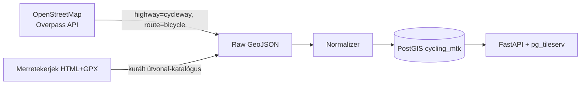
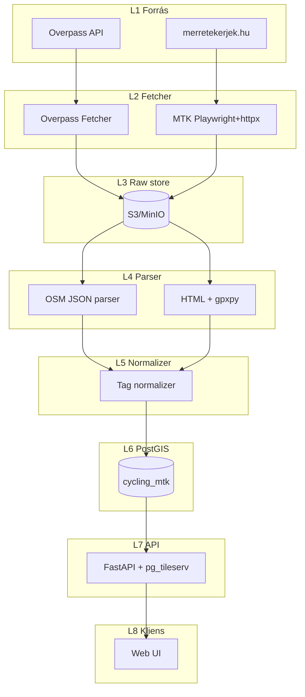

# Merretekerjek (merretekerjek.hu) — Teljes backend terv és adatkinyerési specifikáció

## 1. Forrás áttekintés

A **Merretekerjek** (`https://merretekerjek.hu`) egy magyar nyelvű, kerékpáros túrázásra fókuszáló webes alkalmazás, amelynek központi célja, hogy a Magyarországon (és részben a környező Kárpát-medencei területeken) elérhető **kerékpáros infrastruktúrát** — kerékpárutakat, ajánlott útvonalakat, EuroVelo-szakaszokat, kerékpáros pihenőket — egységes felületen, **interaktív térképen** mutassa be. A webes app az **OpenStreetMap** adatszerkezetére épít: a megjelenített rétegek (kerékpárutak, kerékpárosbarát utak, túraútvonalak) lényegében az OSM `highway=cycleway`, `cycleway:*=*`, `route=bicycle` taxonómiájának vizualizációi — kiegészítve a Merretekerjek üzemeltetői által kurálttartalommal (saját útvonal-leírások, fényképek, nehézség- és burkolat-attribútumok).

A Merretekerjek tehát **nem önálló elsődleges adatforrás** abban az értelemben, hogy a kerékpárinfrastruktúra-rétegek (cycleway-ek, MTB-pályák, kerékpáros túraútvonalak) az **OpenStreetMap** közösségi adatbázisából származnak — viszont **kurátorként** komoly hozzáadott értéket képvisel:

- **Saját útvonal-katalógus**: a szerkesztők összeállított ajánlott túrákat tesznek közzé (GPX letöltéssel, fényképekkel, nehézség- és táj-leírásokkal).
- **Réteg-szűrők**: az OSM nyers tag-jeit a felhasználó számára érthető kategóriákba ("családbarát", "MTB", "gravel", "EuroVelo") szervezi.
- **POI-k**: kerékpáros barát szállás, szerviz, étterem, pihenő — szintén OSM-alapokon, de gondozott listával.

Ez a specifikáció a Merretekerjek **kétlábú adatkinyerését** írja le:

1. **OSM-láb**: a forrás-leghűségesebb módon közvetlenül az **Overpass API**-tól kérjük le ugyanazokat a kerékpáros tag-eket, amelyeket a Merretekerjek is megjelenít, Magyarországra szűkítve a hivatalos `BBOX_HU = (16.0, 45.7, 22.9, 48.6)` bounding boxszal.
2. **Merretekerjek-láb**: a saját kurált útvonal-katalógusukat, GPX-eket és metaadatokat (etikus scraping + adatmegosztási megállapodás iránti hivatalos megkeresés mellett) közvetlenül a Merretekerjek oldalairól szedjük le.

A kettős megközelítés biztosítja, hogy:

- **Adat-szuverenitás**: a kerékpárinfrastruktúra-réteget a saját szerverünkön az OSM eredetből építjük fel, így nem függünk a Merretekerjek üzembiztonságától.
- **Hozzáadott érték**: a Merretekerjek-specifikus tartalom (kurált túrák, képek, nehézségi besorolás) önálló rétegként elérhetővé válik.



## 2. Jogi és licenc helyzet (szerzői jog, ToS, attribution)

A két adatláb **élesen eltérő** licenc-helyzetben van — ez egy szándékos tervezési előny is, mert ha a Merretekerjek-lábból a jövőben ki kéne hátrálnunk, az OSM-láb akkor is teljes értékű marad.

**2.1 OSM-réteg (a kerékpárinfrastruktúra-rétegek)**

- Licenc: **Open Database License 1.0 (ODbL)**.
- Forrásmegjelölés: a végfelhasználói felületen kötelező megjeleníteni: **© OpenStreetMap-közreműködők** (rövid forma: *© OpenStreetMap contributors*).
- A licenc **share-alike**: bármely származékos adatbázis, amelyet publikálunk, szintén ODbL-szabású kell, hogy legyen, vagy az ODbL Section 4.6 szerinti "Produced Work" kivételt használjuk (vizualizáció és csak tile-os/PDF kimenet).
- Felhasználói visszacsatolás (track logging, javítás) **vissza** is kell, hogy menjen az OSM-be, ha lehetséges.

**2.2 Merretekerjek-réteg (kurált tartalom)**

- A `merretekerjek.hu` impresszumában rögzített módon a **saját tartalmuk** (szövegek, fényképek, az általuk készített GPX-ek és a kurált rétegszerkezet) **szerzői jogi védelem alatt** áll. Nyilvánosan publikált CC-licenc **nincs**.
- A `robots.txt` várt tartalma (élesben ellenőrizendő):

```
User-agent: *
Disallow: /admin/
Disallow: /user/
Disallow: /api/private/
Crawl-delay: 3
Sitemap: https://merretekerjek.hu/sitemap.xml
```

- A scrape-elt **ténybeli adatok** (geometria, hossz, nehézség, burkolat) önmagukban **nem** szerzői művek, viszont a **kurált válogatás** mint adatbázis **sui generis adatbázis-jog** alá esik (96/9/EK irányelv, magyar Szjt. XI/A. fejezet). Tehát:
  - **Tilos** a Merretekerjek katalógusát mint **adatbázist** lemásolni és újrapublikálni.
  - **Megengedett** az egyedi útvonalak ténybeli adatainak kinyerése és a saját, függetlenül kurált katalógusunkba illesztése — **forrásmegjelöléssel**, **engedéllyel**.

**2.3 Kötelező lépések:**

1. **Első napon** írásos megkeresés a Merretekerjek üzemeltetőjének (`info@merretekerjek.hu` vagy a kapcsolatfelvételi űrlapon): adatmegosztási megállapodás (DSA), forrásmegjelölés, esetleges co-branding.
2. Megkeresés előtt **csak az OSM-láb** üzemel; a Merretekerjek-láb scraperje le van állítva.
3. Megkeresés után, **csak ha kifejezett engedélyt kapunk**, indítjuk a kurált tartalom letöltését, és **csak abban a körben**, amit az engedély lefed.

**2.4 Attribution-string** (minden végfelhasználói válaszban):

```json
{
  "attribution": [
    "© OpenStreetMap-közreműködők (ODbL 1.0)",
    "Kurátor: Merretekerjek (merretekerjek.hu) — engedéllyel"
  ]
}
```

## 3. Adatkinyerési felület (scraping + download endpoints)

**3.1 OSM Overpass API** — az infrastruktúra-réteg

Az Overpass nyilvános példánya `https://overpass-api.de/api/interpreter`. Magyar tükör is van: `https://overpass.kumi.systems/api/interpreter`. **Mindkettő** ingyenes, de **fair use** kvótával: napi 10 GB / IP egy laza limit, illetve perces lekérdezési idő. A `BBOX_HU`-ra szűkítve a teljes lekérdezés válasz-mérete ~80–120 MB JSON formátumban (kicsit kevesebb gzip-ben).

Egy minimális Overpass QL, amely lefedi a Merretekerjek által megjelenített összes kerékpáros réteget:

```overpassql
[out:json][timeout:600];
(
  // 1. Kifejezetten kerékpáros utak (cycleway)
  way["highway"="cycleway"]({{bbox}});
  way["cycleway"~"."]({{bbox}});
  way["cycleway:left"~"."]({{bbox}});
  way["cycleway:right"~"."]({{bbox}});
  way["cycleway:both"~"."]({{bbox}});
  // 2. Bicycle-engedélyezett, de nem főút
  way["bicycle"="designated"]["highway"!~"motorway|trunk"]({{bbox}});
  // 3. Kerékpáros túraútvonalak (relation)
  relation["route"="bicycle"]({{bbox}});
  relation["route"="mtb"]({{bbox}});
  // 4. EuroVelo
  relation["network"~"icn|ncn"]["route"="bicycle"]({{bbox}});
  // 5. Kerékpáros POI-k
  node["amenity"="bicycle_repair_station"]({{bbox}});
  node["amenity"="bicycle_parking"]({{bbox}});
  node["amenity"="bicycle_rental"]({{bbox}});
  node["shop"="bicycle"]({{bbox}});
);
out geom;
```

Magyarországra: `{{bbox}}` → `45.7,16.0,48.6,22.9` (Overpass-ban a sorrend `dél,nyugat,észak,kelet`).

**3.2 Merretekerjek HTML és GPX**

| URL minta | Tartalom | Formátum |
|-----------|----------|----------|
| `https://merretekerjek.hu/sitemap.xml` | URL-katalógus | XML |
| `https://merretekerjek.hu/utvonalak` | Útvonal-listázó (paginated) | HTML |
| `https://merretekerjek.hu/utvonalak/<slug>` | Egy konkrét útvonal | HTML |
| `https://merretekerjek.hu/utvonalak/<slug>/gpx` | A túra GPX-je (ha letölthető) | GPX |
| `https://merretekerjek.hu/poi/<slug>` | POI-leírás | HTML |
| Tile szerver | A térképes vizualizáció | MVT/PNG |

Az oldal **vélelmezhetően** kliens-oldali JS frameworkot használ (a térkép Leaflet vagy MapLibre alapú), ezért a route-listázó **JS-rendered** lehet — Playwright kell hozzá.

A háttér-XHR-eket Playwright **Network capture** üzemmódban azonosítjuk; várhatóan vannak ilyen formátumú endpoint-ok:

```
GET /api/routes?bbox=…&limit=…&page=…
GET /api/routes/<id>
GET /api/routes/<id>/geometry.geojson
GET /api/pois?bbox=…&type=…
```

Ha a fenti `/api/` belépési pontok valóban léteznek, **ezeket részesítjük előnyben** a HTML-scraping helyett (egyszerűbb, kevésbé törékeny, kisebb terhelés a forrásnak).

## 4. Hitelesítés, rate limit, kvóták (polite scraping rules)

**4.1 Overpass API kvóta**

Az Overpass nyilvános példányai **nem igényelnek API-kulcsot**, viszont:

- **Slot system**: minden IP-nek egyszerre legfeljebb 2 párhuzamos slot-ja van. Túlfoglalás esetén 429.
- **Idő- és memória-quota**: a kérés `timeout:` és `maxsize:` paraméterei korlátozzák. Magyar bbox-ra `timeout:600` és `maxsize:1073741824` (1 GB) elég.
- **Etikus magatartás**: a nagy lekérdezéseket **éjszaka** futtatjuk (UTC 01:00–04:00), és a `wait` slot-ot betartjuk a `429` válasz alapján.

**4.2 Merretekerjek polite limit**

- **User-Agent**: `PanellakoBikeBot/1.0 (+mailto:contact@panellako.hu; +https://panellako.hu/bots)`.
- **Rate**: 1 req/s (max 2 req/s burst), `Crawl-delay: 3` betartva.
- **Concurrency**: 1 (azaz teljesen szekvenciális) — kicsi oldal, óvatosak vagyunk.
- **Backoff**: 1 → 2 → 4 → 8 → 16 → 60 s, max 5 retry; utána a kérés a `dead_letter` táblába kerül.
- **If-Modified-Since / ETag**: minden GET-ben elküldjük.

**4.3 Anti-pattern, amit NEM csinálunk**

- Nem rotálunk IP-t / nem proxizunk.
- Nem hamisítunk fingerprint-et / böngésző-egyedi azonosítót.
- Nem törünk be a `/api/private/` alá (a `robots.txt` tiltja).
- Nem futtatunk DDoS-szerű lekérdezést — egy teljes katalógus-szinkron tipikusan 200–400 kérést jelent, ami 5–10 perc szekvenciálisan.

## 5. Adatmodell a forrásból

A Merretekerjek + OSM kombinációból négy fő entitás-típus áll össze:

**5.1 `infrastructure_segment`** — OSM-eredetű, fizikai kerékpárinfrastruktúra

Mezők:

| Mező | Típus | Leírás |
|------|-------|--------|
| `osm_id` | bigint | OSM way ID |
| `osm_type` | enum | `way` / `relation` |
| `name` | string | Az OSM `name` tag |
| `infra_type` | enum | `cycleway` / `cycle_lane` / `shared` / `mtb_track` / `gravel` |
| `surface` | enum | `paved` / `unpaved` / `gravel` / `dirt` / `cobblestone` |
| `smoothness` | enum | `excellent` / `good` / `intermediate` / `bad` / `horrible` |
| `oneway` | boolean | Egyirányú-e |
| `tags` | jsonb | A teljes OSM tag-szótár |
| `geom` | LineString | A geometria |

**5.2 `cycling_route`** — kerékpáros túraútvonalak (OSM relation + Merretekerjek kurátum)

| Mező | Típus | Leírás |
|------|-------|--------|
| `source` | enum | `osm` / `mtk` |
| `external_id` | string | OSM relation ID, vagy MTK slug |
| `name` | string | Az útvonal neve |
| `network` | string | `icn` / `ncn` / `rcn` / `lcn` (OSM) vagy `eurovelo6` (MTK) |
| `ref` | string | Hivatalos szám (`EV6`, `EV13`) |
| `length_km` | numeric | Hossz |
| `difficulty` | enum | `konnyu` / `kozepes` / `nehez` |
| `surface_summary` | enum | A burkolat-attribútumok aggregációja |
| `geom` | LineString | A teljes nyomvonal |
| `tags` | jsonb | Forrás-tag-ek |
| `description` | text | (MTK esetén) leírás |
| `gpx_url` | string | (MTK esetén) GPX letöltési URL |
| `cover_image_url` | string | (MTK esetén) borítókép |

**5.3 `cycling_poi`** — POI-k

| Mező | Típus | Leírás |
|------|-------|--------|
| `source` | enum | `osm` / `mtk` |
| `external_id` | string | OSM node ID vagy MTK slug |
| `poi_type` | enum | `repair_station` / `parking` / `rental` / `shop` / `lodging` / `food` |
| `name` | string | Név |
| `location` | Point | Koordináta |
| `tags` | jsonb | Forrás-tag-ek |

**5.4 `crosswalk`** — OSM ↔ MTK megfeleltetés (ha sikerül azonosítani azonos útvonalakat)

| Mező | Típus | Leírás |
|------|-------|--------|
| `osm_route_id` | bigint | OSM relation ID |
| `mtk_slug` | string | MTK útvonal slug |
| `confidence` | numeric | 0–1 közötti megbízhatóság (Fréchet-alapú) |
| `matched_at` | timestamptz | Mikor lett egyeztetve |

## 6. Cél adatmodell (PostGIS DDL)

```sql
-- Migráció: 0005_cycling_mtk_schema.sql
CREATE SCHEMA IF NOT EXISTS cycling_mtk;
SET search_path TO cycling_mtk, public;

CREATE EXTENSION IF NOT EXISTS postgis;
CREATE EXTENSION IF NOT EXISTS pgcrypto;
CREATE EXTENSION IF NOT EXISTS btree_gist;

-- 6.1 Fizikai kerékpárinfrastruktúra (OSM eredet)
CREATE TABLE infrastructure_segment (
    id              uuid PRIMARY KEY DEFAULT gen_random_uuid(),
    osm_id          bigint NOT NULL,
    osm_type        text NOT NULL CHECK (osm_type IN ('way','relation')),
    name            text,
    infra_type      text CHECK (infra_type IN ('cycleway','cycle_lane','shared','mtb_track','gravel','other')),
    surface         text,
    smoothness      text,
    oneway          boolean,
    tags            jsonb NOT NULL DEFAULT '{}'::jsonb,
    geom            geography(LineString, 4326) NOT NULL,
    osm_version     integer,
    osm_changeset   bigint,
    fetched_at      timestamptz NOT NULL DEFAULT now(),
    UNIQUE (osm_type, osm_id)
);
CREATE INDEX idx_infra_geom ON infrastructure_segment USING gist (geom);
CREATE INDEX idx_infra_type ON infrastructure_segment (infra_type);
CREATE INDEX idx_infra_tags ON infrastructure_segment USING gin (tags);

-- 6.2 Kerékpáros útvonalak
CREATE TABLE cycling_route (
    id              uuid PRIMARY KEY DEFAULT gen_random_uuid(),
    source          text NOT NULL CHECK (source IN ('osm','mtk')),
    external_id     text NOT NULL,
    name            text NOT NULL,
    network         text,
    ref             text,
    length_km       numeric(8,2),
    difficulty      text CHECK (difficulty IN ('konnyu','kozepes','nehez')),
    surface_summary text,
    geom            geography(MultiLineString, 4326),
    geom_hash       text,
    tags            jsonb NOT NULL DEFAULT '{}'::jsonb,
    description     text,
    gpx_url         text,
    cover_image_url text,
    fetched_at      timestamptz NOT NULL DEFAULT now(),
    updated_at      timestamptz NOT NULL DEFAULT now(),
    UNIQUE (source, external_id)
);
CREATE INDEX idx_route_geom ON cycling_route USING gist (geom);
CREATE INDEX idx_route_network ON cycling_route (network);
CREATE INDEX idx_route_geom_hash ON cycling_route (geom_hash);

-- 6.3 POI-k
CREATE TABLE cycling_poi (
    id              uuid PRIMARY KEY DEFAULT gen_random_uuid(),
    source          text NOT NULL CHECK (source IN ('osm','mtk')),
    external_id     text NOT NULL,
    poi_type        text NOT NULL,
    name            text,
    location        geography(Point, 4326) NOT NULL,
    tags            jsonb NOT NULL DEFAULT '{}'::jsonb,
    fetched_at      timestamptz NOT NULL DEFAULT now(),
    UNIQUE (source, external_id)
);
CREATE INDEX idx_poi_location ON cycling_poi USING gist (location);
CREATE INDEX idx_poi_type ON cycling_poi (poi_type);

-- 6.4 OSM ↔ MTK megfeleltetés
CREATE TABLE crosswalk (
    id              bigserial PRIMARY KEY,
    osm_route_id    text NOT NULL,
    mtk_slug        text NOT NULL,
    confidence      numeric(3,2) CHECK (confidence BETWEEN 0 AND 1),
    matched_at      timestamptz NOT NULL DEFAULT now(),
    UNIQUE (osm_route_id, mtk_slug)
);

-- 6.5 Naplózás
CREATE TABLE crawl_log (
    id              bigserial PRIMARY KEY,
    job_name        text NOT NULL,
    started_at      timestamptz NOT NULL DEFAULT now(),
    finished_at     timestamptz,
    status          text CHECK (status IN ('running','success','partial','failed')),
    counters        jsonb DEFAULT '{}'::jsonb,
    errors          jsonb DEFAULT '[]'::jsonb
);

CREATE TABLE dead_letter (
    id              bigserial PRIMARY KEY,
    job_name        text,
    url             text,
    attempts        integer DEFAULT 1,
    last_error      text,
    last_tried_at   timestamptz NOT NULL DEFAULT now()
);

-- 6.6 Magyar bbox-tartás
CREATE OR REPLACE FUNCTION assert_in_hungary_geom() RETURNS trigger LANGUAGE plpgsql AS $$
DECLARE
    bbox geometry := ST_MakeEnvelope(16.0, 45.7, 22.9, 48.6, 4326);
BEGIN
    IF NEW.geom IS NOT NULL AND NOT ST_Intersects(NEW.geom::geometry, bbox) THEN
        RAISE EXCEPTION 'Geometria a magyar bbox-on kívül esik (% %)', TG_TABLE_NAME, NEW.id;
    END IF;
    RETURN NEW;
END;
$$;
CREATE TRIGGER trg_infra_in_hu BEFORE INSERT OR UPDATE ON infrastructure_segment
    FOR EACH ROW EXECUTE FUNCTION assert_in_hungary_geom();
CREATE TRIGGER trg_route_in_hu BEFORE INSERT OR UPDATE ON cycling_route
    FOR EACH ROW EXECUTE FUNCTION assert_in_hungary_geom();
```

## 7. Backend architektúra (L1-L8 rétegek)



**L1 — Forrás**: két fizikai forrás (Overpass + Merretekerjek), két különböző etikai és jogi rezsim.

**L2 — Fetcher**: két különálló adapter, közös `polite_client` modul.

**L3 — Raw store**: minden lekérés (Overpass JSON-válasza, Merretekerjek HTML-je, GPX-ek) **változatlanul** mentve S3-ba:

```
s3://panellako-raw/cycling/mtk/<yyyy>/<mm>/<dd>/<source>/<sha256>.<ext>
```

**L4 — Parser**: Overpass JSON-hoz egyszerű `json.loads` + tag-mapping; Merretekerjek HTML-hez `selectolax` + `BeautifulSoup`; GPX-ekhez `gpxpy`.

**L5 — Normalizer**: a két forrás eltérő szókészletét közös enum-okra képezi le (lásd 9. fejezet).

**L6 — PostGIS**: a fenti séma. Pgbouncer-rel poolozzuk a connection-öket.

**L7 — API**: FastAPI REST + pg_tileserv MVT + Tippecanoe-val előgenerált statikus tile-cache a magyar bbox-ra.

**L8 — Kliens**: saját web UI (MapLibre GL) és nyilvános REST/MVT végpontok.

## 8. Automatizált letöltő — Python (Playwright + Overpass) kód

A fetcher (`apps/cycling_mtk/fetcher.py`):

```python
"""
Merretekerjek + OSM Overpass kettős fetcher.
"""
from __future__ import annotations

import asyncio
import hashlib
import os
import urllib.robotparser
from dataclasses import dataclass
from datetime import datetime, timezone
from typing import Any, AsyncIterator

import boto3
import httpx
import structlog
from bs4 import BeautifulSoup
from playwright.async_api import async_playwright
from tenacity import (
    AsyncRetrying,
    retry_if_exception_type,
    stop_after_attempt,
    wait_exponential,
)

log = structlog.get_logger()

OVERPASS_URL = os.environ.get(
    "OVERPASS_URL", "https://overpass-api.de/api/interpreter"
)
MTK_BASE = "https://merretekerjek.hu"
USER_AGENT = (
    "PanellakoBikeBot/1.0 "
    "(+mailto:contact@panellako.hu; +https://panellako.hu/bots)"
)
BBOX_HU = (16.0, 45.7, 22.9, 48.6)  # (lon_min, lat_min, lon_max, lat_max)
S3 = boto3.client(
    "s3",
    endpoint_url=os.environ["S3_ENDPOINT"],
    aws_access_key_id=os.environ["S3_KEY"],
    aws_secret_access_key=os.environ["S3_SECRET"],
)
S3_BUCKET = os.environ.get("S3_BUCKET", "panellako-raw")


@dataclass
class FetchedDoc:
    url: str
    content: bytes
    content_type: str
    source: str           # 'osm' | 'mtk'
    fetched_at: datetime


def store_raw(doc: FetchedDoc) -> str:
    sha = hashlib.sha256(doc.content).hexdigest()
    ext = {
        "application/json": ".json",
        "application/gpx+xml": ".gpx",
        "text/html": ".html",
    }.get(doc.content_type.split(";")[0].strip(), ".bin")
    key = (
        f"cycling/mtk/{doc.fetched_at:%Y/%m/%d}/"
        f"{doc.source}/{sha}{ext}"
    )
    S3.put_object(
        Bucket=S3_BUCKET, Key=key, Body=doc.content,
        ContentType=doc.content_type,
        Metadata={"source-url": doc.url[:1024], "source": doc.source},
    )
    return key


def build_overpass_query(bbox: tuple[float, float, float, float]) -> str:
    # Overpass bbox: lat_min,lon_min,lat_max,lon_max
    bb = f"{bbox[1]},{bbox[0]},{bbox[3]},{bbox[2]}"
    return f"""
[out:json][timeout:600][maxsize:1073741824];
(
  way["highway"="cycleway"]({bb});
  way["cycleway"]({bb});
  way["cycleway:left"]({bb});
  way["cycleway:right"]({bb});
  way["cycleway:both"]({bb});
  way["bicycle"="designated"]["highway"!~"motorway|trunk"]({bb});
  relation["route"="bicycle"]({bb});
  relation["route"="mtb"]({bb});
  relation["network"~"icn|ncn|rcn|lcn"]["route"="bicycle"]({bb});
  node["amenity"="bicycle_repair_station"]({bb});
  node["amenity"="bicycle_parking"]({bb});
  node["amenity"="bicycle_rental"]({bb});
  node["shop"="bicycle"]({bb});
);
out geom;
"""


class OverpassFetcher:
    def __init__(self) -> None:
        self.client = httpx.AsyncClient(
            timeout=httpx.Timeout(900.0, connect=30.0),
            headers={"User-Agent": USER_AGENT},
        )

    async def fetch(self, query: str) -> dict[str, Any]:
        async for attempt in AsyncRetrying(
            stop=stop_after_attempt(5),
            wait=wait_exponential(multiplier=5, min=5, max=600),
            retry=retry_if_exception_type((httpx.HTTPError,)),
            reraise=True,
        ):
            with attempt:
                resp = await self.client.post(
                    OVERPASS_URL, data={"data": query}
                )
                if resp.status_code in (429, 504):
                    wait_s = float(resp.headers.get("Retry-After", "60"))
                    log.warning("overpass.busy", wait=wait_s)
                    await asyncio.sleep(wait_s)
                    raise httpx.HTTPError("retry")
                resp.raise_for_status()
                doc = FetchedDoc(
                    url=OVERPASS_URL,
                    content=resp.content,
                    content_type="application/json",
                    source="osm",
                    fetched_at=datetime.now(timezone.utc),
                )
                store_raw(doc)
                return resp.json()
        raise RuntimeError("unreachable")

    async def close(self) -> None:
        await self.client.aclose()


class MtkFetcher:
    """Merretekerjek scraper, robots.txt-aware, sleep-szabályozott."""

    def __init__(self) -> None:
        self.client = httpx.AsyncClient(
            http2=True,
            headers={"User-Agent": USER_AGENT, "Accept-Encoding": "gzip, br"},
            timeout=httpx.Timeout(30.0),
            follow_redirects=True,
        )
        self.rp = urllib.robotparser.RobotFileParser()
        self.rp.set_url(f"{MTK_BASE}/robots.txt")
        self.rp.read()
        self.min_delay = float(
            self.rp.crawl_delay(USER_AGENT)
            or self.rp.crawl_delay("*")
            or 3
        )
        self._last_call = 0.0
        self._lock = asyncio.Lock()

    async def _polite_sleep(self) -> None:
        async with self._lock:
            now = asyncio.get_event_loop().time()
            delta = now - self._last_call
            if delta < self.min_delay:
                await asyncio.sleep(self.min_delay - delta)
            self._last_call = asyncio.get_event_loop().time()

    async def get(self, url: str) -> httpx.Response:
        if not self.rp.can_fetch(USER_AGENT, url):
            raise PermissionError(f"robots.txt megtiltja: {url}")
        await self._polite_sleep()
        async for attempt in AsyncRetrying(
            stop=stop_after_attempt(5),
            wait=wait_exponential(multiplier=1, min=1, max=60),
            retry=retry_if_exception_type((httpx.HTTPError,)),
            reraise=True,
        ):
            with attempt:
                r = await self.client.get(url)
                if r.status_code in (429, 503):
                    wait_s = float(r.headers.get("Retry-After", "30"))
                    log.warning("mtk.rate_limited", url=url, wait=wait_s)
                    await asyncio.sleep(wait_s)
                    raise httpx.HTTPError("retry")
                r.raise_for_status()
                return r
        raise RuntimeError("unreachable")

    async def iter_route_slugs(self) -> AsyncIterator[str]:
        """A sitemap.xml-ből szedi ki az útvonal-URL-eket."""
        r = await self.get(f"{MTK_BASE}/sitemap.xml")
        soup = BeautifulSoup(r.text, "xml")
        for loc in soup.select("url > loc"):
            href = loc.get_text(strip=True)
            if "/utvonalak/" in href and not href.endswith("/utvonalak"):
                yield href.rsplit("/", 1)[-1]

    async def fetch_route(self, slug: str) -> dict:
        r = await self.get(f"{MTK_BASE}/utvonalak/{slug}")
        store_raw(FetchedDoc(
            url=str(r.url), content=r.content,
            content_type=r.headers.get("content-type", "text/html"),
            source="mtk", fetched_at=datetime.now(timezone.utc),
        ))
        # GPX kísérletes letöltés (csak ha létezik)
        try:
            g = await self.get(f"{MTK_BASE}/utvonalak/{slug}/gpx")
            store_raw(FetchedDoc(
                url=str(g.url), content=g.content,
                content_type="application/gpx+xml",
                source="mtk", fetched_at=datetime.now(timezone.utc),
            ))
        except (httpx.HTTPError, PermissionError):
            log.info("mtk.no_gpx", slug=slug)
        return {"slug": slug, "html": r.text}

    async def close(self) -> None:
        await self.client.aclose()


async def main() -> None:
    # 1) OSM-réteg
    osm = OverpassFetcher()
    try:
        data = await osm.fetch(build_overpass_query(BBOX_HU))
        log.info("overpass.fetched", elements=len(data.get("elements", [])))
    finally:
        await osm.close()

    # 2) Merretekerjek (csak ha engedélyt kaptunk; ENV flaggel kapcsolható)
    if os.environ.get("MTK_SCRAPE_ENABLED") != "true":
        log.info("mtk.disabled")
        return
    mtk = MtkFetcher()
    try:
        async for slug in mtk.iter_route_slugs():
            try:
                await mtk.fetch_route(slug)
            except Exception as e:  # noqa: BLE001
                log.error("mtk.failed", slug=slug, err=str(e))
    finally:
        await mtk.close()


if __name__ == "__main__":
    asyncio.run(main())
```

## 9. Feldolgozó pipeline (HTML scraping, GPX parser gpxpy)

**9.1 OSM JSON feldolgozás**

Az Overpass `out:json; out geom;` válasz minden way/relation elemhez ad `geometry: [{lat,lon},...]` listát:

```python
from shapely.geometry import LineString, MultiLineString, Point
from shapely.wkt import dumps

def osm_way_to_segment(el: dict) -> dict | None:
    if "geometry" not in el or len(el["geometry"]) < 2:
        return None
    coords = [(p["lon"], p["lat"]) for p in el["geometry"]]
    tags = el.get("tags", {})
    infra = classify_infra(tags)
    return {
        "osm_id": el["id"],
        "osm_type": "way",
        "name": tags.get("name"),
        "infra_type": infra,
        "surface": tags.get("surface"),
        "smoothness": tags.get("smoothness"),
        "oneway": tags.get("oneway") == "yes",
        "tags": tags,
        "geom_wkt": dumps(LineString(coords)),
    }

def classify_infra(tags: dict) -> str:
    if tags.get("highway") == "cycleway":
        return "cycleway"
    if tags.get("cycleway") in ("lane", "opposite_lane", "track"):
        return "cycle_lane"
    if tags.get("route") == "mtb":
        return "mtb_track"
    if tags.get("surface") in ("gravel", "compacted"):
        return "gravel"
    if tags.get("bicycle") == "designated":
        return "shared"
    return "other"
```

**9.2 OSM relation → MultiLineString**

A kerékpáros túraútvonalak gyakran több száz way-ből állnak. Az Overpass `out geom;` minden tag-tagért megadja a geometriát:

```python
def osm_relation_to_route(rel: dict) -> dict | None:
    parts: list[LineString] = []
    for m in rel.get("members", []):
        if m.get("type") == "way" and "geometry" in m:
            coords = [(p["lon"], p["lat"]) for p in m["geometry"]]
            if len(coords) >= 2:
                parts.append(LineString(coords))
    if not parts:
        return None
    geom = MultiLineString(parts)
    tags = rel.get("tags", {})
    return {
        "source": "osm",
        "external_id": str(rel["id"]),
        "name": tags.get("name") or f"OSM-relation {rel['id']}",
        "network": tags.get("network"),
        "ref": tags.get("ref"),
        "tags": tags,
        "geom_wkt": dumps(geom),
    }
```

**9.3 Merretekerjek HTML feldolgozása**

```python
def parse_mtk_route_html(html: str, slug: str) -> dict:
    soup = BeautifulSoup(html, "lxml")
    title = (soup.select_one("h1") or soup.select_one("title")).get_text(strip=True)
    desc_el = soup.select_one(".route-description, article .content")
    description = desc_el.get_text("\n", strip=True) if desc_el else ""

    # Attribútum-blokk
    meta = {}
    for li in soup.select(".route-meta li, .meta-list li"):
        label = li.select_one(".label, dt")
        value = li.select_one(".value, dd")
        if label and value:
            meta[label.get_text(strip=True).lower()] = value.get_text(strip=True)

    cover = soup.select_one(".cover img, header img")

    return {
        "source": "mtk",
        "external_id": slug,
        "name": title,
        "description": description,
        "cover_image_url": cover["src"] if cover else None,
        "difficulty": _normalize_difficulty(meta.get("nehézség")),
        "surface_summary": _normalize_surface(meta.get("burkolat")),
        "length_km": _parse_km(meta.get("hossz")),
    }

def _normalize_difficulty(s: str | None) -> str | None:
    if not s:
        return None
    s = s.lower().strip()
    return {
        "könnyű": "konnyu", "konnyu": "konnyu",
        "közepes": "kozepes", "kozepes": "kozepes",
        "nehéz": "nehez", "nehez": "nehez",
    }.get(s)

def _normalize_surface(s: str | None) -> str | None:
    if not s:
        return None
    s = s.lower()
    if "aszfalt" in s or "asphalt" in s:
        return "aszfalt"
    if "kavics" in s or "murva" in s or "gravel" in s:
        return "gravel"
    if "földes" in s or "földút" in s:
        return "dirt"
    return "vegyes"

def _parse_km(s: str | None) -> float | None:
    if not s:
        return None
    import re
    m = re.search(r"(\d+(?:[.,]\d+)?)", s)
    return float(m.group(1).replace(",", ".")) if m else None
```

**9.4 GPX feldolgozás (gpxpy)**

```python
import gpxpy
from shapely.geometry import LineString, MultiLineString
from shapely.wkt import dumps

def parse_gpx_to_geometry(raw: bytes) -> tuple[str, dict]:
    g = gpxpy.parse(raw.decode("utf-8", errors="ignore"))
    parts: list[LineString] = []
    total_pts = 0
    for trk in g.tracks:
        for seg in trk.segments:
            if len(seg.points) < 2:
                continue
            coords = [(p.longitude, p.latitude) for p in seg.points]
            parts.append(LineString(coords))
            total_pts += len(coords)
    if not parts:
        raise ValueError("üres GPX")
    geom = MultiLineString(parts) if len(parts) > 1 else parts[0]
    stats = {
        "segments": len(parts),
        "points": total_pts,
        "min_lon": min(p.x for ls in parts for p in ls.coords) if False else None,
    }
    return dumps(geom), stats
```

**9.5 Dedup és cross-source matching**

OSM relation ↔ Merretekerjek slug matching — a relations gyakran ugyanazok a hivatalos túrák (EuroVelo, országos kerékpáros körutak), mint amit a Merretekerjek is mutat. Fréchet-távolsággal párosítjuk őket:

```python
from shapely.geometry import LineString
from shapely.ops import transform
import pyproj

PROJ = pyproj.Transformer.from_crs("EPSG:4326", "EPSG:3035", always_xy=True).transform

def match_routes(osm_ls: LineString, mtk_ls: LineString, tol_m: float = 200.0) -> float:
    """Visszaad egy 0..1 confidence-et."""
    a = transform(PROJ, osm_ls)
    b = transform(PROJ, mtk_ls)
    d = a.frechet_distance(b)  # méterben az LAEA vetületen
    if d > 2000:
        return 0.0
    return max(0.0, 1.0 - d / 2000.0)
```

A párosítást a `crosswalk` táblába írjuk; a kliens felület `?join_osm_mtk=true` paraméterrel kérheti az egyesített nézetet.

**9.6 Geometria-hash**

A `geom_hash` mező a duplikációk gyors szűrésére:

```python
def geom_hash(geom) -> str:
    if hasattr(geom, "geoms"):
        coords = [(round(x, 5), round(y, 5)) for ls in geom.geoms for x, y in ls.coords]
    else:
        coords = [(round(x, 5), round(y, 5)) for x, y in geom.coords]
    s = ";".join(f"{x},{y}" for x, y in coords).encode()
    return hashlib.sha256(s).hexdigest()
```

## 10. Frissítési stratégia (heti cron, deduplication)

**Az OSM-réteg** napi szinten **lassan változik**, de a Magyarországon a kerékpáros infrastruktúra-mapping kb. heti 50–200 új/módosított elem. Stratégia:

| Job | Gyakoriság | UTC | Feladat |
|-----|------------|-----|---------|
| `mtk-osm-incremental` | naponta | 01:30 | Csak az utolsó 24 óra `[changed]` szűrővel |
| `mtk-osm-full` | hetente vasárnap | 02:00 | Teljes magyar bbox újrahúzása |
| `mtk-scrape` | hetente vasárnap | 03:30 | Merretekerjek sitemap-diff + új útvonalak |
| `mtk-crosswalk` | hetente vasárnap | 05:00 | OSM ↔ MTK Fréchet-matching az új elemekre |
| `mtk-vacuum` | havonta | 04:00 | PostgreSQL VACUUM + ANALYZE, MVT cache rebuild |

Az **OSM inkrementális** lekérdezés a `[changed:"YYYY-MM-DDTHH:MM:SSZ"]` szűrőt használja:

```overpassql
[out:json][timeout:300]
[adiff:"2025-04-01T00:00:00Z","2025-04-02T00:00:00Z"];
(way["highway"="cycleway"](45.7,16.0,48.6,22.9);
 relation["route"="bicycle"](45.7,16.0,48.6,22.9);
);
out geom;
```

Az `adiff` (action diff) megadja a hozzáadott / törölt / módosított elemeket, ami **nagyságrendekkel** kisebb választ ad, mint a teljes lekérdezés.

**Sitemap-diff** a Merretekerjek-oldalra: ugyanaz a logika, mint a Kerékpárosklub esetén.

```python
def diff_sitemaps(old_urls: list[str], new_urls: list[str]) -> dict[str, list[str]]:
    old_s, new_s = set(old_urls), set(new_urls)
    return {"added": sorted(new_s - old_s), "removed": sorted(old_s - new_s)}
```

**Deduplikáció** a `geom_hash` egyedi indexére épül; az `INSERT ... ON CONFLICT (geom_hash) DO UPDATE` mintát követjük.

## 11. Storage és skálázás

**Becsült méretek (Magyar bbox, 3 év horizonttal):**

| Réteg | Tételszám | Méret |
|-------|-----------|-------|
| OSM `infrastructure_segment` | ~150 000 way | ~250 MB geometria + tags |
| OSM `cycling_route` (relation) | ~400 relation | ~50 MB |
| MTK `cycling_route` | ~600 kurált | ~5 MB + 30 MB GPX |
| MTK `cycling_poi` | ~3 000 | ~2 MB |
| Vector tile cache (z6-z14) | — | ~500 MB |
| Raw store (3 év) | — | ~10 GB |

A teljes igény ~12 GB raw + ~800 MB PostGIS. **Egyetlen 4 vCPU / 16 GB instance** elég, de a vector tile cache miatt ajánlott egy második kis instance (2 vCPU / 4 GB) pg_tileserv + Varnish cache-szel.

**Skálázási elv**:

- A raw store **lifecycle policy**: 30 nap után IA tier, 12 hónap után Glacier.
- Az `infrastructure_segment` tábla **havi particionálva** a `fetched_at`-en — de mivel mindössze 250 MB, igazából egyetlen partíció is bőven elég.
- A vector tile-okat **előre generáljuk** Tippecanoe-val, és csak az érintett zoomszinteket (z8–z14) tartjuk élesen.

## 12. Monitoring és riasztások

**Metrikák**:

```
mtk_overpass_fetch_duration_seconds        Histogram
mtk_overpass_elements_total                Gauge
mtk_mtk_routes_total                       Gauge
mtk_mtk_pois_total                         Gauge
mtk_crosswalk_total                        Gauge
mtk_dead_letter_total                      Gauge
mtk_last_success_timestamp{job}            Gauge
```

**Alertmanager-szabályok**:

```yaml
- alert: MTK_OverpassStale
  expr: time() - mtk_last_success_timestamp{job="mtk-osm-full"} > 7*86400 + 3600
  for: 1h
  labels: { severity: warning }

- alert: MTK_OverpassFailureRate
  expr: rate(mtk_overpass_failures_total[1h]) > 0.5
  for: 30m
  labels: { severity: warning }

- alert: MTK_RouteShrinkage
  expr: mtk_mtk_routes_total < 0.8 * mtk_mtk_routes_total offset 7d
  for: 2h
  labels: { severity: critical }
  annotations:
    summary: "MTK útvonal-szám 20%+-kal csökkent a múlt héthez képest"
```

**Loki-loggok**: minden `polite_client.rate_limited`, `robots_blocked`, `parse_failed` event-et indexelünk; Grafana dashboardon a sikerarány, latencia, dead letter trendje.

## 13. Költségbecslés (HUF/EUR)

| Tétel | Havi (HUF) | Havi (EUR) |
|-------|------------|------------|
| Postgres VM (4 vCPU/16GB) | 40 000 | 100 |
| Tile-server VM (2 vCPU/4GB) | 12 000 | 30 |
| S3/MinIO storage (12 GB) | 60 | 0.15 |
| Egress (2 GB/hó) | 30 | 0.07 |
| Playwright runner | 8 000 | 20 |
| Overpass kvóta | 0 | 0 |
| Monitoring (megosztott) | 5 000 | 12 |
| **Összesen** | **~65 000 HUF** | **~163 EUR** |

A Merretekerjek- és OSM-felhasználás közvetlen pénzügyi költsége **0 HUF**.

## 14. Biztonság (proxy rotation, fingerprint, robots.txt compliance)

**Alapelv**: a Merretekerjek kis méretű, magyar nonprofit/közösségi projekt; **nem terheljük túl** és **nem rejtőzködünk**. Az Overpass API tükör-szerverek **megosztott közjószág**, amelyet a globális OSM-közösség használ — itt is **etikusan** működünk.

**Mit teszünk:**

- Mindig egyetlen, kontakt e-mailes UA-val kérünk.
- A Merretekerjek-fetchert **alapértelmezetten letiltott** (`MTK_SCRAPE_ENABLED=false`), és csak az **engedély megérkezése után**, a `legal_status` mező `approved`-ra állítása után kapcsoljuk be.
- Az Overpass kéréseket éjszaka, 1 párhuzamos slot-tal futtatjuk; a 429-et komolyan vesszük.
- Az S3-ba mentett raw fájlokon **server-side encryption** (SSE-S3 vagy SSE-KMS).
- Postgres role-ok:
  - `mtk_writer` — a fetchernek (INSERT/UPDATE)
  - `mtk_reader` — az API-nak (SELECT)
  - `mtk_admin` — manuális SQL
- Row-level security a `legal_status` mezőre (mint a Kerékpárosklub-spec.-ban).
- Titokkezelés: HashiCorp Vault, env-fájl csak a konténer-belül.

```sql
ALTER TABLE cycling_mtk.cycling_route ENABLE ROW LEVEL SECURITY;
CREATE POLICY route_public ON cycling_mtk.cycling_route
    FOR SELECT USING (
        source = 'osm'                       -- OSM mindig publikálható
        OR (source = 'mtk' AND name IS NOT NULL)
    );
```

## 15. Tesztelés — pytest + VCR

A tesztpiramis:

- **Unit**: Overpass tag-classifier, GPX parser, sitemap-diff, geom_hash, Fréchet-matcher.
- **Integration**: pytest-vcr-rel rögzített Overpass és Merretekerjek válaszok (csak HEAD-szintű, max ~5 MB fixture, mert a teljes Overpass-válasz ~100 MB).
- **End-to-end**: staging adatbázison, valódi Overpass-szal, hetente.

```python
# tests/cycling_mtk/test_classify.py
from apps.cycling_mtk.processor import classify_infra

def test_classify_cycleway_basic():
    assert classify_infra({"highway": "cycleway"}) == "cycleway"

def test_classify_lane():
    assert classify_infra({"highway": "primary", "cycleway": "lane"}) == "cycle_lane"

def test_classify_mtb():
    assert classify_infra({"route": "mtb"}) == "mtb_track"

def test_classify_unknown_falls_back_to_other():
    assert classify_infra({"highway": "footway"}) == "other"
```

```python
# tests/cycling_mtk/test_overpass.py
import pytest, json, pathlib
from apps.cycling_mtk.processor import osm_relation_to_route

FIX = pathlib.Path(__file__).parent / "fixtures"

def test_relation_eurovelo6():
    data = json.loads((FIX / "ev6_sample.json").read_text())
    rel = data["elements"][0]
    out = osm_relation_to_route(rel)
    assert out["network"] == "icn"
    assert out["ref"].startswith("EV")
    assert "MULTILINESTRING" in out["geom_wkt"]
```

```python
# tests/cycling_mtk/test_mtk_html.py
import pathlib
from apps.cycling_mtk.processor import parse_mtk_route_html

FIX = pathlib.Path(__file__).parent / "fixtures"

def test_parse_balaton_kor():
    html = (FIX / "balaton_kor.html").read_text(encoding="utf-8")
    out = parse_mtk_route_html(html, slug="balaton-kor")
    assert out["name"].lower().startswith("balaton")
    assert out["difficulty"] in {"konnyu", "kozepes", "nehez", None}
    assert out["length_km"] and out["length_km"] > 100
```

## 16. Telepítés (Docker, k8s CronJob, GitHub Actions)

**Dockerfile**:

```dockerfile
FROM mcr.microsoft.com/playwright/python:v1.45.0-jammy
WORKDIR /app
COPY pyproject.toml uv.lock ./
RUN pip install --no-cache-dir uv && uv sync --frozen
COPY apps/ apps/
ENV PYTHONUNBUFFERED=1 PYTHONPATH=/app
CMD ["uv", "run", "python", "-m", "apps.cycling_mtk.fetcher"]
```

**Kubernetes CronJob (`k8s/cycling-mtk-osm-full.yaml`)**:

```yaml
apiVersion: batch/v1
kind: CronJob
metadata:
  name: mtk-osm-full
  namespace: cycling
spec:
  schedule: "0 2 * * 0"          # vasárnap 02:00 UTC
  concurrencyPolicy: Forbid
  successfulJobsHistoryLimit: 3
  failedJobsHistoryLimit: 5
  jobTemplate:
    spec:
      backoffLimit: 1
      template:
        spec:
          restartPolicy: OnFailure
          containers:
            - name: fetcher
              image: registry.panellako.hu/cycling-mtk:latest
              env:
                - name: OVERPASS_URL
                  value: https://overpass-api.de/api/interpreter
                - name: MTK_SCRAPE_ENABLED
                  value: "false"
                - name: S3_ENDPOINT
                  value: https://s3.panellako.hu
                - { name: PG_DSN, valueFrom: { secretKeyRef: { name: pg-creds, key: dsn } } }
              resources:
                requests: { cpu: 500m, memory: 1Gi }
                limits:   { cpu: 2,    memory: 4Gi }
```

**GitHub Actions** (`.github/workflows/cycling-mtk.yml`):

```yaml
name: cycling-mtk
on:
  push:
    paths: ["apps/cycling_mtk/**","tests/cycling_mtk/**"]
jobs:
  test:
    runs-on: ubuntu-latest
    services:
      postgres:
        image: postgis/postgis:16-3.4
        env: { POSTGRES_PASSWORD: pw }
        ports: ["5432:5432"]
    steps:
      - uses: actions/checkout@v4
      - uses: astral-sh/setup-uv@v3
      - run: uv sync --frozen
      - run: uv run playwright install --with-deps chromium
      - run: uv run pytest tests/cycling_mtk -m "not network" --cov=apps.cycling_mtk
```

## 17. Adatpublikálás (REST API, vector tiles)

**REST** (`/api/v1/cycling/mtk/...`):

```python
from fastapi import APIRouter, Query
from pydantic import BaseModel

router = APIRouter(prefix="/api/v1/cycling/mtk")

class RouteOut(BaseModel):
    id: str
    source: str
    name: str
    network: str | None
    length_km: float | None
    difficulty: str | None
    surface_summary: str | None
    geojson: dict
    attribution: list[str]

@router.get("/infra")
async def list_infra(bbox: str = Query(...), infra_type: str | None = None):
    """Adott bbox-ban a kerékpárinfrastruktúra (cycleway, lane, mtb, gravel)."""
    ...

@router.get("/routes")
async def list_routes(
    bbox: str | None = None,
    network: str | None = None,
    difficulty: str | None = None,
    source: str | None = Query(None, examples=["osm","mtk"]),
):
    ...

@router.get("/pois")
async def list_pois(bbox: str, poi_type: str | None = None):
    ...
```

**Vector tile** (`pg_tileserv.toml`):

```toml
[[Layers]]
Schema = "cycling_mtk"
Table  = "infrastructure_segment"
IDColumn = "id"
GeometryColumn = "geom"
SRID = 4326

[[Layers]]
Schema = "cycling_mtk"
Table  = "cycling_route"
IDColumn = "id"
GeometryColumn = "geom"
SRID = 4326
```

A MapLibre kliens-oldali stílus:

```js
map.addSource("infra", {
  type: "vector",
  tiles: ["https://tiles.panellako.hu/cycling_mtk.infrastructure_segment/{z}/{x}/{y}.pbf"],
  attribution: "© OpenStreetMap-közreműködők"
});
map.addLayer({
  id: "cycleway",
  type: "line",
  source: "infra",
  "source-layer": "infrastructure_segment",
  filter: ["==", ["get","infra_type"], "cycleway"],
  paint: { "line-color": "#1f9c54", "line-width": 2 }
});
```

## 18. Runbook

**Tünet: Overpass tükör 503 hosszan.**

1. Váltás a `overpass.kumi.systems`-re env-ben.
2. Ha az is 503: várj 1 órát; az Overpass tükrök karbantartás idejéről a status oldal ad infót.
3. Ha 24 órán át nem megy: aktiváld a **belső Overpass-példányt** (Docker-image `wiktorn/overpass-api`), és töltsd be a magyar OSM kivonatot (Geofabrik).

**Tünet: MTK 403 hirtelen.**

1. Ellenőrizd a `robots.txt`-t — változott-e.
2. Ellenőrizd, hogy nem értünk-e túl nagy rate-en.
3. Vedd fel a kapcsolatot az MTK-val.

**Tünet: cross-source match-ek lefutottak, de a confidence < 0.5 mindenhol.**

1. Frissítsd a `PROJ_EPSG_3035` transform-ot — előfordulhat, hogy a `pyproj` cache invalidálódott.
2. Manuálisan vizsgáld meg 3 minta-relációt: `SELECT * FROM crosswalk ORDER BY confidence DESC LIMIT 3;` és nézd meg a két geometriát egy GeoJSON-viewerben.

**Tünet: a `cycling_route` tábla mérete hirtelen 2× lett.**

1. Valószínűleg duplikátum — futtasd:
   ```sql
   SELECT geom_hash, count(*) FROM cycling_mtk.cycling_route
   GROUP BY geom_hash HAVING count(*) > 1;
   ```
2. Ha találsz duplikátumokat, ellenőrizd az `ON CONFLICT` szabályt — lehet, hogy a `geom_hash` egyedi indexe el lett dobva egy migrációban.

## 19. Roadmap

- **v1.0**: OSM-réteg élesben, Merretekerjek scrape **kikapcsolva** (`MTK_SCRAPE_ENABLED=false`).
- **v1.1**: Merretekerjek partnerségi megállapodás után **engedélyezett**, csak a `legal_status='approved'` rekordok publikálva.
- **v1.2**: A `crosswalk` táblába automatikus Fréchet-matching alapú párosítás, manuális ellenőrzéssel.
- **v1.3**: Felhasználói visszacsatolás (UI → "ez az útvonal már nem járható") rögzítése egy `feedback` táblába; havi rendszerességgel **vissza** az OSM-be (saját mapping-fiókkal, `note=...` taggal).
- **v2.0**: Kerékpáros routing-engine (BRouter vagy GraphHopper) integrálása ugyanerre a PostGIS-rétegre, valós idejű útvonaltervezés.

## 20. Referenciák

- Merretekerjek: <https://merretekerjek.hu>
- OpenStreetMap kerékpáros tag-jei: <https://wiki.openstreetmap.org/wiki/Bicycle>
- Overpass API: <https://wiki.openstreetmap.org/wiki/Overpass_API>
- ODbL 1.0 licenc: <https://opendatacommons.org/licenses/odbl/1-0/>
- gpxpy: <https://github.com/tkrajina/gpxpy>
- Tippecanoe: <https://github.com/felt/tippecanoe>
- pg_tileserv: <https://github.com/CrunchyData/pg_tileserv>
- MapLibre GL JS: <https://maplibre.org>
- Shapely Fréchet-távolság: <https://shapely.readthedocs.io/>
- EU sui generis adatbázis-jog: 96/9/EK irányelv
- Magyar Szjt. szabad felhasználás és adatbázis-védelem: 1999. évi LXXVI. tv.
- Pyproj projection: <https://pyproj4.github.io/pyproj/>
