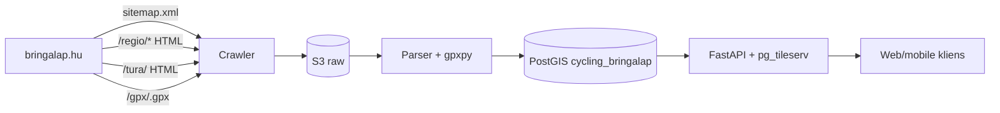
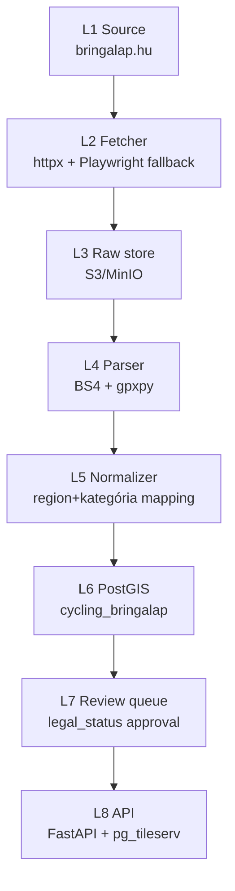

# Bringalap (bringalap.hu) — Teljes backend terv és adatkinyerési specifikáció

## 1. Forrás áttekintés

A **Bringalap** (`https://bringalap.hu`) Magyarország egyik legrégebbi, közösségi alapon szerkesztett **kerékpáros túraleíró portálja**. A portál gerincét több száz kurált **kerékpáros túraleírás** alkotja, amelyek tipikusan az alábbi szerkezetet követik:

- **Túracím + régió** (pl. "Tihanyi-félsziget", "Mátra északi pereme", "Tisza-part Tokaj–Tiszacsege")
- **Útvonal-hossz, várható menetidő, nehézség, burkolat**
- **Részletes szöveges leírás** (gyakran több ezer karakter, helyenként térképtani érdekességgel, helytörténeti betétekkel)
- **Letölthető GPX-fájl** — szinte minden tételhez tartozik egy `*.gpx`, amely a teljes túra nyomvonalát tartalmazza
- **Fotók, panorámaképek**
- **Régió-szerinti tematikus kategorizálás** (Dunántúl / Alföld / Észak-Magyarország / Budapest és környéke stb.)

Az adatkinyerés szempontjából **Bringalap a legértékesebb** a három tárgyalt forrás (Kerékpárosklub, Merretekerjek, Bringalap) közül, mert:

1. **Strukturáltság**: minden túra-oldal nagyjából azonos sablonra épül, ami robusztus HTML-scraping-et tesz lehetővé.
2. **GPX-elérhetőség**: a túrákhoz tartozó GPX-ek **közvetlen letöltési URL-en** elérhetők (`/gpx/<id>.gpx` vagy `?action=download&id=...` minta).
3. **Földrajzi lefedettség**: tipikusan **a teljes magyar bbox**-ot lefedi (`16.0, 45.7, 22.9, 48.6`), néhány határon átnyúló kirándulással (Felvidék, Burgenland).
4. **Aggregált link**: a Kerékpárosklub `/terkepek` oldala is továbbmutat a Bringalap-ra, vagyis a két forrás **kiegészíti** egymást.

Ez a specifikáció kifejezetten a **Bringalap-hoz illesztett** end-to-end backend-megoldást írja le: a katalógus felderítésétől az etikus scraperen, GPX-feldolgozón, PostGIS-tároláson, frissítési cronon és publikálási API-n keresztül egészen a runbookig.



## 2. Jogi és licenc helyzet (szerzői jog, ToS, attribution)

**Ez a fejezet nem helyettesíti a jogi tanácsadást.** A Bringalap **közösségi szerkesztésű**, de a portál üzemeltetője magánszemély/kis csapat, és a tartalom (szövegek, fotók, a **kurált GPX-állomány**) **szerzői jogi védelem alatt áll**, vagy a beküldő felhasználók által biztosított nem kizárólagos felhasználási joggal rendelkeznek. A weboldal nyilvánosan publikált, gépi felhasználást engedélyező CC-licenccel **nem rendelkezik** (élesben mindig ellenőrizendő az impresszum).

A gyakorlati következmények:

- **Túraleírások szövege**: nem reprodukálható egészben vagy lényegesen részlegesen — saját katalógusunkban csak **rövid kivonatot** (max 500 karakter, és csak idézés-jellegű módon) tárolhatunk.
- **Fotók**: **nem** töltjük le ömlesztve. Csak akkor, ha a forrás explicit CC-licencet jelöl meg.
- **GPX-ek**: a **geometriás adat (koordináták sora)** önmagában nem szerzői mű (tény-adat), viszont a **válogatás** mint adatbázis sui generis védelem alatt áll (96/9/EK, magyar Szjt. XI/A.).
  - **Megengedett**: egyedi túrák ténybeli adatainak (geometria, hossz, nehézség, burkolat) kinyerése.
  - **Tilos**: a teljes katalógus mint adatbázis újrapublikálása **engedély nélkül**.

**Robots.txt** várt tartalma (élesben mindig ellenőrizendő):

```
User-agent: *
Disallow: /admin/
Disallow: /upload/
Disallow: /search?
Crawl-delay: 3
Sitemap: https://bringalap.hu/sitemap.xml
```

**Ajánlott jogi folyamat:**

1. **Első napon** írásos megkeresés a Bringalap üzemeltetőjének (`info@bringalap.hu` vagy a kapcsolati oldal): adatmegosztási megállapodás (DSA), forrásmegjelölés, kölcsönös láthatóság, visszamutató link.
2. **Megkeresés előtt** a scraper teljesen letiltott (`BRINGALAP_SCRAPE_ENABLED=false`), de a felderítő (sitemap-listázó) működhet az URL-katalógus felépítéséhez.
3. **Engedély után** a scraper bekapcsol, de:
   - **legal_status** mező a sémában: `pending_review` → `approved` átállítás csak emberi review után.
   - **Csak `approved` rekordok** publikálódnak a végfelhasználói API-ban.

**Attribution string** minden végfelhasználói válaszhoz:

```json
{
  "attribution": "Forrás: Bringalap (bringalap.hu) — közösségi kerékpáros túraleíró portál, engedéllyel"
}
```

## 3. Adatkinyerési felület (scraping + download endpoints)

A Bringalap nagy valószínűséggel **klasszikus szerver-renderelt HTML** oldal (régebbi technológiájú PHP-CMS), tehát a scraping többnyire `httpx` + `BeautifulSoup`/`selectolax`-szal megoldható; Playwright csak szelektív, JS-rendered térképelemekhez szükséges (általában a túra-oldalon van egy beágyazott Leaflet-térkép, ami a GPX-et JS-en keresztül húzza le).

| URL minta | Tartalom | Formátum |
|-----------|----------|----------|
| `https://bringalap.hu/sitemap.xml` | URL-index | XML |
| `https://bringalap.hu/regio` | Régió-lista | HTML |
| `https://bringalap.hu/regio/<slug>` | Egy régió túra-listája (paginated) | HTML |
| `https://bringalap.hu/tura/<id>` | Egy konkrét túra oldala | HTML |
| `https://bringalap.hu/tura/<id>/gpx` v. `/gpx/<id>.gpx` | A túra GPX-je | GPX (application/gpx+xml) |
| `https://bringalap.hu/kategoria/<slug>` | Tematikus kategória (családbarát / MTB / gravel / road) | HTML |

A teljes URL-katalógus a `sitemap.xml`-ből nyerhető:

```bash
curl -sS -H 'User-Agent: PanellakoBikeBot/1.0 (+mailto:contact@panellako.hu)' \
  https://bringalap.hu/sitemap.xml | \
  grep -oP '<loc>\K[^<]+' | \
  grep -E '/tura/[0-9]+' > /tmp/bringalap_tura_urls.txt
wc -l /tmp/bringalap_tura_urls.txt   # várhatóan 400-800 db
```

Egy konkrét túra-oldal scraping-jénél a leírás-blokk, a meta-attribútumok és a GPX-link kinyerése a cél:

```python
# Vázlatos parser-elképzelés (a teljes kód lent, a 8. fejezetben)
soup.select_one("h1.tura-cim")             # cím
soup.select_one(".tura-leiras")            # leírás
soup.select(".tura-meta li")               # nehézség / hossz / burkolat
soup.select_one("a.gpx-letoltes")["href"]  # GPX-letöltési link
```

A GPX-letöltés URL-mintája kétféle lehet — adapterünk **mindkettőt** próbálja:

1. **Tiszta REST-szerű**: `/tura/<id>/gpx` → `application/gpx+xml`
2. **Query-paraméteres**: `/letoltes.php?tipus=gpx&id=<id>`

## 4. Hitelesítés, rate limit, kvóták (polite scraping rules)

A Bringalap **nem igényel autentikációt** a nyilvános tartalmak eléréséhez. Cserébe **különösen óvatos** etikus scraping-magatartást követelünk meg:

**4.1 Politika**

- **User-Agent**: minden kéréshez **kontakt e-maillel**:
  ```
  User-Agent: PanellakoBikeBot/1.0 (+mailto:contact@panellako.hu; +https://panellako.hu/bots)
  ```
- **Rate limit**:
  - Sebesség: **1 req/2 s** (mediánban) — még óvatosabban a kis forrásnál.
  - Burst: max 2 req/s.
  - `Crawl-delay: 3` betartva — a robots.txt-ben jelzett értéket vesszük át, ha nagyobb.
- **Concurrency**: **1** — szigorúan szekvenciális hozzáférés, mert kis szerverről van szó.
- **Backoff**: exponenciális 2 → 4 → 8 → 16 → 60 s, max 5 retry után dead letter.
- **Idő-ablakok**: a teljes szinkronizációt **hajnali 02:00–04:00 helyi idő** között futtatjuk, amikor a forgalom minimális.
- **If-Modified-Since**: minden kérésben elküldjük az utoljára látott `Last-Modified` értéket.
- **GPX-letöltés**: csak akkor, ha a túraadat **megváltozott** a HTML-szintű meta alapján (`sha256` a HTML-tartalmon).

**4.2 Robots.txt értelmezése**

```python
import urllib.robotparser
rp = urllib.robotparser.RobotFileParser()
rp.set_url("https://bringalap.hu/robots.txt")
rp.read()
assert rp.can_fetch("PanellakoBikeBot", "https://bringalap.hu/tura/123")
delay = rp.crawl_delay("PanellakoBikeBot") or rp.crawl_delay("*") or 3
```

**4.3 Pénzügyi kvóta**: 0 — nincs fizetős API.

**4.4 Anti-pattern, amit NEM csinálunk**

- Nem proxizunk, nem rotálunk IP-t.
- Nem hamisítunk böngésző-fingerprint-et.
- Nem hívjuk a `/admin/`, `/upload/`, `/search?` URL-eket.
- Nem futtatunk párhuzamos kéréseket.
- Nem mentünk fotókat tömegesen.

## 5. Adatmodell a forrásból

A Bringalap-ból négy entitás-típus nyerhető ki:

**5.1 `tour`** — egy konkrét túraleírás

| Mező | Típus | Leírás |
|------|-------|--------|
| `bringalap_id` | string | A URL-ből vagy a HTML-ből kinyert egyedi azonosító |
| `slug` | string | URL-friendly cím |
| `title` | string | Túra címe |
| `region` | string | Régió neve (pl. "Mátra", "Tihany") |
| `category` | enum | `family` / `mtb` / `gravel` / `road` / `touring` |
| `length_km` | numeric | Hossz km-ben |
| `duration_h` | numeric | Várható menetidő órában |
| `difficulty` | enum | `konnyu` / `kozepes` / `nehez` |
| `surface` | enum | `aszfalt` / `makadam` / `vegyes` / `terep` |
| `elevation_gain_m` | numeric | Szintemelkedés |
| `description_excerpt` | text | Rövid kivonat (max 500 karakter — szerzői jogi okokból nem a teljes leírás!) |
| `gpx_url` | string | A forrásnál tárolt GPX URL-je |
| `cover_image_url` | string | Borítókép URL (nem letöltjük, csak hivatkozzuk) |
| `external_url` | string | Az eredeti túra oldal URL-je (linkként mindig megőrizve) |
| `start_point` | geography(Point) | Kezdőpont (GPX-ből) |
| `end_point` | geography(Point) | Végpont (GPX-ből) |
| `geom` | geography(LineString) | A teljes nyomvonal (GPX-ből) |
| `geom_hash` | string | A geometria SHA-256 hash-e (dedup) |
| `legal_status` | enum | `pending_review` / `approved` / `restricted` |

**5.2 `region`** — régiók (kategorizálás)

| Mező | Típus | Leírás |
|------|-------|--------|
| `slug` | string | URL slug |
| `name` | string | Magyar név |
| `description` | text | Régió leírása (rövid kivonat) |
| `bbox` | geography(Polygon) | Megközelítő bbox |

**5.3 `tour_photo`** — fotó-hivatkozások (NEM töltjük le)

| Mező | Típus | Leírás |
|------|-------|--------|
| `tour_id` | uuid | FK → tour |
| `external_url` | string | A fotó URL-je a forrásnál |
| `caption` | string | Felirat |
| `position` | integer | Sorrend |

**5.4 `crawl_url`** — felderített, de még nem feldolgozott URL-ek

| Mező | Típus | Leírás |
|------|-------|--------|
| `url` | string | Az URL |
| `discovered_at` | timestamptz | Mikor lett megtalálva |
| `processed_at` | timestamptz | Mikor lett feldolgozva |
| `last_modified_hint` | timestamptz | A sitemap-ből kapott lastmod |
| `etag` | string | Az utolsó HTTP ETag |

## 6. Cél adatmodell (PostGIS DDL)

```sql
-- Migráció: 0006_cycling_bringalap_schema.sql
CREATE SCHEMA IF NOT EXISTS cycling_bringalap;
SET search_path TO cycling_bringalap, public;

CREATE EXTENSION IF NOT EXISTS postgis;
CREATE EXTENSION IF NOT EXISTS pgcrypto;
CREATE EXTENSION IF NOT EXISTS pg_trgm;       -- fulltext/fuzzy-hez

-- 6.1 Régiók
CREATE TABLE region (
    id          uuid PRIMARY KEY DEFAULT gen_random_uuid(),
    slug        text UNIQUE NOT NULL,
    name        text NOT NULL,
    description text,
    bbox        geography(Polygon, 4326)
);

-- 6.2 Túrák
CREATE TABLE tour (
    id                  uuid PRIMARY KEY DEFAULT gen_random_uuid(),
    bringalap_id        text UNIQUE NOT NULL,
    slug                text UNIQUE NOT NULL,
    title               text NOT NULL,
    region_slug         text REFERENCES region(slug),
    category            text CHECK (category IN ('family','mtb','gravel','road','touring','other')),
    length_km           numeric(8,2),
    duration_h          numeric(5,2),
    difficulty          text CHECK (difficulty IN ('konnyu','kozepes','nehez')),
    surface             text CHECK (surface IN ('aszfalt','makadam','vegyes','terep','ismeretlen')),
    elevation_gain_m    numeric(7,1),
    description_excerpt text,
    gpx_url             text,
    cover_image_url     text,
    external_url        text NOT NULL,
    start_point         geography(Point, 4326),
    end_point           geography(Point, 4326),
    geom                geography(LineString, 4326),
    geom_hash           text,
    html_hash           text,
    legal_status        text NOT NULL DEFAULT 'pending_review'
                        CHECK (legal_status IN ('pending_review','approved','restricted')),
    fetched_at          timestamptz NOT NULL DEFAULT now(),
    updated_at          timestamptz NOT NULL DEFAULT now()
);
CREATE INDEX idx_tour_geom        ON tour USING gist (geom);
CREATE INDEX idx_tour_start       ON tour USING gist (start_point);
CREATE INDEX idx_tour_category    ON tour (category);
CREATE INDEX idx_tour_region      ON tour (region_slug);
CREATE INDEX idx_tour_legal       ON tour (legal_status);
CREATE INDEX idx_tour_title_trgm  ON tour USING gin (title gin_trgm_ops);
CREATE UNIQUE INDEX idx_tour_geom_hash
    ON tour (geom_hash) WHERE geom_hash IS NOT NULL;

-- 6.3 Fotó-hivatkozások (csak URL, NEM a fájl)
CREATE TABLE tour_photo (
    id              bigserial PRIMARY KEY,
    tour_id         uuid NOT NULL REFERENCES tour(id) ON DELETE CASCADE,
    external_url    text NOT NULL,
    caption         text,
    position        integer DEFAULT 0,
    UNIQUE (tour_id, external_url)
);

-- 6.4 Crawl URL-katalógus
CREATE TABLE crawl_url (
    url                 text PRIMARY KEY,
    discovered_at       timestamptz NOT NULL DEFAULT now(),
    processed_at        timestamptz,
    last_modified_hint  timestamptz,
    etag                text,
    last_status_code    integer
);

-- 6.5 Crawl log
CREATE TABLE crawl_log (
    id              bigserial PRIMARY KEY,
    job_name        text NOT NULL,
    started_at      timestamptz NOT NULL DEFAULT now(),
    finished_at     timestamptz,
    status          text CHECK (status IN ('running','success','partial','failed')),
    tours_added     integer DEFAULT 0,
    tours_updated   integer DEFAULT 0,
    errors          jsonb DEFAULT '[]'::jsonb
);

CREATE TABLE dead_letter (
    id              bigserial PRIMARY KEY,
    url             text NOT NULL,
    attempts        integer DEFAULT 1,
    last_error      text,
    last_tried_at   timestamptz NOT NULL DEFAULT now()
);

-- 6.6 Magyar bbox-tartás
CREATE OR REPLACE FUNCTION assert_tour_in_hungary() RETURNS trigger LANGUAGE plpgsql AS $$
DECLARE
    bbox geometry := ST_MakeEnvelope(15.5, 45.5, 23.3, 48.8, 4326);  -- 30km puffer
BEGIN
    IF NEW.geom IS NOT NULL AND NOT ST_Intersects(NEW.geom::geometry, bbox) THEN
        RAISE EXCEPTION 'Geometria a magyar bbox + 30km puffer-en kívül esik (id=%)', NEW.bringalap_id;
    END IF;
    RETURN NEW;
END;
$$;
CREATE TRIGGER trg_tour_in_hu BEFORE INSERT OR UPDATE ON tour
    FOR EACH ROW EXECUTE FUNCTION assert_tour_in_hungary();

-- 6.7 Auto updated_at
CREATE OR REPLACE FUNCTION touch_updated_at() RETURNS trigger LANGUAGE plpgsql AS $$
BEGIN NEW.updated_at = now(); RETURN NEW; END;
$$;
CREATE TRIGGER trg_tour_touch BEFORE UPDATE ON tour
    FOR EACH ROW EXECUTE FUNCTION touch_updated_at();
```

## 7. Backend architektúra (L1-L8 rétegek)



**L1 — Source**: a `bringalap.hu` domain, kiegészítve a `robots.txt` által megengedett alrendszerekkel.

**L2 — Fetcher**: alapértelmezetten `httpx` (HTTP/2-vel), és **csak akkor** Playwright, ha egy adott URL `<noscript>` blokkja a teljes tartalmat is megadja-e, vagy ha a túraadat JS-en keresztül töltődik. Empirikus szabály: az első 10 oldal `View-Source`-elemzéséből döntsük el.

**L3 — Raw store**: minden lekérés (HTML, GPX) változatlanul S3-ba:

```
s3://panellako-raw/cycling/bringalap/<yyyy>/<mm>/<dd>/<sha256>.<ext>
```

A raw store **forrás-igazságot** ad: ha a Bringalap leállna, vagy egy túra eltűnne, a saját PostGIS-ünk továbbra is működik, és bármikor újraépíthető.

**L4 — Parser**: HTML → `BeautifulSoup4` + `selectolax`, GPX → `gpxpy`. A parser **purely funkcionális**, fixed-fixture-ökkel tesztelhető.

**L5 — Normalizer**: a magyar nyelvű meta-szövegeket (`Könnyű` / `közepes` / `nehéz` / `aszfalt` / `földút` …) kanonikus enum-ra képezi.

**L6 — PostGIS**: a fenti séma. Mindent `legal_status='pending_review'`-vel írunk be.

**L7 — Review queue**: egy belső UI mutatja az új tételeket, ahol egy operátor approve / restricte tudja őket; csak `approved` esetén kerülnek ki publikusan.

**L8 — API**: FastAPI REST + pg_tileserv MVT, részletek a 17. fejezetben.

## 8. Automatizált letöltő — Python (Playwright + BeautifulSoup) kód

A teljes letöltő (`apps/cycling_bringalap/fetcher.py`):

```python
"""
Bringalap (bringalap.hu) etikus scraperje.

- robots.txt-aware
- 1 req/2s (lassú, mert kis forrás)
- If-Modified-Since
- sitemap-alapú felderítés, csak ezután a részletes lekérés
- Playwright fallback, ha a HTML-en a tartalom hiányzik
"""
from __future__ import annotations

import asyncio
import hashlib
import os
import re
import urllib.robotparser
from dataclasses import dataclass
from datetime import datetime, timezone
from typing import Any, AsyncIterator

import boto3
import httpx
import structlog
from bs4 import BeautifulSoup
from playwright.async_api import async_playwright
from tenacity import (
    AsyncRetrying,
    retry_if_exception_type,
    stop_after_attempt,
    wait_exponential,
)

log = structlog.get_logger()

BASE = "https://bringalap.hu"
USER_AGENT = (
    "PanellakoBikeBot/1.0 "
    "(+mailto:contact@panellako.hu; +https://panellako.hu/bots)"
)
BBOX_HU = (16.0, 45.7, 22.9, 48.6)
MIN_DELAY_S = 2.0      # 1 req/2s alap, robots.txt-ből felülbírálva
SCRAPE_ENABLED = os.environ.get("BRINGALAP_SCRAPE_ENABLED", "false") == "true"

S3 = boto3.client(
    "s3",
    endpoint_url=os.environ["S3_ENDPOINT"],
    aws_access_key_id=os.environ["S3_KEY"],
    aws_secret_access_key=os.environ["S3_SECRET"],
)
S3_BUCKET = os.environ.get("S3_BUCKET", "panellako-raw")


@dataclass
class FetchedDoc:
    url: str
    content: bytes
    content_type: str
    fetched_at: datetime
    last_modified: str | None = None
    etag: str | None = None


def s3_key(doc: FetchedDoc) -> str:
    sha = hashlib.sha256(doc.content).hexdigest()
    ext = {
        "application/gpx+xml": ".gpx",
        "application/xml": ".xml",
        "text/html": ".html",
        "application/json": ".json",
    }.get(doc.content_type.split(";")[0].strip(), ".bin")
    return f"cycling/bringalap/{doc.fetched_at:%Y/%m/%d}/{sha}{ext}"


def store_raw(doc: FetchedDoc) -> str:
    key = s3_key(doc)
    S3.put_object(
        Bucket=S3_BUCKET,
        Key=key,
        Body=doc.content,
        ContentType=doc.content_type,
        Metadata={
            "source-url": doc.url[:1024],
            "last-modified": doc.last_modified or "",
            "etag": (doc.etag or "")[:200],
        },
    )
    return key


class PoliteClient:
    """Sebességkorlátozott, robots.txt-figyelő async HTTP-kliens."""

    def __init__(self, base: str, ua: str, min_delay: float) -> None:
        self.base = base
        self.ua = ua
        self.min_delay = min_delay
        self._client = httpx.AsyncClient(
            http2=True,
            headers={"User-Agent": ua, "Accept-Encoding": "gzip, br"},
            timeout=httpx.Timeout(30.0, connect=10.0),
            follow_redirects=True,
        )
        self._lock = asyncio.Lock()
        self._last = 0.0
        self._rp = urllib.robotparser.RobotFileParser()
        self._rp.set_url(f"{base}/robots.txt")
        self._rp.read()
        cd = self._rp.crawl_delay(ua) or self._rp.crawl_delay("*")
        if cd:
            self.min_delay = max(self.min_delay, float(cd))
        log.info("polite.init", delay=self.min_delay)

    async def get(self, url: str, headers: dict[str, str] | None = None) -> httpx.Response:
        if not self._rp.can_fetch(self.ua, url):
            raise PermissionError(f"robots.txt megtiltja: {url}")
        async with self._lock:
            now = asyncio.get_event_loop().time()
            delta = now - self._last
            if delta < self.min_delay:
                await asyncio.sleep(self.min_delay - delta)
            self._last = asyncio.get_event_loop().time()
        async for attempt in AsyncRetrying(
            stop=stop_after_attempt(5),
            wait=wait_exponential(multiplier=2, min=2, max=120),
            retry=retry_if_exception_type((httpx.HTTPError,)),
            reraise=True,
        ):
            with attempt:
                r = await self._client.get(url, headers=headers or {})
                if r.status_code in (429, 503):
                    wait_s = float(r.headers.get("Retry-After", "60"))
                    log.warning("rate_limited", url=url, wait=wait_s)
                    await asyncio.sleep(wait_s)
                    raise httpx.HTTPError("retry")
                if r.status_code == 304:
                    return r          # nincs változás
                r.raise_for_status()
                return r
        raise RuntimeError("unreachable")

    async def close(self) -> None:
        await self._client.aclose()


async def discover_sitemap(client: PoliteClient) -> list[tuple[str, str | None]]:
    """Visszaad (url, lastmod) tuple-okat a sitemap.xml-ből."""
    r = await client.get(f"{BASE}/sitemap.xml")
    store_raw(FetchedDoc(
        url=str(r.url), content=r.content,
        content_type=r.headers.get("content-type", "application/xml"),
        fetched_at=datetime.now(timezone.utc),
        last_modified=r.headers.get("last-modified"),
        etag=r.headers.get("etag"),
    ))
    soup = BeautifulSoup(r.text, "xml")
    out: list[tuple[str, str | None]] = []
    for u in soup.select("url"):
        loc = u.find("loc")
        lm = u.find("lastmod")
        if loc and "/tura/" in loc.text:
            out.append((loc.text.strip(), lm.text.strip() if lm else None))
    log.info("sitemap.discovered", count=len(out))
    return out


GPX_LINK_PATTERNS = [
    re.compile(r"/tura/(?P<id>\d+)/gpx"),
    re.compile(r"/gpx/(?P<id>\d+)\.gpx"),
    re.compile(r"letoltes\.php\?[^\"']*tipus=gpx[^\"']*id=(?P<id>\d+)"),
]


def find_gpx_url(html: str) -> str | None:
    soup = BeautifulSoup(html, "lxml")
    for a in soup.select("a[href]"):
        href = a["href"]
        for pat in GPX_LINK_PATTERNS:
            if pat.search(href):
                return href if href.startswith("http") else f"{BASE}{href}"
    return None


async def fetch_tour(client: PoliteClient, url: str, conditional_etag: str | None = None) -> dict | None:
    headers = {}
    if conditional_etag:
        headers["If-None-Match"] = conditional_etag
    try:
        r = await client.get(url, headers=headers)
    except PermissionError:
        log.warning("tour.robots_blocked", url=url)
        return None
    if r.status_code == 304:
        return {"unchanged": True, "url": url}
    doc = FetchedDoc(
        url=str(r.url), content=r.content,
        content_type=r.headers.get("content-type", "text/html"),
        fetched_at=datetime.now(timezone.utc),
        last_modified=r.headers.get("last-modified"),
        etag=r.headers.get("etag"),
    )
    html_key = store_raw(doc)
    # GPX link kibányászása
    gpx_url = find_gpx_url(r.text)
    gpx_key = None
    if gpx_url:
        try:
            g = await client.get(gpx_url)
            gdoc = FetchedDoc(
                url=str(g.url), content=g.content,
                content_type="application/gpx+xml",
                fetched_at=datetime.now(timezone.utc),
            )
            gpx_key = store_raw(gdoc)
        except (httpx.HTTPError, PermissionError) as e:
            log.warning("gpx.failed", url=gpx_url, err=str(e))
    return {
        "url": url,
        "html_s3_key": html_key,
        "gpx_s3_key": gpx_key,
        "etag": doc.etag,
        "last_modified": doc.last_modified,
    }


async def main() -> None:
    if not SCRAPE_ENABLED:
        log.warning("bringalap.disabled — engedélyre vár (BRINGALAP_SCRAPE_ENABLED=false)")
        return
    client = PoliteClient(BASE, USER_AGENT, MIN_DELAY_S)
    try:
        urls = await discover_sitemap(client)
        log.info("crawl.starting", total=len(urls))
        for i, (url, _lastmod) in enumerate(urls, 1):
            try:
                result = await fetch_tour(client, url)
                if result:
                    log.info("tour.ok", i=i, url=url,
                             gpx=bool(result.get("gpx_s3_key")))
            except Exception as e:  # noqa: BLE001
                log.error("tour.failed", url=url, err=str(e))
    finally:
        await client.close()


if __name__ == "__main__":
    asyncio.run(main())
```

## 9. Feldolgozó pipeline (HTML scraping, GPX parser gpxpy)

A feldolgozó (`processor.py`) az S3 raw rétegből olvas, és az `tour` táblába ír.

**9.1 GPX parser**

```python
import gpxpy
from shapely.geometry import LineString, Point
from shapely.wkt import dumps as wkt_dumps
import hashlib

def parse_gpx(raw: bytes) -> dict:
    text = raw.decode("utf-8", errors="ignore")
    g = gpxpy.parse(text)
    coords: list[tuple[float, float]] = []
    elev: list[float] = []
    for trk in g.tracks:
        for seg in trk.segments:
            for p in seg.points:
                coords.append((p.longitude, p.latitude))
                if p.elevation is not None:
                    elev.append(p.elevation)
    # Néhány Bringalap GPX nem `<trk>`, hanem `<rte>` blokkokat használ — fallback:
    if not coords:
        for rte in g.routes:
            for p in rte.points:
                coords.append((p.longitude, p.latitude))
                if p.elevation is not None:
                    elev.append(p.elevation)
    if len(coords) < 2:
        raise ValueError("Túl kevés pont a GPX-ben")
    line = LineString(coords)
    gain = sum(max(0, b - a) for a, b in zip(elev, elev[1:])) if elev else None
    return {
        "geom_wkt": wkt_dumps(line),
        "start_point_wkt": wkt_dumps(Point(coords[0])),
        "end_point_wkt": wkt_dumps(Point(coords[-1])),
        "approx_length_km": round(line.length * 111.32, 2),
        "elevation_gain_m": round(gain, 1) if gain is not None else None,
    }

def geom_hash(coords: list[tuple[float, float]]) -> str:
    rounded = [(round(x, 5), round(y, 5)) for x, y in coords]
    payload = ";".join(f"{x},{y}" for x, y in rounded).encode()
    return hashlib.sha256(payload).hexdigest()
```

**Megj.**: a `line.length * 111.32` durva becslés, a pontos hosszt PostGIS oldalon számoljuk:

```sql
UPDATE cycling_bringalap.tour
SET length_km = ST_Length(geom::geography) / 1000.0
WHERE bringalap_id = $1;
```

**9.2 HTML parser**

```python
from bs4 import BeautifulSoup
import re

DIFFICULTY_MAP = {
    "könnyű": "konnyu", "konnyu": "konnyu",
    "közepes": "kozepes", "kozepes": "kozepes",
    "nehéz": "nehez", "nehez": "nehez",
}
SURFACE_MAP = {
    "aszfalt": "aszfalt", "aszfalt+földes": "vegyes",
    "földes": "terep", "földút": "terep",
    "makadám": "makadam", "makadam": "makadam",
    "kavics": "makadam", "murva": "makadam",
    "vegyes": "vegyes", "terep": "terep",
}
CATEGORY_MAP = {
    "családi": "family", "családbarát": "family", "csaladbarat": "family",
    "mtb": "mtb", "hegyikerékpár": "mtb",
    "gravel": "gravel",
    "országút": "road", "road": "road",
    "túra": "touring", "tura": "touring",
}

def parse_tour_html(html: str, source_url: str) -> dict:
    soup = BeautifulSoup(html, "lxml")

    title = (soup.select_one("h1.tura-cim")
             or soup.select_one("h1")
             or soup.select_one("title"))
    title_text = title.get_text(strip=True) if title else "Ismeretlen túra"

    # Bringalap ID a URL-ből
    m = re.search(r"/tura/(\d+)", source_url)
    bringalap_id = m.group(1) if m else None

    # Régió
    region_el = soup.select_one(".tura-regio, .breadcrumbs a[href*='/regio/']")
    region = region_el.get_text(strip=True) if region_el else None

    # Meta-attribútumok
    meta = {}
    for li in soup.select(".tura-meta li, .meta-list li, dl.meta > div"):
        label_el = li.select_one(".label, dt, b, strong")
        value_el = li.select_one(".value, dd, span:not(.label)")
        if not (label_el and value_el):
            continue
        k = label_el.get_text(strip=True).lower().rstrip(":")
        v = value_el.get_text(strip=True)
        meta[k] = v

    length_km = _parse_km(meta.get("hossz") or meta.get("távolság"))
    duration_h = _parse_hours(meta.get("menetidő") or meta.get("időtartam"))
    difficulty = DIFFICULTY_MAP.get((meta.get("nehézség") or "").lower())
    surface = SURFACE_MAP.get((meta.get("burkolat") or "").lower(), None)
    category = CATEGORY_MAP.get((meta.get("kategória") or "").lower(), "touring")

    # Leírás — CSAK rövid kivonatot mentünk a copyright miatt
    desc_el = soup.select_one(".tura-leiras, article .content")
    desc_text = desc_el.get_text("\n", strip=True) if desc_el else ""
    description_excerpt = (desc_text[:497] + "...") if len(desc_text) > 500 else desc_text

    # Borítókép URL (csak a hivatkozás)
    cover = soup.select_one(".tura-borito img, header img, .gallery img")
    cover_url = cover.get("src") if cover else None
    if cover_url and not cover_url.startswith("http"):
        cover_url = f"https://bringalap.hu{cover_url}"

    # GPX URL
    gpx_url = None
    for a in soup.select("a[href]"):
        href = a["href"]
        if any(pat.search(href) for pat in GPX_LINK_PATTERNS):
            gpx_url = href if href.startswith("http") else f"https://bringalap.hu{href}"
            break

    return {
        "bringalap_id": bringalap_id,
        "slug": source_url.rstrip("/").split("/")[-1],
        "title": title_text,
        "region": region,
        "category": category,
        "length_km": length_km,
        "duration_h": duration_h,
        "difficulty": difficulty,
        "surface": surface,
        "description_excerpt": description_excerpt,
        "gpx_url": gpx_url,
        "cover_image_url": cover_url,
        "external_url": source_url,
    }


def _parse_km(s: str | None) -> float | None:
    if not s:
        return None
    m = re.search(r"(\d+(?:[.,]\d+)?)", s)
    return float(m.group(1).replace(",", ".")) if m else None


def _parse_hours(s: str | None) -> float | None:
    if not s:
        return None
    # "3 óra 15 perc", "3.5 óra", "3-4 óra"
    h_match = re.search(r"(\d+(?:[.,]\d+)?)\s*ór", s)
    p_match = re.search(r"(\d+)\s*perc", s)
    h = float(h_match.group(1).replace(",", ".")) if h_match else 0.0
    p = float(p_match.group(1)) / 60.0 if p_match else 0.0
    total = h + p
    return total if total > 0 else None
```

**9.3 Geometria-alapú deduplikáció — Fréchet-távolság**

A Bringalap esetén előfordul, hogy ugyanannak a túrának több bejegyzése van (pl. téli és nyári változat). Két fázisban szűrünk:

1. **Gyors**: `geom_hash` egyezés → biztosan duplikátum.
2. **Lassú**: bbox-átfedés + hossz ±10% → Fréchet < 50 m → duplikátum.

```python
from shapely.ops import transform
import pyproj

PROJ_LAEA = pyproj.Transformer.from_crs(
    "EPSG:4326", "EPSG:3035", always_xy=True
).transform

def is_duplicate(new: LineString, candidate: LineString) -> bool:
    a = transform(PROJ_LAEA, new)
    b = transform(PROJ_LAEA, candidate)
    if abs(a.length - b.length) / max(a.length, b.length) > 0.10:
        return False
    return a.frechet_distance(b) < 50.0     # méter
```

**9.4 Upsert PostGIS-be**

```sql
INSERT INTO cycling_bringalap.tour
    (bringalap_id, slug, title, region_slug, category, length_km, duration_h,
     difficulty, surface, elevation_gain_m, description_excerpt,
     gpx_url, cover_image_url, external_url,
     start_point, end_point, geom, geom_hash, html_hash)
VALUES (%s, %s, %s, %s, %s, %s, %s,
        %s, %s, %s, %s,
        %s, %s, %s,
        ST_GeogFromText(%s), ST_GeogFromText(%s), ST_GeogFromText(%s), %s, %s)
ON CONFLICT (bringalap_id) DO UPDATE SET
    title = EXCLUDED.title,
    category = EXCLUDED.category,
    length_km = EXCLUDED.length_km,
    duration_h = EXCLUDED.duration_h,
    difficulty = EXCLUDED.difficulty,
    surface = EXCLUDED.surface,
    elevation_gain_m = EXCLUDED.elevation_gain_m,
    description_excerpt = EXCLUDED.description_excerpt,
    gpx_url = EXCLUDED.gpx_url,
    cover_image_url = EXCLUDED.cover_image_url,
    start_point = EXCLUDED.start_point,
    end_point = EXCLUDED.end_point,
    geom = EXCLUDED.geom,
    geom_hash = EXCLUDED.geom_hash,
    html_hash = EXCLUDED.html_hash,
    updated_at = now();
```

## 10. Frissítési stratégia (heti cron, deduplication)

A Bringalap **lassú változású** forrás — új túra kb. hetente 1–3 jelenik meg, módosítások havi szinten.

**Cron-terv:**

| Job | Gyakoriság | UTC | Feladat |
|-----|------------|-----|---------|
| `bringalap-sitemap-diff` | naponta | 02:00 | Sitemap-letöltés, új URL-ek a `crawl_url`-be |
| `bringalap-incremental` | naponta | 02:30 | Csak az új URL-ek scrape-elése (`processed_at IS NULL`) |
| `bringalap-full-refresh` | hetente vasárnap | 03:00 | Minden URL újrahúzása, If-None-Match-csel |
| `bringalap-dedup` | hetente vasárnap | 05:00 | Fréchet-alapú deduplikáció új tételeken |
| `bringalap-review-reminder` | naponta | 09:00 | E-mail az operátornak a `pending_review` tételekről |

**Inkrementalizmus**: ETag és Last-Modified alapján, If-None-Match-csel — ha 304, semmit nem írunk újra.

**Sitemap-diff**:

```python
async def sitemap_diff(client: PoliteClient, conn) -> dict[str, int]:
    urls = await discover_sitemap(client)
    new_added = 0
    for url, lastmod in urls:
        cur = conn.cursor()
        cur.execute("""
            INSERT INTO cycling_bringalap.crawl_url (url, last_modified_hint)
            VALUES (%s, %s)
            ON CONFLICT (url) DO UPDATE
            SET last_modified_hint = EXCLUDED.last_modified_hint
            RETURNING (xmax = 0) AS inserted;
        """, (url, lastmod))
        if cur.fetchone()[0]:
            new_added += 1
    return {"new_urls": new_added, "total_urls": len(urls)}
```

**Deduplikáció kerékpáros túrákra**:

```sql
-- Adott bbox-ban duplikátum-jelöltek listája
SELECT a.id, b.id, ST_Distance(a.geom, b.geom)
FROM cycling_bringalap.tour a
JOIN cycling_bringalap.tour b
  ON a.id < b.id
 AND a.geom && ST_Buffer(b.geom::geometry, 0.005)::geography
 AND abs(a.length_km - b.length_km) / GREATEST(a.length_km, b.length_km) < 0.1;
```

A jelöltekre Python-oldalon Fréchet-et futtatunk, és a `duplicate_of_id` (külön kis tábla) bejegyzést hozzuk létre.

## 11. Storage és skálázás

**Becsült méretek (3 év horizonttal):**

| Réteg | Tételszám | Méret/tétel | Összes |
|-------|-----------|-------------|--------|
| Raw HTML | ~800 oldal × 3 év × 52 hét × 2 (frissítések) | 100 KB | ~25 GB |
| Raw GPX | ~800 × 5 év × 2 update | 80 KB | ~640 MB |
| PostGIS `tour` | ~1000 sor | 50 KB (geom-mal) | ~50 MB |
| PostGIS `tour_photo` | ~5000 | 1 KB | ~5 MB |
| Vector tile cache (z6–z14) | — | — | ~200 MB |

**Optimalizálás:**

- Raw HTML: csak akkor mentünk újra, ha a `html_hash` változott — így a 25 GB-os becslés **valószínűleg túlbecsült**, gyakorlatban 5–8 GB.
- Lifecycle policy: 30 nap után IA, 18 hónap után Glacier.
- A `tour` tábla particionálása **felesleges** (1000 sor mindössze).

Egyetlen 4 vCPU / 16 GB Postgres instance bőven elég, a vector tile cache külön nem szükséges (egy közös pg_tileserv kiszolgálja az összes cycling sémát).

## 12. Monitoring és riasztások

**Metrikák:**

```
bringalap_fetch_total{endpoint, status}              Counter
bringalap_fetch_duration_seconds{endpoint}           Histogram
bringalap_tours_total{legal_status}                  Gauge
bringalap_pending_review_total                       Gauge
bringalap_gpx_parse_failures_total                   Counter
bringalap_dead_letter_total                          Gauge
bringalap_last_success_timestamp{job}                Gauge
```

**Alertmanager-szabályok:**

```yaml
- alert: Bringalap_FetcherStale
  expr: time() - bringalap_last_success_timestamp{job="bringalap-incremental"} > 86400 + 3600
  for: 30m
  labels: { severity: warning }

- alert: Bringalap_PendingReviewBacklog
  expr: bringalap_pending_review_total > 50
  for: 1d
  labels: { severity: warning }
  annotations:
    summary: "50+ pending review tétel várja az operátori jóváhagyást"

- alert: Bringalap_GPXParseFailures
  expr: increase(bringalap_gpx_parse_failures_total[1h]) > 5
  for: 30m
  labels: { severity: warning }

- alert: Bringalap_RobotsBlocked
  expr: increase(bringalap_fetch_total{status="robots_blocked"}[1h]) > 0
  for: 5m
  labels: { severity: critical }
  annotations:
    summary: "Bringalap robots.txt megtiltotta a hozzáférést — emberi review szükséges"
```

A **structlog** logokat Loki-ba pumpáljuk; egy közös Grafana dashboard mutatja a Kerékpárosklub + Merretekerjek + Bringalap fetcherek állapotát.

## 13. Költségbecslés (HUF/EUR)

| Tétel | Havi (HUF) | Havi (EUR) |
|-------|------------|------------|
| Postgres VM (megosztott, allokált rész) | 10 000 | 25 |
| S3 storage (~5 GB allokált) | 25 | 0.06 |
| Egress (0.5 GB/hó) | 8 | 0.02 |
| Scraper-runner (megosztott, 0.5 CPU) | 4 000 | 10 |
| Monitoring (megosztott) | 2 000 | 5 |
| **Összesen (Bringalap-specifikus rész)** | **~16 000 HUF** | **~40 EUR** |

A Bringalap-letöltés közvetlen pénzügyi költsége **0 HUF**.

## 14. Biztonság (proxy rotation, fingerprint, robots.txt compliance)

**Alapelv**: a Bringalap **kis méretű, magyar nonprofit** projekt. Hozzáállásunk:

- **Mindig azonosítható UA** — kontakt e-maillel.
- **robots.txt-t betartjuk** kód szinten (`urllib.robotparser`), futás-időben.
- **Sebesség**: 1 req/2s, soha nem párhuzamosan.
- **IP-rotáció: NEM**. Proxy: NEM.
- **Fingerprint-hamisítás: NEM**.
- Az S3 raw store **SSE-S3** vagy SSE-KMS titkosítással.
- Postgres role-ok:
  - `bringalap_writer` — INSERT/UPDATE a fetchernek.
  - `bringalap_reviewer` — UPDATE `legal_status`-ra az operátoroknak (`pending_review` → `approved`/`restricted`).
  - `bringalap_reader` — SELECT az API-nak, és **csak `legal_status='approved'`** sorokra.
- Row-level security:

```sql
ALTER TABLE cycling_bringalap.tour ENABLE ROW LEVEL SECURITY;
CREATE POLICY tour_public_read ON cycling_bringalap.tour
    FOR SELECT TO bringalap_reader
    USING (legal_status = 'approved');

CREATE POLICY tour_reviewer ON cycling_bringalap.tour
    FOR UPDATE TO bringalap_reviewer
    USING (true)
    WITH CHECK (legal_status IN ('pending_review','approved','restricted'));
```

- **Titkok**: HashiCorp Vault, env-fájl csak konténer-belül; PG-jelszó nem kerül logba (structlog `redact` processor).

## 15. Tesztelés — pytest + VCR

A tesztpiramis:

- **Unit (gyors)**: GPX parser, HTML parser, `_parse_km`, `_parse_hours`, `DIFFICULTY_MAP`, `geom_hash`, Fréchet-dedup.
- **Integration (közepes)**: pytest-vcr-rel rögzített Bringalap-válaszok (3-4 reprezentatív túra-oldal + 1 sitemap + 2 GPX).
- **End-to-end (lassú)**: éjszakai full-refresh egy staging-PostGIS ellen.

**Fixture-szerkezet:**

```
tests/cycling_bringalap/
├── conftest.py
├── fixtures/
│   ├── sitemap_sample.xml
│   ├── tura_124.html
│   ├── tura_124.gpx
│   ├── tura_125_no_gpx.html
│   └── tura_999_404.html
└── test_*.py
```

**Példa tesztek:**

```python
# tests/cycling_bringalap/test_gpx.py
import pathlib
from apps.cycling_bringalap.processor import parse_gpx, geom_hash

FIX = pathlib.Path(__file__).parent / "fixtures"

def test_parse_gpx_normal():
    raw = (FIX / "tura_124.gpx").read_bytes()
    out = parse_gpx(raw)
    assert out["approx_length_km"] > 5.0
    assert out["geom_wkt"].startswith("LINESTRING")
    assert out["start_point_wkt"].startswith("POINT")

def test_geom_hash_idempotent():
    pts = [(19.04, 47.50), (19.05, 47.51)]
    assert geom_hash(pts) == geom_hash(pts)
    assert geom_hash(pts) != geom_hash([(19.04, 47.51), (19.05, 47.50)])
```

```python
# tests/cycling_bringalap/test_html.py
import pathlib
from apps.cycling_bringalap.processor import parse_tour_html

FIX = pathlib.Path(__file__).parent / "fixtures"

def test_parse_basic_tour():
    html = (FIX / "tura_124.html").read_text(encoding="utf-8")
    out = parse_tour_html(html, "https://bringalap.hu/tura/124")
    assert out["bringalap_id"] == "124"
    assert out["title"]
    assert out["difficulty"] in {"konnyu","kozepes","nehez", None}
    assert out["category"] in {"family","mtb","gravel","road","touring","other"}
    # Description excerpt rövid (copyright!)
    assert len(out["description_excerpt"]) <= 500
```

```python
# tests/cycling_bringalap/test_fetcher.py
import pytest
from apps.cycling_bringalap.fetcher import find_gpx_url

def test_find_gpx_pattern_rest_style():
    html = '<a class="gpx-letoltes" href="/tura/123/gpx">Letöltés</a>'
    assert find_gpx_url(html) == "https://bringalap.hu/tura/123/gpx"

def test_find_gpx_pattern_php():
    html = '<a href="/letoltes.php?tipus=gpx&id=42">GPX</a>'
    assert find_gpx_url(html).endswith("letoltes.php?tipus=gpx&id=42")

def test_find_gpx_none():
    assert find_gpx_url("<p>nincs gpx</p>") is None
```

```python
# tests/cycling_bringalap/test_polite_client.py
import asyncio
import pytest
from apps.cycling_bringalap.fetcher import PoliteClient, USER_AGENT, BASE

@pytest.mark.vcr(record_mode="none")
def test_polite_client_respects_robots(event_loop):
    async def run():
        c = PoliteClient(BASE, USER_AGENT, 0.0)
        with pytest.raises(PermissionError):
            await c.get(f"{BASE}/admin/")
        await c.close()
    event_loop.run_until_complete(run())
```

`pyproject.toml`:

```toml
[tool.pytest.ini_options]
testpaths = ["tests"]
addopts = "-ra --strict-markers --cov=apps.cycling_bringalap --cov-report=term-missing"
markers = [
    "network: live network — staging only",
    "vcr: replay recorded responses",
]
```

## 16. Telepítés (Docker, k8s CronJob, GitHub Actions)

**Dockerfile** (`deploy/Dockerfile.cycling-bringalap`):

```dockerfile
FROM mcr.microsoft.com/playwright/python:v1.45.0-jammy
WORKDIR /app
COPY pyproject.toml uv.lock ./
RUN pip install --no-cache-dir uv && uv sync --frozen
COPY apps/ apps/
ENV PYTHONUNBUFFERED=1 PYTHONPATH=/app
CMD ["uv", "run", "python", "-m", "apps.cycling_bringalap.fetcher"]
```

**Kubernetes CronJob** (`k8s/cycling-bringalap-incremental.yaml`):

```yaml
apiVersion: batch/v1
kind: CronJob
metadata:
  name: bringalap-incremental
  namespace: cycling
spec:
  schedule: "30 2 * * *"          # naponta 02:30 UTC
  concurrencyPolicy: Forbid
  successfulJobsHistoryLimit: 3
  failedJobsHistoryLimit: 5
  jobTemplate:
    spec:
      backoffLimit: 1
      template:
        spec:
          restartPolicy: OnFailure
          containers:
            - name: fetcher
              image: registry.panellako.hu/cycling-bringalap:latest
              env:
                - name: BRINGALAP_SCRAPE_ENABLED
                  value: "false"      # engedélyhez kötött, csak emberi review után true
                - name: S3_ENDPOINT
                  value: https://s3.panellako.hu
                - name: PG_DSN
                  valueFrom: { secretKeyRef: { name: pg-creds, key: dsn } }
              resources:
                requests: { cpu: 100m, memory: 256Mi }
                limits:   { cpu: 500m, memory: 1Gi }
```

**GitHub Actions** (`.github/workflows/cycling-bringalap.yml`):

```yaml
name: cycling-bringalap
on:
  push:
    paths: ["apps/cycling_bringalap/**","tests/cycling_bringalap/**"]
  pull_request:
    paths: ["apps/cycling_bringalap/**","tests/cycling_bringalap/**"]

jobs:
  test:
    runs-on: ubuntu-latest
    services:
      postgres:
        image: postgis/postgis:16-3.4
        env:
          POSTGRES_PASSWORD: pw
          POSTGRES_DB: test
        ports: ["5432:5432"]
        options: >-
          --health-cmd "pg_isready -U postgres"
          --health-interval 5s
    steps:
      - uses: actions/checkout@v4
      - uses: astral-sh/setup-uv@v3
      - run: uv sync --frozen
      - run: uv run playwright install --with-deps chromium
      - run: uv run pytest tests/cycling_bringalap -m "not network"
  docker:
    needs: test
    runs-on: ubuntu-latest
    if: github.ref == 'refs/heads/main'
    steps:
      - uses: actions/checkout@v4
      - uses: docker/build-push-action@v5
        with:
          context: .
          file: deploy/Dockerfile.cycling-bringalap
          push: true
          tags: registry.panellako.hu/cycling-bringalap:${{ github.sha }}
```

## 17. Adatpublikálás (REST API, vector tiles)

**REST API** (`/api/v1/cycling/bringalap/...`):

```python
from fastapi import APIRouter, Query, HTTPException
from pydantic import BaseModel

router = APIRouter(prefix="/api/v1/cycling/bringalap")

class TourOut(BaseModel):
    id: str
    title: str
    region: str | None
    category: str | None
    length_km: float | None
    duration_h: float | None
    difficulty: str | None
    surface: str | None
    elevation_gain_m: float | None
    excerpt: str | None
    cover_image_url: str | None
    external_url: str
    geojson: dict
    attribution: str = (
        "Forrás: Bringalap (bringalap.hu) — közösségi kerékpáros túraleíró portál"
    )

@router.get("/tours", response_model=list[TourOut])
async def list_tours(
    bbox: str | None = Query(None, examples=["19,47,20,48"]),
    region: str | None = None,
    category: str | None = None,
    difficulty: str | None = None,
    min_length_km: float | None = None,
    max_length_km: float | None = None,
    limit: int = Query(100, le=500),
):
    # Csak legal_status='approved' kerül vissza
    ...

@router.get("/tours/{tour_id}", response_model=TourOut)
async def get_tour(tour_id: str):
    ...

@router.get("/tours/{tour_id}/gpx")
async def get_tour_gpx(tour_id: str):
    """
    NEM ad vissza eredeti Bringalap-GPX-et (copyright).
    Csak a saját, normalizált geometriából generált GPX-et,
    a Bringalap mint forrás megjelölésével.
    """
    raise HTTPException(501, "Csak a forrás-oldalon érhető el; lásd external_url")
```

**Vector tile** (`pg_tileserv`):

```toml
[[Layers]]
Schema = "cycling_bringalap"
Table  = "tour"
IDColumn = "id"
GeometryColumn = "geom"
Attributes = ["title","category","length_km","difficulty"]
SRID = 4326
```

**Klensoldali MapLibre-stílus:**

```js
map.addSource("bringalap", {
  type: "vector",
  tiles: ["https://tiles.panellako.hu/cycling_bringalap.tour/{z}/{x}/{y}.pbf"],
  attribution: "Forrás: Bringalap (bringalap.hu)"
});
map.addLayer({
  id: "bringalap-tours",
  type: "line",
  source: "bringalap",
  "source-layer": "tour",
  paint: {
    "line-color": [
      "match", ["get","category"],
      "family", "#3aa6ff",
      "mtb",    "#a04300",
      "gravel", "#7a6a3a",
      "road",   "#1f9c54",
      "#666"
    ],
    "line-width": 2.5
  }
});
```

## 18. Runbook

**Tünet: a fetcher 0 új tételt hozott.**

1. `kubectl logs cronjob/bringalap-incremental` — utolsó pod log.
2. Ellenőrizd a `crawl_url` táblát: `SELECT count(*) FROM cycling_bringalap.crawl_url WHERE processed_at IS NULL;` — ha 0, valószínűleg nincs új tartalom.
3. Hasonlítsd össze a `discovered_at`-et a sitemap `lastmod` legutóbbi értékével.

**Tünet: a fetcher hibázik, sok `parse_failed`.**

1. Nézd meg a Bringalap egy aktuális túra-oldal forráskódját — változott-e a HTML-szerkezet.
2. Futtasd a `tests/cycling_bringalap/test_html.py`-t friss fixture-rel.
3. Ha igen, frissítsd a CSS-szelektorokat a `parse_tour_html`-ben; bővítsd a `try/except` blokkokat.

**Tünet: a Bringalap robots.txt 403 vagy `Disallow: /`.**

1. **Azonnal állítsd le** a fetchert: `kubectl scale cronjob bringalap-incremental --suspend`.
2. Ellenőrizd a robots.txt-t kézzel: `curl https://bringalap.hu/robots.txt`.
3. Vedd fel a kapcsolatot az üzemeltetővel.
4. A meglévő `tour` rekordokat **NE töröld** — a `legal_status` mezőt `restricted`-re állítsd, hogy az API ne adja ki őket.

**Tünet: GPX parse failure tömegesen.**

1. Nézd meg, hogy a GPX-ek formátuma változott-e (pl. `<rte>` helyett `<trk>`).
2. A `parse_gpx`-ben már van fallback — bővítsd, ha új formátumot lát.

**Tünet: pending_review backlog 50+.**

1. Értesítsd az operátort.
2. Ha 7+ napos a backlog, fontold meg az ideiglenes **auto-approve** policy-t a `legal_status='approved'` automatikus beállítására, **csak akkor**, ha:
   - érvényes adatmegosztási megállapodás van,
   - és a beírt mezők ellenőrzése sikeres (geom_hash létezik, length_km > 0, title nem üres).

**Tünet: jogi takedown.**

1. **Azonnal**: `UPDATE cycling_bringalap.tour SET legal_status='restricted' WHERE bringalap_id IN (...);`
2. `kubectl scale cronjob bringalap-incremental --suspend`.
3. Vedd fel a kapcsolatot a forrással.

## 19. Roadmap

- **v1.0** (alap): a teljes pipeline élesben, **kikapcsolt** scraperrel (`BRINGALAP_SCRAPE_ENABLED=false`). Csak a discover/sitemap rész aktív; a `crawl_url` katalógus felépül.
- **v1.1**: A Bringalap üzemeltetőjével adatmegosztási megállapodás aláírása után a scraper bekapcsolása, a `legal_status` workflow indítása.
- **v1.2**: Operátori UI a `pending_review` tételek átnézésére (egyszerű FastAPI + HTMX, vagy egy belső admin-panel a meglévő appban).
- **v1.3**: Bringalap ↔ OSM ↔ Merretekerjek cross-source dedup, közös `crosswalk` tábla.
- **v1.4**: Magyarországi PostGIS-routing (BRouter / GraphHopper) — a felhasználó interaktívan kombinálhassa a Bringalap-szegmenseket saját túratervébe.
- **v2.0**: Visszacsatolás a Bringalap felé: a saját UI-n bejelentett "ez az útvonal eltűnt / megváltozott" jelzések strukturált kapcsolatba kerülnek a Bringalap üzemeltetőjével (ha vállalják).

## 20. Referenciák

- Bringalap: <https://bringalap.hu>
- gpxpy: <https://github.com/tkrajina/gpxpy>
- BeautifulSoup4: <https://www.crummy.com/software/BeautifulSoup/bs4/doc/>
- selectolax: <https://github.com/rushter/selectolax>
- Playwright Python: <https://playwright.dev/python/>
- PostGIS: <https://postgis.net/documentation/>
- pg_tileserv: <https://github.com/CrunchyData/pg_tileserv>
- Shapely Fréchet-távolság: <https://shapely.readthedocs.io/>
- Pyproj projection (EPSG:3035 LAEA): <https://pyproj4.github.io/pyproj/>
- HashiCorp Vault: <https://www.vaultproject.io/>
- Magyar Szjt. szabad felhasználás és adatbázis-védelem: 1999. évi LXXVI. tv.
- EU sui generis adatbázis-jog: 96/9/EK irányelv
- Etikus scraping irányelvek (RFC-jellegű összefoglaló): <https://www.robotstxt.org/>
- MapLibre GL JS stílus-spec: <https://maplibre.org/maplibre-style-spec/>
