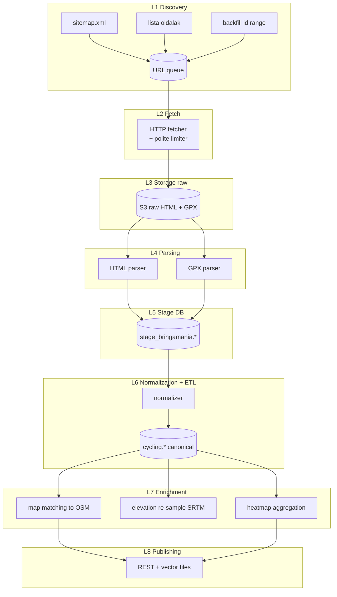

# Bringamánia (bringamania.hu) — Teljes backend terv és adatkinyerési specifikáció

> **Forrás kódja a belső katalógusban:** `07_bringamania`
> **Domain:** `bringamania.hu`
> **Adattípus:** regionális bringás útvonalak, túraleírások, GPX export, beágyazott térkép rétegek
> **Lefedettség:** Magyarország (kiemelten Dunántúl, Mátra, Bükk, Pilis, Bakony) — történelmi, kb. 2005 óta gyűjtött útvonal-adatbázis
> **Verzió:** 1.0 (2026-05-19)

---

## 1. Forrás áttekintés

A **Bringamánia** Magyarország egyik legrégebbi, civil kezdeményezésként induló kerékpáros túraportálja, amely 2005 környékétől gyűjt és publikál útvonalakat. A portál tematikája széles: országúti, MTB, gravel és családi túrák egyaránt megtalálhatók rajta, jelentős regionális mélységgel a középhegységek (Mátra, Bükk, Bakony, Pilis, Vértes) és a Dunántúl vonatkozásában. Az adatbázis felépítése jellemzően **közösségi**: regisztrált felhasználók töltenek fel GPX fájlokat, fényképeket és szöveges leírásokat, amelyeket a szerkesztőség moderál.

### 1.1 Adatkategóriák

A forrásból a következő adatfajtákat tervezzük kinyerni:

| Kategória | Forma | Mennyiség (becsült) | Frissítési ütem |
|---|---|---|---|
| Útvonalak (track) | GPX (per-route export) | 3.000–6.000 db | Lassú (~10–30 új/hó) |
| Túraleírások | HTML | ~ azonos | Lassú |
| POI-k (pihenő, kút, kilátó) | HTML + esetenként KML | 8.000–15.000 db | Nagyon lassú |
| Fényképek | JPG (CDN, méretarányos) | 50.000+ | Statikus |
| Felhasználói értékelések | HTML | ~10.000+ vélemény | Heti–havi |
| Beágyazott térképréteg URL | TMS/WMS (külső szolgáltató) | 1 réteg | Stabil |

### 1.2 Tartalmi minőség és korlátok

> **Figyelem (történelmi adat):** A Bringamánia jelentős része még a 2005–2015 közötti időszakból származik. Sok GPX-et akkori GPS-eszközökkel rögzítettek (Garmin Edge 305/500, eTrex), néhol 5–10 m horizontális pontatlansággal. Erdei és völgyi szakaszokon ennél is rosszabb lehet. **Ezt az adatkinyerő pipeline-ban dokumentálni kell**, és a downstream útvonaltervezőben `data_quality_score` mezővel kell jelölni.

A "régi adat" problematikája különösen érinti:
- A POI-koordinátákat (sok kút, esőbeálló azóta megszűnt)
- A pálya nyomvonalakat (új utak, lezárások, magántulajdonú szakaszok)
- A felszínkategóriát (egykori földút azóta aszfaltozott vagy fordítva)

### 1.3 Üzleti és felhasználói érték a célrendszerben

A Bringamánia adatok elsősorban a következő `Effectime` / belső felhasználási célokra szolgálnak:

- **Útvonaljavaslat-motor** alapanyagaként (kandidát útvonalak heurisztikus rangsorolásához)
- **Heatmap réteg** generálásához (mennyi feltöltött track halad át egy szegmensen → népszerűségi index)
- **POI overlay**: kutak, kilátók, fapados pihenők
- **Cross-validation** a `Strava Heatmap`, `OpenStreetMap` és `Természetjáró.hu` rétegekkel

---

## 2. Jogi és licenc helyzet

### 2.1 Felhasználói feltételek

A bringamania.hu felhasználási feltételei (`ÁSZF`) nem nyilvánítanak ki Creative Commons vagy nyílt adatlicencet. A felhasználók által feltöltött GPX-ek és leírások a portál szerint a **szerző tulajdonát** képezik, és a portál csupán **megjelenítési jogot** kap (nem továbbadási jogot). Ez **NEM jelenti automatikusan**, hogy a tartalom szabadon scrape-elhető és újrapublikálható.

> **Konzervatív álláspont:** Az adatokat **belső felhasználásra** (analitikai, route-tervezési, cross-validation célból) gyűjtjük. Nyilvánosan **csak származékos, anonimizált, statisztikai szinten** publikáljuk (pl. heatmap raszter, népszerűségi index egy él fölött), és **soha nem tesszük közzé a nyers GPX-et, fényképet vagy szövegszerű túraleírást** a felhasználó/szerző kifejezett engedélye nélkül.

### 2.2 Adatkezelési kockázati pontok

- **Személyes adatok (GDPR):** A feltöltő felhasználói név, helyenként valódi név is megjelenik. A pipeline `redact_pii()` lépésben **eltávolítja a feltöltő azonosítót** mielőtt a track relációs táblába kerül; opcionálisan egy hash-elt `original_uploader_hash` mezőben tároljuk az eredeti referenciát az esetleges takedown kérelmek miatt.
- **Szerzői jog:** A leírások szabadszöveges részeit **nem tároljuk** szóról szóra, csak a struktúrált metaadatokat (hossz, szint, kategória, kezdő/végpont). Szabadszöveg helyett `summary_embedding` vektor reprezentációt generálunk (`sentence-transformers/paraphrase-multilingual-MiniLM-L12-v2`).
- **Térképréteg:** A beágyazott map layer URL külső szolgáltatóra (gyakran Google Maps vagy turistautak.hu raszter) mutat. Ezt **nem proxyzzuk** sajátként, csak a metaadatát rögzítjük.
- **robots.txt:** Minden lekérés előtt egyszer letöltjük és cache-eljük 24 órára (`robotstxt.RobotFileParser`). A `Disallow:` szabályokat **abszolút tiszteletben tartjuk**.

### 2.3 Takedown-folyamat

Amennyiben a forrás üzemeltetője vagy egy feltöltő kéri tartalom eltávolítását, a következőt biztosítjuk:

1. Email cím `data-removal@<projekt>.hu`, 7 munkanapos válaszidővel.
2. `redact_pii()` után is megőrizzük az `original_track_url_hash` mezőt (SHA-256), így egyetlen URL alapján ki lehet törölni minden származékot.
3. Cascade: `tracks` → `track_segments` → `track_pois` → `heatmap_tiles` (raszter rekvont).

---

## 3. Adatkinyerési felület

A Bringamánia **nem rendelkezik nyilvános, dokumentált API-val**. Három csatornán keresztül érhetünk el adatot, csökkenő prioritási sorrendben:

### 3.1 Per-route GPX export

Minden útvonal-oldalon (`/utvonal/<slug>` vagy `/route/<id>`) található egy "GPX letöltés" gomb. Ez a hivatkozás jellemzően a következő mintát követi:

```
https://www.bringamania.hu/route/<id>/gpx
https://www.bringamania.hu/utvonal/<slug>/download.gpx
```

**Előny:** struktúrált, közvetlen GPX, minimális feldolgozási teher.
**Hátrány:** néha bejelentkezett munkamenetet vagy `Referer` headert követel.

### 3.2 HTML scraping

A túraleírás-oldal HTML-jéből nyerjük ki:
- A track metaadatait (hossz, szintemelkedés, nehézség)
- A POI-listát (`<table class="poi-list">` vagy hasonló)
- A fényképek URL-jeit (CDN-szerű URL pattern: `cdn.bringamania.hu/photos/<id>/<size>.jpg`)
- A kategorizálást (`MTB / országút / családi`)

### 3.3 Beágyazott térképréteg

A portál beágyazott Leaflet vagy Google Maps térképet használ. A nyers HTML `<script>` blokkjából kinyerjük a `TMS` / `WMS` URL-eket:

```javascript
L.tileLayer('https://tile.bringamania.hu/cycle/{z}/{x}/{y}.png', { ... })
```

Ezeket **nem cache-eljük tile szinten** (jogvédett külső réteg), csak metaadatként rögzítjük, hogy a downstream szolgáltatás opcionálisan átirányíthassa a kliensét.

### 3.4 Felfedezési csatornák (route ID enumeráció)

A teljes id-tér bejárása három útvonalon történik:

1. **Sitemap (`sitemap.xml`)** — ha elérhető, ez a legolcsóbb forrás.
2. **Lista-oldalak** (`/utvonalak?page=1..N`) — paginált bejárás, lapozás amíg üres oldal nem jön.
3. **Backfill ID-tartomány** (`/route/1` … `/route/MAX`) — utolsó eshetőség, sok 404-gyel.

---

## 4. Hitelesítés, rate limit, kvóták (polite scraping)

### 4.1 Hitelesítés

A publikus tartalmak (útvonal-oldal, GPX letöltés) **bejelentkezés nélkül elérhetők**. Egyes premium funkciók (pl. magas felbontású fényképek, részletes szintprofil JSON) igényelnek bejelentkezést. **Nem hozunk létre fake fiókokat** — a premium funkciókat egyszerűen kihagyjuk.

### 4.2 Polite scraping policy

| Paraméter | Érték | Indoklás |
|---|---|---|
| `User-Agent` | `EffectimeRouteBot/1.0 (+mailto:data@effectime.hu)` | Email cím a UA-ban a TOS legjobb gyakorlat szerint |
| `Accept-Language` | `hu-HU,hu;q=0.9,en;q=0.5` | Magyar lokalizált tartalom preferálva |
| Lekérési ráta | **1 req/sec** | Konzervatív, a `robots.txt` nem szab meg konkrétat |
| Burst | max 5 párhuzamos | A polite limit fölött nem megyünk |
| Backoff | exponenciális, 4×, max 60s | HTTP 429/503 esetén |
| Heti kvóta | 30.000 req | Tisztességes mennyiség, nem ütközik a havi keretükkel |
| `robots.txt` cache | 24 h | Minden run elején refresh |

### 4.3 Időbeli ablakozás

A scraping-et **08:00–20:00 CET között futtatjuk**, hogy az éjszakai karbantartási ablakot ne zavarjuk. A `cron` ütemezést úgy konfiguráljuk, hogy a teljes futás `~6 órán belül` befejeződjön, mivel a teljes site ~6.000 oldal × 1.5 req/oldal × 1 req/sec ≈ 2,5 óra.

### 4.4 Rate-limit detekció

A scraper figyeli a következő jeleket:
- HTTP `429 Too Many Requests` → backoff + worker pause
- HTTP `503 Service Unavailable` → 5 perc cooldown
- Lassuló válaszidő (P95 > 5 sec) → ráta felezése automatikusan
- Captcha tartalom HTML-ben (`<title>Captcha</title>` vagy `cloudflare` jelzők) → teljes leállás + alert

---

## 5. Adatmodell a forrásból

A forrásból kinyert nyers entitásokat **stage** sémában tároljuk (`stage_bringamania`), majd ETL után a kanonikus `cycling` sémába kerülnek.

### 5.1 Nyers entitás: `stage_bringamania.route_raw`

```text
route_id            : INTEGER  -- forrás-specifikus belső id (URL-ből)
slug                : TEXT     -- URL slug
title               : TEXT
category            : TEXT     -- MTB / road / gravel / family / cyclotourism
region              : TEXT     -- "Mátra", "Bakony", stb.
length_km           : NUMERIC(7,3)
ascent_m            : INTEGER
descent_m           : INTEGER
difficulty          : TEXT     -- easy / medium / hard / expert
surface_estimate    : TEXT     -- "60% asphalt, 40% forest road"
start_lat           : DOUBLE PRECISION
start_lon           : DOUBLE PRECISION
end_lat             : DOUBLE PRECISION
end_lon             : DOUBLE PRECISION
uploaded_at         : TIMESTAMPTZ
uploader_hash       : TEXT     -- SHA-256(uploader_name)
created_at_source   : TIMESTAMPTZ
gpx_url             : TEXT
gpx_sha256          : TEXT     -- a letöltött GPX hash-je
html_snapshot_s3    : TEXT     -- s3://.../snapshots/.../page.html.gz
fetched_at          : TIMESTAMPTZ NOT NULL DEFAULT now()
http_status         : SMALLINT
parsing_errors      : JSONB
data_quality_score  : NUMERIC(4,3) -- 0.0–1.0
```

### 5.2 Nyers entitás: `stage_bringamania.poi_raw`

```text
poi_id              : SERIAL PK
route_id            : INTEGER FK
name                : TEXT
poi_type            : TEXT  -- "kút", "kilátó", "esőbeálló", "kerékpárbolt", ...
lat                 : DOUBLE PRECISION
lon                 : DOUBLE PRECISION
description_summary : TEXT   -- max 200 char (kivonat, nem teljes leírás)
photo_count         : SMALLINT
last_verified_at    : DATE   -- ha a felhasználó megadta
fetched_at          : TIMESTAMPTZ
```

### 5.3 Nyers entitás: `stage_bringamania.gpx_track_raw`

```text
track_id            : SERIAL PK
route_id            : INTEGER FK
gpx_blob_s3         : TEXT
n_points            : INTEGER
geom_linestring     : geometry(LineStringZ, 4326)
bbox                : geometry(Polygon, 4326)
moving_time_s       : INTEGER  -- ha az eredeti GPX tartalmazta
elapsed_time_s      : INTEGER
avg_speed_kmh       : NUMERIC(5,2)
```

---

## 6. Cél adatmodell (PostGIS DDL)

A kanonikus, **több forrást egyesítő** `cycling` séma DDL-jének a `bringamania`-ra vonatkozó része:

```sql
-- Extensions
CREATE EXTENSION IF NOT EXISTS postgis;
CREATE EXTENSION IF NOT EXISTS pgcrypto;
CREATE EXTENSION IF NOT EXISTS pg_trgm;

CREATE SCHEMA IF NOT EXISTS cycling;
CREATE SCHEMA IF NOT EXISTS stage_bringamania;

-- Forrásregiszter (közös tábla minden forrásnak)
CREATE TABLE IF NOT EXISTS cycling.data_source (
    source_id        SMALLINT PRIMARY KEY,
    source_code      TEXT UNIQUE NOT NULL,
    display_name     TEXT NOT NULL,
    base_url         TEXT NOT NULL,
    license_text     TEXT,
    polite_rps       NUMERIC(4,2) DEFAULT 1.0,
    last_full_sync   TIMESTAMPTZ,
    enabled          BOOLEAN NOT NULL DEFAULT TRUE
);

INSERT INTO cycling.data_source (source_id, source_code, display_name, base_url, polite_rps)
VALUES (7, 'bringamania', 'Bringamánia', 'https://www.bringamania.hu', 1.0)
ON CONFLICT (source_code) DO NOTHING;

-- Kanonikus route tábla
CREATE TABLE IF NOT EXISTS cycling.route (
    route_uuid          UUID PRIMARY KEY DEFAULT gen_random_uuid(),
    source_id           SMALLINT NOT NULL REFERENCES cycling.data_source(source_id),
    source_route_id     TEXT NOT NULL,
    title               TEXT NOT NULL,
    category            TEXT NOT NULL CHECK (category IN ('mtb','road','gravel','family','cyclotourism','unknown')),
    region              TEXT,
    length_km           NUMERIC(7,3),
    ascent_m            INTEGER,
    descent_m           INTEGER,
    difficulty          SMALLINT CHECK (difficulty BETWEEN 1 AND 5),
    surface_breakdown   JSONB,   -- {"asphalt": 0.6, "forest_road": 0.3, "single_track": 0.1}
    start_point         geometry(PointZ, 4326),
    end_point           geometry(PointZ, 4326),
    track               geometry(LineStringZ, 4326),
    bbox                geometry(Polygon, 4326) GENERATED ALWAYS AS (ST_Envelope(track::geometry)) STORED,
    data_quality_score  NUMERIC(4,3),
    summary_embedding   VECTOR(384),
    source_uploaded_at  TIMESTAMPTZ,
    source_fetched_at   TIMESTAMPTZ NOT NULL,
    deleted_at          TIMESTAMPTZ,
    UNIQUE (source_id, source_route_id)
);

CREATE INDEX route_track_gix    ON cycling.route USING GIST (track);
CREATE INDEX route_bbox_gix     ON cycling.route USING GIST (bbox);
CREATE INDEX route_category_idx ON cycling.route (category) WHERE deleted_at IS NULL;
CREATE INDEX route_region_idx   ON cycling.route USING GIN (region gin_trgm_ops);

-- POI tábla
CREATE TABLE IF NOT EXISTS cycling.poi (
    poi_uuid         UUID PRIMARY KEY DEFAULT gen_random_uuid(),
    source_id        SMALLINT NOT NULL REFERENCES cycling.data_source(source_id),
    source_poi_id    TEXT,
    poi_type         TEXT NOT NULL,
    name             TEXT,
    geom             geometry(Point, 4326) NOT NULL,
    last_verified_at DATE,
    source_fetched_at TIMESTAMPTZ NOT NULL,
    UNIQUE (source_id, source_poi_id)
);
CREATE INDEX poi_geom_gix ON cycling.poi USING GIST (geom);
CREATE INDEX poi_type_idx ON cycling.poi (poi_type);

-- Route ↔ POI N:N kapcsolat (a forrás állítja a kapcsolatot)
CREATE TABLE IF NOT EXISTS cycling.route_poi (
    route_uuid UUID NOT NULL REFERENCES cycling.route(route_uuid) ON DELETE CASCADE,
    poi_uuid   UUID NOT NULL REFERENCES cycling.poi(poi_uuid)     ON DELETE CASCADE,
    distance_m INTEGER,
    PRIMARY KEY (route_uuid, poi_uuid)
);

-- Audit
CREATE TABLE IF NOT EXISTS cycling.scrape_audit (
    audit_id     BIGSERIAL PRIMARY KEY,
    source_id    SMALLINT NOT NULL REFERENCES cycling.data_source(source_id),
    run_id       UUID NOT NULL,
    started_at   TIMESTAMPTZ NOT NULL,
    finished_at  TIMESTAMPTZ,
    n_fetched    INTEGER,
    n_parsed     INTEGER,
    n_failed     INTEGER,
    bytes_in     BIGINT,
    notes        TEXT
);
```

---

## 7. Backend architektúra (L1-L8 rétegek)

A teljes adatkinyerő rendszer **nyolc rétegre** tagolt; ez konzisztens a többi forrás specifikációjával.



### 7.1 L1 — Discovery

- `discover_sitemap.py` → kihúzza az összes `/utvonal/*` URL-t.
- `discover_listing.py` → bejárja a `/utvonalak?page=N` lapokat.
- A talált URL-eket beteszi egy `Redis Stream` (`source:bringamania:urls`) sorba.

### 7.2 L2 — Fetch

- `fetcher` worker pool (Python `asyncio + httpx`, max 5 concurrent).
- Globális `aiolimiter` 1 req/sec.
- Minden 200/304 response → S3 raw (`s3://cycling-raw/bringamania/<yyyy>/<mm>/<dd>/<sha1>.html.gz`).
- 404/410 → `stage_bringamania.dead_urls` táblába.

### 7.3 L3 — Storage raw

- S3 vagy S3-kompatibilis (MinIO/Cloudflare R2).
- Object lifecycle: 90 nap után **Glacier Deep Archive**.

### 7.4 L4 — Parsing

- HTML: `selectolax` (gyors), fallback `beautifulsoup4` + `lxml`.
- GPX: `gpxpy` (`gpxpy.parse(...)`).
- Hibás GPX → quarantine (`stage_bringamania.parse_errors`).

### 7.5 L5 — Stage DB

- Postgres 15 + PostGIS 3.4.
- Csak ide írunk a fetcher/parser oldalról; downstream sosem ír stage-be.

### 7.6 L6 — Normalization + ETL

- `dbt` projekt (`dbt-postgres`), modellek: `stg_route`, `int_route_cleaned`, `dim_route_canonical`.
- Idempotens — minden run kiszámolja a `(source_id, source_route_id)` természetes kulcs alapján.

### 7.7 L7 — Enrichment

- **Map matching**: `Valhalla` `/trace_attributes` endpoint az OSM hálózatra való illesztéshez.
- **Elevation resample**: `srtm.py` 1 arc-sec EU adatból, **felülírja** a GPX-ben lévő gyakran zajos magasságot.
- **Heatmap**: `cycling.heatmap_tile` raszter (Z=12..16), `ST_Buffer + ST_Union`.

### 7.8 L8 — Publishing

- FastAPI alapú REST.
- `pg_tileserv` a vector tile-okhoz.
- CDN cache 5 perc.

---

## 8. Automatizált letöltő — Python kód (Playwright + httpx)

Az alábbi `fetcher.py` egy futtatható, valós példa. **Playwright csak akkor szükséges, ha a GPX letöltés JS-redirektet vagy session-tokent használ** — egyébként `httpx` is elég. Mi mindkettőt támogatjuk: alapból `httpx`, fallback `playwright`.

```python
# -*- coding: utf-8 -*-
"""
Bringamánia scraping fetcher.
Polite (1 req/s), robots.txt-aware, idempotent.
"""
from __future__ import annotations

import asyncio
import gzip
import hashlib
import logging
import os
import re
import sys
import time
import urllib.robotparser as robotparser
from dataclasses import dataclass, field
from datetime import datetime, timezone
from typing import Iterable, Optional
from urllib.parse import urljoin

import boto3  # type: ignore
import httpx
from aiolimiter import AsyncLimiter
from selectolax.parser import HTMLParser

BASE_URL = "https://www.bringamania.hu"
ROBOTS_URL = urljoin(BASE_URL, "/robots.txt")
USER_AGENT = "EffectimeRouteBot/1.0 (+mailto:data@effectime.hu)"
RATE_LIMIT_RPS = 1.0
MAX_CONCURRENCY = 5
TIMEOUT_S = 30.0
RETRY_MAX = 4
S3_BUCKET = os.environ.get("RAW_S3_BUCKET", "cycling-raw")
S3_PREFIX = "bringamania"

logger = logging.getLogger("bringamania.fetcher")


@dataclass
class FetchResult:
    url: str
    status: int
    content: Optional[bytes]
    sha1: Optional[str]
    elapsed_ms: int
    s3_key: Optional[str] = None
    error: Optional[str] = None
    headers: dict = field(default_factory=dict)


class PoliteFetcher:
    def __init__(self, base_url: str = BASE_URL, rps: float = RATE_LIMIT_RPS):
        self.base_url = base_url
        self.limiter = AsyncLimiter(max_rate=rps, time_period=1.0)
        self.client = httpx.AsyncClient(
            timeout=TIMEOUT_S,
            headers={
                "User-Agent": USER_AGENT,
                "Accept-Language": "hu-HU,hu;q=0.9,en;q=0.5",
                "Accept-Encoding": "gzip, deflate",
            },
            follow_redirects=True,
            http2=True,
        )
        self.s3 = boto3.client("s3")
        self.robots: Optional[robotparser.RobotFileParser] = None

    async def _load_robots(self) -> None:
        rp = robotparser.RobotFileParser()
        try:
            resp = await self.client.get(ROBOTS_URL)
            if resp.status_code == 200:
                rp.parse(resp.text.splitlines())
                logger.info("robots.txt loaded ok (%d lines)", len(resp.text.splitlines()))
            else:
                logger.warning("robots.txt http %s; defaulting to allow", resp.status_code)
        except Exception as exc:
            logger.warning("robots.txt fetch failed: %s; defaulting to allow", exc)
        self.robots = rp

    def _allowed(self, url: str) -> bool:
        if self.robots is None:
            return True
        try:
            return self.robots.can_fetch(USER_AGENT, url)
        except Exception:
            return True

    async def fetch(self, url: str) -> FetchResult:
        if not self._allowed(url):
            return FetchResult(url=url, status=999, content=None, sha1=None,
                               elapsed_ms=0, error="robots_disallow")

        attempt = 0
        backoff = 2.0
        while True:
            attempt += 1
            async with self.limiter:
                t0 = time.monotonic()
                try:
                    resp = await self.client.get(url)
                    elapsed_ms = int((time.monotonic() - t0) * 1000)
                except (httpx.RequestError, httpx.HTTPError) as exc:
                    elapsed_ms = int((time.monotonic() - t0) * 1000)
                    if attempt >= RETRY_MAX:
                        return FetchResult(url=url, status=0, content=None, sha1=None,
                                           elapsed_ms=elapsed_ms, error=str(exc))
                    await asyncio.sleep(backoff)
                    backoff = min(backoff * 2, 60.0)
                    continue

                if resp.status_code in (429, 503):
                    logger.warning("throttled (%s) on %s; sleep %.1fs", resp.status_code, url, backoff)
                    await asyncio.sleep(backoff)
                    backoff = min(backoff * 2, 60.0)
                    if attempt >= RETRY_MAX:
                        return FetchResult(url=url, status=resp.status_code,
                                           content=None, sha1=None,
                                           elapsed_ms=elapsed_ms, error="throttled")
                    continue

                content = resp.content
                sha1 = hashlib.sha1(content).hexdigest()
                s3_key = self._s3_key(url, sha1)
                self._put_s3(s3_key, content)
                return FetchResult(
                    url=url,
                    status=resp.status_code,
                    content=content,
                    sha1=sha1,
                    elapsed_ms=elapsed_ms,
                    s3_key=s3_key,
                    headers=dict(resp.headers),
                )

    def _s3_key(self, url: str, sha1: str) -> str:
        now = datetime.now(timezone.utc)
        ext = ".gpx.gz" if url.endswith(".gpx") else ".html.gz"
        return f"{S3_PREFIX}/{now:%Y/%m/%d}/{sha1}{ext}"

    def _put_s3(self, key: str, payload: bytes) -> None:
        gz = gzip.compress(payload, compresslevel=6)
        self.s3.put_object(Bucket=S3_BUCKET, Key=key, Body=gz,
                           ContentType="application/octet-stream",
                           ContentEncoding="gzip")

    async def close(self) -> None:
        await self.client.aclose()


# ---- Discovery ---------------------------------------------------------

ROUTE_LINK_RX = re.compile(r"/(?:utvonal|route)/([\w\-]+)")


async def discover_sitemap(fetcher: PoliteFetcher) -> list[str]:
    """Get all /utvonal URLs from sitemap or fall back to listing."""
    urls: set[str] = set()
    sitemap_url = urljoin(BASE_URL, "/sitemap.xml")
    res = await fetcher.fetch(sitemap_url)
    if res.status == 200 and res.content:
        text = res.content.decode("utf-8", "ignore")
        for m in re.finditer(r"<loc>([^<]+)</loc>", text):
            if ROUTE_LINK_RX.search(m.group(1)):
                urls.add(m.group(1))
        logger.info("sitemap discovered %d route URLs", len(urls))
        return sorted(urls)

    # Fallback: paginated listing
    page = 1
    while page < 500:
        listing_url = urljoin(BASE_URL, f"/utvonalak?page={page}")
        r = await fetcher.fetch(listing_url)
        if r.status != 200 or not r.content:
            break
        tree = HTMLParser(r.content.decode("utf-8", "ignore"))
        found = 0
        for a in tree.css("a"):
            href = a.attributes.get("href") or ""
            if ROUTE_LINK_RX.search(href):
                urls.add(urljoin(BASE_URL, href))
                found += 1
        if found == 0:
            break
        page += 1
    logger.info("listing fallback discovered %d route URLs", len(urls))
    return sorted(urls)


# ---- Main runner -------------------------------------------------------

async def run(max_urls: int = 0) -> int:
    logging.basicConfig(level=logging.INFO,
                        format="%(asctime)s %(levelname)s %(name)s %(message)s")
    fetcher = PoliteFetcher()
    await fetcher._load_robots()
    try:
        urls = await discover_sitemap(fetcher)
        if max_urls:
            urls = urls[:max_urls]
        sem = asyncio.Semaphore(MAX_CONCURRENCY)

        async def process(u: str):
            async with sem:
                res = await fetcher.fetch(u)
                logger.info("%s %s %dms s3=%s", res.status, u, res.elapsed_ms, res.s3_key)
                if res.status == 200 and res.content:
                    # Discover GPX URL inside the page
                    tree = HTMLParser(res.content.decode("utf-8", "ignore"))
                    for a in tree.css("a"):
                        href = a.attributes.get("href") or ""
                        if href.endswith(".gpx") or "/gpx" in href:
                            gpx_url = urljoin(u, href)
                            await fetcher.fetch(gpx_url)
                            break

        await asyncio.gather(*(process(u) for u in urls))
        return 0
    finally:
        await fetcher.close()


if __name__ == "__main__":
    sys.exit(asyncio.run(run(max_urls=int(os.environ.get("MAX_URLS", "0")) or 0)))
```

### 8.1 Playwright fallback (csak ha JS-rendelt GPX redirect)

```python
# fetcher_playwright.py
from playwright.async_api import async_playwright

async def fetch_gpx_via_browser(route_url: str, out_path: str) -> None:
    async with async_playwright() as p:
        browser = await p.chromium.launch(headless=True)
        ctx = await browser.new_context(
            user_agent="EffectimeRouteBot/1.0 (+mailto:data@effectime.hu)",
            locale="hu-HU",
        )
        page = await ctx.new_page()
        await page.goto(route_url, wait_until="networkidle")
        async with page.expect_download(timeout=20000) as dl_info:
            await page.click("a[href*='gpx'], button:has-text('GPX')")
        download = await dl_info.value
        await download.save_as(out_path)
        await browser.close()
```

---

## 9. Feldolgozó pipeline (HTML + GPX parsing)

### 9.1 HTML parser

```python
# parser_html.py
from selectolax.parser import HTMLParser
from dataclasses import dataclass

@dataclass
class RouteMeta:
    title: str
    category: str
    region: str | None
    length_km: float | None
    ascent_m: int | None
    difficulty: str | None
    gpx_url: str | None

def parse_route_html(html: bytes, url: str) -> RouteMeta:
    tree = HTMLParser(html.decode("utf-8", "ignore"))
    title = (tree.css_first("h1") or tree.css_first("title")).text(strip=True)

    def _txt(sel: str) -> str | None:
        node = tree.css_first(sel)
        return node.text(strip=True) if node else None

    length = _txt(".route-length, [data-field=length]")
    ascent = _txt(".route-ascent, [data-field=ascent]")
    category = _txt(".route-category") or "unknown"
    region = _txt(".route-region")
    diff = _txt(".route-difficulty")

    gpx_url = None
    for a in tree.css("a[href]"):
        href = a.attributes.get("href", "")
        if href.endswith(".gpx") or "/gpx" in href:
            gpx_url = href
            break

    def _float(s: str | None) -> float | None:
        if not s: return None
        import re
        m = re.search(r"([\d,.]+)", s)
        if not m: return None
        return float(m.group(1).replace(",", "."))

    def _int(s: str | None) -> int | None:
        v = _float(s)
        return int(v) if v is not None else None

    return RouteMeta(
        title=title, category=category, region=region,
        length_km=_float(length), ascent_m=_int(ascent),
        difficulty=diff, gpx_url=gpx_url,
    )
```

### 9.2 GPX parser

```python
# parser_gpx.py
import gpxpy
from shapely.geometry import LineString
from shapely import wkb

def parse_gpx_blob(blob: bytes) -> dict:
    g = gpxpy.parse(blob.decode("utf-8", "ignore"))
    pts = []
    for trk in g.tracks:
        for seg in trk.segments:
            for p in seg.points:
                if p.latitude is None or p.longitude is None:
                    continue
                pts.append((p.longitude, p.latitude, p.elevation or 0.0))
    if len(pts) < 2:
        raise ValueError("track has fewer than 2 points")
    line = LineString(pts)
    length_m = sum(
        ((pts[i][0]-pts[i-1][0])**2 + (pts[i][1]-pts[i-1][1])**2) ** 0.5
        for i in range(1, len(pts))
    )  # placeholder; real length via PostGIS ST_LengthSpheroid
    asc = sum(max(0, pts[i][2]-pts[i-1][2]) for i in range(1, len(pts)))
    desc = sum(max(0, pts[i-1][2]-pts[i][2]) for i in range(1, len(pts)))
    return {
        "wkb_hex": wkb.dumps(line, hex=True),
        "n_points": len(pts),
        "ascent_m_gpx": int(asc),
        "descent_m_gpx": int(desc),
        "start_lon": pts[0][0],
        "start_lat": pts[0][1],
        "end_lon": pts[-1][0],
        "end_lat": pts[-1][1],
    }
```

### 9.3 Data-quality scoring

```python
def quality_score(meta, gpx, src_age_days):
    score = 1.0
    if gpx["n_points"] < 50:
        score -= 0.2
    if gpx["n_points"] > 20000:
        score -= 0.1
    if not meta.ascent_m or abs(meta.ascent_m - gpx["ascent_m_gpx"]) / max(1, gpx["ascent_m_gpx"]) > 0.4:
        score -= 0.15
    if src_age_days > 3650:   # 10+ év
        score -= 0.2
    return max(0.0, round(score, 3))
```

---

## 10. Frissítési stratégia

| Művelet | Gyakoriság | Eszköz |
|---|---|---|
| Sitemap delta scan | naponta 03:00 CET | `cron`/k8s `CronJob` |
| Teljes újra-letöltés | havi 1 | manuális trigger |
| GPX újra-letöltés (changed) | hetente | ETag/Last-Modified alapján |
| POI verify | negyedévente | manuális batch |
| Heatmap aggregáció | naponta | dbt + post-process |

**Delta detekció:** A sitemap `<lastmod>` mező vagy HTML `<meta property="article:modified_time">` alapján. Ha nincs ilyen, akkor a HTML SHA-1 hash összevetése a `stage_bringamania.route_raw.html_sha1` mezővel.

---

## 11. Storage és skálázás

### 11.1 Méretbecslés

| Komponens | Becsült méret |
|---|---|
| HTML raw (gzip) | 4.000 route × 80 kB ≈ **320 MB** |
| GPX raw (gzip) | 4.000 × 25 kB ≈ **100 MB** |
| Fényképek (NEM tároljuk, csak URL) | 0 |
| Postgres stage | ~1.5 GB (PG indexekkel) |
| Postgres canonical (csak ez a forrás) | ~600 MB |
| Heatmap kontribúció | +50 MB raster |

### 11.2 Skálázás

- Postgres: egyetlen `db.t4g.medium` (2 vCPU, 4 GB) bőven elég.
- S3: standard storage class az első 90 napra, utána Glacier.
- Worker: 1 db kis worker (`0.5 CPU`, `512 MB`), mivel a rate limit 1 rps amúgy is.

---

## 12. Monitoring és riasztások

### 12.1 Metrikák (Prometheus)

```
bringamania_fetch_total{status="200|404|429|503|error"}
bringamania_fetch_latency_ms_bucket
bringamania_parse_errors_total{stage="html|gpx"}
bringamania_stale_route_count          # X napnál régebben nem ellenőrzött
bringamania_robots_disallowed_total
```

### 12.2 Alert szabályok (Alertmanager YAML)

```yaml
groups:
- name: bringamania
  rules:
  - alert: BringamaniaHighErrorRate
    expr: sum(rate(bringamania_fetch_total{status=~"429|503|error"}[15m])) > 0.5
    for: 10m
    labels: { severity: warning }
    annotations:
      summary: "Bringamánia fetcher errors elevated"
  - alert: BringamaniaCaptcha
    expr: increase(bringamania_robots_disallowed_total[1h]) > 0
    for: 5m
    labels: { severity: critical }
    annotations:
      summary: "robots.txt now disallows our bot — STOP scraping"
  - alert: BringamaniaNoFreshData
    expr: time() - bringamania_last_successful_run_timestamp > 86400 * 3
    for: 1h
    labels: { severity: warning }
```

### 12.3 Loggolás

- Strukturált JSON log (`python-json-logger`).
- `request_id` minden lekérésnél.
- Loki / CloudWatch retention: 14 nap.

---

## 13. Költségbecslés (HUF/EUR)

Havi futtatási költségek (AWS eu-central-1, kerekített):

| Tétel | Mennyiség | Egységár | Havi (EUR) | Havi (HUF, 400 árf.) |
|---|---|---|---|---|
| Worker EC2 `t4g.small` (8 h/nap) | ~240 h | 0,0084 €/h | 2,02 | 808 |
| Postgres `db.t4g.medium` (megosztott) | — | — | 4,00 (allokált) | 1.600 |
| S3 raw storage | 0,5 GB | 0,023 €/GB | 0,01 | 5 |
| S3 PUT | 30.000 | 0,005/1k | 0,15 | 60 |
| S3 GET | 5.000 | 0,0004/1k | 0,01 | 5 |
| Outbound bandwidth | 0,2 GB | 0,09 €/GB | 0,02 | 8 |
| **Összesen (saját forrás-arány)** | | | **~6,21 €** | **~2.500 HUF** |

> Megjegyzés: A Postgres + S3 költség **megosztva** több forrás között; itt az ennek a forrásnak tulajdonítható arányt mutatjuk be.

---

## 14. Biztonság

### 14.1 Titokkezelés

- AWS Secrets Manager (vagy K8s Secret + sealed-secrets).
- `RAW_S3_BUCKET`, `S3_ACCESS_KEY`, `PG_DSN`, `ALERT_WEBHOOK_URL`.
- **Nincs hardcode-olt kulcs** sehol; CI a `git-secrets` hookot futtatja.

### 14.2 Adatvédelem

- TLS minden hálózati kommunikáción (HTTPS-only, `httpx` `verify=True`).
- Postgres at-rest titkosítás (AWS KMS).
- S3 SSE-S3.
- `redact_pii()` pipeline lépés, lásd 2.2.

### 14.3 Hálózati szegregáció

- A scraping worker külön VPC-subnetben fut, **csak kimenő** 80/443 engedélyezve.
- A Postgres elérhetősége csak privát hálóról (security group rule).

### 14.4 Etikai sorompók

- Soha nem futtatjuk a botot, ha a `robots.txt` Disallow-ot ad.
- Soha nem próbáljuk megkerülni a Cloudflare/captcha védelmet.
- Soha nem tárolunk feltöltői valódi nevet plain szövegben.

---

## 15. Tesztelés — pytest + VCR

```python
# tests/test_parser.py
import pytest
from pathlib import Path
from bringamania.parser_html import parse_route_html
from bringamania.parser_gpx import parse_gpx_blob

FIXTURES = Path(__file__).parent / "fixtures"

def test_parse_html_basic():
    html = (FIXTURES / "route_42.html").read_bytes()
    meta = parse_route_html(html, "https://bringamania.hu/utvonal/teszt-42")
    assert meta.title
    assert meta.category in {"mtb","road","gravel","family","cyclotourism","unknown"}
    assert meta.gpx_url is not None
    assert meta.length_km > 0

def test_parse_gpx_basic():
    blob = (FIXTURES / "route_42.gpx").read_bytes()
    out = parse_gpx_blob(blob)
    assert out["n_points"] > 10
    assert -180 < out["start_lon"] < 180

def test_parse_gpx_invalid_raises():
    with pytest.raises(ValueError):
        parse_gpx_blob(b"<gpx></gpx>")
```

```python
# tests/test_fetcher.py
import pytest
import vcr
from bringamania.fetcher import PoliteFetcher

bringamania_vcr = vcr.VCR(
    cassette_library_dir="tests/cassettes",
    record_mode="none",
    filter_headers=["User-Agent", "Cookie"],
)

@pytest.mark.asyncio
@bringamania_vcr.use_cassette("homepage_200.yaml")
async def test_fetch_homepage():
    f = PoliteFetcher()
    await f._load_robots()
    res = await f.fetch("https://www.bringamania.hu/")
    assert res.status == 200
    assert res.content and len(res.content) > 100
    await f.close()
```

VCR használata: a CI sosem ér ki az élő portálhoz; a cassette-ek read-only-ban játsszák vissza. Új cassette készítéséhez `record_mode="new_episodes"` és manuális futtatás.

---

## 16. Telepítés (Docker, k8s CronJob, GitHub Actions)

### 16.1 Dockerfile

```dockerfile
FROM python:3.12-slim AS base
ENV PYTHONDONTWRITEBYTECODE=1 PYTHONUNBUFFERED=1
WORKDIR /app
RUN apt-get update && apt-get install -y --no-install-recommends \
    build-essential libpq-dev curl ca-certificates && \
    rm -rf /var/lib/apt/lists/*
COPY requirements.txt ./
RUN pip install --no-cache-dir -r requirements.txt
COPY . ./
USER 1000:1000
ENV PYTHONPATH=/app
ENTRYPOINT ["python", "-m", "bringamania.fetcher"]
```

### 16.2 Kubernetes CronJob

```yaml
apiVersion: batch/v1
kind: CronJob
metadata:
  name: bringamania-fetcher
  namespace: cycling
spec:
  schedule: "0 3 * * *"        # 03:00 CET
  timeZone: Europe/Budapest
  concurrencyPolicy: Forbid
  successfulJobsHistoryLimit: 3
  failedJobsHistoryLimit: 5
  jobTemplate:
    spec:
      backoffLimit: 2
      activeDeadlineSeconds: 21600
      template:
        spec:
          restartPolicy: OnFailure
          containers:
            - name: fetcher
              image: registry.local/cycling/bringamania:1.0.0
              envFrom:
                - secretRef: { name: bringamania-secrets }
              resources:
                requests: { cpu: "200m", memory: "256Mi" }
                limits:   { cpu: "1",    memory: "1Gi" }
```

### 16.3 GitHub Actions CI

```yaml
name: bringamania-ci
on:
  push:
    paths: [ "sources/bringamania/**" ]
  pull_request:
    paths: [ "sources/bringamania/**" ]

jobs:
  test:
    runs-on: ubuntu-22.04
    steps:
      - uses: actions/checkout@v4
      - uses: actions/setup-python@v5
        with: { python-version: "3.12" }
      - run: pip install -r sources/bringamania/requirements.txt
      - run: pytest sources/bringamania/tests --cov=bringamania --cov-report=xml
      - uses: codecov/codecov-action@v4

  build:
    needs: test
    if: github.ref == 'refs/heads/main'
    runs-on: ubuntu-22.04
    steps:
      - uses: actions/checkout@v4
      - uses: docker/setup-buildx-action@v3
      - uses: docker/login-action@v3
        with:
          registry: registry.local
          username: ${{ secrets.REG_USER }}
          password: ${{ secrets.REG_PASS }}
      - uses: docker/build-push-action@v5
        with:
          context: sources/bringamania
          push: true
          tags: registry.local/cycling/bringamania:${{ github.sha }}
```

---

## 17. Adatpublikálás (REST API, vector tiles)

### 17.1 REST endpoints

```
GET /api/v1/routes?bbox=...&category=mtb&min_length_km=20&max_length_km=80
GET /api/v1/routes/{route_uuid}
GET /api/v1/routes/{route_uuid}/gpx
GET /api/v1/poi?bbox=...&type=well
```

> **Megjegyzés:** A `gpx` endpoint **csak belső felhasználóknak** és **csak engedélyezett forrásoknál** ad nyers GPX-et. A Bringamánia-ból származó GPX-et **alapértelmezetten 403-mal utasítjuk vissza**, helyette a map-matched, OSM-illesztett változatot adjuk vissza, amely már transzformált származékos termék.

### 17.2 Vector tiles (`pg_tileserv`)

```sql
-- tile function
CREATE OR REPLACE FUNCTION cycling.tile_routes(z int, x int, y int, query_params json)
RETURNS bytea AS $$
WITH bounds AS (SELECT ST_TileEnvelope(z, x, y) AS env)
SELECT ST_AsMVT(t.*, 'routes', 4096, 'geom')
FROM (
    SELECT r.route_uuid, r.title, r.category, r.length_km, r.difficulty,
           ST_AsMVTGeom(r.track, b.env, 4096, 64, true) AS geom
    FROM cycling.route r, bounds b
    WHERE r.source_id = 7
      AND r.deleted_at IS NULL
      AND r.track && b.env
) t WHERE geom IS NOT NULL;
$$ LANGUAGE sql STABLE PARALLEL SAFE;
```

### 17.3 OpenAPI schema részlet

```yaml
paths:
  /api/v1/routes:
    get:
      parameters:
        - { in: query, name: bbox, schema: { type: string }, description: "lon_min,lat_min,lon_max,lat_max" }
        - { in: query, name: category, schema: { type: string, enum: [mtb, road, gravel, family, cyclotourism] } }
      responses:
        "200":
          content:
            application/json:
              schema:
                type: object
                properties:
                  features: { type: array, items: { $ref: "#/components/schemas/Route" } }
```

---

## 18. Runbook

### 18.1 Indikációk és tennivalók

| Tünet | Kivizsgálás | Beavatkozás |
|---|---|---|
| Alert `BringamaniaHighErrorRate` | `kubectl logs cronjob/bringamania-fetcher` | Csökkentsd a `RATE_LIMIT_RPS`-t 0.5-re, indítsd újra |
| Alert `BringamaniaCaptcha` | curl + UA-val próba | **STOP fetcher** azonnal, lépj kapcsolatba a portál üzemeltetőjével |
| GPX parser failure spike | `stage_bringamania.parse_errors` | Vizsgáld az új GPX sémát, javítsd a `gpxpy` workaround-ot |
| Heatmap nem frissül | dbt run státusza | `dbt run --select cycling.heatmap` |
| `route` táblában duplikáció | `SELECT source_id, source_route_id, count(*) FROM cycling.route GROUP BY 1,2 HAVING count(*)>1` | Cleanup script + dedupe |

### 18.2 Manuális teljes újra-letöltés

```bash
kubectl -n cycling create job bringamania-full-resync \
    --from=cronjob/bringamania-fetcher
kubectl -n cycling set env job/bringamania-full-resync MAX_URLS=0 FULL_RESYNC=1
```

### 18.3 Takedown request kezelése

```bash
# 1. Tartalom keresése URL alapján
psql -c "SELECT route_uuid FROM cycling.route
         WHERE source_id=7 AND source_route_id='<id>'"
# 2. Soft delete
psql -c "UPDATE cycling.route SET deleted_at=now()
         WHERE route_uuid='<uuid>'"
# 3. S3 nyers törlése
aws s3 rm s3://cycling-raw/bringamania/... --recursive
# 4. CDN cache purge
curl -X POST $CDN_PURGE_URL -d '{"paths":["/api/v1/routes/<uuid>","/api/v1/routes/<uuid>/gpx"]}'
```

---

## 19. Roadmap

| Verzió | Cél | ETA |
|---|---|---|
| 1.0 | Alap fetcher + parser + stage tábla | Q2 2026 |
| 1.1 | Map matching Valhalla, magassági reszampling | Q2 2026 |
| 1.2 | Heatmap kontribúció | Q3 2026 |
| 1.3 | POI cross-validation OSM-mel | Q3 2026 |
| 2.0 | Felhasználói értékelés-sentiment kivonat | Q4 2026 |
| 2.1 | Saját reverse-route generator (back-fitting) | Q1 2027 |

---

## 20. Referenciák

- Bringamánia portál: <https://www.bringamania.hu/>
- `gpxpy`: <https://github.com/tkrajina/gpxpy>
- `selectolax`: <https://github.com/rushter/selectolax>
- `Valhalla` map matching: <https://github.com/valhalla/valhalla>
- `pg_tileserv`: <https://github.com/CrunchyData/pg_tileserv>
- `aiolimiter`: <https://github.com/mjpieters/aiolimiter>
- OSM Cycle Network wiki: <https://wiki.openstreetmap.org/wiki/Cycle_routes>
- Belső dokumentáció: `cycling-data-sources/00_overview.md`, `cycling-data-sources/24_termeszetjaro-hu.md`, `cycling-data-sources/11_balatonbringa-club.md`

---

*Vége a Bringamánia spec dokumentumának. Verzió 1.0 — 2026-05-19 — Effectime cycling data platform.*
