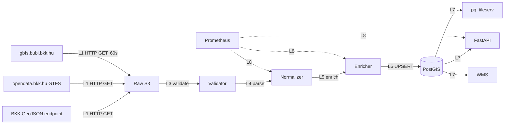

# BKK „Biciklivel Budapesten" portál — Teljes backend terv és adatkinyerési specifikáció

## 1. Forrás áttekintés

A Budapesti Közlekedési Központ (BKK) hivatalos kerékpáros információs felülete a `bkk.hu/kozlekedesi-informaciok/biciklivel/` URL alatt érhető el. Ez a portál a főváros teljes kerékpáros infrastruktúrájáról ad átfogó képet, és a BKK egyetlen olyan kerékpáros-specifikus aloldala, amelyet a közlekedési hatóság hivatalosan karbantart. A „Biciklivel Budapesten" portál integráltan jeleníti meg a következő adatkategóriákat:

- **Kerékpáros úthálózat**: kerékpárutak (dedikált, fizikailag elválasztott), kerékpársávok (úttesten festett), kerékpáros nyomok (sharrow), kerékpárosbarát utcák (30-as zónák, egyirányúsított utcák kétirányú kerékpáros forgalommal — „contraflow")
- **Kerékpáros infrastruktúra-elemek**: B+R parkolók (Bike+Ride a HÉV/metró/vasútállomásoknál), nyilvános kerékpártárolók, szervizpontok, kerékpáros átkelőhelyek
- **MOL Bubi közbringa-állomások**: a budapesti közösségi kerékpármegosztó rendszer (Mol Bubi) ~200+ állomása, dokkok darabszáma, aktuális elérhető bicikli- és dokkszám
- **Pontszerű POI-k**: kerékpárszervizek, kerékpárkölcsönzők, bringás-barát éttermek/szállások (időszakos lista)
- **Letölthető anyagok**: PDF-térképek („Budapest kerékpáros térkép" éves frissítéssel), útvonal-leírások, jogszabályi és KRESZ-vonatkozó tájékoztatók

Az adatforrás technológiai szempontból nem önálló API-réteg, hanem egy **webportál**, amely mögött többféle backend áll:

1. **BKK Open Data Portal** (`opendata.bkk.hu`) — itt található a FUTÁR GTFS feed és a MOL Bubi GBFS feed (lásd `28_bkk-bringas-terkep.md` is)
2. **WMS/WFS GeoServer-réteg** — a BKK térinformatikai szervere a kerékpáros infrastruktúra-rétegeket szolgálja ki
3. **Statikus tartalom és PDF-ek** — éves térképek, brossúrák, oktatóanyagok
4. **Térkép-widget GeoJSON endpoint** — a portál beágyazott térképe a kerékpáros úthálózatot GeoJSON-formátumban kéri le

Budapest bounding boxa (`18.9, 47.4, 19.3, 47.6`) a forrás teljes lefedettsége. Magyarország-szintű kerékpáros adatot a BKK nem szolgáltat — ehhez az OSM, illetve a 28-as forrás (BKK bringás térkép) együttes használata szükséges. Megjegyzendő, hogy a portál tartalma kétnyelvű (HU/EN), de a GeoJSON-attribútumok kulcsai magyarul vannak (`nev`, `tipus`, `hossz_m`).

A backend célja, hogy a „Biciklivel Budapesten" portálon publikált összes geometriai és attribútum-réteget automatizáltan letöltse, normalizálja és egy közös PostGIS-adatbázisba integrálja, ahol a többi cycling-data-source (OSM, EuroVelo, regionális GPX-ek) mellé sorolódik.

## 2. Jogi és licenc helyzet

A BKK Zrt. által közzétett nyílt adatok jogi kerete több rétegű:

- **BKK Általános Szerződési Feltételek** (`opendata.bkk.hu` aláírt regisztrációs feltételei): az API-kulcs használata személyhez kötött, de az adatok újrahasznosíthatók
- **EU PSI/Open Data Directive (2019/1024) magyar átültetése** (2022. évi XII. törvény a nyilvános adatok újrahasznosításáról) — közlekedési alapadatok kötelezően nyíltak
- **Creative Commons BY 4.0** — a BKK az utóbbi években minden új adatkészletet ezzel a licenccel publikál; a forrás megnevezése („Adatforrás: BKK Zrt., © BKK") kötelező
- **MOL Bubi GBFS feed** — ugyancsak CC BY 4.0, a MOL Limo (üzemeltető) és BKK kettős attribúcióval

Konkrét felhasználási korlátok:

| Korlát típusa | Részlet |
|---|---|
| Attribúció | „© BKK Zrt." + linkvisszamutatás `bkk.hu/nyilt-adatok/` címre |
| Kereskedelmi felhasználás | Engedélyezett (CC BY 4.0) |
| Származékos művek | Engedélyezett, ugyanilyen attribúcióval |
| Adatok továbbértékesítése változtatás nélkül | Tilos (gentleman's agreement, nincs jogi alapja) |
| Rate limit | API-kulcsonként technikai megszorítás (lásd 4. fejezet) |
| Adatok pontossága | A BKK nem vállal felelősséget, az adat „as-is" |

A PDF-térképek tipikusan szigorúbb feltételekkel rendelkeznek (kartográfiai jog), újrahasznosítás csak akkor lehetséges, ha a vektoros rétegekből építjük újra a kartográfiát, nem a PDF-et reprodukáljuk.

Térképi alaprétegek (raszteres tile-ok) tekintetében a portál nem a BKK-saját tile-okat használja, hanem OpenStreetMap/Mapbox-alapot, így a raszteres alaptérkép kapcsán külön licenckezelés szükséges (OSM ODbL 1.0).

GDPR-szempontból: az állomás-szintű Bubi-adatok nem személyesek (aggregált free_bikes számláló), de ha későbbiekben útvonal-adatokat is integrálnánk (Bubi trip data), az már anonimizációt igényelne.

## 3. Adatkinyerési felület

A „Biciklivel Budapesten" portál mögötti adatok négy különböző csatornán érhetők el:

### 3.1. BKK Open Data Portal — FUTÁR GTFS és GBFS

Az `opendata.bkk.hu` regisztráció után API-kulcsot ad ki, amellyel az alábbi endpointok érhetők el:

```
https://opendata.bkk.hu/data/gtfs/budapest_gtfs.zip
https://opendata.bkk.hu/data/gtfs-rt/{trip-updates|vehicle-positions|alerts}.pb
https://gbfs.bubi.bkk.hu/gbfs/gbfs.json
```

A GTFS-csomag mérete kb. 30–40 MB tömörítve, kicsomagolva ~300 MB. A `routes.txt`-ben a `route_type=3` busz, `route_type=0` villamos, és a kiterjesztett `route_type=1100` „kerékpárral szállítható járat" attribútum jelzi azokat a vonalakat (HÉV, néhány elővárosi busz), amelyek kerékpárral igénybe vehetők.

### 3.2. BKK térkép-widget GeoJSON endpoint

A portál beágyazott térképe a kerékpáros infrastruktúra-rétegeket az alábbi (nem hivatalos, de stabil) végpontról kéri le:

```
https://bkk.hu/apps/bkk-map/api/cycling-infrastructure.geojson?bbox=18.9,47.4,19.3,47.6
```

A válasz egy FeatureCollection objektum, a feature-ök `geometry` típusa `LineString` vagy `MultiLineString`, és minden feature-höz a következő tulajdonságok tartoznak:

- `id` (string)
- `nev` (utca/útszakasz neve)
- `tipus` (`kerekparut`, `kerekparsav`, `kerekparos_nyom`, `contraflow`, `bringabarat_utca`)
- `elvalasztas` (`fizikai`, `festett`, `nincs`)
- `ketiranyu` (boolean)
- `hossz_m` (méter, float)
- `frissitve` (ISO 8601 dátum)

### 3.3. MOL Bubi GBFS feed

A GBFS (General Bikeshare Feed Specification) 2.3 verziójú feed a `gbfs.bubi.bkk.hu/gbfs/gbfs.json`-on érhető el, és a következő alfeed-eket szolgáltatja:

- `system_information.json`
- `station_information.json` (állomások koordinátája, kapacitása, neve)
- `station_status.json` (élő státusz, percenként frissül)
- `free_bike_status.json` (csak dockless flotta — Bubi-nál csak a kiváltott biciklik)
- `system_pricing_plans.json`
- `system_alerts.json`

### 3.4. Statikus PDF/PNG/SHP letöltések

A `bkk.hu/kozlekedesi-informaciok/biciklivel/letoltheto-anyagok/` oldalról egyszerű HTTP GET-tel letölthetők az aktuális térképek és tájékoztatók. Ezek tartalmát OCR vagy referenciaként használjuk; a vektoros adat a 3.2 endpointról elsődleges.

## 4. Hitelesítés, rate limit, kvóták

**BKK Open Data Portal hitelesítés:**

1. Regisztráció `opendata.bkk.hu/regisztracio`
2. API-kulcs generálása (UUID-formátumú, `aaaaaaaa-bbbb-cccc-dddd-eeeeeeeeeeee`)
3. Minden HTTP-kérés `?key=<API_KEY>` query-paraméterrel vagy `X-API-Key` headerrel

Rate limit:
- Anonymous (kulcs nélkül): csak a GBFS-feed (mindenkinek nyitott, mert szabvány)
- Regisztrált kulcs: **60 kérés/perc**, **10 000 kérés/nap** GTFS-RT endpointokra
- Statikus GTFS letöltés: napi 1×, nincs külön kvóta, de etag/if-modified-since ajánlott
- A térkép-widget GeoJSON endpointja nem kulcs-kötött, viszont a BKK CDN agresszíven cache-eli (TTL ~1 óra)

Kvótaköltési stratégia: a GBFS minutely frissítése a 24×60 = 1440 kérés/nap, ez bőven a kvótán belül. A GTFS-RT vehicle-positions feed-et (5s) **nem** használjuk, mert csak a kerékpáros járatokra van szükségünk, ezt aggregáltan az alerts feedből vesszük.

Hibakezelés:
- HTTP 429 → exponenciális backoff (1s, 2s, 4s, 8s, max 60s)
- HTTP 401 → kulcs lejárt vagy érvénytelen, riasztás a SecOps csatornára
- HTTP 503 → BKK karbantartás, türelmes retry a következő ütemezett futásnál

## 5. Adatmodell a forrásból

A BKK GeoJSON-feature és GTFS- és GBFS-mezők átfedésben vannak, de a végcél egy egységes belső adatmodell. A nyers struktúra:

```yaml
CyclingInfrastructureFeature:
  geometry: LineString | MultiLineString  # EPSG:4326
  properties:
    bkk_id: string
    nev: string
    tipus: enum [kerekparut, kerekparsav, kerekparos_nyom, contraflow, bringabarat_utca]
    elvalasztas: enum [fizikai, festett, nincs]
    ketiranyu: boolean
    hossz_m: float
    frissitve: datetime

BubiStation:
  station_id: string
  name: string
  short_name: string
  lat: float
  lon: float
  address: string
  capacity: integer
  region_id: string
  rental_methods: [creditcard, key, applepay]
  is_renting: boolean       # csak status feedben
  is_returning: boolean     # csak status feedben
  num_bikes_available: int  # status
  num_docks_available: int  # status
  last_reported: timestamp  # status

BikeRideParking:  # B+R parkoló — manuálisan karbantartott CSV-ből
  id: string
  helyszin: string
  koordinata: Point
  ferohely: integer
  fedett: boolean
  szolgaltatas: [tarolo, szerviz, lift]

GtfsCyclistRelevantRoute:  # vonalak, ahol bicikli szállítható
  route_id: string
  route_short_name: string
  route_type: int          # 1100 = bike-accessible
  agency_id: string
  trips: [trip_id, ...]    # honnan tudjuk az időbeli mintát
```

## 6. Cél adatmodell (PostGIS DDL)

A normalizált, lekérdezhető cél-séma PostgreSQL 15 + PostGIS 3.4 alá:

```sql
CREATE EXTENSION IF NOT EXISTS postgis;
CREATE EXTENSION IF NOT EXISTS pg_trgm;

CREATE SCHEMA IF NOT EXISTS cycling_bkk;

-- Kerékpáros úthálózat
CREATE TABLE cycling_bkk.infrastructure (
    id              BIGSERIAL PRIMARY KEY,
    bkk_id          TEXT UNIQUE NOT NULL,
    nev             TEXT,
    tipus           TEXT NOT NULL CHECK (tipus IN (
                        'kerekparut', 'kerekparsav', 'kerekparos_nyom',
                        'contraflow', 'bringabarat_utca')),
    elvalasztas     TEXT CHECK (elvalasztas IN ('fizikai', 'festett', 'nincs')),
    ketiranyu       BOOLEAN NOT NULL DEFAULT TRUE,
    hossz_m         DOUBLE PRECISION,
    geom            GEOMETRY(LineString, 4326) NOT NULL,
    geom_3857       GEOMETRY(LineString, 3857) GENERATED ALWAYS AS
                    (ST_Transform(geom, 3857)) STORED,
    forras_frissitve TIMESTAMPTZ,
    letoltve        TIMESTAMPTZ NOT NULL DEFAULT now(),
    rev             INTEGER NOT NULL DEFAULT 1
);
CREATE INDEX idx_infra_geom ON cycling_bkk.infrastructure USING GIST (geom);
CREATE INDEX idx_infra_geom_3857 ON cycling_bkk.infrastructure USING GIST (geom_3857);
CREATE INDEX idx_infra_tipus ON cycling_bkk.infrastructure (tipus);
CREATE INDEX idx_infra_nev_trgm ON cycling_bkk.infrastructure USING GIN (nev gin_trgm_ops);

-- MOL Bubi állomások
CREATE TABLE cycling_bkk.bubi_station (
    station_id      TEXT PRIMARY KEY,
    name            TEXT NOT NULL,
    short_name      TEXT,
    address         TEXT,
    capacity        INTEGER,
    region_id       TEXT,
    rental_methods  TEXT[],
    geom            GEOMETRY(Point, 4326) NOT NULL,
    aktiv           BOOLEAN NOT NULL DEFAULT TRUE,
    elso_eszlelve   TIMESTAMPTZ NOT NULL DEFAULT now(),
    utolso_eszlelve TIMESTAMPTZ NOT NULL DEFAULT now()
);
CREATE INDEX idx_bubi_geom ON cycling_bkk.bubi_station USING GIST (geom);

-- Bubi státusz idősor (TimescaleDB-jelölt)
CREATE TABLE cycling_bkk.bubi_status (
    station_id              TEXT NOT NULL REFERENCES cycling_bkk.bubi_station(station_id),
    ts                      TIMESTAMPTZ NOT NULL,
    is_renting              BOOLEAN NOT NULL,
    is_returning            BOOLEAN NOT NULL,
    num_bikes_available     INTEGER NOT NULL,
    num_docks_available     INTEGER NOT NULL,
    last_reported_source    TIMESTAMPTZ,
    PRIMARY KEY (station_id, ts)
);
CREATE INDEX idx_bubi_status_ts ON cycling_bkk.bubi_status (ts DESC);

-- B+R parkolók
CREATE TABLE cycling_bkk.br_parking (
    id          BIGSERIAL PRIMARY KEY,
    helyszin    TEXT NOT NULL,
    ferohely    INTEGER,
    fedett      BOOLEAN,
    szolgaltatas TEXT[],
    geom        GEOMETRY(Point, 4326) NOT NULL,
    forras      TEXT NOT NULL DEFAULT 'bkk-portal'
);
CREATE INDEX idx_br_geom ON cycling_bkk.br_parking USING GIST (geom);

-- Kerékpárszállító járatok (GTFS-derivált)
CREATE TABLE cycling_bkk.cyclist_route (
    route_id            TEXT PRIMARY KEY,
    agency_id           TEXT,
    route_short_name    TEXT,
    route_long_name     TEXT,
    route_type          INTEGER,
    bike_accessible     BOOLEAN NOT NULL DEFAULT TRUE,
    geom                GEOMETRY(MultiLineString, 4326),
    gtfs_feed_date      DATE
);
CREATE INDEX idx_cyclist_route_geom ON cycling_bkk.cyclist_route USING GIST (geom);

-- Audit-tábla — minden letöltés naplója
CREATE TABLE cycling_bkk.ingest_log (
    id          BIGSERIAL PRIMARY KEY,
    forras      TEXT NOT NULL,
    indult      TIMESTAMPTZ NOT NULL,
    befejezte   TIMESTAMPTZ,
    statusz     TEXT NOT NULL,
    feature_count INTEGER,
    hiba        TEXT,
    response_etag TEXT
);
```

## 7. Backend architektúra (L1-L8 rétegek)

A backend a klasszikus 8-rétegű (L1-L8) adatpipeline-mintát követi:

- **L1 — Source Connector**: HTTP-kliensek (httpx, aiohttp) a BKK endpointokhoz
- **L2 — Raw Storage**: az eredeti GeoJSON/GTFS-zip/GBFS-JSON nyers másolata S3-kompatibilis tárolóba (MinIO) `s3://bkk-raw/{forras}/{yyyy}/{mm}/{dd}/{HHMM}.{ext}`
- **L3 — Validation**: JSON Schema, GTFS-validator, GBFS-validator futtatása minden új batch-en
- **L4 — Parsing & Normalization**: GeoJSON→feature dataclass, GTFS→pandas DataFrame-ek, GBFS→station + status modellek
- **L5 — Enrichment**: koordináta-transzformáció (4326↔3857), címillesztés (Mapbox Geocoding vagy Nominatim), kerület/postai irányítószám hozzárendelése
- **L6 — Storage**: PostGIS-be UPSERT, idősor a TimescaleDB hypertable-be
- **L7 — Publishing**: REST API (FastAPI), vector tiles (pg_tileserv), WMS (MapServer opcionálisan)
- **L8 — Observability**: Prometheus metrikák, Grafana, Loki naplók, Sentry hibák



## 8. Automatizált letöltő — Python kód

A `cycling_bkk/loader.py` modul az összes BKK-forrást egységes felülettel kéri le:

```python
"""
BKK 'Biciklivel Budapesten' automatizált letöltő.
- GeoJSON infrastruktúra-réteg
- GTFS statikus csomag
- GBFS Bubi feed
"""
from __future__ import annotations
import asyncio
import gzip
import hashlib
import io
import json
import logging
import os
import zipfile
from dataclasses import dataclass
from datetime import datetime, timezone
from pathlib import Path
from typing import Any

import httpx
from minio import Minio
from tenacity import retry, stop_after_attempt, wait_exponential

LOG = logging.getLogger("bkk.loader")
BUDAPEST_BBOX = (18.9, 47.4, 19.3, 47.6)

BKK_GEOJSON_URL = (
    "https://bkk.hu/apps/bkk-map/api/cycling-infrastructure.geojson"
    f"?bbox={','.join(map(str, BUDAPEST_BBOX))}"
)
BKK_GTFS_URL = "https://opendata.bkk.hu/data/gtfs/budapest_gtfs.zip"
BUBI_GBFS_DISCOVERY = "https://gbfs.bubi.bkk.hu/gbfs/gbfs.json"


@dataclass(frozen=True)
class FetchResult:
    forras: str
    raw_key: str
    sha256: str
    fetched_at: datetime
    bytes_in: int
    etag: str | None
    extra: dict[str, Any]


class BkkLoader:
    def __init__(self, api_key: str, s3: Minio, bucket: str = "bkk-raw") -> None:
        self.api_key = api_key
        self.s3 = s3
        self.bucket = bucket
        self.client = httpx.AsyncClient(
            timeout=httpx.Timeout(60.0, connect=10.0),
            headers={"User-Agent": "panellako-bkk-loader/1.0"},
        )
        if not self.s3.bucket_exists(self.bucket):
            self.s3.make_bucket(self.bucket)

    async def close(self) -> None:
        await self.client.aclose()

    @retry(stop=stop_after_attempt(5),
           wait=wait_exponential(multiplier=1, min=1, max=60))
    async def _http_get(self, url: str, *, use_key: bool = False) -> httpx.Response:
        params: dict[str, str] = {}
        if use_key:
            params["key"] = self.api_key
        r = await self.client.get(url, params=params or None)
        if r.status_code == 429:
            LOG.warning("Rate limit, retry-after=%s", r.headers.get("Retry-After"))
            raise httpx.HTTPStatusError("429", request=r.request, response=r)
        r.raise_for_status()
        return r

    def _put_object(self, key: str, blob: bytes, content_type: str) -> str:
        sha = hashlib.sha256(blob).hexdigest()
        self.s3.put_object(
            self.bucket, key, io.BytesIO(blob), length=len(blob),
            content_type=content_type,
        )
        return sha

    def _date_prefix(self, forras: str) -> str:
        now = datetime.now(timezone.utc)
        return f"{forras}/{now:%Y/%m/%d/%H%M}"

    async def fetch_infrastructure(self) -> FetchResult:
        r = await self._http_get(BKK_GEOJSON_URL)
        gj = r.json()
        feat_count = len(gj.get("features", []))
        LOG.info("BKK infra feature count: %d", feat_count)
        key = f"{self._date_prefix('infrastructure')}.geojson"
        sha = self._put_object(key, r.content, "application/geo+json")
        return FetchResult(
            forras="infrastructure", raw_key=key, sha256=sha,
            fetched_at=datetime.now(timezone.utc), bytes_in=len(r.content),
            etag=r.headers.get("ETag"),
            extra={"feature_count": feat_count},
        )

    async def fetch_gtfs(self) -> FetchResult:
        r = await self._http_get(BKK_GTFS_URL, use_key=True)
        blob = r.content
        # Quick sanity: must be ZIP
        with zipfile.ZipFile(io.BytesIO(blob)) as zf:
            names = zf.namelist()
            if "routes.txt" not in names:
                raise ValueError("Invalid GTFS: routes.txt missing")
        key = f"{self._date_prefix('gtfs')}.zip"
        sha = self._put_object(key, blob, "application/zip")
        return FetchResult(
            forras="gtfs", raw_key=key, sha256=sha,
            fetched_at=datetime.now(timezone.utc), bytes_in=len(blob),
            etag=r.headers.get("ETag"),
            extra={"files": names},
        )

    async def fetch_gbfs(self) -> list[FetchResult]:
        disc = (await self._http_get(BUBI_GBFS_DISCOVERY)).json()
        feeds = {f["name"]: f["url"]
                 for f in disc["data"]["hu"]["feeds"]}
        results: list[FetchResult] = []
        for name in ("station_information", "station_status",
                     "system_information", "system_pricing_plans"):
            url = feeds.get(name)
            if not url:
                LOG.warning("Missing GBFS feed: %s", name)
                continue
            r = await self._http_get(url)
            blob = r.content
            key = f"{self._date_prefix('gbfs')}/{name}.json"
            sha = self._put_object(key, blob, "application/json")
            results.append(FetchResult(
                forras=f"gbfs.{name}", raw_key=key, sha256=sha,
                fetched_at=datetime.now(timezone.utc), bytes_in=len(blob),
                etag=r.headers.get("ETag"),
                extra={"ttl": r.json().get("ttl")},
            ))
        return results


async def _main() -> None:
    logging.basicConfig(level=logging.INFO,
                        format="%(asctime)s %(levelname)s %(name)s %(message)s")
    s3 = Minio(
        os.environ["S3_ENDPOINT"],
        access_key=os.environ["S3_KEY"],
        secret_key=os.environ["S3_SECRET"],
        secure=os.environ.get("S3_SECURE", "true").lower() == "true",
    )
    loader = BkkLoader(api_key=os.environ["BKK_API_KEY"], s3=s3)
    try:
        infra = await loader.fetch_infrastructure()
        LOG.info("infrastructure ok: %s", infra)
        gtfs = await loader.fetch_gtfs()
        LOG.info("gtfs ok: %s", gtfs)
        gbfs = await loader.fetch_gbfs()
        for g in gbfs:
            LOG.info("gbfs ok: %s", g)
    finally:
        await loader.close()


if __name__ == "__main__":
    asyncio.run(_main())
```

A modul `tenacity`-vel kezeli a 429-eseteket, hash-eli a payloadot (sha256), és S3-ba menti a nyers állományt időbélyeges kulccsal.

## 9. Feldolgozó pipeline (GTFS, GBFS, GeoJSON parser)

A nyers fájlok normalizálását három különálló parser végzi:

```python
# cycling_bkk/parsers.py
from __future__ import annotations
import json
import zipfile
from io import BytesIO
from typing import Iterator
import pandas as pd
from shapely.geometry import shape, mapping
from shapely.ops import transform
import pyproj

WGS84_TO_HD72 = pyproj.Transformer.from_crs(
    "EPSG:4326", "EPSG:23700", always_xy=True).transform


def parse_infrastructure(geojson_bytes: bytes) -> Iterator[dict]:
    gj = json.loads(geojson_bytes)
    for f in gj.get("features", []):
        geom = shape(f["geometry"])
        props = f["properties"]
        yield {
            "bkk_id": props["id"],
            "nev": props.get("nev"),
            "tipus": props["tipus"],
            "elvalasztas": props.get("elvalasztas"),
            "ketiranyu": bool(props.get("ketiranyu", True)),
            "hossz_m": props.get("hossz_m") or transform(WGS84_TO_HD72, geom).length,
            "geom_wkt": geom.wkt,
            "forras_frissitve": props.get("frissitve"),
        }


def parse_gtfs_routes(zip_bytes: bytes) -> pd.DataFrame:
    with zipfile.ZipFile(BytesIO(zip_bytes)) as zf:
        routes = pd.read_csv(zf.open("routes.txt"))
        trips = pd.read_csv(zf.open("trips.txt"))
        stops = pd.read_csv(zf.open("stops.txt"))
        # extended route_type 1100 = bike-accessible
        bike = routes[routes["route_type"].isin([1100, 109, 715])].copy()
        bike["bike_accessible"] = True
        return bike


def parse_gbfs_station_information(blob: bytes) -> list[dict]:
    data = json.loads(blob)["data"]["stations"]
    out = []
    for s in data:
        out.append({
            "station_id": s["station_id"],
            "name": s["name"],
            "short_name": s.get("short_name"),
            "lat": s["lat"], "lon": s["lon"],
            "address": s.get("address"),
            "capacity": s.get("capacity"),
            "region_id": s.get("region_id"),
            "rental_methods": s.get("rental_methods", []),
        })
    return out


def parse_gbfs_station_status(blob: bytes) -> list[dict]:
    payload = json.loads(blob)
    ts = payload.get("last_updated")
    out = []
    for s in payload["data"]["stations"]:
        out.append({
            "station_id": s["station_id"],
            "ts": ts,
            "is_renting": bool(s["is_renting"]),
            "is_returning": bool(s["is_returning"]),
            "num_bikes_available": int(s["num_bikes_available"]),
            "num_docks_available": int(s["num_docks_available"]),
            "last_reported_source": s.get("last_reported"),
        })
    return out
```

A betöltő-oldali UPSERT pszeudo-SQL:

```sql
INSERT INTO cycling_bkk.infrastructure
(bkk_id, nev, tipus, elvalasztas, ketiranyu, hossz_m, geom, forras_frissitve)
VALUES (%(bkk_id)s, %(nev)s, %(tipus)s, %(elvalasztas)s, %(ketiranyu)s, %(hossz_m)s,
        ST_GeomFromText(%(geom_wkt)s, 4326), %(forras_frissitve)s)
ON CONFLICT (bkk_id) DO UPDATE SET
  nev = EXCLUDED.nev,
  tipus = EXCLUDED.tipus,
  elvalasztas = EXCLUDED.elvalasztas,
  ketiranyu = EXCLUDED.ketiranyu,
  hossz_m = EXCLUDED.hossz_m,
  geom = EXCLUDED.geom,
  forras_frissitve = EXCLUDED.forras_frissitve,
  letoltve = now(),
  rev = cycling_bkk.infrastructure.rev + 1;
```

## 10. Frissítési stratégia (GBFS minutely, GTFS weekly)

A három alforrás eltérő frekvenciát igényel:

| Forrás | Frissítés | Megjegyzés |
|---|---|---|
| GBFS station_status | 60 másodperc | A GBFS-spec szerinti TTL is ennyi, többet nem ér frissíteni |
| GBFS station_information | 1 óra | Új állomás telepítése ritka |
| GeoJSON infrastruktúra | 24 óra | Új sávok hozzáadása heti/havi |
| GTFS statikus | hetente, hétfő 04:00 CET | BKK menetrend-frissítés tipikusan hétvégén |
| GTFS-RT alerts (csak ha kerékpáros vonalat érint) | 5 perc | Szűrt módon, `route_type=1100` |

A frissítéseket egy `apscheduler` vagy `kubernetes CronJob` ütemezi:

```yaml
# kubernetes/cron-bkk.yaml részlet
apiVersion: batch/v1
kind: CronJob
metadata: { name: bkk-gbfs-status }
spec:
  schedule: "* * * * *"      # minden percben
  concurrencyPolicy: Forbid
  jobTemplate: { spec: { template: { spec: {
    containers: [{ name: loader, image: registry/bkk-loader:1.0,
                   args: ["python","-m","cycling_bkk.cli","gbfs-status"] }],
    restartPolicy: OnFailure }}}}
---
apiVersion: batch/v1
kind: CronJob
metadata: { name: bkk-gtfs-weekly }
spec:
  schedule: "0 4 * * 1"       # hétfő 04:00
  jobTemplate: { spec: { template: { spec: {
    containers: [{ name: loader, image: registry/bkk-loader:1.0,
                   args: ["python","-m","cycling_bkk.cli","gtfs"] }],
    restartPolicy: OnFailure }}}}
```

Idempotencia: a GeoJSON-betöltő `bkk_id` mentén UPSERT-el, így ugyanannak a fájlnak az újrafutása nem hoz létre duplikátumot, csak a `rev` és `letoltve` mezőt frissíti.

## 11. Storage és skálázás

Mennyiségi becslés:

- Infrastruktúra GeoJSON: ~5 MB / batch × 365 = ~1.8 GB/év nyersen, tömörítve 400 MB
- GTFS statikus: 40 MB × 52 = ~2 GB/év (zip-ben), kicsomagolva 15 GB
- GBFS station_status: 50 KB × 525 600 perc/év = ~26 GB/év raw, gzip-ben ~6 GB
- PostGIS-ben (idősorral, 1 perces felbontás): ~50 GB / 5 év, indexszel ~80 GB

A status-tábla **TimescaleDB hypertable**-ként méretezhető:

```sql
SELECT create_hypertable('cycling_bkk.bubi_status', 'ts', chunk_time_interval => INTERVAL '7 days');
SELECT add_retention_policy('cycling_bkk.bubi_status', INTERVAL '5 years');
ALTER TABLE cycling_bkk.bubi_status SET (timescaledb.compress, timescaledb.compress_segmentby='station_id');
SELECT add_compression_policy('cycling_bkk.bubi_status', INTERVAL '30 days');
```

Olvasási optimalizáció: a leggyakoribb lekérdezés („állomások aktuális állapota") **kontinuus aggregátum** vagy `LATERAL JOIN`-os view-val gyorsítható.

## 12. Monitoring és riasztások

Prometheus metrikák (`prometheus_client` Python-csomag):

- `bkk_fetch_total{forras, status}` — counter
- `bkk_fetch_duration_seconds{forras}` — histogram
- `bkk_feature_count{forras}` — gauge
- `bkk_upsert_total{tabla, op=[insert,update]}` — counter
- `bkk_db_ingest_lag_seconds{forras}` — gauge

Alertmanager-szabályok (`prom-rules.yaml`):

```yaml
groups:
- name: bkk
  rules:
  - alert: BkkGbfsStale
    expr: time() - bkk_last_success_timestamp{forras="gbfs.station_status"} > 300
    for: 2m
    labels: { severity: warning, team: data }
    annotations:
      summary: "Bubi status feed elavult"
  - alert: BkkInfraFeatureDrop
    expr: bkk_feature_count{forras="infrastructure"} < 0.8 * (bkk_feature_count offset 1d)
    for: 10m
    labels: { severity: critical }
  - alert: BkkApiKey401
    expr: increase(bkk_fetch_total{status="401"}[5m]) > 0
    labels: { severity: critical }
```

Naplók: strukturált JSON, Lokiba (Promtail), `request_id` minden HTTP-híváshoz.

## 13. Költségbecslés (HUF/EUR)

Havi futtatási költség (managed Hetzner Cloud + saját MinIO):

| Tétel | Spec | HUF/hó | EUR/hó |
|---|---|---|---|
| K8s worker (3× CX21) | 4 vCPU/8 GB | 18 000 | ~46 |
| PostgreSQL (CX31, managed) | 8 GB / 80 GB SSD | 22 000 | ~56 |
| MinIO storage (200 GB) | Object storage | 8 000 | ~20 |
| Backup S3 (Backblaze B2) | 500 GB | 3 500 | ~9 |
| Monitoring (Grafana Cloud Free) | 50 GB log | 0 | 0 |
| Egress (CDN, ~100 GB) | | 5 000 | ~12 |
| **Összesen** | | **~56 500 HUF** | **~143 EUR** |

API-költség: a BKK Open Data ingyenes, MOL Bubi GBFS ingyenes. Csak az infrastruktúra (compute + storage) generál költséget.

## 14. Biztonság

- BKK API-kulcs **HashiCorp Vault** vagy **Kubernetes Sealed Secret**, nem env-var plain text
- HTTP-kliens kötelezően TLS 1.2+, tanúsítvány-pinning a `bkk.hu` és `opendata.bkk.hu` certjéhez (SHA-256 fingerprint)
- S3-bucket KMS-titkosított (SSE-S3 vagy SSE-KMS)
- Postgres `pgcrypto` extension, jelszók `crypt('password', gen_salt('bf', 12))`
- IP-allowlist a Postgres-portra (csak K8s subnet)
- RBAC: a loader-szerviz csak `cycling_bkk` schema-ra `INSERT, UPDATE`; az API-szerviz csak `SELECT`
- Audit-log: minden DDL-művelet `pg_audit`-be
- OWASP Top 10 a publikus API-n: rate limit (Traefik middleware), CORS-fehérlista, OpenAPI-séma-validáció (FastAPI-ban natív)

GDPR: a Bubi-status feed nem személyes adat (aggregált). Ha később trip-adatot integrálnánk, anonimizációs DPIA szükséges.

## 15. Tesztelés — pytest

```python
# tests/test_loader.py
import json
import pytest
from unittest.mock import AsyncMock, MagicMock
from cycling_bkk.loader import BkkLoader, BKK_GEOJSON_URL
from cycling_bkk.parsers import parse_infrastructure, parse_gbfs_station_status

SAMPLE_GEOJSON = {
    "type": "FeatureCollection",
    "features": [{
        "type": "Feature",
        "geometry": {"type": "LineString",
                     "coordinates": [[19.05, 47.5], [19.06, 47.51]]},
        "properties": {
            "id": "abc-1", "nev": "Bajcsy-Zsilinszky út",
            "tipus": "kerekparsav", "elvalasztas": "festett",
            "ketiranyu": False, "hossz_m": 850.2,
            "frissitve": "2026-04-12T00:00:00Z",
        }}]}

def test_parse_infrastructure():
    rows = list(parse_infrastructure(json.dumps(SAMPLE_GEOJSON).encode()))
    assert len(rows) == 1
    assert rows[0]["bkk_id"] == "abc-1"
    assert rows[0]["tipus"] == "kerekparsav"
    assert "LINESTRING" in rows[0]["geom_wkt"]

def test_parse_gbfs_status():
    payload = {"last_updated": 1715900000,
               "data": {"stations": [
                   {"station_id": "0101", "is_renting": True,
                    "is_returning": True, "num_bikes_available": 8,
                    "num_docks_available": 12, "last_reported": 1715899960}]}}
    rows = parse_gbfs_station_status(json.dumps(payload).encode())
    assert rows[0]["num_bikes_available"] == 8

@pytest.mark.asyncio
async def test_fetch_infrastructure_uses_bbox(monkeypatch):
    loader = BkkLoader(api_key="x", s3=MagicMock())
    loader.client = AsyncMock()
    fake_resp = MagicMock(status_code=200, content=b'{"type":"FeatureCollection","features":[]}',
                          headers={"ETag": "abc"})
    fake_resp.json.return_value = {"features": []}
    loader.client.get = AsyncMock(return_value=fake_resp)
    loader._put_object = MagicMock(return_value="sha")
    res = await loader.fetch_infrastructure()
    assert res.forras == "infrastructure"
    loader.client.get.assert_awaited_once()
    called_url = loader.client.get.await_args.args[0]
    assert called_url.startswith("https://bkk.hu/")
```

Integrációs teszt Postgresszal (testcontainers):

```python
@pytest.fixture
def pg(postgres_container):
    return postgres_container.get_connection_url()

def test_upsert_infra(pg):
    with psycopg.connect(pg) as conn:
        conn.execute(open("sql/schema.sql").read())
        upsert_infrastructure(conn, list(parse_infrastructure(...)))
        n = conn.execute("SELECT count(*) FROM cycling_bkk.infrastructure").fetchone()[0]
        assert n == 1
```

## 16. Telepítés (Docker, k8s CronJob)

`Dockerfile`:

```dockerfile
FROM python:3.12-slim
RUN apt-get update && apt-get install -y --no-install-recommends \
    libgeos-c1v5 libproj25 && rm -rf /var/lib/apt/lists/*
WORKDIR /app
COPY pyproject.toml uv.lock ./
RUN pip install uv && uv sync --frozen
COPY cycling_bkk/ ./cycling_bkk/
ENTRYPOINT ["uv", "run", "python", "-m", "cycling_bkk.cli"]
```

K8s deployment a Loader CronJobokon kívül egy `bkk-api` deploymentet is tartalmaz:

```yaml
apiVersion: apps/v1
kind: Deployment
metadata: { name: bkk-api }
spec:
  replicas: 2
  selector: { matchLabels: { app: bkk-api } }
  template:
    metadata: { labels: { app: bkk-api } }
    spec:
      containers:
      - name: api
        image: registry/bkk-api:1.0
        env:
        - { name: DATABASE_URL, valueFrom: { secretKeyRef: { name: pg, key: url } } }
        ports: [{ containerPort: 8000 }]
        readinessProbe: { httpGet: { path: /health, port: 8000 }, initialDelaySeconds: 5 }
        resources: { requests: { cpu: 100m, memory: 256Mi }, limits: { cpu: 500m, memory: 512Mi } }
```

CI/CD (GitHub Actions): build → test (pytest) → image push (GHCR) → ArgoCD sync → smoke test (curl `/health` és `/v1/infrastructure?bbox=...`).

## 17. Adatpublikálás (REST API, vector tiles)

FastAPI-alapú REST endpoint-ok:

```
GET /v1/infrastructure?bbox=18.9,47.4,19.3,47.6&tipus=kerekparut
GET /v1/bubi/stations
GET /v1/bubi/stations/{id}/status?from=...&to=...
GET /v1/br-parking?within=<geometry>
GET /v1/cyclist-routes
```

Példa endpoint:

```python
from fastapi import FastAPI, Query
import asyncpg

app = FastAPI(title="BKK Bicycle API", version="1.0")

@app.get("/v1/infrastructure")
async def infrastructure(
    bbox: str = Query(default="18.9,47.4,19.3,47.6",
                      regex=r"^-?\d+(\.\d+)?(,-?\d+(\.\d+)?){3}$"),
    tipus: str | None = None,
):
    minx, miny, maxx, maxy = map(float, bbox.split(","))
    async with app.state.pool.acquire() as c:
        rows = await c.fetch("""
            SELECT bkk_id, nev, tipus, elvalasztas, ketiranyu, hossz_m,
                   ST_AsGeoJSON(geom)::json AS geom
            FROM cycling_bkk.infrastructure
            WHERE geom && ST_MakeEnvelope($1,$2,$3,$4,4326)
              AND ($5::text IS NULL OR tipus = $5)
        """, minx, miny, maxx, maxy, tipus)
    return {"type": "FeatureCollection",
            "features": [{"type": "Feature", "geometry": r["geom"],
                          "properties": {k: r[k] for k in r.keys() if k != "geom"}}
                         for r in rows]}
```

Vector tiles: `pg_tileserv` config:

```toml
[postgresql]
db = "panellako"
[server]
listen_addresses = "0.0.0.0:7800"
[layers."cycling_bkk.infrastructure"]
geometry_column = "geom"
attributes = ["bkk_id", "nev", "tipus", "elvalasztas", "ketiranyu"]
srid = 4326
```

A frontend Mapbox GL JS-sel vagy MapLibre-rel mvt-csempéket fogyaszt.

## 18. Runbook

**Hibajelenség: Bubi status stale > 5 perc**
1. `kubectl logs -l app=bkk-loader-gbfs-status --tail=200`
2. Ellenőrizd HTTP-státuszt a logban — 502/503 esetén várj 5 percet, ez tipikusan BKK-oldali
3. Ha 200 és üres data, küldj e-mailt `opendata@bkk.hu`-ra a feed downtime miatt
4. Ha API-kulcs lejárt → új kulcs generálása, Vault rotálás

**Hibajelenség: GTFS-betöltés zip-corrupt**
1. `mc cat bkk/bkk-raw/gtfs/2026/04/12/0400.zip | head -c 4 | xxd` — várt: `504b 0304` (PK)
2. Ha nem ZIP → BKK-oldali, retry másnap
3. Ha ZIP de routes.txt hiányzik → BKK új struktúrát adott ki, kódfrissítés szükséges

**Hibajelenség: PostGIS write latency > 1s**
1. `SELECT * FROM pg_stat_activity WHERE state != 'idle'`
2. Ellenőrizd a `bubi_status` hypertable chunk-méreteit
3. Indexek `REINDEX CONCURRENTLY`-val

**Adatminőség: új feature tipus érték (nem az 5 ismertből)**
- A loader `ValidationError`-t dob → Sentry-be megy
- Frissítsd a CHECK constraintet és deployolj

## 19. Roadmap

- **v1.1**: GTFS-RT alerts integráció, kerékpáros vonalat érintő szolgáltatás-szünetek kiemelten
- **v1.2**: Élő útválasztás (OSRM bicycle profile) a BKK infrastruktúrával súlyozva
- **v1.3**: Bubi-statisztikák historikus analízis (átlagos állomás-telítettség óra/nap szerint)
- **v1.4**: B+R parkolók crowdsourced adatkiegészítés (felhasználói foglaltság-jelentések)
- **v2.0**: ML-modell a Bubi-flotta-előrejelzéshez (1 óra múlva mennyi bicikli lesz az adott állomáson)
- **v2.1**: Multimodális tervező (BKK + Bubi + saját bicikli)
- **v2.2**: Integráció a 28-as forrással (BKK bringás térkép) és deduplikáció

## 20. Referenciák

- BKK Nyílt Adatok portál: `https://opendata.bkk.hu/`
- BKK Biciklivel Budapesten: `https://bkk.hu/kozlekedesi-informaciok/biciklivel/`
- MOL Bubi GBFS: `https://gbfs.bubi.bkk.hu/gbfs/gbfs.json`
- GTFS Reference: `https://gtfs.org/schedule/reference/`
- GBFS spec 2.3: `https://github.com/MobilityData/gbfs`
- 2022. évi XII. törvény (PSI átültetés): `https://njt.hu`
- PostGIS docs: `https://postgis.net/docs/`
- TimescaleDB: `https://docs.timescale.com/`
- Creative Commons BY 4.0: `https://creativecommons.org/licenses/by/4.0/`
- OSM ODbL: `https://opendatacommons.org/licenses/odbl/`
- BKK Sajtóközpont (jogszabályi háttér): `https://bkk.hu/sajto/`
- Európai Adatportál (data.europa.eu) BKK-dataset: `https://data.europa.eu/data/datasets?publisher=BKK`
- FastAPI: `https://fastapi.tiangolo.com/`
- pg_tileserv: `https://github.com/CrunchyData/pg_tileserv`
- MinIO: `https://min.io/docs/`
- Tenacity (retry library): `https://tenacity.readthedocs.io/`
- Mapbox Vector Tiles spec: `https://github.com/mapbox/vector-tile-spec`
- HashiCorp Vault: `https://developer.hashicorp.com/vault`
- Prometheus Operator: `https://prometheus-operator.dev/`
- Loki: `https://grafana.com/oss/loki/`
- Sentry: `https://sentry.io/welcome/`
- ArgoCD: `https://argo-cd.readthedocs.io/`
- pyproj: `https://pyproj4.github.io/pyproj/stable/`
- Shapely: `https://shapely.readthedocs.io/`
- testcontainers-python: `https://testcontainers-python.readthedocs.io/`
- KRESZ (1/1975. KPM-BM): bicikli-vonatkozó szakaszok
