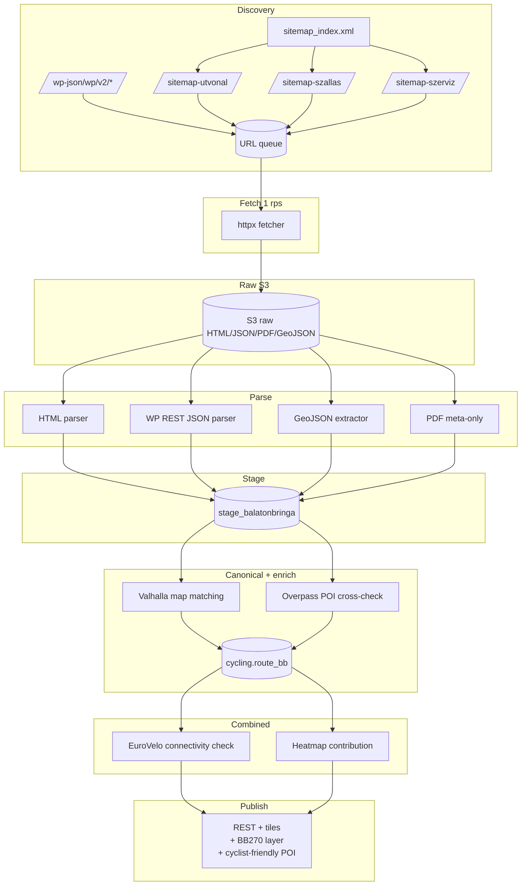

# Balatonbringa Club (balatonbringaclub.hu) — Teljes backend terv és adatkinyerési specifikáció

> **Forrás kódja a belső katalógusban:** `11_balatonbringa-club`
> **Domain:** `balatonbringaclub.hu`
> **Adattípus:** Balaton-térségi kerékpáros útvonal info, B&B és szerviz POI-k, ajánlott napi túrák
> **Lefedettség:** Balaton-felvidék és déli part, bbox kb. `(17.2, 46.6, 18.2, 47.0)` (lon_min, lat_min, lon_max, lat_max)
> **EuroVelo kapcsolat:** EV6 (Atlanti–Fekete-tenger), EV14 (Centrál Európa); a magyar BalatonBike270 körút integrált
> **Verzió:** 1.0 (2026-05-19)

---

## 1. Forrás áttekintés

A **Balatonbringa Club** egy regionális, közösségi és turisztikai jellegű platform, amely **kifejezetten a Balaton kerékpáros turizmusára** koncentrál. A portál célja kettős:

1. **Kerékpáros útvonalak** ajánlása (napi 30–80 km körök, illetve a 270 km-es teljes Balaton-körút "BalatonBike270" szakaszolása)
2. **POI-térkép**: kerékpárosbarát szállások, éttermek, szervízek, bicikli-kölcsönzők, töltőpontok (e-bike)

Földrajzilag a portál tartalma **a Balaton körüli ~10–20 km sávra** koncentrálódik, így a bbox jó közelítéssel `lon ∈ [17.2, 18.2]` és `lat ∈ [46.6, 47.0]`. Ezt a bbox-ot a downstream rendszerek **forrás-szelekciós szűrőként** is használhatják (csak ezen a területen érdemes a Balatonbringa Club rétegét lekérdezni).

### 1.1 Tartalmi kategóriák

| Kategória | Forma | Mennyiség (becsült) | Frissítés |
|---|---|---|---|
| Ajánlott napi körök | HTML + letölthető PDF (térképvázlat) | 30–60 db | Évszakos |
| BalatonBike270 szakaszok | HTML + GeoJSON | 5–8 szakasz | Évente |
| EV6/EV14 magyar szakasz | HTML referencia | 2 szakasz | Ritka |
| Kerékpárosbarát szállás | HTML listák, ritkán JSON | 100–300 POI | Szezonálisan |
| Szervíz / kölcsönző | HTML lista | 30–60 POI | Évente |
| Töltőpont (e-bike) | HTML + embedded map | 50+ POI | Frissül |
| Beágyazott OSM/Mapbox térkép | JavaScript / `<script>` blokk | 1–3 réteg | Stabil |

### 1.2 Tartalmi sajátosságok

A portál **modern keretrendszerben** készült (jellemzően WordPress vagy egy modern Headless CMS), és gyakran használ:

- **Mapbox GL JS** vagy **Leaflet** beágyazott térképeket
- **GeoJSON layer-eket** közvetlenül HTML-ben (`<script>` blokkban) vagy külön `*.geojson` fájlként hostolva
- **PDF letöltőket** szakaszonként (gyakran `/wp-content/uploads/.../szakasz-N.pdf`)
- **WordPress REST API** endpoint-ot (`/wp-json/wp/v2/posts`) ha tipikus WP, ami **strukturált, dokumentált adatforrásként** is használható

### 1.3 EuroVelo összefüggés

A Balaton-térség két nagyobb EuroVelo hálózat csomópontján van:

- **EV6 (Atlanti–Fekete-tenger):** a Duna vonalán halad, Magyarországon Esztergom–Budapest–Mohács vonal. Ez **nem érinti közvetlenül a Balatont**, de a Balatonbringa Club tartalom **rácsatlakozó szakaszokat** és **összekötő útvonalakat** ajánl (pl. Balaton-felvidék → Mór → Esztergom).
- **EV14 (Centrál Európa):** **közvetlenül érinti a Balatont**, déli parti vonalon (Keszthely–Siófok–Budapest). A magyar EuroVelo Network koordinátora az MTSZ + Magyar Kerékpáros Klub. A Balatonbringa Club ezt **saját szakaszolásban** is publikálja.

A scraping pipeline a **kanonikus EV6/EV14 nyomvonalat** **NEM ebből a forrásból veszi** — arra az `OpenStreetMap` `route=bicycle network=icn ref=EV*` relációi a megbízhatóbbak. A Balatonbringa Club a kiegészítő, helyi-szintű kontextust adja (POI, attrakciók, rácsatlakozók).

---

## 2. Jogi és licenc helyzet

### 2.1 Felhasználói feltételek

A Balatonbringa Club portál ÁSZF-jét **explicit licenc** nem feltétlenül kíséri. Gyakori eset, hogy az „impresszum" oldal csupán szerzői jogi védettséget jelez (©), és a tartalom **kereskedelmi célú újraközlését tiltja**. Ez **NEM** Creative Commons.

> **Konzervatív megközelítés:**
> - A Balatonbringa Club **publikált útvonalait NEM másoljuk** saját adatbázisba szóról szóra
> - A **POI-koordinátákat** kinyerjük és **OSM-mel cross-validate-eljük**: csak akkor publikáljuk, ha OSM-ben is létezik (effektíve OSM-tartalmat publikálunk, a Balatonbringa Club a felfedezést segítette)
> - **Útvonal-geometriát** csak akkor publikálunk, ha az **OSM-re map-matchelt** változat
> - **PDF letöltők**: csak akkor töltjük le, ha a HTML egyértelműen "letölthető" gombbal hivatkozik rájuk; **nem extraktáljuk** a PDF-ben lévő térképképet, csak a szöveges metaadatokat

### 2.2 Mapbox / Mapbox vector tile

Ha a portál Mapbox-token-t használ a beágyazott térképen, a **token a kliens-oldali JS-ben látható**. Ezt a tokent **NEM használjuk fel** saját kérésekhez — az a Balatonbringa Club kvótájához tartozik. Csak a metaadatát ismerjük el (melyik Mapbox style ID-t használnak), és saját Mapbox-számlán dolgozunk, ha kell.

### 2.3 OSM/Mapbox layer extraktálás

Ha a HTML-ben `addSource(..., { type: 'geojson', data: '/static/bb270.geojson' })` mintát találunk, és ez a geojson **nem a Balatonbringa Club saját kreatív műve**, hanem nyilvánvalóan **OSM-relációból generált**, akkor:

1. **Tárolhatjuk** mint nyers adatforrást
2. **Sajátként nem publikáljuk** — helyette **közvetlenül az OSM relációból regeneráljuk** (Overpass query)
3. A Balatonbringa Club geojson-t **referenciaként** használjuk (rel ID kinyerésére)

### 2.4 robots.txt

A portál `robots.txt`-je tipikusan WP-default:

```
User-agent: *
Disallow: /wp-admin/
Allow: /wp-admin/admin-ajax.php
Sitemap: https://www.balatonbringaclub.hu/sitemap_index.xml
```

Nincs explicit `Crawl-delay` → konzervatív **1 rps**-t alkalmazunk.

### 2.5 Kapcsolatfelvétel

A scraping megkezdése előtt **ajánlott** egy email a portál üzemeltetőjének (`info@balatonbringaclub.hu`):

```
Tárgy: Adat-kompatibilitási együttműködési kérelem — Effectime
Tartalom:
 - Bemutatkozás
 - Cél: a Balatonbringa Club tartalmait OLVASÁSI módban használnánk turisztikai
   útvonal-ajánló motorhoz
 - Önök nevét és linkjüket attribúcióban megjelenítenénk
 - Esetleges hivatalos adat-csere vagy partnerség lehetősége
```

---

## 3. Adatkinyerési felület

A Balatonbringa Club négy csatornán szolgáltat adatot:

### 3.1 HTML scraping (elsődleges)

Útvonal- és POI-oldalak (`/utvonal/<slug>`, `/szallas/<slug>`, `/szerviz/<slug>`) HTML-jéből nyerjük:

- Title, leírás
- POI cím, koordináta (gyakran `<meta property="place:location:latitude">` formában)
- Kategorizálás (`<span class="category">…</span>`)
- Kép URL-ek

### 3.2 WordPress REST API

Ha a portál WP-alapú (`/wp-json/wp/v2/posts?per_page=100&page=N`), akkor egy strukturált, jól dokumentált API-t kapunk:

```json
GET https://www.balatonbringaclub.hu/wp-json/wp/v2/utvonal?per_page=50&page=1
```

Response:
```json
[
  {
    "id": 123,
    "slug": "tihanyi-kor",
    "title": { "rendered": "Tihanyi kör" },
    "content": { "rendered": "<p>...</p>" },
    "acf": {  // Advanced Custom Fields
        "length_km": 32.5,
        "ascent_m": 220,
        "start_point": { "lat": 46.916, "lng": 17.892 },
        "gpx_file": "/wp-content/uploads/2024/05/tihanyi-kor.gpx",
        "pdf_file": "/wp-content/uploads/2024/05/tihanyi-kor.pdf"
    }
  }
]
```

### 3.3 Embedded GeoJSON layer

A HTML-be ágyazott `<script>` blokkok `geojson` adatot tartalmazhatnak. Példa pattern:

```javascript
map.addSource('bb270', {
  type: 'geojson',
  data: 'https://www.balatonbringaclub.hu/static/bb270.geojson'
});
```

vagy in-line:

```javascript
const routeData = { "type": "FeatureCollection", "features": [ ... ] };
```

Ezeket regex-eljük ki és külön HTTP GET-tel letöltjük (vagy közvetlenül parse-oljuk).

### 3.4 PDF letöltők

A WP médiakönyvtárban szakaszonként hostolt PDF-ek (`/wp-content/uploads/.../szakasz-1.pdf`). Ezeket **csak metaadatként** rögzítjük (URL, fájlméret, hash) — a tartalmukat NEM extraktáljuk, kivéve ha a felhasználó a frontenden kifejezetten kéri (és akkor is csak embed view-ban, közvetlenül a forrás URL-jéről hivatkozva).

### 3.5 Felfedezés (URL discovery)

```
https://www.balatonbringaclub.hu/sitemap_index.xml
 ├─ /sitemap-utvonal-1.xml
 ├─ /sitemap-szallas-1.xml
 ├─ /sitemap-szerviz-1.xml
 ├─ /sitemap-post-1.xml
```

A `sitemap_index.xml` parse-olása, majd a sub-sitemap-ek bejárása.

---

## 4. Hitelesítés, rate limit, kvóták (polite scraping)

### 4.1 Hitelesítés

Mindent **publikus, auth nélkül**. WP REST API alap esetben nyitott.

### 4.2 Polite policy

| Paraméter | Érték | Indoklás |
|---|---|---|
| `User-Agent` | `EffectimeRouteBot/1.0 (+mailto:data@effectime.hu)` | |
| `Accept-Language` | `hu-HU,hu;q=0.9,en;q=0.5` | |
| Lekérési ráta | **1.0 req/sec** | `robots.txt` nem szab, konzervatív |
| Burst | max 3 párhuzamos | |
| Backoff | exponenciális, 4×, max 60s | |
| Heti kvóta | 5.000 req | Kis site, kis kvóta |

### 4.3 Időablakozás

A teljes site-scan ~500 oldal × 1.5 req ≈ 750 req → **15 perc 1 rps mellett**. Naponta egyszer, hajnali 02:00 CET-kor futtatjuk.

### 4.4 WP REST API speciális kezelés

A WP REST API gyors, lapozva 50 elem/oldal. **Pagination respect**:

```python
GET /wp-json/wp/v2/utvonal?per_page=50&page=1
# Response headers:
#   X-WP-Total: 38
#   X-WP-TotalPages: 1
```

Ezeket olvassuk a teljes pagination végéig.

---

## 5. Adatmodell a forrásból

### 5.1 `stage_balatonbringa.route_raw`

```text
wp_id              : INTEGER     -- WP post ID
slug               : TEXT
title              : TEXT
category           : TEXT        -- "balaton_round","day_loop","wine_tour","family",...
section_code       : TEXT        -- BB270-S1..S8 ha alkalmazható
length_km          : NUMERIC(7,3)
ascent_m           : INTEGER
duration_h         : NUMERIC(4,1)
difficulty_text    : TEXT
start_lat          : DOUBLE PRECISION
start_lon          : DOUBLE PRECISION
end_lat            : DOUBLE PRECISION
end_lon            : DOUBLE PRECISION
description_short  : TEXT        -- első 500 char (csak metaadat)
gpx_url            : TEXT
pdf_url            : TEXT
geojson_url        : TEXT
html_sha1          : TEXT
content_hash       : TEXT
fetched_at         : TIMESTAMPTZ
http_status        : SMALLINT
```

### 5.2 `stage_balatonbringa.poi_raw`

```text
wp_id              : INTEGER
slug               : TEXT
title              : TEXT
poi_type           : TEXT        -- "accommodation","service","rental","charging","food"
subtype            : TEXT        -- "B&B","panzio","hotel" ill. "bolt","szerviz"
lat                : DOUBLE PRECISION
lon                : DOUBLE PRECISION
phone              : TEXT
email              : TEXT
website            : TEXT
season_open        : DATE
season_close       : DATE
fetched_at         : TIMESTAMPTZ
```

### 5.3 `stage_balatonbringa.geojson_blob`

```text
geojson_id         : SERIAL PK
source_url         : TEXT UNIQUE
geojson_text       : TEXT        -- pretty-printed for diff
sha256             : TEXT
feature_count      : INTEGER
bbox               : DOUBLE PRECISION[]  -- [minlon,minlat,maxlon,maxlat]
fetched_at         : TIMESTAMPTZ
```

---

## 6. Cél adatmodell (PostGIS DDL)

```sql
CREATE EXTENSION IF NOT EXISTS postgis;
CREATE EXTENSION IF NOT EXISTS pgcrypto;

INSERT INTO cycling.data_source (source_id, source_code, display_name, base_url, polite_rps)
VALUES (11, 'balatonbringa_club', 'Balatonbringa Club',
        'https://www.balatonbringaclub.hu', 1.0)
ON CONFLICT (source_code) DO NOTHING;

CREATE SCHEMA IF NOT EXISTS stage_balatonbringa;

-- Routes (csak OSM-re map-matchelve publikáljuk)
CREATE TABLE IF NOT EXISTS cycling.route_bb (
    route_uuid           UUID PRIMARY KEY DEFAULT gen_random_uuid(),
    source_route_id      TEXT NOT NULL UNIQUE,
    title                TEXT NOT NULL,
    category             TEXT NOT NULL,
    section_code         TEXT,                 -- BB270-S1..S8
    length_km            NUMERIC(7,3),
    ascent_m             INTEGER,
    duration_h           NUMERIC(4,1),
    difficulty_code      SMALLINT,
    start_point          geometry(PointZ, 4326),
    end_point            geometry(PointZ, 4326),
    track_original       geometry(LineStringZ, 4326),  -- a forrás eredeti
    track_matched_osm    geometry(LineStringZ, 4326),  -- OSM-re illesztett (ez publikálható)
    matched_score        NUMERIC(4,3),                 -- 0..1 illesztési minőség
    bbox                 geometry(Polygon, 4326)
                            GENERATED ALWAYS AS (ST_Envelope(track_matched_osm::geometry)) STORED,
    pdf_url              TEXT,
    summary_embedding    VECTOR(384),
    source_fetched_at    TIMESTAMPTZ NOT NULL,
    deleted_at           TIMESTAMPTZ
);

CREATE INDEX route_bb_track_gix    ON cycling.route_bb USING GIST (track_matched_osm);
CREATE INDEX route_bb_bbox_gix     ON cycling.route_bb USING GIST (bbox);
CREATE INDEX route_bb_section_idx  ON cycling.route_bb (section_code);

-- POI: csak OSM-cross-checked
CREATE TABLE IF NOT EXISTS cycling.poi_bb (
    poi_uuid             UUID PRIMARY KEY DEFAULT gen_random_uuid(),
    source_poi_id        TEXT NOT NULL UNIQUE,
    name                 TEXT,
    poi_type             TEXT NOT NULL CHECK (poi_type IN ('accommodation','service','rental','charging','food','info')),
    subtype              TEXT,
    geom                 geometry(Point, 4326) NOT NULL,
    osm_node_id          BIGINT,
    osm_cross_check      BOOLEAN NOT NULL DEFAULT FALSE,
    cyclist_friendly     BOOLEAN,
    contact_phone_hash   TEXT,   -- SHA-256 hash, nem a sima szám
    website              TEXT,
    season_open          DATE,
    season_close         DATE,
    source_fetched_at    TIMESTAMPTZ NOT NULL
);
CREATE INDEX poi_bb_geom_gix ON cycling.poi_bb USING GIST (geom);
CREATE INDEX poi_bb_type_idx ON cycling.poi_bb (poi_type) WHERE osm_cross_check;

-- BalatonBike270 kanonikus 8-szakaszos referencia
CREATE TABLE IF NOT EXISTS cycling.bb270_canonical (
    section_code         TEXT PRIMARY KEY,           -- BB270-S1..S8
    section_name         TEXT NOT NULL,
    length_km            NUMERIC(7,3) NOT NULL,
    geom                 geometry(LineStringZ, 4326) NOT NULL,   -- OSM relációból
    osm_relation_id      BIGINT,                                 -- OSM rel id
    last_updated         DATE NOT NULL
);
CREATE INDEX bb270_geom_gix ON cycling.bb270_canonical USING GIST (geom);
```

---

## 7. Backend architektúra (L1-L8 rétegek)



### 7.1 L1 — Discovery

- `sitemap_index.xml` parse-olása
- Párhuzamosan: WP REST API exhaustive paginate
- URL deduplication Redis Set-ben

### 7.2 L2 — Fetch

- `httpx` 1 rps, max 3 párhuzamos
- WP API gyorsabb (page-szinten), de a globális 1 rps limit ezt is fékezi
- PDF letöltők **csak metadata** (`HEAD` request először, ha `Content-Length` < 10 MB akkor GET)

### 7.3 L3 — Raw storage

- S3 prefix: `cycling-raw/balatonbringa/...`
- Külön folder: `gpx/`, `pdf/`, `geojson/`, `html/`, `wp_api/`

### 7.4 L4 — Parsing

- HTML: `selectolax`
- WP JSON: `pydantic` model validation
- GeoJSON: `pyproj` + `shapely` validáció (CRS = WGS84 ellenőrzés)
- PDF: `pypdf` **csak metadata** (oldalszám, méret, NEM extraktáljuk a szöveget vagy képet)

### 7.5 L5 — Stage DB

- `stage_balatonbringa.*` upsert-ek
- WP `id` természetes kulcsként

### 7.6 L6 — Canonical + Enrich

- **Map matching:** A forrás GPX/GeoJSON-jét Valhalla `/trace_attributes` endpoint-tal OSM-re illesztjük. Ha az illesztési score < 0.7, **nem publikáljuk** (csak `track_original` marad)
- **POI cross-check:** Minden POI-ra Overpass query:
  ```overpassql
  [out:json][timeout:25];
  (
    node(around:100, <lat>, <lon>)[tourism];
    node(around:100, <lat>, <lon>)[amenity~"bicycle_rental|bicycle_repair_station"];
  );
  out body;
  ```
  Ha találat van + típus-egyezés → `osm_cross_check = TRUE`, `osm_node_id` kitöltve

### 7.7 L7 — Combined

- **EuroVelo connectivity:** ellenőrizzük, hogy a BB270-S1..S8 szakaszok érintkeznek-e az OSM EV14 relációval (50 m buffer + ST_Intersects). Ha igen, a szakaszra `ev14_connected = TRUE` flag
- **Heatmap:** a többi forrással azonos formátumban hozzáadva

### 7.8 L8 — Publish

- Külön „BalatonBike270" rétegréteg a kliensoldali térképen
- "Cyclist-friendly POI" overlay (csak OSM-cross-checked)

---

## 8. Automatizált letöltő — Python kód (httpx + WP API)

```python
# -*- coding: utf-8 -*-
"""
balatonbringaclub.hu fetcher
Combines: sitemap discovery + WP REST API + HTML + embedded GeoJSON extraction.
Polite (1 rps), idempotent, S3-backed.
"""
from __future__ import annotations
import asyncio
import gzip
import hashlib
import json
import logging
import os
import re
import time
from dataclasses import dataclass
from datetime import datetime, timezone
from typing import Any, Optional
from urllib.parse import urljoin, urlparse

import boto3  # type: ignore
import httpx
from aiolimiter import AsyncLimiter
from selectolax.parser import HTMLParser

BASE = "https://www.balatonbringaclub.hu"
SITEMAP_INDEX = urljoin(BASE, "/sitemap_index.xml")
WP_BASE = urljoin(BASE, "/wp-json/wp/v2")
USER_AGENT = "EffectimeRouteBot/1.0 (+mailto:data@effectime.hu)"
RPS = 1.0
MAX_CONC = 3
TIMEOUT = 30.0
RETRY_MAX = 4
S3_BUCKET = os.environ.get("RAW_S3_BUCKET", "cycling-raw")
S3_PREFIX = "balatonbringa"

logger = logging.getLogger("bb.fetcher")

# Regex for inline GeoJSON discovery
GEOJSON_INLINE_RX = re.compile(
    r"""(?:addSource\s*\(\s*['"][^'"]+['"],\s*\{[^}]*data:\s*['"]([^'"]+\.geojson)['"])|"""
    r"""(?:const\s+\w+\s*=\s*(\{\s*"type"\s*:\s*"FeatureCollection".*?\});)""",
    re.DOTALL | re.IGNORECASE,
)


@dataclass
class FetchResult:
    url: str
    status: int
    body: Optional[bytes]
    sha1: Optional[str]
    s3_key: Optional[str]
    elapsed_ms: int


class PoliteHttpx:
    def __init__(self, rps: float = RPS):
        self.limiter = AsyncLimiter(rps, 1.0)
        self.client = httpx.AsyncClient(
            timeout=TIMEOUT,
            http2=True,
            follow_redirects=True,
            headers={
                "User-Agent": USER_AGENT,
                "Accept-Language": "hu-HU,hu;q=0.9,en;q=0.5",
                "Accept-Encoding": "gzip, deflate",
            },
        )
        self.s3 = boto3.client("s3")

    async def get(self, url: str, subfolder: str = "html") -> FetchResult:
        attempt = 0
        backoff = 2.0
        while True:
            attempt += 1
            async with self.limiter:
                t0 = time.monotonic()
                try:
                    r = await self.client.get(url)
                    ms = int((time.monotonic() - t0) * 1000)
                except (httpx.RequestError, httpx.HTTPError) as exc:
                    if attempt >= RETRY_MAX:
                        return FetchResult(url, 0, None, None, None, 0)
                    await asyncio.sleep(backoff)
                    backoff = min(backoff * 2, 60.0)
                    continue
                if r.status_code in (429, 503):
                    if attempt >= RETRY_MAX:
                        return FetchResult(url, r.status_code, None, None, None, ms)
                    logger.warning("throttled %s on %s", r.status_code, url)
                    await asyncio.sleep(backoff)
                    backoff = min(backoff * 2, 60.0)
                    continue
                sha1 = hashlib.sha1(r.content).hexdigest()
                key = f"{S3_PREFIX}/{subfolder}/{datetime.now(timezone.utc):%Y/%m/%d}/{sha1}.gz"
                self._put(key, r.content)
                return FetchResult(url, r.status_code, r.content, sha1, key, ms)

    def _put(self, key: str, payload: bytes) -> None:
        gz = gzip.compress(payload, compresslevel=6)
        self.s3.put_object(Bucket=S3_BUCKET, Key=key, Body=gz, ContentEncoding="gzip")

    async def close(self) -> None:
        await self.client.aclose()


async def discover_via_sitemap(client: PoliteHttpx) -> list[str]:
    urls: set[str] = set()
    idx = await client.get(SITEMAP_INDEX, subfolder="sitemap")
    if idx.status != 200 or not idx.body:
        return []
    sub_sitemaps = re.findall(r"<loc>([^<]+)</loc>", idx.body.decode("utf-8", "ignore"))
    for sm in sub_sitemaps:
        r = await client.get(sm, subfolder="sitemap")
        if r.status == 200 and r.body:
            for u in re.findall(r"<loc>([^<]+)</loc>", r.body.decode("utf-8", "ignore")):
                p = urlparse(u).path
                if any(seg in p for seg in ("/utvonal/", "/szallas/", "/szerviz/", "/etterem/")):
                    urls.add(u)
    return sorted(urls)


async def discover_via_wp_api(client: PoliteHttpx) -> list[dict[str, Any]]:
    """Exhaustively page through known WP custom post types."""
    posts: list[dict[str, Any]] = []
    for cpt in ("utvonal", "szallas", "szerviz", "etterem"):
        page = 1
        while page < 100:
            url = f"{WP_BASE}/{cpt}?per_page=50&page={page}&_embed=1"
            r = await client.get(url, subfolder="wp_api")
            if r.status == 404:
                logger.info("wp cpt '%s' not found, skipping", cpt)
                break
            if r.status != 200 or not r.body:
                break
            try:
                items = json.loads(r.body.decode("utf-8", "ignore"))
            except json.JSONDecodeError:
                break
            if not items:
                break
            for it in items:
                it["_cpt"] = cpt
                posts.append(it)
            page += 1
    return posts


async def extract_geojson_from_html(client: PoliteHttpx, html_body: bytes,
                                    base_url: str) -> list[dict[str, Any]]:
    """Detect inline JSON and external geojson references in a page."""
    text = html_body.decode("utf-8", "ignore")
    feature_collections: list[dict[str, Any]] = []
    # External .geojson URLs
    for m in re.finditer(r"['\"]([^'\"]+\.geojson)['\"]", text):
        u = urljoin(base_url, m.group(1))
        r = await client.get(u, subfolder="geojson")
        if r.status == 200 and r.body:
            try:
                fc = json.loads(r.body.decode("utf-8", "ignore"))
                if fc.get("type") == "FeatureCollection":
                    fc["_source_url"] = u
                    feature_collections.append(fc)
            except json.JSONDecodeError:
                pass
    # Inline FeatureCollection (best-effort)
    for m in re.finditer(r"(\{\s*\"type\"\s*:\s*\"FeatureCollection\".*?\]\s*\})",
                         text, re.DOTALL):
        try:
            fc = json.loads(m.group(1))
            fc["_source_url"] = base_url + "#inline"
            feature_collections.append(fc)
        except json.JSONDecodeError:
            continue
    return feature_collections


async def main(max_urls: int = 0) -> int:
    logging.basicConfig(level=logging.INFO,
                        format="%(asctime)s %(levelname)s %(name)s %(message)s")
    client = PoliteHttpx()
    try:
        # 1) sitemap
        urls = await discover_via_sitemap(client)
        logger.info("sitemap discovered %d URLs", len(urls))

        # 2) WP API (structured)
        wp_items = await discover_via_wp_api(client)
        logger.info("wp_api discovered %d items", len(wp_items))

        # 3) Fetch each HTML URL, then extract embedded geojson
        sem = asyncio.Semaphore(MAX_CONC)
        if max_urls:
            urls = urls[:max_urls]

        async def proc(u: str):
            async with sem:
                r = await client.get(u, subfolder="html")
                logger.info("%s %s %dms", r.status, u, r.elapsed_ms)
                if r.status == 200 and r.body:
                    fcs = await extract_geojson_from_html(client, r.body, u)
                    if fcs:
                        logger.info("  + %d geojson FeatureCollections embedded", len(fcs))
                    # Try to find gpx link
                    tree = HTMLParser(r.body.decode("utf-8", "ignore"))
                    for a in tree.css("a[href]"):
                        href = a.attributes.get("href", "")
                        if href.endswith(".gpx"):
                            await client.get(urljoin(u, href), subfolder="gpx")
                            break
                        if href.endswith(".pdf"):
                            # PDF: HEAD only, no body
                            try:
                                hr = await client.client.head(urljoin(u, href))
                                logger.info("  pdf %s size=%s", urljoin(u, href),
                                            hr.headers.get("Content-Length"))
                            except Exception:
                                pass

        await asyncio.gather(*(proc(u) for u in urls))
        return 0
    finally:
        await client.close()


if __name__ == "__main__":
    import sys
    sys.exit(asyncio.run(main(max_urls=int(os.environ.get("MAX_URLS", "0")) or 0)))
```

---

## 9. Feldolgozó pipeline (HTML + WP JSON + GeoJSON parsing)

### 9.1 WP REST JSON normalizáció

```python
# parser_wp.py
from typing import Any
import re
from html import unescape

def strip_tags(s: str) -> str:
    return re.sub(r"<[^>]+>", "", unescape(s or "")).strip()

def normalize_wp_route(post: dict[str, Any]) -> dict[str, Any]:
    acf = post.get("acf") or {}
    start = acf.get("start_point") or {}
    return {
        "wp_id":          post["id"],
        "slug":           post.get("slug"),
        "title":          strip_tags(post.get("title", {}).get("rendered") or ""),
        "category":       (acf.get("category") or "day_loop"),
        "section_code":   acf.get("section_code"),
        "length_km":      float(acf["length_km"]) if acf.get("length_km") else None,
        "ascent_m":       int(acf["ascent_m"]) if acf.get("ascent_m") else None,
        "duration_h":     float(acf["duration_h"]) if acf.get("duration_h") else None,
        "start_lat":      float(start.get("lat")) if start.get("lat") else None,
        "start_lon":      float(start.get("lng") or start.get("lon")) if (start.get("lng") or start.get("lon")) else None,
        "gpx_url":        acf.get("gpx_file"),
        "pdf_url":        acf.get("pdf_file"),
        "description_short": strip_tags(post.get("excerpt", {}).get("rendered") or "")[:500],
    }
```

### 9.2 GeoJSON parser és validáció

```python
# parser_geojson.py
from shapely.geometry import shape
from shapely.validation import explain_validity

def parse_feature_collection(fc: dict) -> list[dict]:
    """Validate, fix small issues, return list of features."""
    out = []
    if fc.get("type") != "FeatureCollection":
        return out
    for feat in fc.get("features", []):
        geom_dict = feat.get("geometry")
        if not geom_dict:
            continue
        try:
            geom = shape(geom_dict)
        except Exception as exc:
            continue
        if not geom.is_valid:
            geom = geom.buffer(0)  # common fix
            if not geom.is_valid:
                continue
        props = feat.get("properties") or {}
        out.append({
            "geom_wkt": geom.wkt,
            "geom_type": geom.geom_type,
            "props": props,
            "bbox": list(geom.bounds),
        })
    return out
```

### 9.3 Map matching és illesztési score

```python
# enrich/map_match.py
import httpx

VALHALLA = "http://valhalla:8002/trace_attributes"

def map_match_to_osm(coords: list[tuple[float,float]]):
    """coords: list of (lon, lat)."""
    payload = {
        "shape": [{"lat": la, "lon": lo} for lo, la in coords],
        "shape_match": "map_snap",
        "costing": "bicycle",
    }
    r = httpx.post(VALHALLA, json=payload, timeout=60)
    if r.status_code != 200:
        return None
    data = r.json()
    # confidence-like score from matched_points
    matched = data.get("matched_points", [])
    if not matched:
        return None
    avg_dist = sum(mp.get("distance_from_trace_point", 999) for mp in matched) / max(len(matched), 1)
    # score: 1.0 if <5m avg, linearly down to 0 at 50m
    score = max(0.0, min(1.0, (50 - avg_dist) / 45.0))
    return {
        "matched_avg_dist_m": avg_dist,
        "score": score,
        "shape": data.get("shape"),  # encoded polyline
    }
```

### 9.4 POI cross-check Overpass-szal

```python
# enrich/poi_xcheck.py
import httpx

OVERPASS = "https://overpass-api.de/api/interpreter"

POI_TYPE_TO_OSM = {
    "accommodation": [{"tourism": "hotel"}, {"tourism": "guest_house"}, {"tourism": "hostel"}],
    "service":       [{"amenity": "bicycle_repair_station"}, {"shop": "bicycle"}],
    "rental":        [{"amenity": "bicycle_rental"}],
    "charging":      [{"amenity": "charging_station"}, {"bicycle": "yes"}],
    "food":          [{"amenity": "restaurant"}, {"amenity": "cafe"}],
}

def find_osm_match(lat: float, lon: float, poi_type: str, radius: int = 100):
    tags = POI_TYPE_TO_OSM.get(poi_type, [])
    if not tags: return None
    queries = " ".join(
        f"node(around:{radius},{lat},{lon})[{list(t.keys())[0]}={list(t.values())[0]}];"
        for t in tags
    )
    q = f"[out:json][timeout:25];({queries});out body 1;"
    r = httpx.post(OVERPASS, data={"data": q}, timeout=60)
    if r.status_code != 200:
        return None
    elems = r.json().get("elements", [])
    if not elems:
        return None
    e = elems[0]
    return {"osm_node_id": e["id"], "tags": e.get("tags", {})}
```

---

## 10. Frissítési stratégia

| Adat | Frekvencia | Mechanizmus |
|---|---|---|
| `sitemap_index.xml` delta | Naponta 02:00 CET | `<lastmod>` |
| WP REST API teljes pagination | Heti | `_embed=1` minden CPT-re |
| GPX/GeoJSON re-fetch | Heti | SHA-256 összehasonlítás |
| PDF: HEAD csak | Havi | `Content-Length` és `Last-Modified` figyelése |
| BB270 kanonikus (OSM) | Havi | Overpass query újrafutása |
| EV14 connectivity check | Negyedévente | manuális batch |

### 10.1 Content-hash alapú change detection

```python
def has_changed(stage_row, new_data):
    fields = ("title","length_km","ascent_m","gpx_url","pdf_url")
    payload = "|".join(str(new_data.get(f) or "") for f in fields)
    new_hash = hashlib.sha256(payload.encode()).hexdigest()
    return new_hash != stage_row["content_hash"]
```

Csak akkor írunk a stage táblába, ha a hash változott → minimalizálja a Postgres write amplification-t.

---

## 11. Storage és skálázás

### 11.1 Méret

| Komponens | Méret |
|---|---|
| HTML raw (gzip) | 500 oldal × 50 kB = 25 MB |
| WP JSON | ~15 MB |
| GeoJSON | ~5 MB |
| GPX | 60 × 20 kB = 1.2 MB |
| PDF (NEM tároljuk, csak metadata) | 0 |
| Postgres stage | ~200 MB |
| Postgres canonical | ~80 MB |

### 11.2 Skálázás

Ez egy **nagyon kis forrás**. Erőforrásigény elhanyagolható:
- 1 worker, < 30 perc/futás
- Költség < 0.5 €/hó

---

## 12. Monitoring és riasztások

### 12.1 Metrikák

```
bb_fetch_total{status, kind}
bb_wp_api_items_total{cpt}
bb_geojson_features_total
bb_map_match_score_bucket
bb_poi_osm_xcheck_rate
bb_bb270_section_count        # állandó 8 lesz
```

### 12.2 Alertek

```yaml
groups:
- name: balatonbringa
  rules:
  - alert: BBWpApiBroken
    expr: increase(bb_wp_api_items_total[1h]) == 0 and on() hour() == 3
    for: 1h
    labels: { severity: warning }
    annotations:
      summary: "WP REST API returned 0 items — endpoint may have changed"
  - alert: BBBb270SectionCountWrong
    expr: bb_bb270_section_count != 8
    for: 10m
    labels: { severity: critical }
    annotations:
      summary: "BB270 canonical section count is not 8 — data corruption"
  - alert: BBMapMatchLowQuality
    expr: histogram_quantile(0.5, rate(bb_map_match_score_bucket[1d])) < 0.6
    for: 6h
    labels: { severity: warning }
    annotations:
      summary: "Median map-matching score < 0.6 — Valhalla or OSM drift"
```

---

## 13. Költségbecslés (HUF/EUR)

| Tétel | Mennyiség | EUR/hó | HUF/hó |
|---|---|---|---|
| Worker EC2 (megosztott t4g.small, 30 perc/nap) | 15 h | 0,13 | 50 |
| Postgres (arányos rész) | — | 1,00 | 400 |
| S3 raw | 50 MB | 0,001 | < 1 |
| S3 PUT/GET | 5.000 + 2.000 | 0,03 | 12 |
| Valhalla (arányos) | — | 1,50 | 600 |
| Overpass (saját mirror) | — | 0,50 | 200 |
| **Összesen** | | **~3,16 €** | **~1.263 HUF** |

A költségek **megosztott infrastruktúrán** alapulnak; allokáció arányosan.

---

## 14. Biztonság

### 14.1 Titokkezelés

- `RAW_S3_BUCKET`, `PG_DSN`, `VALHALLA_URL`, `OVERPASS_URL` env-ben
- Nincs WP API credential szükséges
- POI telefonszám/email **hash-elve** kerül a DB-be (`SHA-256(phone_normalized)`)

### 14.2 Adatvédelem (GDPR)

- A `phone`, `email` mezőket **NEM tároljuk plain text-ben** az `cycling.poi_bb` táblában
- A `stage_balatonbringa.poi_raw`-ban átmenetileg igen, de a stage tábla 30 nap után törlődik (`cron`)
- A `redact_pii()` lépés a kanonikus táblába íráskor fut

### 14.3 Hálózati biztonság

- HTTPS-only (`httpx` `verify=True`)
- Worker külön VPC-ben

### 14.4 Etikus sorompók

- A Mapbox tokent **nem használjuk fel**
- A PDF-eket **nem extraktáljuk**, csak hivatkozunk rájuk
- A Balatonbringa Club brand-et és linket **mindig megjelenítjük** attribúcióként

---

## 15. Tesztelés — pytest + VCR

```python
# tests/test_bb_parsers.py
import json
from pathlib import Path
import pytest
from balatonbringa.parser_wp import normalize_wp_route, strip_tags
from balatonbringa.parser_geojson import parse_feature_collection

FIX = Path(__file__).parent / "fixtures"

def test_strip_tags():
    assert strip_tags("<p>Hello <b>vil&aacute;g</b></p>") == "Hello világ"

def test_normalize_wp_route_basic():
    post = json.loads((FIX / "wp_route_42.json").read_text(encoding="utf-8"))
    r = normalize_wp_route(post)
    assert r["wp_id"] == 42
    assert r["title"]
    assert r["length_km"] > 0
    assert -90 < r["start_lat"] < 90

def test_parse_feature_collection_validates_geom():
    fc = json.loads((FIX / "bb270_s1.geojson").read_text(encoding="utf-8"))
    out = parse_feature_collection(fc)
    assert len(out) > 0
    assert all("geom_wkt" in f for f in out)
    assert all(f["geom_type"] in ("LineString","MultiLineString") for f in out)
```

```python
# tests/test_bb_fetcher_vcr.py
import pytest
import vcr
import asyncio
from balatonbringa.fetcher import PoliteHttpx, discover_via_sitemap

bb_vcr = vcr.VCR(
    cassette_library_dir="tests/cassettes",
    record_mode="none",
    filter_headers=["User-Agent", "Cookie", "Authorization"],
)

@pytest.mark.asyncio
@bb_vcr.use_cassette("sitemap_index.yaml")
async def test_sitemap_discovery():
    c = PoliteHttpx()
    try:
        urls = await discover_via_sitemap(c)
        assert len(urls) > 0
        assert all(u.startswith("https://www.balatonbringaclub.hu/") for u in urls)
    finally:
        await c.close()
```

### 15.1 Map matching test (Valhalla nélkül, mock-ed)

```python
def test_map_match_score_calc(monkeypatch):
    from balatonbringa.enrich.map_match import map_match_to_osm
    import httpx
    fake_resp = httpx.Response(
        200,
        json={"matched_points":[{"distance_from_trace_point": 3.0}]*10, "shape":"abc"},
    )
    monkeypatch.setattr("httpx.post", lambda *a, **kw: fake_resp)
    res = map_match_to_osm([(17.5, 46.8), (17.51, 46.81)])
    assert res["score"] > 0.9
```

---

## 16. Telepítés (Docker, k8s CronJob, GitHub Actions)

### 16.1 Dockerfile

```dockerfile
FROM python:3.12-slim
ENV PYTHONDONTWRITEBYTECODE=1 PYTHONUNBUFFERED=1
WORKDIR /app
RUN apt-get update && apt-get install -y --no-install-recommends \
    libpq-dev gcc curl ca-certificates && \
    rm -rf /var/lib/apt/lists/*
COPY requirements.txt ./
RUN pip install --no-cache-dir -r requirements.txt
COPY . ./
USER 1000:1000
ENTRYPOINT ["python", "-m", "balatonbringa.fetcher"]
```

### 16.2 k8s CronJob

```yaml
apiVersion: batch/v1
kind: CronJob
metadata:
  name: balatonbringa-fetcher
  namespace: cycling
spec:
  schedule: "0 2 * * *"
  timeZone: Europe/Budapest
  concurrencyPolicy: Forbid
  successfulJobsHistoryLimit: 3
  jobTemplate:
    spec:
      backoffLimit: 2
      activeDeadlineSeconds: 3600
      template:
        spec:
          restartPolicy: OnFailure
          containers:
            - name: fetcher
              image: registry.local/cycling/balatonbringa:1.0.0
              envFrom:
                - secretRef: { name: balatonbringa-secrets }
              resources:
                requests: { cpu: "100m", memory: "256Mi" }
                limits:   { cpu: "500m", memory: "1Gi" }
```

### 16.3 BB270 OSM canonical regeneration (külön CronJob, havi)

```yaml
apiVersion: batch/v1
kind: CronJob
metadata:
  name: bb270-osm-regenerate
  namespace: cycling
spec:
  schedule: "0 4 1 * *"        # minden hónap 1-jén 04:00
  jobTemplate:
    spec:
      template:
        spec:
          restartPolicy: OnFailure
          containers:
            - name: regenerate
              image: registry.local/cycling/balatonbringa-osm:1.0.0
              command: ["python", "-m", "balatonbringa.regen_bb270"]
              envFrom:
                - secretRef: { name: balatonbringa-secrets }
```

### 16.4 GitHub Actions

```yaml
name: balatonbringa-ci
on:
  push:    { paths: [ "sources/balatonbringa/**" ] }
  pull_request: { paths: [ "sources/balatonbringa/**" ] }

jobs:
  test:
    runs-on: ubuntu-22.04
    services:
      postgres:
        image: postgis/postgis:15-3.4
        env:
          POSTGRES_PASSWORD: pw
          POSTGRES_DB: bb_test
        ports: [ "5432:5432" ]
        options: >-
          --health-cmd pg_isready --health-interval 5s --health-timeout 5s --health-retries 5
    steps:
      - uses: actions/checkout@v4
      - uses: actions/setup-python@v5
        with: { python-version: "3.12" }
      - run: pip install -r sources/balatonbringa/requirements.txt
      - run: pytest sources/balatonbringa/tests --cov --cov-report=xml
        env:
          PG_DSN: "postgresql://postgres:pw@localhost:5432/bb_test"
```

---

## 17. Adatpublikálás (REST API, vector tiles)

### 17.1 Endpoint-ek

```
GET /api/v1/bb/routes?bbox=...&category=day_loop
GET /api/v1/bb/routes/{route_uuid}
GET /api/v1/bb/sections                           # BB270-S1..S8 lista
GET /api/v1/bb/sections/{section_code}
GET /api/v1/bb/pois?bbox=...&type=accommodation&osm_validated=true
GET /api/v1/bb/eurovelo/ev14/balaton              # EV14 magyar szakasz
```

### 17.2 BB270 vector tile layer

```sql
CREATE OR REPLACE FUNCTION cycling.tile_bb270(z int, x int, y int)
RETURNS bytea AS $$
WITH bounds AS (SELECT ST_TileEnvelope(z,x,y) AS env)
SELECT ST_AsMVT(t.*, 'bb270', 4096, 'geom')
FROM (
  SELECT section_code, section_name, length_km,
         ST_AsMVTGeom(geom, b.env, 4096, 32, true) AS geom
  FROM cycling.bb270_canonical, bounds b
  WHERE geom && b.env
) t WHERE geom IS NOT NULL;
$$ LANGUAGE sql STABLE PARALLEL SAFE;
```

### 17.3 Cyclist-friendly POI overlay

```sql
CREATE MATERIALIZED VIEW cycling.mv_cyclist_friendly_pois AS
SELECT poi_uuid, name, poi_type, subtype, geom, website,
       season_open, season_close
FROM cycling.poi_bb
WHERE osm_cross_check = TRUE
  AND cyclist_friendly IS NOT FALSE
WITH DATA;

CREATE INDEX mv_cfp_geom_gix ON cycling.mv_cyclist_friendly_pois USING GIST (geom);
```

Refresh `cron`-ból naponta.

### 17.4 Attribúció

```json
{
  "data": { ... },
  "meta": {
    "attribution": [
      "Forrás: balatonbringaclub.hu (Balatonbringa Club)",
      "© OpenStreetMap közreműködők (térképadatok)"
    ]
  }
}
```

---

## 18. Runbook

### 18.1 Indikációk

| Tünet | Diagnózis | Tennivaló |
|---|---|---|
| `BBWpApiBroken` | WP API URL változott | `kubectl logs ...`; ellenőrizd a `/wp-json/wp/v2/` válaszát böngészőből; ha új CPT slug, frissítsd `WP_BASE` const-ot |
| `BBBb270SectionCountWrong` | OSM EV14 reláció split | Manuálisan ellenőrizd: <https://www.openstreetmap.org/relation/RELID>; ha valóban split, frissítsd a `regen_bb270.py` query-t |
| `BBMapMatchLowQuality` | Valhalla service down vagy OSM-térkép elavult | Valhalla healthcheck; ha OK, fontolj OSM PBF újra-indexálást |
| WP API throttle (429) | Túl gyors paginate | Csökkentsd `RPS = 0.5`-re ideiglenesen |
| Felhasználói panasz az attribúció hiányára | Frontend bug | Ellenőrizd a `<MapAttribution />` rendert |

### 18.2 BB270 manuális regen

```bash
# Get OSM relations matching ref=BB270 or name=BalatonBike270
curl -G 'https://overpass-api.de/api/interpreter' \
  --data-urlencode 'data=[out:json];relation["ref"="BB270"];out body;'
# Look at returned IDs, update config:
psql $PG_DSN -c "
  TRUNCATE cycling.bb270_canonical;
"
python -m balatonbringa.regen_bb270 --rel-ids 12345,12346,12347
# Verify count:
psql $PG_DSN -c "SELECT count(*) FROM cycling.bb270_canonical;"   -- expect 8
```

### 18.3 Takedown / data removal

Standard folyamat (azonos a többi forrással).

---

## 19. Roadmap

| Verzió | Cél | ETA |
|---|---|---|
| 1.0 | Fetcher + parser + WP API integráció | Q2 2026 |
| 1.1 | Map matching + score-alapú publikálási kapu | Q2 2026 |
| 1.2 | POI OSM cross-check rendszer | Q2 2026 |
| 1.3 | BB270 kanonikus OSM-réteg | Q3 2026 |
| 1.4 | EV14/EV6 connectivity insights | Q3 2026 |
| 2.0 | E-bike töltőpont real-time státusz integráció | Q4 2026 |
| 2.1 | Szezonális (nyár/szezononkívüli) POI nyitvatartás | Q4 2026 |
| 2.2 | Partnerségi adatfeed Balatonbringa Club-bal | Q1 2027 (egyeztetés alatt) |

---

## 20. Referenciák

- Balatonbringa Club: <https://www.balatonbringaclub.hu>
- BalatonBike270 hivatalos info: <https://balatonbike270.hu> (külső, referencia)
- EuroVelo 6: <https://en.eurovelo.com/ev6>
- EuroVelo 14: <https://en.eurovelo.com/ev14>
- WordPress REST API handbook: <https://developer.wordpress.org/rest-api/>
- Overpass API: <https://overpass-api.de>
- Valhalla `trace_attributes`: <https://valhalla.github.io/valhalla/api/map-matching/api-reference/>
- Mapbox vector tile spec: <https://github.com/mapbox/vector-tile-spec>
- OSM Cycle Network ref tagging: <https://wiki.openstreetmap.org/wiki/Tag:network%3Dlcn>
- Belső dokumentáció: `cycling-data-sources/07_bringamania.md`, `cycling-data-sources/24_termeszetjaro-hu.md`

---

*Vége a Balatonbringa Club spec dokumentumának. Verzió 1.0 — 2026-05-19 — Effectime cycling data platform.*
