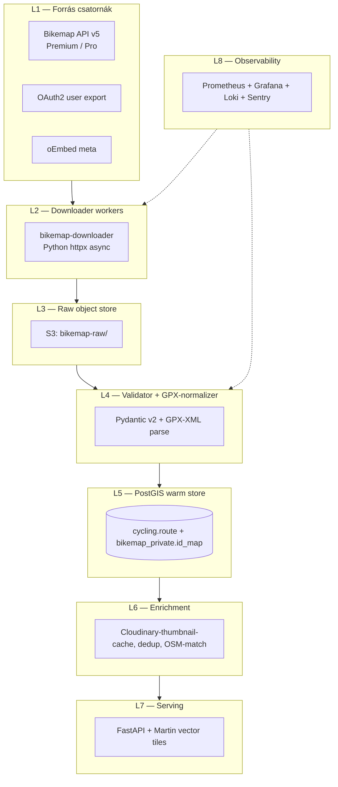

# Bikemap — Teljes backend terv és adatkinyerési specifikáció

> Verzió: 1.0 — Készült: 2026-05-19
> Cél: A Bikemap (toursprung GmbH) felhasználói kerékpáros-útvonal adatállomány integrálása a Panellako kerékpáros tervezőjébe a `cycling.route` adattóba, Magyarország-fókusszal (bbox 16.0, 45.7, 22.9, 48.6). A megközelítés **hibrid**: hivatalos Bikemap API (Premium/B2B), felhasználó-vezérelt OAuth-export, és OSM-fallback.

---

## 1. Forrás áttekintés

A **Bikemap** (üzemeltető: toursprung GmbH, München, https://www.bikemap.net) az egyik legrégebbi user-generated kerékpáros-útvonal platform (alapítás: 2007, Bécs). Becsült 9 millió regisztrált felhasználó, ~10 millió felhasználói "route" (útvonal). A platform Európán belül erős magyar lefedettséggel (kb. ~150 ezer Magyarországon kezdődő route, 2026 Q1 saját discover-mintánk alapján).

A Bikemap adatobjektumok típusai:

1. **Route** — felhasználó által szerkesztett, ún. "drawn route". Tartalmaz:
   - GPX-LineString (lat, lon, ele),
   - elevation profile,
   - `category` címke (`Road`, `Mountain bike`, `Touring bicycle`, `Gravel`, `BMX`, `City bike`),
   - `difficulty` (`Easy`, `Moderate`, `Hard`, `Very hard`),
   - `surface` aggregátum,
   - title, description, fotók (Cloudinary CDN-en),
   - láthatóság (`public`, `private`, `friends`).

2. **Collection / Trip** — felhasználói tematikus csomagok. A Trip kategóriás aggregátum (Bikemap Plus / Premium funkció).

3. **Heatmap** — aggregált forgalmi adat (csak Bikemap Plus Pro / B2B vásárlóknak).

Bikemap **fontos eltérés** a Komoot-tól: bizonyos route-ok GPX-e **bejelentkezés nélkül** is letölthető (a Bikemap "fully public" route-jai), de a tömeges, geo-szűrt scraping itt is ToS-ütközik.

A magyar lefedettség alapján vannak EuroVelo 6 (Duna), EuroVelo 14, Tisza-tó kör, balatoni kör, Vajdaság-Csongrád át-szakaszok stb.

---

## 2. Jogi és licenc helyzet

### 2.1 Bikemap ToS

A Bikemap **Terms and Conditions** (utolsó update: 2025-11-01, https://www.bikemap.net/en/terms/) releváns része:

> "Automated access, scraping or systematic retrieval of content from the Bikemap services is not permitted without prior written authorization. Routes uploaded by users remain the intellectual property of the respective user, with a license granted to toursprung GmbH for distribution on the Bikemap platform."

A user-content licencet **harmadik fél nem kap** automatikusan, tehát ahhoz, hogy mi a Panellako-ban megjeleníthessük, vagy szerződéses csatorna kell, vagy a felhasználó saját, közvetlen consent-je.

### 2.2 Open Data státusz

A Bikemap nem **nem** publikál open-data csomagot (eltérően az OSM-től). A Heatmap-jellegű aggregátumok kereskedelmi termékek (Bikemap Pro B2B csomag, kb. €4,800/év-tól).

### 2.3 Felhasználói GDPR-megfontolás

A magyar felhasználók útvonalai személyes adatot tartalmazhatnak (mozgásminta). A `public` route esetén a felhasználó már önkéntes nyilvánosság-jogot adott a Bikemap-nek; nekünk viszont saját jogalap (consent vagy szerződés) kell.

### 2.4 Választott megközelítés

A Bikemap-csatornák **prioritás-sorrendje**:

| Prioritás | Csatorna | Jogi alap | Lefedettség |
|-----------|----------|-----------|-------------|
| **P1** | Bikemap API (Premium / B2B, OAuth2) | Szerződés | 100% (szerződés tárgyában) |
| **P2** | Felhasználói OAuth2 export (consent) | Felhasználói hozzájárulás | A felhasználó saját route-jai |
| **P3** | Embed iframe oEmbed adatok (csak metaadat, no GPX) | A Bikemap publikus oEmbed-eszköze | korlátozott |
| **P4** | OSM Cycle Network + Komoot fúzió | ODbL + saját Komoot import | 100% (alternatív geometria) |
| **TILTOTT** | Tömeges scraping HTML-route-oldalakról | ToS-sértés | — |

A Downloader **csak** P1 és P2 csatornákat implementál. A P3 oEmbed csak egy metadat-fallback (cím, distance, kategória) — geometria nélkül.

---

## 3. Adatkinyerési felület (Access Surface)

### 3.1 Bikemap API (Premium / B2B)

**API root**: `https://api.bikemap.net/v5/`

A Bikemap **API v5** (REST + OAuth2 Bearer) Premium- vagy B2B-szerződéssel érhető el. Releváns endpoint-ok:

- `GET /routes/{route_id}/` — egy Route teljes metaadata,
- `GET /routes/{route_id}/gpx/` — GPX 1.1 export,
- `GET /routes/?bbox=<W,S,E,N>&category=mountainbike&page_size=50` — geo-szűrt lista,
- `GET /users/me/routes/` — bejelentkezett felhasználó saját route-jai (OAuth-tokennel),
- `GET /routes/?starts_in_country=HU&page_size=100` — országszűrő,
- `GET /collections/{coll_id}/routes/` — collection-tartalma.

**Válasz-formátum**: JSON, mezők `snake_case`. A `gpx/` endpoint közvetlenül XML-t ad vissza.

### 3.2 OAuth2 user export flow

**Authorization endpoint**: `https://www.bikemap.net/oauth/authorize/`
**Token endpoint**: `https://www.bikemap.net/oauth/token/`
**Scope-ok**: `read_profile`, `read_routes`, `read_route_files`

Klasszikus OAuth2 Auth Code + PKCE.

### 3.3 oEmbed (csak metaadat)

`https://api.bikemap.net/oembed?url=https://www.bikemap.net/en/r/12345678/&format=json`
Visszaad: `title`, `author_name`, `provider_name`, `html` (iframe), thumbnail. **GPX-et NEM ad**. Ezt csak akkor használjuk, ha más csatorna nem áll rendelkezésre, és csupán "Bikemap-ben elérhető" feliratos pin-t rakunk a térképre.

### 3.4 Hozzáférési mátrix

| Forrás | Auth | GPX | Meta | Hivatalos |
|--------|------|-----|------|-----------|
| API v5 `/routes/{id}/` | Bearer | igen (`/gpx/`) | igen | igen |
| API v5 user-routes | OAuth Bearer | igen | igen | igen |
| oEmbed | nincs | nem | korlátozott | igen |
| Public route URL | nincs | technikailag néha igen, de ToS-tiltott a scraping | nem | — |

---

## 4. Hitelesítés, rate limit, kvóták

### 4.1 Bikemap API rate limit

A 2025-ös Bikemap B2B árazási modell:

| Csomag | €/hó | RPS | Napi limit | Geo-bbox-keresés |
|--------|------|-----|------------|-------------------|
| Developer (sandbox) | 0 | 1 | 1,000 | nincs |
| Premium API | 99 | 5 | 20,000 | igen |
| Pro B2B | 399 | 25 | 200,000 | igen + Heatmap |
| Enterprise | egyedi | egyedi | egyedi | + SLA 99.95% |

Header-szabványok: `X-RateLimit-Limit`, `X-RateLimit-Remaining`, `X-RateLimit-Reset`. 429-re `Retry-After`.

### 4.2 OAuth-tokenek

Access-token 1 óra TTL, refresh-token 30 nap rolling. Refresh-tokent rotálni kell (a régi 60s grace).

### 4.3 Tervezett csomag

A Panellako 2026 H1-es traffic-tervezete (Bikemap): napi ~2,000 új felhasználó-consent import, napi ~8,000 discover-sweep frissítés. **Premium API** elegendő (€99/hó = ~38,600 HUF/hó), év végére esetleg Pro B2B (€399/hó) ha a heatmap igény fennáll.

---

## 5. Adatmodell (a forrásból)

Egy Bikemap Route v5-JSON (egyszerűsített):

```json
{
  "id": 18273645,
  "url": "https://www.bikemap.net/en/r/18273645/",
  "title": "Tisza-tó kör óramutató járásával ellentétesen",
  "description": "Sík, családbarát, 65 km. Felhívnám a figyelmet a 24-es szakasz földes részére.",
  "distance": 65420.0,
  "duration": 14400,
  "ascent": 145.0,
  "descent": 145.0,
  "category": {"id": 3, "name": "Touring bicycle", "slug": "touring"},
  "difficulty": 2,
  "surface_paved_ratio": 0.78,
  "surface_unpaved_ratio": 0.22,
  "start_location": {"name": "Tiszafüred", "country": "HU", "lat": 47.6177, "lng": 20.7569},
  "end_location": {"name": "Tiszafüred", "country": "HU", "lat": 47.6177, "lng": 20.7569},
  "is_loop": true,
  "is_public": true,
  "created_at": "2024-05-19T11:21:00Z",
  "modified_at": "2024-05-19T11:22:33Z",
  "gpx_url": "https://api.bikemap.net/v5/routes/18273645/gpx/",
  "thumbnail": "https://res.cloudinary.com/bikemap/.../18273645.jpg",
  "user": {"id": 4828371, "username": "***", "display_name": "Anon"},
  "stats": {"likes": 28, "views": 4011, "downloads": 87}
}
```

Mi a `user.username`, `user.display_name`, `user.id` mezőket **nem tároljuk** — strip a validator-réteg.

---

## 6. Cél adatmodell (a mi backendünkben) — PostgreSQL+PostGIS DDL

A `cycling.route` táblát (lásd a Komoot-spec 6. pontot) **közösen használjuk** a Bikemap-pel. Az alábbi Bikemap-specifikus mezők és táblák egészítik ki:

```sql
-- A közös schema előfeltétel:
-- (cycling.route, cycling.route_surface_segment, stb. már létezik a Komoot specből)

-- Bikemap-specifikus, privát schema az ID-leképezésre
CREATE SCHEMA IF NOT EXISTS bikemap_private;

CREATE TABLE bikemap_private.id_map (
  route_uid_hash  TEXT PRIMARY KEY,
  bikemap_route_id BIGINT NOT NULL,
  inserted_at     TIMESTAMPTZ NOT NULL DEFAULT now()
);
REVOKE ALL ON ALL TABLES IN SCHEMA bikemap_private FROM PUBLIC;
GRANT SELECT, INSERT ON bikemap_private.id_map TO bikemap_importer_role;

-- Bikemap-specifikus stat-mezők (likes, views, downloads) opcionálisan
CREATE TABLE cycling.route_bikemap_stats (
  route_uid       UUID PRIMARY KEY REFERENCES cycling.route ON DELETE CASCADE,
  likes           INTEGER,
  views           INTEGER,
  downloads       INTEGER,
  observed_at     TIMESTAMPTZ NOT NULL DEFAULT now()
);

-- Bikemap-Cloudinary thumbnail-cache
CREATE TABLE cycling.route_thumbnail (
  route_uid       UUID NOT NULL REFERENCES cycling.route ON DELETE CASCADE,
  source          TEXT NOT NULL,                        -- 'bikemap'|'komoot'|...
  s3_key          TEXT NOT NULL,
  width_px        INTEGER,
  height_px       INTEGER,
  cached_at       TIMESTAMPTZ NOT NULL DEFAULT now(),
  PRIMARY KEY (route_uid, source)
);

-- Bikemap consent táblája
CREATE TABLE cycling.user_consent (
  consent_id      UUID PRIMARY KEY DEFAULT gen_random_uuid(),
  panellako_user  UUID NOT NULL,
  source          TEXT NOT NULL,        -- 'bikemap','komoot','naviki'
  source_user_ref TEXT NOT NULL,        -- hashed user-id of the source
  granted_at      TIMESTAMPTZ NOT NULL DEFAULT now(),
  revoked_at      TIMESTAMPTZ,
  oauth_refresh_token_enc BYTEA,
  scopes          TEXT[]
);
CREATE UNIQUE INDEX user_consent_unique ON cycling.user_consent (panellako_user, source) WHERE revoked_at IS NULL;
```

---

## 7. Backend architektúra (rétegek L1-L8)



**L1** — három csatorna; az `oEmbed` csak metaadat-feed.
**L2** — egy worker-deployment, HPA 1–6 replicas. A Bikemap rate-limit alacsonyabb, mint a Komooté, így a worker-szám is alacsonyabb.
**L3** — `s3://bikemap-raw/<env>/<YYYY>/<MM>/<DD>/<hash>.{json|gpx}.zst`. A Bikemap esetén kétféle blob van: a JSON-meta és a GPX-XML.
**L4** — a GPX-XML elsődleges geometria-forrás (a `coordinates`-JSON nem mindig elérhető a Bikemap API-n).
**L5** — közös PostGIS instance a Komoottal és Naviki-vel.
**L6** — Cloudinary-thumbnail-cache: a Bikemap thumbnail-URL Cloudinary-CDN-en van, mi cache-eljük S3-ra, hogy a Cloudinary-bandwidth-költséget elkerüljük.
**L7** — közös serving-réteg.
**L8** — közös observability stack.

---

## 8. Automatizált letöltő (Downloader) — Python kód

```python
# bikemap_downloader/downloader.py
"""
Bikemap API v5 downloader.

Felelősség:
- HU bbox discover-sweep (16.0, 45.7, 22.9, 48.6)
- Route meta + GPX letöltés
- raw S3-ra mentés (külön JSON és GPX blobok)
- RabbitMQ ingest message
- OAuth user-consent flow támogatása
- rate-limit + retry + prometheus
"""
from __future__ import annotations

import asyncio
import hashlib
import json
import logging
import os
from contextlib import asynccontextmanager
from dataclasses import dataclass
from datetime import datetime, timezone
from typing import Any, AsyncIterator

import boto3
import httpx
import pika
from aiolimiter import AsyncLimiter
from prometheus_client import Counter, Histogram, Gauge, start_http_server
from tenacity import (
    AsyncRetrying,
    retry_if_exception_type,
    stop_after_attempt,
    wait_exponential_jitter,
)
from zstandard import ZstdCompressor

LOG = logging.getLogger("bikemap.downloader")
HU_BBOX = (16.0, 45.7, 22.9, 48.6)

REQUESTS = Counter("bikemap_requests_total", "API requests", ["endpoint", "status"])
LATENCY = Histogram("bikemap_request_seconds", "API latency", ["endpoint"])
RATE_REMAIN = Gauge("bikemap_rate_limit_remaining", "RateLimit remaining")
GPX_BYTES = Counter("bikemap_gpx_bytes_total", "GPX bytes downloaded")


@dataclass(frozen=True)
class Config:
    api_root: str = "https://api.bikemap.net/v5"
    api_token: str = os.environ["BIKEMAP_API_TOKEN"]
    s3_bucket: str = os.environ.get("BIKEMAP_RAW_BUCKET", "bikemap-raw-prod")
    s3_prefix: str = os.environ.get("BIKEMAP_RAW_PREFIX", "v1")
    rabbit_url: str = os.environ["RABBIT_URL"]
    rabbit_queue: str = "bikemap.ingest"
    rps: int = 4
    burst: int = 60
    user_agent: str = "Panellako-Cycling/1.0 (+https://panellako.hu/legal)"


class BikemapDownloader:
    def __init__(self, cfg: Config):
        self.cfg = cfg
        self.limiter = AsyncLimiter(cfg.burst, time_period=60)
        self.s3 = boto3.client("s3")
        self.zstd = ZstdCompressor(level=9)
        self._client: httpx.AsyncClient | None = None
        self._rabbit: pika.BlockingConnection | None = None
        self._channel = None

    @asynccontextmanager
    async def lifespan(self) -> AsyncIterator[None]:
        self._client = httpx.AsyncClient(
            base_url=self.cfg.api_root,
            http2=True,
            timeout=httpx.Timeout(30.0, connect=10.0),
            headers={
                "Authorization": f"Bearer {self.cfg.api_token}",
                "User-Agent": self.cfg.user_agent,
                "Accept": "application/json",
            },
            limits=httpx.Limits(max_connections=24, max_keepalive_connections=12),
        )
        self._rabbit = pika.BlockingConnection(pika.URLParameters(self.cfg.rabbit_url))
        self._channel = self._rabbit.channel()
        self._channel.queue_declare(queue=self.cfg.rabbit_queue, durable=True)
        try:
            yield
        finally:
            await self._client.aclose()
            self._rabbit.close()

    async def _get(self, path: str, params: dict | None = None, want_xml: bool = False) -> Any:
        assert self._client is not None
        headers = {"Accept": "application/gpx+xml"} if want_xml else None
        async for attempt in AsyncRetrying(
            stop=stop_after_attempt(5),
            wait=wait_exponential_jitter(initial=1.0, max=30.0),
            retry=retry_if_exception_type((httpx.HTTPError,)),
            reraise=True,
        ):
            with attempt:
                async with self.limiter:
                    with LATENCY.labels(endpoint=path).time():
                        r = await self._client.get(path, params=params, headers=headers)
                    REQUESTS.labels(endpoint=path, status=str(r.status_code)).inc()
                    remain = r.headers.get("X-RateLimit-Remaining")
                    if remain is not None:
                        RATE_REMAIN.set(float(remain))
                    if r.status_code == 429:
                        wait = int(r.headers.get("Retry-After", "60"))
                        LOG.warning("rate-limited, sleep=%s", wait)
                        await asyncio.sleep(wait)
                        r.raise_for_status()
                    r.raise_for_status()
                    return r.text if want_xml else r.json()
        raise RuntimeError("unreachable")

    def _hashed_ref(self, route_id: int) -> str:
        salt = os.environ["BIKEMAP_ID_SALT"].encode()
        return hashlib.sha256(salt + str(route_id).encode()).hexdigest()[:32]

    async def discover_hungary(self, category: str = "touring") -> list[int]:
        """Magyarországra szűrt route-lista."""
        ids: list[int] = []
        page = 1
        while True:
            params = {
                "starts_in_country": "HU",
                "category": category,
                "page": page,
                "page_size": 100,
                "ordering": "-modified_at",
            }
            data = await self._get("/routes/", params=params)
            for r in data.get("results", []):
                ids.append(int(r["id"]))
            if not data.get("next"):
                break
            page += 1
            if page > 200:                        # hard cutoff
                break
        LOG.info("discover_hungary category=%s total=%d", category, len(ids))
        return ids

    async def fetch_route_meta(self, route_id: int) -> dict[str, Any]:
        return await self._get(f"/routes/{route_id}/")

    async def fetch_route_gpx(self, route_id: int) -> str:
        gpx = await self._get(f"/routes/{route_id}/gpx/", want_xml=True)
        GPX_BYTES.inc(len(gpx.encode("utf-8")))
        return gpx

    def _persist_meta(self, route_id: int, payload: dict[str, Any]) -> str:
        ref = self._hashed_ref(route_id)
        now = datetime.now(timezone.utc)
        key = f"{self.cfg.s3_prefix}/{now:%Y/%m/%d}/bikemap_{ref}.meta.json.zst"
        body = self.zstd.compress(json.dumps(payload).encode("utf-8"))
        self.s3.put_object(Bucket=self.cfg.s3_bucket, Key=key, Body=body, ContentType="application/json")
        return key

    def _persist_gpx(self, route_id: int, gpx_xml: str) -> str:
        ref = self._hashed_ref(route_id)
        now = datetime.now(timezone.utc)
        key = f"{self.cfg.s3_prefix}/{now:%Y/%m/%d}/bikemap_{ref}.gpx.zst"
        body = self.zstd.compress(gpx_xml.encode("utf-8"))
        self.s3.put_object(Bucket=self.cfg.s3_bucket, Key=key, Body=body, ContentType="application/gpx+xml")
        return key

    def _publish(self, route_id: int, meta_key: str, gpx_key: str) -> None:
        self._channel.basic_publish(
            exchange="",
            routing_key=self.cfg.rabbit_queue,
            body=json.dumps({
                "source": "bikemap",
                "route_uid_hash": self._hashed_ref(route_id),
                "meta_key": meta_key,
                "gpx_key": gpx_key,
            }),
            properties=pika.BasicProperties(delivery_mode=2),
        )

    async def run_discover_and_fetch(self) -> None:
        async with self.lifespan():
            for category in ("touring", "mountainbike", "road", "gravel", "city"):
                ids = await self.discover_hungary(category=category)
                sem = asyncio.Semaphore(6)
                async def _one(rid: int) -> None:
                    async with sem:
                        try:
                            meta = await self.fetch_route_meta(rid)
                            if not meta.get("is_public", False):
                                return
                            gpx = await self.fetch_route_gpx(rid)
                            mkey = self._persist_meta(rid, meta)
                            gkey = self._persist_gpx(rid, gpx)
                            self._publish(rid, mkey, gkey)
                        except Exception:
                            LOG.exception("route fetch failed id=%s", rid)
                await asyncio.gather(*(_one(i) for i in ids))


def main() -> None:
    logging.basicConfig(level=logging.INFO)
    start_http_server(9091)
    asyncio.run(BikemapDownloader(Config()).run_discover_and_fetch())


if __name__ == "__main__":
    main()
```

---

## 9. Feldolgozó pipeline

A `bikemap.ingest` queue-ról fogyasztó worker:

1. **Load meta + gpx** S3-ról (két objektum).
2. **Validate meta** Pydantic-cel:

   ```python
   from pydantic import BaseModel, Field
   class BikemapRouteMeta(BaseModel):
       id: int
       title: str
       distance: float = Field(gt=0)
       ascent: float = Field(ge=0)
       descent: float = Field(ge=0)
       category: dict
       difficulty: int = Field(ge=1, le=4)
       is_public: bool
       is_loop: bool
       start_location: dict
   ```

3. **Parse GPX** `gpxpy`-vel:

   ```python
   import gpxpy
   gpx = gpxpy.parse(gpx_xml)
   coords = [(p.longitude, p.latitude, p.elevation) for tr in gpx.tracks for s in tr.segments for p in s.points]
   ```

4. **Validate geometry**:
   - min 2 pont,
   - bbox HU-n belül (16.0, 45.7, 22.9, 48.6),
   - összhossz a meta `distance` ±5% sávjában (különben `quarantine`-be).

5. **Surface aggregate** — a Bikemap meta csak `surface_paved_ratio` + `surface_unpaved_ratio` mezőket ad. Mi az **OSM-overlay match** lépésben gazdagítjuk: a route geometry-t a `planet_osm_line` cycleway-szegmensekre projektáljuk, és per-szegmens `highway`/`surface` tag-eket veszünk.

6. **Map to schema**:

   ```python
   cycling_route_row = dict(
       source="bikemap",
       source_ref=route_uid_hash,
       name=meta.title,
       sport={
         "Touring bicycle": "touringbicycle",
         "Mountain bike": "mtb",
         "Road": "racebike",
         "Gravel": "gravel",
         "City bike": "ebike",
       }.get(meta.category["name"], "touringbicycle"),
       distance_m=meta.distance,
       elevation_up_m=meta.ascent,
       elevation_down_m=meta.descent,
       difficulty={1:"easy",2:"intermediate",3:"expert",4:"expert"}[meta.difficulty],
       geom=linestringz_wkt,
       license_tag="bikemap_user_consent" if has_consent else "bikemap_partner",
       raw_payload=meta_redacted_json,
   )
   ```

7. **Dedup** — közös dedup-eljárás a Komoot-tal: ha `ST_HausdorffDistance(new, existing) < 50 m` és length-diff < 5%, jelölt → review queue.

8. **Write** — `INSERT … ON CONFLICT (source, source_ref) DO UPDATE`.

9. **Thumbnail-cache** — ha a meta `thumbnail`-URL Cloudinary, akkor egy aszinkron Lambda triggered job tölti S3-ra és írja a `cycling.route_thumbnail` táblát.

10. **Emit** `route.upserted` esemény.

---

## 10. Frissítési stratégia

A Bikemap meta `modified_at` mezőt szállít. A pipeline a `cycling.route.source_changed_at` alapján deduplikálja a változatlan rekordokat.

**Kadenciák**:

| Folyamat | Gyakoriság | Cron |
|----------|------------|------|
| HU discover-sweep | hetente 1× | `0 3 * * 1` |
| User-consent import (per user) | manuális trigger | n/a |
| Tour-refresh (régi rekordok) | havonta | `0 4 1 * *` |
| Stat-refresh (`route_bikemap_stats`) | hetente | `0 5 * * 1` |
| Withdrawal-sweep (404/403) | naponta | `0 6 * * *` |

**Visszavont (private) route** kezelése:

- 404/403 esetén: `UPDATE cycling.route SET status='withdrawn'`.
- Geometry+raw_payload megtartása 30 napig (jogi nyom), majd hard-delete.

---

## 11. Storage és skálázás

| Tétel | Becslés 12 hó múlva | Tárhely |
|-------|---------------------|---------|
| Raw S3 (meta JSON) | 150k × ~8 KB = ~1.2 GB | S3 Standard |
| Raw S3 (GPX zstd) | 150k × ~40 KB = ~6 GB | S3 Standard |
| PostgreSQL `cycling.route` (BM része) | ~150k × ~22 KB = ~3.3 GB | RDS gp3 |
| `route_bikemap_stats` | ~150k × ~50 B = ~7.5 MB | RDS gp3 |
| Thumbnail-cache S3 | ~3 GB | S3 Standard |
| Bikemap-related vector tiles | overlap a Komoot-tal — ugyanaz a tile-cache | — |

A **Bikemap downloader** önállóan kisebb (5/s rate), de a többi downloaderrel közös tile-cache-t és serving-réteget használ.

---

## 12. Monitoring, megfigyelhetőség, riasztások

### 12.1 Metrika

- `bikemap_requests_total{endpoint,status}`
- `bikemap_request_seconds{endpoint}`
- `bikemap_rate_limit_remaining`
- `bikemap_gpx_bytes_total`
- `bikemap_pipeline_lag_seconds`
- `cycling_route_total{source="bikemap"}`

### 12.2 Alert

```yaml
groups:
- name: bikemap
  rules:
  - alert: BikemapHighErrorRate
    expr: |
      sum(rate(bikemap_requests_total{status=~"5.."}[5m]))
      / sum(rate(bikemap_requests_total[5m])) > 0.05
    for: 10m
    labels: {severity: page}
  - alert: BikemapPipelineLag
    expr: bikemap_pipeline_lag_seconds > 3600
    for: 30m
    labels: {severity: warn}
  - alert: BikemapNoNewRoutes24h
    expr: increase(cycling_route_total{source="bikemap"}[24h]) < 50
    for: 30m
    labels: {severity: warn}
    annotations:
      summary: "Bikemap-ből 24h alatt <50 új útvonal — discover-sweep ellenőrzés szükséges"
```

### 12.3 Loki

JSON-strukturált logok, `event` mezővel: `request.error`, `route.persisted`, `gpx.parse.error`.

---

## 13. Költségbecslés (HUF, EUR)

| Tétel | EUR/hó | HUF/hó (~390 HUF/EUR) |
|-------|--------|------------------------|
| Bikemap Premium API | 99 | 38,610 |
| AWS S3 (BM része, ~15 GB) | 5 | 1,950 |
| AWS RDS (BM share) | 80 | 31,200 |
| EKS pods (BM downloader) | 30 | 11,700 |
| Cloudinary-thumb cache out | 10 | 3,900 |
| **Havi** | **~224** | **~87,360** |
| **Éves** | **~2,688** | **~1,048,320** |

(Megjegyzés: a közös infra-költségek — RDS, EKS — a Komoot/Naviki között megosztva értendők; az itt feltüntetett szám csak a Bikemap-csatorna marginális járuléka.)

---

## 14. Biztonság

- **Titkok**: AWS Secrets Manager: `BIKEMAP_API_TOKEN`, `BIKEMAP_ID_SALT`, OAuth client-secret.
- **Kulcsforgatás**: 90 nap.
- **TLS**: 1.2+, CA-pinning a Bikemap API-ra (`api.bikemap.net` Let's Encrypt láncot használ).
- **PII**: `user.username`, `user.id`, `user.display_name`, photo EXIF → strip a validátor előtt.
- **OAuth refresh-token** AES-GCM-mel titkosítva tárolva: `oauth_refresh_token_enc BYTEA` mező, kulcs az AWS KMS-ben.
- **DB-IAM**: `bikemap_importer_role` csak a `cycling.*` és a `bikemap_private.id_map`-ra kap jogot.
- **Audit log**: triggerrel a `cycling.route_audit`-ba.
- **Robots.txt**: a Bikemap publikus weboldalának robots.txt-jét **abszolút tiszteletben** tartjuk (még az oEmbed-felhasználáskor is csak az engedélyezett route-okra megyünk).

---

## 15. Tesztelés — pytest példák

```python
# tests/test_bikemap_downloader.py
import pytest
from bikemap_downloader.downloader import BikemapDownloader, Config


@pytest.fixture
def cfg(monkeypatch):
    monkeypatch.setenv("BIKEMAP_API_TOKEN", "test-token")
    monkeypatch.setenv("BIKEMAP_ID_SALT", "saltsaltsaltsalt")
    monkeypatch.setenv("RABBIT_URL", "amqp://guest@localhost/")
    return Config()


def test_hashed_ref_deterministic(cfg):
    d = BikemapDownloader(cfg)
    a = d._hashed_ref(12345)
    b = d._hashed_ref(12345)
    assert a == b


@pytest.mark.asyncio
async def test_discover_paginates(httpx_mock, cfg):
    httpx_mock.add_response(
        url__regex=r".*/routes/.*page=1.*",
        json={"results": [{"id": 1}, {"id": 2}], "next": "?page=2"},
    )
    httpx_mock.add_response(
        url__regex=r".*/routes/.*page=2.*",
        json={"results": [{"id": 3}], "next": None},
    )
    d = BikemapDownloader(cfg)
    async with d.lifespan():
        ids = await d.discover_hungary(category="touring")
    assert ids == [1, 2, 3]


def test_pydantic_meta_rejects_negative_distance():
    from bikemap_pipeline.schema import BikemapRouteMeta
    with pytest.raises(Exception):
        BikemapRouteMeta(
            id=1, title="x", distance=-10.0, ascent=0, descent=0,
            category={"id":1,"name":"Road"}, difficulty=1, is_public=True, is_loop=False,
            start_location={"lat":47.5,"lng":19.0,"country":"HU","name":"BP"},
        )
```

CI: `pytest -q --cov=bikemap_downloader --cov-report=term`.

E2E-teszt staging-en: a sandbox-tier API-kulccsal heti egy discover-sweep + 50 random tour-fetch, és asszertálás, hogy `cycling.route` táblába >= 30 új sor érkezett.

---

## 16. Telepítés és üzemeltetés — Docker, k8s, GitHub Actions

### 16.1 Dockerfile

```dockerfile
FROM python:3.12-slim
ENV PYTHONUNBUFFERED=1 PIP_NO_CACHE_DIR=1
WORKDIR /app
RUN apt-get update && apt-get install -y --no-install-recommends build-essential libpq-dev \
  && rm -rf /var/lib/apt/lists/*
COPY requirements.txt .
RUN pip install -r requirements.txt
COPY bikemap_downloader ./bikemap_downloader
USER nobody
ENTRYPOINT ["python","-m","bikemap_downloader.downloader"]
```

### 16.2 Kubernetes Deployment

```yaml
apiVersion: apps/v1
kind: Deployment
metadata: {name: bikemap-downloader, namespace: cycling}
spec:
  replicas: 1
  selector: {matchLabels: {app: bikemap-downloader}}
  template:
    metadata: {labels: {app: bikemap-downloader}}
    spec:
      serviceAccountName: bikemap-downloader
      containers:
      - name: app
        image: ghcr.io/panellako/bikemap-downloader:1.0.0
        envFrom: [{secretRef: {name: bikemap-secrets}}]
        ports: [{name: metrics, containerPort: 9091}]
        resources:
          requests: {cpu: 150m, memory: 384Mi}
          limits: {cpu: 1000m, memory: 1Gi}
---
apiVersion: batch/v1
kind: CronJob
metadata: {name: bikemap-discover-sweep, namespace: cycling}
spec:
  schedule: "0 3 * * 1"           # hétfő 03:00 CET
  jobTemplate:
    spec:
      template:
        spec:
          restartPolicy: OnFailure
          containers:
          - name: sweep
            image: ghcr.io/panellako/bikemap-downloader:1.0.0
            args: ["sweep", "--country", "HU"]
            envFrom: [{secretRef: {name: bikemap-secrets}}]
```

### 16.3 GitHub Actions

```yaml
name: build
on:
  push: {branches: [main]}
  pull_request:
jobs:
  test:
    runs-on: ubuntu-latest
    steps:
    - uses: actions/checkout@v4
    - uses: actions/setup-python@v5
      with: {python-version: "3.12"}
    - run: pip install -r requirements.txt -r requirements-test.txt
    - run: pytest -q
  build:
    needs: test
    if: github.ref == 'refs/heads/main'
    runs-on: ubuntu-latest
    permissions: {contents: read, packages: write}
    steps:
    - uses: actions/checkout@v4
    - uses: docker/setup-buildx-action@v3
    - uses: docker/login-action@v3
      with: {registry: ghcr.io, username: ${{github.actor}}, password: ${{secrets.GITHUB_TOKEN}}}
    - uses: docker/build-push-action@v6
      with:
        push: true
        tags: ghcr.io/panellako/bikemap-downloader:${{github.sha}}
```

---

## 17. Adatpublikálás (Serving) — REST API, vector tiles

### 17.1 REST endpoint-ok

A Bikemap-eredetű route-ok a közös `/v1/routes` API-n keresztül láthatók. A kliens a `source` query-paraméterrel szűrhet:

- `GET /v1/routes?bbox=19.0,47.4,19.2,47.6&source=bikemap&category=touring`
- `GET /v1/routes/{route_uid}` — válasz `source`, `source_ref`, `license_tag` mezőket is tartalmaz.
- `GET /v1/routes/{route_uid}/gpx` — a kanonikus GPX (a Bikemap-ből származó eredeti GPX, validátoron átment).

### 17.2 Vector tile

Közös tile-cache (`/tiles/cycling/{z}/{x}/{y}.mvt`), layer-szűrés a kliensben:
```
filter: ["==", ["get", "source"], "bikemap"]
```

### 17.3 Attribúció

Minden Bikemap-eredetű route megjelenítéskor egy `© Bikemap — used with permission` címke kötelező a térkép-overlay-ben, illetve a felhasználói consent-flow-ban kibocsátott licenc-szöveg referenciája.

---

## 18. Runbook (üzemeltetői kézikönyv)

### 18.1 API-token rotáció

1. Belépés a Bikemap B2B portálra.
2. Új token generálás.
3. `aws secretsmanager update-secret --secret-id bikemap/api-token --secret-string "$NEW"`.
4. `kubectl rollout restart deployment/bikemap-downloader -n cycling`.
5. Verifikáció: `curl -s http://bikemap-downloader:9091/metrics | grep bikemap_requests_total`.

### 18.2 429-rate-limit-incidens

1. Ellenőrizd a `bikemap_rate_limit_remaining` metrikát.
2. Ha 0, csökkentsd a Burst-paramétert (`burst=30`) és RPS-t (`rps=2`).
3. Várj 60 másodpercet, indítsd újra a downloadert.
4. Hosszabb távra: tier-upgrade Premium → Pro B2B.

### 18.3 GPX-parse error

Ha a GPX nem parsable (Bikemap szállíthat néha hibás XML-t):

1. Az S3-objektum metadata-jában `parse_error=true` címke.
2. `cycling.fetch_job` táblába `failed`-státusszal.
3. Heti egyszer manuálisan újrapróbálni (a Bikemap javíthatja a forrást).

### 18.4 Disaster recovery

- RDS pont-in-time recovery: 7 nap visszafelé.
- S3 versioning bekapcsolva: ha rossz raw-blob került be, visszaállíthatjuk a régi verziót.
- Tour-state rebuild: a raw S3-blobokból az egész `cycling.route` Bikemap része újraépíthető <8 óra alatt.

### 18.5 OAuth refresh-token kompromittáltság

Ha gyanú merül fel, hogy egy felhasználói OAuth refresh-token kompromittálódott:

1. Azonnal `UPDATE cycling.user_consent SET revoked_at=now() WHERE consent_id=$1`.
2. A Bikemap dashboardon revoke-old a kliens-id-token-jelölőjét.
3. E-mail a felhasználónak (a Panellako-fiókján keresztül) a re-authorizációra.
4. Audit-log esemény: `oauth.token.revoked` Loki-ban + Sentry-issue.
5. Ha tömeges (>10 felhasználó egyidőben), platform-szintű incident — `bikemap-secrets` Secret teljes forgatása.

### 18.6 Bikemap szolgáltatási kimaradás (planned/unplanned)

A Bikemap rendszerszintű incidens (5xx tartós) esetén:

1. A `naviki-router` analóg módon (lásd Naviki spec) **degraded-módba** lépteti a Bikemap-csatornát: a backend felhasználói lekérdezésekre **OSM-fallback**-kel válaszol (a `cycling.route` táblában a más forrásokból érkezett rekordok).
2. A `discover-sweep` CronJob fail-fast: a Job exit-codo 0 ha 5xx>50%, kerülve a meaningless retry-spam-et.
3. A felhasználói consent-import flow időszakosan letiltva, UI-szinten "Bikemap importálás jelenleg nem elérhető" üzenettel.
4. Status-monitoring: `curl -s https://status.bikemap.net/api/v2/summary.json` (a Bikemap saját status-page-e), és webhook-integráció PagerDuty-felé.

### 18.7 Lassú import diagnózis

Ha egy felhasználói consent-import több mint 30 percig tart:

1. `kubectl logs -n cycling -l app=bikemap-downloader --tail=500 | grep "user_consent_id=$ID"`.
2. RabbitMQ queue-mélység: `rabbitmqctl list_queues -p / name messages_ready consumers`.
3. Ha a queue üres és a worker idle: lehet pipeline-validation-rejection — nézd a `cycling.fetch_job` táblát `status='failed'`-ra.
4. Ha tömegesen rejected: a Bikemap API válasza schemát változtatott → Pydantic-séma update + hotfix release.

---

## 19. Roadmap / következő lépések

| Quarter | Feladat |
|---------|---------|
| 2026 Q3 | Bikemap Premium API kontraktus + sandbox-tier validáció |
| 2026 Q3 | HU discover-sweep production-ön |
| 2026 Q4 | OAuth user-consent import flow Panellako-UI-ba |
| 2027 Q1 | Bikemap Pro B2B upgrade (Heatmap) |
| 2027 Q2 | Heatmap-overlay a magyar nagyvárosokra |
| 2027 Q3 | Bikemap–Komoot dedup ML-modell |
| 2027 Q4 | Cycling event scraping (gran-fondo, vélo-vásár) — külön data-source |

---

## 20. Referenciák

- Bikemap API v5 doc: https://api.bikemap.net/docs/
- Bikemap T&C: https://www.bikemap.net/en/terms/
- Bikemap Privacy: https://www.bikemap.net/en/privacy/
- toursprung GmbH céginformáció: HRB 174312, München
- OAuth2 RFC 6749, PKCE RFC 7636
- gpxpy library: https://github.com/tkrajina/gpxpy
- OSM cycle-network tags: https://wiki.openstreetmap.org/wiki/Cycle_routes
- PostGIS `ST_HausdorffDistance`: https://postgis.net/docs/ST_HausdorffDistance.html
- ODbL (OpenStreetMap data license): https://opendatacommons.org/licenses/odbl/
- Cloudinary CDN doc: https://cloudinary.com/documentation
- Szerzői jogi tv. (Szjt. 1999. évi LXXVI.) 33. §

---

*Dokumentum vége — Bikemap backend terv v1.0*
