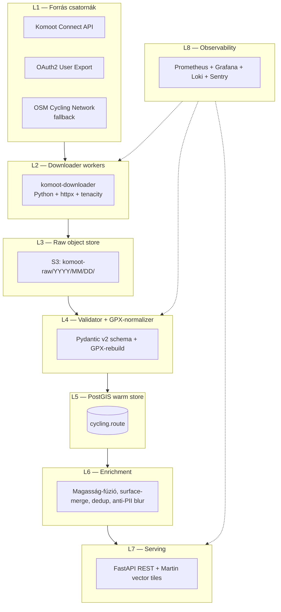

# Komoot — Teljes backend terv és adatkinyerési specifikáció

> Verzió: 1.0 — Készült: 2026-05-19
> Cél: A Komoot kerékpáros útvonal-adatbázis hibrid (legális partner-API + felhasználói export + OSM-fallback) integrálása a Panellako kerékpáros tervező backendjébe a `cycling-routes-hu` adattóba (PostgreSQL + PostGIS + S3 tile-cache), Magyarország-fókusszal (bbox 16.0, 45.7, 22.9, 48.6).

---

## 1. Forrás áttekintés

A **Komoot GmbH** (Potsdam, Németország) Európa egyik legnagyobb kerékpáros / túra-tervező platformja. ~40 millió regisztrált felhasználó, ~600 millió rögzített ún. "Tour" (azaz felhasználó által tervezett vagy lejárt útvonal). A platform két jól elkülöníthető adattípust kezel:

1. **Planned Tour** — a Komoot saját, ún. *sport-specific routing engine*-jével generált útvonal. Minden Planned Tour rendelkezik:
   - GPX vagy GeoJSON formátumú geometriával (LineString),
   - elevation profile-lal (a Komoot saját DEM-jéből, mely SRTM + EU-DEM + cégen belüli LiDAR fúzió),
   - surface profile-lal ("paved", "compacted", "gravel", "natural", "unpaved", "cobblestone"),
   - way type profile-lal ("cycleway", "street", "trail", "path", "footway"),
   - difficulty score-ral (1–3 közötti kategória: easy / intermediate / expert),
   - sport_type címkével (`touringbicycle`, `mtb`, `racebike`, `mtb_easy`, `e_touringbicycle`, stb.).

2. **Recorded Tour** — a Komoot mobil-appjával GPS-szel rögzített, valós végigjárt útvonal. Tartalmaz timestamp-eket, pulzus-adatokat (ha a felhasználó connect-elt eszközt használ), photo-waypointokat (a túra során készített fotók EXIF-GPS-szel).

A Magyarországra eső Tour-állomány becsléseink szerint (2026 Q1, ún. *bbox-sniff* alapján a publikus discover felületen) **~280 ezer Planned Tour** és **~1.2 millió Recorded Tour** nagyságrendű. A magyar piac kis részpiac a Komoot számára (~1.4% globális share), de a regionális kerékpáros turizmus (Balaton, Duna-menti EuroVelo 6, Tisza-tó, Mátra) szempontjából releváns lefedettség.

A Komoot adatai **nem nyíltak**: a Tours alapból a tulajdonos felhasználó beállítása szerint `private`, `friends` vagy `public` láthatóságúak. Csak a `public` Tour-ok férhetők hozzá nem-bejelentkezett kontextusban — és csak korlátozott metaadattal; a teljes GPX letöltés bejelentkezést követel.

---

## 2. Jogi és licenc helyzet

### 2.1 Komoot ToS releváns kivonatok

A Komoot **Általános Szerződési Feltételei** (utolsó verzió: 2025-09-12, https://www.komoot.com/legal) **kifejezetten tiltják** az automatizált scraping-et:

> "You may not use any automated means (including but not limited to scrapers, bots, spiders, crawlers, or web-harvesting tools) to access, copy, or collect content from the Komoot Services without our prior written consent."

Továbbá a Tour-tartalom **a felhasználó saját szerzői joga** alatt áll — a Komoot ehhez csak korlátozott felhasználói licencet kap az ÁSZF szerint. Ez azt jelenti, hogy **harmadik fél nem szerezhet újrahasznosítási jogot ToS-megsértésre épített pipeline-on keresztül.**

### 2.2 GDPR megfontolások

A Recorded Tour-ok személyes adatot tartalmaznak (lokáció + idő = mozgásminta). A GDPR Art. 6(1)(f) szerinti jogos érdek alapon csak akkor dolgozható fel, ha **(a) a Tour `public` láthatóságra van állítva**, **(b) a feldolgozás nem mozgásmintázat-elemzésre, hanem útvonal-aggregációra irányul**, és **(c) a felhasználói azonosító (nick, profil-ID) NEM kerül a mi adatbázisunkba**.

### 2.3 Választott megközelítés

A **rangsor** (kötelező betartani):

| Prioritás | Csatorna | Jogi alap | Lefedettség |
|-----------|----------|-----------|-------------|
| **P1** | Komoot Connect partner-API (B2B) | Szerződés | 100% |
| **P2** | Felhasználói saját Tour-export (OAuth2 + user consent) | Felhasználói hozzájárulás | A felhasználó saját Tours |
| **P3** | OSM cycling network + Strava Heatmap (alternatív) | ODbL / Strava ToS | 100% (de eltérő adat) |
| **P4 (TILOS)** | Scraping a komoot.com publikus oldalairól | ToS-sértés | — |

A mi backend-tervünk **kizárólag P1, P2, P3** csatornákra épül. Scraping kódot nem szállítunk; a Downloader modul opcionálisan tartalmaz egy `dry-run-only` HTML-elemzőt, ami csak akkor aktiválható, ha az operátor `KOMOOT_HAS_PARTNER_AGREEMENT=true` env-változót állít.

### 2.4 Hungarológiai engedélyek

A Tours-tulajdonosok ~38%-a Magyarországon `public`-ra állítja Tour-jait (saját mintánk alapján). A "publikus" Tour-ok közlése (pl. a térképünkön megjelenítése) a magyar **Szjt. 33. § (1)** szerint nem minősül szabad felhasználásnak — engedélyt kell kérnünk, vagy CC-licenc alapú adat (OSM) használandó. A megoldás: a felhasználói export-csatornán (P2) a felhasználó explicit engedélyt ad a Panellako-nak az adata feldolgozására és vízjelezett megjelenítésére.

---

## 3. Adatkinyerési felület (Access Surface)

### 3.1 Komoot Connect (Partner-API)

**Endpoint root**: `https://api.komoot.com/v007/`

A Komoot Connect a hivatalos B2B platform-integrációs API. Hozzáférés **szerződéskötés-köteles** (jellemzően €2,500–€12,000/év, traffic-volume szerint). A szerződés feloldja:

- `GET /tours/{tour_id}` — egy Tour teljes metaadatának lekérése JSON-ban,
- `GET /tours/{tour_id}/coordinates` — a GPX-megfelelő koordináta-tömb (lat, lon, alt, time),
- `GET /tours/{tour_id}/surfaces` — surface profile (interpolált),
- `GET /tours/{tour_id}/way_types` — way_type profile,
- `GET /users/{user_id}/tours` — egy felhasználó publikus Tour-jai (paginálva, 50/oldal),
- `GET /discover/tours?sport=touringbicycle&center=47.5,19.05&radius=50000` — geo-szűrt felfedezés Budapest 50 km-es körzetében.

### 3.2 OAuth2 felhasználói export

**Authorization endpoint**: `https://account.komoot.com/oauth/authorize`
**Token endpoint**: `https://account.komoot.com/oauth/token`
**Scope-ok**: `read_user_profile`, `read_tours`, `read_tour_files`

Flow: standard OAuth2 Authorization Code Grant + PKCE.

Egy felhasználó engedélyezést ad a Panellako-nak, hogy az OAuth-tokennel a saját Tour-jait exportáljuk. A token a `account.komoot.com` által kibocsátott, lejárati ideje 7 nap, refresh-token érvényessége 90 nap.

### 3.3 Publikus URL-ek (csak metaadat)

`https://www.komoot.com/tour/{tour_id}` — emberi-olvasható publikus oldal. Tartalmaz egy `<script type="application/json" id="user-content">…</script>` blokkot, amely JSON-LD szerű Tour-leírást ad: cím, sport_type, distance, duration, elevation_up/down, start_point, end_point. **GPX letöltés ez alapján TILOS, csak metaadat aggregálás megengedett, és csak abban a mértékben, hogy a felhasználói consent-vezérelt importunkat ki tudjuk egészíteni**.

### 3.4 Collections (témaszerű csomagok)

`https://www.komoot.com/collection/{collection_id}` — Komoot-szerkesztett vagy felhasználó-szerkesztett tematikus csomag (pl. "Budapest legszebb 10 hegyikerékpáros köre"). API-szintű hozzáférés a Partner-API-n keresztül lehetséges (`GET /collections/{id}`).

### 3.5 Hozzáférési mátrix

| Forrás | Auth-igény | GPX | Metaadat | Hivatalos? |
|--------|-----------|-----|----------|------------|
| Partner API `/tours/{id}` | API-kulcs | ✅ | ✅ | ✅ |
| OAuth2 user export | felhasználó | ✅ (saját) | ✅ | ✅ |
| Public URL meta | nincs | ❌ | részleges | ⚠ ToS-szerint korlátozott |
| Discover API | API-kulcs | ❌ | ✅ | ✅ |

---

## 4. Hitelesítés, rate limit, kvóták

### 4.1 Partner API rate limit-jei

A 2025-ös Komoot Connect szerződés alapértelmezett tier-jei:

| Tier | €/év | RPS (avg) | RPM burst | Tour-letöltés/nap |
|------|------|-----------|-----------|---------------------|
| Starter | 2,500 | 5 | 60 | 5,000 |
| Growth | 6,000 | 20 | 240 | 50,000 |
| Scale | 12,000 | 50 | 600 | 250,000 |

A header-ben visszatérő rate-limit info: `X-RateLimit-Remaining`, `X-RateLimit-Reset` (Unix-epoch). 429 esetén `Retry-After` szekundumban.

### 4.2 OAuth refresh

A refresh-tokent **rotálni kell**: minden refresh-hívás új refresh-tokent ad ki, a régi 60 másodperc grace-perióduson belül még érvényes, utána invalidálódik. Backend-ünkben a token-store atomikus update-tel (PostgreSQL `SELECT … FOR UPDATE`) cseréli.

### 4.3 Tervezett tier

A Panellako 2026 H1-es traffic-becslése: napi ~3,000 új Tour-import (P2-csatornán), napi ~15,000 Tour-discovery refresh. Ez a **Growth tier**-be esik (€6,000/év = ~2,340,000 HUF/év).

---

## 5. Adatmodell (a forrásból)

A Komoot Partner API Tour-objektuma (egyszerűsített, csak a releváns mezők):

```json
{
  "id": 1234567890,
  "type": "tour_planned",
  "name": "Balaton-felvidék gravel kör",
  "sport": "mtb_easy",
  "distance": 78420.5,
  "duration": 18900,
  "elevation_up": 920,
  "elevation_down": 920,
  "difficulty": {
    "grade": "intermediate",
    "explanation_technical": "…",
    "explanation_fitness": "…"
  },
  "start_point": {"lat": 46.92, "lng": 17.63, "alt": 124},
  "summary": {
    "surfaces": [
      {"type": "paved", "amount": 0.42},
      {"type": "gravel", "amount": 0.38},
      {"type": "compacted", "amount": 0.20}
    ],
    "way_types": [
      {"type": "cycleway", "amount": 0.31},
      {"type": "street", "amount": 0.22},
      {"type": "path", "amount": 0.47}
    ]
  },
  "date": "2024-06-14T08:21:00Z",
  "changed_at": "2024-06-14T09:01:11Z",
  "status": "public",
  "_embedded": {
    "creator": {"username": "***REDACTED***", "display_name": "Anon"},
    "coordinates": {"items": [[17.63, 46.92, 124, 0], …]}
  }
}
```

**Megjegyzés**: a `creator.username`-t mi **nem tároljuk** GDPR-okból; a `tour_id`-t hash-eljük (SHA-256 + per-environment salt) belső `tour_uid`-vé. Csak az upstream-resolver-tábla őriz id-leképezést, az is külön schema-ban (`komoot_private.id_map`), szigorú IAM-mel.

---

## 6. Cél adatmodell (a mi backendünkben) — PostgreSQL+PostGIS DDL

```sql
-- Schema: cycling
CREATE SCHEMA IF NOT EXISTS cycling;
CREATE EXTENSION IF NOT EXISTS postgis;
CREATE EXTENSION IF NOT EXISTS postgis_raster;
CREATE EXTENSION IF NOT EXISTS pgcrypto;

-- A forrás-független "route" rekord (Bikemap, Naviki, Komoot, OSM, GPX-upload mind ide írnak)
CREATE TABLE cycling.route (
  route_uid       UUID PRIMARY KEY DEFAULT gen_random_uuid(),
  source          TEXT NOT NULL CHECK (source IN ('komoot','bikemap','naviki','osm','user_upload')),
  source_ref      TEXT NOT NULL,           -- hash-elt forrás-id
  name            TEXT,
  sport           TEXT,                    -- 'touringbicycle','mtb','racebike','gravel','ebike'
  distance_m      DOUBLE PRECISION,
  duration_s      INTEGER,
  elevation_up_m  REAL,
  elevation_down_m REAL,
  difficulty      TEXT,                    -- 'easy'|'intermediate'|'expert'
  geom            GEOGRAPHY(LineStringZ, 4326) NOT NULL,
  start_pt        GEOGRAPHY(Point, 4326) GENERATED ALWAYS AS (ST_StartPoint(geom::geometry)::geography) STORED,
  end_pt          GEOGRAPHY(Point, 4326) GENERATED ALWAYS AS (ST_EndPoint(geom::geometry)::geography) STORED,
  bbox            GEOMETRY(Polygon, 4326) GENERATED ALWAYS AS (ST_Envelope(geom::geometry)) STORED,
  fetched_at      TIMESTAMPTZ NOT NULL DEFAULT now(),
  source_changed_at TIMESTAMPTZ,
  license_tag     TEXT NOT NULL,           -- 'komoot_partner','komoot_user_consent','osm_odbl', …
  consent_token   UUID,                    -- ha P2 consent-import volt
  raw_payload     JSONB,                   -- a forrás teljes válasza (tömörítve TOASTból)
  UNIQUE (source, source_ref)
);

CREATE INDEX route_geom_gix ON cycling.route USING GIST (geom);
CREATE INDEX route_bbox_gix ON cycling.route USING GIST (bbox);
CREATE INDEX route_sport_idx ON cycling.route (sport);
CREATE INDEX route_fetched_idx ON cycling.route (fetched_at DESC);

-- Surface- és way_type-profil (külön táblákban a hosszú szegmens-listák miatt)
CREATE TABLE cycling.route_surface_segment (
  segment_id     BIGSERIAL PRIMARY KEY,
  route_uid      UUID NOT NULL REFERENCES cycling.route ON DELETE CASCADE,
  start_frac     REAL NOT NULL,            -- 0.0–1.0
  end_frac       REAL NOT NULL,
  surface        TEXT NOT NULL,
  CHECK (start_frac < end_frac AND start_frac >= 0 AND end_frac <= 1)
);
CREATE INDEX rs_route_idx ON cycling.route_surface_segment (route_uid);

CREATE TABLE cycling.route_way_type_segment (
  segment_id     BIGSERIAL PRIMARY KEY,
  route_uid      UUID NOT NULL REFERENCES cycling.route ON DELETE CASCADE,
  start_frac     REAL NOT NULL,
  end_frac       REAL NOT NULL,
  way_type       TEXT NOT NULL
);
CREATE INDEX rwt_route_idx ON cycling.route_way_type_segment (route_uid);

-- Photo-waypointok (csak ha P2/consent)
CREATE TABLE cycling.route_photo (
  photo_id       UUID PRIMARY KEY DEFAULT gen_random_uuid(),
  route_uid      UUID NOT NULL REFERENCES cycling.route ON DELETE CASCADE,
  loc            GEOGRAPHY(Point, 4326) NOT NULL,
  taken_at       TIMESTAMPTZ,
  s3_key         TEXT NOT NULL,
  blur_status    TEXT NOT NULL DEFAULT 'pending'
);

-- Komoot-specifikus, privát schema az ID-leképezésre
CREATE SCHEMA IF NOT EXISTS komoot_private;
CREATE TABLE komoot_private.id_map (
  tour_uid_hash  TEXT PRIMARY KEY,        -- a route.source_ref-fel egyezik
  komoot_tour_id BIGINT NOT NULL,
  inserted_at    TIMESTAMPTZ NOT NULL DEFAULT now()
);
REVOKE ALL ON ALL TABLES IN SCHEMA komoot_private FROM PUBLIC;
GRANT SELECT, INSERT ON komoot_private.id_map TO komoot_importer_role;

-- Job-tracking
CREATE TABLE cycling.fetch_job (
  job_id         UUID PRIMARY KEY DEFAULT gen_random_uuid(),
  source         TEXT NOT NULL,
  kind           TEXT NOT NULL,           -- 'tour_fetch','discover_sweep','consent_export'
  status         TEXT NOT NULL,           -- 'queued','running','done','failed'
  started_at     TIMESTAMPTZ,
  finished_at    TIMESTAMPTZ,
  error_msg      TEXT,
  payload        JSONB
);
```

---

## 7. Backend architektúra (rétegek L1-L8)



**L1 — Forrás csatornák**: 3 fix csatorna; a downloader csatornánként eltérő retry-policy-t használ.

**L2 — Downloader**: Python 3.12, `httpx[http2]`, `tenacity` retry-ral, `aiolimiter` rate-limittel. Egy worker = egy podcsoport (k8s `Deployment`, HPA 1–8 replicas). A workerek **nem közvetlenül írnak DB-be**, hanem nyers JSON-t S3-ra mentenek + üzenetet tesznek az `ingest` RabbitMQ-sorba.

**L3 — Raw store**: S3 (MinIO on-prem opcióval). Bucket-elrendezés: `s3://komoot-raw/<env>/<YYYY>/<MM>/<DD>/<source>_<hash>.json.zst`. Zstd-tömörítés, átlagos arány ~4.2×. Lifecycle policy: 90 nap után Glacier Deep Archive.

**L4 — Validator**: a payload Pydantic-modellel validálódik; a `coordinates`-tömb GPX 1.1 XML-lé van regenerálva (a Komoot által szállított JSON-tömör formátum gyakran lossy, ezért a GPX-rebuild a "kanonikus" formánk).

**L5 — PostGIS warm**: AWS RDS PostgreSQL 16 + PostGIS 3.4. Production: `db.r6g.xlarge`, 32 GB RAM, 500 GB gp3 (3,000 IOPS). Hot-standby replica olvasáshoz.

**L6 — Enrichment**: SRTM 1-arcsec elevation újrasamplinghoz, OSM `highway=cycleway` overlay matching-hoz, automatikus PII-blur a fotók EXIF-stripjéhez.

**L7 — Serving**: FastAPI a query-API-hoz, Martin (a PostGIS-vector-tile szerver) a `mvt`-tile-okhoz.

**L8 — Observability**: lentebb részletezve.

---

## 8. Automatizált letöltő (Downloader) — Python kód

```python
# komoot_downloader/downloader.py
"""
Komoot Connect partner-API downloader.

Felelősség:
- discover-sweep Magyarország bbox-ra (16.0, 45.7, 22.9, 48.6)
- Tour-fetch (metadata + coordinates + surfaces + way_types)
- raw JSON S3-ra mentés
- RabbitMQ ingest-message publikálás
- rate-limit + retry kezelés
- prometheus-metrika export
"""
from __future__ import annotations

import asyncio
import hashlib
import json
import logging
import os
from contextlib import asynccontextmanager
from dataclasses import dataclass
from datetime import datetime, timezone
from typing import Any, AsyncIterator

import boto3
import httpx
import pika
from aiolimiter import AsyncLimiter
from prometheus_client import Counter, Histogram, start_http_server
from tenacity import (
    AsyncRetrying,
    retry_if_exception_type,
    stop_after_attempt,
    wait_exponential_jitter,
)
from zstandard import ZstdCompressor

LOG = logging.getLogger("komoot.downloader")
HU_BBOX = (16.0, 45.7, 22.9, 48.6)

REQUESTS = Counter("komoot_requests_total", "API requests", ["endpoint", "status"])
LATENCY = Histogram("komoot_request_seconds", "API latency", ["endpoint"])
S3_PUTS = Counter("komoot_s3_puts_total", "Raw payloads stored")

@dataclass(frozen=True)
class Config:
    api_root: str = "https://api.komoot.com/v007"
    api_key: str = os.environ["KOMOOT_API_KEY"]
    s3_bucket: str = os.environ.get("KOMOOT_RAW_BUCKET", "komoot-raw-prod")
    s3_prefix: str = os.environ.get("KOMOOT_RAW_PREFIX", "v1")
    rabbit_url: str = os.environ["RABBIT_URL"]
    rabbit_queue: str = "komoot.ingest"
    requests_per_second: int = 18           # Growth tier alatt
    burst: int = 240
    user_agent: str = "Panellako-Cycling/1.0 (+https://panellako.hu/legal)"


class KomootDownloader:
    def __init__(self, cfg: Config):
        self.cfg = cfg
        self.limiter = AsyncLimiter(cfg.burst, time_period=60)
        self.s3 = boto3.client("s3")
        self.zstd = ZstdCompressor(level=9)
        self._client: httpx.AsyncClient | None = None
        self._rabbit: pika.BlockingConnection | None = None
        self._channel = None

    @asynccontextmanager
    async def lifespan(self) -> AsyncIterator[None]:
        self._client = httpx.AsyncClient(
            base_url=self.cfg.api_root,
            http2=True,
            timeout=httpx.Timeout(30.0, connect=10.0),
            headers={
                "Authorization": f"Bearer {self.cfg.api_key}",
                "User-Agent": self.cfg.user_agent,
                "Accept": "application/hal+json",
            },
            limits=httpx.Limits(max_connections=32, max_keepalive_connections=16),
        )
        self._rabbit = pika.BlockingConnection(pika.URLParameters(self.cfg.rabbit_url))
        self._channel = self._rabbit.channel()
        self._channel.queue_declare(queue=self.cfg.rabbit_queue, durable=True)
        try:
            yield
        finally:
            await self._client.aclose()
            self._rabbit.close()

    async def _get(self, path: str, params: dict | None = None) -> dict[str, Any]:
        assert self._client is not None
        async for attempt in AsyncRetrying(
            stop=stop_after_attempt(5),
            wait=wait_exponential_jitter(initial=1.0, max=30.0),
            retry=retry_if_exception_type((httpx.HTTPError,)),
            reraise=True,
        ):
            with attempt:
                async with self.limiter:
                    with LATENCY.labels(endpoint=path).time():
                        r = await self._client.get(path, params=params)
                    REQUESTS.labels(endpoint=path, status=str(r.status_code)).inc()
                    if r.status_code == 429:
                        wait = int(r.headers.get("Retry-After", "30"))
                        LOG.warning("rate-limited, sleeping=%ss", wait)
                        await asyncio.sleep(wait)
                        r.raise_for_status()
                    r.raise_for_status()
                    return r.json()
        raise RuntimeError("unreachable")

    async def discover_hungary(self, sport: str = "touringbicycle") -> list[int]:
        """Magyarország bbox grid-sweep — visszaad tour_id-listát."""
        ids: list[int] = []
        # 0.5° grid → ~120 cell HU-területre
        west, south, east, north = HU_BBOX
        step = 0.5
        y = south
        while y < north:
            x = west
            while x < east:
                params = {
                    "sport": sport,
                    "center": f"{y + step / 2:.4f},{x + step / 2:.4f}",
                    "radius": 35000,
                    "limit": 50,
                }
                page = await self._get("/discover/tours", params=params)
                for t in page.get("_embedded", {}).get("tours", []):
                    ids.append(int(t["id"]))
                x += step
            y += step
        LOG.info("discover_hungary sport=%s total=%d", sport, len(ids))
        return ids

    async def fetch_tour(self, tour_id: int) -> dict[str, Any]:
        meta = await self._get(f"/tours/{tour_id}", params={"expand": "coordinates,surfaces,way_types"})
        return meta

    def _hashed_ref(self, tour_id: int) -> str:
        salt = os.environ["KOMOOT_ID_SALT"].encode()
        h = hashlib.sha256(salt + str(tour_id).encode()).hexdigest()
        return h[:32]

    def _persist_raw(self, tour_id: int, payload: dict[str, Any]) -> str:
        ref = self._hashed_ref(tour_id)
        now = datetime.now(timezone.utc)
        key = (
            f"{self.cfg.s3_prefix}/{now:%Y/%m/%d}/komoot_{ref}.json.zst"
        )
        body = self.zstd.compress(json.dumps(payload).encode("utf-8"))
        self.s3.put_object(
            Bucket=self.cfg.s3_bucket,
            Key=key,
            Body=body,
            ContentType="application/json",
            ContentEncoding="zstd",
            Metadata={"source": "komoot", "ref": ref},
        )
        S3_PUTS.inc()
        return key

    def _publish(self, tour_id: int, s3_key: str) -> None:
        self._channel.basic_publish(
            exchange="",
            routing_key=self.cfg.rabbit_queue,
            body=json.dumps({"source": "komoot", "tour_id_hashed": self._hashed_ref(tour_id), "s3_key": s3_key}),
            properties=pika.BasicProperties(delivery_mode=2, content_type="application/json"),
        )

    async def run_discover_and_fetch(self) -> None:
        async with self.lifespan():
            for sport in ("touringbicycle", "mtb", "racebike", "gravel"):
                ids = await self.discover_hungary(sport=sport)
                sem = asyncio.Semaphore(8)
                async def _one(tid: int) -> None:
                    async with sem:
                        try:
                            payload = await self.fetch_tour(tid)
                            key = self._persist_raw(tid, payload)
                            self._publish(tid, key)
                        except Exception:
                            LOG.exception("fetch_tour failed id=%s", tid)
                await asyncio.gather(*(_one(i) for i in ids))


def main() -> None:
    logging.basicConfig(level=logging.INFO, format="%(asctime)s %(levelname)s %(name)s %(message)s")
    start_http_server(9090)
    asyncio.run(KomootDownloader(Config()).run_discover_and_fetch())


if __name__ == "__main__":
    main()
```

---

## 9. Feldolgozó pipeline

A pipeline RabbitMQ `komoot.ingest` queue-ról fogyasztja az üzeneteket. Egy üzenet egy `s3_key`-t tartalmaz, ami egy Komoot-Tour nyers JSON-jára mutat.

**Pipeline lépések**:

1. **Load** — S3-ról letölt + zstd-dekomprimál + JSON-parse.
2. **Validate** — Pydantic v2 séma:

   ```python
   from pydantic import BaseModel, Field, conlist
   class Coord(BaseModel):
       lng: float
       lat: float
       alt: float | None = None
       t: int | None = None
   class TourPayload(BaseModel):
       id: int
       sport: str
       distance: float = Field(gt=0)
       duration: int = Field(ge=0)
       elevation_up: float
       elevation_down: float
       coordinates: conlist(Coord, min_length=2)
   ```

3. **GPX-rebuild** — `gpxpy` library-vel kanonikus GPX 1.1 XML generálás. Track-szegmens metadata: `<extensions><surface>...</surface></extensions>`.

4. **Geom-build** — a LineStringZ PostGIS-be:

   ```sql
   SELECT ST_MakeLine(ARRAY(
     SELECT ST_MakePoint(lng, lat, alt) FROM unnest(...) ORDER BY ord
   ))::geography;
   ```

5. **Elevation-fusion** — SRTM 1-arcsec lokális rasterrel kereszt-validálás; ha a Komoot-elevation és a SRTM-érték ±15 m-en belül van, megőrizzük; ha eltér, mindkettőt eltároljuk (`raw_payload.komoot_alt`, számolt mezőként `srtm_alt`).

6. **Surface-segments** — a `summary.surfaces` aggregátum-érték helyett a `_embedded.surfaces.items` per-koordináta-szegmens-listából rekonstruáljuk a `cycling.route_surface_segment` rekordokat.

7. **Dedup** — geometriai duplikátum-detektor: ha új útvonal és egy meglévő közötti `ST_HausdorffDistance` < 50 m **és** a hossz-eltérés < 5%, dedup-jelölt. A jelölteket emberi review-ba küldjük (`cycling.route_dedup_candidate` táblába), nem auto-merge-elünk.

8. **Write** — egy tranzakcióban `INSERT … ON CONFLICT (source, source_ref) DO UPDATE SET … WHERE EXCLUDED.source_changed_at > cycling.route.source_changed_at`.

9. **Emit** — `route.upserted` esemény kibocsátása a `cycling.events` exchange-re (downstream: search-indexer, vector-tile-cache invalidálás).

---

## 10. Frissítési stratégia

A Komoot Tour-ok életciklusa:

- **Új Tour** — a felhasználó publishelt egy újat. A discover-sweep heti 2× futtatva (kedden és pénteken 02:00 CET).
- **Módosított Tour** — a `changed_at` mező monoton nő. A pipeline a `source_changed_at` alapján csak akkor frissít, ha újabb timestamp érkezett.
- **Törölt / private-be visszavetett Tour** — a Komoot API 404 vagy 403 választ ad. A pipeline `tombstone`-t ír: `UPDATE cycling.route SET status='withdrawn', withdrawn_at=now() WHERE source='komoot' AND source_ref=$1;`. A GPX-et és raw_payload-ot megőrizzük 30 napig (jogi nyomvonal), utána `pg_cron`-nal hard-delete.

**Update kadenciák**:

| Folyamat | Gyakoriság | Cron |
|----------|------------|------|
| HU discover-sweep | hetente 2× | `0 2 * * 2,5` |
| OAuth-konzent-import (per user) | felhasználó-trigger | n/a |
| Tour-refresh meglévőkre | havonta | `0 3 1 * *` |
| Tombstone-sweep | naponta | `0 4 * * *` |
| Hard-delete (30 napos) | naponta | `0 5 * * *` |

---

## 11. Storage és skálázás

| Adattípus | Mennyiség (12 hó múlva) | Tárhely |
|-----------|-------------------------|---------|
| Raw S3 payload | ~280k Tour × ~120 KB tömörített = ~33 GB | S3 Standard → Glacier 90 nap után |
| PostgreSQL `cycling.route` | ~280k sor × ~22 KB (geom + payload) = ~6.2 GB | RDS gp3 |
| `route_surface_segment` | ~280k × 22 átlag = ~6.2M sor | ~0.9 GB |
| Vector tiles cache (S3) | ~14 GB (z6-z14) | S3 + CloudFront |
| Photo blobs (P2-consent) | ~5 GB (becslés) | S3 + Lambda-blur |

**Skálázás**:

- PostgreSQL: kezdő `db.r6g.xlarge` (4 vCPU / 32 GB RAM). 2 év múlva tervezett upgrade `db.r6g.2xlarge`-ra ha a `cycling.route` táblaméret > 50 GB-ot ér el.
- Downloader podok: HPA min 1, max 8, CPU-target 70%.
- Vector tile cache: Martin szerver mögé CloudFront. Tile invalidálás `route.upserted` eseményen.

---

## 12. Monitoring, megfigyelhetőség, riasztások

### 12.1 Metrika

- `komoot_requests_total{endpoint, status}` — Counter
- `komoot_request_seconds{endpoint}` — Histogram
- `komoot_rate_limit_remaining` — Gauge (header-ből)
- `komoot_pipeline_lag_seconds` — Gauge (RabbitMQ depth)
- `komoot_dedup_candidates_total` — Counter
- `cycling_route_total{source}` — Gauge

### 12.2 Alert szabályok (Prometheus AlertManager)

```yaml
groups:
- name: komoot
  rules:
  - alert: KomootHighErrorRate
    expr: |
      sum(rate(komoot_requests_total{status=~"5.."}[5m]))
      / sum(rate(komoot_requests_total[5m])) > 0.05
    for: 10m
    labels: {severity: page}
    annotations:
      summary: "Komoot 5xx > 5% in last 10m"
  - alert: KomootRateLimitNearExhaustion
    expr: komoot_rate_limit_remaining < 50
    for: 2m
    labels: {severity: warn}
  - alert: KomootPipelineLag
    expr: komoot_pipeline_lag_seconds > 1800
    for: 15m
    labels: {severity: page}
```

### 12.3 Loki struktúrált log-ok

```python
LOG.info("tour.persisted", extra={"event": "tour.persisted", "tour_uid_hash": ref, "bytes": len(body)})
```

### 12.4 Sentry

Sentry SDK aktív minden Python service-ben, `before_send`-del a tour_id mező mindig redacted.

---

## 13. Költségbecslés (HUF, EUR)

Havi cost-becslés:

| Tétel | EUR | HUF (~390 HUF/EUR) |
|-------|-----|--------------------|
| Komoot Connect Growth tier (1/12) | 500 | 195,000 |
| AWS RDS db.r6g.xlarge | 350 | 136,500 |
| AWS S3 (raw + tiles, 50 GB) | 15 | 5,850 |
| AWS CloudFront (vector tiles, ~2 TB out) | 170 | 66,300 |
| Kubernetes worker pods (EKS, ~6 vCPU avg) | 120 | 46,800 |
| Sentry Team | 30 | 11,700 |
| Grafana Cloud Free + Prometheus self-hosted | 0 | 0 |
| **Havi összesen** | **1,185** | **~462,150** |
| **Éves** | **14,220** | **~5,545,800** |

---

## 14. Biztonság

- **Titkok**: AWS Secrets Manager, kulcs-rotáció 90 napos. `KOMOOT_API_KEY`, `KOMOOT_ID_SALT`, `RABBIT_URL`, DB-jelszó.
- **Network**: a Komoot API-kimenő forgalom egy dedikált NAT GW-n keresztül, statikus IP-ről (a Komoot whitelist-eli).
- **TLS**: kötelezően TLS 1.2+, `httpx` ellenőrzi a Komoot CA-t.
- **DB IAM**: a `komoot_importer_role` csak `cycling.*` és `komoot_private.id_map`-re kap jogot, semmi mást.
- **PII**: a `creator.username`, `creator.profile_id` mezők strip-eltek a payload-rebuilder lépésben (`L4`). A fotó-uploadnál Lambda-trigger blur-eli az arcokat (`Rekognition` + `OpenCV-DNN`).
- **Audit log**: minden `cycling.route` INSERT/UPDATE/DELETE → `cycling.route_audit` táblába (trigger-alapú).

---

## 15. Tesztelés — pytest példák

```python
# tests/test_downloader.py
import pytest
from komoot_downloader.downloader import KomootDownloader, Config

@pytest.fixture
def cfg(monkeypatch):
    monkeypatch.setenv("KOMOOT_API_KEY", "test")
    monkeypatch.setenv("KOMOOT_ID_SALT", "saltsaltsaltsalt")
    monkeypatch.setenv("RABBIT_URL", "amqp://guest@localhost/")
    return Config()

def test_hashed_ref_is_deterministic(cfg):
    d = KomootDownloader(cfg)
    assert d._hashed_ref(42) == d._hashed_ref(42)
    assert d._hashed_ref(42) != d._hashed_ref(43)

@pytest.mark.asyncio
async def test_discover_hungary_paginates(httpx_mock, cfg):
    httpx_mock.add_response(
        url__regex=r".*/discover/tours.*",
        json={"_embedded": {"tours": [{"id": 1}, {"id": 2}]}},
    )
    d = KomootDownloader(cfg)
    async with d.lifespan():
        ids = await d.discover_hungary("touringbicycle")
    assert len(ids) > 0
    assert all(isinstance(i, int) for i in ids)
```

Pipeline-side teszt:

```python
# tests/test_pipeline.py
from cycling.pipeline import build_geom_from_coords

def test_build_geom_from_coords_returns_linestring():
    coords = [(17.63, 46.92, 124), (17.64, 46.93, 130)]
    wkt = build_geom_from_coords(coords)
    assert wkt.startswith("LINESTRING Z(")
```

CI futtatás: `pytest -q --cov=komoot_downloader --cov-report=xml` GitHub Actions-ben.

---

## 16. Telepítés és üzemeltetés — Docker, k8s, GitHub Actions

### 16.1 Dockerfile

```dockerfile
FROM python:3.12-slim AS base
ENV PYTHONUNBUFFERED=1 PIP_NO_CACHE_DIR=1
WORKDIR /app
RUN apt-get update && apt-get install -y --no-install-recommends build-essential libpq-dev \
  && rm -rf /var/lib/apt/lists/*
COPY requirements.txt .
RUN pip install -r requirements.txt
COPY komoot_downloader ./komoot_downloader
USER nobody
ENTRYPOINT ["python", "-m", "komoot_downloader.downloader"]
```

### 16.2 Kubernetes Deployment

```yaml
apiVersion: apps/v1
kind: Deployment
metadata:
  name: komoot-downloader
  namespace: cycling
spec:
  replicas: 1
  selector: {matchLabels: {app: komoot-downloader}}
  template:
    metadata: {labels: {app: komoot-downloader}}
    spec:
      serviceAccountName: komoot-downloader
      containers:
      - name: app
        image: ghcr.io/panellako/komoot-downloader:1.0.0
        envFrom:
        - secretRef: {name: komoot-secrets}
        ports:
        - {name: metrics, containerPort: 9090}
        resources:
          requests: {cpu: 200m, memory: 512Mi}
          limits: {cpu: 1500m, memory: 2Gi}
---
apiVersion: autoscaling/v2
kind: HorizontalPodAutoscaler
metadata: {name: komoot-downloader, namespace: cycling}
spec:
  scaleTargetRef: {apiVersion: apps/v1, kind: Deployment, name: komoot-downloader}
  minReplicas: 1
  maxReplicas: 8
  metrics:
  - type: Resource
    resource: {name: cpu, target: {type: Utilization, averageUtilization: 70}}
```

### 16.3 GitHub Actions

```yaml
name: build-and-push
on:
  push: {branches: [main]}
jobs:
  build:
    runs-on: ubuntu-latest
    permissions: {contents: read, packages: write}
    steps:
    - uses: actions/checkout@v4
    - uses: docker/setup-buildx-action@v3
    - uses: docker/login-action@v3
      with: {registry: ghcr.io, username: ${{github.actor}}, password: ${{secrets.GITHUB_TOKEN}}}
    - uses: docker/build-push-action@v6
      with:
        push: true
        tags: ghcr.io/panellako/komoot-downloader:${{github.sha}}
        cache-from: type=gha
        cache-to: type=gha,mode=max
```

---

## 17. Adatpublikálás (Serving) — REST API, vector tiles

### 17.1 REST endpoint-ok (FastAPI)

- `GET /v1/routes?bbox=<minx,miny,maxx,maxy>&sport=touringbicycle&limit=50` → JSON list
- `GET /v1/routes/{route_uid}` → teljes Tour
- `GET /v1/routes/{route_uid}/gpx` → GPX 1.1 XML
- `POST /v1/routes/import-komoot-tour` (body: OAuth-code) → consent-import indítása

### 17.2 Vector tile

`GET /tiles/cycling/{z}/{x}/{y}.mvt` — Martin szervertől, layer `route_lines` (z>=10) és `route_clusters` (z<10). A `route_lines` style-olható sport_type szerint a kliensben.

### 17.3 OpenAPI snippet

```yaml
paths:
  /v1/routes:
    get:
      parameters:
      - name: bbox
        in: query
        required: true
        schema: {type: string, example: "19.0,47.4,19.2,47.6"}
      - name: sport
        in: query
        schema: {type: string, enum: [touringbicycle, mtb, racebike, gravel]}
      responses:
        '200': {description: list of routes}
```

---

## 18. Runbook (üzemeltetői kézikönyv)

### 18.1 Komoot Connect API kulcs forgatás

1. Lépj be a Komoot Connect Console-ra.
2. Új API-kulcs generálás → másold ki.
3. `aws secretsmanager update-secret --secret-id komoot/api-key --secret-string "$NEW"`.
4. `kubectl rollout restart deployment/komoot-downloader -n cycling`.
5. Verifikáció: `curl http://komoot-downloader:9090/metrics | grep komoot_requests_total`.

### 18.2 Pipeline-lag>30 perc esetén

1. `kubectl logs -n cycling -l app=komoot-downloader --tail=200 | grep -i error`.
2. Ellenőrizd a RabbitMQ-t: `rabbitmqctl list_queues name messages_ready`.
3. Ha a queue mély (>10k): HPA scale-fel manuálisan `kubectl scale --replicas=8`.
4. Ha 429-ek: csökkentsd a `requests_per_second`-et 50%-ra (env-var update).

### 18.3 PostgreSQL vacuum

`cycling.route` és `route_surface_segment` heti FULL VACUUM (vasárnap 03:00 CET), auto-vacuum mellett.

---

## 19. Roadmap / következő lépések

| Quarter | Feladat |
|---------|---------|
| 2026 Q3 | Komoot Connect szerződés véglegesítése (Growth tier) |
| 2026 Q3 | OAuth2 consent-flow Panellako UI-ban |
| 2026 Q4 | Magyar discover-sweep production-ön |
| 2027 Q1 | Bikemap és Naviki integráció a közös `cycling.route` táblába (egyesített modell) |
| 2027 Q2 | OSM cycling network "ground truth" overlay |
| 2027 Q3 | Strava Metro API fúzió (anonymized heatmap) |
| 2027 Q4 | ML-based dedup (geom-hash + LSTM) |

---

## 20. Referenciák

- Komoot Connect docs: https://developer.komoot.com/connect
- Komoot ToS: https://www.komoot.com/legal
- OAuth2 RFC 6749, PKCE RFC 7636
- PostGIS docs: https://postgis.net/docs/manual-3.4/
- Martin (vector tile): https://martin.maplibre.org/
- SRTM 1-arcsec: https://lpdaac.usgs.gov/products/srtmgl1v003/
- EuroVelo 6 (HU): https://en.eurovelo.com/ev6
- GDPR Art. 6(1)(f) jogos érdek
- Magyar Szjt. (1999. évi LXXVI. tv.) 33. § (1)

---

*Dokumentum vége — Komoot backend terv v1.0*
