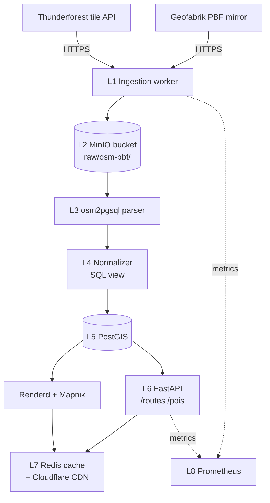

# OpenCycleMap (Thunderforest) — Teljes backend terv és adatkinyerési specifikáció

## 1. Forrás áttekintés

Az **OpenCycleMap** Andy Allan kezdeményezése (2007 óta), ma a brit **Thunderforest Ltd.** üzemelteti kereskedelmi tile szolgáltatásként a `tile.thunderforest.com/cycle` végponton. Az alapja a teljes **OpenStreetMap (OSM)** adatkincs, amelyet egy speciálisan kerékpárosokra hangolt **Mapnik / CartoCSS** stíluslappal renderelnek raster (PNG) tile-okká, illetve újabban **vector tile** (MVT, PBF) formátumba is.

A forrás **megadja**:
- raster PNG tile-okat (256×256, 512×512 retina) a 0–22 zoom tartományban,
- nemzetközi kerékpárutak (`route=bicycle` `network=icn/ncn/rcn/lcn`) hangsúlyos rajzolása,
- domborzati árnyékolás (hillshade) integrálva,
- emelkedési szintvonalak (contour lines) — kerékpározáshoz kritikus,
- POI réteg: kerékpárbolt, javítóállomás, kerékpárparkoló, ivókút, vasútállomás,
- felhasználói felület tile.thunderforest.com/cycle/{z}/{x}/{y}.png mintában.

A forrás **nem adja**:
- nyers vektor geometriát (a routing-engine számára) — ahhoz közvetlenül OSM PBF-ből kell dolgozni,
- elevation profile-t POST végponton,
- routing számítást — ez nem útvonaltervező, csak térképkép.

**Lefedettség**: globális (a Föld teljes szárazföldi területe), OSM frissességhez igazítva. A Thunderforest **kb. heti-kétheti** kadenciával frissít, a teljes planet rendert ~7-10 napos lépésekkel követi az `osm2pgsql` replication diff streamből.

**Adatminőség**: az OSM tagging-konvenciói szerint kiváló Európában (különösen Hollandia, Németország, Csehország, Magyarország), átlagos Észak-Amerikában és Délkelet-Ázsiában, gyenge minőségű Közép-Afrikában.

**Tipikus felhasználási esetek**:
1. Mobilalkalmazás térképi alapréteg kerékpáros túraappnál,
2. Webes túratervező (Komoot-szerű felhasználói élmény) alaptérképe,
3. Onroad/offroad útvonal megjelenítés POI overlay-jel,
4. Domborzati profil vizuális megerősítése (hillshade + contour).

## 2. Jogi és licenc helyzet

**Két rétegű licenc**:

1. **Az alap OSM adat licence**: **ODbL 1.0 (Open Database License)**.
   - Bármilyen felhasználás engedélyezett (kereskedelmi is),
   - **Attribúció kötelező**: `© OpenStreetMap contributors`,
   - **Share-Alike kötelezettség**: ha az adatbázisból származtatott adatbázist közzéteszünk, az is ODbL.
2. **A Thunderforest tile szolgáltatás licence**: **Thunderforest Maps Terms of Service** (proprietary SaaS).
   - Az API kulcs nélküli használat tilos kereskedelmi környezetben,
   - Egyéni díjszabás: Hobby (free, 150 000 tile/hó), Plus (£15/hó, 200 000 tile/hó), Business (£40/hó+).
   - Attribúciós sor a térkép sarkában: `Maps © Thunderforest, Data © OpenStreetMap contributors`.
   - **Tilos** a tile-ok lokális cache-be tárolása permanensen (max. 30 nap, és csak a felhasználó saját kliensén).

**Kereskedelmi használat**: engedélyezett Plus / Business csomaggal. Magas forgalmú alkalmazásnál **self-hosted** alternatíva ajánlott (lásd 3. szakasz).

**Share-Alike önhostolt esetben**: ha a self-hosted OSM-alapú vektor tile-okat **adatbázisként** szolgáljuk ki (pl. Mapbox Vector Tile export letölthető formában), ODbL share-alike kapcsol be. Ha **csak térképképet** szolgálunk (raster PNG vagy renderelt MVT), az „produced work", **CC-BY 2.0** elég.

**GDPR**: a tile API-ról szóló kérések IP-címet logolnak a Thunderforest oldalán; mi tárolhatjuk a saját CDN log-jainkat, de **30 napon belül** anonimizálni kell (IP utolsó oktett `0`-ra állítva).

## 3. Adatkinyerési felület (Access Surface)

### 3.1 Thunderforest hosted API (raster XYZ tile-ok)

**Végpont sablon**:
```
https://tile.thunderforest.com/cycle/{z}/{x}/{y}.png?apikey=YOUR_API_KEY
```

Retina (512×512):
```
https://tile.thunderforest.com/cycle/{z}/{x}/{y}@2x.png?apikey=YOUR_API_KEY
```

További stílusok ugyanezzel a kulccsal:
- `outdoors` — túraúthoz (kék kerékpárút, sárga gyalogos),
- `landscape` — domborzat hangsúlyos,
- `transport` — közlekedési hangsúly,
- `atlas` — politikai színkód.

**Példa curl letöltés** (Budapest belváros z=14):
```bash
curl -sSL -o tile_14_8902_5808.png \
  "https://tile.thunderforest.com/cycle/14/8902/5808.png?apikey=$THUNDERFOREST_KEY"
file tile_14_8902_5808.png
# => PNG image data, 256 x 256, 8-bit/color RGB
```

Bbox-szelekció **nincs natívan**; a tile koordinátákat (x, y, z) a bbox-ból Web Mercator transzformációval kell előállítani:
```python
import math
def deg2num(lat_deg, lon_deg, zoom):
    lat_rad = math.radians(lat_deg)
    n = 2.0 ** zoom
    x = int((lon_deg + 180.0) / 360.0 * n)
    y = int((1.0 - math.asinh(math.tan(lat_rad)) / math.pi) / 2.0 * n)
    return (x, y)
```

### 3.2 Vector tile végpont (MVT)

```
https://tile.thunderforest.com/thunderforest.cycle-v2/{z}/{x}/{y}.pbf?apikey=...
```

Tartalom: `roads`, `bike_routes`, `pois`, `landuse`, `contour`, `place_labels` rétegek MVT 2.1 formátumban (gzip-pelt protobuf).

### 3.3 Self-hosted alternatíva — teljes vertikum

Komponens halmaz:
1. **Adatforrás**: `https://download.geofabrik.de/europe/hungary-latest.osm.pbf` (kb. 750 MB),
2. **Import**: `osm2pgsql` PostGIS-be,
3. **Style**: `openstreetmap-carto-cycling` (fork az openstreetmap-carto-ból),
4. **Render**: `mapnik` + `renderd` + `mod_tile`,
5. **Cache**: Nginx + `tile-cache` dir.

Letöltés:
```bash
wget -c https://download.geofabrik.de/europe/hungary-latest.osm.pbf \
  -O /data/raw/hungary-latest.osm.pbf
wget https://download.geofabrik.de/europe/hungary-latest.osm.pbf.md5 \
  -O /data/raw/hungary-latest.osm.pbf.md5
cd /data/raw && md5sum -c hungary-latest.osm.pbf.md5
```

### 3.4 OpenMapTiles vector tile

```bash
docker run -v $(pwd):/data \
  ghcr.io/openmaptiles/openmaptiles-tools:latest \
  generate-tiles --bbox=16.1,45.7,22.9,48.6 \
  --minzoom=0 --maxzoom=14 hungary.mbtiles
```

### 3.5 Példa raster tile válasz

```
HTTP/1.1 200 OK
Content-Type: image/png
Content-Length: 17841
Cache-Control: public, max-age=2592000
ETag: "5d3a-cy-14-8902-5808"
X-Tile-Render-Time: 12ms
Server: cloudflare
```

## 4. Hitelesítés, rate limit, kvóták

**Auth mód**: API key (query string `?apikey=...`). Header alternatíva nincs hivatalosan.

**Rate limit (Thunderforest)**:
- Hobby: **150 000 tile / hónap**, ~5 req/sec peak,
- Plus (£15/hó): **200 000 tile / hónap**, ~20 req/sec peak,
- Business (£40/hó): **500 000 tile / hónap**,
- Enterprise: tárgyalás alapján, dedikált CDN.

429-es válasz felett **Retry-After: 60** header.

**Backoff stratégia (kliens)**:
```python
import time, random
def fetch_with_backoff(url, max_retries=5):
    for i in range(max_retries):
        r = requests.get(url, timeout=10)
        if r.status_code == 200:
            return r.content
        if r.status_code in (429, 503):
            sleep = (2 ** i) + random.uniform(0, 1)
            time.sleep(min(sleep, 60))
            continue
        r.raise_for_status()
    raise RuntimeError(f"Failed after {max_retries} retries: {url}")
```

**User-Agent követelmény**: kötelező `User-Agent: <app>/<version> (<contact>)` (RFC 7231 + OSM Tile Usage Policy).

**Költségmodell** (önhostolt becslés):
| Tétel | Hobby (free) | Self-hosted (HU only) |
|-------|--------------|-----------------------|
| Tárolás | 0 | 50 GB SSD (€7/hó) |
| Compute | 0 | 4 vCPU 8 GB RAM (€35/hó) |
| Sávszélesség | 0 | ~200 GB/hó (€8) |
| Összes | 0 €/hó | ~50 €/hó |

## 5. Adatmodell (a forrásból)

A nyers OSM adatkincs három entitástípusból áll:

**Node** — pont (lat, lon, id, tag-ek):
```xml
<node id="3023492837" lat="47.4979" lon="19.0402">
  <tag k="amenity" v="bicycle_repair_station"/>
  <tag k="opening_hours" v="24/7"/>
</node>
```

**Way** — rendezett node referenciák:
```xml
<way id="289234982">
  <nd ref="3023492837"/>
  <nd ref="3023492838"/>
  <tag k="highway" v="cycleway"/>
  <tag k="surface" v="asphalt"/>
  <tag k="lit" v="yes"/>
</way>
```

**Relation** — útvonalak, kerékpáros networkok:
```xml
<relation id="1382744">
  <member type="way" ref="289234982" role=""/>
  <member type="way" ref="289234983" role=""/>
  <tag k="type" v="route"/>
  <tag k="route" v="bicycle"/>
  <tag k="network" v="ncn"/>
  <tag k="ref" v="EuroVelo 6"/>
  <tag k="name" v="EuroVelo 6 — Atlantic to Black Sea"/>
</relation>
```

**Geometria típusok** (osm2pgsql kimenet):
- `way` → `LINESTRING` (kerékpárút szakaszra),
- `way` zárt → `POLYGON` (parkoló terület),
- `node` → `POINT`,
- `relation` (route) → `MULTILINESTRING` (osm2pgsql `--multi-geometry`).

**CRS**: forrás `EPSG:4326`, osm2pgsql alapértelmezetten **`EPSG:3857`** (Web Mercator) projektál a Mapnik render miatt. Mi mindkettőt eltároljuk.

**Tagging konvenciók** (releváns):
| Tag | Érték | Jelentés |
|-----|-------|----------|
| `highway=cycleway` | — | önálló kerékpárút |
| `bicycle=designated` | yes/designated | engedélyezett |
| `cycleway=track/lane/shared_lane` | — | típus |
| `route=bicycle` | + relation | hivatalos útvonal |
| `network=icn/ncn/rcn/lcn` | — | nemzetközi/orsz./reg./helyi |
| `surface` | asphalt/paved/gravel/dirt | felület |
| `incline` | up / -3% | meredekség |
| `osmc:symbol` | red:white:red_bar | jelzés szín |

## 6. Cél adatmodell (a mi backendünkben)

**PostgreSQL 15 + PostGIS 3.4** sémája:

```sql
CREATE SCHEMA IF NOT EXISTS ocm;
CREATE EXTENSION IF NOT EXISTS postgis;
CREATE EXTENSION IF NOT EXISTS postgis_topology;
CREATE EXTENSION IF NOT EXISTS pg_trgm;

-- Cikkely 1: nyers OSM-szerű entitások (osm2pgsql kompatibilis)
CREATE TABLE ocm.planet_osm_line (
    osm_id        bigint NOT NULL,
    access        text,
    "addr:housename" text,
    bicycle       text,
    bridge        text,
    cycleway      text,
    highway       text,
    incline       text,
    lit           text,
    name          text,
    "name:hu"     text,
    network       text,
    oneway        text,
    ref           text,
    route         text,
    surface       text,
    tunnel        text,
    way           geometry(LineString, 3857),
    tags          hstore,
    z_order       integer,
    data_version  text NOT NULL DEFAULT 'unknown',
    valid_from    timestamptz NOT NULL DEFAULT now(),
    valid_to      timestamptz,
    PRIMARY KEY (osm_id, valid_from)
);

CREATE INDEX planet_osm_line_way_idx
    ON ocm.planet_osm_line USING GIST(way);
CREATE INDEX planet_osm_line_highway_idx
    ON ocm.planet_osm_line(highway)
    WHERE highway IN ('cycleway','path','track','residential');
CREATE INDEX planet_osm_line_route_idx
    ON ocm.planet_osm_line(route)
    WHERE route = 'bicycle';

-- Cikkely 2: kerékpáros relation aggregálva
CREATE TABLE ocm.cycle_route (
    route_id      bigint PRIMARY KEY,
    network       text CHECK (network IN ('icn','ncn','rcn','lcn')),
    ref           text,
    name          text,
    name_hu       text,
    length_m      double precision,
    elevation_gain_m double precision,
    surface_dominant text,
    geom          geometry(MultiLineString, 4326) NOT NULL,
    geom_3857     geometry(MultiLineString, 3857) GENERATED ALWAYS
                  AS (ST_Transform(geom, 3857)) STORED,
    tags          jsonb,
    data_version  text NOT NULL,
    valid_from    timestamptz NOT NULL DEFAULT now(),
    valid_to      timestamptz
);

CREATE INDEX cycle_route_geom_idx ON ocm.cycle_route USING GIST(geom);
CREATE INDEX cycle_route_network_idx ON ocm.cycle_route(network);
CREATE INDEX cycle_route_name_trgm ON ocm.cycle_route USING gin(name gin_trgm_ops);

-- Cikkely 3: tile cache metaadat
CREATE TABLE ocm.tile_meta (
    z INT, x INT, y INT,
    style TEXT,
    bytes INT,
    rendered_at TIMESTAMPTZ,
    expires_at TIMESTAMPTZ,
    PRIMARY KEY(z,x,y,style)
) PARTITION BY RANGE (z);

CREATE TABLE ocm.tile_meta_z00_08 PARTITION OF ocm.tile_meta FOR VALUES FROM (0)  TO (9);
CREATE TABLE ocm.tile_meta_z09_12 PARTITION OF ocm.tile_meta FOR VALUES FROM (9)  TO (13);
CREATE TABLE ocm.tile_meta_z13_15 PARTITION OF ocm.tile_meta FOR VALUES FROM (13) TO (16);
CREATE TABLE ocm.tile_meta_z16_19 PARTITION OF ocm.tile_meta FOR VALUES FROM (16) TO (20);
```

**Particionálás**: a `tile_meta` zoom-szint szerint, mert a hozzáférési minta zoom-tartomány-alapú.

**Verziózás**: Flyway migrációkkal, `V001__init_schema.sql`, `V002__add_elevation.sql`, stb.

## 7. Backend architektúra (rétegek)



**Rétegek bővebben**:

- **L1 Ingestion**: Python `aiohttp` worker pool (8 párhuzamos). PBF letöltést HEAD-del kezdi, ETag összevetéssel kihagyja a változatlan fájlt.
- **L2 Staging**: MinIO S3-kompatibilis bucket. Path: `s3://ocm-raw/{region}/{year}/{month}/hungary-latest.osm.pbf`. Lifecycle policy: 90 nap után Glacier osztály.
- **L3 Parser**: `osm2pgsql --slim --hstore --multi-geometry --style cycling.style` Docker konténerben.
- **L4 Normalizer**: PostgreSQL materialized view-k. `REFRESH MATERIALIZED VIEW CONCURRENTLY ocm.cycle_route` 6 óránként.
- **L5 Storage**: PostGIS 3.4 PostgreSQL 15-en. Replikált primary+standby (streaming).
- **L6 Serving**: FastAPI mvt endpoint + REST `/api/v1/routes?bbox=...`.
- **L7 Cache**: Redis 7 (LRU, 4 GB), előtte Cloudflare CDN (`max-age=2592000`, 30 nap).
- **L8 Observability**: Prometheus + Grafana + Loki (JSON log aggregátor).

## 8. Automatizált letöltő (Downloader)

Nyelv: **Python 3.11 + aiohttp + asyncpg**.

```python
# downloader/geofabrik_ocm.py
import asyncio
import hashlib
import os
from datetime import datetime, timezone
from pathlib import Path

import aiohttp
import asyncpg
from tenacity import retry, stop_after_attempt, wait_exponential

GEOFABRIK_BASE = "https://download.geofabrik.de/europe"
REGIONS = ["hungary", "slovakia", "austria", "romania", "serbia"]
RAW_DIR = Path("/data/raw")
S3_BUCKET = "ocm-raw"
PG_DSN = os.environ["PG_DSN"]  # postgres://...
USER_AGENT = "ocm-ingest/1.4 (ops@example.hu)"


async def head(session, url):
    async with session.head(url, allow_redirects=True) as r:
        return r.status, r.headers


@retry(stop=stop_after_attempt(5),
       wait=wait_exponential(multiplier=2, min=4, max=120))
async def download(session, region: str):
    url = f"{GEOFABRIK_BASE}/{region}-latest.osm.pbf"
    md5_url = url + ".md5"

    status, hdrs = await head(session, url)
    if status != 200:
        raise RuntimeError(f"HEAD failed {status} for {url}")
    etag = hdrs.get("ETag", "").strip('"')
    size = int(hdrs.get("Content-Length", 0))
    last_mod = hdrs.get("Last-Modified", "")

    # ETag check ellen
    async with asyncpg.create_pool(PG_DSN) as pool:
        async with pool.acquire() as conn:
            row = await conn.fetchrow(
                "SELECT etag FROM ocm.ingest_state WHERE region=$1", region
            )
            if row and row["etag"] == etag:
                print(f"[{region}] unchanged (etag={etag}) — skip")
                return None

    target = RAW_DIR / region / f"{datetime.utcnow():%Y%m%d}.osm.pbf"
    target.parent.mkdir(parents=True, exist_ok=True)

    # Resumable, Range header
    pos = target.stat().st_size if target.exists() else 0
    headers = {"User-Agent": USER_AGENT}
    if pos > 0:
        headers["Range"] = f"bytes={pos}-"

    async with session.get(url, headers=headers, timeout=None) as r:
        if r.status not in (200, 206):
            raise RuntimeError(f"GET {url} -> {r.status}")
        mode = "ab" if pos else "wb"
        h = hashlib.md5()
        with open(target, mode) as f:
            async for chunk in r.content.iter_chunked(1 << 20):  # 1 MB
                f.write(chunk)
                h.update(chunk)
        print(f"[{region}] downloaded {size/1e6:.1f} MB md5={h.hexdigest()}")

    # MD5 ellenőrzés
    async with session.get(md5_url) as r:
        expected = (await r.text()).split()[0].strip()
    if h.hexdigest() != expected:
        target.unlink()
        raise RuntimeError(f"MD5 mismatch for {region}: {h.hexdigest()} vs {expected}")

    # State frissítés
    async with asyncpg.create_pool(PG_DSN) as pool:
        async with pool.acquire() as conn:
            await conn.execute(
                """
                INSERT INTO ocm.ingest_state(region, etag, size_bytes, downloaded_at, file_path)
                VALUES($1,$2,$3,$4,$5)
                ON CONFLICT (region) DO UPDATE
                SET etag=EXCLUDED.etag, size_bytes=EXCLUDED.size_bytes,
                    downloaded_at=EXCLUDED.downloaded_at, file_path=EXCLUDED.file_path
                """,
                region, etag, size, datetime.now(timezone.utc), str(target),
            )

    return target


async def main():
    timeout = aiohttp.ClientTimeout(total=None, sock_connect=30, sock_read=300)
    connector = aiohttp.TCPConnector(limit=4)  # max 4 párhuzamos
    async with aiohttp.ClientSession(timeout=timeout, connector=connector) as s:
        tasks = [download(s, r) for r in REGIONS]
        results = await asyncio.gather(*tasks, return_exceptions=True)
        for region, res in zip(REGIONS, results):
            if isinstance(res, Exception):
                print(f"FAIL {region}: {res}")


if __name__ == "__main__":
    asyncio.run(main())
```

**Cron / scheduler**: Kubernetes CronJob.

```yaml
apiVersion: batch/v1
kind: CronJob
metadata:
  name: ocm-geofabrik-ingest
  namespace: ocm
spec:
  schedule: "0 3 * * 1,4"   # hétfő, csütörtök 03:00 UTC
  concurrencyPolicy: Forbid
  jobTemplate:
    spec:
      backoffLimit: 2
      template:
        spec:
          restartPolicy: OnFailure
          containers:
          - name: downloader
            image: registry.example.hu/ocm/downloader:1.4.0
            command: ["python","-m","downloader.geofabrik_ocm"]
            envFrom:
              - secretRef: { name: ocm-secrets }
            resources:
              requests: { cpu: "500m", memory: "1Gi" }
              limits:   { cpu: "2",    memory: "4Gi" }
            volumeMounts:
              - name: raw-data
                mountPath: /data/raw
          volumes:
            - name: raw-data
              persistentVolumeClaim:
                claimName: ocm-raw-pvc
```

**Hibatűrés**: `tenacity` retry-okkal (5 attempt, exp. backoff 4–120 sec), 5 sikertelen retry után dead-letter queue (Redis Stream `ocm:dlq`).

## 9. Feldolgozó pipeline

**Lépéssor**:

1. **Validáció**: `osmium fileinfo` + checksum,
2. **Parsing**: `osm2pgsql` import,
3. **Normalizáció**: SQL `INSERT ... SELECT` materialized view-be,
4. **Geometriai tisztítás**: `ST_MakeValid`, `ST_LineMerge`,
5. **Idempotens upsert**: `ON CONFLICT DO UPDATE`.

**osm2pgsql import**:
```bash
osm2pgsql \
  --create --slim --hstore --multi-geometry \
  --cache 4000 \
  --number-processes 4 \
  --style /opt/styles/cycling.style \
  --tag-transform-script /opt/styles/cycling.lua \
  -d ocm_db -U ocm_user -H pg-primary.svc \
  /data/raw/hungary/20260518.osm.pbf
```

A `cycling.lua` transformja csak a kerékpáros tag-eket tartja meg:
```lua
local cycle_keys = {"highway","cycleway","bicycle","route","network",
                    "surface","lit","incline","ref","name"}
function filter_tags_way(tags, _)
  local keep = false
  if tags.highway == "cycleway" or tags.bicycle == "designated"
     or tags.cycleway then keep = true end
  if not keep then return 1, {} end
  local out = {}
  for _,k in ipairs(cycle_keys) do out[k] = tags[k] end
  return 0, out
end
```

**Geometriai műveletek**:
```sql
-- Relation tagjainak összefűzése egy MultiLineString-be
INSERT INTO ocm.cycle_route(route_id, network, ref, name, geom, data_version)
SELECT
  r.id AS route_id,
  r.tags->'network' AS network,
  r.tags->'ref'     AS ref,
  r.tags->'name'    AS name,
  ST_Transform(
    ST_LineMerge(
      ST_Collect(w.way)
    ), 4326
  ) AS geom,
  '20260518' AS data_version
FROM planet_osm_rels r
JOIN planet_osm_ways w
  ON w.id = ANY(r.members)
WHERE r.tags->'route' = 'bicycle'
  AND r.tags ? 'network'
GROUP BY r.id, r.tags
ON CONFLICT (route_id, valid_from) DO UPDATE
  SET geom = EXCLUDED.geom,
      data_version = EXCLUDED.data_version;
```

**Topológia validáció**:
```sql
UPDATE ocm.cycle_route
SET geom = ST_MakeValid(geom)
WHERE NOT ST_IsValid(geom);

-- Karantén tábla
INSERT INTO ocm.cycle_route_quarantine
SELECT * FROM ocm.cycle_route
WHERE NOT ST_IsValid(geom) OR ST_NumPoints(geom) < 2;
```

**Duplikátum detekció**:
```sql
SELECT route_id, COUNT(*) FROM (
  SELECT route_id, md5(ST_AsBinary(geom)||name) AS h
  FROM ocm.cycle_route
) x
GROUP BY route_id HAVING COUNT(*) > 1;
```

**Idempotencia**: minden ingest run-nak `data_version` (UTC dátum + git-sha), és minden write `ON CONFLICT (osm_id, valid_from) DO UPDATE` mintán halad.

## 10. Frissítési stratégia

**Teljes refresh kadenciája**: heti 2× (hétfő, csütörtök), Geofabrik mindennap új PBF-et publikál de heti 2× elég.

**Inkrementális frissítés**: a Geofabrik **minutely / hourly / daily diff** stream-eket is publikál:
```
https://download.geofabrik.de/europe/hungary-updates/state.txt
```
Tartalmaz `sequenceNumber=4982732` és `timestamp=2026-05-18T03:00:00Z`. Az `osmosis --read-replication-interval` parancs lehúzza a `.osc.gz` diffeket, az `osm2pgsql-replication update` alkalmazza az élő DB-re.

```bash
osm2pgsql-replication update \
  --database ocm_db --max-diff-size 200 \
  --post-processing /opt/scripts/refresh_routes.sh
```

**Verziókövetés**:
- `data_version` oszlop minden táblán,
- `valid_from`/`valid_to` időbeli intervallum (SCD Type 2),
- a `valid_to IS NULL` az „élő" rekord.

**Snapshot policy**: havonta egyszer (hónap 1. napján) teljes `pg_dump --schema=ocm` a S3 cold tier-be (Glacier osztály, 7 év).

**Konfliktusfeloldás**: utolsó frissítés nyer (`data_version DESC` szerinti `DISTINCT ON`), kivéve ha `manual_override = true` (admin review queue).

## 11. Storage és skálázás

**PostGIS méretbecslés** (Magyarország):
| Tábla | Rekordok | Bytes/sor | Méret | Index |
|-------|----------|-----------|-------|-------|
| `planet_osm_line` | 2 800 000 | 320 B | 900 MB | 350 MB |
| `cycle_route` | 4 200 | 5 KB | 21 MB | 5 MB |
| `tile_meta` | 80 000 000 | 80 B | 6.4 GB | 4 GB |

**Particionálás**:
- `tile_meta` zoom szerint (lásd 6.),
- `cycle_route_audit` hónap szerint (RANGE on `valid_from`).

**TimescaleDB hypertable** a `tile_metrics` táblán (idősoros):
```sql
SELECT create_hypertable('ocm.tile_metrics', 'ts', chunk_time_interval => INTERVAL '1 day');
```

**S3 / MinIO bucket layout**:
```
ocm-raw/
  pbf/hungary/2026/05/18-latest.osm.pbf
  pbf/slovakia/2026/05/18-latest.osm.pbf
  diffs/hungary/2026/05/18/000.osc.gz
ocm-tiles/
  cycle/z14/x8902/y5808.png
  vector/z14/x8902/y5808.pbf
ocm-snapshots/
  schema/2026-05-01.sql.gz
  full/2026-05-01.pgdump
```

**Cold tier**: Glacier (S3 Standard-IA után 30 nap, Glacier 90 nap).

**CDN cache**: Cloudflare R2 + Workers, `cache-control: public, s-maxage=2592000, stale-while-revalidate=86400`. Edge POP-ok globálisan, eviction LRU.

## 12. Monitoring, megfigyelhetőség, riasztások

**Prometheus metrikák**:
```
ocm_download_total{region="hungary",status="success"} 142
ocm_download_bytes_total{region="hungary"} 9.8e10
ocm_parse_duration_seconds{phase="osm2pgsql"} 1240.5
ocm_parse_errors_total{type="invalid_geometry"} 3
ocm_route_count{network="ncn"} 184
ocm_tile_render_seconds{quantile="0.99"} 0.32
ocm_postgres_table_size_bytes{table="planet_osm_line"} 9.4e8
```

**Log formátum** (Loki):
```json
{
  "ts": "2026-05-18T03:14:22Z",
  "service": "ocm.downloader",
  "trace_id": "8b2c…",
  "region": "hungary",
  "level": "info",
  "msg": "pbf downloaded",
  "etag": "5d3a-2026-05-18",
  "bytes": 752380119
}
```

**Riasztások (Prometheus alert rules)**:
```yaml
groups:
- name: ocm
  rules:
  - alert: OcmIngestStale
    expr: time() - ocm_last_successful_ingest_timestamp > 86400 * 4
    for: 30m
    annotations:
      summary: "OCM ingest stale > 4 nap ({{ $labels.region }})"

  - alert: OcmGeometryErrorsHigh
    expr: rate(ocm_parse_errors_total{type="invalid_geometry"}[1h]) > 10
    for: 15m

  - alert: OcmTileLatencyP99
    expr: histogram_quantile(0.99, ocm_tile_render_seconds_bucket) > 1.0
    for: 10m
```

**Health endpoint**: `GET /healthz` → DB ping + S3 ping + last_ingest age.

**Adatminőség kontrollok**:
- `cycle_route` `COUNT(*)` napi delta legfeljebb ±5%,
- `geometry_validity_pct` ≥ 99.5%,
- `null_name_pct` ≤ 2%,
- ezeket Great Expectations suite ellenőrzi az ingest végén.

## 13. Költségbecslés

| Tétel | Hobby (Thunderforest) | Self-hosted (HU+szomszédok) |
|-------|----------------------|------------------------------|
| Sávszélesség (havi GB) | 15 (kliens-oldali) | 500 |
| Sávszélesség költség | 0 | €15 |
| Tárolás (PG + S3) | 0 | 200 GB → €18 |
| Compute (vCPU·h) | 0 | 2× 4 vCPU 16 GB = €70 |
| Thunderforest API díj | £0 (Hobby) / £15 (Plus) | 0 |
| **Havi összesen** | **0 € / 18 €** | **~103 €** |

Évesen: self-hosted **~1240 €/év**, hosted Plus **~210 €/év**. Vízválasztó kb. **350 000 tile/hó** látogatottságnál: a fölött a self-hosted megéri.

## 14. Biztonság

**Secrets kezelés**: HashiCorp Vault, `ocm/data/thunderforest` path, KV v2. Kubernetes secret rotation 90 napos rotáció `vault-secrets-operator`-on keresztül.

**Network policy** (Kubernetes):
```yaml
apiVersion: networking.k8s.io/v1
kind: NetworkPolicy
metadata:
  name: ocm-downloader-egress
spec:
  podSelector: { matchLabels: { app: ocm-downloader } }
  policyTypes: [Egress]
  egress:
  - to:
    - namespaceSelector: { matchLabels: { ns: dns } }
  - to:
    - ipBlock: { cidr: 0.0.0.0/0 }
    ports: [ { port: 443, protocol: TCP } ]
```

**IAM jogosultságok**: a downloader IAM role-ja S3 `PutObject` + `ListBucket` a `ocm-raw/*` prefix-re. PostgreSQL role-ok: `ocm_writer` (INSERT/UPDATE), `ocm_reader` (SELECT), külön `ocm_admin` migrations-höz.

**Audit log**: `pgaudit` extension. Minden DDL és bulk DML naplózott a Loki-ba 1 éves retention-nel.

## 15. Tesztelés

**Unit tesztek** (pytest):
```python
# tests/test_parser.py
from ocm.parser import parse_relation_geom
import shapely.wkt

def test_parse_relation_geom_simple():
    ways = [
        shapely.wkt.loads("LINESTRING(19.0 47.5, 19.1 47.5)"),
        shapely.wkt.loads("LINESTRING(19.1 47.5, 19.2 47.5)"),
    ]
    geom = parse_relation_geom(ways)
    assert geom.geom_type == "LineString"
    assert geom.length > 0
```

**Integrációs teszt** (VCR cassette):
```python
import vcr, asyncio
from downloader.geofabrik_ocm import download

@vcr.use_cassette("tests/cassettes/geofabrik_hungary.yaml")
def test_geofabrik_download(tmp_path):
    asyncio.run(download(session, "hungary"))
    assert (tmp_path / "hungary" / "20260518.osm.pbf").exists()
```

**Adatminőség regressziós teszt** (Great Expectations):
```yaml
expectation_suite_name: cycle_route
expectations:
  - expectation_type: expect_table_row_count_to_be_between
    kwargs: { min_value: 4000, max_value: 5000 }
  - expectation_type: expect_column_values_to_not_be_null
    kwargs: { column: geom }
  - expectation_type: expect_column_distinct_count_to_equal
    kwargs: { column: network, value: 4 }
```

**Smoke teszt** (post-deploy):
```bash
curl -sf https://api.example.hu/v1/routes?bbox=19,47,20,48&limit=5 | jq '.features | length'
# expect > 0
```

## 16. Telepítés és üzemeltetés

**Dockerfile (downloader)**:
```dockerfile
FROM python:3.11-slim
RUN apt-get update && apt-get install -y --no-install-recommends \
    libpq-dev gcc curl ca-certificates && rm -rf /var/lib/apt/lists/*
WORKDIR /app
COPY pyproject.toml poetry.lock ./
RUN pip install --no-cache-dir poetry==1.8.2 \
 && poetry config virtualenvs.create false \
 && poetry install --no-root --only main
COPY downloader/ ./downloader/
USER 10001
ENTRYPOINT ["python","-m","downloader.geofabrik_ocm"]
```

**Kubernetes Deployment (tile serve)**:
```yaml
apiVersion: apps/v1
kind: Deployment
metadata:
  name: ocm-renderd
spec:
  replicas: 3
  selector: { matchLabels: { app: ocm-renderd } }
  template:
    metadata: { labels: { app: ocm-renderd } }
    spec:
      containers:
      - name: renderd
        image: registry.example.hu/ocm/renderd:1.4.0
        ports: [ { containerPort: 8080 } ]
        env:
          - { name: PG_DSN, valueFrom: { secretKeyRef: { name: ocm-secrets, key: pg_dsn } } }
        resources:
          requests: { cpu: "1", memory: "2Gi" }
          limits:   { cpu: "4", memory: "8Gi" }
```

**Helm chart**:
```
ocm-chart/
├── Chart.yaml
├── values.yaml
└── templates/
    ├── deployment-renderd.yaml
    ├── cronjob-ingest.yaml
    ├── service.yaml
    └── networkpolicy.yaml
```

**GitHub Actions CI**:
```yaml
name: ocm-ci
on: [push]
jobs:
  test:
    runs-on: ubuntu-latest
    services:
      postgres:
        image: postgis/postgis:15-3.4
        env: { POSTGRES_PASSWORD: ci }
        ports: [5432:5432]
    steps:
      - uses: actions/checkout@v4
      - uses: actions/setup-python@v5
        with: { python-version: '3.11' }
      - run: pip install -r requirements-dev.txt
      - run: pytest -q --cov=ocm
      - run: docker build -t ocm/downloader:${{ github.sha }} .
```

**Rollback**: Helm `--atomic --timeout 5m` flag-gel, sikertelen rollout esetén automatikus visszaállás. DB migration rollback: Flyway `undo` (csak Teams kiadásban) helyett **forward-only** migráció + új migrációval visszaállítás.

## 17. Adatpublikálás (Serving)

**REST API (OpenAPI vázlat)**:
```yaml
openapi: 3.1.0
info: { title: OCM API, version: 1.0.0 }
paths:
  /v1/routes:
    get:
      parameters:
        - { name: bbox, in: query, schema: { type: string }, example: "19,47,20,48" }
        - { name: network, in: query, schema: { type: string, enum: [icn,ncn,rcn,lcn] } }
        - { name: limit, in: query, schema: { type: integer, default: 100, maximum: 1000 } }
      responses:
        '200':
          content:
            application/geo+json:
              schema: { $ref: '#/components/schemas/FeatureCollection' }
  /v1/tile/cycle/{z}/{x}/{y}.pbf:
    get:
      responses:
        '200': { content: { application/x-protobuf: {} } }
```

**Vector tile generálás** Tippecanoe-val:
```bash
tippecanoe -o cycle.mbtiles \
  -Z 0 -z 14 \
  --layer=cycle_routes \
  --drop-densest-as-needed \
  cycle_routes.geojson
```

A `.mbtiles` fájlt `tileserver-gl` szolgálja: `tileserver-gl --port 8088 cycle.mbtiles`.

**WMS/WFS rétegek**: GeoServer 2.24 instance, két layer: `ocm:cycle_routes` (vector WFS) és `ocm:cycle_raster` (cached WMS).

**Letölthető export**:
- `GET /v1/export/routes.gpx?route_id=1382744`
- `GET /v1/export/routes.geojson?bbox=...`
- `GET /v1/export/routes.shp.zip?network=ncn` (esri shapefile zip).

## 18. Runbook (üzemeltetői kézikönyv)

### Hibajelenség: tile API 502
1. `kubectl get pods -n ocm | grep renderd`,
2. `kubectl logs <pod> --tail 100`,
3. ha mapnik OOM: emelni a memory limitet 8 → 12 GB, deploy újra,
4. ha `connection to pg-primary failed`: pgbouncer pod restart.

### Hibajelenség: ingest stale > 4 nap
1. `kubectl get cronjob ocm-geofabrik-ingest -n ocm`,
2. `kubectl logs job/<latest>`,
3. tipikus ok: Geofabrik 503 — manuális reprocess:
```bash
kubectl create job --from=cronjob/ocm-geofabrik-ingest manual-rerun-$(date +%s) -n ocm
```

### Backfill recept
```bash
# 2024 Q1-es PBF újrafeldolgozása
for d in 20240101 20240115 20240201; do
  python -m downloader.geofabrik_ocm --region=hungary --date=$d
  osm2pgsql --append --slim ... /data/raw/hungary/${d}.osm.pbf
done
```

### Eskaláció
- L1 (NOC) → L2 (Data Eng, oncall PagerDuty) → L3 (Lead, Slack #ocm-incidents).

## 19. Roadmap / következő lépések

**MVP (v0.1)** — 4 hét:
- Geofabrik downloader Magyarországra,
- osm2pgsql import + `cycle_route` materialized view,
- raster tile passthrough Thunderforest API-hoz API key-jel,
- Cloudflare CDN előtte.

**v1.0** — 12 hét:
- Self-hosted renderd cluster,
- Vector MVT tile saját Tippecanoe pipeline-nal,
- Replication diff inkrementális update,
- Grafana dashboard + Prometheus alert.

**v2.0** — 6 hónap:
- 3D terrain texture overlay (DEM Copernicus EU-DEM),
- Routing engine integráció (GraphHopper / Valhalla),
- A/B tesztelt stílusvariánsok (touring vs. MTB),
- Mobil offline csomag (MBTiles per megye).

## 20. Referenciák, dokumentáció linkek

- Thunderforest dev portál: <https://www.thunderforest.com/maps/opencyclemap/>
- OpenCycleMap forrás: <https://github.com/SomeoneElseOSM/SomeoneElse-style>
- OSM Wiki — kerékpáros tagging: <https://wiki.openstreetmap.org/wiki/Bicycle>
- OSM Wiki — cycle networks: <https://wiki.openstreetmap.org/wiki/Cycle_routes>
- osm2pgsql doc: <https://osm2pgsql.org/doc/manual.html>
- Geofabrik downloads: <https://download.geofabrik.de/>
- Mapnik render doc: <https://github.com/mapnik/mapnik/wiki>
- OpenMapTiles: <https://openmaptiles.org/docs/>
- Tippecanoe: <https://github.com/felt/tippecanoe>
- ODbL 1.0 teljes szöveg: <https://opendatacommons.org/licenses/odbl/1-0/>
- Thunderforest árlista: <https://www.thunderforest.com/pricing/>
- EuroVelo hálózat: <https://en.eurovelo.com/>
- Magyar EuroVelo (6, 11, 13, 14): <https://eurovelo.hu/>
- PostGIS 3.4 manual: <https://postgis.net/docs/manual-3.4/>
- Tile Map Service spec: <https://wiki.osgeo.org/wiki/Tile_Map_Service_Specification>
- Mapbox Vector Tile spec 2.1: <https://github.com/mapbox/vector-tile-spec/tree/master/2.1>
- Cloudflare R2 + Workers tile pattern: <https://developers.cloudflare.com/r2/>
- osmium-tool: <https://osmcode.org/osmium-tool/>
- pyosmium API: <https://docs.osmcode.org/pyosmium/latest/>
- OSM Tile Usage Policy: <https://operations.osmfoundation.org/policies/tiles/>
- GitHub — openstreetmap-carto: <https://github.com/gravitystorm/openstreetmap-carto>
- GitHub — openstreetmap-carto-cycling: <https://github.com/SomeoneElseOSM/SomeoneElse-style-cycling>
- Great Expectations docs: <https://docs.greatexpectations.io/>
- Flyway migrations: <https://documentation.red-gate.com/fd>
- TimescaleDB hypertable: <https://docs.timescale.com/use-timescale/latest/hypertables/>

## A. függelék: példa render style részlet (Mapnik XML)

```xml
<Style name="cycle_routes">
  <Rule>
    <Filter>[route] = 'bicycle' and [network] = 'icn'</Filter>
    <LineSymbolizer stroke="#ff0080" stroke-width="3" stroke-opacity="0.8" />
  </Rule>
  <Rule>
    <Filter>[route] = 'bicycle' and [network] = 'ncn'</Filter>
    <LineSymbolizer stroke="#0040ff" stroke-width="2.5" stroke-opacity="0.8" />
  </Rule>
  <Rule>
    <Filter>[route] = 'bicycle' and [network] = 'rcn'</Filter>
    <LineSymbolizer stroke="#a000ff" stroke-width="2" stroke-opacity="0.7" />
  </Rule>
  <Rule>
    <Filter>[route] = 'bicycle' and [network] = 'lcn'</Filter>
    <LineSymbolizer stroke="#ffa500" stroke-width="1.5" stroke-opacity="0.6" />
  </Rule>
</Style>
```

## B. függelék: tile expiry list feldolgozó

Az `osm2pgsql --expire-tiles=14-18 --expire-output=/tmp/expire.list` futtatása után minden frissített way-hez generál egy tile ID listát (formátum: `z/x/y`). A CDN cache invalidálás:

```python
import requests
with open("/tmp/expire.list") as f:
    tiles = [line.strip().split("/") for line in f if line.strip()]
for z,x,y in tiles:
    requests.post(
        "https://api.cloudflare.com/client/v4/zones/ZONE_ID/purge_cache",
        headers={"Authorization": f"Bearer {CF_TOKEN}"},
        json={"files":[f"https://tiles.example.hu/cycle/{z}/{x}/{y}.png"]}
    )
```
