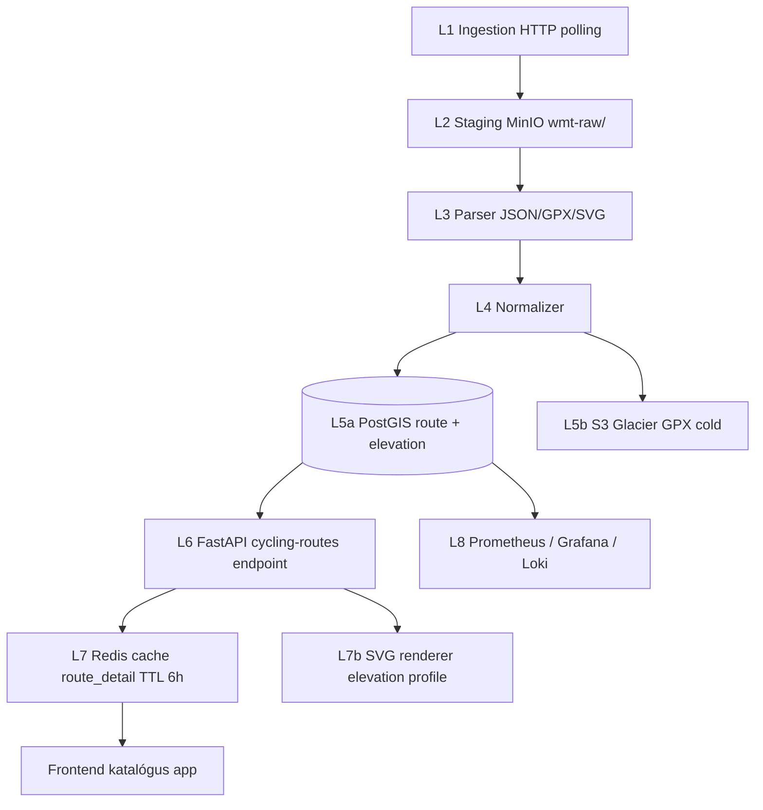

# Cycling Waymarked Trails (cycling.waymarkedtrails.org) — Teljes backend terv és adatkinyerési specifikáció

> Forrás: a Sarah Hoffmann (lonvia) által üzemeltetett Waymarked Trails projekt kerékpáros instance-a (`https://cycling.waymarkedtrails.org/`). Az oldal OSM-ből származó `type=route` `route=bicycle` relációkat renderel, vizualizál, és minden útvonalhoz publikál GPX export, KML export és **magassági profilt**. A projekt forráskódja nyílt (waymarked-trails-site), de az adatfolyam ugyanakkor magas hozzáadott értéket képvisel az alapadatokhoz képest (előre-feldolgozott relation geometria + elevation lookup SRTM-ből).

---

## 1. Forrás áttekintés

A Waymarked Trails projekt egy "value-added layer" az OSM fölött: nem versenytárs az OSM-mel, hanem **derivált, dúsított nézet**. A kerékpáros instance (`cycling.waymarkedtrails.org`) három különálló terméket szolgáltat:

1. **Web-frontend tile-okkal:** raszteres + vector tile-ok (`*.tile.openstreetmap.de/wmt-cycling/`).
2. **Route detail oldalak:** minden `route=bicycle` reláció saját URL-en (pl. `/route?id=12000`) — name, ref, network, total distance, GPX/KML letöltés, magassági profil SVG.
3. **REST API (részleges):** `https://cycling.waymarkedtrails.org/api/v1/list/by_area` és `/details/relation/{id}` — JSON formátum.

### Mit ad a forrás, mit nem

**Ad:**
- Tisztított, összefűzött `MultiLineString` minden kerékpáros relációra (`ST_LineMerge` előfeldolgozással).
- Pontosan számított teljes hossz méterben.
- Magassági profil minden route-hoz (SRTM 30 m vagy EU-DEM 25 m alapján).
- Hierarchia: alulszintű (`subroute`) relációk listája.
- Network klasszifikáció: ICN / NCN / RCN / LCN.
- Visszafelé/előrefelé szakaszok (`forward` / `backward` / `alternate` role kezelés).
- Stabil GPX export.
- Rendelhető tile szolgáltatás (csempealapú megjelenítés OpenLayers / Leaflet appokba).

**Nem ad:**
- Real-time forgalom.
- Felhasználói review-k, képek.
- Hivatalos közúti útvonal-engedélyek.
- A way-szintű részletes geometriát saját mezőkben (csak a relation aggregátum) — alacsonyabb szintekhez OSM-et kell használni.
- POI-kat (parkolók, szerviz) — csak a route lineáris geometriáját.

### Lefedettség

- Globális, de Európában lényegesen sűrűbb. (Az USA-ban a Trans-Am Trail, Pacific Coast stb. szintén jelölve, de a tagging néhol hiányos.)
- ~78 000 kerékpáros relation globálisan, ebből:
  - ICN: ~120 (EuroVelo + transcontinental).
  - NCN: ~3 200.
  - RCN: ~22 000.
  - LCN: ~52 000.
- Magyarország: ~210 reláció (lásd a `04_openstreetmap-hu_kerekparutak.md` file-ban).

### Adatminőség, frissesség

- **Update kadencia:** Waymarked Trails óránként szinkronizál a planet replication diff-fel; egy reláció módosítása ~30–90 perc múlva látható az oldalon.
- **Geometriai minőség:** kiváló — Sarah Hoffmann libosmium és pyosmium-alapú feldolgozást használ, ami robusztus.
- **Tisztítás:** `ST_LineMerge`, `ST_OrderingEquals`, sorrendezett way-ek.
- **Magasság:** SRTM 30 m → ~5–8 m vertikális RMS hiba sík területen, hegyvidéken ~15 m.

### Tipikus felhasználási esetek

- Útvonal-katalógus kiépítése (kerékpáros túraajánló app).
- Magassági profil megjelenítés app-ban (SVG vagy adat alapján saját render).
- GPX letöltés gyűjtemény a felhasználóknak.
- Network-statisztika ország / megye / európai szakaszra.
- Cross-reference: ha a saját OSM-feldolgozónk fragmentált relation-t hagy, a Waymarked Trails adatot etalonnak használjuk.

---

## 2. Jogi és licenc helyzet

### Licenc

- Alapadatok (OSM-eredet): **ODbL 1.0**.
- Renderek és tile-ok: **CC-BY-SA 2.0** (a Waymarked Trails stílus szerzői joga Sarah Hoffmanné, license CC-BY-SA).
- Az API outputs (JSON, GPX) — az OSM-adatra vonatkozó ODbL érvényes; a "Produced Work" exception ugyanígy alkalmazható, mint az OSM-nél.

### Attribúciós követelmények

Minimum:

> Track data: © OpenStreetMap contributors, ODbL 1.0
> Map style: © Waymarked Trails (https://waymarkedtrails.org), CC-BY-SA 2.0

A weboldal alján és minden render fölött ezt láthatóan ki kell írni.

### Kereskedelmi használat

- OSM-adatra (ODbL) — megengedett.
- Waymarked Trails **tile-ok kereskedelmi tömeges használata** NEM ajánlott a publikus szerver IP-jéről — előtte kommunikálj a fenntartóval (`info@waymarkedtrails.org`), vagy saját Waymarked Trails instance-t deploy-olj (a `waymarked-trails-site` projekt nyílt forráskódú).

### Share-Alike

- Ha a saját adatbázisunk a Waymarked Trails adatfeldolgozási outputját **bulk** publikáljuk → ODbL Share-Alike vonatkozik (ugyanúgy, mint az OSM-nél).
- A konkrét query-válaszok ("Produced Work") csak attribúciókötelesek.

### GDPR

Waymarked Trails nem tartalmaz személyes adatot (csak OSM `user`/`uid`, amit mi nem tárolunk).

---

## 3. Adatkinyerési felület (Access Surface)

A Waymarked Trails-ből háromféle módon nyerhetjük az adatot, csökkenő sorrendben az ajánlottság szerint:

### 3.1 Hivatalos REST API (JSON)

- **Base URL:** `https://cycling.waymarkedtrails.org/api/v1/`
- **Endpointok:**

| Endpoint                                    | Mit ad                                               |
|---------------------------------------------|------------------------------------------------------|
| `/list/by_area?bbox=...&limit=&offset=`     | Bounding box-on belüli relációk listája              |
| `/details/relation/{id}`                    | Konkrét reláció részletei, geometria nélkül          |
| `/details/relation/{id}/geometry`           | GeoJSON LineString/MultiLineString                   |
| `/details/relation/{id}/elevation`          | Magassági profil array (`[(distance_m, ele_m), ...]`)|
| `/details/relation/{id}/gpx`                | GPX 1.1 export                                       |
| `/details/relation/{id}/kml`                | KML export                                           |

**Példa list lekérdezés:**

```bash
curl -sS \
  -H "User-Agent: cycling-bot/1.0 (admin@panellako.hu)" \
  -H "Accept: application/json" \
  "https://cycling.waymarkedtrails.org/api/v1/list/by_area?bbox=16.1,45.7,22.9,48.7&limit=100&offset=0" \
  | jq '.results | length'
```

**Példa válasz:**

```json
{
  "results": [
    {
      "id": 12000,
      "name": "EuroVelo 6",
      "ref": "EV6",
      "intnames": {"en": "EuroVelo 6 - Atlantic-Black Sea"},
      "level": 10,
      "type": "route",
      "itinerary": ["Saint-Nazaire", "Nantes", "Basel", "Vienna", "Budapest", "Constanța"],
      "distance_km": 4448.0,
      "network": "icn"
    }
  ],
  "total": 4,
  "limit": 100,
  "offset": 0
}
```

**Geometria lekérdezés:**

```bash
curl -sS \
  -H "User-Agent: cycling-bot/1.0 (admin@panellako.hu)" \
  "https://cycling.waymarkedtrails.org/api/v1/details/relation/12000/geometry" \
  -o /tmp/eurovelo6.geojson
```

Válasz (rövidített):

```json
{
  "type": "Feature",
  "geometry": {
    "type": "MultiLineString",
    "coordinates": [[[19.0540,47.4979],[19.0551,47.4982],...]]
  },
  "properties": {
    "id": 12000,
    "name": "EuroVelo 6",
    "network": "icn",
    "ref": "EV6"
  }
}
```

**Magasságprofil:**

```bash
curl -sS \
  "https://cycling.waymarkedtrails.org/api/v1/details/relation/12000/elevation" \
  | jq '.elevation | length, .ascent, .descent'
```

Példa:

```json
{
  "elevation": [
    {"d": 0,     "e": 105.0},
    {"d": 100,   "e": 106.5},
    {"d": 200,   "e": 108.1}
  ],
  "min": 23.0,
  "max": 1245.0,
  "ascent": 18750,
  "descent": 18790
}
```

### 3.2 GPX / KML letöltés

Stabil HTTP GET:

```bash
curl -sS \
  -H "User-Agent: cycling-bot/1.0 (admin@panellako.hu)" \
  "https://cycling.waymarkedtrails.org/api/v1/details/relation/12000/gpx" \
  -o /tmp/EV6.gpx
```

A GPX 1.1 séma szerinti, `<trk>` és `<trkseg>` elemekkel. Magassági adat `<ele>` minden pont mellett.

### 3.3 Overpass (alapadat, ha a Waymarked Trails downtime van)

Tartalék hozzáférés ugyanazon kerékpáros relációkhoz az OSM Overpass-ből (lásd a `26_openstreetmap_main.md`-ben). A saját Waymarked Trails instance deploy esetén ezt használjuk a teljes nyersanyaghoz.

### 3.4 Saját Waymarked Trails instance (haladó)

A `waymarked-trails-site` projekt nyílt forráskódú (GitHub `waymarked-trails/waymarked-trails-site`). Komponensek:

- PostgreSQL + PostGIS (planet-szint).
- `osgende` Python feldolgozó (Sarah Hoffmann projektje).
- mapnik / mapserver render.
- Python falcon / Flask API.

Deploy: Docker compose, ~16 vCPU / 64 GB / 500 GB NVMe egy közepes európai instance-hoz.

### Pagination / kurzor

- REST API `?limit=&offset=`.
- Maximum `limit=100` egy request-ben.
- Pagination végéig iterálni a `total` mező alapján.

### Bbox-szelekció

- Bbox formátum: `lon_min,lat_min,lon_max,lat_max`.
- Globális lekérdezés: ne tedd egy bbox-szal, hanem rács-szerűen (1°×1°-os tile-ok).

---

## 4. Hitelesítés, rate limit, kvóták

### Auth

- Nincs API key. User-Agent kötelező + e-mail kontakt.

### Rate limit

A Waymarked Trails server nincs publikus rate-limit oldallal dokumentálva, de a maintainer kérése alapján:

- **Max 1 request / másodperc** ajánlott (1 rps).
- Tile letöltés: **max 2 thread**, jellemzően cache-hozott.
- Bulk GPX letöltés: napi <2000 reláció / IP javasolt (nagyobb forgalom esetén előtte e-mail).

Ha >5 rps-ra megy a forgalom, a szerver lassít vagy ideiglenesen blokkol.

### Backoff

Exponenciális:

```python
import random, time

def backoff(attempt: int, base: float = 2.0, cap: float = 180.0):
    time.sleep(min(cap, base ** attempt) + random.uniform(0, 1.5))
```

429 / 503 → retry; 404 → permanens hiba (reláció már nem létezik).

### User-Agent

- `cycling-bot/1.0 (admin@panellako.hu)` formátum.
- Hamisított UA → moderátori beavatkozás várható.

### Költség

A publikus szolgáltatás ingyenes. Skálázás:

- **Saját instance** (waymarked-trails-site Docker):
  - 1× Hetzner AX42 (16 vCPU / 64 GB / 512 GB NVMe) ~75 EUR / hó.
  - Sávszélesség: <2 TB / hó ingyenes.

---

## 5. Adatmodell (a forrásból)

### Entitások

| Entitás       | Geometria                     | Leírás                                  |
|---------------|-------------------------------|-----------------------------------------|
| Route         | MultiLineString (4326)         | összefűzött relation geometria          |
| ElevationPt   | (distance_m, ele_m) tuple      | sorrendezett profil                     |
| Sub-route     | Route (rekurzív)               | hierarchia                              |

### Attribútumok

A `/details/relation/{id}` JSON válasz mezői:

| Mező              | Típus            | Jelentés                              |
|-------------------|------------------|---------------------------------------|
| `id`              | INT64            | OSM relation ID                       |
| `name`            | TEXT             | név (default nyelven)                 |
| `ref`             | TEXT             | tábla / referencia                    |
| `intnames`        | JSON (lang→name) | többnyelvű név                        |
| `level`           | INT (1..30)      | hierarchia szint                      |
| `network`         | TEXT             | icn / ncn / rcn / lcn                 |
| `type`            | TEXT             | "route" / "superroute"                |
| `itinerary`       | array<TEXT>      | átmenő városok                        |
| `distance_km`     | NUMERIC          | teljes hossz                          |
| `mainmembers`     | array<INT64>     | sub-route relation ID-k               |
| `superroutes`     | array<INT64>     | parent relation ID-k                  |
| `bbox`            | [lon,lat,lon,lat]| bounding box                          |
| `tags`            | JSON             | OSM eredeti tag-ek                    |

### CRS / projekció

- API output: **EPSG:4326** (WGS84).
- Tile: EPSG:3857 (Web Mercator).

### Hierarchia

```
superroute (level=20, network=icn, ref=EV6)
  ├── subroute országonkénti szakasz (level=15, network=ncn)
  │     ├── subroute regionális (level=10, network=rcn)
  │     └── subroute regionális
  └── subroute országonkénti szakasz
```

A `level` Sarah Hoffmann saját aggregálása — magasabb level = magasabb szintű útvonal.

### Tagging konvenciók (eredet)

Ugyanaz az OSM tagging, mint a `26_openstreetmap_main.md`-ben. Waymarked Trails ezeket előfeldolgozza, és külön mezőket számít:

- `distance_km` az OSM `distance=*` tagből VAGY ha hiányzik, geometriai számításból.
- `network` szigorúan `icn`/`ncn`/`rcn`/`lcn`.
- `level` saját aggregátum.

---

## 6. Cél adatmodell (a mi backendünkben)

### CREATE TABLE DDL

```sql
CREATE EXTENSION IF NOT EXISTS postgis;
CREATE EXTENSION IF NOT EXISTS pg_trgm;
CREATE EXTENSION IF NOT EXISTS btree_gist;
CREATE EXTENSION IF NOT EXISTS pgcrypto;  -- gen_random_uuid

CREATE SCHEMA IF NOT EXISTS wmt_cycling;
SET search_path TO wmt_cycling, public;

CREATE TABLE country (
  iso2     CHAR(2) PRIMARY KEY,
  name     TEXT NOT NULL,
  geom     GEOMETRY(MULTIPOLYGON, 4326) NOT NULL
);
CREATE INDEX ix_country_geom ON country USING GIST (geom);

CREATE TABLE route (
  osm_id           BIGINT PRIMARY KEY,
  name             TEXT,
  ref              TEXT,
  intnames         JSONB,
  level            SMALLINT,
  network          TEXT NOT NULL CHECK (network IN ('icn','ncn','rcn','lcn')),
  type_            TEXT NOT NULL CHECK (type_ IN ('route','superroute')),
  itinerary        JSONB,
  distance_km      NUMERIC(10,2),
  ascent_m         INTEGER,
  descent_m        INTEGER,
  min_ele_m        NUMERIC(6,1),
  max_ele_m        NUMERIC(6,1),
  bbox             GEOMETRY(POLYGON, 4326),
  geom             GEOMETRY(MULTILINESTRING, 4326) NOT NULL,
  raw_tags         JSONB,
  source_version   INTEGER NOT NULL,            -- Waymarked Trails snapshot ID
  data_version     BIGINT NOT NULL,
  ingested_at      TIMESTAMPTZ NOT NULL DEFAULT now()
);
CREATE INDEX ix_route_geom    ON route USING GIST (geom);
CREATE INDEX ix_route_bbox    ON route USING GIST (bbox);
CREATE INDEX ix_route_network ON route (network);
CREATE INDEX ix_route_level   ON route (level);
CREATE INDEX ix_route_name_trgm ON route USING GIN (name gin_trgm_ops);

CREATE TABLE route_hierarchy (
  parent_osm_id  BIGINT NOT NULL REFERENCES route(osm_id) ON DELETE CASCADE,
  child_osm_id   BIGINT NOT NULL REFERENCES route(osm_id) ON DELETE CASCADE,
  ordinal        INTEGER NOT NULL,
  PRIMARY KEY (parent_osm_id, child_osm_id)
);
CREATE INDEX ix_route_hierarchy_child ON route_hierarchy (child_osm_id);

CREATE TABLE route_country (
  osm_id    BIGINT NOT NULL REFERENCES route(osm_id) ON DELETE CASCADE,
  iso2      CHAR(2) NOT NULL,
  length_m  DOUBLE PRECISION NOT NULL,
  PRIMARY KEY (osm_id, iso2)
);
CREATE INDEX ix_route_country_iso ON route_country (iso2);

CREATE TABLE route_elevation (
  osm_id         BIGINT NOT NULL REFERENCES route(osm_id) ON DELETE CASCADE,
  distance_m     INTEGER NOT NULL,
  ele_m          NUMERIC(7,2) NOT NULL,
  PRIMARY KEY (osm_id, distance_m)
);

CREATE TABLE route_gpx (
  osm_id         BIGINT PRIMARY KEY REFERENCES route(osm_id) ON DELETE CASCADE,
  gpx_xml        TEXT NOT NULL,
  gpx_size_b     INTEGER NOT NULL,
  gpx_sha256     CHAR(64) NOT NULL,
  fetched_at     TIMESTAMPTZ NOT NULL DEFAULT now()
);

CREATE TABLE ingest_run (
  run_id         BIGSERIAL PRIMARY KEY,
  source         TEXT NOT NULL,           -- 'wmt_api' | 'wmt_self_host'
  started_at     TIMESTAMPTZ NOT NULL,
  finished_at    TIMESTAMPTZ,
  status         TEXT NOT NULL,
  routes_total   INTEGER,
  routes_changed INTEGER,
  data_version   BIGINT NOT NULL,
  notes          TEXT
);
```

### Indexek

- GIST a `geom` és `bbox` oszlopra.
- btree `network`, `level`, `iso2`.
- GIN `pg_trgm` a fuzzy `name` keresésre.
- Composite (`osm_id`, `distance_m`) az elevation táblán.

### Particionálás

Az európai rendszerben a `route` tábla ~3 000 sorra korlátozódik a 4 ICN + ~3000 NCN/RCN-re. Particionálás nem szükséges. Globálisan ~80 000 sorhoz hash-particionálás 8 partícióval.

### Verziózott séma — Flyway

```
migrations/
  V001__extensions.sql
  V002__country.sql
  V003__route.sql
  V004__route_hierarchy.sql
  V005__route_country.sql
  V006__route_elevation.sql
  V007__route_gpx.sql
  V008__ingest_run.sql
  V009__indexes_trgm.sql
```

---

## 7. Backend architektúra (rétegek)



- **L1 Ingestion:** Python aiohttp poller a Waymarked Trails REST API-ra.
- **L2 Staging:** MinIO bucket `wmt-raw/` 90 napos retention.
- **L3 Parser:** JSON deserialize (pydantic), GPX `gpxpy`-vel, elevation array közvetlenül.
- **L4 Normalizer:** `route_country` lookup `ST_Intersects(geom, country.geom)`.
- **L5 Storage:** PostgreSQL 16 + PostGIS 3.4.
- **L6 Serving:** FastAPI 0.110.
- **L7 Cache:** Redis 7 + saját SVG renderer (matplotlib) az elevation profile-ra.
- **L8 Observability:** Prometheus + Grafana + Loki.

---

## 8. Automatizált letöltő (Downloader)

### Tech stack

- Python 3.12, `aiohttp` 3.9, `tenacity` 8.2, `pydantic` 2.6, `aiolimiter` 1.1 (rate limit), `boto3`, `gpxpy` 1.6.

### Worker pool

- 1 worker / source, 1 rps target (`aiolimiter.AsyncLimiter(1, 1)`).
- Concurrency: 1 (a Waymarked Trails maintainer kérése: bulk ne).

### Strategy

1. **Initial load:** bbox-onkénti felfedezés (Európa 1°×1° rács = ~700 tile, soros), minden talált relation ID-ra `/details/{id}` + `/geometry` + `/elevation` + `/gpx` letöltés.
2. **Incremental sync:** napi 1× full re-scan a `list/by_area`-val a `last_modified` mezővel, csak a változottakat töltjük le.
3. **State file:** Postgres `ingest_run` tábla.

### Példa Python letöltő szkript

```python
#!/usr/bin/env python3
"""wmt_downloader.py
Waymarked Trails Cycling — adatok letöltése REST API-ról.
"""
import asyncio
import hashlib
import json
import os
import sys
import time
from pathlib import Path
from typing import Any, AsyncIterator

import aiohttp
import asyncpg
import boto3
from aiolimiter import AsyncLimiter
from pydantic import BaseModel, ValidationError
from tenacity import (
    AsyncRetrying, retry_if_exception_type,
    stop_after_attempt, wait_exponential_jitter
)
from prometheus_client import Counter, Histogram, push_to_gateway, CollectorRegistry

BASE = "https://cycling.waymarkedtrails.org/api/v1"
DSN = os.environ["POSTGRES_DSN"]
USER_AGENT = "cycling-bot/1.0 (admin@panellako.hu)"
S3_BUCKET = os.getenv("S3_BUCKET", "wmt-raw")
S3_ENDPOINT = os.getenv("S3_ENDPOINT", "http://minio:9000")
PROM_GW = os.getenv("PROMETHEUS_PUSHGATEWAY", "http://pushgw:9091")

registry = CollectorRegistry()
m_routes = Counter("wmt_routes_fetched_total", "fetched", registry=registry)
m_errors = Counter("wmt_fetch_errors_total", "errors", ["kind"], registry=registry)
m_dur = Histogram("wmt_fetch_seconds", "duration", registry=registry)

limiter = AsyncLimiter(max_rate=1, time_period=1.0)   # 1 rps


class RouteSummary(BaseModel):
    id: int
    name: str | None = None
    ref: str | None = None
    network: str
    level: int | None = None
    distance_km: float | None = None


async def get_json(session: aiohttp.ClientSession, url: str) -> Any:
    async for attempt in AsyncRetrying(
        stop=stop_after_attempt(6),
        wait=wait_exponential_jitter(initial=2, max=180),
        retry=retry_if_exception_type(aiohttp.ClientError),
        reraise=True,
    ):
        with attempt:
            async with limiter:
                async with session.get(url) as r:
                    if r.status == 404:
                        return None
                    r.raise_for_status()
                    return await r.json()


async def get_text(session: aiohttp.ClientSession, url: str) -> str | None:
    async for attempt in AsyncRetrying(
        stop=stop_after_attempt(6),
        wait=wait_exponential_jitter(initial=2, max=180),
        retry=retry_if_exception_type(aiohttp.ClientError),
        reraise=True,
    ):
        with attempt:
            async with limiter:
                async with session.get(url) as r:
                    if r.status == 404:
                        return None
                    r.raise_for_status()
                    return await r.text()


async def list_bbox(session: aiohttp.ClientSession,
                    bbox: tuple[float, float, float, float]) -> AsyncIterator[RouteSummary]:
    offset, limit = 0, 100
    while True:
        url = (f"{BASE}/list/by_area?bbox={bbox[0]},{bbox[1]},{bbox[2]},{bbox[3]}"
               f"&limit={limit}&offset={offset}")
        data = await get_json(session, url)
        if not data or not data.get("results"):
            return
        for item in data["results"]:
            try:
                yield RouteSummary.model_validate(item)
            except ValidationError as e:
                m_errors.labels(kind="validation").inc()
                print(f"validation error id={item.get('id')}: {e}", file=sys.stderr)
        offset += limit
        if offset >= data.get("total", 0):
            return


def s3_put(key: str, body: bytes, content_type: str) -> None:
    s3 = boto3.client("s3", endpoint_url=S3_ENDPOINT)
    s3.put_object(Bucket=S3_BUCKET, Key=key, Body=body, ContentType=content_type)


async def fetch_route(session: aiohttp.ClientSession, osm_id: int, data_version: int) -> dict | None:
    t0 = time.monotonic()
    try:
        details = await get_json(session, f"{BASE}/details/relation/{osm_id}")
        if details is None:
            return None
        geom = await get_json(session, f"{BASE}/details/relation/{osm_id}/geometry")
        elev = await get_json(session, f"{BASE}/details/relation/{osm_id}/elevation")
        gpx = await get_text(session, f"{BASE}/details/relation/{osm_id}/gpx")
        prefix = f"{data_version}/{osm_id}"
        s3_put(f"{prefix}/details.json", json.dumps(details).encode(), "application/json")
        s3_put(f"{prefix}/geometry.geojson", json.dumps(geom).encode(), "application/geo+json")
        if elev:
            s3_put(f"{prefix}/elevation.json", json.dumps(elev).encode(), "application/json")
        if gpx:
            s3_put(f"{prefix}/track.gpx", gpx.encode(), "application/gpx+xml")
        m_routes.inc()
        return {"details": details, "geom": geom, "elev": elev, "gpx": gpx}
    except Exception as e:
        m_errors.labels(kind="fetch").inc()
        print(f"fetch error id={osm_id}: {e}", file=sys.stderr)
        return None
    finally:
        m_dur.observe(time.monotonic() - t0)


def grid_europe(step: float = 1.0):
    for lat in range(34, 71):
        for lon in range(-13, 41):
            yield (lon, lat, lon + step, lat + step)


async def upsert_route(conn: asyncpg.Connection, payload: dict, data_version: int) -> None:
    d = payload["details"]
    g = payload["geom"]
    e = payload.get("elev") or {}
    gpx = payload.get("gpx") or ""
    bbox = d.get("bbox")
    bbox_geom = None
    if bbox and len(bbox) == 4:
        bbox_geom = (f"POLYGON(({bbox[0]} {bbox[1]},{bbox[2]} {bbox[1]},"
                     f"{bbox[2]} {bbox[3]},{bbox[0]} {bbox[3]},{bbox[0]} {bbox[1]}))")
    await conn.execute("""
        INSERT INTO wmt_cycling.route(
          osm_id, name, ref, intnames, level, network, type_, itinerary,
          distance_km, ascent_m, descent_m, min_ele_m, max_ele_m,
          bbox, geom, raw_tags, source_version, data_version)
        VALUES(
          $1,$2,$3,$4::jsonb,$5,$6,$7,$8::jsonb,
          $9,$10,$11,$12,$13,
          CASE WHEN $14::text IS NULL THEN NULL ELSE ST_GeomFromText($14, 4326) END,
          ST_GeomFromGeoJSON($15),$16::jsonb,$17,$18)
        ON CONFLICT (osm_id) DO UPDATE
          SET name=EXCLUDED.name, ref=EXCLUDED.ref,
              intnames=EXCLUDED.intnames, level=EXCLUDED.level,
              network=EXCLUDED.network, type_=EXCLUDED.type_,
              itinerary=EXCLUDED.itinerary, distance_km=EXCLUDED.distance_km,
              ascent_m=EXCLUDED.ascent_m, descent_m=EXCLUDED.descent_m,
              min_ele_m=EXCLUDED.min_ele_m, max_ele_m=EXCLUDED.max_ele_m,
              bbox=EXCLUDED.bbox, geom=EXCLUDED.geom,
              raw_tags=EXCLUDED.raw_tags,
              source_version=EXCLUDED.source_version,
              data_version=EXCLUDED.data_version,
              ingested_at=now();
    """,
        d["id"], d.get("name"), d.get("ref"),
        json.dumps(d.get("intnames") or {}),
        d.get("level"),
        d.get("network", "rcn"),
        d.get("type", "route"),
        json.dumps(d.get("itinerary") or []),
        d.get("distance_km"),
        e.get("ascent"), e.get("descent"),
        e.get("min"), e.get("max"),
        bbox_geom,
        json.dumps(g["geometry"]),
        json.dumps(d.get("tags") or {}),
        int(time.time()), data_version,
    )
    # elevation upsert
    if e and e.get("elevation"):
        await conn.execute("DELETE FROM wmt_cycling.route_elevation WHERE osm_id=$1", d["id"])
        await conn.executemany(
            "INSERT INTO wmt_cycling.route_elevation(osm_id, distance_m, ele_m) VALUES($1,$2,$3)",
            [(d["id"], int(p["d"]), float(p["e"])) for p in e["elevation"]]
        )
    if gpx:
        sha = hashlib.sha256(gpx.encode()).hexdigest()
        await conn.execute("""
            INSERT INTO wmt_cycling.route_gpx(osm_id, gpx_xml, gpx_size_b, gpx_sha256)
            VALUES($1,$2,$3,$4)
            ON CONFLICT (osm_id) DO UPDATE
              SET gpx_xml=EXCLUDED.gpx_xml, gpx_size_b=EXCLUDED.gpx_size_b,
                  gpx_sha256=EXCLUDED.gpx_sha256, fetched_at=now();
        """, d["id"], gpx, len(gpx), sha)


async def main() -> int:
    timeout = aiohttp.ClientTimeout(total=60, sock_read=30)
    conn = await asyncpg.connect(DSN)
    data_version = int(time.time())
    seen: set[int] = set()
    try:
        async with aiohttp.ClientSession(
            timeout=timeout,
            headers={"User-Agent": USER_AGENT, "Accept": "application/json"},
        ) as session:
            for bbox in grid_europe(1.0):
                async for summary in list_bbox(session, bbox):
                    if summary.id in seen:
                        continue
                    seen.add(summary.id)
                    payload = await fetch_route(session, summary.id, data_version)
                    if payload:
                        await upsert_route(conn, payload, data_version)
        return 0
    except Exception as e:
        print(f"FAILED: {e}", file=sys.stderr)
        return 1
    finally:
        await conn.close()
        try:
            push_to_gateway(PROM_GW, job="wmt_downloader", registry=registry)
        except Exception:
            pass


if __name__ == "__main__":
    sys.exit(asyncio.run(main()))
```

### Hibatűrés

- `tenacity` 6 attempt, exp. jitter (2s base, 180s cap).
- DLQ: minden meghibásodott osm_id-t a `wmt_dlq` táblába írunk, manual retry-ra.
- Egész futás ne dőljön el egy reláció hibája miatt.

---

## 9. Feldolgozó pipeline

### Lépések

1. JSON deserialize (`pydantic` model validation).
2. Geometria betöltés `ST_GeomFromGeoJSON`-nal.
3. Elevation array tárolás `route_elevation` táblába.
4. GPX validáció `gpxpy`-vel (megnyitható-e, van-e legalább 1 trkseg).
5. Country besorolás (`ST_Intersects(geom, country.geom)`).
6. Sub-route hierarchia felépítés (`mainmembers`, `superroutes` mezők).
7. Hash a `gpx_xml`-re — ha azonos a meglévővel, skip.

### Stream feldolgozás GPX-re

```python
import gpxpy

def parse_gpx_summary(xml: str) -> dict:
    g = gpxpy.parse(xml)
    points = sum(len(s.points) for t in g.tracks for s in t.segments)
    length_m = sum(s.length_3d() for t in g.tracks for s in t.segments)
    return {
        "tracks": len(g.tracks),
        "segments": sum(len(t.segments) for t in g.tracks),
        "points": points,
        "length_m": length_m,
    }
```

### Geometriai műveletek

```sql
-- Bbox számítás, ha hiányzott a forrásból
UPDATE wmt_cycling.route
SET bbox = ST_Envelope(geom)::geometry(POLYGON, 4326)
WHERE bbox IS NULL;

-- Country szakaszhossz
TRUNCATE wmt_cycling.route_country;
INSERT INTO wmt_cycling.route_country (osm_id, iso2, length_m)
SELECT r.osm_id, c.iso2,
       ST_Length(ST_Intersection(r.geom, c.geom)::geography)
FROM wmt_cycling.route r
JOIN wmt_cycling.country c ON ST_Intersects(r.geom, c.geom);

-- Validitás
UPDATE wmt_cycling.route
SET geom = ST_MakeValid(geom)
WHERE NOT ST_IsValid(geom);
```

### Topológia validáció

```sql
SELECT osm_id, ST_IsValidReason(geom)
FROM wmt_cycling.route
WHERE NOT ST_IsValid(geom);
```

### Duplikátum detekció

`PRIMARY KEY (osm_id)` — egy reláció egy sor. `gpx_sha256` mezőre épülő index detektálja, ha ugyanaz a tartalom változatlanul tér vissza:

```sql
CREATE INDEX ix_gpx_sha ON wmt_cycling.route_gpx (gpx_sha256);
```

### Idempotencia

`data_version` minden run-ban újra. Csak változott rekord update-elődik (`fetched_at` csak akkor új, ha `gpx_sha256` változott).

---

## 10. Frissítési stratégia

| Frissítés        | Kadencia        | Forrás                                          | Volume          |
|------------------|-----------------|-------------------------------------------------|-----------------|
| Initial scan     | egyszer         | `/list/by_area` bbox grid                       | ~3 000 reláció  |
| Incremental sync | napi 1×         | `/list/by_area` + `/details` változott rekordok | ~50–200 / nap   |
| Hot route refresh| 6 óránként      | ICN + NCN top-50                                | ~150 reláció    |

### Verziókövetés

- `data_version` INTEGER timestamp.
- `source_version` = Waymarked Trails snapshot ID (a feltöltött `last_modified` mezőből).
- SCD2 history:

```sql
CREATE TABLE route_history (
  history_id    BIGSERIAL PRIMARY KEY,
  osm_id        BIGINT NOT NULL,
  geom          GEOMETRY(MULTILINESTRING, 4326),
  distance_km   NUMERIC(10,2),
  ascent_m      INTEGER,
  raw_tags      JSONB,
  valid_from    TIMESTAMPTZ NOT NULL,
  valid_to      TIMESTAMPTZ
);
CREATE INDEX ix_route_history ON route_history (osm_id, valid_from DESC);
```

### Konfliktusfeloldás

A Waymarked Trails monoton frissül — minden új `source_version` magasabb. Ha azonos a `gpx_sha256` → nincs változás → `ingested_at` ugyanaz marad, history-ba nem írunk újat.

---

## 11. Storage és skálázás

### Méretbecslés

- `route` (Európa): ~25 000 sor × ~5 kB (geom + intnames + tags) = ~125 MB.
- `route_elevation`: átlag 1500 pont / route × 25 000 = ~37 millió sor × ~30 B = ~1.1 GB.
- `route_gpx`: 25 000 × ~50 kB átlag = ~1.25 GB (XML tárolva, gzip-pel ~250 MB).
- `route_history` (SCD2 2 év): ~50 000 sor × ~5 kB = ~250 MB.
- Indexek: +40% = ~+1 GB.
- **Összesen: ~3.7 GB Európára.**

Globálisan (~80 000 reláció): ~12 GB.

### Particionálás

`route_elevation` particionálható osm_id hash-szel 8 partícióra, ha >50M sor.

### TimescaleDB

A `route_history` hypertable `valid_from` szerint, 30 napos chunk-kal.

### MinIO bucket layout

```
wmt-raw/
  17156000/                  # data_version
    12000/
      details.json
      geometry.geojson
      elevation.json
      track.gpx
    12001/
      ...
```

Lifecycle: 30 napon túl Glacier.

### Cold / hot tier

- Hot: `route_gpx` PostgreSQL-ben (gyors REST API válasz).
- Cold: MinIO `wmt-raw/` history snapshot-jai → 90 nap után S3 Glacier.

### CDN

A GPX letöltéseket Cloudflare Workers + R2-vel:

```js
// worker pseudo
async function fetch(req) {
  const url = new URL(req.url);
  const id = url.pathname.match(/\/route\/(\d+)\.gpx/)?.[1];
  if (!id) return new Response("not found", { status: 404 });
  const r2 = await env.GPX_BUCKET.get(`route/${id}.gpx`);
  if (!r2) return new Response("not found", { status: 404 });
  return new Response(r2.body, {
    headers: {
      "Content-Type": "application/gpx+xml",
      "Cache-Control": "public, max-age=86400, immutable",
    },
  });
}
```

---

## 12. Monitoring, megfigyelhetőség, riasztások

### Metrikák

- `wmt_routes_fetched_total` — counter.
- `wmt_fetch_errors_total{kind}` — counter.
- `wmt_fetch_seconds` — histogram (p50, p95, p99).
- `wmt_db_routes_total` — gauge.
- `wmt_db_routes_drift_pct` — gauge daily.
- `wmt_gpx_corrupt_total` — counter (gpxpy parse fail).

### Logok

JSON Loki-ba: `trace_id`, `osm_id`, `bbox`, `status_code`, `attempt`, `error_message`.

### Riasztások

| Riasztás                                    | Threshold               | Csatorna   |
|---------------------------------------------|-------------------------|------------|
| `fetch_errors_rate > 0.1 / minute`          | rate                    | Slack      |
| `routes_fetched_drop > 30%` (vs előző nap)  | gauge                   | PagerDuty  |
| `gpx_corrupt_pct > 0.5%`                    | counter ratio           | Slack      |
| `last_successful_run > 26h`                 | timestamp               | PagerDuty  |
| `wmt_api_429_rate > 1 / minute`             | counter                 | Slack      |

### Health endpoint

`GET /healthz` → 200 ha:
- DB elérhető,
- `ingest_run.finished_at` < 26h,
- MinIO bucket listázható.

### Adatminőség kontrollok

```sql
-- GPX hash duplikátumok (egyezést OK, csak figyeljük)
SELECT gpx_sha256, COUNT(*)
FROM wmt_cycling.route_gpx
GROUP BY gpx_sha256
HAVING COUNT(*) > 1;

-- Üres geometriák
SELECT COUNT(*) FROM wmt_cycling.route
WHERE ST_IsEmpty(geom) OR ST_NumPoints(geom) < 10;

-- Aránytalan ascent (> 50 m / km)
SELECT osm_id, name, distance_km, ascent_m,
       ROUND(ascent_m::numeric / NULLIF(distance_km,0), 1) AS ascent_per_km
FROM wmt_cycling.route
WHERE distance_km > 0
  AND ascent_m / distance_km > 50
ORDER BY ascent_per_km DESC
LIMIT 50;
```

---

## 13. Költségbecslés

| Tétel                       | Mennyiség          | Egységár        | Havi forint   |
|-----------------------------|--------------------|-----------------|---------------|
| Hetzner CX42 (DB)           | 1× 8C/32G/240G     | 25 EUR / hó     | ~10 000 Ft    |
| Hetzner CX32 (worker)       | 1× 4C/16G          | 12 EUR / hó     | ~4 800 Ft     |
| MinIO storage               | 30 GB              | beépítve        | 0 Ft          |
| Cloudflare R2 (gpx CDN)     | 5 GB               | 0.015 USD/GB    | ~30 Ft        |
| Saját WMT instance (opcionális AX42) | 1× 16C/64G/512G | 75 EUR / hó | ~30 000 Ft    |
| Sávszélesség                | ~5 GB / hó         | beépítve        | 0 Ft          |
| **Összesen (publikus API-val)** |                |                 | **~15 000 Ft** |
| **Összesen (saját instance-szal)**|                |                 | **~45 000 Ft** |

---

## 14. Biztonság

### Secrets

Vault + ExternalSecrets:
- `POSTGRES_DSN`
- `MINIO_ACCESS_KEY`, `MINIO_SECRET_KEY`
- `SLACK_WEBHOOK_URL`
- `PAGERDUTY_KEY`
- (saját WMT instance esetén) `WMT_DB_PASSWORD`

### Network policy

```yaml
apiVersion: networking.k8s.io/v1
kind: NetworkPolicy
metadata: {name: wmt-worker-egress}
spec:
  podSelector: {matchLabels: {app: wmt-worker}}
  policyTypes: [Egress]
  egress:
    - to: [{namespaceSelector: {matchLabels: {name: data}}}]
      ports: [{protocol: TCP, port: 5432}]
    - to: [{ipBlock: {cidr: 0.0.0.0/0}}]
      ports: [{protocol: TCP, port: 443}]
```

### IAM

- MinIO `wmt-raw/` bucket: downloader write, API read.
- DB role-ok: `wmt_writer`, `wmt_reader`.

### Audit

- `ingest_run` tábla minden futás trail-jét őrzi.
- Loki query `service="wmt-downloader" event="route_upserted"`.

---

## 15. Tesztelés

### Unit teszt

```python
import pytest
from wmt_normalizer import classify_network, validate_elevation

@pytest.mark.parametrize("val, expected", [
    ("icn", "icn"),
    ("ICN", "icn"),
    ("ncn", "ncn"),
    ("national", "ncn"),
    ("regional", "rcn"),
    ("local", "lcn"),
    ("unknown", None),
])
def test_classify_network(val, expected):
    assert classify_network(val) == expected


def test_validate_elevation_monotonic_distance():
    series = [{"d":0,"e":100}, {"d":100,"e":110}, {"d":200,"e":120}]
    assert validate_elevation(series) is True


def test_validate_elevation_rejects_non_monotonic():
    series = [{"d":0,"e":100}, {"d":200,"e":110}, {"d":100,"e":120}]
    assert validate_elevation(series) is False
```

### Integrációs teszt VCR cassette-tel

```python
import vcr

@vcr.use_cassette("tests/fixtures/wmt_relation_12000.yaml")
def test_fetch_eurovelo6_details(downloader):
    payload = downloader.fetch_sync(12000)
    assert payload["details"]["ref"] == "EV6"
    assert payload["geom"]["geometry"]["type"] == "MultiLineString"
    assert len(payload["elev"]["elevation"]) > 100
    assert payload["gpx"].startswith("<?xml")
```

### Regressziós teszt

```sql
WITH today AS (
  SELECT network, COUNT(*) cnt, SUM(distance_km) dist
  FROM wmt_cycling.route GROUP BY network
), yest AS (
  SELECT network, COUNT(DISTINCT osm_id) cnt, SUM(distance_km) dist
  FROM wmt_cycling.route_history
  WHERE valid_from < now() - INTERVAL '1 day'
    AND (valid_to > now() - INTERVAL '1 day' OR valid_to IS NULL)
  GROUP BY network
)
SELECT t.network, t.cnt, y.cnt,
       ROUND(100.0 * (t.cnt - y.cnt) / NULLIF(y.cnt,0), 2) AS pct_cnt,
       ROUND(100.0 * (t.dist - y.dist) / NULLIF(y.dist,0), 2) AS pct_dist
FROM today t JOIN yest y USING (network);
```

### Smoke teszt post-deploy

`GET /api/v1/routes?network=icn&iso2=HU` → 200, contains `EuroVelo 6`.

```python
def test_smoke_eurovelo_present(client):
    r = client.get("/api/v1/routes?network=icn&iso2=HU")
    assert r.status_code == 200
    refs = {item["ref"] for item in r.json()["items"]}
    assert {"EV6", "EV13", "EV14"}.issubset(refs)
```

---

## 16. Telepítés és üzemeltetés

### Dockerfile

```dockerfile
FROM python:3.12-slim

RUN apt-get update && apt-get install -y --no-install-recommends \
      libxml2 ca-certificates curl \
    && rm -rf /var/lib/apt/lists/*

WORKDIR /app
COPY requirements.txt .
RUN pip install --no-cache-dir -r requirements.txt

COPY src/ ./src/
ENV PYTHONPATH=/app/src

ENTRYPOINT ["python", "-m", "src.downloader"]
```

### k8s manifests

```yaml
apiVersion: batch/v1
kind: CronJob
metadata: {name: wmt-cycling-daily}
spec:
  schedule: "30 3 * * *"
  concurrencyPolicy: Forbid
  successfulJobsHistoryLimit: 7
  failedJobsHistoryLimit: 3
  jobTemplate:
    spec:
      activeDeadlineSeconds: 21600   # 6 óra
      template:
        spec:
          restartPolicy: Never
          containers:
            - name: worker
              image: registry/wmt-downloader:1.2.0
              envFrom:
                - secretRef: {name: wmt-secrets}
              resources:
                requests: {cpu: 500m, memory: 1Gi}
                limits:   {cpu: 2,    memory: 4Gi}
```

### Helm chart

```
charts/wmt-cycling/
  Chart.yaml
  values.yaml
  templates/
    cronjob-daily.yaml
    cronjob-hot-refresh.yaml
    deployment-api.yaml
    service-api.yaml
    configmap.yaml
    secret.yaml
    servicemonitor.yaml
```

### CI/CD

```yaml
name: build-wmt
on:
  push:
    branches: [main]
    paths: ['services/wmt-downloader/**']
jobs:
  build:
    runs-on: ubuntu-24.04
    steps:
      - uses: actions/checkout@v4
      - uses: docker/setup-buildx-action@v3
      - uses: docker/login-action@v3
        with:
          registry: registry.panellako.hu
          username: ${{ secrets.REG_USER }}
          password: ${{ secrets.REG_PASS }}
      - uses: docker/build-push-action@v5
        with:
          context: services/wmt-downloader
          push: true
          tags: registry.panellako.hu/wmt-downloader:${{ github.sha }}
  test:
    needs: build
    runs-on: ubuntu-24.04
    steps:
      - uses: actions/checkout@v4
      - run: |
          docker run --rm registry.panellako.hu/wmt-downloader:${{ github.sha }} \
            pytest tests/ -v
  deploy:
    needs: test
    runs-on: ubuntu-24.04
    steps:
      - uses: azure/setup-helm@v4
      - run: |
          helm --kube-context=prod upgrade --install wmt-cycling \
            charts/wmt-cycling \
            --set image.tag=${{ github.sha }} \
            --namespace data
```

### Rollback

```bash
helm rollback wmt-cycling <revision>
# vagy konkrét tag-re:
kubectl set image cronjob/wmt-cycling-daily worker=registry/wmt-downloader:1.1.4
```

---

## 17. Adatpublikálás (Serving)

### REST API (OpenAPI vázlat)

```yaml
openapi: 3.1.0
info: {title: Cycling Routes API (WMT), version: 1.0.0}
servers:
  - url: https://api.panellako.hu/wmt/v1
paths:
  /routes:
    get:
      parameters:
        - {name: network, in: query, schema: {type: string, enum: [icn,ncn,rcn,lcn]}}
        - {name: iso2, in: query, schema: {type: string, pattern: '^[A-Z]{2}$'}}
        - {name: q, in: query, schema: {type: string}, description: trgm search on name}
        - {name: bbox, in: query, schema: {type: string}}
        - {name: limit, in: query, schema: {type: integer, default: 50, maximum: 500}}
      responses:
        '200': {description: route list}
  /routes/{osm_id}:
    get:
      responses:
        '200': {description: route detail with elevation}
  /routes/{osm_id}.gpx:
    get:
      responses:
        '200':
          content: {application/gpx+xml: {schema: {type: string}}}
  /routes/{osm_id}/elevation.svg:
    get:
      parameters:
        - {name: width, in: query, schema: {type: integer, default: 800}}
        - {name: height, in: query, schema: {type: integer, default: 200}}
      responses:
        '200':
          content: {image/svg+xml: {schema: {type: string}}}
```

### GraphQL

```graphql
type Query {
  cyclingRoute(osmId: ID!): CyclingRoute
  cyclingRoutes(
    network: Network,
    iso2: String,
    bbox: BBoxInput,
    search: String,
    limit: Int = 50
  ): [CyclingRouteSummary!]!
}

type CyclingRoute {
  osmId: ID!
  name: String
  ref: String
  network: Network!
  distanceKm: Float!
  ascentM: Int
  descentM: Int
  itinerary: [String!]!
  geometry: GeoJSON!
  elevation: [ElevationPoint!]!
  gpxUrl: String!
  subRoutes: [CyclingRoute!]!
  parentRoutes: [CyclingRoute!]!
}

type ElevationPoint { distanceM: Int!, eleM: Float! }
enum Network { ICN NCN RCN LCN }
```

### Elevation SVG render

```python
from io import StringIO
import matplotlib
matplotlib.use("Agg")
import matplotlib.pyplot as plt

def render_elevation_svg(points: list[tuple[int, float]], w: int, h: int) -> str:
    x = [p[0] / 1000.0 for p in points]   # km
    y = [p[1] for p in points]
    fig, ax = plt.subplots(figsize=(w/96, h/96), dpi=96)
    ax.fill_between(x, y, min(y), alpha=0.3)
    ax.plot(x, y, linewidth=1.2)
    ax.set_xlabel("Távolság (km)")
    ax.set_ylabel("Magasság (m)")
    ax.grid(True, linestyle="--", alpha=0.4)
    buf = StringIO()
    fig.savefig(buf, format="svg", bbox_inches="tight")
    plt.close(fig)
    return buf.getvalue()
```

### Letölthető export

- GPX (közvetlen `route_gpx` táblából vagy MinIO-ból).
- GeoJSON nightly cron (`COPY ... ST_AsGeoJSON(geom)`).
- KML konverzió `ogr2ogr`-rel.

---

## 18. Runbook (üzemeltetői kézikönyv)

### Hibajelenségek

| Jelenség                              | Tipikus ok                              | Akció                                    |
|---------------------------------------|------------------------------------------|------------------------------------------|
| Sok 429 a Waymarked Trails-től        | Túl gyors lekérdezés                    | `AsyncLimiter` rate-et csökkentsd 0.5 rps-re |
| GPX parse fail egy ID-n               | OSM relation broken / nem zárt szakasz  | Quarantine + manual review               |
| `route` row count drop > 5%           | API bevezet törést, vagy WMT downtime   | Compare data_version, manual diff        |
| `last_successful_run > 26h`           | scheduler / worker hiba                 | `kubectl logs cronjob/wmt-cycling-daily` |
| Elevation array üres                  | SRTM lookup hiba a WMT-nél              | Skip elevation, geometria megy           |

### Manuális reprocess

```bash
# Konkrét relation újra-letöltése:
kubectl exec -it wmt-worker -- python -m src.fetch_single --osm-id 12000

# Bbox szűkített run (egy ország):
kubectl exec -it wmt-worker -- python -m src.downloader \
  --bbox 16.1,45.7,22.9,48.7
```

### Backfill recept

1. Stop CronJob: `kubectl patch cronjob/wmt-cycling-daily -p '{"spec":{"suspend":true}}'`.
2. Initial run (`python -m src.downloader --initial`) — több órás futás, európai bbox grid.
3. Eredmények validálása (`SELECT COUNT(*) FROM route`).
4. Resume CronJob.

### Eskaláció

1. Tier 1: on-call (Slack `#alerts-cycling`).
2. Tier 2: data platform (30 perc SLA).
3. Tier 3: Sarah Hoffmann / Waymarked Trails maintainer (`info@waymarkedtrails.org`) — csak ha jogi vagy API-szintű kérdés van.

---

## 19. Roadmap / következő lépések

### MVP (Q2 2026)
- Európai bbox grid scan.
- PostGIS storage, route + elevation + GPX.
- REST API `/routes`, `/routes/{id}.gpx`.
- Daily sync.

### v1.0 (Q3 2026)
- Elevation SVG renderer.
- GraphQL endpoint.
- Cloudflare R2 + Workers GPX CDN.
- Multi-language `name:hu`, `name:de`, `name:en` támogatás.

### v2.0 (Q4 2026 — 2027)
- Saját Waymarked Trails instance Hetzner AX42-n.
- Globális scan (Európán túl).
- Magassági adat upgrade Copernicus DEM 10 m-re.
- ML alapú route similarity (két reláció átfedés-vizsgálat).
- Route POI-overlay (parking, repair point) az OSM adatból összelinkelve.
- Time-series ascent / distance / network trend dashboardok.

---

## 20. Referenciák, dokumentáció linkek

- Waymarked Trails főoldal: https://waymarkedtrails.org/
- Cycling instance: https://cycling.waymarkedtrails.org/
- waymarked-trails-site GitHub: https://github.com/waymarked-trails/waymarked-trails-site
- osgende (a Sarah Hoffmann feldolgozó motorja): https://github.com/lonvia/osgende
- Sarah Hoffmann blog (Waymarked Trails frissítések): https://lonvia.de/
- OSM Wiki — Cycle routes: https://wiki.openstreetmap.org/wiki/Cycle_routes
- OSM Wiki — Tag:route=bicycle: https://wiki.openstreetmap.org/wiki/Tag:route%3Dbicycle
- OSM Wiki — Network=*: https://wiki.openstreetmap.org/wiki/Key:network
- EuroVelo: https://eurovelo.com/
- GPX 1.1 schema: https://www.topografix.com/GPX/1/1/
- KML reference: https://developers.google.com/kml/documentation/kmlreference
- gpxpy library: https://github.com/tkrajina/gpxpy
- pyosmium: https://docs.osmcode.org/pyosmium/latest/
- ODbL 1.0: https://opendatacommons.org/licenses/odbl/1-0/
- OSMF Attribution Guidelines: https://wiki.openstreetmap.org/wiki/Attribution
- PostGIS: https://postgis.net/documentation/
- SRTM 30 m: https://lpdaac.usgs.gov/products/srtmgl1v003/
- Copernicus DEM: https://spacedata.copernicus.eu/collections/copernicus-digital-elevation-model
- EU-DEM 25 m: https://land.copernicus.eu/imagery-in-situ/eu-dem
