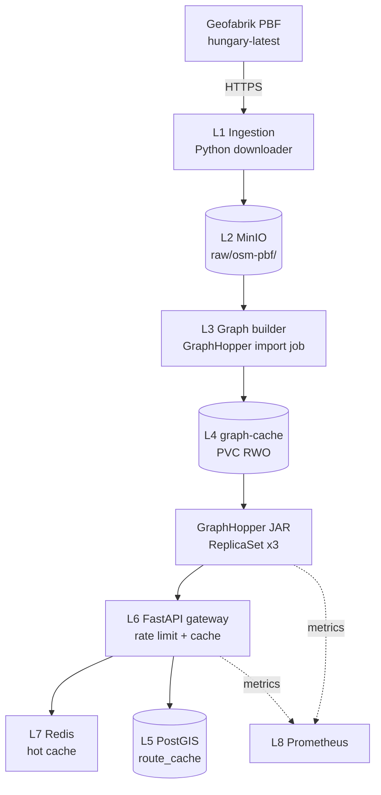

# GraphHopper — Teljes backend terv és adatkinyerési specifikáció

## 1. Forrás áttekintés

A **GraphHopper** egy nyílt forráskódú Java-alapú routing engine (Apache 2.0 licenc), amelyet a **GraphHopper GmbH** (Berlin) fejleszt és üzemeltet **kereskedelmi SaaS**-ként is a `https://www.graphhopper.com` címen. Két alapvető használati mód:

1. **Cloud Routing API** (api.graphhopper.com): managed szolgáltatás, OpenAPI-val, fizetős. Az engine az OSM teljes planet adatából előre felépített útvonalgráfon dolgozik, és REST végpontokat ad: `/route`, `/matrix`, `/route-optimization`, `/map-matching`, `/isochrone`, `/geocode`.
2. **Self-hosted** (GraphHopper JAR / Docker): saját szerveren regionális PBF-ből gráfot építünk és lokálisan szolgálunk ki minden végpontot.

A forrás **megadja**:
- Kerékpáros profilok: `bike`, `racingbike`, `mtb`, `e-bike` (turn-by-turn instruction-nel),
- Magasság-profil (elevation profile) Copernicus EU-DEM / SRTM-ből,
- Útvonal-alternatívák (`alternative_route.max_paths=3`),
- Map matching API (nyers GPS sávot ráhúz a gráfra),
- Izokrón API (mennyit lehet elérni X percen belül kerékpárral),
- Custom model (JSON-alapú DSL súlyok testreszabására: pl. „kerüld az aszfalt nélküli utat", „kerüld a >5%-os emelkedést"),
- Matrix API (N×M legrövidebb távolság/idő mátrix),
- Geokódolás (Photon-alapú, opcionális).

A forrás **nem adja**:
- Élő forgalmi adatot (a planet-szintű OSM gráf statikus),
- Időjárás-alapú dinamikus súlyozást,
- Multimodális routing-ot (kerékpár + vonat) natívan, bár van GTFS-támogatás külön módban.

**Lefedettség**: **globális** OSM planet (~3.5 milliárd node, ~400 millió way). Regionális PBF-fel akár egyetlen ország (Magyarország ~750 MB) is futtatható.

**Adatminőség**: az OSM kerékpáros tagging-jén múlik. Magyarországon ~85%-os cycleway-fedés a fő útvonalakon, ~95%-os connectivity Budapesten. A `surface`, `incline`, `smoothness` tagek hiánya átlagos rural területeken.

**Frissesség**: a Cloud verziónál heti-kétheti gráf-rebuild. Self-hosted esetén mi szabályozzuk — javasolt heti egy teljes refresh, vagy `osm2graph` inkrementális diff (kísérleti).

**Tipikus felhasználási esetek**:
1. Útvonaltervezés A-ból B-be kerékpáros profillal, magasságprofillal,
2. „Kerékpárral mennyi idő alatt érem el?" izokrón,
3. GPS track tisztítása map matching-gel,
4. Több stop optimum sorrendje (Route Optimization API, TSP),
5. Több célpont távolságmátrixa (futár, kerékpáros logisztika).

## 2. Jogi és licenc helyzet

**Az engine licenc**: **Apache 2.0** (forráskód, kompilált JAR, Docker image). Tetszőleges használat, módosítás, terjesztés, kereskedelmi célra is.

**A Cloud SaaS licenc**: **GraphHopper Directions API Terms of Service** (proprietary SaaS). Hozzáférés API kulccsal, csomagonként eltérő SLA.

**Az OSM gráf adat licenc**: **ODbL 1.0** — minden gráf, ami OSM-ből épült, ODbL-szabályozott. A self-hosted esetben az általunk épített gráf is ODbL, ha **redistributáljuk** (megosztjuk másokkal). Saját belső használatra (csak válaszokat szolgálunk ki) nem rendistribution.

**Attribúció**:
- Cloud: kötelező megjeleníteni „Powered by GraphHopper" és „© OpenStreetMap contributors" sztringeket a UI-on.
- Self-hosted: csak „© OpenStreetMap contributors" kötelező (ODbL).

**Share-Alike**: ha a route GeoJSON-t mint adatbázis-szegmens publikáljuk (pl. letölthető nightly dump), az ODbL share-alike életbe lép. Ha csak API választ ad vissza (produced work), CC-BY 2.0 elegendő.

**GDPR**: az API kérések tartalmaznak felhasználói lokációkat — **személyes adat** lehet, ha köthető személyhez. A logokban 30 napon belül **anonimizálni** kell (IP utolsó oktett `0`, felhasználói azonosítók hash-be).

**Kereskedelmi használat**: Cloud csomag fizetős fölött 1 000 req/nap. Self-hosted teljes mértékben engedélyezett (Apache 2.0).

## 3. Adatkinyerési felület (Access Surface)

### 3.1 Cloud Routing API

**Alap URL**: `https://graphhopper.com/api/1`

**Routing**:
```
GET /route?point=47.5,19.05&point=47.45,19.1&profile=bike&elevation=true&instructions=true&key=YOUR_KEY
```

Példa válasz (rövidítve):
```json
{
  "paths": [
    {
      "distance": 8324.5,
      "time": 1842000,
      "ascend": 32.4,
      "descend": 18.2,
      "points": "u{~vFvyys@fS]…(encoded polyline)",
      "instructions": [
        {"text":"Indulj el észak felé Astoria utca","distance":120.4,"time":42000,"sign":0},
        {"text":"Fordulj jobbra Bajcsy-Zsilinszky útra","distance":540.2,"time":120000,"sign":2}
      ],
      "details": {
        "surface": [[0, 12, "asphalt"], [12, 24, "paving_stones"]],
        "road_class": [[0,24,"primary"], [24, 36, "cycleway"]]
      }
    }
  ]
}
```

**Matrix**:
```
POST /matrix
Content-Type: application/json
{
  "points": [[19.05,47.50],[19.10,47.45],[19.15,47.48]],
  "profile": "bike",
  "out_arrays": ["times","distances"]
}
```

**Isochrone**:
```
GET /isochrone?point=47.5,19.05&time_limit=900&profile=bike&buckets=3&key=...
```

**Map Matching**:
```
POST /match?profile=bike&key=...
Content-Type: application/gpx+xml
<gpx>... trkpts ...</gpx>
```

**Pagination**: nincs (egyetlen response). Bbox-szelekció a routinghoz nem releváns (a kérés pontokat ad meg).

### 3.2 Self-hosted JAR

JAR letöltés:
```bash
wget https://github.com/graphhopper/graphhopper/releases/download/9.0/graphhopper-web-9.0.jar \
  -O /opt/graphhopper/graphhopper-web.jar
```

Magyar PBF letöltés (Geofabrik):
```bash
wget https://download.geofabrik.de/europe/hungary-latest.osm.pbf \
  -O /data/osm/hungary-latest.osm.pbf
```

Konfiguráció `config.yml`:
```yaml
graphhopper:
  datareader.file: /data/osm/hungary-latest.osm.pbf
  graph.location: /data/graph-cache
  profiles:
    - name: bike
      vehicle: bike
      weighting: fastest
      turn_costs: true
    - name: mtb
      vehicle: mtb
      weighting: fastest
    - name: racingbike
      vehicle: racingbike
      weighting: fastest
  profiles_ch:
    - profile: bike
    - profile: mtb
  graph.elevation.provider: srtm
  graph.elevation.cache_dir: /data/srtm
server:
  application_connectors:
    - type: http
      port: 8989
      bind_host: 0.0.0.0
```

Indítás:
```bash
java -Xmx8g -Xms8g \
  -Ddw.graphhopper.datareader.file=/data/osm/hungary-latest.osm.pbf \
  -jar /opt/graphhopper/graphhopper-web.jar server /opt/graphhopper/config.yml
```

Első indításkor a gráfépítés tart ~10–25 percig HU PBF-re egy 4 vCPU 16 GB gépen.

### 3.3 Példa curl self-hosted-re

```bash
curl -sS "http://localhost:8989/route?point=47.5,19.05&point=47.45,19.1&profile=bike&elevation=true&points_encoded=false" \
  | jq '.paths[0] | {distance, time, ascend, descend}'
```

Válasz:
```json
{"distance": 8324.5, "time": 1842000, "ascend": 32.4, "descend": 18.2}
```

### 3.4 Custom model példa

```json
{
  "priority": [
    {"if": "road_class == MOTORWAY", "multiply_by": 0},
    {"if": "surface == GRAVEL || surface == UNPAVED", "multiply_by": 0.4},
    {"if": "bike_network == MISSING", "multiply_by": 0.7}
  ],
  "speed": [
    {"if": "average_slope > 5", "multiply_by": 0.7},
    {"if": "average_slope < -3", "multiply_by": 1.2, "limit_to": 28}
  ]
}
```

Post-tal küldve a `/route` endpointra:
```bash
curl -X POST "http://localhost:8989/route?profile=bike" \
  -H "Content-Type: application/json" \
  -d @custom_model_request.json
```

## 4. Hitelesítés, rate limit, kvóták

**Cloud auth**: API key query string-ben (`?key=...`) vagy header-ben (`Authorization: Bearer <key>`).

**Cloud rate limit**:
| Csomag | Ár | Routing/nap | Matrix/nap | Isochrone/nap | RPS peak |
|--------|----|---|---|---|---|
| Free | 0 € | 1 000 | 250 (5×5) | 250 | 5 |
| Basic | 49 €/hó | 30 000 | 6 000 | 6 000 | 25 |
| Standard | 149 €/hó | 100 000 | 25 000 | 25 000 | 50 |
| Pro | 449 €/hó | 500 000 | 100 000 | 100 000 | 150 |
| Enterprise | egyedi | korlátlan | korlátlan | korlátlan | egyedi |

429-es válasz felett `X-RateLimit-Reset: <unix_ts>` header.

**Self-hosted rate limit**: nincs külső; csak a saját CPU/RAM limit. Egy 4 vCPU 16 GB instance HU-gráffal ~100 req/sec stabilan kiszolgál.

**Backoff stratégia**:
```python
import time, random
def gh_request_with_backoff(url, params, key, max_retries=5):
    for i in range(max_retries):
        params["key"] = key
        r = requests.get(url, params=params, timeout=15)
        if r.status_code == 200:
            return r.json()
        if r.status_code == 429:
            reset = int(r.headers.get("X-RateLimit-Reset", 0))
            wait = max(1, reset - int(time.time())) + random.uniform(0, 2)
            time.sleep(min(wait, 60))
            continue
        if r.status_code in (500, 502, 503, 504):
            time.sleep((2 ** i) + random.random())
            continue
        r.raise_for_status()
    raise RuntimeError("max retries exceeded")
```

**User-Agent / IP**: a Cloud nincs IP-ban, de a User-Agent ajánlott: `User-Agent: BikeRouteApp/1.0 (ops@example.hu)`. Self-hosted-en saját döntés.

**Költségmodell** részletesen lásd 13. szakasz.

## 5. Adatmodell (a forrásból)

### 5.1 GraphHopper gráf belső struktúrája

- **Node**: csomópont (kereszteződés vagy intermediate pont) — lat/lon + height.
- **Edge**: irányítatlan él két node között, súlyozva idővel/távolsággal/prioritással. Edge attribútumok:
  - `distance` (m),
  - `flags` (bit-mező: max_speed, road_class, surface, bike_network, …),
  - `tower_node_a`, `tower_node_b`,
  - `geometry` (intermediate point-ok poliline-ja),
  - `elevation` (m).

A gráf bináris formátumban tárolódik a `graph-cache/` mappában (`edges`, `nodes`, `geometry`, `location_index`, `ch_*` shortcut fájlok).

### 5.2 Routing válasz adatmodellje

```json
{
  "paths": [
    {
      "distance": 8324.5,           // méter
      "time": 1842000,              // milliszekundum
      "ascend": 32.4,               // méter pozitív
      "descend": 18.2,              // méter negatív
      "points_encoded": true,
      "points": "u{~vFvyys@…",      // Google encoded polyline
      "instructions": [
        {"text": "...", "distance": 120, "time": 42000,
         "sign": 0,                 // 0=continue, 1=slight_right, 2=right, …
         "interval": [0, 5],
         "street_name": "Astoria utca"}
      ],
      "details": {
        "surface":    [[0,12,"asphalt"],[12,24,"paving_stones"]],
        "road_class": [[0,24,"primary"],[24,36,"cycleway"]],
        "max_speed":  [[0,12,30],[12,24,50]]
      },
      "bbox": [19.04,47.49,19.11,47.51]
    }
  ],
  "info": {
    "copyrights": ["GraphHopper","OpenStreetMap contributors"],
    "took": 32
  }
}
```

**Geometria típus**: encoded polyline (alapból), opcionálisan `points_encoded=false` → GeoJSON `LineString`.

**CRS**: `EPSG:4326`.

**Hierarchia**: a route több path-ból állhat (alternatívák), minden path edge-szekvenciát reprezentál.

## 6. Cél adatmodell (a mi backendünkben)

A GraphHopper válaszait cache-eljük PostGIS-be későbbi újrahasznosítható útvonal-emlékekként és analitikához:

```sql
CREATE SCHEMA IF NOT EXISTS gh;
CREATE EXTENSION IF NOT EXISTS postgis;

CREATE TABLE gh.route_cache (
    id              bigserial PRIMARY KEY,
    request_hash    text NOT NULL UNIQUE,
    profile         text NOT NULL,
    from_lat        double precision NOT NULL,
    from_lon        double precision NOT NULL,
    to_lat          double precision NOT NULL,
    to_lon          double precision NOT NULL,
    waypoints       jsonb,
    distance_m      double precision NOT NULL,
    duration_ms     bigint NOT NULL,
    ascend_m        double precision,
    descend_m       double precision,
    geom            geometry(LineString, 4326) NOT NULL,
    elevation_arr   real[],
    instructions    jsonb,
    details         jsonb,
    response_raw    jsonb,
    gh_version      text NOT NULL,
    requested_at    timestamptz NOT NULL DEFAULT now(),
    ttl_until       timestamptz NOT NULL
);
CREATE INDEX route_cache_geom_idx ON gh.route_cache USING GIST(geom);
CREATE INDEX route_cache_ttl_idx ON gh.route_cache(ttl_until);
CREATE INDEX route_cache_profile_idx ON gh.route_cache(profile);

CREATE TABLE gh.matrix_cache (
    id              bigserial PRIMARY KEY,
    request_hash    text NOT NULL UNIQUE,
    profile         text NOT NULL,
    points          jsonb NOT NULL,
    distances       real[][] NOT NULL,
    times           int[][] NOT NULL,
    requested_at    timestamptz NOT NULL DEFAULT now(),
    ttl_until       timestamptz NOT NULL
);

CREATE TABLE gh.isochrone_cache (
    id              bigserial PRIMARY KEY,
    request_hash    text NOT NULL UNIQUE,
    profile         text NOT NULL,
    origin          geometry(Point, 4326) NOT NULL,
    time_limit_s    integer NOT NULL,
    geom            geometry(MultiPolygon, 4326) NOT NULL,
    buckets         integer NOT NULL,
    requested_at    timestamptz NOT NULL DEFAULT now(),
    ttl_until       timestamptz NOT NULL
);
CREATE INDEX iso_origin_idx ON gh.isochrone_cache USING GIST(origin);
CREATE INDEX iso_geom_idx ON gh.isochrone_cache USING GIST(geom);

CREATE TABLE gh.graph_build (
    build_id        text PRIMARY KEY,
    pbf_source      text NOT NULL,
    pbf_md5         text NOT NULL,
    gh_version      text NOT NULL,
    built_at        timestamptz NOT NULL DEFAULT now(),
    duration_s      integer NOT NULL,
    edge_count      bigint,
    node_count      bigint,
    bbox            geometry(Polygon, 4326)
);
```

**Particionálás**: `route_cache` particionálva hónap szerint (RANGE on `requested_at`), mert a cache hit pattern recent-favorizáló:

```sql
CREATE TABLE gh.route_cache_y2026m05 PARTITION OF gh.route_cache
  FOR VALUES FROM ('2026-05-01') TO ('2026-06-01');
```

**Verziózott séma**: Flyway. A `gh_version` mező lehetővé teszi a régi v8 és új v9 gráfok elválasztását.

## 7. Backend architektúra (rétegek)



- **L1 Ingestion**: heti egy PBF letöltés (lásd OpenCycleMap fájl részletes implementációja).
- **L2 Staging**: MinIO `gh-raw/pbf/...`.
- **L3 Graph builder**: Kubernetes Job — `graphhopper-import` parancs PBF → gráf cache.
- **L4 Graph storage**: PersistentVolumeClaim (RWX vagy RWO + statefulset), ~2.5 GB HU-gráffal.
- **L5 PostGIS**: `route_cache`, `matrix_cache`, `isochrone_cache`.
- **L6 FastAPI gateway**: rate limit per user/IP, cache-lookup PostGIS-ben, cache-miss → GraphHopper backend, response írás Redis + PG.
- **L7 Redis**: hot cache, kulcs = `gh:{request_hash}`, TTL 1 h.
- **L8 Observability**: Prometheus + Grafana + Loki.

## 8. Automatizált letöltő (Downloader)

A PBF letöltése azonos mint az OpenCycleMap-nél. Itt a **gráf-építés trigger** a fontos:

```python
# downloader/gh_graph_build.py
import asyncio
import hashlib
import os
import shutil
import subprocess
from datetime import datetime
from pathlib import Path

import asyncpg

PBF_PATH = Path("/data/osm/hungary-latest.osm.pbf")
GRAPH_DIR = Path("/data/graph-cache")
TMP_GRAPH = Path("/data/graph-cache.tmp")
GH_JAR = "/opt/graphhopper/graphhopper-web.jar"
GH_CONFIG = "/opt/graphhopper/config.yml"
PG_DSN = os.environ["PG_DSN"]


def md5_file(path: Path) -> str:
    h = hashlib.md5()
    with open(path, "rb") as f:
        for chunk in iter(lambda: f.read(1 << 20), b""):
            h.update(chunk)
    return h.hexdigest()


async def already_built(md5: str) -> bool:
    pool = await asyncpg.create_pool(PG_DSN)
    async with pool.acquire() as c:
        row = await c.fetchrow("SELECT 1 FROM gh.graph_build WHERE pbf_md5=$1", md5)
    await pool.close()
    return row is not None


def build_graph(out_dir: Path):
    if out_dir.exists():
        shutil.rmtree(out_dir)
    out_dir.mkdir(parents=True)
    cmd = [
        "java",
        "-Xmx8g", "-Xms8g",
        f"-Ddw.graphhopper.datareader.file={PBF_PATH}",
        f"-Ddw.graphhopper.graph.location={out_dir}",
        "-jar", GH_JAR, "import", GH_CONFIG,
    ]
    print("running:", " ".join(cmd))
    t0 = datetime.utcnow()
    subprocess.run(cmd, check=True)
    return (datetime.utcnow() - t0).total_seconds()


async def main():
    md5 = md5_file(PBF_PATH)
    if await already_built(md5):
        print(f"graph already built for {md5} — skip")
        return
    duration = build_graph(TMP_GRAPH)
    # atomi swap: a JAR pod-ok PVC-jét újracsatoljuk az új gráffal
    if GRAPH_DIR.exists():
        backup = Path(f"/data/graph-cache.old-{md5[:8]}")
        shutil.move(GRAPH_DIR, backup)
    shutil.move(TMP_GRAPH, GRAPH_DIR)

    pool = await asyncpg.create_pool(PG_DSN)
    async with pool.acquire() as c:
        await c.execute(
            """
            INSERT INTO gh.graph_build (build_id, pbf_source, pbf_md5,
                gh_version, duration_s, edge_count, node_count)
            VALUES ($1,$2,$3,$4,$5,$6,$7)
            """,
            md5[:12], str(PBF_PATH), md5, "9.0", int(duration),
            None, None,  # edge/node count majd a JAR /info-ból
        )
    await pool.close()
    print(f"graph rebuilt in {duration:.0f}s")


if __name__ == "__main__":
    asyncio.run(main())
```

**Kubernetes CronJob**:
```yaml
apiVersion: batch/v1
kind: CronJob
metadata: { name: gh-graph-build }
spec:
  schedule: "0 5 * * 1"     # hétfő 05:00 UTC
  concurrencyPolicy: Forbid
  jobTemplate:
    spec:
      backoffLimit: 1
      template:
        spec:
          restartPolicy: Never
          containers:
          - name: gh-build
            image: registry.example.hu/gh/build:9.0.0
            command: ["python","-m","downloader.gh_graph_build"]
            resources:
              requests: { cpu: "4", memory: "16Gi" }
              limits:   { cpu: "8", memory: "24Gi" }
            envFrom: [ { secretRef: { name: gh-secrets } } ]
            volumeMounts:
              - { name: pbf,   mountPath: /data/osm }
              - { name: graph, mountPath: /data }
          volumes:
            - name: pbf
              persistentVolumeClaim: { claimName: gh-pbf-pvc }
            - name: graph
              persistentVolumeClaim: { claimName: gh-graph-pvc }
```

**Hibatűrés**: 1 retry (gráfépítés CPU-igényes), failure esetén Slack + PagerDuty.

## 9. Feldolgozó pipeline

### 9.1 Gráf-építés pipeline

1. PBF validáció (`osmium fileinfo`).
2. PBF md5 ellenőrzés state táblával.
3. Gráf-építés `graphhopper import` parancsával egy `tmp` mappába.
4. Smoke-teszt: `curl localhost:8989/route?point=...` egy ismert reference útvonalra.
5. Atomi swap: `mv graph-cache graph-cache.old; mv tmp graph-cache`.
6. Pod restart (rolling update a JAR ReplicaSet-en).
7. Régi gráf 7 nap után takarítás.

### 9.2 API request pipeline

```python
# api/route_proxy.py
import hashlib, json
from fastapi import FastAPI, Query, HTTPException
import asyncpg, httpx, redis.asyncio as redis

app = FastAPI()
GH_BACKEND = "http://gh-jar.gh.svc.cluster.local:8989"
PG = None
RDS = None

def hash_req(params: dict) -> str:
    s = json.dumps(params, sort_keys=True)
    return hashlib.sha256(s.encode()).hexdigest()

@app.on_event("startup")
async def startup():
    global PG, RDS
    PG = await asyncpg.create_pool(os.environ["PG_DSN"])
    RDS = redis.from_url(os.environ["REDIS_URL"])

@app.get("/v1/route")
async def route(point: list[str] = Query(...), profile: str = "bike",
                elevation: bool = True):
    if len(point) < 2:
        raise HTTPException(400, "Need at least 2 points")
    params = {"point": point, "profile": profile, "elevation": elevation}
    h = hash_req(params)

    # L7 Redis hot cache
    cached = await RDS.get(f"gh:{h}")
    if cached:
        return json.loads(cached)

    # L5 PG warm cache
    async with PG.acquire() as c:
        row = await c.fetchrow(
            "SELECT response_raw FROM gh.route_cache "
            "WHERE request_hash=$1 AND ttl_until > now()", h)
        if row:
            await RDS.setex(f"gh:{h}", 3600, json.dumps(row["response_raw"]))
            return row["response_raw"]

    # cache-miss → upstream
    async with httpx.AsyncClient(timeout=10) as cli:
        r = await cli.get(f"{GH_BACKEND}/route",
                          params={"point": point, "profile": profile,
                                  "elevation": str(elevation).lower(),
                                  "points_encoded": "false"})
        r.raise_for_status()
        data = r.json()

    # írás cache-be
    p = data["paths"][0]
    geom_wkt = "LINESTRING(" + ",".join(f"{c[0]} {c[1]}" for c in p["points"]["coordinates"]) + ")"
    async with PG.acquire() as c:
        await c.execute(
            """INSERT INTO gh.route_cache(request_hash, profile,
                from_lat, from_lon, to_lat, to_lon,
                distance_m, duration_ms, ascend_m, descend_m,
                geom, response_raw, gh_version, ttl_until)
               VALUES($1,$2,$3,$4,$5,$6,$7,$8,$9,$10,
                      ST_SetSRID(ST_GeomFromText($11),4326), $12::jsonb, $13, now()+interval '7 days')
               ON CONFLICT (request_hash) DO NOTHING""",
            h, profile,
            float(point[0].split(",")[0]), float(point[0].split(",")[1]),
            float(point[-1].split(",")[0]), float(point[-1].split(",")[1]),
            p["distance"], p["time"], p.get("ascend"), p.get("descend"),
            geom_wkt, json.dumps(data), "9.0",
        )
    await RDS.setex(f"gh:{h}", 3600, json.dumps(data))
    return data
```

### 9.3 Geometria-tisztítás cache-ben

```sql
UPDATE gh.route_cache
SET geom = ST_MakeValid(geom)
WHERE NOT ST_IsValid(geom);
```

### 9.4 Idempotencia

A `request_hash` UNIQUE constraint biztosítja, hogy ugyanazon kérésre csak egyetlen cache-bejegyzés legyen. `ON CONFLICT DO NOTHING` azonos kérés race condition-jénél.

### 9.5 TTL-takarítás

Cron daily 04:00:
```sql
DELETE FROM gh.route_cache WHERE ttl_until < now() - interval '30 days';
DELETE FROM gh.matrix_cache WHERE ttl_until < now() - interval '14 days';
DELETE FROM gh.isochrone_cache WHERE ttl_until < now() - interval '14 days';
```

## 10. Frissítési stratégia

**Teljes refresh kadenciája**:
- PBF heti egy letöltés (hétfő 03:00),
- Gráf-rebuild hétfő 05:00 (PBF után 2 órával).

**Inkrementális frissítés**:
- A GraphHopper nem támogat hivatalosan **online gráf-frissítést** stabil verzióban.
- Workaround: új gráf építése `tmp`-be + rolling restart.
- Kísérleti: `--update` flag a 10.x ágban (még alpha).

**Verziókövetés**:
- `gh_version` oszlop minden cache-táblán (lehetővé teszi az `9.0` vs `9.1` válaszok különválasztását).
- `pbf_md5` a `graph_build` táblában.

**Snapshot policy**: havonta egyszer a gráf-cache tömörített tar.gz másolat S3-ba (`gh-snapshots/2026-05-01_hungary.tar.gz` ~600 MB).

**Konfliktusfeloldás**:
- Cache invalidáció: új gráf-build után **mind** a `route_cache` rekordot TTL-en kívülre tesszük (`UPDATE … SET ttl_until = now()`), majd takarítás. A meleg eredmények újratöltődnek a backendből az első user-kérésnél.

## 11. Storage és skálázás

**Gráf cache méret** (HU PBF 750 MB-ból):
- `graph-cache/` ~2.5 GB (edges, nodes, geometry, location_index, CH shortcuts),
- `srtm/` ~400 MB (a hozzá szükséges SRTM tile-ok).

**PostGIS méretbecslés** (1 év éles forgalom 50 000 user esetén):
| Tábla | Rekord | Bytes/sor | Méret | Index |
|-------|--------|-----------|-------|-------|
| `route_cache` | 30 000 000 | 8 KB | 240 GB | 30 GB |
| `matrix_cache` | 2 000 000 | 50 KB | 100 GB | 5 GB |
| `isochrone_cache` | 500 000 | 200 KB | 100 GB | 8 GB |

**Particionálás** (lásd 6.) — havi RANGE `route_cache`-en, mert hot data recent.

**TimescaleDB**: `route_cache` hypertable-lé alakítható, ha az IO-pattern megkívánja:
```sql
SELECT create_hypertable('gh.route_cache', 'requested_at',
    chunk_time_interval => INTERVAL '1 day',
    if_not_exists => true);
```

**S3 / MinIO bucket layout**:
```
gh-raw/
  pbf/hungary/2026/05/18-latest.osm.pbf
gh-snapshots/
  graph/2026-05-18_hungary.tar.gz
  pg-dump/2026-05-01.pgdump.gz
```

**Cold tier**: snapshot Glacier-be 30 nap után.

**CDN cache**: a `/v1/route` válaszra Cloudflare `s-maxage=3600`, kulcsa a query string. Magyarországi POP-ról 10–30 ms.

## 12. Monitoring, megfigyelhetőség, riasztások

**Prometheus metrikák**:
```
gh_request_total{endpoint="/v1/route",profile="bike",cache="hit"} 124823
gh_request_total{endpoint="/v1/route",profile="bike",cache="miss"} 18412
gh_request_duration_seconds{quantile="0.99"} 0.42
gh_graph_build_duration_seconds 845
gh_graph_size_bytes 2684354560
gh_jvm_memory_used_bytes{area="heap"} 6.2e9
gh_upstream_errors_total{code="503"} 2
```

**Logok**:
```json
{"ts":"2026-05-18T05:14:22Z","service":"gh.api",
 "trace_id":"a14c","endpoint":"/v1/route","profile":"bike",
 "cache":"miss","upstream_ms":118,"total_ms":134,"status":200}
```

**Riasztások**:
```yaml
- alert: GhUpstreamErrorsHigh
  expr: rate(gh_upstream_errors_total[5m]) > 1
  for: 10m
- alert: GhP99LatencyHigh
  expr: histogram_quantile(0.99, gh_request_duration_seconds_bucket) > 1.5
  for: 10m
- alert: GhGraphBuildFailed
  expr: time() - gh_last_successful_graph_build_timestamp > 86400 * 8
  for: 1h
- alert: GhCacheHitRateLow
  expr: rate(gh_request_total{cache="hit"}[1h]) /
        rate(gh_request_total[1h]) < 0.3
  for: 30m
```

**Health endpoint**: `/healthz` ellenőrzi: PG ping, Redis ping, GH backend `/info` (graph loaded).

**Adatminőség kontroll**:
- Reference-route teszt: 5 fix from→to pár, az `distance_m` ne térjen el ±5%-ot az előző build-hez képest. Ennél nagyobb eltérés Slack alert.

## 13. Költségbecslés

| Tétel | Cloud | Self-hosted (HU only) |
|-------|-------|------------------------|
| API díj | Free 0/Basic 49/Std 149/Pro 449 €/hó | 0 |
| Compute | 0 | 3× 4 vCPU 16 GB = €100/hó |
| Tárolás (PG + S3) | €5/hó | €25/hó |
| Sávszélesség | 0 | €10/hó (BGP egress) |
| **Havi összesen** | **49–449 €** | **~135 €** |

Vízválasztó: ~25 000 routing req/nap. Felette **self-hosted** olcsóbb, alatta a Cloud Basic egyszerűbb. 100 000 req/nap-nál a self-hosted ~3× olcsóbb.

## 14. Biztonság

**Secrets**: Vault, `gh/data/cloud-key` (csak ha Cloudot is használunk). Self-hosted gráfnak nincs secret.

**Network policy**:
```yaml
apiVersion: networking.k8s.io/v1
kind: NetworkPolicy
metadata: { name: gh-internal-only }
spec:
  podSelector: { matchLabels: { app: gh-jar } }
  policyTypes: [Ingress]
  ingress:
  - from:
    - podSelector: { matchLabels: { app: gh-api } }
    ports: [ { port: 8989, protocol: TCP } ]
```

**IAM**: a GH JAR pod read-only PVC mount-ot kap a `graph-cache`-re; a build job a `graph-cache` write-ot kap, de a JAR pod-ok nem.

**Audit log**: minden `/v1/*` API request struktúrált JSON-log Loki-ba. Bouncer userek tiltása `iptables` szinten Nginx ingress előtt.

**TLS**: minden külső API `https://`, intra-cluster mTLS Istio-val.

## 15. Tesztelés

**Unit teszt**:
```python
def test_hash_req_stable():
    a = hash_req({"point": ["47.5,19.0","47.4,19.1"], "profile":"bike"})
    b = hash_req({"profile":"bike", "point": ["47.5,19.0","47.4,19.1"]})
    assert a == b
```

**Integrációs teszt** (GraphHopper JAR-ral docker-compose-on):
```python
import pytest, httpx
@pytest.mark.integration
def test_route_localhost():
    r = httpx.get("http://localhost:8989/route",
                  params={"point":["47.5,19.05","47.45,19.1"],"profile":"bike"})
    assert r.status_code == 200
    body = r.json()
    assert body["paths"][0]["distance"] > 1000
    assert body["paths"][0]["time"] > 0
```

**Adatminőség regressziós teszt**:
```python
REFERENCE_ROUTES = [
    ("47.4979,19.0402","47.4575,19.0356","bike", 7400, 0.05),  # Astoria → Kálvin
    ("47.5113,19.0533","47.5039,19.0405","bike", 1900, 0.07),
]
def test_reference_routes():
    for a, b, prof, expected_m, tol in REFERENCE_ROUTES:
        r = httpx.get("http://gh-jar:8989/route",
                      params={"point":[a,b],"profile":prof})
        d = r.json()["paths"][0]["distance"]
        assert abs(d - expected_m) / expected_m < tol
```

**Smoke teszt post-deploy**:
```bash
curl -sf "https://api.example.hu/v1/route?point=47.5,19.05&point=47.45,19.1&profile=bike" \
  | jq '.paths[0].distance' \
  | awk '{ if ($1<1000 || $1>100000) exit 1 }'
```

## 16. Telepítés és üzemeltetés

**Dockerfile (GraphHopper JAR)**:
```dockerfile
FROM eclipse-temurin:21-jre
RUN apt-get update && apt-get install -y --no-install-recommends curl \
 && rm -rf /var/lib/apt/lists/*
WORKDIR /opt/graphhopper
ARG GH_VERSION=9.0
RUN curl -fSL -o graphhopper-web.jar \
  https://github.com/graphhopper/graphhopper/releases/download/${GH_VERSION}/graphhopper-web-${GH_VERSION}.jar
COPY config.yml /opt/graphhopper/config.yml
EXPOSE 8989
USER 10001
ENTRYPOINT ["java","-Xmx8g","-Xms8g","-jar","graphhopper-web.jar","server","config.yml"]
```

**StatefulSet** (a gráf-mappa pod-élethez kötött):
```yaml
apiVersion: apps/v1
kind: StatefulSet
metadata: { name: gh-jar }
spec:
  serviceName: gh-jar
  replicas: 3
  selector: { matchLabels: { app: gh-jar } }
  template:
    metadata: { labels: { app: gh-jar } }
    spec:
      containers:
      - name: gh
        image: registry.example.hu/gh/jar:9.0.0
        ports: [ { containerPort: 8989 } ]
        readinessProbe:
          httpGet: { path: /health, port: 8989 }
          initialDelaySeconds: 60
        resources:
          requests: { cpu: "2", memory: "10Gi" }
          limits:   { cpu: "4", memory: "12Gi" }
        volumeMounts:
          - { name: graph, mountPath: /data/graph-cache, readOnly: true }
      volumes:
        - name: graph
          persistentVolumeClaim: { claimName: gh-graph-pvc }
```

**Helm chart**:
```
gh-chart/
├── Chart.yaml
├── values.yaml
├── templates/
    ├── statefulset-jar.yaml
    ├── cronjob-graph-build.yaml
    ├── deployment-api.yaml
    ├── service-jar.yaml
    ├── service-api.yaml
    ├── networkpolicy.yaml
    └── pvc.yaml
```

**GitHub Actions CI**:
```yaml
name: gh-ci
on: [push]
jobs:
  test:
    runs-on: ubuntu-latest
    services:
      gh:
        image: israfaesun/graphhopper:9.0
        ports: [8989:8989]
        env: { GH_PBF_URL: "http://localhost/test-small.pbf" }
    steps:
      - uses: actions/checkout@v4
      - uses: actions/setup-python@v5
        with: { python-version: '3.11' }
      - run: pip install -r requirements-dev.txt
      - run: pytest -q tests/unit/
      - run: pytest -q tests/integration/ -m integration
```

**Rollback**: Helm `--atomic --timeout 10m`. Gráf-rollback: `mv graph-cache graph-cache.failed; mv graph-cache.old-<md5> graph-cache; kubectl rollout restart statefulset/gh-jar`.

## 17. Adatpublikálás (Serving)

**REST API (OpenAPI vázlat)**:
```yaml
openapi: 3.1.0
info: { title: BikeRoute API, version: 1.0.0 }
paths:
  /v1/route:
    get:
      parameters:
        - { name: point, in: query, required: true, schema: { type: array, items: { type: string } }, style: form, explode: true }
        - { name: profile, in: query, schema: { type: string, enum: [bike, mtb, racingbike, e-bike], default: bike } }
        - { name: elevation, in: query, schema: { type: boolean, default: true } }
        - { name: alternative_route, in: query, schema: { type: boolean, default: false } }
      responses:
        '200':
          content:
            application/json:
              schema: { $ref: '#/components/schemas/RouteResponse' }
  /v1/isochrone:
    get:
      parameters:
        - { name: point, in: query, schema: { type: string }, required: true }
        - { name: time_limit, in: query, schema: { type: integer, default: 900 } }
        - { name: profile, in: query, schema: { type: string, default: bike } }
      responses:
        '200': { description: GeoJSON FeatureCollection of polygons }
  /v1/matrix:
    post:
      requestBody:
        content:
          application/json:
            schema: { $ref: '#/components/schemas/MatrixRequest' }
      responses:
        '200': { content: { application/json: { schema: { $ref: '#/components/schemas/MatrixResponse' } } } }
```

**Vector tile generálás**: a routing válaszok aggregálva népszerű útvonalakra hőtérképként, Tippecanoe-val.

**WMS/WFS rétegek**: GeoServer 2.24, az `gh:route_heatmap` density layer `route_cache` materialized view-ból.

**Letölthető export**:
- `GET /v1/route.gpx?point=...&point=...&profile=bike` → GPX,
- `GET /v1/route.geojson?...` → GeoJSON,
- `GET /v1/route.fit?...` → Garmin FIT (binary).

## 18. Runbook

### Hibajelenség: `/route` 503 minden kérésre
1. `kubectl get pods -l app=gh-jar`,
2. `kubectl logs <pod>` — keresd: `Could not load graph` vagy `OutOfMemoryError`,
3. OOM esetén Xmx-et 8 → 12 GB-ra, deploy újra,
4. graph corrupt esetén: rollback az előző `graph-cache.old-<md5>`-re.

### Hibajelenség: gráf-build > 1 óra
1. `kubectl logs job/gh-graph-build-...` — keresd: `Reading OSM data`, `Creating edges`,
2. PBF file méret ellenőrzés (`du -h`),
3. ha a PBF normálisnál nagyobb (>1.5 GB HU-ra): Geofabrik mirror átállítás,
4. ha node count ugrott meg: vizsgálat — esetleg vandalizmus az OSM-en?

### Manuális reprocess
```bash
kubectl create job --from=cronjob/gh-graph-build manual-$(date +%s)
```

### Backfill recept
```bash
# Régi PBF-ből újragraf
PBF=/data/osm/hungary-2024-01-01.osm.pbf python -m downloader.gh_graph_build
```

### Cache invalidálás
```sql
UPDATE gh.route_cache SET ttl_until = now() WHERE requested_at < now() - interval '1 day';
```
Redis flush:
```bash
redis-cli --scan --pattern 'gh:*' | xargs redis-cli DEL
```

### Eskaláció
L1 (NOC) → L2 (Routing oncall) → L3 (Backend lead).

## 19. Roadmap

**MVP (v0.1)** — 3 hét:
- Cloud Routing API mögé FastAPI proxy + Redis cache,
- 4 profil (`bike`, `mtb`, `racingbike`, `e-bike`),
- Egyszerű REST `/v1/route` GeoJSON output,
- Cloudflare CDN.

**v1.0** — 10 hét:
- Self-hosted GraphHopper StatefulSet HU + szomszéd országokra,
- Heti gráf-rebuild CronJob,
- PostGIS warm cache,
- Map matching + isochrone endpoint,
- Custom model UI (preset: család / városi / sport).

**v2.0** — 6 hónap:
- Multimodális routing (kerékpár + vasút) GTFS-fel,
- Élő forgalmi adat overlay (BKK FUTÁR + Waze partneri ha lesz),
- Időjárás-alapú dinamikus weighting (eső → kerüld a foldutat),
- Útvonal AI-ranking (felhasználói preference learning),
- Magasság-profil ML-alapú simítás (DEM hibák kiszűrése).

## 20. Referenciák

- GraphHopper hivatalos oldal: <https://www.graphhopper.com/>
- GitHub repo: <https://github.com/graphhopper/graphhopper>
- Routing API doc: <https://docs.graphhopper.com/>
- Releases (JAR letöltés): <https://github.com/graphhopper/graphhopper/releases>
- Custom model doc: <https://github.com/graphhopper/graphhopper/blob/master/docs/core/custom-models.md>
- Profil doc (`bike`, `mtb`, …): <https://github.com/graphhopper/graphhopper/blob/master/docs/core/profiles.md>
- Geofabrik downloads: <https://download.geofabrik.de/>
- SRTM elevation: <https://srtm.csi.cgiar.org/>
- Copernicus EU-DEM: <https://www.eea.europa.eu/data-and-maps/data/copernicus-land-monitoring-service-eu-dem>
- ODbL 1.0: <https://opendatacommons.org/licenses/odbl/1-0/>
- Apache License 2.0: <https://www.apache.org/licenses/LICENSE-2.0>
- OSM bike tagging wiki: <https://wiki.openstreetmap.org/wiki/Bicycle>
- GTFS spec: <https://gtfs.org/>
- BKK FUTÁR API: <https://bkk.hu/utazasi-informaciok/futar/>
- EuroVelo network: <https://en.eurovelo.com/>
- Magyar EuroVelo: <https://eurovelo.hu/>
- FastAPI doc: <https://fastapi.tiangolo.com/>
- Redis doc: <https://redis.io/docs/>
- Helm chart best practices: <https://helm.sh/docs/chart_best_practices/>
- Kubernetes StatefulSet doc: <https://kubernetes.io/docs/concepts/workloads/controllers/statefulset/>
- Prometheus alerting rules: <https://prometheus.io/docs/prometheus/latest/configuration/alerting_rules/>
- TimescaleDB hypertable: <https://docs.timescale.com/use-timescale/latest/hypertables/>

## A. függelék: példa custom model "családbarát" mód

```json
{
  "priority": [
    {"if": "road_class == MOTORWAY || road_class == TRUNK", "multiply_by": 0},
    {"if": "road_class == PRIMARY", "multiply_by": 0.3},
    {"if": "road_class == CYCLEWAY", "multiply_by": 1.5},
    {"if": "max_speed > 50", "multiply_by": 0.5},
    {"if": "average_slope > 4", "multiply_by": 0.6}
  ],
  "speed": [
    {"if": "true", "limit_to": 18}
  ],
  "distance_influence": 30
}
```

## B. függelék: példa GPX export

```xml
<?xml version="1.0" encoding="UTF-8"?>
<gpx version="1.1" creator="BikeRouteApp">
  <metadata>
    <name>Astoria → Margitsziget</name>
    <author><name>BikeRouteApp</name></author>
  </metadata>
  <trk>
    <name>Astoria → Margitsziget bike route</name>
    <trkseg>
      <trkpt lat="47.4979" lon="19.0402"><ele>104.5</ele></trkpt>
      <trkpt lat="47.4985" lon="19.0408"><ele>104.7</ele></trkpt>
      <!-- ... -->
    </trkseg>
  </trk>
</gpx>
```
