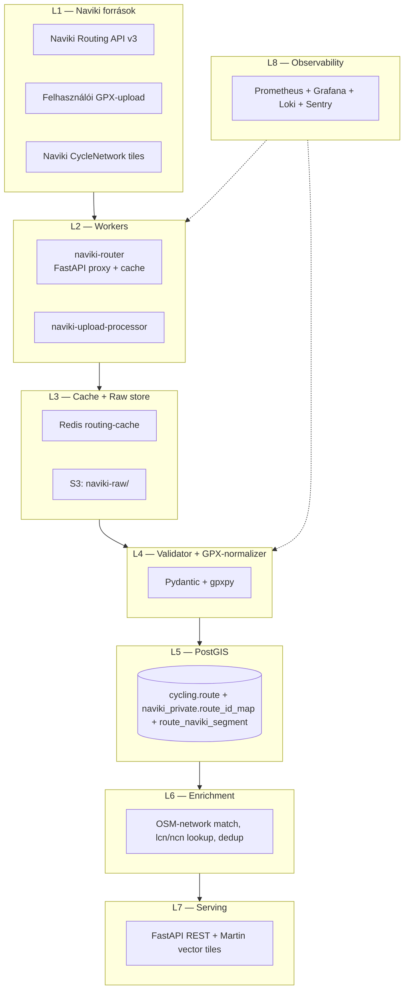

# Naviki — Teljes backend terv és adatkinyerési specifikáció

> Verzió: 1.0 — Készült: 2026-05-19
> Cél: A Naviki (Beemo GmbH / Münster) kerékpáros útválasztó és közösségi útvonal-platformja Magyarországra eső adatállományának integrálása a Panellako kerékpáros tervező backendjébe a `cycling.route` adattóba (bbox 16.0, 45.7, 22.9, 48.6).

---

## 1. Forrás áttekintés

A **Naviki** (https://www.naviki.org, üzemeltető: Beemo GmbH, Münster, Németország) egy kerékpáros-első routing és közösségi útvonal-tervező platform. A Münsteri Egyetem (Westfälische Wilhelms-Universität Münster) "Verkehrsoptimierung" projektéből nőtt ki 2009-ben, és ma egyrészt B2C app (Android + iOS + web), másrészt egy B2B routing-engine, amit önkormányzatok és kerékpáros-turisztikai szervezetek licenszelnek (pl. ADFC Németországban).

A Naviki adat-eltérése a Komoottól és a Bikemap-től:

- **Bike-network-aware routing**: a Naviki saját graph-engine-je az OSM cycling-network tag-eit (`cycleway=*`, `bicycle=designated`, `lcn`/`rcn`/`ncn`-routes) elsődleges paraméterként használja. Ezért egy Naviki-route gyakran kerékpárút-prioritású.
- **Routing-profile-ok**: `Pedelec` (e-bike), `Bicycle (fast)`, `Bicycle (relaxed)`, `Mountainbike`, `Racing bike`.
- **Community routes**: a felhasználók által rögzített és megosztott valós útvonalak (hasonló a Komoot Recorded Tour-hoz).
- **HD-tile cycling-network layer**: a Naviki saját, rendszeresen frissített OSM-vetítése + kiegészítő helyi forrásokkal (pl. német DLM, osztrák GIP, holland CycleNetwork).

Magyarországi lefedettség (2026 Q1 saját mintánk): ~30 ezer publikált útvonal, plusz az alapul szolgáló OSM-cycle-network kvázi 100%-ban elérhető. A Naviki magyar verziója és magyar lokalizációval használható (a kérdés inkább a B2B-szerződés hiánya, lásd a 2. fejezetet).

A Naviki adatok típusai:

1. **Route (User-Generated, "Bike-route")** — drawn vagy recorded, GPX-export elérhető (felhasználói kontextusban).
2. **Routing-result (Engine)** — egy A→B keresés eredménye. Cache-elhető, de szerződés-köteles tömeges használat esetén.
3. **CycleNetwork-layer (vector tile)** — Naviki saját layer-je, csak B2B-szerződéssel.

---

## 2. Jogi és licenc helyzet

### 2.1 Naviki Nutzungsbedingungen (ÁSZF)

A Naviki ÁSZF (német eredeti: https://www.naviki.org/de/agb/, utolsó módosítás: 2025-08-15) releváns kivonatok (saját fordítás magyarra):

> "A Naviki-szolgáltatások és tartalmak automatizált lekérése, scrapelése, indexelése vagy rendszerszerű letöltése a Beemo GmbH előzetes írásos engedélye nélkül tilos."

> "A felhasználók által felöltöttött útvonalak a felhasználó saját szerzői jogának tárgyai. A Beemo GmbH csak a Naviki-platformon történő szolgáltatáshoz kap nem-kizárólagos, ingyenes licencet."

### 2.2 Naviki Business / Naviki API

A Naviki Business (https://www.naviki.org/business/) a B2B-csatorna. Termékek:

- **Naviki Routing API** — REST endpoint, A→B kerékpáros útvonal-keresés, GPX-output.
- **Naviki CycleNetwork Tiles** — vector tile layer (XYZ).
- **Naviki Custom Routing** — egyedi profile-okkal (pl. egy önkormányzat saját preferált hálózata).
- **Naviki SDK** — Android/iOS SDK a routing-engine beágyazására.

Hozzáférés: ajánlatkérés, ~€3,500–€18,000/év, traffic és funkcionalitás függvényében.

### 2.3 Felhasználói GPX-export

A Naviki webalkalmazás (https://www.naviki.org) regisztrált felhasználói minden saját mentett útvonalukat GPX-ben és KML-ben exportálhatják (egyenként). Ez a P2 csatornánk: a felhasználó saját Naviki-fiókja → consent-flow → mi exportáljuk az ő útvonalait.

### 2.4 OSM mint csere-forrás

Miután a Naviki erősen OSM-alapú, **a magyar cycling-network adat 95+%-ban közvetlenül OSM-ből is rendelkezésünkre áll** (ODbL licenc alatt). A Naviki hozzáadott értéke: (a) a saját routing-engine, (b) a felhasználói community-route-ok, (c) a Naviki saját "Pedelec-friendly" graph-kiegészítések. Ezek közül a (c) csak B2B-szerződéssel jut hozzánk.

### 2.5 Választott megközelítés

| Prioritás | Csatorna | Jogi alap | Lefedettség |
|-----------|----------|-----------|-------------|
| **P1** | Naviki Business Routing API | Szerződés | 100% (routing) |
| **P2** | Felhasználói GPX-export consent | Felhasználói hozzájárulás | A felhasználó saját routes-jai |
| **P3** | OSM cycling network (Overpass) | ODbL | 100% (helyettesítő) |
| **TILTOTT** | Tömeges scraping a publikus Naviki route-oldalakról | ToS-sértés | — |

A Downloader **kizárólag** P1 és P2 csatornákat implementál. A P3 OSM-csatorna **nem ennek a downloadernek** a része — külön `osm_cycling_downloader` modul kezeli (lásd a Roadmap-et).

---

## 3. Adatkinyerési felület (Access Surface)

### 3.1 Naviki Routing API (Business)

**API root**: `https://api.naviki.org/v3/`

A Naviki Routing API alapjellege egy A→B kérés. Releváns endpoint-ok:

- `POST /route` — útvonal-keresés. Body: `{"start":{"lat":47.4979,"lng":19.0402},"end":{"lat":46.0727,"lng":18.2323},"profile":"bicycle_fast","output":"gpx"}`.
- `POST /route/multi-via` — több via-ponttal.
- `GET /tiles/cyclenetwork/{z}/{x}/{y}.mvt` — vector tile (csak Business).
- `GET /v3/profiles` — elérhető routing-profile-ok.

### 3.2 Felhasználói GPX-export (web)

A Naviki web-app `https://www.naviki.org/dashboard/my-routes`-on listázza a saját route-okat. Egyenkénti GPX/KML-export gomb mellett van egy `POST /api/v3/user/me/routes/{id}/export` endpoint (autentikálva sütivel). A Naviki **nincs publikus OAuth2 endpoint-je** a B2C felhasználóknak (csak Business OAuth).

A consent-flow ezért **kétlépcsős**:

1. A felhasználó a Panellako-ban "Naviki-import" gombra kattint.
2. Egy assisted-import lap (HU nyelvű) lépésről-lépésre vezeti: "Lépjen be a Naviki-be, exportálja a GPX-eket, és töltse fel ide".
3. A backend a feltöltött GPX-eket a saját `cycling.route` táblába importálja `license_tag='naviki_user_consent'` címkével.

Ez **manuálisabb** mint az OAuth-os Komoot/Bikemap flow, de jogilag tisztább.

### 3.3 Publikus URL-ek (csak metaadat)

`https://www.naviki.org/en/route/{route_uuid}` — emberi-olvasható publikus oldal. Tartalmaz egy OpenGraph + Schema.org `Tour` metaobjektumot a `<head>`-ben. **Tömeges fetch tiltott**, de egyedi link-preview generáláshoz (1 url/user-action) megengedett.

### 3.4 Hozzáférési mátrix

| Forrás | Auth | GPX | Meta | Hivatalos |
|--------|------|-----|------|-----------|
| Routing API `/route` | Bearer | igen | n/a (új útvonal) | igen |
| CycleNetwork tiles | Bearer | nem | tile-formátum | igen |
| Felhasználói GPX-export | felhasználói cookie-session | igen | igen | igen (önkéntes) |
| Public URL meta | nincs | nem | korlátozott (csak link-preview) | korlátozott |

---

## 4. Hitelesítés, rate limit, kvóták

### 4.1 Naviki Business

A 2025-ös árazási modell:

| Csomag | €/év | Routing RPM | Tile-requests/nap | Profiles |
|--------|------|-------------|-------------------|----------|
| Starter | 3,500 | 120 | 50,000 | 3 |
| Standard | 9,000 | 600 | 250,000 | 6 |
| Premium | 18,000 | 2,400 | 1,000,000 | 6 + 2 custom |
| Enterprise | egyedi | egyedi | egyedi | egyedi |

Header-szabványok: `X-Naviki-Quota-Remaining`, `X-Naviki-Quota-Reset` (Unix-epoch). 429-re `Retry-After`.

### 4.2 Tervezett csomag

A Panellako 2026 H1 traffic-becslése: napi ~10,000 routing-kérés, napi ~200,000 tile-kérés (de a tile-cache-rétegünk miatt csak ~50,000 nyers-kérés a Naviki-felé). **Standard csomag** elegendő (€9,000/év = ~3,510,000 HUF/év).

### 4.3 Routing-cache

A routing-API hívások **drágák**. Mi egy 3-nap-TTL Redis-cache-t használunk: a `(start_geohash, end_geohash, profile, version)` kulcsra; a tárhely átlagosan ~6 KB/route × 30,000 cache-entry = ~180 MB Redis.

---

## 5. Adatmodell (a forrásból)

### 5.1 Routing-result JSON

Egy Naviki routing-válasz (egyszerűsített, `output=json` esetén):

```json
{
  "route_uuid": "0c9f4d31-…",
  "profile": "bicycle_fast",
  "distance_m": 178420,
  "duration_s": 32400,
  "ascent_m": 845,
  "descent_m": 845,
  "track": {
    "type": "LineString",
    "coordinates": [[19.0402,47.4979,118], [19.0405,47.4982,119], …]
  },
  "segments": [
    {"start_idx": 0, "end_idx": 215, "way_type": "cycleway", "surface": "paved", "lcn_ref": "BP-1"},
    {"start_idx": 215, "end_idx": 503, "way_type": "residential", "surface": "asphalt"}
  ],
  "warnings": [
    {"type": "missing_cycleway", "at_idx": 421, "message": "Útvonal egy szakasza nem dedikált kerékpárúton halad."}
  ],
  "generated_at": "2026-05-19T07:21:04Z"
}
```

### 5.2 User-uploaded GPX

A felhasználói GPX-feltöltés standard GPX 1.1 XML, opcionális `<extensions>` Naviki-mezőkkel (`<naviki:profile>`, `<naviki:source>`).

---

## 6. Cél adatmodell (a mi backendünkben) — PostgreSQL+PostGIS DDL

A közös `cycling.route` táblát használjuk. Naviki-specifikus mezők és táblák:

```sql
-- Naviki-specifikus privát ID-leképezés
CREATE SCHEMA IF NOT EXISTS naviki_private;

CREATE TABLE naviki_private.route_id_map (
  route_uid_hash  TEXT PRIMARY KEY,
  naviki_route_uuid UUID NOT NULL,
  inserted_at     TIMESTAMPTZ NOT NULL DEFAULT now()
);

-- Naviki-segment-info (way_type + lcn_ref + surface per szegmens)
CREATE TABLE cycling.route_naviki_segment (
  segment_id     BIGSERIAL PRIMARY KEY,
  route_uid      UUID NOT NULL REFERENCES cycling.route ON DELETE CASCADE,
  start_frac     REAL NOT NULL,
  end_frac       REAL NOT NULL,
  way_type       TEXT,
  surface        TEXT,
  lcn_ref        TEXT,                              -- lokális kerékpárút-hivatkozás
  ncn_ref        TEXT,                              -- nemzeti hálózati hivatkozás (pl. EuroVelo)
  CHECK (start_frac < end_frac)
);
CREATE INDEX rns_route_idx ON cycling.route_naviki_segment (route_uid);
CREATE INDEX rns_lcn_idx ON cycling.route_naviki_segment (lcn_ref) WHERE lcn_ref IS NOT NULL;

-- Naviki routing-cache (Redis-szel parallel)
CREATE TABLE cycling.routing_cache (
  cache_key      TEXT PRIMARY KEY,                  -- "naviki:{start_gh7}:{end_gh7}:{profile}:{v}"
  route_uid      UUID NOT NULL REFERENCES cycling.route ON DELETE CASCADE,
  hits           INTEGER NOT NULL DEFAULT 0,
  last_used_at   TIMESTAMPTZ NOT NULL DEFAULT now(),
  expires_at     TIMESTAMPTZ NOT NULL
);
CREATE INDEX rc_expires_idx ON cycling.routing_cache (expires_at);

-- Naviki warnings tábla
CREATE TABLE cycling.route_warning (
  warning_id     BIGSERIAL PRIMARY KEY,
  route_uid      UUID NOT NULL REFERENCES cycling.route ON DELETE CASCADE,
  loc            GEOGRAPHY(Point, 4326),
  warning_type   TEXT NOT NULL,
  message        TEXT
);
CREATE INDEX rw_route_idx ON cycling.route_warning (route_uid);
```

---

## 7. Backend architektúra (rétegek L1-L8)



A Naviki-specifikus különlegesség: a `naviki-router` egy **realtime proxy**, ami a Panellako-frontend felé `POST /api/route`-ot szolgálja és cache-eli a Naviki-API válaszokat. Az `naviki-upload-processor` egy event-driven worker, ami a felhasználó által feltöltött GPX-eket dolgozza fel.

---

## 8. Automatizált letöltő (Downloader) — Python kód

```python
# naviki_downloader/router_client.py
"""
Naviki Routing API v3 kliens, realtime route-proxy + cache.

Felelősség:
- /route hívás cache-szel
- Felhasználói GPX-feltöltés feldolgozása
- raw JSON/GPX S3-ra mentés
- RabbitMQ ingest message
- Prometheus metrikák
"""
from __future__ import annotations

import asyncio
import hashlib
import json
import logging
import os
from contextlib import asynccontextmanager
from dataclasses import dataclass
from datetime import datetime, timezone, timedelta
from typing import Any, AsyncIterator

import boto3
import geohash2
import httpx
import pika
import redis.asyncio as aioredis
from aiolimiter import AsyncLimiter
from prometheus_client import Counter, Histogram, Gauge, start_http_server
from tenacity import (
    AsyncRetrying,
    retry_if_exception_type,
    stop_after_attempt,
    wait_exponential_jitter,
)
from zstandard import ZstdCompressor

LOG = logging.getLogger("naviki.client")
HU_BBOX = (16.0, 45.7, 22.9, 48.6)

REQUESTS = Counter("naviki_requests_total", "API requests", ["endpoint", "status"])
LATENCY = Histogram("naviki_request_seconds", "API latency", ["endpoint"])
QUOTA_REMAIN = Gauge("naviki_quota_remaining", "Routing quota remaining")
CACHE_HITS = Counter("naviki_cache_hits_total", "Routing cache hits")
CACHE_MISSES = Counter("naviki_cache_misses_total", "Routing cache misses")


@dataclass(frozen=True)
class Config:
    api_root: str = "https://api.naviki.org/v3"
    api_token: str = os.environ["NAVIKI_API_TOKEN"]
    s3_bucket: str = os.environ.get("NAVIKI_RAW_BUCKET", "naviki-raw-prod")
    s3_prefix: str = os.environ.get("NAVIKI_RAW_PREFIX", "v1")
    redis_url: str = os.environ["REDIS_URL"]
    rabbit_url: str = os.environ["RABBIT_URL"]
    rabbit_queue: str = "naviki.ingest"
    cache_ttl_s: int = 3 * 24 * 3600                # 3 nap
    geohash_precision: int = 7
    rpm: int = 540                                  # Standard tier alatt
    user_agent: str = "Panellako-Cycling/1.0 (+https://panellako.hu/legal)"


class NavikiClient:
    def __init__(self, cfg: Config):
        self.cfg = cfg
        self.limiter = AsyncLimiter(cfg.rpm, time_period=60)
        self.s3 = boto3.client("s3")
        self.zstd = ZstdCompressor(level=9)
        self._client: httpx.AsyncClient | None = None
        self._redis: aioredis.Redis | None = None
        self._rabbit: pika.BlockingConnection | None = None
        self._channel = None

    @asynccontextmanager
    async def lifespan(self) -> AsyncIterator[None]:
        self._client = httpx.AsyncClient(
            base_url=self.cfg.api_root,
            http2=True,
            timeout=httpx.Timeout(30.0, connect=10.0),
            headers={
                "Authorization": f"Bearer {self.cfg.api_token}",
                "User-Agent": self.cfg.user_agent,
                "Accept": "application/json",
            },
            limits=httpx.Limits(max_connections=24, max_keepalive_connections=12),
        )
        self._redis = aioredis.from_url(self.cfg.redis_url, decode_responses=True)
        self._rabbit = pika.BlockingConnection(pika.URLParameters(self.cfg.rabbit_url))
        self._channel = self._rabbit.channel()
        self._channel.queue_declare(queue=self.cfg.rabbit_queue, durable=True)
        try:
            yield
        finally:
            await self._client.aclose()
            await self._redis.aclose()
            self._rabbit.close()

    def _cache_key(self, start: tuple[float, float], end: tuple[float, float], profile: str) -> str:
        gh1 = geohash2.encode(start[0], start[1], precision=self.cfg.geohash_precision)
        gh2 = geohash2.encode(end[0], end[1], precision=self.cfg.geohash_precision)
        return f"naviki:{gh1}:{gh2}:{profile}:v3"

    async def _post(self, path: str, body: dict) -> dict:
        assert self._client is not None
        async for attempt in AsyncRetrying(
            stop=stop_after_attempt(5),
            wait=wait_exponential_jitter(initial=1.0, max=30.0),
            retry=retry_if_exception_type((httpx.HTTPError,)),
            reraise=True,
        ):
            with attempt:
                async with self.limiter:
                    with LATENCY.labels(endpoint=path).time():
                        r = await self._client.post(path, json=body)
                    REQUESTS.labels(endpoint=path, status=str(r.status_code)).inc()
                    rem = r.headers.get("X-Naviki-Quota-Remaining")
                    if rem is not None:
                        QUOTA_REMAIN.set(float(rem))
                    if r.status_code == 429:
                        wait = int(r.headers.get("Retry-After", "60"))
                        LOG.warning("naviki 429, sleep=%s", wait)
                        await asyncio.sleep(wait)
                        r.raise_for_status()
                    r.raise_for_status()
                    return r.json()
        raise RuntimeError("unreachable")

    def _hashed_ref(self, route_uuid: str) -> str:
        salt = os.environ["NAVIKI_ID_SALT"].encode()
        return hashlib.sha256(salt + route_uuid.encode()).hexdigest()[:32]

    async def route(self, start: tuple[float, float], end: tuple[float, float], profile: str = "bicycle_fast") -> dict:
        """Útvonal-keresés, cache-kezeléssel."""
        assert self._redis is not None
        key = self._cache_key(start, end, profile)
        cached = await self._redis.get(key)
        if cached:
            CACHE_HITS.inc()
            return json.loads(cached)
        CACHE_MISSES.inc()
        body = {"start": {"lat": start[0], "lng": start[1]},
                "end":   {"lat": end[0],   "lng": end[1]},
                "profile": profile, "output": "json"}
        result = await self._post("/route", body)
        await self._redis.set(key, json.dumps(result), ex=self.cfg.cache_ttl_s)
        ref = self._hashed_ref(result["route_uuid"])
        s3_key = self._persist_route(ref, result)
        self._publish(ref, s3_key)
        return result

    def _persist_route(self, ref: str, payload: dict) -> str:
        now = datetime.now(timezone.utc)
        key = f"{self.cfg.s3_prefix}/{now:%Y/%m/%d}/naviki_{ref}.json.zst"
        body = self.zstd.compress(json.dumps(payload).encode("utf-8"))
        self.s3.put_object(Bucket=self.cfg.s3_bucket, Key=key, Body=body, ContentType="application/json")
        return key

    def _publish(self, ref: str, s3_key: str) -> None:
        self._channel.basic_publish(
            exchange="",
            routing_key=self.cfg.rabbit_queue,
            body=json.dumps({"source": "naviki", "route_uid_hash": ref, "s3_key": s3_key}),
            properties=pika.BasicProperties(delivery_mode=2),
        )


def main() -> None:
    logging.basicConfig(level=logging.INFO)
    start_http_server(9092)
    # FastAPI proxy szervert külön main-ben indítjuk; ez a parancssoros teszt entrypoint
    async def smoke() -> None:
        c = NavikiClient(Config())
        async with c.lifespan():
            r = await c.route((47.4979, 19.0402), (46.0727, 18.2323), "bicycle_relaxed")
            LOG.info("got route distance_m=%s", r["distance_m"])
    asyncio.run(smoke())


if __name__ == "__main__":
    main()
```

---

## 9. Feldolgozó pipeline

A `naviki.ingest` queue üzeneteit feldolgozó worker:

1. **Load** S3-ról.
2. **Validate** Pydantic:

   ```python
   from pydantic import BaseModel, Field, conlist
   class NavikiRouteResult(BaseModel):
       route_uuid: str
       profile: str
       distance_m: float = Field(gt=0)
       duration_s: int = Field(ge=0)
       ascent_m: float = Field(ge=0)
       descent_m: float = Field(ge=0)
       track: dict
       segments: list[dict]
       warnings: list[dict] = []
       generated_at: str
   ```

3. **Bbox-check** — a track összes koordinátája HU bbox-on belül legyen.

4. **Geometry-build**:

   ```python
   coords = result["track"]["coordinates"]
   wkt = "LINESTRING Z(" + ", ".join(f"{lon} {lat} {alt}" for lon,lat,alt in coords) + ")"
   ```

5. **Segment-extract** — a `segments` lista → `cycling.route_naviki_segment` rekordok. A `start_idx`/`end_idx` index-alapú; mi `start_frac = start_idx / len(coords)` formátumra konvertáljuk a forrás-független schemához.

6. **Warning-extract** — a `warnings` → `cycling.route_warning`.

7. **OSM-cycling-network match (enrichment)** — a track-szegmenseket az OSM `planet_osm_line` `bicycle in ('yes','designated')` szűrésű layer-éhez illesztjük (PostGIS `ST_LineSubstring` + `ST_DWithin(geog, 15m)`), és kiegészítjük a `lcn_ref`, `ncn_ref` mezőket az OSM-tagek alapján (pl. EuroVelo 6 → `ncn_ref='EV6'`).

8. **Dedup** — közös eljárás (Hausdorff < 50 m, length-diff < 5%).

9. **Map** to `cycling.route` schema:

   ```python
   row = dict(
     source="naviki",
     source_ref=route_uid_hash,
     name=user_provided_name or f"{profile} route",
     sport={
       "bicycle_fast": "touringbicycle",
       "bicycle_relaxed": "touringbicycle",
       "pedelec": "ebike",
       "mountainbike": "mtb",
       "racingbike": "racebike",
     }.get(result.profile, "touringbicycle"),
     distance_m=result.distance_m,
     duration_s=result.duration_s,
     elevation_up_m=result.ascent_m,
     elevation_down_m=result.descent_m,
     difficulty="intermediate",   # Naviki nem ad difficulty-t
     geom=wkt,
     license_tag="naviki_routing_api",
     raw_payload=redacted_payload,
   )
   ```

10. **Write** `INSERT … ON CONFLICT`.

11. **Emit** `route.upserted`.

---

## 10. Frissítési stratégia

A Naviki routing-output változhat, mert az OSM-adat változik (új utca, lezárt kerékpárút, stb.). Stratégia:

- **Cache-TTL**: 3 nap. Lejárta után újra hívjuk a Naviki API-t; ha az eredmény változott (új `route_uuid` és/vagy `distance_m` ±2% felett), új rekord-verziót tárolunk és invalidate-eljük a vector-tile cache-t a régi geometry-bbox-ára.
- **Versioning**: `cycling.route.source_changed_at` rögzíti a routing-frissítés timestamp-jét.
- **User-uploaded GPX**: nincs auto-refresh — a felhasználó dönt új feltöltésről.
- **CycleNetwork tile-cache**: 7 napos invalidálás (a Naviki belső tile-frissítés is ~heti ütemű).

**Cron-jobok**:

| Folyamat | Gyakoriság | Cron |
|----------|------------|------|
| Cache-cleanup (lejárt Redis-key) | óránként | `0 * * * *` |
| Routing-cache stat-aggregálás | naponta | `0 4 * * *` |
| CycleNetwork tile refresh | hetente | `0 3 * * 6` |
| Quota-report (e-mail) | hetente | `0 8 * * 1` |

---

## 11. Storage és skálázás

| Tétel | Becslés 12 hó múlva | Tárhely |
|-------|---------------------|---------|
| Routing-cache (Redis) | ~30k entry × 6 KB = ~180 MB | ElastiCache `cache.t4g.small` |
| Raw S3 (routing-JSON) | ~365k × 8 KB = ~2.8 GB | S3 Standard, 90 nap után Glacier |
| Raw S3 (user-GPX) | ~5k × 30 KB = ~150 MB | S3 Standard |
| PostgreSQL `cycling.route` (Naviki) | ~30k × 25 KB = ~750 MB | RDS gp3 |
| `route_naviki_segment` | ~30k × 35 átlag = ~1M sor | ~150 MB |
| `route_warning` | ~30k × 2 átlag = ~60k sor | ~10 MB |
| CycleNetwork tile-cache | ~14 GB | S3 + CloudFront |

A Naviki rendszerben a **routing-traffic önmagán nem skálázódik nagyon meredeken** — a felhasználói routing-kérések csúcsa ~30/sec, ami a Standard csomag 600 RPM (= 10 RPS) határa körüli. A cache **alapvető** itt: 80% cache-hit-rátára tervezünk, ami az API-traffic-et 5× csökkenti.

---

## 12. Monitoring, megfigyelhetőség, riasztások

### 12.1 Metrika

- `naviki_requests_total{endpoint,status}`
- `naviki_request_seconds{endpoint}`
- `naviki_quota_remaining`
- `naviki_cache_hits_total`, `naviki_cache_misses_total`
- `naviki_cache_hit_ratio = naviki_cache_hits_total / (naviki_cache_hits_total + naviki_cache_misses_total)`
- `naviki_user_uploads_total`
- `cycling_route_total{source="naviki"}`

### 12.2 Alert szabályok

```yaml
groups:
- name: naviki
  rules:
  - alert: NavikiHighErrorRate
    expr: |
      sum(rate(naviki_requests_total{status=~"5.."}[5m]))
      / sum(rate(naviki_requests_total[5m])) > 0.05
    for: 10m
    labels: {severity: page}

  - alert: NavikiQuotaNearExhaustion
    expr: naviki_quota_remaining < 5000
    for: 5m
    labels: {severity: warn}

  - alert: NavikiLowCacheHitRatio
    expr: |
      (sum(rate(naviki_cache_hits_total[15m]))
       / sum(rate(naviki_cache_hits_total[15m]) + rate(naviki_cache_misses_total[15m]))) < 0.6
    for: 30m
    labels: {severity: warn}
    annotations:
      summary: "Naviki cache-hit ratio < 60% — geohash precision tuning szükséges"

  - alert: NavikiUserUploadFailureRate
    expr: |
      sum(rate(naviki_user_uploads_total{status="failed"}[1h]))
      / sum(rate(naviki_user_uploads_total[1h])) > 0.1
    for: 30m
    labels: {severity: warn}
```

### 12.3 Loki

JSON-formátumú logok `event` mezővel: `route.cache.hit`, `route.cache.miss`, `route.persisted`, `user.gpx.parsed`, `user.gpx.rejected`.

### 12.4 Sentry

Sentry-event minden 5xx-re és minden parse-failure-re. `before_send` redaktálja a `user.email`, `user.session_id` mezőket.

---

## 13. Költségbecslés (HUF, EUR)

| Tétel | EUR/hó | HUF/hó (~390) |
|-------|--------|----------------|
| Naviki Business Standard (1/12) | 750 | 292,500 |
| ElastiCache Redis cache.t4g.small | 17 | 6,630 |
| AWS S3 (Naviki share, ~3 GB) | 1 | 390 |
| RDS share (Naviki) | 60 | 23,400 |
| EKS pods (router + upload-processor) | 40 | 15,600 |
| CloudFront (tile-share) | 50 | 19,500 |
| **Havi** | **~918** | **~358,020** |
| **Éves** | **~11,016** | **~4,296,240** |

---

## 14. Biztonság

- **Titkok** Secrets Manager-ben: `NAVIKI_API_TOKEN`, `NAVIKI_ID_SALT`, `REDIS_URL` (TLS-szel), `RABBIT_URL`.
- **TLS** 1.2+ minden külső API-hívásra; Naviki és Redis (AUTH + TLS).
- **Network**: a Naviki API-kimenő forgalom dedikált NAT-on, statikus IP-vel (Naviki whitelist).
- **PII**: a felhasználói GPX-fájl `<author>`, `<email>`, `<src>` mezőit a feldolgozó stripeli.
- **Routing-cache adat**: nem tartalmaz PII-t (geohash + profile alapján kulcsolt; nincs user-ID).
- **DB-IAM**: `naviki_importer_role` csak `cycling.*`, `naviki_private.route_id_map`, `cycling.routing_cache`-ra kap jogot.
- **Audit log** trigger a `cycling.route_audit`-ba.
- **User-uploaded GPX biztonsági ellenőrzés**: XXE-támadás megelőzése (`defusedxml` használata `gpxpy` előtt), max-méret 10 MB, max-tracksegment 50k pont.

---

## 15. Tesztelés — pytest példák

```python
# tests/test_naviki_client.py
import pytest
from naviki_downloader.router_client import NavikiClient, Config


@pytest.fixture
def cfg(monkeypatch):
    monkeypatch.setenv("NAVIKI_API_TOKEN", "tok")
    monkeypatch.setenv("NAVIKI_ID_SALT", "saltsaltsaltsalt")
    monkeypatch.setenv("REDIS_URL", "redis://localhost:6379/0")
    monkeypatch.setenv("RABBIT_URL", "amqp://guest@localhost/")
    return Config()


def test_cache_key_is_geohash_based(cfg):
    c = NavikiClient(cfg)
    k1 = c._cache_key((47.4979, 19.0402), (46.0727, 18.2323), "bicycle_fast")
    k2 = c._cache_key((47.4980, 19.0403), (46.0728, 18.2324), "bicycle_fast")  # +meter
    # geohash precision 7 esetén a 11m-rácsban a két pont ugyanazt a cellát adja
    assert k1 == k2


@pytest.mark.asyncio
async def test_route_uses_cache(httpx_mock, cfg, fake_redis):
    httpx_mock.add_response(
        url__regex=r".*/route",
        json={
            "route_uuid": "abc-123",
            "profile": "bicycle_fast",
            "distance_m": 1000.0,
            "duration_s": 300,
            "ascent_m": 0,
            "descent_m": 0,
            "track": {"type": "LineString", "coordinates": [[19.0, 47.5, 110], [19.01, 47.5, 110]]},
            "segments": [],
            "warnings": [],
            "generated_at": "2026-05-19T00:00:00Z",
        },
    )
    c = NavikiClient(cfg)
    async with c.lifespan():
        r1 = await c.route((47.5, 19.0), (47.5, 19.01))
        r2 = await c.route((47.5, 19.0), (47.5, 19.01))
    assert r1 == r2
    assert len(httpx_mock.get_requests()) == 1            # csak egy upstream call


def test_user_gpx_parser_rejects_xxe(tmp_path):
    from naviki_pipeline.gpx_parser import parse_user_gpx
    evil = """<?xml version="1.0"?><!DOCTYPE foo [ <!ENTITY xxe SYSTEM "file:///etc/passwd"> ]>
              <gpx><trk><trkseg><trkpt lat="47.5" lon="19.0"></trkpt></trkseg></trk></gpx>"""
    p = tmp_path / "evil.gpx"
    p.write_text(evil)
    with pytest.raises(Exception):
        parse_user_gpx(p.read_bytes())
```

CI: `pytest -q --cov=naviki_downloader --cov=naviki_pipeline --cov-fail-under=80`.

---

## 16. Telepítés és üzemeltetés — Docker, k8s, GitHub Actions

### 16.1 Dockerfile

```dockerfile
FROM python:3.12-slim
ENV PYTHONUNBUFFERED=1 PIP_NO_CACHE_DIR=1
WORKDIR /app
RUN apt-get update && apt-get install -y --no-install-recommends build-essential libpq-dev libxml2-dev libxslt-dev \
  && rm -rf /var/lib/apt/lists/*
COPY requirements.txt .
RUN pip install -r requirements.txt
COPY naviki_downloader ./naviki_downloader
COPY naviki_pipeline ./naviki_pipeline
USER nobody
ENTRYPOINT ["python","-m","naviki_downloader.router_service"]
```

### 16.2 Kubernetes

```yaml
apiVersion: apps/v1
kind: Deployment
metadata: {name: naviki-router, namespace: cycling}
spec:
  replicas: 2
  selector: {matchLabels: {app: naviki-router}}
  template:
    metadata: {labels: {app: naviki-router}}
    spec:
      serviceAccountName: naviki-router
      containers:
      - name: app
        image: ghcr.io/panellako/naviki-router:1.0.0
        envFrom: [{secretRef: {name: naviki-secrets}}]
        ports:
        - {name: http, containerPort: 8080}
        - {name: metrics, containerPort: 9092}
        livenessProbe: {httpGet: {path: /healthz, port: 8080}, initialDelaySeconds: 10}
        readinessProbe: {httpGet: {path: /readyz, port: 8080}, periodSeconds: 5}
        resources:
          requests: {cpu: 200m, memory: 512Mi}
          limits: {cpu: 1500m, memory: 1.5Gi}
---
apiVersion: autoscaling/v2
kind: HorizontalPodAutoscaler
metadata: {name: naviki-router, namespace: cycling}
spec:
  scaleTargetRef: {apiVersion: apps/v1, kind: Deployment, name: naviki-router}
  minReplicas: 2
  maxReplicas: 6
  metrics:
  - type: Resource
    resource: {name: cpu, target: {type: Utilization, averageUtilization: 65}}
```

### 16.3 GitHub Actions

```yaml
name: ci
on: {push: {branches: [main]}, pull_request: {}}
jobs:
  test:
    runs-on: ubuntu-latest
    services:
      redis:
        image: redis:7-alpine
        ports: ['6379:6379']
      rabbit:
        image: rabbitmq:3.13-management
        ports: ['5672:5672']
    steps:
    - uses: actions/checkout@v4
    - uses: actions/setup-python@v5
      with: {python-version: "3.12"}
    - run: pip install -r requirements.txt -r requirements-test.txt
    - run: pytest -q --cov=naviki_downloader --cov-fail-under=80
  build:
    needs: test
    if: github.ref == 'refs/heads/main'
    runs-on: ubuntu-latest
    permissions: {contents: read, packages: write}
    steps:
    - uses: actions/checkout@v4
    - uses: docker/setup-buildx-action@v3
    - uses: docker/login-action@v3
      with: {registry: ghcr.io, username: ${{github.actor}}, password: ${{secrets.GITHUB_TOKEN}}}
    - uses: docker/build-push-action@v6
      with:
        push: true
        tags: |
          ghcr.io/panellako/naviki-router:${{github.sha}}
          ghcr.io/panellako/naviki-router:latest
```

---

## 17. Adatpublikálás (Serving) — REST API, vector tiles

### 17.1 Routing REST proxy

A Panellako-frontend nem közvetlenül a Naviki API-val beszél, hanem a saját `naviki-router` proxynkkal:

- `POST /api/v1/cycling/route`
  - Body: `{"start":{"lat":47.4979,"lng":19.0402},"end":{"lat":46.0727,"lng":18.2323},"profile":"bicycle_relaxed"}`
  - Válasz: a `cycling.route` rekord teljes mezőkészlete + a Naviki `warnings` lista.
- `POST /api/v1/cycling/route/multi-via` — több via-pont.
- `POST /api/v1/cycling/import/naviki-gpx` — multipart GPX feltöltés.

### 17.2 Vector tiles

A `Naviki CycleNetwork` tiles a `/tiles/cyclenetwork/{z}/{x}/{y}.mvt` endpoint-on, layer-szűrés `lcn`/`ncn`/`rcn` szerint.

### 17.3 Attribúció

Minden Naviki-eredetű útvonal és tile a térképen megjeleníti: `Routing © Naviki — Beemo GmbH` címkét.

### 17.4 OpenAPI snippet

```yaml
paths:
  /api/v1/cycling/route:
    post:
      requestBody:
        content:
          application/json:
            schema:
              type: object
              required: [start, end]
              properties:
                start: {type: object, properties: {lat: {type: number}, lng: {type: number}}}
                end:   {type: object, properties: {lat: {type: number}, lng: {type: number}}}
                profile:
                  type: string
                  enum: [bicycle_fast, bicycle_relaxed, pedelec, mountainbike, racingbike]
                  default: bicycle_relaxed
      responses:
        '200':
          description: A routing result with cycling.route schema fields
        '429': {description: Naviki rate-limit forwarded}
```

---

## 18. Runbook (üzemeltetői kézikönyv)

### 18.1 API-token rotáció

1. Belépés a Naviki Business dashboardra.
2. Új API-token kibocsátás.
3. `aws secretsmanager update-secret --secret-id naviki/api-token --secret-string "$NEW"`.
4. `kubectl rollout restart deployment/naviki-router -n cycling`.
5. Verifikáció: `curl -s http://naviki-router:9092/metrics | grep naviki_requests_total`.

### 18.2 Quota-kimerülés

Ha `naviki_quota_remaining < 1000`:

1. SLO-szempontból a routing-API-t fokozatosan throttle-oljuk: a frontend felé degradálva (cache-only mód) működik.
2. A `naviki-router` `degraded=true` env-flag-gel csak cache-ből válaszol, miss esetén 503 + `Retry-After: 3600`.
3. Hosszú távra: tier-upgrade.

### 18.3 Cache-hit-ratio < 60%

1. Vizsgáld: a geohash-precision túl magas-e (precision=7 = ~150m × 150m). Csökkentsd 6-ra, ami ~1.2km × 600m — több cache-hit, kevésbé pontos.
2. Trade-off: a túl alacsony precision azt eredményezi, hogy a routing-eredmény nem pontosan illik a tényleges start-end-pontra (a Naviki saját snap-to-network amúgy ezt rendben kezeli, de a UX érzete csökkenhet).

### 18.4 User-uploaded GPX hibák

1. Sentry-event-ben a fail-reason mező: `xxe_detected`, `gpx_invalid`, `outside_hu_bbox`, `track_too_long`, `track_too_short`.
2. Felhasználói feedback: a Panellako UI-ban hibakód-fordítás (HU: "A feltöltött fájl XML-deklarációja érvénytelen", stb.).

### 18.5 Disaster recovery

- RDS PITR 7 napra visszafelé.
- Redis: rebuild-elhető a routing-cache S3-objektumokból (kb. 30 perc).
- Raw S3 versioning bekapcsolva.

---

## 19. Roadmap / következő lépések

| Quarter | Feladat |
|---------|---------|
| 2026 Q3 | Naviki Business szerződés (Standard csomag) |
| 2026 Q3 | naviki-router proxy + Redis-cache production |
| 2026 Q4 | Felhasználói GPX-import flow Panellako-UI-ban |
| 2026 Q4 | CycleNetwork tile-cache CloudFront-on |
| 2027 Q1 | OSM cycling network "ground truth" overlay |
| 2027 Q2 | Multi-via routing UI |
| 2027 Q3 | Naviki Pedelec profile + magyar e-bike infrastruktúra |
| 2027 Q4 | Custom routing profile (önkormányzati partnerekkel: Budapest, Pécs, Debrecen) |

---

## 20. Referenciák

- Naviki Business: https://www.naviki.org/business/
- Naviki API doc (B2B): https://docs.naviki.org/api/v3/
- Naviki AGB: https://www.naviki.org/de/agb/
- Beemo GmbH: HRB 13452 Münster
- OSM cycling tags: https://wiki.openstreetmap.org/wiki/Bicycle
- EuroVelo network: https://en.eurovelo.com/
- PostGIS `ST_LineSubstring`: https://postgis.net/docs/ST_LineSubstring.html
- defusedxml (Python XML biztonság): https://pypi.org/project/defusedxml/
- geohash precision-táblázat: https://en.wikipedia.org/wiki/Geohash
- Redis AUTH + TLS: https://redis.io/docs/manual/security/
- ODbL: https://opendatacommons.org/licenses/odbl/
- Magyar Szjt. 33. § (1)
- GDPR Art. 6(1)(a) felhasználói hozzájárulás

---

*Dokumentum vége — Naviki backend terv v1.0*
