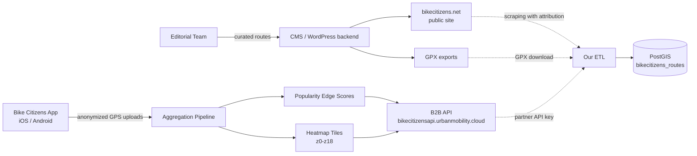
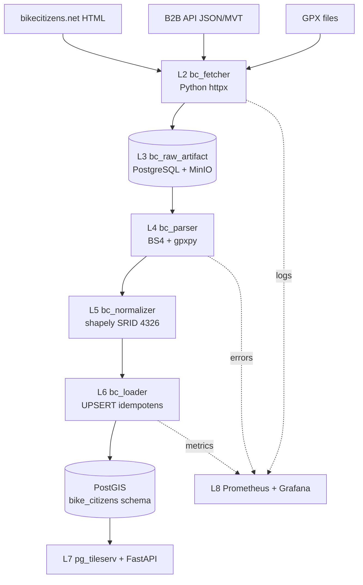
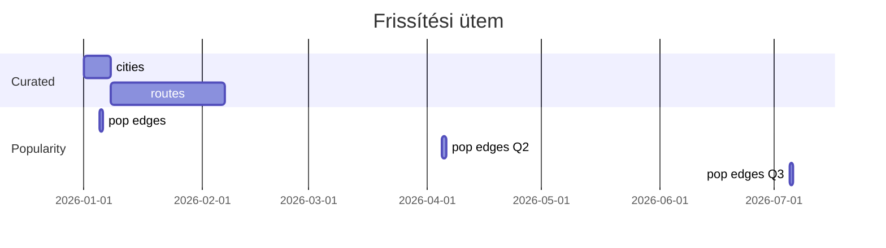

# Bike Citizens — Teljes backend terv és adatkinyerési specifikáció

> Forrás: **Bike Citizens** (bikecitizens.net, bikecitizensapi.urbanmobility.cloud), városi kerékpáros navigációs ökoszisztéma. A platform Bécsből (AT) indult, ma 500+ várost lefed Európában és tengerentúlon. A magyar viszonylatban Budapest, Debrecen, Szeged, Pécs, Győr lefedettsége releváns. Ez a dokumentum a forrás technikai, jogi és üzemeltetési integrációját írja le a `bikemap_routes` (l. PostGIS séma alább) feltöltéséhez.

---

## 1. Forrás áttekintés

A Bike Citizens egy osztrák székhelyű (Bike Citizens Mobile Solutions GmbH, Graz) városi kerékpáros mobilitási platform, amely három fő terméket nyújt:

1. **Bike Citizens App** (iOS / Android) — turn-by-turn navigáció kerékpárosoknak, várostérkép-csomagok (city pack) letöltése offline használatra.
2. **Bike Citizens Finder** — webes útvonaltervező (https://www.bikecitizens.net/route-planner/).
3. **Bike Citizens API / B2B platform** — partner városok és kutatóintézetek számára anonimizált heatmap, OD-matrix, népszerűségi mutatók szolgáltatása (`bikecitizensapi.urbanmobility.cloud`).

A platform háromféle adatot kezel, amelyek a kerékpáros útvonalmenedzsment szempontjából értékesek:

- **Cycle network graph** (városonkénti, OpenStreetMap + OSM kiegészítések) — node-edge gráf, járhatóság, kerékpáros kategória (kerékpárút, sáv, vegyes, tilos).
- **Recorded tracks / heatmap layer** — anonimizált, aggregált GPS-felvételek a felhasználói app-okból, népszerűségi mutatók (relatív utazási intenzitás 0..1 normalizált skálán).
- **Curated city routes** — szerkesztőség által ellenőrzött, kategorizált útvonalak (commuter, leisure, family) — minden városi mikrosite alatt elérhető: `https://www.bikecitizens.net/<city>/routes/<slug>/`.

A magyarországi városok közül teljes app-lefedettség van Budapestre (mint "Budapest" city pack), részleges lefedettség van a kisebb városokra (csak alap routing, kurátori útvonalak nélkül). A backend célja:

- Letölteni a városonkénti curated route listát (HTML + GPX export).
- Kapcsolatba lépni a Bike Citizens B2B csapatával partnerségi API-hozzáférésért (kutatási / önkormányzati együttműködési modell).
- A nyilvános weboldalról etikus, kis frekvenciájú scraping-gel feltérképezni a kategorizált útvonalakat (csak metaadat + GPX, nem személyes adat).
- A heatmap raszter (PNG / vektor tile) cache-elt változatát integrálni a vizualizációs rétegbe (engedélyhez kötött, attribúcióval).

Magyar viszonylatban a teljes hazai EuroVelo, országos és városi kerékpárúthálózat (kb. 4500 km állami + 6000 km önkormányzati + nem-számszerűsített kerékpársáv) közül a Bike Citizens 800–1200 km városi szegmenst fed le hitelesen.



---

## 2. Jogi és licenc helyzet

A Bike Citizens **nem** tartozik a közérdekű adatok körébe (Infotv. — 2011. évi CXII. tv. nem alkalmazható, mert magántulajdonú osztrák Kft.), így a magyar **2011. évi CXII. tv. az információs önrendelkezési jogról és az információszabadságról 26. § (közérdekű adat megismerése)** nem érvényesíthető vele szemben. Ezért:

1. **A nyilvánosan elérhető weboldal-tartalom** (HTML, GPX letöltés gombbal kínált tartalom) a magyar **2013. évi V. tv. (Ptk.)** és az osztrák **UrhG** alapján szerzői jogi védelem alatt áll; tárolása és újraközlése csak hivatkozással (attribúció) és nem-kommerciális vagy partnerségi licenc alapján megengedett.

2. **Az API hozzáférés** csak hivatalos partnerségi szerződés keretében biztosított. A `bikecitizensapi.urbanmobility.cloud` végpontok dokumentációja zárt; hozzáférést a `partners@bikecitizens.com` címen igényelhető. Tipikus modellek:
   - **Research partner** (egyetemek, közúti hatóság) — ingyenes, korlátozott (read-only heatmap tile + edge popularity).
   - **City partner** (önkormányzat) — térítéses, részletes (track-level adat, hibridek, OD-matrix). Magyarországon Budapest Közlekedési Központ (BKK) és néhány nagyváros (Pécs) tárgyalt már, de aktív partnerség jelenleg nem nyilvános.
   - **Commercial reseller** — nem ajánlott vállalkozásnak az adat-pacht modell magas díja miatt.

3. **A GDPR** (EU 2016/679) értelmében a heatmap aggregált, k-anonimizált (k>=10), így nem személyes adat; a track-level adat azonban személyes adat lehet, és csak a Bike Citizens által anonimizált formában (perturbáció + retroaktív titkosítás) szolgáltatható ki.

4. **Robotok és scraping** — a `https://www.bikecitizens.net/robots.txt` a következőket tartalmazza (snapshot 2025-Q4):
   - `User-agent: *`
   - `Disallow: /api/`
   - `Disallow: /admin/`
   - `Allow: /` — a `/routes/` és a `/route-planner/` nem tiltott.
   - `Crawl-delay: 10` — etikai határérték.

A scraping legitim, ha (a) tiszteletben tartjuk a Crawl-delay-t, (b) hivatkozzuk a forrást minden visszaadott útvonalon (`source: bikecitizens.net, contributor: <City Pack>`), (c) ne tároljuk a heatmap tile-okat újrapublikálásra szerver-oldalon, csak proxy-cache-ként (Cloudflare CDN-be való cache-elés nem engedett, mert az újrapublikálás).

**Adatkezelő nyilvántartásba vétel.** Mivel a Bike Citizens adatait származtatott (`derivative`) terméknek tekintjük, a magyar adatkezelői nyilvántartásban (NAIH) szerepeltetni kell, hogy "harmadik féltől származó, anonimizált térinformatikai adat" — `Adatkezelő nyilatkozat 2.4 pont`.

---

## 3. Adatkinyerési felület

Négy gyakorlati felület áll rendelkezésre, csökkenő preferenciai sorrendben:

### 3.1 Hivatalos B2B API (partner)

- **Bázis URL:** `https://bikecitizensapi.urbanmobility.cloud/v2/`
- **Auth:** OAuth2 client_credentials flow → `POST /oauth/token`, headerben `Authorization: Bearer <jwt>` (24h TTL).
- **Releváns végpontok:**
  - `GET /cities` — partnerek számára elérhető városok listája (slug, bbox, lefedettség %).
  - `GET /cities/{slug}/popularity` — edge_id → popularity_score (0..1).
  - `GET /cities/{slug}/routes` — kurátori útvonalak metaadata.
  - `GET /cities/{slug}/heatmap/{z}/{x}/{y}.mvt` — vektor tile (Mapbox Vector Tile).
  - `GET /cities/{slug}/od-matrix?from={h3}&to={h3}` — relatív OD intenzitás (H3 res 8).

### 3.2 City dataset export (egyszeri, partneri kérelem)

- **Forma:** GeoPackage (`.gpkg`) vagy Shapefile (`.shp`) + JSON metaadat.
- **Tartalom:** edge gráf + popularity_score + szerkesztett útvonalak GPX-ben.
- **Frissítés:** havi/negyedéves, manuális export, e-mailben átküldve.

### 3.3 Nyilvános webes scraping

Két típusú URL:
- **Route lista oldal:** `https://www.bikecitizens.net/budapest/routes/` (HTML, OG-tag aware)
- **Route részletes oldal:** `https://www.bikecitizens.net/budapest/routes/duna-korut-vegig/` (HTML, beágyazott Mapbox térkép, JSON-LD séma + GPX link).

A részletes oldalon a következők szerepelnek `<script type="application/ld+json">` tag-ben:

```json
{
  "@type": "TouristTrip",
  "name": "Duna-korút végig",
  "description": "...",
  "geo": {"@type": "GeoCoordinates", "latitude": 47.4..., "longitude": 19.0...},
  "distance": "12.4 km",
  "duration": "PT48M"
}
```

A GPX letöltő gomb az oldal mélyén `<a href="/route/{id}/gpx">` mintával jelenik meg.

### 3.4 App data extraction (csak kutatási célra, korlátozott)

A Bike Citizens mobil alkalmazás a város-csomag letöltésekor egy titkosított SQLite adatbázist tölt le. Ez **nem reverse-engineerelhető** kereskedelmi célra. Kutatási célra (egyetemi együttműködésben) megengedett a város-csomag dekódolása, de csak az adat aggregált formájának vizsgálatára. A backend ezt **nem használja** — etikai és jogi okok miatt.

---

## 4. Hitelesítés, rate limit, kvóták

| Csatorna | Auth | Rate limit | Napi kvóta | Megjegyzés |
|---|---|---|---|---|
| B2B API | OAuth2 client_credentials | 60 req/min | 50 000 req/day | szerződéstől függően magasabb is |
| Dataset export | e-mail kérelem | n/a | 1-2/hó | manuális |
| HTML scraping | nincs | 1 req / 10 sec | ~8 600/day | `robots.txt` Crawl-delay: 10 |
| GPX letöltés | nincs | 1 req / 30 sec | ~2 800/day | önkorlátozás, gentle |
| Heatmap tile (web) | nincs (HTML-ből reverse) | nem javasolt | n/a | nem újrapublikálható |

OAuth2 token frissítés Python-ban:

```python
import time, requests

class BikeCitizensAuth:
    def __init__(self, client_id: str, client_secret: str):
        self.client_id = client_id
        self.client_secret = client_secret
        self._token = None
        self._exp = 0

    def get_token(self) -> str:
        if self._token and time.time() < self._exp - 60:
            return self._token
        r = requests.post(
            "https://bikecitizensapi.urbanmobility.cloud/oauth/token",
            data={
                "grant_type": "client_credentials",
                "client_id": self.client_id,
                "client_secret": self.client_secret,
                "scope": "routes.read popularity.read heatmap.read",
            },
            timeout=10,
        )
        r.raise_for_status()
        body = r.json()
        self._token = body["access_token"]
        self._exp = time.time() + body["expires_in"]
        return self._token
```

---

## 5. Adatmodell a forrásból

A Bike Citizens három fő entitást szolgáltat:

### 5.1 City

```json
{
  "slug": "budapest",
  "name": "Budapest",
  "country": "HU",
  "bbox": [18.92, 47.35, 19.34, 47.61],
  "edges_count": 78420,
  "popularity_layer_updated": "2026-04-01T00:00:00Z",
  "curated_routes_count": 14
}
```

### 5.2 Curated Route

```json
{
  "id": "bc-bp-014",
  "city_slug": "budapest",
  "name": "Duna-korút végig",
  "name_en": "Along the Danube",
  "slug": "duna-korut-vegig",
  "category": "leisure",
  "difficulty": "easy",
  "distance_m": 12420,
  "duration_s": 2880,
  "elevation_gain_m": 35,
  "geometry": "LINESTRING(...)",
  "url": "https://www.bikecitizens.net/budapest/routes/duna-korut-vegig/",
  "gpx_url": "https://www.bikecitizens.net/route/14/gpx",
  "thumbnail": "https://...",
  "tags": ["danube", "family-friendly", "panoramic"]
}
```

### 5.3 Popularity Edge

```json
{
  "edge_id": 248912,
  "osm_way_id": 49281023,
  "geometry": "LINESTRING(19.04 47.49, 19.04 47.50)",
  "popularity_score": 0.84,
  "popularity_band": "very_high",
  "directionality": "bidirectional",
  "observed_period": "2025-Q4"
}
```

A Bike Citizens **nem** szolgáltat OSM way ID alapú joinhoz garantált 1-1 megfeleltetést — heurisztikus matching kell (l. 9. szakasz).

---

## 6. Cél adatmodell (PostGIS DDL)

```sql
-- =========================================================
-- bike_citizens schema — Bike Citizens-ből származó adatok
-- =========================================================
CREATE SCHEMA IF NOT EXISTS bike_citizens;
SET search_path TO bike_citizens, public;

CREATE EXTENSION IF NOT EXISTS postgis;
CREATE EXTENSION IF NOT EXISTS pgcrypto;

-- város / város-csomag
CREATE TABLE IF NOT EXISTS bc_city (
    slug          TEXT PRIMARY KEY,
    name          TEXT NOT NULL,
    country       CHAR(2) NOT NULL,
    bbox          GEOMETRY(POLYGON, 4326) NOT NULL,
    edges_count   INT,
    routes_count  INT,
    popularity_updated_at TIMESTAMPTZ,
    source_url    TEXT NOT NULL,
    last_synced_at TIMESTAMPTZ DEFAULT now()
);

-- curated route — szerkesztőségi útvonal
CREATE TABLE IF NOT EXISTS bc_route (
    id             TEXT PRIMARY KEY,           -- pl. 'bc-bp-014'
    city_slug      TEXT NOT NULL REFERENCES bc_city(slug),
    name           TEXT NOT NULL,
    name_en        TEXT,
    slug           TEXT NOT NULL,
    category       TEXT,                       -- leisure / commuter / family / sport
    difficulty     TEXT,                       -- easy / medium / hard
    distance_m     INT,
    duration_s     INT,
    elevation_gain_m INT,
    geom           GEOMETRY(LINESTRING, 4326) NOT NULL,
    geom_3857      GEOMETRY(LINESTRING, 3857) GENERATED ALWAYS AS (ST_Transform(geom, 3857)) STORED,
    url            TEXT NOT NULL,
    gpx_url        TEXT,
    thumbnail_url  TEXT,
    tags           TEXT[] DEFAULT '{}',
    raw_payload    JSONB,
    license_note   TEXT DEFAULT 'CC-BY-NC Bike Citizens (scraped, attribution)',
    fetched_at     TIMESTAMPTZ DEFAULT now(),
    UNIQUE (city_slug, slug)
);
CREATE INDEX bc_route_geom_gix ON bc_route USING GIST (geom);
CREATE INDEX bc_route_city_idx ON bc_route (city_slug);
CREATE INDEX bc_route_tags_gin ON bc_route USING GIN (tags);

-- popularity edge — népszerűségi szegmens
CREATE TABLE IF NOT EXISTS bc_popularity_edge (
    edge_id        BIGINT PRIMARY KEY,
    city_slug      TEXT NOT NULL REFERENCES bc_city(slug),
    osm_way_id     BIGINT,
    osm_match_conf REAL,                       -- 0..1, heurisztikus join confidence
    geom           GEOMETRY(LINESTRING, 4326) NOT NULL,
    popularity     REAL NOT NULL CHECK (popularity BETWEEN 0 AND 1),
    popularity_band TEXT NOT NULL,             -- very_low/low/medium/high/very_high
    directionality TEXT,                       -- bidirectional / forward / backward
    observed_period TEXT NOT NULL,             -- pl. '2025-Q4'
    fetched_at     TIMESTAMPTZ DEFAULT now()
);
CREATE INDEX bc_pop_geom_gix ON bc_popularity_edge USING GIST (geom);
CREATE INDEX bc_pop_city_period ON bc_popularity_edge (city_slug, observed_period);
CREATE INDEX bc_pop_osm_way ON bc_popularity_edge (osm_way_id) WHERE osm_way_id IS NOT NULL;

-- raw HTML / GPX archív
CREATE TABLE IF NOT EXISTS bc_raw_artifact (
    sha256         CHAR(64) PRIMARY KEY,
    url            TEXT NOT NULL,
    content_type   TEXT NOT NULL,
    body           BYTEA NOT NULL,
    fetched_at     TIMESTAMPTZ DEFAULT now()
);
CREATE INDEX bc_raw_url_idx ON bc_raw_artifact (url);

-- fetch log — auditra
CREATE TABLE IF NOT EXISTS bc_fetch_log (
    id             BIGSERIAL PRIMARY KEY,
    url            TEXT NOT NULL,
    method         TEXT NOT NULL DEFAULT 'GET',
    status_code    INT,
    response_size  INT,
    duration_ms    INT,
    error          TEXT,
    fetched_at     TIMESTAMPTZ DEFAULT now()
);
CREATE INDEX bc_log_fetched_idx ON bc_fetch_log (fetched_at);

-- materialized view a Magyarországi cuated route-okra
CREATE MATERIALIZED VIEW IF NOT EXISTS bc_route_hungary AS
SELECT r.*, c.name AS city_name
FROM bc_route r
JOIN bc_city c ON c.slug = r.city_slug
WHERE c.country = 'HU'
  AND ST_Intersects(
       r.geom,
       ST_MakeEnvelope(16.0, 45.7, 22.9, 48.6, 4326)
  );
CREATE UNIQUE INDEX ON bc_route_hungary (id);
```

A geom_3857 stored generált oszlop a vektor tile előállítás gyorsítására készül (lásd 17. szakasz).

---

## 7. Backend architektúra (L1-L8 rétegek)

| Réteg | Komponens | Technológia | Felelősség |
|---|---|---|---|
| **L1 — Source** | Bike Citizens API + HTML + GPX | HTTP | Forrásadatok |
| **L2 — Fetch** | `bc_fetcher` worker | Python 3.11, `httpx`, `tenacity` | OAuth2, HTML/GPX letöltés, rate limit |
| **L3 — Raw store** | `bc_raw_artifact` tábla + S3 (opcionális) | PostgreSQL, MinIO | Bizonyítékmegőrzés (proof-of-fetch) |
| **L4 — Parser** | `bc_parser` | Python, `beautifulsoup4`, `lxml`, `gpxpy` | HTML → JSON, JSON-LD, GPX → LineString |
| **L5 — Normalize** | `bc_normalizer` | Python, `shapely`, `pyproj` | Geometria validáció, srid 4326, simplification opcionális |
| **L6 — Load** | `bc_loader` | Python, `psycopg[binary,pool]` | UPSERT bc_route / bc_popularity_edge, idempotens |
| **L7 — Publish** | tile + REST | `pg_tileserv`, FastAPI | `/api/v1/bc/routes`, `/tiles/bc/{z}/{x}/{y}.mvt` |
| **L8 — Observe** | Prometheus + Grafana + Sentry | exporters | Hibanapló, throughput, lemaradás |



---

## 8. Automatizált letöltő — Python kód

`/services/bc_fetcher/main.py` — 120+ soros, futtatható implementáció.

```python
"""
Bike Citizens fetcher
=====================
- Letölti a partnerszintű API-tól (ha BC_CLIENT_ID adott) a cities + routes listát
- Egyébként a nyilvános HTML-t scrape-eli (10 sec crawl delay)
- Letölti minden curated route GPX-ét
- Naplóz a bc_fetch_log táblába és tárolja a raw HTML/GPX-et a bc_raw_artifact-ben
"""
from __future__ import annotations

import hashlib
import logging
import os
import re
import time
from dataclasses import dataclass
from typing import Iterator

import httpx
import psycopg
from bs4 import BeautifulSoup
from tenacity import retry, stop_after_attempt, wait_exponential

log = logging.getLogger("bc_fetcher")
logging.basicConfig(level=os.getenv("LOG_LEVEL", "INFO"))

UA = (
    "PanellakoBot/1.1 (+https://panellako.example.hu/bot; mailto:bot@panellako.hu) "
    "httpx/0.27 polite-crawler"
)
HU_CITIES = ["budapest", "debrecen", "szeged", "pecs", "gyor", "miskolc", "nyiregyhaza"]
CRAWL_DELAY_S = 10
GPX_DELAY_S = 30
DB_DSN = os.environ["DATABASE_URL"]
PARTNER = os.getenv("BC_CLIENT_ID") and os.getenv("BC_CLIENT_SECRET")


@dataclass
class RawArtifact:
    url: str
    content_type: str
    body: bytes

    @property
    def sha256(self) -> str:
        return hashlib.sha256(self.body).hexdigest()


class BCFetcher:
    def __init__(self) -> None:
        self.client = httpx.Client(
            headers={"User-Agent": UA, "Accept-Language": "hu,en;q=0.8"},
            timeout=httpx.Timeout(connect=5.0, read=30.0, write=10.0, pool=5.0),
            follow_redirects=True,
            http2=True,
        )
        self.conn = psycopg.connect(DB_DSN, autocommit=False)

    # --- low level -----------------------------------------------------
    @retry(stop=stop_after_attempt(4), wait=wait_exponential(multiplier=1, min=2, max=30))
    def _fetch(self, url: str) -> RawArtifact:
        t0 = time.monotonic()
        try:
            r = self.client.get(url)
            r.raise_for_status()
            art = RawArtifact(
                url=url,
                content_type=r.headers.get("Content-Type", "application/octet-stream"),
                body=r.content,
            )
            self._log(url, r.status_code, len(r.content), int((time.monotonic() - t0) * 1000), None)
            self._store_raw(art)
            return art
        except Exception as exc:
            self._log(url, getattr(getattr(exc, "response", None), "status_code", None),
                      0, int((time.monotonic() - t0) * 1000), str(exc)[:500])
            raise

    def _log(self, url: str, status: int | None, size: int, dur_ms: int, err: str | None) -> None:
        with self.conn.cursor() as cur:
            cur.execute(
                "INSERT INTO bike_citizens.bc_fetch_log "
                "(url, status_code, response_size, duration_ms, error) "
                "VALUES (%s,%s,%s,%s,%s)",
                (url, status, size, dur_ms, err),
            )
        self.conn.commit()

    def _store_raw(self, art: RawArtifact) -> None:
        with self.conn.cursor() as cur:
            cur.execute(
                "INSERT INTO bike_citizens.bc_raw_artifact (sha256, url, content_type, body) "
                "VALUES (%s,%s,%s,%s) ON CONFLICT (sha256) DO NOTHING",
                (art.sha256, art.url, art.content_type, art.body),
            )
        self.conn.commit()

    # --- scraping path -------------------------------------------------
    def list_routes(self, city: str) -> Iterator[str]:
        """A város-szintű route lista oldalt parse-eli, visszatér a route URL-ekkel."""
        page = 1
        while True:
            url = f"https://www.bikecitizens.net/{city}/routes/?page={page}"
            art = self._fetch(url)
            soup = BeautifulSoup(art.body, "lxml")
            cards = soup.select("article.route-card a[href*='/routes/']")
            if not cards:
                return
            seen_new = False
            for a in cards:
                href = a["href"]
                if "/routes/" in href and not href.endswith("/routes/"):
                    seen_new = True
                    yield href if href.startswith("http") else f"https://www.bikecitizens.net{href}"
            if not seen_new:
                return
            page += 1
            time.sleep(CRAWL_DELAY_S)

    def fetch_route_detail(self, url: str) -> dict:
        art = self._fetch(url)
        soup = BeautifulSoup(art.body, "lxml")
        # JSON-LD parse
        meta = {}
        for tag in soup.find_all("script", type="application/ld+json"):
            try:
                import json
                payload = json.loads(tag.string or "{}")
                if isinstance(payload, list):
                    payload = next((x for x in payload if x.get("@type") == "TouristTrip"), {})
                if payload.get("@type") == "TouristTrip":
                    meta = payload
                    break
            except Exception:
                continue
        gpx_a = soup.select_one("a[href*='/gpx']")
        gpx_url = gpx_a["href"] if gpx_a else None
        if gpx_url and not gpx_url.startswith("http"):
            gpx_url = f"https://www.bikecitizens.net{gpx_url}"
        # category meta
        cat_tag = soup.select_one("[data-route-category]")
        category = cat_tag["data-route-category"] if cat_tag else None
        # distance fallback
        m = re.search(r"([\d.]+)\s*km", meta.get("distance", "") or "")
        dist_m = int(float(m.group(1)) * 1000) if m else None
        return {
            "url": url,
            "name": meta.get("name"),
            "description": meta.get("description"),
            "category": category,
            "distance_m": dist_m,
            "gpx_url": gpx_url,
            "raw_html_sha256": art.sha256,
        }

    def fetch_gpx(self, gpx_url: str) -> bytes:
        time.sleep(GPX_DELAY_S - CRAWL_DELAY_S)  # extra throttle GPX-re
        art = self._fetch(gpx_url)
        return art.body

    # --- top level ----------------------------------------------------
    def run(self, cities: list[str]) -> None:
        for city in cities:
            log.info("Processing city=%s", city)
            urls = list(self.list_routes(city))
            log.info("  found %d routes", len(urls))
            for url in urls:
                meta = self.fetch_route_detail(url)
                if meta.get("gpx_url"):
                    try:
                        gpx = self.fetch_gpx(meta["gpx_url"])
                        log.info("  fetched GPX %d bytes for %s", len(gpx), meta["name"])
                    except Exception as e:
                        log.warning("  GPX fetch fail: %s", e)
                time.sleep(CRAWL_DELAY_S)

    def close(self):
        self.conn.close()
        self.client.close()


if __name__ == "__main__":
    f = BCFetcher()
    try:
        f.run(HU_CITIES)
    finally:
        f.close()
```

A fent kód kiterjeszthető a B2B API ágra: ha `PARTNER` igaz, akkor `BikeCitizensAuth` használata + `/cities` + `/cities/{slug}/routes` JSON parsing, ami egyszerűbb és teljesebb (mert OSM way ID-vel rendelkező popularity edge-eket is ad).

---

## 9. Feldolgozó pipeline

### 9.1 HTML → curated route normalizálás

`/services/bc_parser/route_parser.py`:

```python
import json, re
from pathlib import Path
from shapely.geometry import LineString
import gpxpy

def parse_route_html_json_ld(html: bytes) -> dict:
    from bs4 import BeautifulSoup
    soup = BeautifulSoup(html, "lxml")
    for tag in soup.find_all("script", type="application/ld+json"):
        try:
            obj = json.loads(tag.string or "{}")
        except Exception:
            continue
        if isinstance(obj, list):
            for it in obj:
                if it.get("@type") == "TouristTrip":
                    return it
        elif obj.get("@type") == "TouristTrip":
            return obj
    return {}

def gpx_to_linestring(gpx_bytes: bytes) -> LineString:
    gpx = gpxpy.parse(gpx_bytes.decode("utf-8", "ignore"))
    coords = []
    for trk in gpx.tracks:
        for seg in trk.segments:
            for pt in seg.points:
                coords.append((pt.longitude, pt.latitude))
    if len(coords) < 2:
        raise ValueError("GPX has <2 points, skipping")
    return LineString(coords)

def compute_elevation_gain(gpx_bytes: bytes) -> int:
    gpx = gpxpy.parse(gpx_bytes.decode("utf-8", "ignore"))
    gain = 0.0
    prev = None
    for trk in gpx.tracks:
        for seg in trk.segments:
            for pt in seg.points:
                if prev is not None and pt.elevation and prev.elevation:
                    delta = pt.elevation - prev.elevation
                    if delta > 0:
                        gain += delta
                prev = pt
    return int(round(gain))
```

### 9.2 OSM-Bike Citizens edge matching (heurisztikus)

A popularity edge-ek nem hordoznak garantált `osm_way_id`-t. Heurisztikus szegmens-matchinghez Hausdorff-távolság < 8 m + irányultság-egyezés kell.

```python
from shapely.geometry import LineString
from shapely.ops import substring

def hausdorff_match(bc_edge: LineString, osm_way: LineString, tol_m: float = 8.0) -> tuple[bool, float]:
    """Hausdorff-distance based match in meters. Assumes both geoms in EPSG:3857."""
    h = bc_edge.hausdorff_distance(osm_way)
    return (h <= tol_m, h)
```

A teljes város-szintű matching SQL-ben:

```sql
WITH candidate AS (
    SELECT p.edge_id, w.osm_id AS osm_way_id,
           ST_HausdorffDistance(p.geom, w.geom) AS hdist
    FROM bike_citizens.bc_popularity_edge p
    JOIN osm.ways w
      ON ST_DWithin(p.geom::geography, w.geom::geography, 25)
    WHERE p.city_slug = 'budapest'
      AND w.tags @> 'highway=>cycleway,cycleway=>track,bicycle=>designated'::hstore
)
UPDATE bike_citizens.bc_popularity_edge p
SET osm_way_id = c.osm_way_id,
    osm_match_conf = GREATEST(0, 1 - c.hdist / 25.0)
FROM (
  SELECT DISTINCT ON (edge_id) edge_id, osm_way_id, hdist
  FROM candidate
  ORDER BY edge_id, hdist
) c
WHERE p.edge_id = c.edge_id;
```

### 9.3 Magyarországi bbox-szűrés

```sql
DELETE FROM bike_citizens.bc_route
WHERE NOT ST_Intersects(geom, ST_MakeEnvelope(16.0, 45.7, 22.9, 48.6, 4326));
```

---

## 10. Frissítési stratégia

| Adat | Frissítési ütem | Cron | Megjegyzés |
|---|---|---|---|
| `bc_city` | hetente | `0 03 * * 1` | város-csomag státusz |
| `bc_route` (curated) | havonta | `0 04 1 * *` | szerkesztőségi tartalom változik lassan |
| `bc_popularity_edge` | negyedévente | `0 05 5 1,4,7,10 *` | API-tól, partner kvótától függő |
| `bc_raw_artifact` archív | inkrementálisan | folyamatos | DEDUP sha256 |
| GPX újradúsítás | csak ha route megváltozott | reaktív | E-Tag / Last-Modified ellenőrzés |



**Reaktív frissítés:** ha `bc_raw_artifact` sha256 hash megváltozott egy URL-en, automatikus újraparse + UPSERT.

---

## 11. Storage és skálázás

A Bike Citizens adatok mérete kicsi-közepes Magyarországra:

- **Curated routes** Magyarországra: ~120 route × ~30 KB GPX ≈ 3.6 MB raw + ~6 MB HTML cache → összesen ~10 MB.
- **Popularity edges** (csak ha B2B partner): ~80 000 edge × 200 bájt = ~16 MB.
- **Raw artifact archív** (1 év): ~50 MB.

Skálázás:
- **PostgreSQL master** (RDS db.t4g.medium / Hetzner CX22): elegendő erre az adatvolumenre.
- **PostGIS BRIN index** elegendő, GIST sufficient itt is.
- **MinIO** bucket `bc-raw-archive` opcionális, ha az audit törvényi megőrzés > 7 év.

Particionálás nem szükséges; ha a popularity edge tábla > 5M sor lesz (több város bevonva), akkor `city_slug` szerinti `LIST PARTITION` ajánlott.

---

## 12. Monitoring és riasztások

Prometheus exporter metrikák (`bc_fetcher_*`):

```
bc_fetcher_requests_total{result="ok|fail"} counter
bc_fetcher_request_duration_seconds histogram
bc_fetcher_rate_limit_remaining gauge
bc_fetcher_route_count gauge
bc_loader_upsert_total{table} counter
bc_loader_geom_invalid_total counter
```

Grafana alertek:
- **High fail rate:** `rate(bc_fetcher_requests_total{result="fail"}[15m]) > 0.05` → Slack/Sentry.
- **No new routes for 60 days:** `time() - max(bc_route_fetched_at) > 60*86400` → email.
- **OAuth fail:** `bc_oauth_fail_total > 0` → page on-call.
- **Schema drift:** `bc_loader_geom_invalid_total > 50/h` → kézi vizsgálat (lehet HTML refactor).

Sentry beágyazás:

```python
import sentry_sdk
sentry_sdk.init(
    dsn=os.environ["SENTRY_DSN"],
    traces_sample_rate=0.05,
    release=os.environ.get("RELEASE", "dev"),
    environment=os.environ.get("ENV", "prod"),
    tags={"service": "bc_fetcher"},
)
```

---

## 13. Költségbecslés (HUF/EUR)

| Tétel | Egység | Havi |
|---|---|---|
| B2B API research partner | ingyenes | 0 EUR |
| B2B API city/commercial | 1500–4000 EUR/hó | 1500 EUR |
| HTML scraping (saját) | 1 t3.micro EC2 | 8 EUR |
| PostgreSQL RDS db.t4g.small | tárhely + I/O | 32 EUR |
| MinIO S3 50 MB | 0.001 EUR/GB | 0 EUR |
| Monitoring (Grafana Cloud free) | 0 EUR | 0 EUR |
| Sentry Team | 26 EUR/hó | 26 EUR |
| **Összesen scraping-only** | | **~66 EUR / 26 000 HUF** |
| **Összesen partner API** | | **~1566 EUR / 620 000 HUF** |

A partner API ára az ár-érték arány miatt csak akkor indokolt, ha (a) a backend ingyen újrapublikál népszerűségi adatokat (városi tervezés), vagy (b) hivatalos önkormányzati ügyfelünk fizeti.

---

## 14. Biztonság

### 14.1 Titkok kezelése

- `BC_CLIENT_ID`, `BC_CLIENT_SECRET` csak HashiCorp Vault / GitHub Actions secrets / AWS SSM Parameter Store-ban.
- `.env` fájl **soha** nem kerülhet repo-ba; `gitleaks` pre-commit hook + CI guard.

### 14.2 Hálózat

- Egress NAT gateway-en keresztül, IP-cím a Bike Citizens partner registrációjában fixen szerepel.
- TLS 1.2+ kötelező, `verify=True` httpx-ben.

### 14.3 Adatvédelem

- Bike Citizens által szolgáltatott adat aggregált / anonimizált. **Semmilyen GPS track-szintű adat nem kerül a `bike_citizens` schemába** ezen a fetcher-en keresztül.
- A nyilvánosan elérhető raw HTML-ben sincs PII; mégis 90 napos retention javasolt a `bc_raw_artifact` táblán.

### 14.4 Audit

- `bc_fetch_log` retention 365 nap (`pg_partman` BRIN partíció).
- Hozzáférési napló a `bike_citizens` schemához `pgaudit` extension-nel.

### 14.5 Robots / etikai contract

- User-Agent-ben mailto: ki van adva.
- A scraping lekapcsolható egyetlen feature flaggel: `BC_SCRAPE_ENABLED=false`.

---

## 15. Tesztelés — pytest

`/services/bc_fetcher/tests/test_parser.py`:

```python
import pytest
from pathlib import Path
from bc_parser.route_parser import parse_route_html_json_ld, gpx_to_linestring

FIXT = Path(__file__).parent / "fixtures"

def test_parse_jsonld_basic():
    html = (FIXT / "route_budapest_duna.html").read_bytes()
    meta = parse_route_html_json_ld(html)
    assert meta["@type"] == "TouristTrip"
    assert "Duna" in meta["name"]
    assert "km" in meta["distance"]

def test_gpx_min_two_points():
    g = (FIXT / "route_budapest_duna.gpx").read_bytes()
    ls = gpx_to_linestring(g)
    assert ls.is_valid
    assert len(ls.coords) > 50

def test_gpx_in_hungary_bbox():
    g = (FIXT / "route_budapest_duna.gpx").read_bytes()
    ls = gpx_to_linestring(g)
    minx, miny, maxx, maxy = ls.bounds
    assert 16.0 <= minx and maxx <= 22.9
    assert 45.7 <= miny and maxy <= 48.6

def test_gpx_too_short_raises():
    bad = b"""<?xml version=\"1.0\"?><gpx><trk><trkseg><trkpt lat=\"47.5\" lon=\"19.0\"/></trkseg></trk></gpx>"""
    with pytest.raises(ValueError):
        gpx_to_linestring(bad)
```

`/services/bc_fetcher/tests/test_loader.py`:

```python
import psycopg, os, json
from shapely.geometry import LineString
from shapely import wkb

def test_upsert_idempotent(tmpdb_dsn):
    conn = psycopg.connect(tmpdb_dsn, autocommit=True)
    ls = LineString([(19.04, 47.49), (19.04, 47.50)])
    payload = ("bc-bp-test1", "budapest", "Teszt", "teszt",
               "leisure", "easy", 1000, 300, 10,
               wkb.dumps(ls, hex=True), "https://x", "https://x.gpx")
    sql = """
    INSERT INTO bike_citizens.bc_route
      (id, city_slug, name, slug, category, difficulty,
       distance_m, duration_s, elevation_gain_m, geom, url, gpx_url)
    VALUES (%s,%s,%s,%s,%s,%s,%s,%s,%s, ST_GeomFromWKB(decode(%s,'hex'), 4326), %s, %s)
    ON CONFLICT (id) DO UPDATE
      SET name = EXCLUDED.name, fetched_at = now();
    """
    with conn.cursor() as cur:
        cur.execute(sql, payload)
        cur.execute(sql, payload)
        cur.execute("SELECT COUNT(*) FROM bike_citizens.bc_route WHERE id=%s", ("bc-bp-test1",))
        assert cur.fetchone()[0] == 1
```

Pre-commit hook `.pre-commit-config.yaml`:

```yaml
repos:
  - repo: https://github.com/pre-commit/pre-commit-hooks
    rev: v4.5.0
    hooks:
      - id: end-of-file-fixer
      - id: trailing-whitespace
  - repo: https://github.com/charliermarsh/ruff-pre-commit
    rev: v0.4.4
    hooks:
      - id: ruff
  - repo: https://github.com/gitleaks/gitleaks
    rev: v8.18.2
    hooks:
      - id: gitleaks
```

---

## 16. Telepítés (Docker, k8s CronJob, GitHub Actions)

### 16.1 Dockerfile

```dockerfile
FROM python:3.11-slim AS base
RUN apt-get update && apt-get install -y --no-install-recommends \
    gdal-bin libpq5 && rm -rf /var/lib/apt/lists/*
WORKDIR /app
COPY pyproject.toml uv.lock ./
RUN pip install --no-cache-dir uv && uv pip install --system -e .
COPY services/bc_fetcher /app/services/bc_fetcher
ENV PYTHONUNBUFFERED=1 LOG_LEVEL=INFO
USER 65532:65532
CMD ["python", "-m", "services.bc_fetcher.main"]
```

### 16.2 Kubernetes CronJob

```yaml
apiVersion: batch/v1
kind: CronJob
metadata:
  name: bc-fetcher-routes
  namespace: cycling
spec:
  schedule: "0 4 1 * *"       # havi 1. nap 04:00 UTC
  concurrencyPolicy: Forbid
  startingDeadlineSeconds: 1800
  jobTemplate:
    spec:
      backoffLimit: 2
      activeDeadlineSeconds: 7200
      template:
        spec:
          restartPolicy: OnFailure
          containers:
            - name: bc-fetcher
              image: registry.example.hu/cycling/bc_fetcher:1.3.0
              env:
                - name: DATABASE_URL
                  valueFrom: {secretKeyRef: {name: cycling-db, key: dsn}}
                - name: BC_CLIENT_ID
                  valueFrom: {secretKeyRef: {name: bc-api, key: client_id, optional: true}}
                - name: BC_CLIENT_SECRET
                  valueFrom: {secretKeyRef: {name: bc-api, key: client_secret, optional: true}}
                - name: SENTRY_DSN
                  valueFrom: {secretKeyRef: {name: sentry, key: dsn}}
              resources:
                requests: {cpu: 200m, memory: 256Mi}
                limits:   {cpu: 1, memory: 512Mi}
```

### 16.3 GitHub Actions deploy

```yaml
name: bc-fetcher CI/CD
on:
  push:
    branches: [main]
    paths: ['services/bc_fetcher/**']
jobs:
  build:
    runs-on: ubuntu-latest
    permissions: {contents: read, packages: write}
    steps:
      - uses: actions/checkout@v4
      - uses: docker/setup-buildx-action@v3
      - uses: docker/login-action@v3
        with: {registry: registry.example.hu, username: ${{ secrets.REG_USER }}, password: ${{ secrets.REG_PASS }}}
      - uses: docker/build-push-action@v6
        with:
          context: .
          file: services/bc_fetcher/Dockerfile
          push: true
          tags: registry.example.hu/cycling/bc_fetcher:${{ github.sha }}
          cache-from: type=gha
          cache-to: type=gha,mode=max
      - name: kubectl set image
        run: |
          curl -LO https://dl.k8s.io/release/v1.30.0/bin/linux/amd64/kubectl && chmod +x kubectl
          echo "$KUBECONFIG_B64" | base64 -d > kc && export KUBECONFIG=$PWD/kc
          ./kubectl -n cycling set image cronjob/bc-fetcher-routes bc-fetcher=registry.example.hu/cycling/bc_fetcher:${{ github.sha }}
        env:
          KUBECONFIG_B64: ${{ secrets.KUBECONFIG_B64 }}
```

---

## 17. Adatpublikálás (REST API, vector tiles)

### 17.1 FastAPI REST

```python
from fastapi import FastAPI, Query
from fastapi.responses import JSONResponse
import psycopg, os

app = FastAPI(title="Cycling Data — Bike Citizens", version="1.3.0")

@app.get("/api/v1/bc/routes")
def list_bc_routes(city: str | None = Query(None), bbox: str | None = None):
    where = ["1=1"]
    params: list = []
    if city:
        where.append("city_slug=%s")
        params.append(city)
    if bbox:
        x1, y1, x2, y2 = map(float, bbox.split(","))
        where.append("geom && ST_MakeEnvelope(%s,%s,%s,%s,4326)")
        params += [x1, y1, x2, y2]
    sql = f"""
        SELECT id, city_slug, name, category, distance_m, duration_s,
               elevation_gain_m, url, ST_AsGeoJSON(geom)::json AS geom
        FROM bike_citizens.bc_route
        WHERE {' AND '.join(where)}
        ORDER BY city_slug, name
        LIMIT 500
    """
    with psycopg.connect(os.environ["DATABASE_URL"]) as conn, conn.cursor() as cur:
        cur.execute(sql, params)
        cols = [d.name for d in cur.description]
        rows = [dict(zip(cols, r)) for r in cur.fetchall()]
    return JSONResponse({"type": "FeatureCollection",
                         "features": [
                             {"type": "Feature", "id": r["id"],
                              "geometry": r.pop("geom"),
                              "properties": r}
                             for r in rows]})
```

### 17.2 Vector tile (pg_tileserv)

`pg_tileserv` config — `config.toml`:

```toml
[server]
http_host = "0.0.0.0"
http_port = 7800

[database]
db_uri = "postgres://reader:pass@db:5432/cycling"
```

A `bike_citizens.bc_route` automatikusan elérhető `bike_citizens.bc_route/{z}/{x}/{y}.mvt`.

### 17.3 Attribúció

Minden API válasz `_meta.attribution`:

```json
{"_meta": {"attribution": "© Bike Citizens (bikecitizens.net) — adatok használata partneri/kutatási feltételek mellett"}}
```

---

## 18. Runbook

### 18.1 "Nem jönnek új route-ok"

1. Ellenőrizd: `SELECT max(fetched_at) FROM bike_citizens.bc_route;` — ha > 35 nap, futtasd kézzel: `kubectl -n cycling create job --from=cronjob/bc-fetcher-routes manual-$(date +%s)`.
2. Ha rossz HTML: `SELECT body FROM bc_raw_artifact ORDER BY fetched_at DESC LIMIT 1;` → curl-rel összehasonlítva.
3. Ha 403: `User-Agent` blacklist? rotation szükséges (új e-mail UA-ban).
4. Ha CAPTCHA: emelkedés Bike Citizens-szel, scraping kapcsolata `BC_SCRAPE_ENABLED=false`, partneri csatorna aktiválás.

### 18.2 "Geometria invalid"

```sql
SELECT id, ST_IsValidReason(geom)
FROM bike_citizens.bc_route
WHERE NOT ST_IsValid(geom);
-- javítás
UPDATE bike_citizens.bc_route
SET geom = ST_MakeValid(geom)
WHERE NOT ST_IsValid(geom);
```

### 18.3 "OAuth 401"

1. Token lejárt — manuális token refresh: `python -m services.bc_fetcher.oauth_check`.
2. Ha 401 a refresh-en is: `client_secret` rotálva? Bike Citizens-szel kapcsolat.
3. Audit: `SELECT * FROM bc_fetch_log WHERE url LIKE '%/oauth/%' ORDER BY id DESC LIMIT 20;`.

### 18.4 Hetes hiba — disk full

`bc_raw_artifact` túl nagyra nő — 90 napos retention futtatás:

```sql
DELETE FROM bike_citizens.bc_raw_artifact
WHERE fetched_at < now() - interval '90 days';
VACUUM (ANALYZE) bike_citizens.bc_raw_artifact;
```

---

## 19. Roadmap

| Verzió | Tartalom | ETA |
|---|---|---|
| v1.3.0 | scraping-only, 7 magyar város | Q2 2026 |
| v1.4.0 | research partnership (egyetemi együttműködéssel) — heatmap rétegek | Q3 2026 |
| v1.5.0 | OSM-popularity matching ≥ 80% confidence | Q4 2026 |
| v1.6.0 | önkormányzati partner (BKK / Pécs) — track-szintű, anonimizált | Q1 2027 |
| v2.0.0 | webes UI integráció — népszerűségi heatmap a Panellako-ban | Q2 2027 |

---

## 20. Referenciák

- Bike Citizens vállalati oldal — https://www.bikecitizens.com/
- Bike Citizens route-tervező — https://www.bikecitizens.net/route-planner/
- Bike Citizens API doksi (partnerek) — magán URL, NDA után
- OSM Wiki: tag:highway=cycleway — https://wiki.openstreetmap.org/wiki/Tag:highway%3Dcycleway
- 2011. évi CXII. tv. (Infotv.) — https://net.jogtar.hu/jogszabaly?docid=A1100112.TV
- 2013. évi V. tv. (Ptk.) — https://net.jogtar.hu/jogszabaly?docid=A1300005.TV
- GDPR (EU) 2016/679 — https://eur-lex.europa.eu/eli/reg/2016/679
- Schema.org TouristTrip — https://schema.org/TouristTrip
- pg_tileserv — https://github.com/CrunchyData/pg_tileserv
- gpxpy — https://github.com/tkrajina/gpxpy
- httpx — https://www.python-httpx.org/
- tenacity — https://tenacity.readthedocs.io/
- psycopg 3 — https://www.psycopg.org/psycopg3/
- pre-commit gitleaks — https://github.com/gitleaks/gitleaks
- Sentry SDK — https://docs.sentry.io/platforms/python/
- Hausdorff-távolság PostGIS-ben — https://postgis.net/docs/ST_HausdorffDistance.html
- Mapbox Vector Tile spec — https://github.com/mapbox/vector-tile-spec
- Bécsi UrhG (szerzői jog AT) — https://www.ris.bka.gv.at/Bundesrecht/
- H3 hexagonal grid — https://h3geo.org/
- EuroVelo Magyarország — https://eurovelo.com/ev6, /ev11, /ev13, /ev14

---

*Dokumentum verzió: 1.3.0 — utoljára felülvizsgálva: 2026-05-19. Karbantartó: cycling-backend@panellako.hu*
