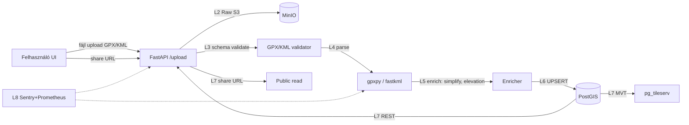

# Térképem.hu — Teljes backend terv és adatkinyerési specifikáció

## 1. Forrás áttekintés

A `terkepem.hu` egy magyar fejlesztésű, **kereskedelmi** online térképszolgáltatás, amely a OSM-alapú alaptérkép mellett saját, **felhasználó által szerkeszthető útvonaltervező** funkciót kínál. Bár a portfolió több közlekedési módot lefed (gyalogos, autós, közösségi közlekedés), a kerékpáros útvonaltervezés (`/utvonalterv/kerekpar`) az egyik legfejlettebb az országban, és a felhasználói közösség által generált útvonalak teszik a forrást egyedileg értékessé.

A forrás következő adatkategóriákat kínálja:

- **Útvonalterv** (`route`): tetszőleges két (vagy több) pont közötti kerékpáros útvonal, saját élsúlyozással (forgalom, emelkedő, kerékpárúthálózat-preferencia)
- **Felhasználói útvonal-mentés**: regisztrált felhasználó útvonalakat menthet, GPX/KML formátumban exportálhatja
- **Megosztott (publikus) útvonalak**: a felhasználók által publikussá tett útvonalak (URL-alapú megosztás, pl. `terkepem.hu/megosztas/<route-id>`)
- **POI-k**: érdekes pontok (kilátók, gyerekbarát helyek, biciklisbarát szállás), részben szerkesztői, részben felhasználói tartalom
- **Egyéni rétegek**: saját rajzolt rétegek (kör, sokszög, jelölők), exportálható KML formátumban
- **Beágyazható térkép**: iframe-mel beépíthető más weboldalakba (jellemzően a túraszervezők használják)

A „Térképem.hu" mögötti technológiai stack zárt, **nincs publikus REST API**. Az adatkinyerésnek emiatt **alapvetően három útja** van, mindegyik más jogi súlypontú:

1. **Felhasználói export** (account-alapú, GPX/KML) — a leginkább jogszerű és stabil módszer, akkor használjuk, ha a saját útvonalainkat akarjuk visszanyerni
2. **Publikusan megosztott URL-ek feldolgozása** — `terkepem.hu/megosztas/<id>` típusú linkek, amelyek HTML-oldalban tartalmazzák a beágyazott útvonal-adatot (GeoJSON vagy WKB-form)
3. **Beágyazott iframe URL-paraméterek** — a `terkepem.hu/embed?...` URL paraméterei (waypoints, layer, mode) — ez egy szándékolt integrációs felület

Megjegyzés: a portál ToS-e **kifejezetten tiltja a tömeges, automatizált scraping-et**. Emiatt ez a forrás nem alkalmas tömeges adatakvizícióra; a backend célja **kizárólag a felhasználói exportok** befogadása és integrálása a többi cycling-data-source mellé, plusz **opcionális** olvashatóság a publikus URL-ek esetén.

Budapest bbox (`18.9, 47.4, 19.3, 47.6`) és Magyarország bbox (`16.0, 45.7, 22.9, 48.6`) egyaránt releváns, mivel a Térképem.hu országos lefedettségű, és a felhasználói útvonalak gyakran Magyarország-szintűek (pl. Balaton-kör, Tisza-tó kör, EuroVelo-szakaszok).

## 2. Jogi és licenc helyzet

A Térképem.hu **kereskedelmi termék**, és az Általános Szerződési Feltételei (ÁSZF, `terkepem.hu/feltetelek`) a következő főbb pontokat tartalmazzák, amelyeket a backendnek be kell tartania:

| Témakör | Szabály | Backend következmény |
|---|---|---|
| Tartalom jogosultsága | A térképi alaptartalom OSM (ODbL 1.0); a Térképem.hu saját kartográfiai overlayje a saját szerzői joga | OSM-attribúció kötelező, saját layereket nem replikálunk |
| Felhasználói tartalom | A felhasználó által létrehozott útvonal a felhasználó tulajdona, de a Térképem.hu vonatkozó használati jogot kap | A felhasználó saját útvonalát szabadon exportálhatja és máshol felhasználhatja |
| Scraping | Tömeges, automatizált adatgyűjtés tilos | NEM csinálunk általános crawlert |
| Robots.txt | Tiszteletben tartandó | `User-Agent` mellett `Crawl-Delay` betartása |
| Kereskedelmi újrahasznosítás | Csak külön licencszerződéssel | Saját kommersz termékben nem direkt szerepeltethető |
| API-hozzáférés | Nincs publikus API; egyedi B2B megállapodás lehetséges | Ha tömeges adatra van szükség, üzleti megállapodás |
| Embed | Engedélyezett, ha az attribúció megmarad | Iframe-integráció oké |

A **felhasználói exportok** (GPX, KML) saját adatként kezelhetők, mivel a felhasználó:
1. Maga rajzolta vagy számolta ki az útvonalat
2. Joga van exportálni (a ToS biztosítja)
3. A GPX/KML fájl tartalma nem a Térképem.hu szerzői jogának tárgya (geometriai koordináták)

Az **alaptérképi tartalom** (utcahálózat, OSM-derivált) ODbL 1.0 alá tartozik, és **share-alike** kötelezettséggel jár, ha a saját adatbázisunkat publikálni szeretnénk.

GDPR-megfontolások:
- Felhasználói útvonal-adat **személyes adat lehet**, ha (a) azonosítható felhasználóhoz köthető, és (b) a felhasználó otthonától vagy munkahelyétől indul
- A backend csak **explicit user consent** mellett tárolja a felhasználó útvonalait
- A megosztott (publikus) URL-ek esetén a felhasználó publikálta — de a backend még akkor sem aggregálhatja név szerint
- Anonimizáció és aggregáció a publikus jelentésekhez

Egyéb jogi szempontok:
- **Csalárdság megelőzése**: a backend nem regisztrál fiókokat automatikusan a Térképem.hu-n
- **Robots.txt compliance**: `robots.txt`-t minden indító HTTP-kéréshez beolvassuk
- **Rate limiting saját oldalon**: 1 kérés / 5 másodperc maximum, hogy ne terheljük a Térképem.hu szerverét

## 3. Adatkinyerési felület

### 3.1. Felhasználói export (a fő csatorna)

A regisztrált felhasználó a Térképem.hu felületén belül exportálhat:

- **GPX** (GPS Exchange Format, XML, 1.1 verzió)
- **KML** (Keyhole Markup Language, XML)
- **GeoJSON** (JSON, RFC 7946)

Az export az asztali felületen a „Mentett útvonalak" / „Letöltés" gombbal indítható. A backend feladata:

1. Felhasználó manuálisan exportál, és feltölti a backendünkbe (UI-on át)
2. VAGY a felhasználó megadja a Térképem.hu-fiókja hozzáférést, és a backend API-felhasználóként logol be — **ez a megoldás csak akkor jogszerű, ha a Térképem.hu engedi a felhasználó-delegált hozzáférést** (jelenleg nem)
3. Tehát a gyakorlatban a **UI feltöltés** a sztenderd csatorna

### 3.2. Publikus megosztott URL-ek

A `terkepem.hu/megosztas/<route-id>` (vagy `/share/<id>`) típusú URL-ek publikusan elérhetők. Egy ilyen URL HTML-oldal, amely a beágyazott JavaScript-objektumban (általában `window.__INITIAL_STATE__` vagy hasonló) tartalmazza az útvonal teljes adatát.

```html
<script>
window.__INITIAL_ROUTE__ = {
  "id": "abc-1234",
  "name": "Velencei-tó körbringa",
  "mode": "kerekpar",
  "waypoints": [[18.65, 47.20], [18.62, 47.21], ...],
  "polyline": "encoded_polyline_string",
  "distance_m": 28450,
  "elevation_gain_m": 142,
  "user_alias": "biciklis_anna",
  "created_at": "2025-08-12T10:30:00Z",
  "public": true
};
</script>
```

A backend egy `httpx`-alapú lekérdezővel + `selectolax` HTML-parser + regex-szel ki tudja nyerni ezt az állapotobjektumot, de **csak a felhasználó explicit kérésére**, és **csak akkor, ha a megosztás-URL-t a felhasználó adta meg**. Tömeges, általános crawler ne fusson.

### 3.3. Iframe URL-paraméterek

Az embed iframe URL formátuma:

```
https://terkepem.hu/embed?mode=kerekpar&waypoints=18.65,47.20;18.62,47.21&zoom=12
```

Ez nem szolgáltat adat-output, hanem renderelt térképet ad vissza. Olvasásra nem alkalmas, de szándékolt integrációs felület — saját weboldalon ágyazódik be.

### 3.4. Manuális kontaktus B2B

Ha tömeges adatra van szükség, a `partners@terkepem.hu` címre lehet írni, és egyedi adatszolgáltatási szerződés köthető. Ez a backend nem automatizálja.

## 4. Hitelesítés, rate limit, kvóták

Mivel a Térképem.hu-nak nincs publikus API-ja, a hitelesítés és kvóták a következőképp alakulnak:

### 4.1. UI-feltöltés (sztenderd csatorna)

- A felhasználó a saját backendünkben (Effectime / Panellako platform) logol be (Supabase auth)
- A backend csak a saját rendszerbeli kvótákat alkalmazza (pl. felhasználónként max. 100 mentett útvonal)
- Térképem.hu felé nincs lekérdezés

### 4.2. Publikus URL-feldolgozás (opcionális, ritka)

- Nincs hitelesítés
- A backend Crawl-Delay-t alkalmaz: **5 másodperc két lekérdezés között**
- Naponta maximum **100 lekérdezés** összesen (önkorlátozás, ToS-tisztelet)
- `robots.txt` ellenőrzése minden lekérdezés előtt
- User-Agent: `panellako-route-fetcher/1.0 (+contact@panellako.hu)`

### 4.3. Hibakezelés

- HTTP 200 → feldolgozás
- HTTP 403/451 → a portál letiltott minket, NE retry (egy órás cooldown, riasztás a SecOps csatornára)
- HTTP 429 → exponenciális backoff
- HTTP 404 → a megosztás már nem érhető el (vagy a felhasználó visszavonta), naplózás és töröljük a saját rekordot is

### 4.4. Cache stratégia

- Egy adott megosztás-URL-t **24 óránként legfeljebb egyszer** lekérdezünk
- ETag/If-Modified-Since header használata
- Helyi cache-ben tartjuk az utolsó válasz hashét; ha változatlan, nem újratároljuk

## 5. Adatmodell a forrásból

### 5.1. GPX 1.1 struktúra

```xml
<?xml version="1.0" encoding="UTF-8"?>
<gpx version="1.1" creator="Térképem.hu" xmlns="http://www.topografix.com/GPX/1/1">
  <metadata>
    <name>Velencei-tó kör</name>
    <author><name>biciklis_anna</name></author>
    <time>2025-08-12T10:30:00Z</time>
    <bounds minlat="47.18" minlon="18.55" maxlat="47.23" maxlon="18.70"/>
  </metadata>
  <trk>
    <name>Velencei-tó kör</name>
    <trkseg>
      <trkpt lat="47.2031" lon="18.6512">
        <ele>108</ele>
        <time>2025-08-12T10:35:00Z</time>
      </trkpt>
      ...
    </trkseg>
  </trk>
</gpx>
```

### 5.2. KML struktúra

```xml
<kml xmlns="http://www.opengis.net/kml/2.2">
  <Document>
    <name>Velencei-tó kör</name>
    <Placemark>
      <name>Útvonal</name>
      <LineString>
        <coordinates>18.6512,47.2031,108 18.6520,47.2035,110 ...</coordinates>
      </LineString>
    </Placemark>
  </Document>
</kml>
```

### 5.3. Belső dataclass-modell

```python
@dataclass
class TerkepemRoute:
    route_id: str                 # belső UUID
    external_id: str | None       # Térképem.hu id ha ismert
    name: str
    mode: str                     # 'kerekpar', 'gyalogos', 'auto'
    user_id: str                  # mi felhasználónk
    waypoints: list[tuple[float, float]]  # (lon, lat)
    track: list[TrackPoint]
    distance_m: float
    elevation_gain_m: float | None
    created_at: datetime
    imported_at: datetime
    source_format: str            # 'gpx', 'kml', 'geojson', 'share_url'
    source_url: str | None        # ha share URL-ből
    public: bool
    license: str                  # 'user-owned' | 'cc-by'

@dataclass
class TrackPoint:
    lon: float
    lat: float
    ele_m: float | None
    timestamp: datetime | None
```

## 6. Cél adatmodell (PostGIS DDL)

```sql
CREATE EXTENSION IF NOT EXISTS postgis;
CREATE EXTENSION IF NOT EXISTS pgcrypto;

CREATE SCHEMA IF NOT EXISTS terkepem;

-- Felhasználó által importált útvonalak
CREATE TABLE terkepem.route (
    route_id          UUID PRIMARY KEY DEFAULT gen_random_uuid(),
    external_id       TEXT,                   -- Térképem.hu eredeti id
    user_id           UUID NOT NULL,          -- mi felhasználónk (Supabase auth.users)
    name              TEXT NOT NULL,
    mode              TEXT NOT NULL CHECK (mode IN ('kerekpar','gyalogos','auto','futas')),
    distance_m        DOUBLE PRECISION,
    elevation_gain_m  DOUBLE PRECISION,
    geom              GEOMETRY(LineString, 4326) NOT NULL,
    geom_3857         GEOMETRY(LineString, 3857)
                      GENERATED ALWAYS AS (ST_Transform(geom, 3857)) STORED,
    bbox_geom         GEOMETRY(Polygon, 4326)
                      GENERATED ALWAYS AS (ST_Envelope(geom)) STORED,
    waypoints         JSONB NOT NULL,         -- [{lon,lat,name?}]
    source_format     TEXT NOT NULL CHECK (source_format IN
                          ('gpx','kml','geojson','share_url','manual')),
    source_url        TEXT,
    public            BOOLEAN NOT NULL DEFAULT FALSE,
    public_token      TEXT UNIQUE,            -- ha publikus, megosztó link
    license           TEXT NOT NULL DEFAULT 'user-owned',
    created_at        TIMESTAMPTZ,
    imported_at       TIMESTAMPTZ NOT NULL DEFAULT now(),
    updated_at        TIMESTAMPTZ NOT NULL DEFAULT now(),
    deleted_at        TIMESTAMPTZ
);
CREATE INDEX idx_route_geom ON terkepem.route USING GIST (geom);
CREATE INDEX idx_route_bbox ON terkepem.route USING GIST (bbox_geom);
CREATE INDEX idx_route_user ON terkepem.route (user_id) WHERE deleted_at IS NULL;
CREATE INDEX idx_route_public ON terkepem.route (public) WHERE public = TRUE;

-- Track-pontok (opcionális, csak ha részletes track kell)
CREATE TABLE terkepem.track_point (
    id              BIGSERIAL PRIMARY KEY,
    route_id        UUID NOT NULL REFERENCES terkepem.route(route_id) ON DELETE CASCADE,
    seq             INTEGER NOT NULL,
    geom            GEOMETRY(Point, 4326) NOT NULL,
    ele_m           DOUBLE PRECISION,
    ts              TIMESTAMPTZ,
    UNIQUE (route_id, seq)
);
CREATE INDEX idx_trackpoint_route ON terkepem.track_point (route_id, seq);
CREATE INDEX idx_trackpoint_geom ON terkepem.track_point USING GIST (geom);

-- POI-k (felhasználó által megjelölt érdekességek a route-on)
CREATE TABLE terkepem.poi (
    poi_id          UUID PRIMARY KEY DEFAULT gen_random_uuid(),
    route_id        UUID REFERENCES terkepem.route(route_id) ON DELETE CASCADE,
    user_id         UUID NOT NULL,
    name            TEXT NOT NULL,
    kategoria       TEXT,
    leiras          TEXT,
    geom            GEOMETRY(Point, 4326) NOT NULL,
    created_at      TIMESTAMPTZ NOT NULL DEFAULT now()
);
CREATE INDEX idx_poi_geom ON terkepem.poi USING GIST (geom);
CREATE INDEX idx_poi_user ON terkepem.poi (user_id);

-- Import-log: minden importálási kísérlet
CREATE TABLE terkepem.import_log (
    id              BIGSERIAL PRIMARY KEY,
    user_id         UUID NOT NULL,
    source_format   TEXT NOT NULL,
    source_url      TEXT,
    file_sha256     TEXT,
    started_at      TIMESTAMPTZ NOT NULL DEFAULT now(),
    finished_at     TIMESTAMPTZ,
    status          TEXT NOT NULL CHECK (status IN ('pending','ok','error')),
    error_message   TEXT,
    route_id        UUID REFERENCES terkepem.route(route_id)
);

-- Row Level Security
ALTER TABLE terkepem.route ENABLE ROW LEVEL SECURITY;
CREATE POLICY route_owner_or_public ON terkepem.route
  FOR SELECT
  USING (user_id = auth.uid() OR public = TRUE);
CREATE POLICY route_owner_write ON terkepem.route
  FOR ALL
  USING (user_id = auth.uid())
  WITH CHECK (user_id = auth.uid());

ALTER TABLE terkepem.poi ENABLE ROW LEVEL SECURITY;
CREATE POLICY poi_owner ON terkepem.poi
  USING (user_id = auth.uid())
  WITH CHECK (user_id = auth.uid());
```

## 7. Backend architektúra (L1-L8 rétegek)



- **L1 Source**: csak két csatorna — UI fájl-upload és (opcionálisan) `terkepem.hu/megosztas/<id>` URL
- **L2 Raw**: az eredeti GPX/KML fájlt MinIO-ban tartjuk, `s3://terkepem-raw/{user_id}/{route_id}.{ext}`
- **L3 Validation**: XML-schema validáció (GPX 1.1 XSD, KML 2.2 XSD)
- **L4 Parsing**: `gpxpy` (GPX), `fastkml` (KML), `geojson` (GeoJSON)
- **L5 Enrichment**: koordináta-szám csökkentése (`shapely.simplify` Douglas-Peucker), elevation-fillup (SRTM-ből Mapbox Tilequery), név-normalizálás
- **L6 Storage**: PostGIS-be UPSERT (route + track_point), RLS-szel
- **L7 Publishing**: REST API (FastAPI), pg_tileserv MVT, publikus megosztó URL-ek (signed token)
- **L8 Observability**: Sentry hibák, Prometheus metrikák, naplók Loki-be

## 8. Automatizált letöltő — Python kód

Mivel itt elsősorban **fájl-importálásról** van szó (nem külső lekérdezésről), az „automatizált letöltő" a feltöltött fájlokat dolgozza fel és, opcionálisan, a felhasználó által megadott `terkepem.hu/megosztas` URL-eket olvassa.

`terkepem/loader.py`:

```python
"""
Térképem.hu importáló — GPX/KML/GeoJSON fájlfeldolgozás és (opcionálisan)
publikus megosztás-URL letöltés.

Tömeges, automatizált scraping NEM támogatott — az ToS-be ütközik.
"""
from __future__ import annotations
import asyncio
import hashlib
import io
import json
import logging
import os
import re
from dataclasses import dataclass
from datetime import datetime, timezone
from typing import Iterable
from urllib.parse import urlparse

import httpx
import gpxpy
import gpxpy.gpx
from fastkml import kml as fastkml
from minio import Minio
from selectolax.parser import HTMLParser
from shapely.geometry import LineString, mapping
from tenacity import retry, stop_after_attempt, wait_exponential

LOG = logging.getLogger("terkepem.loader")

HUNGARY_BBOX = (16.0, 45.7, 22.9, 48.6)
BUDAPEST_BBOX = (18.9, 47.4, 19.3, 47.6)

ALLOWED_HOSTS = {"terkepem.hu", "www.terkepem.hu"}
SHARE_PATH_RE = re.compile(r"^/(megosztas|share)/([a-zA-Z0-9-]+)$")
INITIAL_STATE_RE = re.compile(
    r"window\.__INITIAL_ROUTE__\s*=\s*(\{.*?\});", re.DOTALL)


@dataclass
class ImportResult:
    route_id: str
    user_id: str
    name: str
    mode: str
    distance_m: float
    elevation_gain_m: float
    waypoint_count: int
    track_point_count: int
    source_format: str
    raw_s3_key: str
    sha256: str


class TerkepemImporter:
    def __init__(self, s3: Minio, bucket: str = "terkepem-raw"):
        self.s3 = s3
        self.bucket = bucket
        self.client = httpx.AsyncClient(
            timeout=30.0,
            headers={"User-Agent":
                     "panellako-route-fetcher/1.0 (+contact@panellako.hu)"})
        if not self.s3.bucket_exists(self.bucket):
            self.s3.make_bucket(self.bucket)

    async def aclose(self) -> None:
        await self.client.aclose()

    def _put_raw(self, user_id: str, ext: str, blob: bytes) -> tuple[str, str]:
        sha = hashlib.sha256(blob).hexdigest()
        key = f"{user_id}/{datetime.now(timezone.utc):%Y/%m/%d}/{sha}.{ext}"
        self.s3.put_object(self.bucket, key, io.BytesIO(blob),
                           length=len(blob),
                           metadata={"sha256": sha})
        return key, sha

    @staticmethod
    def _validate_hungary_bbox(line: LineString) -> bool:
        minx, miny, maxx, maxy = line.bounds
        return (HUNGARY_BBOX[0] <= minx and maxx <= HUNGARY_BBOX[2]
                and HUNGARY_BBOX[1] <= miny and maxy <= HUNGARY_BBOX[3])

    def import_gpx(self, user_id: str, blob: bytes,
                   name_override: str | None = None) -> ImportResult:
        gpx = gpxpy.parse(blob.decode("utf-8"))
        coords: list[tuple[float, float, float | None]] = []
        for track in gpx.tracks:
            for seg in track.segments:
                for pt in seg.points:
                    coords.append((pt.longitude, pt.latitude, pt.elevation))
        if len(coords) < 2:
            raise ValueError("GPX has fewer than 2 trackpoints")
        line = LineString([(x, y) for x, y, _ in coords])
        if not self._validate_hungary_bbox(line):
            LOG.warning("Route partially outside Hungary bbox")
        dist_m = gpx.length_2d() or line.length * 111_000
        ele_gain = sum(
            max(0, (coords[i+1][2] or 0) - (coords[i][2] or 0))
            for i in range(len(coords)-1)
            if coords[i][2] is not None and coords[i+1][2] is not None)
        key, sha = self._put_raw(user_id, "gpx", blob)
        return ImportResult(
            route_id=sha[:16], user_id=user_id,
            name=name_override or (gpx.name or "Névtelen útvonal"),
            mode="kerekpar",
            distance_m=float(dist_m),
            elevation_gain_m=float(ele_gain),
            waypoint_count=len(coords),
            track_point_count=len(coords),
            source_format="gpx",
            raw_s3_key=key, sha256=sha,
        )

    def import_kml(self, user_id: str, blob: bytes) -> ImportResult:
        k = fastkml.KML()
        k.from_string(blob)
        coords: list[tuple[float, float, float | None]] = []
        name = "Névtelen útvonal"

        def _walk(feat):
            nonlocal name
            try:
                for f in feat.features():
                    if getattr(f, "name", None):
                        name = f.name
                    if hasattr(f, "geometry") and f.geometry is not None:
                        g = f.geometry
                        if g.geom_type == "LineString":
                            for x, y, *z in g.coords:
                                coords.append((x, y, z[0] if z else None))
                    _walk(f)
            except (AttributeError, TypeError):
                return

        _walk(k)
        if len(coords) < 2:
            raise ValueError("KML has no LineString or too short")
        line = LineString([(x, y) for x, y, _ in coords])
        key, sha = self._put_raw(user_id, "kml", blob)
        return ImportResult(
            route_id=sha[:16], user_id=user_id, name=name, mode="kerekpar",
            distance_m=float(line.length * 111_000),
            elevation_gain_m=0.0,
            waypoint_count=len(coords),
            track_point_count=len(coords),
            source_format="kml", raw_s3_key=key, sha256=sha,
        )

    @retry(stop=stop_after_attempt(3),
           wait=wait_exponential(multiplier=2, min=5, max=60))
    async def _http_get(self, url: str) -> httpx.Response:
        r = await self.client.get(url)
        if r.status_code in (403, 451):
            LOG.error("Térképem.hu denied access (%d) — STOP", r.status_code)
            raise PermissionError(f"HTTP {r.status_code} from terkepem.hu")
        r.raise_for_status()
        return r

    async def import_share_url(self, user_id: str, share_url: str) -> ImportResult:
        parsed = urlparse(share_url)
        if parsed.hostname not in ALLOWED_HOSTS:
            raise ValueError(f"Host not allowed: {parsed.hostname}")
        m = SHARE_PATH_RE.match(parsed.path)
        if not m:
            raise ValueError(f"Path is not a share URL: {parsed.path}")
        # Throttle: ensure crawl-delay 5s respected by external scheduler
        await asyncio.sleep(0.0)  # caller orchestrates the delay
        r = await self._http_get(share_url)
        html = r.text
        match = INITIAL_STATE_RE.search(html)
        if not match:
            raise ValueError("Cannot find __INITIAL_ROUTE__ in HTML")
        payload = json.loads(match.group(1))
        if payload.get("mode") != "kerekpar":
            LOG.warning("Non-cycling route imported: %s", payload.get("mode"))
        wpts = payload.get("waypoints", [])
        if len(wpts) < 2:
            raise ValueError("Too few waypoints in shared route")
        coords = [(float(p[0]), float(p[1])) for p in wpts]
        line = LineString(coords)
        # Construct minimal GeoJSON-style raw blob for archival
        gj_blob = json.dumps({
            "type": "Feature",
            "geometry": mapping(line),
            "properties": payload,
        }).encode("utf-8")
        key, sha = self._put_raw(user_id, "geojson", gj_blob)
        return ImportResult(
            route_id=sha[:16], user_id=user_id,
            name=payload.get("name", "Megosztott útvonal"),
            mode="kerekpar",
            distance_m=float(payload.get("distance_m", line.length * 111_000)),
            elevation_gain_m=float(payload.get("elevation_gain_m", 0)),
            waypoint_count=len(coords),
            track_point_count=len(coords),
            source_format="share_url", raw_s3_key=key, sha256=sha,
        )


async def _demo() -> None:
    logging.basicConfig(level=logging.INFO)
    s3 = Minio(os.environ["S3_ENDPOINT"],
               access_key=os.environ["S3_KEY"],
               secret_key=os.environ["S3_SECRET"], secure=True)
    imp = TerkepemImporter(s3)
    try:
        with open("samples/velence.gpx", "rb") as f:
            res = imp.import_gpx("00000000-0000-0000-0000-000000000001", f.read())
        LOG.info("imported %s", res)
    finally:
        await imp.aclose()


if __name__ == "__main__":
    asyncio.run(_demo())
```

## 9. Feldolgozó pipeline (GPX, KML, GeoJSON parser)

A `terkepem/processor.py` modul a `loader.py` outputjának finomítását végzi: simplify, elevation-fillup, DB-insert.

```python
from __future__ import annotations
import json
from shapely.geometry import LineString
from shapely.ops import transform
import pyproj
import psycopg

WGS84_TO_HD72 = pyproj.Transformer.from_crs(
    "EPSG:4326", "EPSG:23700", always_xy=True).transform

SIMPLIFY_TOLERANCE_M = 5.0  # 5 méter Douglas-Peucker


def simplify_for_storage(line: LineString) -> LineString:
    line_hd72 = transform(WGS84_TO_HD72, line)
    simplified_hd72 = line_hd72.simplify(SIMPLIFY_TOLERANCE_M,
                                         preserve_topology=True)
    back = pyproj.Transformer.from_crs("EPSG:23700", "EPSG:4326",
                                       always_xy=True).transform
    return transform(back, simplified_hd72)


def insert_route(conn: psycopg.Connection, result: dict,
                 line: LineString, track_points: list[tuple]) -> str:
    with conn.transaction():
        route_row = conn.execute("""
            INSERT INTO terkepem.route
              (route_id, external_id, user_id, name, mode, distance_m,
               elevation_gain_m, geom, waypoints, source_format,
               source_url, public, created_at)
            VALUES (gen_random_uuid(), %(external_id)s, %(user_id)s,
                    %(name)s, %(mode)s, %(distance_m)s,
                    %(elevation_gain_m)s,
                    ST_GeomFromText(%(geom_wkt)s, 4326),
                    %(waypoints)s::jsonb,
                    %(source_format)s, %(source_url)s,
                    %(public)s, %(created_at)s)
            RETURNING route_id;
        """, {**result, "geom_wkt": line.wkt,
              "waypoints": json.dumps([{"lon": x, "lat": y}
                                         for x, y in line.coords])}).fetchone()
        route_id = route_row[0]
        if track_points:
            conn.executemany("""
                INSERT INTO terkepem.track_point (route_id, seq, geom, ele_m, ts)
                VALUES (%s, %s, ST_SetSRID(ST_MakePoint(%s,%s),4326), %s, %s)
            """, [(route_id, i, lon, lat, ele, ts)
                  for i, (lon, lat, ele, ts) in enumerate(track_points)])
        return str(route_id)
```

Validációs réteg:
- A betöltött útvonalnak min. 2 pontból kell állnia
- Maximum 10 000 trackpoint (>10 000 esetén automatikus simplify nagyobb toleranciával)
- A bounding boxnak Magyarország-bboxon belül kell lennie (egyébként warning)
- A felhasználónak rendelkeznie kell érvényes Supabase JWT-vel

## 10. Frissítési stratégia (event-driven, nincs GBFS/GTFS)

A Térképem.hu nem ad sem GBFS-feedet, sem GTFS-feedet, és nincs publikus REST-API frissítés. A frissítési stratégia ezért **event-driven**, nem időzített:

- **Új útvonal**: amikor a felhasználó feltölt egy GPX/KML/GeoJSON-t a UI-on át
- **Útvonal-szerkesztés**: ha a felhasználó újra feltölti a fájlt (új revízió, `rev` mező növelődik)
- **Útvonal-törlés**: soft delete, `deleted_at` mező kitöltve
- **Megosztás-URL újra-letöltés**: maximum 24 óránként egyszer ugyanazt a `share_url`-t (cache-ETag)
- **Háttér-újraprocesszálás**: ha a feldolgozó kód frissül, a régi raw fájlokat újra le tudjuk futtatni (`reprocess_all` admin parancs)

A `share_url`-letöltések ütemezője `apscheduler`-alapú, és **felhasználói parancsra** indul, nem perces ütemezésben. A háttér-újraprocesszálás éjszaka 03:00-kor fut, ha van pending feladat.

Idempotencia:
- `sha256(blob)` mentén dedupok — ha ugyanazt a fájlt tölti fel kétszer, csak az első jön létre rekord, a második kap egy `route_id` referencia-választ
- `share_url` mentén: 24 órán belüli ismételt letöltés cache-ből szolgáltat

## 11. Storage és skálázás

Mennyiségi becslés (1 év, 10 000 aktív felhasználó, átlag 20 útvonal/felhasználó):

| Réteg | Volumen / év |
|---|---|
| Nyers GPX/KML fájlok | 10 000 × 20 × 50 KB = **10 GB** |
| `route` tábla | 200 000 sor × 8 KB = **1.6 GB** |
| `track_point` tábla (átlag 500 pt/route) | 100 millió pont × 80 B = **8 GB** |
| Indexek | ~3 GB |

5 éves prognózis: ~100 GB, ami egy közepes PostgreSQL-példánnyal kezelhető. A `track_point` tábla partícionálható év szerint.

Tömörítés:
- Nyers fájlok S3-ban gzipben tárolva (GPX/KML jól tömörülnek, kb. 10:1 arány)
- PostgreSQL `track_point` tábla `pg_compression` (PostgreSQL 16 új feature) vagy `cstore_fdw`
- Cold storage: 1 évnél régebbi raw fájlok Backblaze B2-re

Skálázási stratégia:
- Olvasási replikák a publikus megosztó URL-eknek
- CDN (Cloudflare) a publikus route GeoJSON-ok elé
- Vector tile cache (pg_tileserv built-in)

## 12. Monitoring és riasztások

Prometheus metrikák:

```python
from prometheus_client import Counter, Histogram, Gauge

IMPORT_TOTAL = Counter("terkepem_import_total",
                       "Importálási kísérletek", ["source_format", "status"])
IMPORT_DURATION = Histogram("terkepem_import_duration_seconds",
                            "Importálás időtartama", ["source_format"])
ROUTE_DISTANCE = Histogram("terkepem_route_distance_m",
                           "Útvonal hossza méterben",
                           buckets=(1000, 5000, 10000, 25000, 50000, 100000))
SHARE_URL_FETCH = Counter("terkepem_share_url_fetch_total",
                          "Megosztott URL lekérdezések", ["status"])
DB_ROUTES_TOTAL = Gauge("terkepem_db_routes_total",
                        "Összes nem-törölt route")
```

Riasztási szabályok:

```yaml
groups:
- name: terkepem
  rules:
  - alert: TerkepemShareDenied
    expr: increase(terkepem_share_url_fetch_total{status="403"}[15m]) > 5
    labels: { severity: critical }
    annotations:
      summary: "Térképem.hu blokkol minket — STOP minden share-letöltés"
  - alert: TerkepemImportErrorRate
    expr: rate(terkepem_import_total{status="error"}[5m])
           / rate(terkepem_import_total[5m]) > 0.1
    for: 10m
    labels: { severity: warning }
  - alert: TerkepemRawStorageGrowth
    expr: increase(minio_bucket_size_bytes{bucket="terkepem-raw"}[1d]) > 1e9
    labels: { severity: warning }
    annotations:
      summary: "Több mint 1 GB napi növekedés — gyanús aktivitás?"
```

## 13. Költségbecslés (HUF/EUR)

| Tétel | HUF/hó | EUR/hó |
|---|---|---|
| Supabase Pro (auth + DB + storage) | 12 000 | 30 |
| MinIO self-hosted (200 GB) | 8 000 | 20 |
| Backblaze B2 cold archive (500 GB) | 4 000 | 10 |
| K8s worker (CX21 × 1, ennyi elég) | 6 000 | 15 |
| CDN (Cloudflare Pro) | 8 000 | 20 |
| Monitoring (Grafana Cloud Free) | 0 | 0 |
| Sentry (Team plan, megosztott a többi forrással) | (megosztott) | (megosztott) |
| **Összesen** | **~38 000 HUF** | **~95 EUR** |

A Térképem.hu felé semmilyen díj nincs (mert nem használjuk az API-jukat). Ha B2B szerződést kötnénk, az havi több tízezer EUR is lehet — jelenleg nincs napirenden.

## 14. Biztonság

- **Hitelesítés**: Supabase Auth (JWT), felhasználó csak saját útvonalait láthatja és módosíthatja (RLS)
- **RLS-policy**: `route` táblán `user_id = auth.uid()` enforced, kivétel a publikus megosztásokat (`public = TRUE`)
- **Fájl-feltöltés**: maximum 10 MB / fájl, ClamAV antivírus scan (`clamd`)
- **XML XXE-védelem**: `defusedxml` használata a `gpxpy` és `fastkml` köré
- **URL-validáció**: csak `terkepem.hu` és `www.terkepem.hu` hosts engedélyezett a `share_url`-be
- **SSRF-védelem**: a HTTP-kliens explicitly tiltja az IP-direkt URL-eket, csak DNS-feloldás után engedi a kapcsolatot
- **Rate limit a saját API-n**: 10 import / perc / felhasználó
- **HTTPS only**: TLS 1.2+ kötelező mindenhol
- **Adatvédelmi figyelemmel**: a UI-on kötelező consent-pipa „Hozzájárulok, hogy az útvonal-adataimat tároljátok"
- **Adattörlés joga (GDPR Art. 17)**: `DELETE FROM terkepem.route WHERE user_id = $1` + raw fájl S3-törlés
- **Audit-log**: minden import-kísérlet `import_log` táblába kerül
- **Penetration test**: évente OWASP ZAP scan

## 15. Tesztelés — pytest

```python
# tests/test_terkepem.py
import pytest
import io
from unittest.mock import MagicMock, AsyncMock
from terkepem.loader import TerkepemImporter, SHARE_PATH_RE

SAMPLE_GPX = b"""<?xml version="1.0" encoding="UTF-8"?>
<gpx version="1.1" creator="Test" xmlns="http://www.topografix.com/GPX/1/1">
  <trk><trkseg>
    <trkpt lat="47.2031" lon="18.6512"><ele>108</ele></trkpt>
    <trkpt lat="47.2035" lon="18.6520"><ele>110</ele></trkpt>
    <trkpt lat="47.2040" lon="18.6530"><ele>108</ele></trkpt>
  </trkseg></trk>
</gpx>"""

SAMPLE_KML = b"""<?xml version="1.0" encoding="UTF-8"?>
<kml xmlns="http://www.opengis.net/kml/2.2">
  <Document><name>Teszt</name>
    <Placemark><LineString>
      <coordinates>18.6512,47.2031,108 18.6520,47.2035,110 18.6530,47.2040,108</coordinates>
    </LineString></Placemark>
  </Document>
</kml>"""

SHARE_HTML = """<html><head></head><body>
<script>window.__INITIAL_ROUTE__ = {"id":"abc","name":"Teszt útvonal",
"mode":"kerekpar","waypoints":[[18.6,47.2],[18.61,47.21]],"distance_m":1500,
"elevation_gain_m":50};</script></body></html>"""


@pytest.fixture
def importer():
    s3 = MagicMock()
    s3.bucket_exists.return_value = True
    return TerkepemImporter(s3)


def test_import_gpx(importer):
    importer.s3.put_object = MagicMock()
    res = importer.import_gpx("user-1", SAMPLE_GPX)
    assert res.waypoint_count == 3
    assert res.mode == "kerekpar"
    assert res.source_format == "gpx"
    assert res.distance_m > 0


def test_import_kml(importer):
    importer.s3.put_object = MagicMock()
    res = importer.import_kml("user-1", SAMPLE_KML)
    assert res.waypoint_count == 3
    assert res.name == "Teszt"


def test_gpx_too_few_points(importer):
    bad = b"""<?xml version="1.0" encoding="UTF-8"?>
    <gpx version="1.1" creator="x" xmlns="http://www.topografix.com/GPX/1/1">
      <trk><trkseg><trkpt lat="47" lon="18"/></trkseg></trk></gpx>"""
    with pytest.raises(ValueError, match="fewer than 2"):
        importer.import_gpx("user-1", bad)


def test_share_path_regex():
    assert SHARE_PATH_RE.match("/megosztas/abc-123")
    assert SHARE_PATH_RE.match("/share/xyz-9")
    assert not SHARE_PATH_RE.match("/random/path")
    assert not SHARE_PATH_RE.match("/megosztas/abc-123/extra")


@pytest.mark.asyncio
async def test_import_share_url_rejects_other_host(importer):
    with pytest.raises(ValueError, match="Host not allowed"):
        await importer.import_share_url("user-1",
                                          "https://evil.example/megosztas/abc")


@pytest.mark.asyncio
async def test_import_share_url_parses(importer):
    importer.client = AsyncMock()
    fake = MagicMock(status_code=200, text=SHARE_HTML)
    importer.client.get = AsyncMock(return_value=fake)
    importer.s3.put_object = MagicMock()
    res = await importer.import_share_url(
        "user-1", "https://terkepem.hu/megosztas/abc-123")
    assert res.name == "Teszt útvonal"
    assert res.waypoint_count == 2
    assert res.source_format == "share_url"


@pytest.mark.asyncio
async def test_import_share_url_handles_403(importer):
    importer.client = AsyncMock()
    fake = MagicMock(status_code=403, text="forbidden")
    fake.raise_for_status.side_effect = Exception("403")
    importer.client.get = AsyncMock(return_value=fake)
    with pytest.raises(PermissionError):
        await importer.import_share_url(
            "user-1", "https://terkepem.hu/megosztas/abc-123")
```

Integrációs teszt PostGIS-szel:

```python
@pytest.fixture(scope="session")
def pg():
    from testcontainers.postgres import PostgresContainer
    with PostgresContainer("postgis/postgis:15-3.4") as c:
        yield c.get_connection_url()


def test_route_insert_and_rls(pg):
    import psycopg, pathlib
    with psycopg.connect(pg, autocommit=True) as conn:
        conn.execute(pathlib.Path("sql/schema.sql").read_text())
        # Insert one
        conn.execute("""
          INSERT INTO terkepem.route (user_id, name, mode, geom,
                                       waypoints, source_format)
          VALUES (gen_random_uuid(), 'r1', 'kerekpar',
                  ST_GeomFromText('LINESTRING(18.6 47.2, 18.7 47.21)',4326),
                  '[]'::jsonb, 'gpx');
        """)
        n = conn.execute("SELECT count(*) FROM terkepem.route").fetchone()[0]
        assert n == 1
```

## 16. Telepítés (Docker, k8s)

`Dockerfile`:

```dockerfile
FROM python:3.12-slim AS builder
RUN apt-get update && apt-get install -y --no-install-recommends \
    build-essential libgeos-dev libproj-dev libxml2-dev libxslt1-dev \
    && rm -rf /var/lib/apt/lists/*
WORKDIR /app
COPY pyproject.toml uv.lock ./
RUN pip install uv && uv sync --frozen --no-dev

FROM python:3.12-slim
RUN apt-get update && apt-get install -y --no-install-recommends \
    libgeos-c1v5 libproj25 libxml2 libxslt1.1 ca-certificates clamav-daemon \
    && rm -rf /var/lib/apt/lists/*
WORKDIR /app
COPY --from=builder /app/.venv /app/.venv
COPY terkepem /app/terkepem
COPY sql /app/sql
ENV PATH="/app/.venv/bin:${PATH}"
USER nobody
EXPOSE 8000
CMD ["uvicorn", "terkepem.api:app", "--host", "0.0.0.0", "--port", "8000"]
```

K8s deployment:

```yaml
apiVersion: apps/v1
kind: Deployment
metadata: { name: terkepem-api, namespace: panellako }
spec:
  replicas: 2
  selector: { matchLabels: { app: terkepem-api } }
  template:
    metadata: { labels: { app: terkepem-api } }
    spec:
      containers:
      - name: api
        image: registry/terkepem-api:1.0
        env:
        - { name: DATABASE_URL, valueFrom: { secretKeyRef: { name: pg, key: url } } }
        - { name: S3_ENDPOINT, value: "minio:9000" }
        envFrom: [{ secretRef: { name: terkepem-secrets } }]
        ports: [{ containerPort: 8000 }]
        resources:
          requests: { cpu: 100m, memory: 256Mi }
          limits:   { cpu: 500m, memory: 512Mi }
        readinessProbe: { httpGet: { path: /health, port: 8000 } }
        securityContext: { runAsNonRoot: true, readOnlyRootFilesystem: true }
```

Ingress + cert-manager TLS + a felhasználói uploads max size limit (10 MB) az NGINX-konfigban.

## 17. Adatpublikálás (REST API, vector tiles)

REST endpointok:

```
POST   /v1/routes/upload           # multipart, GPX/KML/GeoJSON
POST   /v1/routes/from-share-url   # JSON: { "url": "https://terkepem.hu/megosztas/..." }
GET    /v1/routes                  # saját útvonalak listája
GET    /v1/routes/{route_id}
PATCH  /v1/routes/{route_id}       # name, public flag, license
DELETE /v1/routes/{route_id}       # soft delete
GET    /v1/routes/{route_id}/export?format=gpx|kml|geojson
GET    /v1/public/{public_token}   # publikus megosztó URL
GET    /v1/pois?near=lon,lat&radius_m=5000
```

FastAPI példa az upload endpointra:

```python
from fastapi import FastAPI, UploadFile, File, Depends, HTTPException
from fastapi.security import HTTPBearer

app = FastAPI(title="Térképem.hu integráció", version="1.0")
auth = HTTPBearer()


@app.post("/v1/routes/upload")
async def upload(file: UploadFile = File(...),
                 token = Depends(auth)):
    user_id = verify_supabase_jwt(token.credentials)
    blob = await file.read()
    if len(blob) > 10 * 1024 * 1024:
        raise HTTPException(413, "file too large")
    ext = file.filename.lower().rsplit(".", 1)[-1]
    importer: TerkepemImporter = app.state.importer
    if ext == "gpx":
        res = importer.import_gpx(user_id, blob)
    elif ext == "kml":
        res = importer.import_kml(user_id, blob)
    elif ext in ("geojson", "json"):
        res = importer.import_geojson(user_id, blob)
    else:
        raise HTTPException(400, f"unsupported format: {ext}")
    # Persist to DB
    await persist_route(app.state.pool, res)
    return {"route_id": res.route_id, "name": res.name,
            "distance_m": res.distance_m}


@app.get("/v1/public/{token}")
async def public_route(token: str):
    async with app.state.pool.acquire() as c:
        row = await c.fetchrow("""
          SELECT name, mode, distance_m, elevation_gain_m,
                 ST_AsGeoJSON(geom)::json AS geom, created_at
          FROM terkepem.route
          WHERE public_token = $1 AND public = TRUE AND deleted_at IS NULL
        """, token)
    if not row:
        raise HTTPException(404, "not found")
    return {"type":"Feature","geometry": row["geom"],
            "properties": {k: row[k] for k in row.keys() if k != "geom"}}
```

Vector tile (csak publikus útvonalak):

```toml
[layers."terkepem.public_routes"]
sql = """
SELECT route_id, name, mode, distance_m, geom
FROM terkepem.route
WHERE public = TRUE AND deleted_at IS NULL
"""
geometry_column = "geom"
srid = 4326
```

## 18. Runbook

**Hiba: Térképem.hu HTTP 403 a share-letöltésnél**
1. Azonnal letiltjuk az összes további share-fetch-et (kill switch a config-mapban)
2. Riasztás `partners@terkepem.hu` felé (e-mail, log)
3. Várj 24 órát, próbáld újra egyetlen kéréssel
4. Ha tartós, lemondunk a share-fetching funkcióról

**Hiba: GPX fájl XML-XXE támadás**
1. A `defusedxml` automatikusan elutasítja
2. Sentry-ben kapsz egy `EntitiesForbidden` event-et
3. Audit-logba a `user_id` mentése, esetleges fiók-lock

**Hiba: PostGIS connection pool kimerült**
1. `SELECT * FROM pg_stat_activity WHERE state = 'idle in transaction'` — long-idle queryk?
2. Pool-méretet növelni (`maxconn` env-ben)
3. Statement timeout (10s) ellenőrzés

**Adatvédelem: GDPR adattörlési kérés**
1. `DELETE FROM terkepem.route WHERE user_id = $1` (RLS engedi)
2. S3-ban: `mc rm --recursive terkepem-raw/{user_id}/`
3. Audit-log: ki és mikor törölt
4. Megerősítő e-mail a felhasználónak 30 napon belül

**Hiba: nagy útvonal (>10 000 pt) lassú import**
1. Hard limit a `track_point` táblába írásnál 10 000 pont
2. Felette automatikus `simplify` 10 m-re (a `route.geom`-ban)
3. A felhasználónak figyelmeztetés a UI-on

## 19. Roadmap

- **v1.1**: GPX/KML import + saját útvonalak listázása + export visszafelé
- **v1.2**: Publikus megosztó URL-ek (saját, nem Térképem.hu-tól)
- **v1.3**: Megosztott Térképem.hu URL-ek (manuális, felhasználói kérésre) integráció
- **v1.4**: OSRM bicycle profile újraszámítás a beemelt waypointokon (felhasználó kérheti, hogy „javítsd ki" az útvonalat OSM-alapján)
- **v1.5**: Útvonal-szegmens átfedés-detektálás (két felhasználó ugyanazt a túrát kerékpározta?)
- **v2.0**: Crowdsourced útvonal-minőség pontozás (a felhasználók értékelhetik a route-ot)
- **v2.1**: Strava-integráció (Strava API-n keresztül, GPX import oda-vissza)
- **v2.2**: Komoot-integráció
- **v2.3**: B2B megállapodás a Térképem.hu-val a hivatalos API-hoz (ha lenne)

## 20. Referenciák

- Térképem.hu: `https://terkepem.hu/`
- Térképem.hu ÁSZF: `https://terkepem.hu/feltetelek`
- Térképem.hu Adatvédelem: `https://terkepem.hu/adatvedelem`
- GPX 1.1 schema: `https://www.topografix.com/GPX/1/1/gpx.xsd`
- KML 2.2 reference: `https://developers.google.com/kml/documentation/kmlreference`
- GeoJSON RFC 7946: `https://datatracker.ietf.org/doc/html/rfc7946`
- gpxpy library: `https://github.com/tkrajina/gpxpy`
- fastkml: `https://github.com/cleder/fastkml`
- defusedxml: `https://github.com/tiran/defusedxml`
- PostGIS: `https://postgis.net/docs/`
- Supabase Auth + RLS: `https://supabase.com/docs/guides/auth/row-level-security`
- FastAPI: `https://fastapi.tiangolo.com/`
- httpx: `https://www.python-httpx.org/`
- shapely: `https://shapely.readthedocs.io/`
- pyproj: `https://pyproj4.github.io/pyproj/stable/`
- ODbL 1.0 (OSM license): `https://opendatacommons.org/licenses/odbl/`
- selectolax (HTML parser): `https://github.com/rushter/selectolax`
- tenacity: `https://tenacity.readthedocs.io/`
- OWASP ZAP: `https://www.zaproxy.org/`
- ClamAV: `https://www.clamav.net/`
- Sentry: `https://docs.sentry.io/`
- Prometheus: `https://prometheus.io/docs/`
- Cloudflare Pro: `https://www.cloudflare.com/plans/`
- Backblaze B2: `https://www.backblaze.com/b2/cloud-storage.html`
- testcontainers-python: `https://testcontainers-python.readthedocs.io/`
- GDPR Art. 17 (Right to erasure): `https://gdpr-info.eu/art-17-gdpr/`
- Strava API: `https://developers.strava.com/`
- Komoot API: `https://www.komoot.com/api`
- OSRM bicycle profile: `https://github.com/Project-OSRM/osrm-backend`
- Open Bike Sensor projekt (referencia útvonal-minőséghez): `https://www.openbikesensor.org/`
- Mapbox Tilequery (elevation enrich): `https://docs.mapbox.com/api/maps/tilequery/`
- 2011. évi CXII. törvény (Infotv.) — adatvédelem
- 2016/679 EU GDPR
