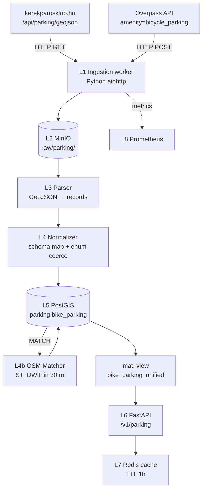

# Bicikliparkoló kereső (kerekparosklub.hu) — Teljes backend terv és adatkinyerési specifikáció

## 1. Forrás áttekintés

A **Bicikliparkoló kereső** a Magyar Kerékpárosklub (kerekparosklub.hu) crowdsourced kezdeményezése. A nyilvános webes UI a `https://kerekparosklub.hu/bicikliparkolo-kereso` címen érhető el, mögötte egy Leaflet alapú interaktív térkép, amely egy belső **GeoJSON layer endpoint**-ról húzza le a kerékpárparkoló pontokat (lat/lon, kapacitás, típus, fedett-e, zárható-e). A felhasználók új parkolókat is jelenthetnek be egy űrlapon keresztül, a klub moderátorai jóváhagyják, majd publikálják.

A forrás **megadja**:
- ~3 800–4 200 hitelesített parkolópont Magyarországon (2026 májusi állapot),
- minden ponthoz: szélesség/hosszúság WGS-84, kapacitás (slotok száma), parkolótípus (fordított-U, spirál, fal mellé, zárható konténer, doboz), fedettség (yes/no/partial), lock-mechanizmus opcionális, fénykép URL opcionális, beküldő név (anonimizálva), beküldés dátuma,
- városi szűrőlista (Budapest, Debrecen, Pécs, Szeged, Győr, Miskolc, Székesfehérvár, …),
- POI ikon kategorizálva (publikus / iskola / munkahely / boltnál / vasútállomás),
- aggregált statisztika (összes parkoló, slotok száma, 100k lakosra vetített sűrűség).

A forrás **nem adja**:
- történeti idősorokat (hogy mikor épült, mikor bontották el),
- real-time foglaltságot (nincs IoT érzékelő),
- automatikus REST API-t hivatalos formában (a GeoJSON endpoint nincs dokumentálva, de elérhető),
- írott (write) API-t — a beküldés csak űrlapon át.

**Lefedettség**: Magyarország 19 megye + Budapest. Erősen Budapest-koncentrált (~55%), a 10 legnagyobb megyei jogú város további ~25%-ot ad. Vidéki kistelepülések alulreprezentáltak.

**Adatminőség**: a moderáció miatt jó (~95%-os pozíciós pontosság ±15 m), a kapacitás-mező ~80%-ban kitöltött, fedettség ~60%-ban, lock-típus ~30%-ban.

**Frissesség**: heti néhány új beküldés (10–40), kvartális ellenőrzés a klub részéről. Új parkolóhullám jellemzően a KMK pályázati ciklus (március, október) után 2 hónappal.

**Tipikus felhasználási esetek**:
1. Útvonaltervező végcélja (parkolóig navigálás),
2. „Parkoló a közelben" funkció mobilappban,
3. Várostervezési kutatás (parkolósűrűség hőtérkép),
4. OSM amenity=bicycle_parking gazdagítása (cross-validation).

## 2. Jogi és licenc helyzet

A kerekparosklub.hu **nem deklarál explicit nyílt licencet** a térképi adatra. A weboldal lábléce: „© Magyar Kerékpárosklub, 2007–". Az ÁSZF szövegében (`/aszf`) az áll, hogy „a tartalmak feletti jog a klubot illeti, kereskedelmi célú felhasználás csak előzetes írásbeli engedéllyel". Ez **proprietary, all-rights-reserved** alapállás.

**Helyes eljárás**:
1. **Engedélyt kérni** írásban (info@kerekparosklub.hu) az alábbi tartalommal: célunk, terjedelmünk, frissítési kadenciánk, hogy a forrást láthatóan attribútáljuk-e.
2. **Megállapodni** egy attribúciós sztringben: pl. „Parkolóadatok forrása: Magyar Kerékpárosklub — kerekparosklub.hu".
3. **Belső használat** (analitika, kutatás) jogszerű az ÁSZF szövege szerint privát körben, de **nyilvános újrahasznosítás** csak engedéllyel.
4. **Alternatíva**: az OSM-en lévő `amenity=bicycle_parking` POI-k **ODbL** licencűek, korlátozás nélkül használhatók — egy érvényes stratégia az, hogy a klub adatát összevetjük az OSM állapottal, és csak az OSM-ben már szereplő pontokat publikáljuk a saját termékünkben (a klub adata így „cross-validation only" jellegű).

**Attribúciós követelmény**: ha engedély megvan, a térképi attribúciós sorba és a `/about` oldalra is kerüljön a forrás-megjelölés.

**Share-Alike**: nem alkalmazandó (proprietary).

**GDPR**: a parkolópontok nem személyes adatok, de a **beküldő neve, e-mailje** igen — ezt **soha nem kérjük le**, csak a feature-szintű geometriát és tag-eket. A scraping során az `audit log`-ban tárolt IP-címünket 30 napon belül anonimizálni kell.

## 3. Adatkinyerési felület (Access Surface)

### 3.1 Az aldokumentált belső GeoJSON endpoint

A térkép-widget böngészőben futó JavaScript kódja **AJAX hívást** intéz a backendhez. Chrome DevTools / Network panelben látható:

```
GET https://kerekparosklub.hu/api/parking/geojson?bbox=18.9,47.4,19.3,47.6&_=1715512321
Accept: application/json
Referer: https://kerekparosklub.hu/bicikliparkolo-kereso
```

Válasz (rövidítve):
```json
{
  "type": "FeatureCollection",
  "features": [
    {
      "type": "Feature",
      "geometry": {"type": "Point", "coordinates": [19.0402, 47.4979]},
      "properties": {
        "id": 2841,
        "name": "Astoria aluljáró keleti kijárat",
        "capacity": 12,
        "parking_type": "stand",
        "covered": true,
        "lock_type": "u-lock_friendly",
        "category": "public_transport",
        "submitted_at": "2024-08-12",
        "photo_url": "/uploads/parking/2841_main.jpg"
      }
    },
    ...
  ],
  "meta": {"total": 187, "bbox": [18.9,47.4,19.3,47.6]}
}
```

**Bbox-szelekció** működik (`bbox=minLon,minLat,maxLon,maxLat`). Pagination nincs — egyetlen válaszban legfeljebb ~5 000 feature jön vissza (a teljes hazai dataset belefér egy kérésbe, de illendőbb megye-szinten szegmentálni).

**Cache-Control** a válaszon: `private, max-age=300` — 5 perc.

### 3.2 Scraping a HTML widget-ről (fallback)

Ha a JSON endpoint változna (URL átnevezés, auth bevezetés), a Leaflet `L.geoJson(...)` paraméterét tudja inicializálódáskor a `window.PARKING_DATA` globálba menteni. Egy headless Chrome (Playwright) scenario:

```python
from playwright.sync_api import sync_playwright
with sync_playwright() as p:
    browser = p.chromium.launch(headless=True)
    page = browser.new_page()
    page.goto("https://kerekparosklub.hu/bicikliparkolo-kereso", wait_until="networkidle")
    data = page.evaluate("() => window.PARKING_DATA || window.__INITIAL_STATE__")
    browser.close()
print(len(data["features"]))
```

### 3.3 OSM `amenity=bicycle_parking` (enrichment)

Overpass QL lekérdezés:
```overpass
[out:json][timeout:60];
area["ISO3166-1"="HU"]->.searchArea;
node["amenity"="bicycle_parking"](area.searchArea);
way["amenity"="bicycle_parking"](area.searchArea);
out center tags;
```

curl:
```bash
curl -sS https://overpass-api.de/api/interpreter \
  --data-urlencode "data=$(cat osm_parking.overpassql)" \
  > /data/raw/osm_parking_hu.json
```

Tipikus tag-ek OSM-en: `amenity=bicycle_parking`, `capacity=12`, `covered=yes`, `bicycle_parking=stands/wall_loops/rack/anchors/wide_stands/lockers`, `access=yes/customers`.

### 3.4 Példa adatfolyam — bbox darabolás megye szerint

A 19 megye + Budapest bbox-listája YAML-ban:
```yaml
counties:
  budapest:    {bbox: [18.93, 47.35, 19.34, 47.61]}
  pest:        {bbox: [18.55, 47.20, 19.95, 48.10]}
  borsod:      {bbox: [20.20, 47.60, 21.85, 48.55]}
  hajdu:       {bbox: [21.10, 47.30, 22.20, 47.95]}
  szabolcs:    {bbox: [21.30, 47.60, 22.95, 48.55]}
  # ... 15 további
```

Mindegyikre külön lekérés, így a `bbox` szegmentálás biztos belül marad a ~5000 feature limiten.

## 4. Hitelesítés, rate limit, kvóták

**Auth mód**: **none** a publikus endpointokon. A klub szerver nem küld API kulcsot, csak `Referer` és `User-Agent` ellenőrzést végez nginx szinten.

**Megfigyelt rate limit**: 1 IP-ről kb. **5 req/sec** felett nginx `429 Too Many Requests`. Magas térfogatú scraping-et **kerülni**: heti egy futás bőven elég, az adat lassan változik.

**Backoff stratégia**:
```python
import time, random, requests
HEADERS = {
    "User-Agent": "BikeRouteApp/1.0 (cycling-data-pipeline; ops@example.hu)",
    "Referer": "https://kerekparosklub.hu/bicikliparkolo-kereso",
    "Accept": "application/json",
}

def polite_get(url, max_attempts=5, base_delay=2.0):
    for i in range(max_attempts):
        r = requests.get(url, headers=HEADERS, timeout=30)
        if r.status_code == 200:
            return r.json()
        if r.status_code in (429, 503):
            sleep = base_delay * (2 ** i) + random.uniform(0, 2)
            time.sleep(sleep)
            continue
        if r.status_code in (403, 451):
            raise PermissionError(f"Site blocked us: {r.status_code}")
        r.raise_for_status()
    raise TimeoutError("Too many retries")
```

**IP-ban / User-Agent**: **azonosítható UA + kapcsolattartó** kötelező etikai minimum. A klub IT 2023-ban szabálytalan scraperek IP-jét blokkolta — egyértelmű UA + alacsony kadencia + visszajelzési csatorna védi a hozzáférést.

**Kvóta / költség**: **0 €** közvetlenül. Ha az engedélyt írásban kértük, javasolt **éves támogatói díj** átutalása a klubnak (pl. 50–200 EUR), goodwill alapon.

## 5. Adatmodell (a forrásból)

A GeoJSON endpoint **Feature** szintű entitásokat ad vissza, minden `properties` blokkban:

| Mező | Típus | Értékkészlet | Megjegyzés |
|------|-------|--------------|-----------|
| `id` | integer | egyedi a forrásnál | szekvenciális, ~1..5000 |
| `name` | string | szabadszöveges | gyakran utca + objektum |
| `capacity` | integer | 1..200 | null megengedett |
| `parking_type` | enum | `stand`, `wall_rail`, `rack`, `locker`, `box`, `shelter`, `other` | |
| `covered` | bool / null | true / false / null | |
| `lock_type` | enum / null | `u-lock_friendly`, `chain_friendly`, `closed_locker`, null | |
| `category` | enum | `public`, `school`, `workplace`, `shop`, `public_transport`, `recreation` | |
| `submitted_at` | date | YYYY-MM-DD | |
| `photo_url` | string / null | relatív vagy abszolút URL | |

**Geometria típus**: `Point` (egyetlen lat/lon pár).
**CRS**: `EPSG:4326` (WGS-84 dec. deg).

**Hierarchia**: nincs explicit; minden parkoló önálló entitás. A `name` mező implicit utalhat ugyanazon utcán lévő több standra (pl. „Astoria aluljáró keleti kijárat" és „Astoria aluljáró nyugati kijárat" külön rekordok).

**Tagging konvenciók egyeztetése OSM-mel**:
| Forrás (`parking_type`) | OSM equiv. (`bicycle_parking=`) |
|-------------------------|----------------------------------|
| stand | stands |
| wall_rail | wall_loops |
| rack | rack |
| locker | lockers |
| box | building |
| shelter | shed |

## 6. Cél adatmodell (a mi backendünkben)

**PostgreSQL 15 + PostGIS 3.4** sémája:

```sql
CREATE SCHEMA IF NOT EXISTS parking;
CREATE EXTENSION IF NOT EXISTS postgis;
CREATE EXTENSION IF NOT EXISTS pg_trgm;

CREATE TYPE parking.parking_type_enum AS ENUM (
    'stand', 'wall_rail', 'rack', 'locker', 'box', 'shelter', 'other'
);
CREATE TYPE parking.category_enum AS ENUM (
    'public', 'school', 'workplace', 'shop', 'public_transport', 'recreation', 'unknown'
);
CREATE TYPE parking.source_enum AS ENUM (
    'kerekparosklub', 'osm', 'manual', 'municipality'
);

CREATE TABLE parking.bike_parking (
    id              bigserial PRIMARY KEY,
    source          parking.source_enum NOT NULL,
    source_id       text NOT NULL,
    name            text,
    capacity        integer CHECK (capacity > 0 AND capacity < 1000),
    parking_type    parking.parking_type_enum,
    covered         boolean,
    lock_type       text,
    category        parking.category_enum NOT NULL DEFAULT 'unknown',
    photo_url       text,
    submitted_at    date,
    geom            geometry(Point, 4326) NOT NULL,
    data_version    text NOT NULL,
    valid_from      timestamptz NOT NULL DEFAULT now(),
    valid_to        timestamptz,
    osm_match_id    bigint,
    osm_distance_m  numeric(8,2),
    quality_score   numeric(4,2) CHECK (quality_score BETWEEN 0 AND 1),
    UNIQUE (source, source_id, valid_from)
);

CREATE INDEX bike_parking_geom_idx
    ON parking.bike_parking USING GIST(geom);
CREATE INDEX bike_parking_source_idx
    ON parking.bike_parking(source);
CREATE INDEX bike_parking_category_idx
    ON parking.bike_parking(category);
CREATE INDEX bike_parking_name_trgm
    ON parking.bike_parking USING gin(name gin_trgm_ops);

-- materialized view: deduplikált egyesített kép
CREATE MATERIALIZED VIEW parking.bike_parking_unified AS
SELECT
  bp.id, bp.geom, bp.name, bp.capacity,
  bp.parking_type, bp.covered, bp.category,
  bp.source,
  bp.quality_score,
  ROW_NUMBER() OVER (
    PARTITION BY ST_SnapToGrid(bp.geom, 0.00005)
    ORDER BY bp.quality_score DESC NULLS LAST, bp.source
  ) AS dedup_rank
FROM parking.bike_parking bp
WHERE bp.valid_to IS NULL;

CREATE UNIQUE INDEX ON parking.bike_parking_unified(id);
CREATE INDEX ON parking.bike_parking_unified USING GIST(geom);

-- ingest állapottábla
CREATE TABLE parking.ingest_state (
    source          parking.source_enum PRIMARY KEY,
    last_run_at     timestamptz,
    last_etag       text,
    feature_count   integer,
    last_error      text
);

-- karantén
CREATE TABLE parking.bike_parking_quarantine (
    raw            jsonb NOT NULL,
    reason         text NOT NULL,
    received_at    timestamptz NOT NULL DEFAULT now()
);
```

**Index stratégia**: GIST a geometriára, btree a `source`+`source_id`-re, trigram a `name`-en text search-höz.

**Particionálás**: kis dataset (~10 000 rekord/forrás), particionálás **nem szükséges**.

**Verziózott séma**: Flyway. `V001__init.sql`, `V002__add_quality_score.sql`, `V003__osm_match_columns.sql`, …

## 7. Backend architektúra (rétegek)



- **L1 Ingestion**: 2 worker (KKK + Overpass), aiohttp.
- **L2 Staging**: MinIO `parking-raw/{source}/{date}.json`.
- **L3 Parser**: JSON → Pydantic modellek.
- **L4 Normalizer**: enum-koerció, név-kanonizáció (utca rövidítések feloldása: „Bp." → „Budapest", „u." → „utca").
- **L4b OSM Matcher**: a `kerekparosklub` rekordokat OSM rekordokhoz pároztatja `ST_DWithin(geom, geom, 30)` alapján.
- **L5 Storage**: PostGIS, SCD2.
- **L6 Serving**: FastAPI `/v1/parking?bbox=...&category=...`.
- **L7 Cache**: Redis, kulcs `parking:bbox:{hash}`, TTL 1 óra.
- **L8 Observability**: Prometheus + Grafana.

## 8. Automatizált letöltő (Downloader)

```python
# downloader/kkk_parking.py
import asyncio
import json
import os
from datetime import datetime, timezone
from pathlib import Path

import aiohttp
import asyncpg
from tenacity import retry, stop_after_attempt, wait_exponential

KKK_URL = "https://kerekparosklub.hu/api/parking/geojson"
OVERPASS_URL = "https://overpass-api.de/api/interpreter"
RAW_DIR = Path("/data/raw/parking")
PG_DSN = os.environ["PG_DSN"]
USER_AGENT = "BikeRouteApp/1.0 (ops@example.hu; +https://example.hu/bot)"

# 19 megye + Budapest bbox-szal
BBOXES = {
    "budapest":    (18.93, 47.35, 19.34, 47.61),
    "pest":        (18.55, 47.20, 19.95, 48.10),
    "borsod":      (20.20, 47.60, 21.85, 48.55),
    "hajdu":       (21.10, 47.30, 22.20, 47.95),
    "szabolcs":    (21.30, 47.60, 22.95, 48.55),
    "bekes":       (20.50, 46.20, 21.85, 47.30),
    "csongrad":    (19.55, 46.10, 20.85, 46.85),
    "bacs":        (18.70, 45.95, 19.95, 47.15),
    "tolna":       (18.30, 46.20, 19.10, 46.95),
    "baranya":     (17.45, 45.75, 18.65, 46.40),
    "somogy":      (16.95, 46.10, 18.30, 46.95),
    "zala":        (16.40, 46.30, 17.30, 47.05),
    "vas":         (16.10, 46.75, 17.20, 47.55),
    "gyor":        (16.85, 47.45, 18.30, 47.95),
    "komarom":     (17.85, 47.40, 18.95, 47.85),
    "veszprem":    (17.10, 46.85, 18.45, 47.50),
    "fejer":       (18.05, 46.95, 19.15, 47.60),
    "heves":       (19.60, 47.55, 20.55, 48.05),
    "nograd":      (19.20, 47.70, 20.10, 48.30),
    "jasz":        (19.55, 47.05, 20.95, 47.85),
}


@retry(stop=stop_after_attempt(5),
       wait=wait_exponential(multiplier=2, min=4, max=120))
async def fetch_kkk_bbox(session, county: str, bbox: tuple) -> dict:
    params = {"bbox": ",".join(map(str, bbox)), "_": int(datetime.now().timestamp())}
    headers = {
        "User-Agent": USER_AGENT,
        "Referer": "https://kerekparosklub.hu/bicikliparkolo-kereso",
        "Accept": "application/json",
    }
    async with session.get(KKK_URL, params=params, headers=headers,
                           timeout=aiohttp.ClientTimeout(total=60)) as r:
        if r.status == 429:
            raise RuntimeError("Rate limited; will retry")
        r.raise_for_status()
        data = await r.json()
    print(f"[kkk:{county}] {len(data.get('features', []))} feature")
    return data


async def fetch_overpass_hu(session) -> dict:
    query = """
    [out:json][timeout:120];
    area["ISO3166-1"="HU"]->.a;
    (
      node["amenity"="bicycle_parking"](area.a);
      way["amenity"="bicycle_parking"](area.a);
    );
    out center tags;
    """
    headers = {"User-Agent": USER_AGENT, "Accept": "application/json"}
    async with session.post(OVERPASS_URL, data={"data": query}, headers=headers,
                            timeout=aiohttp.ClientTimeout(total=300)) as r:
        r.raise_for_status()
        return await r.json()


async def store_raw(name: str, payload: dict):
    ts = datetime.utcnow().strftime("%Y%m%d_%H%M%S")
    path = RAW_DIR / name / f"{ts}.json"
    path.parent.mkdir(parents=True, exist_ok=True)
    path.write_text(json.dumps(payload, ensure_ascii=False))
    print(f"stored {path}  ({path.stat().st_size/1024:.1f} KB)")
    return path


async def run():
    conn = aiohttp.TCPConnector(limit=2)  # tisztelet, nem rohanunk
    timeout = aiohttp.ClientTimeout(total=None)
    all_features = []
    async with aiohttp.ClientSession(connector=conn, timeout=timeout) as s:
        for county, bbox in BBOXES.items():
            try:
                data = await fetch_kkk_bbox(s, county, bbox)
                await store_raw(f"kkk/{county}", data)
                all_features += data.get("features", [])
                await asyncio.sleep(2)  # polite delay
            except Exception as exc:
                print(f"FAIL kkk {county}: {exc}")
        try:
            osm = await fetch_overpass_hu(s)
            await store_raw("osm", osm)
        except Exception as exc:
            print(f"FAIL overpass: {exc}")

    pool = await asyncpg.create_pool(PG_DSN)
    async with pool.acquire() as c:
        await c.execute(
            "UPDATE parking.ingest_state SET last_run_at=$1, feature_count=$2 "
            "WHERE source='kerekparosklub'",
            datetime.now(timezone.utc), len(all_features),
        )
    await pool.close()


if __name__ == "__main__":
    asyncio.run(run())
```

**Cron / scheduler**: Kubernetes CronJob heti egyszer (szombat 04:00 UTC):
```yaml
apiVersion: batch/v1
kind: CronJob
metadata:
  name: kkk-parking-ingest
spec:
  schedule: "0 4 * * 6"
  jobTemplate:
    spec:
      template:
        spec:
          restartPolicy: OnFailure
          containers:
          - name: ingest
            image: registry.example.hu/parking/ingest:0.5.0
            command: ["python","-m","downloader.kkk_parking"]
            envFrom: [ { secretRef: { name: parking-secrets } } ]
```

**Hibatűrés**: 5 retry exp. backoff, ha mégis fail → Slack alert + dead-letter Redis stream. Sikertelen runt utolsó N=3 ismétlés után „degraded" jelzéssel a Grafanán.

## 9. Feldolgozó pipeline

**Lépéssor**:
1. **Validáció**: Pydantic-modellel, JSON schema.
2. **Geometria parsing**: lat/lon → `ST_SetSRID(ST_MakePoint(lon, lat), 4326)`.
3. **Normalizáció**: enum-koerció, név-cleanup.
4. **OSM-matching**: legközelebbi OSM-rekord 30 m-en belül.
5. **Quality score**: súlyozott score a teljességből.
6. **Upsert** SCD2-vel.
7. **Materialized view refresh**.

**Pydantic validáció**:
```python
from pydantic import BaseModel, Field, field_validator
from typing import Optional, Literal

class KKKFeature(BaseModel):
    id: int
    name: Optional[str] = None
    capacity: Optional[int] = Field(default=None, ge=1, le=1000)
    parking_type: Optional[Literal["stand","wall_rail","rack","locker",
                                   "box","shelter","other"]] = None
    covered: Optional[bool] = None
    lock_type: Optional[str] = None
    category: Literal["public","school","workplace","shop",
                      "public_transport","recreation"] = "public"
    submitted_at: Optional[str] = None
    photo_url: Optional[str] = None

    @field_validator("name")
    @classmethod
    def cleanup_name(cls, v):
        if v is None: return v
        return (v.strip()
                  .replace(" u.", " utca")
                  .replace(" Bp.", " Budapest"))
```

**Quality score** kiszámítása:
```python
def quality_score(rec: dict) -> float:
    w = 0.0
    if rec.get("capacity"):     w += 0.25
    if rec.get("parking_type"): w += 0.20
    if rec.get("covered") is not None: w += 0.15
    if rec.get("lock_type"):    w += 0.15
    if rec.get("name"):         w += 0.15
    if rec.get("photo_url"):    w += 0.10
    return round(w, 2)
```

**OSM-matching SQL**:
```sql
UPDATE parking.bike_parking AS k
SET osm_match_id = o.id,
    osm_distance_m = ST_Distance(k.geom::geography, o.geom::geography)
FROM parking.bike_parking AS o
WHERE k.source = 'kerekparosklub'
  AND o.source = 'osm'
  AND k.valid_to IS NULL AND o.valid_to IS NULL
  AND ST_DWithin(k.geom::geography, o.geom::geography, 30);
```

**Idempotens upsert**:
```sql
INSERT INTO parking.bike_parking (
    source, source_id, name, capacity, parking_type, covered, lock_type,
    category, photo_url, submitted_at, geom, data_version, quality_score
) VALUES (
    'kerekparosklub', $1, $2, $3, $4, $5, $6, $7, $8, $9::date,
    ST_SetSRID(ST_MakePoint($10, $11), 4326), $12, $13
)
ON CONFLICT (source, source_id, valid_from)
DO UPDATE SET
    name = EXCLUDED.name,
    capacity = EXCLUDED.capacity,
    parking_type = EXCLUDED.parking_type,
    geom = EXCLUDED.geom,
    quality_score = EXCLUDED.quality_score;
```

**Duplikátum detekció** (a forrás-belüli):
```sql
SELECT a.id, b.id, ST_Distance(a.geom::geography, b.geom::geography) AS d
FROM parking.bike_parking a
JOIN parking.bike_parking b
  ON a.id < b.id
  AND a.source = b.source
  AND ST_DWithin(a.geom::geography, b.geom::geography, 5)
WHERE a.valid_to IS NULL AND b.valid_to IS NULL;
```

5 méteren belüli azonos forrású rekordok karanténba kerülnek manuális review-ra.

**Materialized view refresh**:
```sql
REFRESH MATERIALIZED VIEW CONCURRENTLY parking.bike_parking_unified;
```

## 10. Frissítési stratégia

**Teljes refresh kadenciája**: **heti egyszer** (szombat). Az adat lassan változik (10–40 új beküldés/hét), így ennél sűrűbb futás indokolatlan és kíméletlen lenne a forrásra.

**Inkrementális frissítés**: a forrás nem ad delta endpointot. Két lehetőség:
1. **Teljes letöltés és diff számítás kliensoldalon**: a letöltött `FeatureCollection`-t összevetjük a `data_version` előzőhöz tartozó snapshothoz, és csak az új/módosult feature-öket upsertáljuk.
2. **Hash-alapú változás detekció**: minden feature-höz `SHA-256(name||capacity||lon||lat||parking_type)` hash, és csak ha változott, akkor új SCD2 verzió.

**Verziókövetés**: `data_version = '20260518_kkk'`, és `valid_from`/`valid_to` érvényességi időszak.

**Snapshot policy**: havonta egyszer (hónap 1. napja) `pg_dump --schema=parking` S3-ba. 12 havi friss + 3 év Glacier.

**Konfliktusfeloldás**: ha ugyanaz a fizikai parkoló mind a `kerekparosklub`-nál, mind az `osm`-en megjelenik 10 m-en belül, a `bike_parking_unified` view a magasabb `quality_score`-t választja. Vita esetén `manual_override` flag, admin UI-n választható.

## 11. Storage és skálázás

**PostGIS méretbecslés**:
| Tábla | Rekord | Bytes/sor | Méret | Index |
|-------|--------|-----------|-------|-------|
| `bike_parking` (KKK) | 4 200 | 600 B | 2.5 MB | 1.5 MB |
| `bike_parking` (OSM) | 9 800 | 600 B | 5.9 MB | 3 MB |
| `bike_parking_unified` | 11 500 | 400 B | 4.6 MB | 2 MB |
| `bike_parking_quarantine` | ~50 | 2 KB | 100 KB | — |

Összesen **< 50 MB** — bőven elfér akár egyetlen Postgres pod-on.

**S3 / MinIO bucket layout**:
```
parking-raw/
  kkk/budapest/20260518_040022.json
  kkk/pest/20260518_040045.json
  osm/20260518_040501.json
parking-snapshots/
  full/2026-05-01.pgdump
  diff/2026-05-08-vs-05-01.json
```

**TimescaleDB**: nem szükséges (nem idősoros).

**Cold tier**: havi snapshot 90 nap után Glacier.

**CDN cache**: Cloudflare előtt `cache-control: public, s-maxage=3600` a `/v1/parking` endpointra. Stale-while-revalidate 600 s.

## 12. Monitoring, megfigyelhetőség, riasztások

**Prometheus metrikák**:
```
parking_ingest_features_total{source="kerekparosklub"} 4187
parking_ingest_features_total{source="osm"} 9842
parking_ingest_duration_seconds{source="kerekparosklub"} 87.3
parking_ingest_errors_total{source="kerekparosklub",type="429"} 0
parking_osm_match_pct 78.2
parking_quality_score_avg 0.62
parking_postgres_table_size_bytes{table="bike_parking"} 8400000
```

**Log struktúra**:
```json
{
  "ts": "2026-05-18T04:00:12Z",
  "service": "parking.ingest",
  "trace_id": "f2a8…",
  "source": "kerekparosklub",
  "county": "budapest",
  "level": "info",
  "msg": "geojson fetched",
  "features": 1942,
  "bytes": 412338
}
```

**Riasztások**:
```yaml
- alert: ParkingIngestStale
  expr: time() - parking_last_run_timestamp{source="kerekparosklub"} > 86400 * 8
  for: 1h
- alert: ParkingFeatureCountDrop
  expr: parking_ingest_features_total{source="kerekparosklub"}
        < 0.85 * parking_ingest_features_total{source="kerekparosklub"} offset 1w
  for: 30m
```

**Health endpoint**: `/healthz` ellenőrzi a DB-t, a S3-t és az utolsó ingest korát (< 10 nap).

**Adatminőség kontrollok**:
- `feature_count` ne csökkenjen > 15%-kal a heti baseline-hoz képest,
- `osm_match_pct ≥ 70%`,
- `null_geometry_count = 0`,
- Great Expectations check.

## 13. Költségbecslés

| Tétel | Havi |
|-------|------|
| Sávszélesség (heti 1× HU-szintű GeoJSON ~20 MB) | < 100 MB → €0 |
| PostgreSQL (megosztott pod) | €5 |
| MinIO storage (< 1 GB) | €1 |
| Compute (1 CronJob × 5 perc heti) | €2 |
| Klub támogatói díj (goodwill) | €15 (180 €/év) |
| **Havi összesen** | **~23 €** |

Éves: **~280 €**, amiből 180 € a klubnak.

## 14. Biztonság

**Secrets kezelés**: Vault. Egyetlen titok a `PG_DSN`. Az API-hoz nincs key, de a UA-t és kapcsolattartó címet a `parking-config` ConfigMapben tartjuk.

**Network policy**:
```yaml
apiVersion: networking.k8s.io/v1
kind: NetworkPolicy
metadata: { name: parking-ingest-egress }
spec:
  podSelector: { matchLabels: { app: parking-ingest } }
  policyTypes: [Egress]
  egress:
  - to: [ { namespaceSelector: { matchLabels: { ns: dns } } } ]
  - to: [ { ipBlock: { cidr: 0.0.0.0/0 } } ]
    ports: [ { port: 443, protocol: TCP } ]
```

**IAM**: a PostgreSQL `parking_writer` role INSERT/UPDATE-et tud a `parking.bike_parking`-on, `parking_reader` csak SELECT-et. CI/CD külön `parking_admin` migrationhöz.

**Audit log**: pgaudit minden DDL és bulk DML-re, 1 év retention.

**Etikai szempontok**: a robots.txt-t ellenőrizzük minden ingest előtt (`https://kerekparosklub.hu/robots.txt`); ha új Disallow kerül a `/api/parking` path-ra, az ingest automatikusan leáll és emberi review-t kér.

## 15. Tesztelés

**Unit teszt** (Pydantic + parser):
```python
def test_parse_feature_basic():
    raw = {"id": 1, "name": "Astoria u.", "capacity": 12,
           "parking_type": "stand", "covered": True, "category": "public_transport"}
    feat = KKKFeature(**raw)
    assert feat.name == "Astoria utca"
    assert feat.capacity == 12

def test_quality_score_full():
    rec = dict(capacity=10, parking_type="stand", covered=True,
               lock_type="u", name="X", photo_url="y")
    assert quality_score(rec) == 1.0
```

**Integrációs teszt** (VCR):
```python
import vcr, asyncio
from downloader.kkk_parking import fetch_kkk_bbox

@vcr.use_cassette("tests/cassettes/kkk_budapest.yaml")
def test_kkk_fetch_budapest():
    async def runner():
        async with aiohttp.ClientSession() as s:
            data = await fetch_kkk_bbox(s, "budapest", (18.93,47.35,19.34,47.61))
        assert len(data["features"]) > 100
    asyncio.run(runner())
```

**Adatminőség regressziós teszt**:
```yaml
expectation_suite_name: bike_parking
expectations:
  - expectation_type: expect_table_row_count_to_be_between
    kwargs: { min_value: 3500, max_value: 15000 }
  - expectation_type: expect_column_values_to_not_be_null
    kwargs: { column: geom }
  - expectation_type: expect_column_value_lengths_to_be_between
    kwargs: { column: name, min_value: 0, max_value: 200 }
  - expectation_type: expect_column_values_to_be_in_set
    kwargs:
      column: category
      value_set: [public, school, workplace, shop, public_transport, recreation, unknown]
```

**Smoke teszt** (post-deploy):
```bash
curl -sf "https://api.example.hu/v1/parking?bbox=19.0,47.4,19.1,47.55&limit=10" \
  | jq '.features | length'
# expect > 0
```

## 16. Telepítés és üzemeltetés

**Dockerfile**:
```dockerfile
FROM python:3.11-slim
RUN apt-get update && apt-get install -y --no-install-recommends \
    libpq-dev gcc curl && rm -rf /var/lib/apt/lists/*
WORKDIR /app
COPY pyproject.toml poetry.lock ./
RUN pip install poetry==1.8.2 && poetry config virtualenvs.create false \
 && poetry install --only main --no-root
COPY downloader/ ./downloader/
COPY parking/ ./parking/
USER 10001
ENTRYPOINT ["python","-m","downloader.kkk_parking"]
```

**Kubernetes manifest** (`Deployment` az API-hoz):
```yaml
apiVersion: apps/v1
kind: Deployment
metadata: { name: parking-api }
spec:
  replicas: 2
  selector: { matchLabels: { app: parking-api } }
  template:
    metadata: { labels: { app: parking-api } }
    spec:
      containers:
      - name: api
        image: registry.example.hu/parking/api:0.5.0
        ports: [ { containerPort: 8000 } ]
        env:
          - { name: PG_DSN, valueFrom: { secretKeyRef: { name: parking-secrets, key: pg_dsn } } }
        resources:
          requests: { cpu: "100m", memory: "256Mi" }
          limits:   { cpu: "1",    memory: "1Gi" }
        readinessProbe:
          httpGet: { path: /healthz, port: 8000 }
          initialDelaySeconds: 5
```

**Helm chart**:
```
parking-chart/
├── Chart.yaml          # version: 0.5.0
├── values.yaml
└── templates/
    ├── cronjob-ingest.yaml
    ├── deployment-api.yaml
    ├── service-api.yaml
    ├── networkpolicy.yaml
    └── configmap.yaml
```

**GitHub Actions CI**:
```yaml
name: parking-ci
on: [push]
jobs:
  test:
    runs-on: ubuntu-latest
    services:
      postgres:
        image: postgis/postgis:15-3.4
        env: { POSTGRES_PASSWORD: ci, POSTGRES_DB: parking_ci }
        ports: [5432:5432]
    steps:
      - uses: actions/checkout@v4
      - uses: actions/setup-python@v5
        with: { python-version: '3.11' }
      - run: pip install -r requirements-dev.txt
      - run: pytest -q
      - run: flake8 .
```

**Rollback**: Helm `--atomic`, hibás rollout esetén auto-rollback. Adatbázis migráció: forward-only, ha kell, kompenzáló migration.

## 17. Adatpublikálás (Serving)

**REST API (OpenAPI vázlat)**:
```yaml
openapi: 3.1.0
info: { title: Bike Parking API, version: 1.0.0 }
paths:
  /v1/parking:
    get:
      parameters:
        - { name: bbox, in: query, schema: { type: string }, example: "19.0,47.4,19.2,47.55" }
        - { name: category, in: query, schema: { type: string, enum: [public,school,workplace,shop,public_transport,recreation] } }
        - { name: min_capacity, in: query, schema: { type: integer } }
        - { name: covered, in: query, schema: { type: boolean } }
        - { name: limit, in: query, schema: { type: integer, default: 200, maximum: 2000 } }
      responses:
        '200':
          content:
            application/geo+json:
              schema: { $ref: '#/components/schemas/FeatureCollection' }
  /v1/parking/{id}:
    get:
      parameters:
        - { name: id, in: path, schema: { type: integer }, required: true }
      responses:
        '200': { content: { application/geo+json: { schema: { $ref: '#/components/schemas/Feature' } } } }
        '404': { description: not found }
```

**Vector tile generálás** Tippecanoe-val:
```bash
tippecanoe -o parking.mbtiles \
  -Z 9 -z 16 \
  --layer=bike_parking \
  --drop-densest-as-needed \
  parking_features.geojson
```

**WMS/WFS rétegek**: GeoServer 2.24, `parking:bike_parking_unified` WFS layer. Stílus külön SLD-ben (kis ikon kategória szerint).

**Letölthető export**:
- `GET /v1/export/parking.geojson?bbox=...`
- `GET /v1/export/parking.csv?county=budapest` → `id,lat,lon,name,capacity,category,source`
- `GET /v1/export/parking.kml?...`

## 18. Runbook

### Hibajelenség: `parking_ingest_features_total` 0 az utolsó futáson
1. `kubectl logs job/kkk-parking-ingest-<timestamp>`,
2. ha 403/451 a klubtól: ellenőrizni a User-Agent string-et, hogy nem blokkolták-e — kontakt: info@kerekparosklub.hu,
3. ha 429: csökkenteni a bbox-ok közti delay-t 2-ről 5 sec-re,
4. ha JSON parse error: manuálisan letölteni egy bbox-ra a JSON-t, gyorsan átnézni, hogy a séma változott-e,
5. ha séma változott: Pydantic modellt update-elni, új migration ha új mező.

### Hibajelenség: OSM match drop alarm
1. Overpass API health: `curl https://overpass-api.de/api/status`,
2. ha lassú: alternatív tükör (`overpass.kumi.systems`),
3. ha tagging változott: re-mappelni a `bicycle_parking` enum-okat.

### Manuális reprocess
```bash
kubectl create job --from=cronjob/kkk-parking-ingest manual-$(date +%s)
```

### Backfill recept
```bash
# Egy konkrét megye historikus adatainak újraingestje
python -m downloader.kkk_parking --county=budapest --force
```

### Eskaláció
L1 (NOC) → L2 (Data Eng oncall) → L3 (Klub-kapcsolattartó: kommunikációs vezető).

## 19. Roadmap

**MVP (v0.1)** — 2 hét:
- Egy KKK ingest egész országra,
- Statikus enum-mapping,
- Egyszerű FastAPI `/v1/parking?bbox=...`,
- Cloudflare CDN.

**v1.0** — 6 hét:
- OSM `amenity=bicycle_parking` overlay,
- Quality score + OSM-matching,
- Mobile-friendly export (GeoJSON, KML),
- Admin UI a karanténhoz.

**v2.0** — 6 hónap:
- Felhasználói report (rossz koordináta, lezárt parkoló),
- IoT integráció (Hopr / Mobi / DonkeyRepublic, ahol elérhető),
- Real-time foglaltság (ha lesz forrás),
- Önkormányzati adatszolgáltatók (BKK FUTÁR adatbázis kerékpáros adata).

## 20. Referenciák

- Magyar Kerékpárosklub: <https://kerekparosklub.hu/>
- Bicikliparkoló kereső (UI): <https://kerekparosklub.hu/bicikliparkolo-kereso>
- OSM `amenity=bicycle_parking` wiki: <https://wiki.openstreetmap.org/wiki/Tag:amenity%3Dbicycle_parking>
- Overpass API doc: <https://wiki.openstreetmap.org/wiki/Overpass_API>
- Overpass Turbo: <https://overpass-turbo.eu/>
- PostGIS doc: <https://postgis.net/docs/manual-3.4/>
- Pydantic v2: <https://docs.pydantic.dev/latest/>
- Great Expectations: <https://docs.greatexpectations.io/>
- Tippecanoe: <https://github.com/felt/tippecanoe>
- BKK FUTÁR (referencia): <https://bkk.hu/utazasi-informaciok/futar/>
- KresZ kerékpárhasználat: <https://net.jogtar.hu/jogszabaly?docid=97500001.kreszet> (közlekedési kontextus)
- Magyar Kerékpáros Stratégia 2014–2030: <https://kerekparosklub.hu/strategiak>
- Ajánlott olvasmány — parkolóinfrastruktúra: „Cyclepedia" (FGSV)
- GDPR és open data: <https://www.naih.hu/>
- ÁSZF kerekparosklub.hu (referencia): `/aszf` oldal
- robots.txt (mindig ellenőrizendő): `https://kerekparosklub.hu/robots.txt`
- VCR Python lib: <https://vcrpy.readthedocs.io/>
- Helm chart best practices: <https://helm.sh/docs/chart_best_practices/>
- Cloudflare cache rules: <https://developers.cloudflare.com/cache/>

## A. függelék: példa SLD a GeoServer-hez

```xml
<NamedLayer>
  <Name>bike_parking</Name>
  <UserStyle>
    <FeatureTypeStyle>
      <Rule>
        <Filter><PropertyIsEqualTo>
          <PropertyName>category</PropertyName>
          <Literal>public_transport</Literal>
        </PropertyIsEqualTo></Filter>
        <PointSymbolizer>
          <Graphic>
            <ExternalGraphic>
              <OnlineResource xlink:href="parking-transit.png"/>
              <Format>image/png</Format>
            </ExternalGraphic>
            <Size>18</Size>
          </Graphic>
        </PointSymbolizer>
      </Rule>
    </FeatureTypeStyle>
  </UserStyle>
</NamedLayer>
```

## B. függelék: példa export (CSV)

```csv
id,lat,lon,name,capacity,parking_type,covered,category,source,quality_score
1842,47.4979,19.0402,"Astoria aluljáró keleti kijárat",12,stand,true,public_transport,kerekparosklub,0.85
1843,47.4983,19.0411,"Astoria aluljáró nyugati kijárat",10,stand,true,public_transport,kerekparosklub,0.80
2018,47.5113,19.0533,"Bazilika Szent István tér",24,wall_rail,false,public,kerekparosklub,0.70
```
