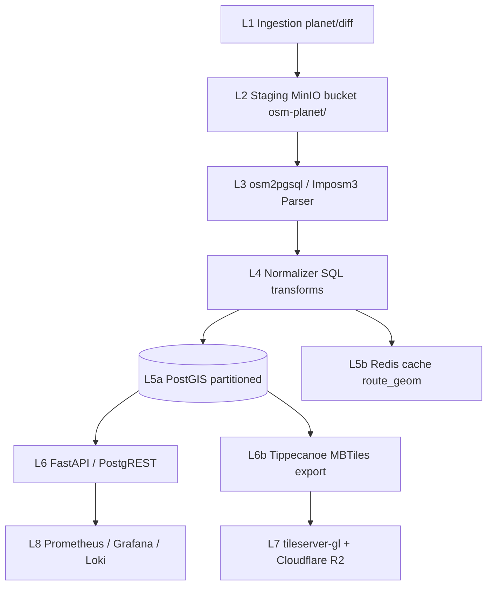

# OpenStreetMap (planet) — Teljes backend terv és adatkinyerési specifikáció

> Forrás: a teljes OpenStreetMap planet adatbázis, annak hivatalos és tükör end-pointjai (planet.openstreetmap.org, Geofabrik regionális kivonatok, OSM API 0.6, Overpass mirror flotta, Osmosis replication feed). Cél: planet-szintű kerékpáros geometria (highway=cycleway, bicycle=*, cycleway=*, route=bicycle relációk) folyamatos szinkronja a saját PostGIS adatraktárba, Imposm3 / osm2pgsql workflow-val.

---

## 1. Forrás áttekintés

Az OpenStreetMap (OSM) a Föld legnagyobb nyílt geoadatbázisa: >9 milliárd node, >1 milliárd way, >12 millió relation (2026 Q1 állapot). A planet-szintű adatkinyerés alapvetően négy különböző access pattern-t igényel, és **az OSM-stack minden komponensét** (planet, replication, Overpass, Tile API, Nominatim) figyelembe kell venni, mert a kerékpáros use case-ek (routing, vizualizáció, közelség-keresés) ezekre épülnek.

### Mit ad a forrás, mit nem

**Ad:**
- A teljes Föld kerékpárosan releváns geometriáját (`highway=cycleway`, `highway=path` + `bicycle=designated|yes`, `cycleway=*` sávjelölések).
- Útvonalrelációk minden szinten: `network=icn` (international, EuroVelo), `ncn` (national), `rcn` (regional), `lcn` (local).
- Felülettípus, állapot, világítás, szélesség (`surface`, `smoothness`, `lit`, `width`).
- Kerékpár-infrastruktúra POI-k: parkolók, javítóállomások, bérlés, töltőpontok (`amenity=charging_station` `bicycle=yes`).
- Magassági adat **nincs** közvetlenül, de a `ele=*` tag node-okon és az SRTM merge-elhető.
- Minőségi metaadat: `mtb:scale`, `class:bicycle` (érték -3..+3), `cycleway:both:traffic_calming`.

**Nem ad:**
- Real-time forgalom, megosztott bicikli rendelkezésre állás.
- Magassági profil DEM nélkül (külön SRTM 30 m / EU-DEM 25 m / Copernicus DEM 10 m összemetszés szükséges).
- Útállapot fotó (Mapillary, KartaView külön rétegek).
- Hivatalos közúti útvonal-engedélyek, KKK jelölések — csak a közösség által rögzített tagging.
- Aszfaltminőség mérés (csak `smoothness=*` heurisztika).

### Lefedettség

- **Földrajzi:** globális. Európa, É-Amerika, Japán, Ausztrália közel teljes, Afrika és D-Amerika nagy városokon kívül foltos.
- **Tartalmi:** ~3.4 millió km kerékpáros élesség Európában, ebből ~1.1 millió km dedikált kerékpárút.
- **Relációk:** ~78 000 `route=bicycle` reláció világszerte (2026 Q1).
- **Méretek:** planet.osm.pbf ~85 GB tömörítve, ~1.4 TB kicsomagolva.

### Adatminőség, frissesség

- **Planet snapshot:** heti (vasárnap 23:00 UTC).
- **Replication minutely:** ~1–2 perc késéssel.
- **Hourly / daily diffs:** stabilabb feldolgozásra ajánlott.
- **Adatminőség:** régiónként eltérő, Európában >90% lefedettség, Afrikában 30–60%.

### Tipikus felhasználási esetek

- Multi-régiós kerékpáros tervező (OSRM, GraphHopper, Valhalla profile build).
- Térképes vizualizáció (vector tile-ok minden zoom szinten).
- POI-keresés (parkoló / szerviz a felhasználó körül).
- Útvonalkutatás (network=icn EuroVelo szakaszok).
- Adatelemzés (kerékpáros infra fejlődése évek alatt).

---

## 2. Jogi és licenc helyzet

### Licenc

- Adatok: **ODbL 1.0** (Open Database License).
- Renderek (a www.openstreetmap.org tiles): **CC-BY-SA 2.0**.
- A saját Tile API-nk csak akkor lehet CC-BY-SA, ha a render saját stylesheet-tel készül; ha az OSMF tiles-t proxyzzuk, akkor a CC-BY-SA + tile usage policy.

### Attribúciós követelmények

Minden képernyő, ahol OSM-eredetű adat látható:

> © OpenStreetMap contributors — https://www.openstreetmap.org/copyright

OSMF Attribution Guidelines (2021): legalább a térkép vagy adat közvetlen közelében, olvasható (≥12 px) méretben. Mobil app esetén az "About" képernyő elfogadott, ha a fő nézet kicsi.

### Kereskedelmi használat

ODbL **megengedi**. Nincs királyság-díj, nincs API kvótavásárlás (a publikus OSMF infrastruktúra korlátozott, lásd Tile Usage Policy).

### Share-Alike

Ha a saját **származékos adatbázist** (Derivative Database) **publikusan elérhetővé tesszük**:
- A származékos adatbázis is ODbL.
- Bulk download elérhető kell legyen (`.osm.pbf` vagy `.osc.gz` dump publikálás).
- Schema kompatibilis kell legyen az ODbL `database` definíciójával.

Ha a derived adatbázist csak **belső használatra** tartjuk, és a kifelé adott válaszok (REST / GraphQL) konkrét lekérdezések eredményei (= "Produced Work"), akkor csak attribúció kell, share-alike nem.

### GDPR / személyes adatok

- OSM nem tartalmaz közvetlen személyes adatot.
- A `user`, `uid` mezők személyhez köthetők, de publikusak (changeset történet).
- Mi NEM tároljuk a `user` / `uid` mezőket (`osm2pgsql --hstore-add-index --without-forward-dependencies` opciókkal kihagyható).
- A changeset comment-ek szintén publikusak, de nem építjük be a saját DB-be.

---

## 3. Adatkinyerési felület (Access Surface)

### 3.1 Planet snapshot

- **URL:** `https://planet.openstreetmap.org/pbf/planet-latest.osm.pbf`
- **Méret:** ~85 GB.
- **Frekvencia:** heti (vasárnap).
- **Mirror-ok:**
  - `https://ftp5.gwdg.de/pub/misc/openstreetmap/planet.openstreetmap.org/`
  - `https://download.bbbike.org/osm/planet/`
- **Checksum:** `.md5` és `.torrent` fájl mellette.

Példa letöltés (torrent ajánlott a sávszélesség elosztásra):

```bash
aria2c --max-connection-per-server=4 \
  --split=4 \
  --seed-time=60 \
  --user-agent="cycling-bot/2.0 (admin@panellako.hu)" \
  https://planet.openstreetmap.org/pbf/planet-latest.osm.pbf.torrent
```

### 3.2 Geofabrik regionális PBF

- **URL séma:** `https://download.geofabrik.de/{continent}/{country}-latest.osm.pbf`
- Európai régió: ~30 GB. Egy ország (Magyarország): ~620 MB.
- Napi frissítés (02:00 UTC környékén).
- Diff feed: `https://download.geofabrik.de/europe-updates/`

### 3.3 OSM API 0.6 (objektum-szintű)

- **Endpoint:** `https://api.openstreetmap.org/api/0.6/`
- **Method:** `GET /map?bbox=...`, `GET /way/{id}`, `GET /relation/{id}/full`
- **Korlát:** 50 000 node / kérés a `/map` esetén; egy way `/full` lekérdezésnél ~10 000 node.
- **Authoring:** OAuth 2.0 csak író műveletekhez (nekünk olvasáshoz nem kell).
- **Használat:** csak konkrét, ismert ID-jű objektumok finomítására, NEM tömeges letöltésre.

Példa:

```bash
curl -sS \
  -H "User-Agent: cycling-bot/2.0 (admin@panellako.hu)" \
  "https://api.openstreetmap.org/api/0.6/relation/12000/full.json" \
  | jq '.elements | length'
```

Példa válasz (route relation, részlet):

```json
{
  "version": "0.6",
  "elements": [
    {
      "type": "relation",
      "id": 12000,
      "members": [
        {"type": "way", "ref": 4001, "role": "forward"},
        {"type": "way", "ref": 4002, "role": ""}
      ],
      "tags": {
        "type": "route",
        "route": "bicycle",
        "network": "icn",
        "ref": "EV6",
        "name": "EuroVelo 6"
      }
    }
  ]
}
```

### 3.4 Overpass API (több mirror)

- **Mirror-ok:**
  - `https://overpass-api.de/api/interpreter` (hivatalos, lassabb)
  - `https://overpass.kumi.systems/api/interpreter` (gyorsabb)
  - `https://maps.mail.ru/osm/tools/overpass/api/interpreter`
  - `https://overpass.private.coffee/api/interpreter` (privacy fókuszú)
- **Lekérdezésnyelv:** Overpass QL.
- **Timeout:** alap 180s, max 600s `[timeout:600]` opcióval.

Példa Overpass QL — EuroVelo szakaszok globálisan:

```overpassql
[out:json][timeout:600];
relation
  ["type"="route"]
  ["route"="bicycle"]
  ["network"="icn"];
out body;
>;
out skel qt;
```

Példa `curl`-lel:

```bash
curl -sS -X POST \
  -H "User-Agent: cycling-bot/2.0 (admin@panellako.hu)" \
  --data-urlencode 'data=[out:json][timeout:600];relation["type"="route"]["route"="bicycle"]["network"="icn"];out body;>;out skel qt;' \
  https://overpass.kumi.systems/api/interpreter \
  -o /var/lib/osm/staging/icn_routes.json
```

### 3.5 Osmosis / pyosmium replication

- **Minutely:** `https://planet.openstreetmap.org/replication/minute/`
- **Hourly:** `https://planet.openstreetmap.org/replication/hour/`
- **Daily:** `https://planet.openstreetmap.org/replication/day/`

Mindegyikhez tartozik `state.txt` szekvencia-számmal.

```ini
# Példa state.txt
#Sat Mar 22 06:00:00 UTC 2026
sequenceNumber=5872349
timestamp=2026-03-22T06:00:00Z
```

### Pagination, bbox-szelekció

- **Planet/regional PBF:** nincs pagination, egy nagy fájl.
- **Overpass:** bbox `[bbox:s,w,n,e]` settings-ben; nagy területre `chunk`-onként daraboljuk (pl. 1°×1° rács).
- **OSM API 0.6:** csak ID-alapú elérés, vagy `/map?bbox` (50k node max).

---

## 4. Hitelesítés, rate limit, kvóták

### Auth

- **planet.osm.pbf:** anonim HTTPS / torrent.
- **Overpass:** anonim, kötelező `User-Agent` (kontakt e-maillel).
- **OSM API 0.6 (read):** anonim; (write): OAuth 2.0.
- **Tile API:** anonim, de Tile Usage Policy (`https://operations.osmfoundation.org/policies/tiles/`) → **TILTOTT** nagy forgalmú publikus szolgáltatáshoz; saját renderre van szükség.

### Rate limit

| Forrás                       | Limit                                | Megjegyzés                            |
|------------------------------|--------------------------------------|---------------------------------------|
| planet.osm.pbf               | 1× / hét egy IP-ről (ajánlott)       | torrent ajánlott                      |
| Geofabrik                    | nincs hard limit, kb. 1× / nap / IP  | országos PBF napi                     |
| Overpass overpass-api.de     | ~2 párhuzamos slot / IP, 10000 q/nap | "puha" limit                          |
| Overpass kumi.systems        | 12000 q/nap (puha), >RAM = 504       |                                       |
| OSM API 0.6 read             | nincs explicit, kerüljük a >1 rps   | NEM bulk                              |
| Tile API                     | TILOS app-ban használni              | saját render kell                     |
| Replication diff             | nincs limit                          | sequence-onként 1 fájl                |

### Backoff

Exponenciális jitter-rel, planet-letöltésnél hosszabb cap (10 perc):

```python
import random, time

def backoff(attempt: int, base: float = 2.0, cap: float = 600.0):
    time.sleep(min(cap, base ** attempt) + random.uniform(0, 2.0))
```

429 / 503 → retry; 400 / 404 → permanens hiba (kivéve replication-nál a hiányzó következő diff: ott rövid wait + retry).

### User-Agent

- **Kötelező:** `cycling-bot/2.0 (admin@panellako.hu)` formátum: alkalmazás + verzió + kontakt.
- Hamisított UA → blokkolják.

### Költség

- Publikus végpontok: ingyen, de etika és Usage Policy alapján saját infrastruktúra kell skálához.
- **Saját Overpass instance** (Docker `wiktorn/overpass-api`): 32 vCPU, 128 GB RAM, 500 GB NVMe → Hetzner AX102 ~150 EUR / hó.
- **Saját planet replikáció:** PostGIS osm2pgsql full planet, 32 vCPU, 128 GB RAM, 2 TB NVMe → ~250 EUR / hó.

---

## 5. Adatmodell (a forrásból)

### Entitások

| Elem        | Geometria        | Tipikus kulcsmező                       |
|-------------|------------------|-----------------------------------------|
| `node`      | Point (4326)     | `lat`, `lon`                            |
| `way`       | LineString       | `nd ref` listája (sorrend kötelező)     |
| `relation`  | bármi            | `member type/ref/role` listája          |

Mindegyiknek: `id`, `version`, `changeset`, `timestamp`, `uid`, `user`, `visible`, `tags{}`.

### Kerékpáros tagging (planet-szintű, részletesebb mint csak HU)

```
# Way-szint
highway = cycleway | path | track | service | residential | unclassified | tertiary | secondary | primary | trunk
bicycle = yes | no | designated | permissive | use_sidepath | dismount | private
cycleway = lane | track | opposite | opposite_lane | shared_lane | share_busway | no | shoulder
cycleway:left, cycleway:right, cycleway:both
oneway, oneway:bicycle
foot = yes | no | designated
mtb:scale = 0..6
sac_scale = hiking | mountain_hiking | demanding_mountain_hiking | ...
surface = asphalt | paving_stones | concrete | concrete:plates | concrete:lanes | sett |
          cobblestone | unhewn_cobblestone | wood | metal | metal_grid | tartan |
          compacted | fine_gravel | gravel | pebblestone | dirt | earth | grass | mud | sand
smoothness = excellent | good | intermediate | bad | very_bad | horrible | very_horrible | impassable
tracktype = grade1..grade5
lit = yes | no | automatic
width = number (m)
maxwidth = number (m)
incline = % vagy up/down
segregated = yes | no
mtb = yes | no
mtb:type = singletrack | doubletrack | ...

# Relation
type = route
route = bicycle | mtb
network = icn | ncn | rcn | lcn
network:type = node_network (csomóponti hálózat)
ref = útvonal jel
name, name:hu, name:en, ...
colour
osmc:symbol
distance (km)
operator
website
```

### Geometria

- Node = `POINT(lon lat)`.
- Way (nem zárt) = `LINESTRING`.
- Way (zárt, `area=yes`) = `POLYGON`.
- Relation `type=multipolygon` → `MULTIPOLYGON`.
- Relation `type=route` `route=bicycle` → `MULTILINESTRING` (Osmium `MergeJoinFactory`-vel).

### CRS / projekció

- Forrás: EPSG:4326 (WGS84).
- Render: EPSG:3857 (Web Mercator) — Tippecanoe és tileserver használja.
- Hossz-számítás: `geography` típusra cast vagy lokális UTM zónába reproject.

### Hierarchia

```
relation (type=route, route=bicycle, network=icn, ref=EV6)
  ├── relation (sub-route, network=ncn, országonkénti szakasz)
  │     ├── way (highway=cycleway, surface=asphalt)
  │     │     ├── node
  │     │     ├── node
  │     │     └── node
  │     └── way ...
  └── way ...
```

### Tagging konvenciók

- `key=value` szigorúan kis-/nagybetű érzékeny.
- Több értékre `;` (pl. `network=ncn;rcn`).
- Hivatalos wiki: https://wiki.openstreetmap.org/wiki/Map_features#Bicycle
- Konvenciók a `cycleway:left:track` mintára: `<elem>:<oldal>:<sub>=<value>`.

---

## 6. Cél adatmodell (a mi backendünkben)

osm2pgsql `flex output` séma, kerékpárspecifikus szelekcióval.

### CREATE TABLE DDL

```sql
CREATE EXTENSION IF NOT EXISTS postgis;
CREATE EXTENSION IF NOT EXISTS hstore;
CREATE EXTENSION IF NOT EXISTS pg_trgm;
CREATE EXTENSION IF NOT EXISTS btree_gist;

CREATE SCHEMA IF NOT EXISTS osm_cycling;
SET search_path TO osm_cycling, public;

CREATE TABLE country (
  iso2          CHAR(2) PRIMARY KEY,
  name          TEXT NOT NULL,
  geom          GEOMETRY(MULTIPOLYGON, 4326) NOT NULL
);
CREATE INDEX ix_country_geom ON country USING GIST (geom);

CREATE TABLE bike_way (
  osm_id         BIGINT NOT NULL,
  version        INTEGER NOT NULL,
  changeset      BIGINT,
  timestamp      TIMESTAMPTZ NOT NULL,
  geom           GEOMETRY(LINESTRING, 4326) NOT NULL,
  geom_3857      GEOMETRY(LINESTRING, 3857) GENERATED ALWAYS AS
                   (ST_Transform(geom, 3857)) STORED,
  length_m       DOUBLE PRECISION GENERATED ALWAYS AS
                   (ST_Length(geom::geography)) STORED,
  highway        TEXT,
  cycleway       TEXT,
  cycleway_left  TEXT,
  cycleway_right TEXT,
  bicycle        TEXT,
  foot           TEXT,
  surface        TEXT,
  smoothness     TEXT,
  tracktype      TEXT,
  lit            TEXT,
  segregated     TEXT,
  oneway         TEXT,
  oneway_bicycle TEXT,
  width_m        NUMERIC(5,2),
  mtb_scale      SMALLINT,
  name           TEXT,
  ref            TEXT,
  iso2           CHAR(2),
  raw_tags       JSONB NOT NULL,
  data_version   BIGINT NOT NULL,
  ingested_at    TIMESTAMPTZ NOT NULL DEFAULT now(),
  PRIMARY KEY (osm_id, version)
) PARTITION BY LIST (iso2);

CREATE TABLE bike_way_default PARTITION OF bike_way DEFAULT;

-- Példa európai partíció létrehozás
DO $$
DECLARE c TEXT;
BEGIN
  FOR c IN SELECT unnest(ARRAY['HU','DE','AT','SK','RO','HR','SI','CZ','PL','IT','FR','ES','PT','NL','BE'])
  LOOP
    EXECUTE format(
      'CREATE TABLE bike_way_%s PARTITION OF bike_way FOR VALUES IN (%L);',
      lower(c), c
    );
  END LOOP;
END$$;

CREATE INDEX ix_bike_way_geom    ON bike_way USING GIST (geom);
CREATE INDEX ix_bike_way_geom_3857 ON bike_way USING GIST (geom_3857);
CREATE INDEX ix_bike_way_iso2    ON bike_way (iso2);
CREATE INDEX ix_bike_way_highway ON bike_way (highway);
CREATE INDEX ix_bike_way_tags    ON bike_way USING GIN (raw_tags jsonb_path_ops);

CREATE TABLE bike_route (
  osm_id         BIGINT PRIMARY KEY,
  version        INTEGER NOT NULL,
  timestamp      TIMESTAMPTZ NOT NULL,
  network        TEXT NOT NULL CHECK (network IN ('icn','ncn','rcn','lcn')),
  name           TEXT,
  ref            TEXT,
  distance_km    NUMERIC(8,2),
  geom           GEOMETRY(MULTILINESTRING, 4326) NOT NULL,
  iso2           CHAR(2),
  raw_tags       JSONB NOT NULL,
  data_version   BIGINT NOT NULL,
  ingested_at    TIMESTAMPTZ NOT NULL DEFAULT now()
);
CREATE INDEX ix_bike_route_geom    ON bike_route USING GIST (geom);
CREATE INDEX ix_bike_route_network ON bike_route (network);
CREATE INDEX ix_bike_route_iso2    ON bike_route (iso2);

CREATE TABLE bike_route_way (
  route_osm_id   BIGINT NOT NULL REFERENCES bike_route(osm_id) ON DELETE CASCADE,
  way_osm_id     BIGINT NOT NULL,
  way_version    INTEGER NOT NULL,
  ordinal        INTEGER NOT NULL,
  role           TEXT,
  PRIMARY KEY (route_osm_id, way_osm_id, ordinal)
);

CREATE TABLE bike_poi (
  osm_id         BIGINT PRIMARY KEY,
  type           TEXT NOT NULL CHECK (type IN ('parking','repair','rental','info','charging')),
  name           TEXT,
  capacity       INTEGER,
  covered        BOOLEAN,
  fee            BOOLEAN,
  operator       TEXT,
  geom           GEOMETRY(POINT, 4326) NOT NULL,
  iso2           CHAR(2),
  raw_tags       JSONB NOT NULL,
  data_version   BIGINT NOT NULL
);
CREATE INDEX ix_bike_poi_geom ON bike_poi USING GIST (geom);
CREATE INDEX ix_bike_poi_type ON bike_poi (type);

CREATE TABLE replication_state (
  source         TEXT PRIMARY KEY,           -- 'planet' | 'europe' | 'hungary'
  sequence       BIGINT NOT NULL,
  timestamp      TIMESTAMPTZ NOT NULL,
  applied_at     TIMESTAMPTZ NOT NULL DEFAULT now()
);
```

### Indexek

- GIST a geometriára (alap).
- GIN a `raw_tags` JSONB-re (tag-alapú szűréshez).
- btree az iso2 és highway oszlopokra (partition pruning + filter).
- `pg_trgm` GIN a `name` oszlopra (fuzzy search).

### Particionálás

- `bike_way` LIST partíció ISO2 ország szerint.
- Európában ~50 partíció. Default partíció a többi országra.

### Verziózott séma — Flyway migrációk

```
migrations/
  V001__extensions.sql
  V002__country_lookup.sql
  V003__bike_way_partitioned.sql
  V004__bike_route.sql
  V005__bike_poi.sql
  V006__replication_state.sql
  V007__indexes_gin_trgm.sql
  V008__country_partitions_europe.sql
  V009__history_scd2_table.sql
```

---

## 7. Backend architektúra (rétegek)



- **L1 Ingestion:** Python aiohttp / aria2c letöltők planet snapshot heti + diff óránként.
- **L2 Staging:** MinIO, retention 90 nap.
- **L3 Parser:** osm2pgsql `flex` lua scriptekkel, vagy Imposm3 YAML mapping-gel.
- **L4 Normalizer:** SQL view + materializált view a tipizált oszlopokra.
- **L5 Storage:** PostgreSQL 16 + PostGIS 3.4, partícionálva.
- **L6 Serving:** FastAPI 0.110 + PostgREST 12 read-only.
- **L7 Cache:** Redis 7 + Cloudflare CDN.
- **L8 Observability:** Prometheus + Grafana + Loki.

---

## 8. Automatizált letöltő (Downloader)

### Tech stack

- Python 3.12, `aiohttp` 3.9, `tenacity` 8.2, `aria2c` external binary planet-letöltéshez (torrent).
- Cron: k8s `CronJob`, weekly + hourly.

### Worker pool

- 1 weekly planet worker (vasárnap 23:00 UTC után 3 órával — hétfő 02:00 UTC).
- 1 hourly replication worker (perc 5).
- Max 1 párhuzamos planet job (mert sávszélesség).

### Letöltés menete

1. **State olvasás:** `SELECT sequence FROM replication_state WHERE source='planet'`.
2. **Remote state lekérdezés:** `https://planet.openstreetmap.org/replication/hour/state.txt`.
3. **Új diff-ek listája:** `sequence+1 .. remote_sequence`.
4. **Sorrendben letöltés:** `${prefix}/000/${a}/${b}.osc.gz`.
5. **MD5 / SHA256 ellenőrzés** (csak heti planet snapshot-on van, diff-en checksum nincs).
6. **MinIO upload.**
7. **Apply changes:** `osmium apply-changes`-szel vagy osm2pgsql `--append`-pel.

### Példa Python letöltő szkript

```python
#!/usr/bin/env python3
"""osm_replication_downloader.py
Hourly OSM replication diff letöltés + apply.
"""
import asyncio
import gzip
import hashlib
import io
import os
import sys
import time
from pathlib import Path
from typing import Tuple

import aiohttp
import asyncpg
import boto3
from tenacity import (
    AsyncRetrying, retry_if_exception_type,
    stop_after_attempt, wait_exponential_jitter
)
from prometheus_client import Counter, Gauge, push_to_gateway, CollectorRegistry

REPL_BASE = "https://planet.openstreetmap.org/replication/hour"
DSN = os.environ["POSTGRES_DSN"]
STAGING = Path(os.getenv("STAGING_DIR", "/var/lib/osm/staging/repl"))
USER_AGENT = "cycling-bot/2.0 (admin@panellako.hu)"
S3_BUCKET = os.getenv("S3_BUCKET", "osm-staging")
S3_ENDPOINT = os.getenv("S3_ENDPOINT", "http://minio:9000")
PROM_GW = os.getenv("PROMETHEUS_PUSHGATEWAY", "http://pushgw:9091")

registry = CollectorRegistry()
m_diffs = Counter("osm_diffs_applied_total", "diffs applied", registry=registry)
m_lag = Gauge("osm_replication_lag_seconds", "replication lag", registry=registry)
m_errs = Counter("osm_diffs_failed_total", "failed diffs", registry=registry)


def seq_to_path(seq: int) -> str:
    s = f"{seq:09d}"
    return f"{s[0:3]}/{s[3:6]}/{s[6:9]}"


async def fetch_text(session: aiohttp.ClientSession, url: str) -> str:
    async for attempt in AsyncRetrying(
        stop=stop_after_attempt(5),
        wait=wait_exponential_jitter(initial=2, max=120),
        retry=retry_if_exception_type(aiohttp.ClientError),
        reraise=True,
    ):
        with attempt:
            async with session.get(url) as r:
                r.raise_for_status()
                return await r.text()


async def fetch_remote_state(session: aiohttp.ClientSession) -> Tuple[int, str]:
    txt = await fetch_text(session, f"{REPL_BASE}/state.txt")
    seq, ts = 0, ""
    for line in txt.splitlines():
        if line.startswith("sequenceNumber="):
            seq = int(line.split("=")[1])
        elif line.startswith("timestamp="):
            ts = line.split("=", 1)[1].replace("\\:", ":")
    return seq, ts


async def fetch_diff(session: aiohttp.ClientSession, seq: int, dest: Path) -> None:
    url = f"{REPL_BASE}/{seq_to_path(seq)}.osc.gz"
    async for attempt in AsyncRetrying(
        stop=stop_after_attempt(5),
        wait=wait_exponential_jitter(initial=2, max=120),
        retry=retry_if_exception_type(aiohttp.ClientError),
        reraise=True,
    ):
        with attempt:
            async with session.get(url) as r:
                r.raise_for_status()
                with dest.open("wb") as f:
                    async for chunk in r.content.iter_chunked(1 << 20):
                        f.write(chunk)


async def apply_diff(diff_path: Path) -> None:
    proc = await asyncio.create_subprocess_exec(
        "osm2pgsql",
        "--append", "--slim", "--flex", "-S", "/etc/osm2pgsql/cycling.lua",
        "--prefix", "osm_cycling",
        str(diff_path),
        env=os.environ,
    )
    rc = await proc.wait()
    if rc != 0:
        raise RuntimeError(f"osm2pgsql failed rc={rc}")


async def get_local_state(conn: asyncpg.Connection) -> int:
    row = await conn.fetchrow(
        "SELECT sequence FROM osm_cycling.replication_state WHERE source = 'planet_hour'"
    )
    return int(row["sequence"]) if row else 0


async def set_local_state(conn: asyncpg.Connection, seq: int, ts: str) -> None:
    await conn.execute(
        """INSERT INTO osm_cycling.replication_state(source, sequence, timestamp)
           VALUES('planet_hour', $1, $2)
           ON CONFLICT (source) DO UPDATE
             SET sequence = EXCLUDED.sequence,
                 timestamp = EXCLUDED.timestamp,
                 applied_at = now()""",
        seq, ts,
    )


def s3_upload(local: Path, key: str) -> None:
    s3 = boto3.client("s3", endpoint_url=S3_ENDPOINT)
    s3.upload_file(str(local), S3_BUCKET, key)


async def main() -> int:
    STAGING.mkdir(parents=True, exist_ok=True)
    t0 = time.monotonic()
    conn = await asyncpg.connect(DSN)
    try:
        local_seq = await get_local_state(conn)
        timeout = aiohttp.ClientTimeout(total=600, sock_read=120)
        async with aiohttp.ClientSession(
            timeout=timeout,
            headers={"User-Agent": USER_AGENT},
        ) as session:
            remote_seq, remote_ts = await fetch_remote_state(session)
            print(f"local={local_seq} remote={remote_seq} ({remote_ts})")
            if remote_seq <= local_seq:
                print("up to date")
                return 0
            for seq in range(local_seq + 1, remote_seq + 1):
                diff_path = STAGING / f"{seq:09d}.osc.gz"
                await fetch_diff(session, seq, diff_path)
                s3_upload(diff_path, f"diffs/hour/{seq:09d}.osc.gz")
                await apply_diff(diff_path)
                await set_local_state(conn, seq, remote_ts)
                m_diffs.inc()
                diff_path.unlink(missing_ok=True)
        m_lag.set(time.time() - time.mktime(time.strptime(remote_ts, "%Y-%m-%dT%H:%M:%SZ")))
        return 0
    except Exception as e:
        m_errs.inc()
        print(f"FAILED: {e}", file=sys.stderr)
        return 1
    finally:
        await conn.close()
        try:
            push_to_gateway(PROM_GW, job="osm_repl_downloader", registry=registry)
        except Exception:
            pass


if __name__ == "__main__":
    sys.exit(asyncio.run(main()))
```

### Hibatűrés

- DLQ: ha 5 retry után sem sikerül egy diff, MinIO `dlq/diffs/{seq}.osc.gz` → Slack alert.
- A `replication_state` csak akkor frissül, ha az `apply_diff` is sikerült → garantáltan nincs lyuk.

---

## 9. Feldolgozó pipeline

### Pipeline lépések

1. Diff fájl letöltés + integritás (`gzip -t`).
2. `osmium fileinfo` validáció.
3. `osm2pgsql --append` apply (lua flex script szűréssel).
4. SQL post-processing materialized view-k frissítése.
5. Geometriai tisztítás (`ST_MakeValid`, `ST_LineMerge`).
6. Country besorolás (`iso2`).
7. Quarantine.

### osm2pgsql Lua flex script (rövid példa)

```lua
-- /etc/osm2pgsql/cycling.lua

local bike_way = osm2pgsql.define_way_table('bike_way', {
    { column = 'highway',        type = 'text' },
    { column = 'cycleway',       type = 'text' },
    { column = 'bicycle',        type = 'text' },
    { column = 'surface',        type = 'text' },
    { column = 'smoothness',     type = 'text' },
    { column = 'lit',            type = 'text' },
    { column = 'segregated',     type = 'text' },
    { column = 'name',           type = 'text' },
    { column = 'ref',            type = 'text' },
    { column = 'raw_tags',       type = 'jsonb' },
    { column = 'geom',           type = 'linestring', projection = 4326 },
})

local function is_cycle(tags)
    if tags.highway == 'cycleway' then return true end
    if tags.bicycle == 'designated' or tags.bicycle == 'yes' or tags.bicycle == 'permissive' then return true end
    for k, _ in pairs(tags) do
        if k:sub(1,8) == 'cycleway' then return true end
    end
    return false
end

function osm2pgsql.process_way(object)
    if not is_cycle(object.tags) then return end
    bike_way:insert({
        highway      = object.tags.highway,
        cycleway     = object.tags.cycleway,
        bicycle      = object.tags.bicycle,
        surface      = object.tags.surface,
        smoothness   = object.tags.smoothness,
        lit          = object.tags.lit,
        segregated   = object.tags.segregated,
        name         = object.tags.name,
        ref          = object.tags.ref,
        raw_tags     = object.tags,
        geom         = object:as_linestring()
    })
end

local bike_route = osm2pgsql.define_relation_table('bike_route', {
    { column = 'network',   type = 'text' },
    { column = 'name',      type = 'text' },
    { column = 'ref',       type = 'text' },
    { column = 'raw_tags',  type = 'jsonb' },
    { column = 'geom',      type = 'multilinestring', projection = 4326 },
})

function osm2pgsql.process_relation(object)
    if object.tags.type ~= 'route' then return end
    if object.tags.route ~= 'bicycle' then return end
    bike_route:insert({
        network   = object.tags.network,
        name      = object.tags.name,
        ref       = object.tags.ref,
        raw_tags  = object.tags,
        geom      = object:as_multilinestring(),
    })
end
```

### Geometriai műveletek

```sql
-- ST_MakeValid alkalmazása quarantine-ban
INSERT INTO bike_way_quarantine
SELECT * FROM bike_way WHERE NOT ST_IsValid(geom);

UPDATE bike_way SET geom = ST_MakeValid(geom) WHERE NOT ST_IsValid(geom);

-- Country besorolás
UPDATE bike_way w
SET iso2 = c.iso2
FROM country c
WHERE w.iso2 IS NULL AND ST_Intersects(w.geom, c.geom);

-- ST_LineMerge a relációkra
UPDATE bike_route
SET geom = ST_LineMerge(geom)
WHERE GeometryType(geom) = 'MULTILINESTRING';

-- Egyszerűsített geometria zoom-onként
ALTER TABLE bike_way
  ADD COLUMN geom_z10 GEOMETRY(LINESTRING, 4326)
  GENERATED ALWAYS AS (ST_SimplifyPreserveTopology(geom, 0.001)) STORED,
  ADD COLUMN geom_z14 GEOMETRY(LINESTRING, 4326)
  GENERATED ALWAYS AS (ST_SimplifyPreserveTopology(geom, 0.0001)) STORED;
```

### Duplikátum detekció

`PRIMARY KEY (osm_id, version)` — diff alkalmazásnál `INSERT ... ON CONFLICT (osm_id, version) DO NOTHING`.

### Idempotencia

`replication_state.sequence` monoton növekszik, csak akkor frissül, ha az apply sikerült → ugyanazt a diff-et nem alkalmazzuk kétszer.

---

## 10. Frissítési stratégia

| Frissítés        | Kadencia       | Forrás                                  | Volume          |
|------------------|----------------|-----------------------------------------|-----------------|
| Initial full     | egyszer        | planet-latest.osm.pbf                   | ~85 GB          |
| Weekly refresh   | heti           | planet-latest.osm.pbf (re-check)        | ~85 GB          |
| Hourly delta     | óránként       | hour replication diff                   | ~5–50 MB        |
| Minutely delta   | percenként     | minute replication diff                 | ~50–500 kB      |

### Verziókövetés

- `data_version`: minden alkalmazott diff seq-je.
- SCD2 a `bike_way_history` táblával:

```sql
CREATE TABLE bike_way_history (
  history_id    BIGSERIAL PRIMARY KEY,
  osm_id        BIGINT NOT NULL,
  version       INTEGER NOT NULL,
  geom          GEOMETRY(LINESTRING, 4326),
  raw_tags      JSONB,
  valid_from    TIMESTAMPTZ NOT NULL,
  valid_to      TIMESTAMPTZ
);
CREATE INDEX ix_history_osm ON bike_way_history (osm_id, valid_from DESC);
```

### Konfliktusfeloldás

OSM esetében nincs valódi konfliktus — egy `(osm_id, version)` egyedi. Ha új `version` érkezik, lezárjuk a régi history-t (`valid_to=now()`), és insertelünk újat.

---

## 11. Storage és skálázás

### Méretbecslés

- `bike_way` Európa: ~12 millió sor × ~2 kB = ~24 GB.
- `bike_way` globális: ~30 millió sor × ~2 kB = ~60 GB.
- `bike_route`: ~80 000 sor × ~80 kB = ~6 GB.
- `bike_poi`: ~5 millió sor × ~500 B = ~2.5 GB.
- Indexek: +50% = ~+46 GB.
- **Összesen globálisan: ~140 GB.**
- Tartalék (2×): 300 GB allocate.

### Particionálás

LIST partíció ISO2 alapján. Európában `bike_way_de`, `bike_way_fr` ~3-5 GB; `bike_way_hu` ~250 MB.

### TimescaleDB

A SCD2 history hypertable-ként:

```sql
SELECT create_hypertable(
  'bike_way_history',
  'valid_from',
  chunk_time_interval => INTERVAL '7 days'
);
SELECT add_retention_policy('bike_way_history', INTERVAL '2 years');
```

### MinIO bucket layout

```
osm-planet/
  snapshots/
    2026-W12/planet-latest.osm.pbf
    2026-W12/planet-latest.osm.pbf.md5
  diffs/
    hour/000/045/123.osc.gz
    minute/000/587/234.osc.gz
  exports/
    europe/bike_way_2026-03-22.geojson.gz
    eurovelo/icn_routes_2026-03-22.gpx.zip
```

### Cold / hot tier

- Hot (last 90 days): MinIO.
- Cold (>90 days): AWS S3 Glacier Deep Archive vagy Wasabi Reserved.

### CDN

Cloudflare R2 + Workers a vector tile-okhoz. PMTiles formátumban a teljes Európa egy 25 GB-os fájlban — Cloudflare R2-be tölthető, Workers-szel range-GET-tel kérdezi le a böngésző.

---

## 12. Monitoring, megfigyelhetőség, riasztások

### Metrikák

- `osm_diffs_applied_total` — counter.
- `osm_diffs_failed_total` — counter.
- `osm_replication_lag_seconds` — gauge (most − last applied diff timestamp).
- `osm_db_rows_total{table,iso2}` — gauge.
- `osm2pgsql_apply_duration_seconds` — histogram.

### Logok

JSON Loki-ba: `trace_id`, `diff_seq`, `osm2pgsql_phase`, `iso2`, `error_class`.

### Riasztások

| Riasztás                         | Threshold                       | Csatorna   |
|----------------------------------|---------------------------------|------------|
| `replication_lag > 6h`           | gauge                           | PagerDuty  |
| `diffs_failed_total[10m] >= 3`   | rate                            | Slack      |
| `db_rows_drift{iso2=*} > 10%`    | daily snapshot                  | Slack      |
| `disk_usage_pgsql > 75%`         | gauge                           | PagerDuty  |
| `overpass_429_rate > 5/min`      | counter                         | Slack      |

### Health endpoint

`GET /healthz` → 200 ha:
- DB elérhető (`SELECT 1`),
- `replication_state.sequence` < 6h lag,
- MinIO `osm-planet/` bucket listázható.

### Adatminőség kontrollok

```sql
-- Geometria validitás
SELECT iso2,
       COUNT(*) FILTER (WHERE NOT ST_IsValid(geom)) AS invalid,
       COUNT(*) AS total,
       ROUND(100.0 * COUNT(*) FILTER (WHERE NOT ST_IsValid(geom)) / NULLIF(COUNT(*),0), 3) AS pct
FROM bike_way
GROUP BY iso2
ORDER BY pct DESC;
```

---

## 13. Költségbecslés

| Tétel                       | Mennyiség          | Egységár        | Havi forint   |
|-----------------------------|--------------------|-----------------|---------------|
| Hetzner AX102 (DB)          | 1× 32C/128G/2TB    | 130 EUR / hó    | ~52 000 Ft    |
| Hetzner AX42 (worker)       | 1× 16C/64G/512G    | 75 EUR / hó     | ~30 000 Ft    |
| MinIO storage SSD           | 500 GB             | beépítve        | 0 Ft          |
| S3 Glacier (cold archive)   | 5 TB               | 0.004 USD/GB    | ~7 500 Ft     |
| Cloudflare R2 (tiles)       | 200 GB             | 0.015 USD/GB    | ~1 100 Ft     |
| Sávszélesség                | 200 GB / hó out    | beépítve        | 0 Ft          |
| Slack + PagerDuty           | 1 csatorna         | free / 10 USD   | ~4 000 Ft     |
| **Összesen**                |                    |                 | **~95 000 Ft**|

Skálázás 5×-ös felhasználói terheléssel + multi-AZ replika: ~250 000 Ft / hó.

---

## 14. Biztonság

### Secrets

Vault + ExternalSecrets:
- `POSTGRES_DSN`
- `MINIO_ACCESS_KEY`, `MINIO_SECRET_KEY`
- `SLACK_WEBHOOK_URL`
- `PAGERDUTY_KEY`

### Network policy

```yaml
apiVersion: networking.k8s.io/v1
kind: NetworkPolicy
metadata: {name: osm-worker-egress}
spec:
  podSelector: {matchLabels: {app: osm-worker}}
  policyTypes: [Egress]
  egress:
    - to: [{namespaceSelector: {matchLabels: {name: data}}}]
      ports: [{protocol: TCP, port: 5432}]
    - to: [{ipBlock: {cidr: 0.0.0.0/0, except: [10.0.0.0/8, 192.168.0.0/16]}}]
      ports: [{protocol: TCP, port: 443}]
```

### IAM

- MinIO policy: a downloader bucket-write (`osm-planet/*`), API service bucket-read.
- DB role-ok: `osm_writer` (write), `osm_reader` (read-only, REST API), `osm_admin` (DDL).

### Audit

- `replication_state.applied_at`,
- Loki query `service="osm-downloader" level="info" event="diff_applied"`.

---

## 15. Tesztelés

### Unit teszt

```python
import pytest
from osm_normalizer import classify_surface, is_cyclable

@pytest.mark.parametrize("tags, expected", [
    ({"highway": "cycleway"}, True),
    ({"highway": "path", "bicycle": "designated"}, True),
    ({"highway": "footway", "bicycle": "no"}, False),
    ({"highway": "primary"}, False),
    ({"highway": "primary", "cycleway:right": "lane"}, True),
])
def test_is_cyclable(tags, expected):
    assert is_cyclable(tags) is expected

def test_classify_surface_aliases():
    assert classify_surface("Asphalt") == "asphalt"
    assert classify_surface("paved") == "asphalt"
    assert classify_surface("dirt") == "dirt"
    assert classify_surface(None) is None
```

### Integrációs teszt (VCR cassette)

```python
import vcr

@vcr.use_cassette("tests/fixtures/overpass_eurovelo.yaml")
def test_overpass_eurovelo_returns_icn(overpass):
    rels = overpass.fetch_routes(network="icn")
    assert any("EuroVelo" in r.tags.get("name", "") for r in rels)
```

### Regressziós teszt

```sql
WITH today AS (SELECT iso2, SUM(length_m) m FROM bike_way GROUP BY iso2),
     yest  AS (SELECT iso2, SUM(length_m) m FROM bike_way_history
               WHERE valid_from <= now() - INTERVAL '1 day'
                 AND (valid_to > now() - INTERVAL '1 day' OR valid_to IS NULL)
               GROUP BY iso2)
SELECT t.iso2, t.m AS today_m, y.m AS yest_m,
       ROUND(100.0 * (t.m - y.m) / NULLIF(y.m,0), 2) AS pct
FROM today t JOIN yest y USING (iso2)
WHERE ABS(t.m - y.m) > 0.05 * y.m;
```

### Smoke teszt post-deploy

`GET /api/v1/routes?network=icn&iso2=HU` → 200, contains "Balatoni Bringakör" vagy EV szakasz.

---

## 16. Telepítés és üzemeltetés

### Dockerfile

```dockerfile
FROM debian:bookworm-slim

RUN apt-get update && apt-get install -y --no-install-recommends \
      osm2pgsql osmium-tool ca-certificates curl python3.12 python3-pip \
      python3-venv aria2 \
    && rm -rf /var/lib/apt/lists/*

WORKDIR /app
COPY requirements.txt .
RUN python3 -m venv /opt/venv && /opt/venv/bin/pip install -r requirements.txt
ENV PATH="/opt/venv/bin:$PATH"

COPY src/ ./src/
COPY lua/ /etc/osm2pgsql/

ENTRYPOINT ["python", "-m", "src.downloader"]
```

### k8s manifests

```yaml
apiVersion: batch/v1
kind: CronJob
metadata: {name: osm-replication-hourly}
spec:
  schedule: "5 * * * *"
  concurrencyPolicy: Forbid
  jobTemplate:
    spec:
      template:
        spec:
          restartPolicy: Never
          containers:
            - name: worker
              image: registry/osm-replication:2.4.0
              envFrom:
                - secretRef: {name: osm-secrets}
              resources:
                requests: {cpu: 1,  memory: 4Gi}
                limits:   {cpu: 4,  memory: 16Gi}
              volumeMounts:
                - {name: staging, mountPath: /var/lib/osm/staging}
          volumes:
            - {name: staging, persistentVolumeClaim: {claimName: osm-staging}}
---
apiVersion: batch/v1
kind: CronJob
metadata: {name: osm-planet-weekly}
spec:
  schedule: "0 4 * * 1"   # hétfő 04:00 UTC
  concurrencyPolicy: Forbid
  jobTemplate:
    spec:
      activeDeadlineSeconds: 28800   # 8 óra
      template:
        spec:
          restartPolicy: Never
          containers:
            - name: planet
              image: registry/osm-planet-loader:2.4.0
              resources:
                requests: {cpu: 4,  memory: 16Gi}
                limits:   {cpu: 16, memory: 64Gi}
```

### Helm chart

```
charts/osm-stack/
  Chart.yaml
  values.yaml
  templates/
    cronjob-replication.yaml
    cronjob-planet.yaml
    deployment-api.yaml
    service-api.yaml
    pvc-staging.yaml
    configmap-osm2pgsql.yaml
    secret-stub.yaml
    serviceMonitor.yaml
```

### CI/CD

```yaml
name: build-osm-stack
on:
  push:
    branches: [main]
    paths: ['services/osm-**']
jobs:
  build:
    runs-on: ubuntu-24.04
    strategy:
      matrix: {service: [osm-replication, osm-planet-loader, osm-api]}
    steps:
      - uses: actions/checkout@v4
      - uses: docker/setup-buildx-action@v3
      - uses: docker/login-action@v3
        with:
          registry: registry.panellako.hu
          username: ${{ secrets.REG_USER }}
          password: ${{ secrets.REG_PASS }}
      - uses: docker/build-push-action@v5
        with:
          context: services/${{ matrix.service }}
          push: true
          tags: registry.panellako.hu/${{ matrix.service }}:${{ github.sha }}
  deploy:
    needs: build
    runs-on: ubuntu-24.04
    steps:
      - uses: azure/setup-helm@v4
      - run: |
          helm --kube-context=prod upgrade --install osm-stack \
            charts/osm-stack \
            --set image.tag=${{ github.sha }} \
            --namespace data
```

### Rollback

```bash
helm rollback osm-stack <revision>
# vagy:
kubectl set image cronjob/osm-replication-hourly worker=registry/osm-replication:2.3.7
```

---

## 17. Adatpublikálás (Serving)

### REST API (OpenAPI vázlat)

```yaml
openapi: 3.1.0
info: {title: OSM Cycling API, version: 2.0.0}
servers:
  - url: https://api.panellako.hu/osm/v2
paths:
  /ways:
    get:
      parameters:
        - {name: bbox, in: query, schema: {type: string}}
        - {name: iso2, in: query, schema: {type: string, pattern: '^[A-Z]{2}$'}}
        - {name: surface, in: query, schema: {type: string}}
        - {name: format, in: query, schema: {type: string, enum: [geojson,mvt,gpx]}}
      responses:
        '200':
          content:
            application/geo+json: {schema: {$ref: '#/components/schemas/FeatureCollection'}}
  /routes:
    get:
      parameters:
        - {name: network, in: query, schema: {type: string, enum: [icn,ncn,rcn,lcn]}}
        - {name: iso2, in: query, schema: {type: string}}
        - {name: limit, in: query, schema: {type: integer, default: 100, maximum: 1000}}
      responses:
        '200': {description: route list}
  /routes/{osm_id}.gpx:
    get:
      responses:
        '200': {content: {application/gpx+xml: {schema: {type: string}}}}
  /tiles/{z}/{x}/{y}.mvt:
    get:
      responses:
        '200': {content: {application/x-protobuf: {schema: {type: string, format: binary}}}}
```

### GraphQL alternatíva

```graphql
type Query {
  ways(bbox: BBoxInput!, surface: String, limit: Int = 1000): [Way!]!
  routes(network: Network, iso2: String, limit: Int = 100): [Route!]!
  route(osmId: ID!): Route
}

type Way {
  osmId: ID!
  highway: String
  cycleway: String
  surface: String
  lengthM: Float!
  geometry: GeoJSON!
}

type Route {
  osmId: ID!
  network: Network!
  name: String
  ref: String
  distanceKm: Float
  geometry: GeoJSON!
  gpxUrl: String!
}

enum Network { ICN NCN RCN LCN }
```

### Vector tile generálás

```bash
psql -c "COPY (
  SELECT osm_id, highway, surface, name, ST_AsGeoJSON(geom)::jsonb AS geometry
  FROM bike_way WHERE iso2 IN ('HU','AT','SK','RO','HR','SI')
) TO STDOUT" > /tmp/europe_cycling.csv

ogr2ogr -f GeoJSONSeq /tmp/cycle.geojsonl \
  PG:"host=db dbname=cycling" \
  -sql "SELECT osm_id, highway, surface, name, geom FROM bike_way"

tippecanoe -o /tmp/europe_cycling.mbtiles \
  --layer=cycleway \
  --minimum-zoom=6 --maximum-zoom=15 \
  --drop-densest-as-needed \
  --simplify-only-low-zooms \
  /tmp/cycle.geojsonl

pmtiles convert /tmp/europe_cycling.mbtiles /tmp/europe_cycling.pmtiles
mc cp /tmp/europe_cycling.pmtiles minio/osm-planet/tiles/
```

### WMS / WFS (GeoServer)

```xml
<workspace>cycling</workspace>
<datastore>postgis_main</datastore>
<featureType>bike_way</featureType>
```

### Exportok

- `GeoJSON.gz` nightly cron, MinIO-ba.
- `GPX zip` route-onként.
- `Shapefile` `pgsql2shp`-pel.
- `Parquet` GeoParquet 1.0 — DuckDB-vel olvasható.

---

## 18. Runbook (üzemeltetői kézikönyv)

### Hibajelenségek

| Jelenség                                | Tipikus ok                                   | Akció                                    |
|-----------------------------------------|----------------------------------------------|------------------------------------------|
| `replication_lag > 6h`                  | osm2pgsql lassú, IO bottleneck               | `vmstat`, `iostat`; scale up disk        |
| Egy diff `osm2pgsql exit code 137`     | OOM                                          | RAM limit feljebb, vagy slim mode        |
| `osm_diffs_failed_total` ugrás          | Planet replication outage                    | check `https://planet.openstreetmap.org` |
| Geometriai hiba `ST_LineMerge` után     | Hiányos relation members                     | reprocess konkrét relation `--single-id` |
| API 500 hiba                            | DB connection pool kimerül                   | PgBouncer scale, max_connections feljebb |

### Manuális reprocess

```bash
# Egy konkrét diff újrafutása:
kubectl exec -it osm-worker -- osm2pgsql --append --slim \
  -S /etc/osm2pgsql/cycling.lua \
  --prefix osm_cycling \
  /var/lib/osm/staging/repl/000045123.osc.gz

# Konkrét reláció lehúzása OSM API-ról és bedolgozása:
kubectl exec -it osm-worker -- python -m src.reprocess_relation 12000
```

### Backfill recept

1. Stop CronJob: `kubectl patch cronjob/osm-replication-hourly -p '{"spec":{"suspend":true}}'`.
2. Initial planet load: `osm2pgsql --create --slim -S cycling.lua planet-latest.osm.pbf`.
3. Replication state set: `INSERT INTO replication_state(source, sequence, timestamp) VALUES('planet_hour', <seq from state.txt>, <ts>)`.
4. Resume CronJob.

### Eskaláció

1. Tier 1: on-call (Slack `#alerts-osm`).
2. Tier 2: data platform (30 perc SLA).
3. Tier 3: OSM community Slack / IRC `#osm`.

---

## 19. Roadmap / következő lépések

### MVP (Q2 2026)
- Heti planet + hourly diff Európára.
- PostGIS partíció ISO2.
- REST API `/ways`, `/routes`.

### v1.0 (Q3 2026)
- Vector tile (PMTiles + R2).
- GraphQL endpoint.
- GeoServer WMS/WFS.

### v2.0 (Q4 2026 — 2027)
- Globális planet (nemcsak Európa).
- OSRM cycling profile build heti rendszerességgel.
- DEM merge (Copernicus 10 m) elevation profile-hoz.
- Mapillary fotó-réteg.
- SCD2 időbeli query API.
- ML-alapú surface classification kép-alapú validáció.

---

## 20. Referenciák, dokumentáció linkek

- OSM Wiki: https://wiki.openstreetmap.org/
- OSM Wiki — Bicycle: https://wiki.openstreetmap.org/wiki/Bicycle
- OSM Wiki — Map features (bicycle): https://wiki.openstreetmap.org/wiki/Map_features#Bicycle
- OSM Wiki — Tag:route=bicycle: https://wiki.openstreetmap.org/wiki/Tag:route%3Dbicycle
- planet.openstreetmap.org: https://planet.openstreetmap.org/
- Replication feed: https://planet.openstreetmap.org/replication/
- Geofabrik: https://download.geofabrik.de/
- BBBike Extracts: https://extract.bbbike.org/
- OSM API 0.6: https://wiki.openstreetmap.org/wiki/API_v0.6
- Overpass API: https://wiki.openstreetmap.org/wiki/Overpass_API
- Overpass mirror lista: https://wiki.openstreetmap.org/wiki/Overpass_API#Public_Overpass_API_instances
- osm2pgsql doc: https://osm2pgsql.org/doc/manual.html
- osm2pgsql flex output: https://osm2pgsql.org/doc/manual.html#the-flex-output
- Imposm3: https://imposm.org/docs/imposm3/latest/
- pyosmium: https://docs.osmcode.org/pyosmium/latest/
- Tippecanoe: https://github.com/felt/tippecanoe
- PMTiles: https://docs.protomaps.com/pmtiles/
- PostGIS: https://postgis.net/documentation/
- ODbL 1.0: https://opendatacommons.org/licenses/odbl/1-0/
- OSMF Attribution Guidelines: https://wiki.openstreetmap.org/wiki/Attribution
- OSMF Tile Usage Policy: https://operations.osmfoundation.org/policies/tiles/
- EuroVelo: https://eurovelo.com/
