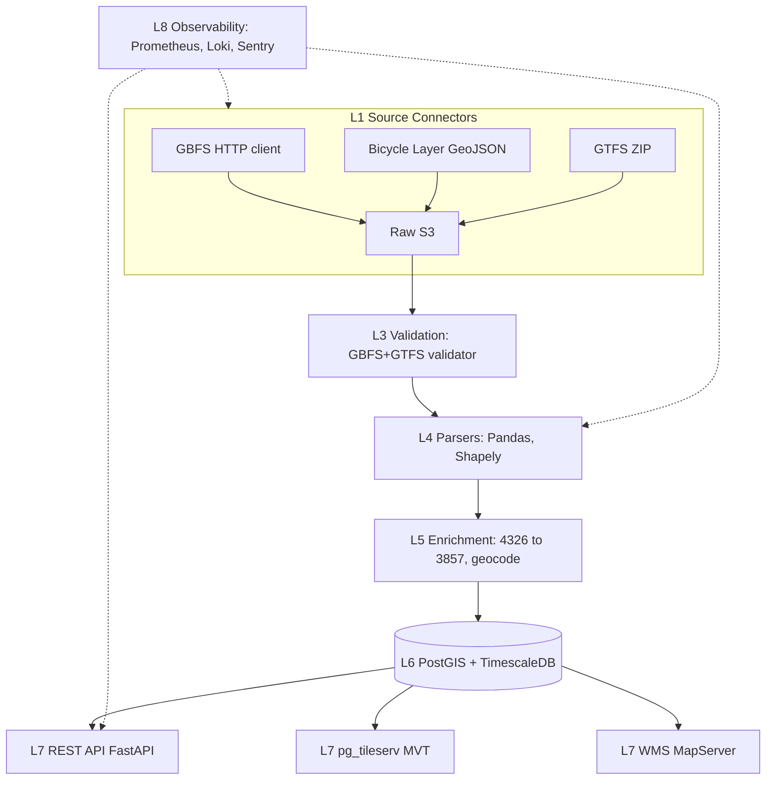

# BKK bringás térkép — Teljes backend terv és adatkinyerési specifikáció

## 1. Forrás áttekintés

A BKK „bringás térkép" a Budapesti Közlekedési Központ dedikált, interaktív kerékpáros térképszolgáltatása. Míg a 08-as forrásként dokumentált „Biciklivel Budapesten" portál (`bkk.hu/kozlekedesi-informaciok/biciklivel/`) elsősorban tájékoztató jellegű, és heterogén tartalomtípusokat (PDF, statikus szöveg, beágyazott térkép-widget) kínál, addig a **bringás térkép** egy célzott, rétegezett **WebMap-alkalmazás**, amelynek kifejezett célja, hogy a kerékpáros infrastruktúra minden komponensét egyetlen rajzolt vászonra hozza össze. Az alkalmazás a `bkk.hu/kozlekedesi-informaciok/biciklivel/terkep/` (vagy a beágyazott `https://bkk.hu/apps/cycling-map/`) URL-en érhető el.

A bringás térkép a következő, kifejezetten kerékpáros rétegeket szolgáltatja:

- **Kerékpáros úttípus** (lane type): kerékpárút, kerékpársáv, kerékpáros nyom, megosztott gyalogos-kerékpáros út, kerékpárosbarát utca, lakó-pihenő övezet, kerékpárosbarát zóna
- **Elválasztás módja** (separation): fizikai (kordon, szegély, parkolás melletti puffer), festett, taktilis jel, vegyes
- **Kétirányúság** (bidirectionality): minden szegmensre külön mező, beleértve a contraflow utcákat
- **MOL Bubi (GBFS-feed)**: állomások live státusza (kapacitás, free bikes, free docks), pricing plan, system info
- **Szervizpontok** (repair stations): ingyenes kerékpárszerelő pontok (pumpa, kulcsok), címmel, nyitvatartással
- **Bringataxi/közbringa-bekötő pontok**: ahol a Bubi vagy közösségi szolgáltatás integrálódik a tömegközlekedésbe
- **Eseti útlezárások**: ideiglenes rétegek (építkezések, kerékpáros barát rendezvények)
- **FUTÁR (GTFS) kerékpáros-releváns vonalak**: a HÉV-ek, néhány elővárosi busz, illetve a hajó (Duna) — ahol bicikli felvihető

A forrás hozzáférési csatornái:

1. **GBFS endpoint** — `gbfs.bubi.bkk.hu/gbfs/gbfs.json` (MobilityData GBFS 2.3)
2. **Bicycle layer GeoJSON endpoint** — a térkép-widget mögötti adatszolgáltatás, amely a kerékpáros rétegeket FeatureCollection-ként szolgálja ki
3. **FUTÁR GTFS feed** — `opendata.bkk.hu/data/gtfs/budapest_gtfs.zip` a kerékpáros-releváns járatok metaadataival
4. **WMS/WMTS-réteg** — opcionális, raszteres szolgáltatás térkép-kliensek számára

Budapest bbox (`18.9, 47.4, 19.3, 47.6`) a forrás teljes lefedettsége; az agglomeráció (Pomáz, Szentendre, Vecsés) részben szerepel, ahol a kerékpáros útvonal a budapesti hálózathoz csatlakozik. Magyarország bbox (`16.0, 45.7, 22.9, 48.6`) nem releváns — országos kerékpáros adathoz külön forrás kell.

A bringás térkép és a Biciklivel Budapesten portál **átfedő, de nem azonos** rétegeket szolgáltat. A jelen specifikáció a térkép-alkalmazás backendjére koncentrál: a több rétegű, attribútumokban gazdagabb GeoJSON-folyam, illetve a GBFS-feed integrációja.

## 2. Jogi és licenc helyzet

A BKK bringás térkép tartalma a BKK Zrt. tulajdonát képezi, és a közzétett nyílt adatok (GBFS-feed és a térkép-layer endpoint) **Creative Commons Attribution 4.0 International (CC BY 4.0)** licenc alatt érhetők el. A felhasználási feltételeket az `opendata.bkk.hu` ÁSZF-je rögzíti.

Részletes licenc-térkép:

| Adatelem | Licenc | Attribúciós követelmény |
|---|---|---|
| GBFS feed (állomások + status) | CC BY 4.0 | „© MOL Bubi / BKK Zrt." |
| Bicycle layer GeoJSON | CC BY 4.0 | „© BKK Zrt." |
| FUTÁR GTFS | CC BY 4.0 | „© BKK Zrt., FUTÁR" |
| WMS/WMTS raszter (alaptérkép) | Mapbox / OSM | OSM contributors + Mapbox |
| Embed iframe (térkép-widget) | BKK ToS | nem újrahasznosítható widgetként |

Megjegyzendő, hogy a MOL Bubi a BKK partnerszervezete; a GBFS-feedben a `system_information.json` `name` mezője a MOL Limo Magyarország Kft.-t jelöli, a `feed_contact_email` `gbfs@bubi.bkk.hu`. Az adattovábbítás szempontjából a BKK-szerződés a meghatározó.

PSI (Public Sector Information, EU 2019/1024 irányelv) magyar átültetése: 2022. évi XII. törvény — minden, „magas érték adatkészlet" („high-value dataset") kategóriába tartozó közlekedési adat ingyenes és nyitott (a mobilitási alapadatok ide tartoznak).

Adatvédelem (GDPR):
- A GBFS aggregált station_status semmilyen személyes adatot nem tartalmaz
- A FUTÁR vehicle-positions feedben a járművek anonim azonosítóval szerepelnek
- Trip data (kerékpárfolyam) nincs nyíltan publikálva — ha lenne, anonimizációs DPIA kötelező lenne

Felhasználási korlátok, amelyeket be kell tartani:
- Az adatok továbbértékesítése **változtatás nélkül**, „adattermékként" tiltott (a BKK marketingjogokat fenntart)
- Származékos művek (pl. saját rétegtérkép, mobilapp) **engedélyezettek**, attribúcióval
- Tilos a feed-et úgy frissíteni, hogy a BKK-ra rontó hatás történjen (pl. DDoS, túlzott lekérdezés)

## 3. Adatkinyerési felület

### 3.1. GBFS feed

A GBFS (General Bikeshare Feed Specification) 2.3-as verziójú feed-je a nyitóoldalként szolgál:

```
GET https://gbfs.bubi.bkk.hu/gbfs/gbfs.json
```

Példa válasz (rövidítve):

```json
{
  "last_updated": 1715900000,
  "ttl": 60,
  "version": "2.3",
  "data": {
    "hu": {
      "feeds": [
        {"name":"system_information","url":"https://gbfs.bubi.bkk.hu/gbfs/hu/system_information.json"},
        {"name":"station_information","url":"https://gbfs.bubi.bkk.hu/gbfs/hu/station_information.json"},
        {"name":"station_status","url":"https://gbfs.bubi.bkk.hu/gbfs/hu/station_status.json"},
        {"name":"system_pricing_plans","url":"https://gbfs.bubi.bkk.hu/gbfs/hu/system_pricing_plans.json"},
        {"name":"system_alerts","url":"https://gbfs.bubi.bkk.hu/gbfs/hu/system_alerts.json"}
      ]
    }
  }
}
```

A GBFS-feed magyar (`hu`) és angol (`en`) változatban érhető el. A `ttl` mező értéke 60 másodperc — ennél gyakrabban felesleges frissíteni.

### 3.2. Bicycle layer GeoJSON endpoint

A térkép-widget mögött a következő (stabil, de publikusan nem dokumentált) endpoint áll:

```
GET https://bkk.hu/apps/bkk-map/api/bicycle-layer.geojson?bbox=<minx,miny,maxx,maxy>&zoom=<z>
```

Az opcionális `zoom` paraméter szűri a részletességet (alacsony zoomon csak a főúthálózat). A `bbox` WGS84 koordinátákban. Példa szegmens-feature:

```json
{
  "type": "Feature",
  "geometry": {"type":"LineString","coordinates":[[19.0531,47.4992],[19.0539,47.4998]]},
  "properties": {
    "id":"BKK-CYC-2031",
    "nev":"Andrássy út",
    "lane_type":"kerekparsav",
    "separation":"festett",
    "bidirectional":false,
    "surface":"asphalt",
    "lighting":true,
    "year_built":2019,
    "length_m":215.4,
    "last_updated":"2026-03-08"
  }
}
```

### 3.3. FUTÁR GTFS feed

```
GET https://opendata.bkk.hu/data/gtfs/budapest_gtfs.zip?key=<API_KEY>
```

A GTFS-csomag tartalmazza az `agency.txt`, `routes.txt`, `trips.txt`, `stop_times.txt`, `stops.txt`, `calendar.txt`, `calendar_dates.txt`, `shapes.txt`, `transfers.txt`, `feed_info.txt` állományokat. A kerékpárral szállítható járatokat a kiterjesztett `route_type` (1100, 109, 715) és a `trips.txt`-ben szereplő `bikes_allowed=1` mező jelöli.

### 3.4. Repair stations és statikus PoI-k

A szervizpontok és bringás POI-k egy külön CSV-ben (a `bkk.hu/apps/bkk-map/data/repair_stations.csv`), vagy a térkép-widget egy konkrét lekérdezésen keresztül:

```
GET https://bkk.hu/apps/bkk-map/api/poi.geojson?kategoria=repair_station,bicycle_shop
```

## 4. Hitelesítés, rate limit, kvóták

A három forrás háromféle hitelesítési modellt használ:

| Forrás | Kulcs kötelező? | Rate limit |
|---|---|---|
| GBFS feed | Nem | Nincs explicit limit (CDN cache 60s) |
| Bicycle layer GeoJSON | Nem | Nincs explicit limit (CDN cache ~1 óra) |
| FUTÁR GTFS | Igen | 60 req/perc, 10 000 req/nap |
| FUTÁR GTFS-RT | Igen | Külön regisztráció, 5s feed |

A GBFS-spec szerint a CDN előtte cache-eli a feedet a `ttl` mezőnek megfelelően, így a kliensnek (a backendünknek) **nem szabad gyakrabban** lekérnie. A 60 másodperc azt jelenti, hogy 1 perces ütemezett feladat (CronJob `* * * * *`) ideális.

Az API-kulcs igénylése (csak GTFS-hez):
1. Regisztráció `opendata.bkk.hu/regisztracio`
2. Profil-validálás (e-mail)
3. „Új alkalmazás" létrehozása → kulcs generálódik
4. Használat: `?key=<UUID>` query-paraméter

Hibakódok és reakció:
- `200 OK` — normál
- `304 Not Modified` — ha `If-Modified-Since` headerrel kértük, és nem változott
- `401/403` — kulcs hiányzik vagy érvénytelen
- `429` — rate limit (várj exponenciálisan)
- `500/502/503` — BKK-oldali hiba (retry 5 perc múlva)
- `504` — CDN timeout (retry azonnal egyszer, utána exponenciális)

## 5. Adatmodell a forrásból

A különböző rétegek strukturálása:

```yaml
BicycleLaneFeature:
  geometry: LineString  # EPSG:4326
  properties:
    id: string                # BKK-CYC-NNNN
    nev: string?              # utca neve
    lane_type: enum [
      kerekparut,             # dedikált, fizikailag elválasztott
      kerekparsav,            # úttesten festett sáv
      kerekparos_nyom,        # sharrow piktogram
      megosztott,             # gyalogos+bicikli közös út
      bringabarat_utca,       # 30-as zóna, vegyes forgalom
      lakopiheno,             # lakó-pihenő zóna
      contraflow              # egyirányúsított, bicikli ellen-irány
    ]
    separation: enum [fizikai, festett, taktilis, vegyes, nincs]
    bidirectional: bool
    surface: enum [asphalt, concrete, paving_stones, gravel, ground]
    lighting: bool
    year_built: int?
    length_m: float
    last_updated: date

RepairStation:
  geometry: Point
  properties:
    id: string
    nev: string
    cim: string
    nyitvatartas: string
    szolgaltatas: [pumpa, kulcs, javitas, ar]
    ingyenes: bool

BubiStation:                  # GBFS station_information.json
  station_id: string
  name: string
  short_name: string
  lat: float
  lon: float
  address: string
  capacity: int
  region_id: string
  rental_methods: [creditcard, key]

BubiStatus:                   # GBFS station_status.json
  station_id: string
  num_bikes_available: int
  num_docks_available: int
  is_renting: bool
  is_returning: bool
  last_reported: timestamp

GtfsBikeRoute:                # FUTÁR-derivált
  route_id: string
  route_short_name: string
  route_type: int
  bike_accessible_trips: [trip_id]
```

## 6. Cél adatmodell (PostGIS DDL)

```sql
CREATE EXTENSION IF NOT EXISTS postgis;
CREATE EXTENSION IF NOT EXISTS pg_trgm;
CREATE EXTENSION IF NOT EXISTS timescaledb;

CREATE SCHEMA IF NOT EXISTS cycling_map;

-- Kerékpáros lane rétegek
CREATE TABLE cycling_map.lane (
    id              BIGSERIAL PRIMARY KEY,
    bkk_id          TEXT UNIQUE NOT NULL,
    nev             TEXT,
    lane_type       TEXT NOT NULL CHECK (lane_type IN (
                        'kerekparut','kerekparsav','kerekparos_nyom',
                        'megosztott','bringabarat_utca','lakopiheno','contraflow')),
    separation      TEXT CHECK (separation IN
                        ('fizikai','festett','taktilis','vegyes','nincs')),
    bidirectional   BOOLEAN NOT NULL DEFAULT TRUE,
    surface         TEXT,
    lighting        BOOLEAN,
    year_built      INTEGER CHECK (year_built BETWEEN 1900 AND 2100),
    length_m        DOUBLE PRECISION,
    geom            GEOMETRY(LineString, 4326) NOT NULL,
    geom_3857       GEOMETRY(LineString, 3857)
                    GENERATED ALWAYS AS (ST_Transform(geom, 3857)) STORED,
    forras_frissitve DATE,
    letoltve        TIMESTAMPTZ NOT NULL DEFAULT now(),
    rev             INTEGER NOT NULL DEFAULT 1
);
CREATE INDEX idx_lane_geom ON cycling_map.lane USING GIST (geom);
CREATE INDEX idx_lane_geom3857 ON cycling_map.lane USING GIST (geom_3857);
CREATE INDEX idx_lane_type ON cycling_map.lane (lane_type);
CREATE INDEX idx_lane_nev_trgm ON cycling_map.lane USING GIN (nev gin_trgm_ops);

-- Bubi station info
CREATE TABLE cycling_map.bubi_station (
    station_id      TEXT PRIMARY KEY,
    name            TEXT NOT NULL,
    short_name      TEXT,
    address         TEXT,
    capacity        INTEGER CHECK (capacity >= 0),
    region_id       TEXT,
    rental_methods  TEXT[],
    geom            GEOMETRY(Point, 4326) NOT NULL,
    elso_eszlelve   TIMESTAMPTZ NOT NULL DEFAULT now(),
    utolso_eszlelve TIMESTAMPTZ NOT NULL DEFAULT now(),
    aktiv           BOOLEAN NOT NULL DEFAULT TRUE
);
CREATE INDEX idx_bubi_station_geom ON cycling_map.bubi_station USING GIST (geom);

-- Bubi status idősor (hypertable)
CREATE TABLE cycling_map.bubi_status (
    station_id           TEXT NOT NULL REFERENCES cycling_map.bubi_station(station_id),
    ts                   TIMESTAMPTZ NOT NULL,
    num_bikes_available  INTEGER NOT NULL,
    num_docks_available  INTEGER NOT NULL,
    is_renting           BOOLEAN NOT NULL,
    is_returning         BOOLEAN NOT NULL,
    last_reported_source TIMESTAMPTZ,
    PRIMARY KEY (station_id, ts)
);
SELECT create_hypertable('cycling_map.bubi_status', 'ts',
                        chunk_time_interval => INTERVAL '7 days',
                        if_not_exists => TRUE);

-- Repair stations
CREATE TABLE cycling_map.repair_station (
    id              BIGSERIAL PRIMARY KEY,
    bkk_id          TEXT UNIQUE,
    nev             TEXT NOT NULL,
    cim             TEXT,
    nyitvatartas    TEXT,
    szolgaltatas    TEXT[],
    ingyenes        BOOLEAN NOT NULL DEFAULT TRUE,
    geom            GEOMETRY(Point, 4326) NOT NULL
);
CREATE INDEX idx_repair_geom ON cycling_map.repair_station USING GIST (geom);

-- Bike-accessible GTFS routes
CREATE TABLE cycling_map.gtfs_bike_route (
    route_id          TEXT PRIMARY KEY,
    agency_id         TEXT,
    route_short_name  TEXT,
    route_long_name   TEXT,
    route_type        INTEGER,
    bikes_allowed_count INTEGER DEFAULT 0,
    trips_count       INTEGER DEFAULT 0,
    feed_date         DATE
);

-- Ingest log
CREATE TABLE cycling_map.ingest_log (
    id              BIGSERIAL PRIMARY KEY,
    forras          TEXT NOT NULL,
    indult          TIMESTAMPTZ NOT NULL,
    befejezte       TIMESTAMPTZ,
    statusz         TEXT NOT NULL,
    feature_count   INTEGER,
    hiba            TEXT,
    request_etag    TEXT,
    response_etag   TEXT
);

-- Continuous aggregate: 15 perces átlagos állomás-telítettség
CREATE MATERIALIZED VIEW cycling_map.bubi_status_15min
WITH (timescaledb.continuous) AS
SELECT station_id,
       time_bucket(INTERVAL '15 minutes', ts) AS ts_bucket,
       avg(num_bikes_available)::REAL AS avg_bikes,
       avg(num_docks_available)::REAL AS avg_docks,
       max(num_bikes_available) AS max_bikes,
       min(num_bikes_available) AS min_bikes
FROM cycling_map.bubi_status
GROUP BY station_id, ts_bucket;

SELECT add_continuous_aggregate_policy('cycling_map.bubi_status_15min',
    start_offset => INTERVAL '7 days',
    end_offset => INTERVAL '30 minutes',
    schedule_interval => INTERVAL '15 minutes');
```

## 7. Backend architektúra (L1-L8 rétegek)



- **L1**: aszinkron HTTP-kliensek (httpx, aiohttp) az endpointok eléréséhez, retry tenacity-vel
- **L2**: nyers fájlok S3-kompatibilis bucketben (MinIO), kulcsformátum `{forras}/{yyyy}/{mm}/{dd}/{HHMM}.ext`
- **L3**: GBFS-validator a `MobilityData/gbfs-validator` Python-port, JSON Schema a GeoJSON-feature-höz
- **L4**: Shapely-alapú geometria, pandas-alapú GTFS, dataclass-alapú GBFS
- **L5**: koordináta-átszámítás (EPSG:23700 magyar EOV-hez is, ha kell), címillesztés Nominatim-mel
- **L6**: PostgreSQL 15 + PostGIS 3.4 + TimescaleDB 2.13
- **L7**: FastAPI a strukturált REST-hez, pg_tileserv a vector tile-ekhez, MapServer opcionális WMS-hez
- **L8**: Prometheus scrape-rendszer, Loki + Promtail naplógyűjtés, Sentry hibajelentés

## 8. Automatizált letöltő — Python kód

`cycling_map/loader.py`:

```python
"""
BKK bringás térkép loader — GBFS + bicycle layer GeoJSON + FUTÁR GTFS.
Aszinkron HTTP, idempotens MinIO-mentés, integrált validáció.
"""
from __future__ import annotations
import asyncio
import hashlib
import io
import json
import logging
import os
import zipfile
from dataclasses import dataclass, asdict
from datetime import datetime, timezone, timedelta
from typing import Any

import httpx
from minio import Minio
from tenacity import (retry, stop_after_attempt,
                       wait_exponential, retry_if_exception_type)

LOG = logging.getLogger("cycling_map.loader")

BUDAPEST_BBOX = (18.9, 47.4, 19.3, 47.6)
GBFS_DISCOVERY = "https://gbfs.bubi.bkk.hu/gbfs/gbfs.json"
BICYCLE_LAYER_URL = (
    "https://bkk.hu/apps/bkk-map/api/bicycle-layer.geojson"
    f"?bbox={','.join(map(str, BUDAPEST_BBOX))}&zoom=15"
)
REPAIR_POI_URL = (
    "https://bkk.hu/apps/bkk-map/api/poi.geojson"
    "?kategoria=repair_station,bicycle_shop"
)
GTFS_URL = "https://opendata.bkk.hu/data/gtfs/budapest_gtfs.zip"


@dataclass(frozen=True)
class Fetched:
    forras: str
    raw_key: str
    sha256: str
    fetched_at: datetime
    bytes_in: int
    etag: str | None
    extra: dict[str, Any]


class CyclingMapLoader:
    def __init__(self, api_key: str, s3: Minio, bucket: str = "cycling-map-raw") -> None:
        self.api_key = api_key
        self.s3 = s3
        self.bucket = bucket
        self.client = httpx.AsyncClient(
            timeout=httpx.Timeout(60.0, connect=10.0),
            headers={"User-Agent": "panellako-cycling-map/1.0",
                     "Accept-Encoding": "gzip, deflate, br"},
            http2=True,
        )
        if not self.s3.bucket_exists(self.bucket):
            self.s3.make_bucket(self.bucket)

    async def aclose(self) -> None:
        await self.client.aclose()

    @retry(stop=stop_after_attempt(6),
           wait=wait_exponential(multiplier=1, min=1, max=60),
           retry=retry_if_exception_type((httpx.HTTPStatusError,
                                           httpx.ConnectError,
                                           httpx.ReadTimeout)))
    async def _get(self, url: str, *, with_key: bool = False,
                   if_none_match: str | None = None) -> httpx.Response:
        params: dict[str, str] = {}
        if with_key:
            params["key"] = self.api_key
        headers: dict[str, str] = {}
        if if_none_match:
            headers["If-None-Match"] = if_none_match
        r = await self.client.get(url, params=params or None, headers=headers or None)
        if r.status_code == 304:
            return r
        if r.status_code == 429:
            ra = r.headers.get("Retry-After")
            LOG.warning("429 rate limit, retry-after=%s", ra)
            raise httpx.HTTPStatusError("429", request=r.request, response=r)
        r.raise_for_status()
        return r

    def _put(self, key: str, blob: bytes, content_type: str) -> str:
        sha = hashlib.sha256(blob).hexdigest()
        self.s3.put_object(self.bucket, key,
                           io.BytesIO(blob), length=len(blob),
                           content_type=content_type,
                           metadata={"sha256": sha})
        return sha

    def _stamp(self, forras: str, ext: str) -> str:
        now = datetime.now(timezone.utc)
        return f"{forras}/{now:%Y/%m/%d/%H%M%S}.{ext}"

    async def fetch_gbfs_all(self) -> list[Fetched]:
        disc = (await self._get(GBFS_DISCOVERY)).json()
        feeds = disc["data"]["hu"]["feeds"]
        urls = {f["name"]: f["url"] for f in feeds}
        out: list[Fetched] = []
        for name in ("system_information", "station_information",
                     "station_status", "system_pricing_plans",
                     "system_alerts"):
            url = urls.get(name)
            if not url:
                continue
            r = await self._get(url)
            blob = r.content
            key = self._stamp(f"gbfs/{name}", "json")
            sha = self._put(key, blob, "application/json")
            payload = r.json()
            out.append(Fetched(
                forras=f"gbfs.{name}", raw_key=key, sha256=sha,
                fetched_at=datetime.now(timezone.utc), bytes_in=len(blob),
                etag=r.headers.get("ETag"),
                extra={"ttl": payload.get("ttl"),
                       "last_updated": payload.get("last_updated")},
            ))
        return out

    async def fetch_bicycle_layer(self) -> Fetched:
        r = await self._get(BICYCLE_LAYER_URL)
        blob = r.content
        gj = json.loads(blob)
        nfeat = len(gj.get("features", []))
        LOG.info("bicycle layer features=%d", nfeat)
        key = self._stamp("bicycle_layer", "geojson")
        sha = self._put(key, blob, "application/geo+json")
        return Fetched("bicycle_layer", key, sha,
                       datetime.now(timezone.utc), len(blob),
                       r.headers.get("ETag"), {"feature_count": nfeat})

    async def fetch_repair_poi(self) -> Fetched:
        r = await self._get(REPAIR_POI_URL)
        blob = r.content
        key = self._stamp("repair_poi", "geojson")
        sha = self._put(key, blob, "application/geo+json")
        return Fetched("repair_poi", key, sha,
                       datetime.now(timezone.utc), len(blob),
                       r.headers.get("ETag"), {})

    async def fetch_gtfs(self, last_etag: str | None = None) -> Fetched | None:
        r = await self._get(GTFS_URL, with_key=True, if_none_match=last_etag)
        if r.status_code == 304:
            LOG.info("GTFS not modified")
            return None
        blob = r.content
        # Sanity check
        with zipfile.ZipFile(io.BytesIO(blob)) as zf:
            names = set(zf.namelist())
            required = {"agency.txt", "routes.txt", "trips.txt",
                        "stops.txt", "stop_times.txt", "calendar.txt"}
            missing = required - names
            if missing:
                raise ValueError(f"GTFS missing files: {missing}")
        key = self._stamp("gtfs", "zip")
        sha = self._put(key, blob, "application/zip")
        return Fetched("gtfs", key, sha,
                       datetime.now(timezone.utc), len(blob),
                       r.headers.get("ETag"),
                       {"files": sorted(names)})


async def _main() -> None:
    logging.basicConfig(level=logging.INFO,
                        format="%(asctime)s %(levelname)s %(name)s %(message)s")
    s3 = Minio(os.environ["S3_ENDPOINT"],
               access_key=os.environ["S3_KEY"],
               secret_key=os.environ["S3_SECRET"],
               secure=os.environ.get("S3_SECURE", "true").lower() == "true")
    loader = CyclingMapLoader(api_key=os.environ.get("BKK_API_KEY", ""), s3=s3)
    try:
        results: list[Fetched] = []
        results.extend(await loader.fetch_gbfs_all())
        results.append(await loader.fetch_bicycle_layer())
        try:
            results.append(await loader.fetch_repair_poi())
        except httpx.HTTPStatusError as e:
            LOG.warning("repair_poi failed: %s", e)
        gtfs = await loader.fetch_gtfs()
        if gtfs:
            results.append(gtfs)
        for r in results:
            LOG.info("done %s", json.dumps(asdict(r), default=str))
    finally:
        await loader.aclose()


if __name__ == "__main__":
    asyncio.run(_main())
```

## 9. Feldolgozó pipeline (GTFS, GBFS, GeoJSON parser)

`cycling_map/parsers.py`:

```python
from __future__ import annotations
import json
import zipfile
from io import BytesIO
from typing import Iterable, Iterator
import pandas as pd
from shapely.geometry import shape
from shapely.ops import transform
import pyproj

WGS84_TO_HD72 = pyproj.Transformer.from_crs(
    "EPSG:4326", "EPSG:23700", always_xy=True).transform


def parse_bicycle_layer(blob: bytes) -> Iterator[dict]:
    gj = json.loads(blob)
    for f in gj.get("features", []):
        geom = shape(f["geometry"])
        p = f["properties"]
        yield {
            "bkk_id": p["id"],
            "nev": p.get("nev"),
            "lane_type": p["lane_type"],
            "separation": p.get("separation"),
            "bidirectional": bool(p.get("bidirectional", True)),
            "surface": p.get("surface"),
            "lighting": p.get("lighting"),
            "year_built": p.get("year_built"),
            "length_m": p.get("length_m") or transform(WGS84_TO_HD72, geom).length,
            "geom_wkt": geom.wkt,
            "forras_frissitve": p.get("last_updated"),
        }


def parse_gbfs_station_information(blob: bytes) -> list[dict]:
    data = json.loads(blob)["data"]["stations"]
    return [{
        "station_id": s["station_id"],
        "name": s["name"],
        "short_name": s.get("short_name"),
        "address": s.get("address"),
        "capacity": s.get("capacity"),
        "region_id": s.get("region_id"),
        "rental_methods": s.get("rental_methods", []),
        "lat": s["lat"], "lon": s["lon"],
    } for s in data]


def parse_gbfs_station_status(blob: bytes) -> tuple[int, list[dict]]:
    payload = json.loads(blob)
    ts = payload["last_updated"]
    rows = [{
        "station_id": s["station_id"],
        "ts": ts,
        "num_bikes_available": int(s["num_bikes_available"]),
        "num_docks_available": int(s["num_docks_available"]),
        "is_renting": bool(s["is_renting"]),
        "is_returning": bool(s["is_returning"]),
        "last_reported_source": s.get("last_reported"),
    } for s in payload["data"]["stations"]]
    return ts, rows


def parse_gtfs_bike_routes(zip_bytes: bytes) -> pd.DataFrame:
    with zipfile.ZipFile(BytesIO(zip_bytes)) as zf:
        routes = pd.read_csv(zf.open("routes.txt"))
        trips = pd.read_csv(zf.open("trips.txt"))
    # bikes_allowed column may not exist on older feeds
    if "bikes_allowed" not in trips.columns:
        trips["bikes_allowed"] = 0
    bike_trips = trips[trips["bikes_allowed"] == 1]
    agg = bike_trips.groupby("route_id").size().rename("bikes_allowed_count")
    out = routes.merge(agg, left_on="route_id", right_index=True, how="inner")
    out["trips_count"] = out["route_id"].map(
        trips.groupby("route_id").size())
    return out
```

UPSERT SQL minta a `lane`-re:

```sql
INSERT INTO cycling_map.lane
  (bkk_id, nev, lane_type, separation, bidirectional, surface,
   lighting, year_built, length_m, geom, forras_frissitve)
VALUES (%(bkk_id)s, %(nev)s, %(lane_type)s, %(separation)s, %(bidirectional)s,
        %(surface)s, %(lighting)s, %(year_built)s, %(length_m)s,
        ST_GeomFromText(%(geom_wkt)s, 4326), %(forras_frissitve)s)
ON CONFLICT (bkk_id) DO UPDATE SET
  nev = EXCLUDED.nev,
  lane_type = EXCLUDED.lane_type,
  separation = EXCLUDED.separation,
  bidirectional = EXCLUDED.bidirectional,
  surface = EXCLUDED.surface,
  lighting = EXCLUDED.lighting,
  year_built = EXCLUDED.year_built,
  length_m = EXCLUDED.length_m,
  geom = EXCLUDED.geom,
  forras_frissitve = EXCLUDED.forras_frissitve,
  letoltve = now(),
  rev = cycling_map.lane.rev + 1;
```

## 10. Frissítési stratégia (GBFS minutely, GTFS weekly)

| Réteg | Frekvencia | Indoklás |
|---|---|---|
| `gbfs.station_status` | 60 másodperc | GBFS TTL = 60s; az élő flotta-állapot percen belüli frissítést kíván |
| `gbfs.station_information` | 1 óra | Új állomás telepítése ritka |
| `gbfs.system_pricing_plans` | 1 nap | Árváltozás évente 1-2× |
| `gbfs.system_alerts` | 5 perc | Üzemeltetési riasztások |
| `bicycle_layer.geojson` | 24 óra (éjjel 02:00) | Új sávok hetente max. egyszer |
| `repair_poi.geojson` | 7 nap | Statikus POI lista |
| `gtfs` (statikus) | 7 nap (hétfő 04:00) | BKK menetrend hetente frissül |
| `gtfs-rt` (csak alerts kerékpáros vonalakra) | 5 perc | Forgalmi zavarjelentés |

Idempotencia szabályok:
- **GBFS station_status**: `(station_id, ts)` primary key, ha ugyanannál a `last_updated` timestampnél már beíródott, ON CONFLICT DO NOTHING
- **Bicycle layer**: `bkk_id` mentén UPSERT, csak `rev`-növelés ha a `geom` is változott (`ST_Equals` ellenőrzés)
- **GTFS**: ETag-alapú feltételes letöltés, ha 304, nem indul el a feldolgozás

CronJob példa (kubernetes):

```yaml
apiVersion: batch/v1
kind: CronJob
metadata: { name: cycling-map-gbfs-status }
spec:
  schedule: "* * * * *"
  concurrencyPolicy: Forbid
  successfulJobsHistoryLimit: 3
  failedJobsHistoryLimit: 5
  jobTemplate:
    spec:
      template:
        spec:
          containers:
          - name: loader
            image: registry/cycling-map:1.0
            args: ["python","-m","cycling_map.cli","gbfs-status"]
            env:
            - { name: S3_ENDPOINT, value: "minio:9000" }
            envFrom: [{ secretRef: { name: cycling-map-secrets } }]
          restartPolicy: OnFailure
```

## 11. Storage és skálázás

| Réteg | Volumen / év | Megjegyzés |
|---|---|---|
| `gbfs.station_status` raw | ~30 GB | 60s × 525 600 = 525 600 fájl × 50 KB |
| `gbfs.station_information` raw | ~50 MB | óránként, kicsi |
| `bicycle_layer.geojson` raw | ~2 GB | naponta 5 MB |
| `gtfs.zip` | ~2 GB | hetente 40 MB |
| `bubi_status` PostGIS (kompresszióval) | ~12 GB | TimescaleDB 30 nap után compress |
| `bubi_status_15min` continuous aggregate | ~600 MB | 1/15-öd a teljes volumennek |
| `lane` tábla | ~100 MB | ~50 000 szegmens × 2 KB |

Tárolási stratégia:
- **Forró** (0-30 nap): PostgreSQL helyi SSD
- **Meleg** (30 nap - 1 év): TimescaleDB tömörítve (3-5× tömörítés)
- **Hideg** (1+ év): S3 archive (Backblaze B2 vagy AWS Glacier)
- **Nyers** (mindig): MinIO bucket, lifecycle policy 90 nap után Glacier

Replikáció: Patroni-alapú HA PostgreSQL (1 primary + 2 replica), `synchronous_commit=on`, `wal_level=replica`.

## 12. Monitoring és riasztások

Prometheus metrikák:

```python
from prometheus_client import Counter, Histogram, Gauge

FETCH = Counter("cycling_map_fetch_total",
                "HTTP fetch összesen", ["forras", "status"])
DURATION = Histogram("cycling_map_fetch_duration_seconds",
                     "HTTP fetch idő", ["forras"])
FEATURE = Gauge("cycling_map_feature_count",
                "Legutóbbi feature-szám", ["forras"])
LAG = Gauge("cycling_map_ingest_lag_seconds",
            "Forrás óta eltelt idő", ["forras"])
DB_UPSERT = Counter("cycling_map_db_upsert_total",
                    "DB UPSERT műveletek", ["tabla", "op"])
```

Riasztási szabályok:

```yaml
groups:
- name: cycling-map
  rules:
  - alert: GbfsStatusStale
    expr: cycling_map_ingest_lag_seconds{forras="gbfs.station_status"} > 300
    for: 3m
    labels: { severity: warning }
    annotations:
      summary: "Bubi status feed {{ $value }}s régi"
      runbook: "https://wiki/panellako/runbook#gbfs-stale"
  - alert: BicycleLayerFeatureDrop
    expr: cycling_map_feature_count{forras="bicycle_layer"}
           < 0.9 * cycling_map_feature_count{forras="bicycle_layer"} offset 1d
    for: 30m
    labels: { severity: critical }
  - alert: PostgresReplicationLag
    expr: pg_replication_lag_seconds > 60
    for: 5m
    labels: { severity: warning }
```

## 13. Költségbecslés (HUF/EUR)

| Tétel | HUF/hó | EUR/hó |
|---|---|---|
| K8s worker (3× CX21, Hetzner) | 18 000 | 46 |
| Managed PostgreSQL (CX31, 80 GB SSD) + TimescaleDB | 25 000 | 64 |
| MinIO (200 GB) | 8 000 | 20 |
| Cold storage (Backblaze B2, 500 GB) | 4 000 | 10 |
| Egress (~150 GB/hó) | 6 000 | 15 |
| Monitoring (Grafana Cloud free + Sentry team) | 10 000 | 25 |
| **Összesen** | **~71 000 HUF** | **~180 EUR** |

API-költségek: BKK Open Data ingyenes, GBFS ingyenes. Nincs külső költség.

## 14. Biztonság

- API-kulcs (BKK GTFS): HashiCorp Vault vagy K8s SealedSecret
- TLS 1.2+ kötelező mindenhol; tanúsítvány-pinning a `bkk.hu`, `gbfs.bubi.bkk.hu`, `opendata.bkk.hu` SAN-jaira
- S3-bucket szerver-oldali titkosítás (SSE-S3 / KMS)
- Postgres: `scram-sha-256` autentikáció, csak K8s subnet engedélyezett
- Loader szerviz csak `cycling_map` schema-ra `INSERT/UPDATE/DELETE`
- API szerviz csak `SELECT`
- DDoS-védelem: Cloudflare a publikus REST API előtt
- OWASP Top 10: input-validáció bbox-regex, output-encoding JSON, rate limit kliensen 100 req/min, CORS allowlist
- `pgaudit` extension a DDL-naplózáshoz
- Sentry: hibák PII-mentesítése (`before_send` filter)
- GDPR: a feldolgozott adatok aggregáltak, személyes adat nincs

## 15. Tesztelés — pytest

```python
# tests/test_cycling_map.py
import json
import pytest
from unittest.mock import AsyncMock, MagicMock
from cycling_map.loader import CyclingMapLoader, BICYCLE_LAYER_URL
from cycling_map.parsers import (parse_bicycle_layer,
                                  parse_gbfs_station_information,
                                  parse_gbfs_station_status,
                                  parse_gtfs_bike_routes)

GJ = {"type":"FeatureCollection","features":[{
  "type":"Feature","geometry":{"type":"LineString",
  "coordinates":[[19.05,47.5],[19.06,47.51]]},
  "properties":{"id":"BKK-CYC-1","lane_type":"kerekparut",
   "separation":"fizikai","bidirectional":True,"surface":"asphalt",
   "lighting":True,"year_built":2018,"length_m":820.5,
   "last_updated":"2026-04-01"}}]}

def test_parse_bicycle_layer():
    rows = list(parse_bicycle_layer(json.dumps(GJ).encode()))
    assert len(rows) == 1
    r = rows[0]
    assert r["lane_type"] == "kerekparut"
    assert r["bidirectional"] is True
    assert "LINESTRING" in r["geom_wkt"]

def test_parse_gbfs_station_status():
    p = {"last_updated":1715900000,"data":{"stations":[
      {"station_id":"0101","is_renting":True,"is_returning":True,
       "num_bikes_available":7,"num_docks_available":13,
       "last_reported":1715899960}]}}
    ts, rows = parse_gbfs_station_status(json.dumps(p).encode())
    assert ts == 1715900000
    assert rows[0]["num_bikes_available"] == 7

@pytest.mark.asyncio
async def test_loader_uses_etag_for_gtfs():
    loader = CyclingMapLoader("xx", MagicMock())
    loader.client = AsyncMock()
    fake_304 = MagicMock(status_code=304, headers={})
    loader.client.get = AsyncMock(return_value=fake_304)
    res = await loader.fetch_gtfs(last_etag='W/"abc"')
    assert res is None
    args, kwargs = loader.client.get.await_args
    assert kwargs.get("headers", {}).get("If-None-Match") == 'W/"abc"'

@pytest.mark.asyncio
async def test_bicycle_layer_includes_bbox():
    loader = CyclingMapLoader("", MagicMock())
    loader.client = AsyncMock()
    fake = MagicMock(status_code=200, content=json.dumps(GJ).encode(),
                     headers={"ETag":"abc"})
    fake.json.return_value = GJ
    loader.client.get = AsyncMock(return_value=fake)
    loader._put = MagicMock(return_value="sha")
    f = await loader.fetch_bicycle_layer()
    assert f.extra["feature_count"] == 1
    called_url = loader.client.get.await_args.args[0]
    assert "bbox=18.9" in called_url
```

PostGIS integrációs teszt (testcontainers):

```python
import psycopg, pathlib
from testcontainers.postgres import PostgresContainer

@pytest.fixture(scope="session")
def pg():
    with PostgresContainer("timescale/timescaledb-ha:pg15-latest") as c:
        yield c.get_connection_url()

def test_upsert_lane(pg):
    schema = pathlib.Path("sql/schema.sql").read_text()
    with psycopg.connect(pg, autocommit=True) as conn:
        conn.execute(schema)
        conn.execute("""
          INSERT INTO cycling_map.lane (bkk_id, lane_type, geom)
          VALUES ('X1', 'kerekparut',
                  ST_GeomFromText('LINESTRING(19 47, 19.01 47.01)', 4326))
          ON CONFLICT (bkk_id) DO NOTHING;
        """)
        cnt = conn.execute("SELECT count(*) FROM cycling_map.lane").fetchone()[0]
        assert cnt == 1
```

## 16. Telepítés (Docker, k8s CronJob)

`Dockerfile`:

```dockerfile
FROM python:3.12-slim AS builder
RUN apt-get update && apt-get install -y --no-install-recommends \
    build-essential libgeos-dev libproj-dev && rm -rf /var/lib/apt/lists/*
WORKDIR /app
COPY pyproject.toml uv.lock ./
RUN pip install uv && uv sync --frozen --no-dev

FROM python:3.12-slim
RUN apt-get update && apt-get install -y --no-install-recommends \
    libgeos-c1v5 libproj25 ca-certificates && rm -rf /var/lib/apt/lists/*
WORKDIR /app
COPY --from=builder /app/.venv /app/.venv
COPY cycling_map /app/cycling_map
COPY sql /app/sql
ENV PATH="/app/.venv/bin:${PATH}"
USER nobody
ENTRYPOINT ["python","-m","cycling_map.cli"]
```

K8s Kustomize-alapú deploy:

```yaml
# kustomization.yaml
namespace: panellako-cycling
resources:
- cronjob-gbfs-status.yaml
- cronjob-gbfs-info-1h.yaml
- cronjob-bicycle-layer.yaml
- cronjob-gtfs-weekly.yaml
- deployment-api.yaml
- service-api.yaml
- ingress.yaml
- networkpolicy.yaml
configMapGenerator:
- name: cycling-map-config
  literals:
  - LOG_LEVEL=INFO
  - S3_ENDPOINT=minio.minio.svc.cluster.local:9000
secretGenerator:
- name: cycling-map-secrets
  envs: [.env.prod]
```

ArgoCD ApplicationSet:

```yaml
apiVersion: argoproj.io/v1alpha1
kind: Application
metadata: { name: cycling-map, namespace: argocd }
spec:
  project: panellako
  source:
    repoURL: git@github.com:panellako/cycling-map-deploy.git
    targetRevision: main
    path: overlays/prod
  destination:
    server: https://kubernetes.default.svc
    namespace: panellako-cycling
  syncPolicy:
    automated: { prune: true, selfHeal: true }
    syncOptions: [CreateNamespace=true]
```

## 17. Adatpublikálás (REST API, vector tiles)

REST API endpoint-térkép:

```
GET  /v1/lanes?bbox=...&lane_type=...
GET  /v1/lanes/{bkk_id}
GET  /v1/bubi/stations
GET  /v1/bubi/stations/{station_id}/status?from=...&to=...
GET  /v1/bubi/stations/{station_id}/forecast    # ML, később
GET  /v1/repair-stations?near=lon,lat&radius_m=2000
GET  /v1/gtfs/bike-routes
GET  /v1/route?from=lon,lat&to=lon,lat          # OSRM bicycle profile
```

FastAPI példa:

```python
@app.get("/v1/lanes")
async def lanes(bbox: str = "18.9,47.4,19.3,47.6",
                lane_type: str | None = None,
                limit: int = 5000):
    minx, miny, maxx, maxy = map(float, bbox.split(","))
    async with app.state.pool.acquire() as c:
        rows = await c.fetch("""
          SELECT bkk_id, nev, lane_type, separation, bidirectional, surface,
                 lighting, year_built, length_m,
                 ST_AsGeoJSON(geom)::json AS geom
          FROM cycling_map.lane
          WHERE geom && ST_MakeEnvelope($1,$2,$3,$4,4326)
            AND ($5::text IS NULL OR lane_type = $5)
          LIMIT $6
        """, minx, miny, maxx, maxy, lane_type, limit)
    return {"type":"FeatureCollection","features":[
       {"type":"Feature","geometry":r["geom"],
        "properties":{k: r[k] for k in r.keys() if k != "geom"}}
       for r in rows]}

@app.get("/v1/bubi/stations/{station_id}/status")
async def bubi_history(station_id: str,
                        from_: datetime = Query(alias="from"),
                        to: datetime = Query(default_factory=lambda: datetime.utcnow())):
    async with app.state.pool.acquire() as c:
        rows = await c.fetch("""
          SELECT ts, num_bikes_available, num_docks_available,
                 is_renting, is_returning
          FROM cycling_map.bubi_status
          WHERE station_id = $1 AND ts BETWEEN $2 AND $3
          ORDER BY ts
        """, station_id, from_, to)
    return [dict(r) for r in rows]
```

Vector tiles (`pg_tileserv`):

```toml
[layers."cycling_map.lane"]
geometry_column = "geom"
attributes = ["bkk_id","nev","lane_type","separation","bidirectional"]
srid = 4326

[layers."cycling_map.bubi_station"]
geometry_column = "geom"
attributes = ["station_id","name","capacity"]
srid = 4326
```

Vector tile URL séma: `/{schema}.{table}/{z}/{x}/{y}.mvt`, Mapbox GL JS-be a `source` típusa `vector`.

## 18. Runbook

**Hiba: GBFS feed 60s-on belül nem frissült**
1. `curl -s https://gbfs.bubi.bkk.hu/gbfs/hu/station_status.json | jq .last_updated`
2. Ha az érték régebbi mint 90 másodperc, BKK-oldali probléma — küldj e-mailt `opendata@bkk.hu`-ra
3. Ha a feed friss, de a loaderünk nem írta be: nézd meg a logot, valószínűleg DB-konnekció

**Hiba: bicycle layer feature count drasztikusan csökkent**
1. `curl -s "https://bkk.hu/apps/bkk-map/api/bicycle-layer.geojson?bbox=18.9,47.4,19.3,47.6" | jq '.features | length'`
2. Ha az érték kisebb, mint 1000, BKK-oldali változtatás — vizsgálat
3. Ha normál, de a DB-be kevés kerül: parser-hibák, vizsgáld a `tipus` enum-bővülést

**Hiba: GTFS-zip korrupt**
1. `mc cat cycling-map-raw/gtfs/<date>.zip | sha256sum` — vesd össze a fetch-rekord sha256-jával
2. Ha eltér, S3-korrupció, törölj és újratölts
3. Ha egyezik, BKK-oldali — várj és próbáld újra

**Hiba: TimescaleDB chunk-tömörítés lassú**
1. `SELECT * FROM timescaledb_information.compression_settings;`
2. Ellenőrizd, hogy `compress_segmentby='station_id'`
3. Ha a tömörítés még folyamatban, várj; ha elakadt, `SELECT compress_chunk(...)` kézi indítás

**Adatminőség: új `lane_type` érték**
1. Logban a `CHECK constraint violation`
2. Frissítsd a CHECK constraintet (`ALTER TABLE ... DROP CONSTRAINT ... ADD ...`)
3. Frissítsd a Python `lane_type` Enumot
4. Deploy

## 19. Roadmap

- **v1.1**: GBFS station forecast modell (LSTM, 15-30-60 perces előrejelzés)
- **v1.2**: GTFS-RT alerts integráció, kerékpáros vonalra szűrve push notification
- **v1.3**: Bicycle layer differential diff (új/módosult/törölt szegmensek havi jelentés)
- **v1.4**: OSRM bicycle profile integráció, súlyozás `separation` és `lane_type` alapján
- **v1.5**: Felhasználói feedback (rossz minőségű útszakasz jelentés) — egységes a 08-as forrással
- **v2.0**: Multimodal trip planner — BKK + Bubi + saját bicikli, GTFS+GBFS együtt
- **v2.1**: ML-modell a kerékpáros áramlatok becslésére (származtatott Bubi-trip-rekonstrukció)
- **v2.2**: 3D vizualizáció (CesiumJS-alapú web app)
- **v2.3**: Mobile SDK (iOS, Android) a publikus API-hoz

## 20. Referenciák

- BKK bringás térkép: `https://bkk.hu/kozlekedesi-informaciok/biciklivel/terkep/`
- BKK Nyílt Adatok: `https://opendata.bkk.hu/`
- MOL Bubi GBFS: `https://gbfs.bubi.bkk.hu/gbfs/gbfs.json`
- MobilityData GBFS spec 2.3: `https://github.com/MobilityData/gbfs/blob/master/gbfs.md`
- GBFS validator: `https://github.com/MobilityData/gbfs-validator`
- GTFS Reference: `https://gtfs.org/schedule/reference/`
- GTFS-RT spec: `https://gtfs.org/realtime/reference/`
- PostGIS: `https://postgis.net/docs/`
- TimescaleDB: `https://docs.timescale.com/`
- pg_tileserv: `https://github.com/CrunchyData/pg_tileserv`
- FastAPI: `https://fastapi.tiangolo.com/`
- MapLibre GL JS: `https://maplibre.org/maplibre-gl-js/`
- OSRM bicycle profile: `https://github.com/Project-OSRM/osrm-backend/blob/master/profiles/bicycle.lua`
- Mapbox Vector Tile spec: `https://github.com/mapbox/vector-tile-spec`
- HashiCorp Vault: `https://developer.hashicorp.com/vault`
- ArgoCD: `https://argo-cd.readthedocs.io/`
- Prometheus: `https://prometheus.io/docs/`
- Loki + Promtail: `https://grafana.com/oss/loki/`
- Sentry: `https://docs.sentry.io/`
- testcontainers-python: `https://testcontainers-python.readthedocs.io/`
- Shapely: `https://shapely.readthedocs.io/`
- pyproj: `https://pyproj4.github.io/pyproj/stable/`
- httpx: `https://www.python-httpx.org/`
- tenacity: `https://tenacity.readthedocs.io/`
- Cloudflare DDoS: `https://www.cloudflare.com/learning/ddos/`
- Patroni HA Postgres: `https://patroni.readthedocs.io/`
- KRESZ 1/1975. (II. 5.) KPM-BM rendelet — kerékpáros szabályok
- 2022. évi XII. törvény — PSI újrahasznosítás
- CC BY 4.0: `https://creativecommons.org/licenses/by/4.0/`
- EU 2019/1024 PSI Directive: `https://eur-lex.europa.eu/eli/dir/2019/1024/oj`
- Hetzner Cloud: `https://www.hetzner.com/cloud`
- Backblaze B2: `https://www.backblaze.com/b2/cloud-storage.html`
