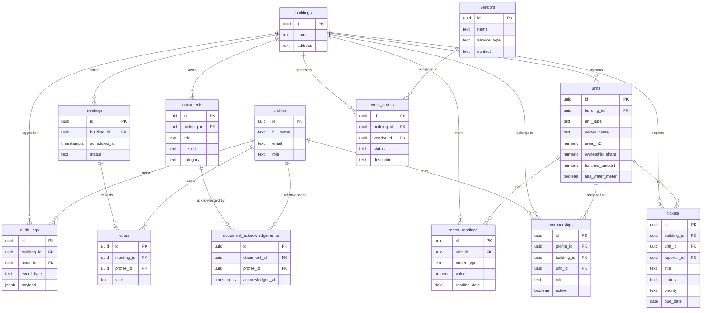

# Data Flow & Entity Reference — PanelLakó

**Generated:** 2026-05-15  
**Repository:** HenrikFaul/panellako  
**Source:** `supabase/schema.sql` (310 LOC), `lib/types.ts`, `lib/data.ts`  
**Confidence:** High

---

## Entity Relationship Overview

---

## All 19 Tables

| Table | Primary Key | Key Foreign Keys | Purpose | RLS |
|---|---|---|---|---|
| `profiles` | uuid | auth.users(id) | User identity + role | ✓ |
| `buildings` | uuid | — | Building master data | ✓ |
| `units` | uuid | building_id | Apartment registry | ✓ |
| `memberships` | uuid | profile_id, building_id, unit_id | User-building-role link | ✓ |
| `announcements` | uuid | building_id, created_by | News / posts | ✓ |
| `notifications` | uuid | building_id, created_by | Push / email alerts | ✓ |
| `tickets` | uuid | building_id, unit_id, reporter_id | Fault reports | ✓ |
| `meter_readings` | uuid | unit_id, building_id | Utility submissions | ✓ |
| `documents` | uuid | building_id, uploaded_by | Document library | ✓ |
| `document_acknowledgements` | uuid | document_id, profile_id | Read-receipts (upsert) | ✓ |
| `financials` | uuid | building_id, unit_id | Balance ledger | ✓ |
| `meetings` | uuid | building_id | Assembly events | ✓ |
| `agenda_items` | uuid | meeting_id | Meeting agenda | ✓ |
| `resolutions` | uuid | meeting_id | Passed resolutions | ✓ |
| `votes` | uuid | meeting_id, profile_id | Per-user votes | ✓ |
| `vendors` | uuid | — | Vendor master data | ✓ |
| `work_orders` | uuid | building_id, vendor_id | Maintenance orders | ✓ |
| `knowledge_base_articles` | uuid | building_id | Help articles | ✓ |
| `audit_logs` | uuid | building_id, actor_id | Event log | ✓ |

---

## Data Fetching — getDashboardData()

All data is fetched server-side in `lib/data.ts` using `createClient()` from `@supabase/ssr`.

| Data | Table | Limit | Order |
|---|---|---|---|
| news | announcements | 5 | created_at DESC |
| notifications | notifications | 8 | created_at DESC |
| tickets | tickets | 12 | created_at DESC |
| meterReadings | meter_readings | 8 | reading_date DESC |
| documents | documents | 10 | uploaded_at DESC |
| finances | finance_entries | 8 | due_date DESC |
| meetings | meetings | 6 | scheduled_at DESC |
| units | units | 12 | — |
| vendors | vendors | 8 | — |
| workOrders | work_orders | 8 | due_date ASC |
| kbArticles | knowledge_base_articles | 8 | — |
| auditLogs | audit_logs | 10 | created_at DESC |

**Note:** Data is currently fetched without `building_id` filter — all records for the authenticated user's buildings. Multi-building scoping is a pending task.
