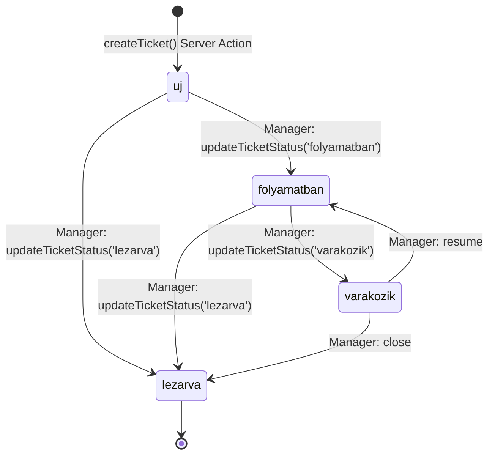
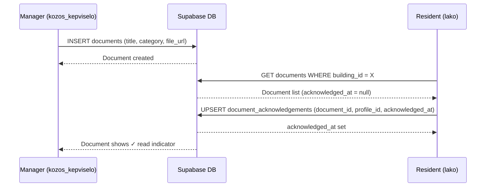
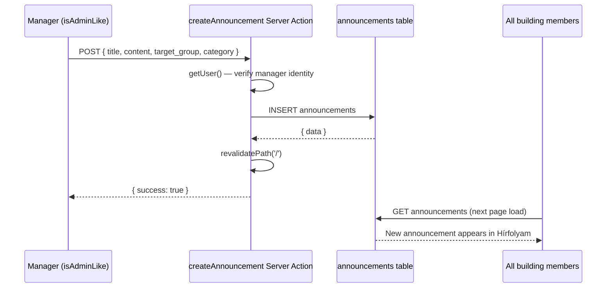

# Process Flows — PanelLakó

**Generated:** 2026-05-15  
**Repository:** HenrikFaul/panellako  
**Evidence basis:** `app/actions/tickets.ts`, `components/dashboard-client.tsx`, `middleware.ts`, `supabase/schema.sql`  
**Confidence:** High

---

## 1. Authentication Flow

```mermaid
flowchart TD
    A[User visits /] --> B{Has cookie session?}
    B -- No --> C[middleware.ts: getUser() returns null]
    C --> D[Page renders with mock/anonymous data]
    D --> E[User clicks Belépés → /login]
    E --> F[Enter email address]
    F --> G[Supabase sends Magic Link email]
    G --> H[User clicks link in email]
    H --> I[Supabase redirects to site URL + auth token]
    I --> J[middleware.ts: getUser() → valid user]
    J --> K[Cookie set with session]
    K --> L[Dashboard loads with authenticated data]

    B -- Yes --> J
```

---

## 2. Ticket Lifecycle (Hibabejelentés)



**Who can create:** All roles  
**Who can update status:** `kozos_kepviselo`, `megbizott`  
**DB table:** `tickets`  
**Server Action:** `app/actions/tickets.ts`

---

## 3. Document Read-Receipt Flow



**Server Action:** `app/actions/documents.ts` → `acknowledgeDocument(documentId)`

---

## 4. Meter Reading Submission

```mermaid
flowchart LR
    A[Resident fills meter form] --> B[Select: viz / gaz / villany]
    B --> C[Enter value + date]
    C --> D[Submit → submitMeterReading Server Action]
    D --> E{Supabase connected?}
    E -- Yes --> F[INSERT meter_readings table]
    F --> G[revalidatePath('/')]
    G --> H[Dashboard refreshes with new reading]
    E -- No --> I[Mock mode: no DB write, form resets]
```

---

## 5. Announcement Broadcast Flow (Értesítés)



---

## 6. Role-based Dashboard Routing

```mermaid
flowchart TD
    A[Request: GET /?role=xxx] --> B[app/page.tsx]
    B --> C{role param valid?}
    C -- Valid role --> D[Pass role to Dashboard Server Component]
    C -- Invalid/missing --> E[Default to 'lako' role]
    D --> F[getDashboardData(role)]
    E --> F
    F --> G[DashboardClient rendered with role-scoped UI]
    G --> H{isManager = kozos_kepviselo OR megbizott?}
    H -- true --> I[Show: ticket status buttons, notification form, vendor panel]
    H -- false --> J[Show: resident-only view, no management controls]
```
