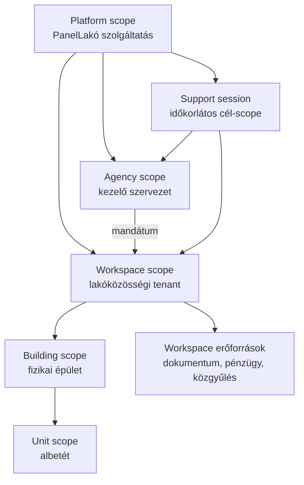

# 02 — Célarchitektúra, scope-ok és capability modell

## 1. Scope-hierarchia



### Platform scope

Kereszt-workspace állapot, integrációk, kiadási információ, platformaudit,
feature registry, felhasználói fiókok és közösségi aktiválási kérelmek.

### Agency scope

Egy kezelő szervezet portfóliója, munkatársai, mandátumai és delegációi. Egy
agency több workspace-hez kapcsolódhat, de ez nem ad automatikus
platformjogosultságot.

### Workspace scope

A tenant-biztonsági határ. A workspace-admin csak az adott workspace és az
ahhoz tartozó épület/albetét/erőforrás körében járhat el.

### Building és unit scope

Az épület és albetét fizikai/domain erőforrás. A platformadmin felületen ezek
csak aggregált KPI-ként vagy egy explicit, auditált support session céljaként
jelenhetnek meg.

## 2. Authority és role nem ugyanaz

Az effektív jogosultság számítása:

```text
engedélyezett =
  hitelesített, aktív operátori identity
  ÉS aktív szerepkör-hozzárendelés
  ÉS a szerepkörből vagy explicit delegációból eredő capability
  ÉS a capability scope-ja tartalmazza a célobjektumot
  ÉS az authority időben érvényes
  ÉS a munkamenet assurance szintje megfelelő
  ÉS a művelet state machine-je engedi az átmenetet
  ÉS magas kockázatnál rendelkezésre áll a szükséges jóváhagyás
```

A kliensoldali tab- vagy gombrejtés nem authorization kontroll.

## 3. Javasolt platform capability katalógus

| Capability | Scope | Kockázat | v1 |
|---|---|---:|---:|
| `platform.overview.read` | platform | alacsony | igen |
| `platform.health.read` | platform | alacsony | igen |
| `platform.release.read` | platform | alacsony | igen |
| `platform.integrations.read` | platform | alacsony | igen |
| `platform.audit.read` | platform | közepes | igen |
| `platform.users.read` | platform | közepes | meglévő |
| `platform.users.manage` | platform | magas | meglévő, hardeninggel |
| `platform.features.read` | platform | alacsony | meglévő |
| `platform.features.manage` | platform | magas | meglévő, auditált |
| `platform.communities.review` | platform/workspace | magas | meglévő |
| `platform.jobs.read` | platform | alacsony | meglévő |
| `platform.jobs.run` | platform | magas | meglévő, későbbi command kapu |
| `platform.integrations.test` | platform | közepes/magas | korlátozott |
| `platform.settings.manage` | platform | magas | meglévő, allowlisttel |
| `platform.support.request` | workspace/agency | magas | később |
| `platform.support.approve` | platform | kritikus | később |
| `platform.audit.export` | platform | magas | később |
| `platform.release.attest` | platform | kritikus | később |

## 4. Operátori szerepek célmodellje

| Szerep | Tipikus capability | Nem kapja meg automatikusan |
|---|---|---|
| `PLATFORM_OBSERVER` | overview, health, release | PII, mutáció |
| `SUPPORT_OPERATOR` | observer + maszkolt userkeresés + support request | közvetlen tenantírás |
| `COMMUNITY_REVIEWER` | közösségi kérelmek kezelése | feature/billing/job admin |
| `INTEGRATION_OPERATOR` | integráció- és jobállapot, engedélyezett futtatás | user/tenant tartalom |
| `SECURITY_OPERATOR` | audit, incidens és approval | üzleti tartalom kezelése |
| `PLATFORM_ADMIN` | teljes katalógus, kockázati kapukkal | kapuk megkerülése |

A v1 a meglévő superadmin sessiont használja kompatibilitási adapterként, de a
szerveroldali manifest már konkrét capabilityhez köti az egyes modulokat. Ez
előkészíti a névre szóló operátori identity későbbi bevezetését.

## 5. Modularchitektúra

```mermaid
flowchart LR
    UI[/superadmin shell] --> API[/api/superadmin/control-center]
    API --> AUTH[Superadmin auth adapter]
    API --> MANIFEST[Typed admin manifest]
    API --> KPI[KPI collectors]
    API --> HEALTH[Integration health collectors]
    API --> INBOX[Attention derivation]
    API --> AUDIT[Audit projection]
    API --> RELEASE[Release identity]
    KPI --> DB[(PanelLakó Supabase)]
    HEALTH --> DB
    INBOX --> DB
    AUDIT --> DB
    HEALTH --> GEO[GeoData Address Registry API]
```

### Typed admin manifest

Egyetlen szerveroldali katalógus írja le:

- modulazonosító, cím i18n-kulcs és kategória;
- szükséges capability és scope;
- adatforrás és kritikalitás;
- olvasási próba vagy command típusa;
- timeout és freshness küszöb;
- kapcsolódó runbook azonosító;
- támogatott állapotok;
- biztonságos deep link;
- contract schema version és determinisztikus fingerprint.

### Collector szabály

Minden collector:

- server-only;
- explicit timeoutot használ;
- csak a szükséges mezőket kérdezi le;
- az összes `{ data, error }` eredményt külön ellenőrzi;
- nem esik vissza anon kulcsra;
- hibát biztonságos kódra és státuszra normalizál;
- saját részpanel-eredményt ad, ezért a sibling collectoroktól izolált.

## 6. Adatáramlás és részleges hiba

A v1 aggregátor párhuzamosan gyűjti a független részeket, majd minden részhez
külön státuszt ad:

```text
ok          — hiteles és friss adat
degraded    — részadat vagy freshness probléma
unavailable — a forrás nem válaszolt vagy nincs konfigurálva
unknown     — nincs elég bizonyíték állapotot állítani
```

Az összesített oldal `overallStatus` értéke a legsúlyosabb kötelező rész
állapotából származik. `unknown` és `unavailable` soha nem jelenhet meg zöldként.

## 7. Tenantizolációs szabályok az adminban

- Platform KPI csak aggregált számot ad, nem kever tenantlistát a dashboardba.
- Workspace drill-down előtt a cél scope explicit kiválasztása szükséges.
- Egy request pontosan egy aktív workspace/agency support scope-pal futhat.
- Scope-váltás törli a kliens cache-ét és invalidálja a függőben lévő válaszokat.
- Cross-tenant export nem része a v1-nek.
- A workspace-admin jelenlegi capability és RLS logikája változatlan marad.
