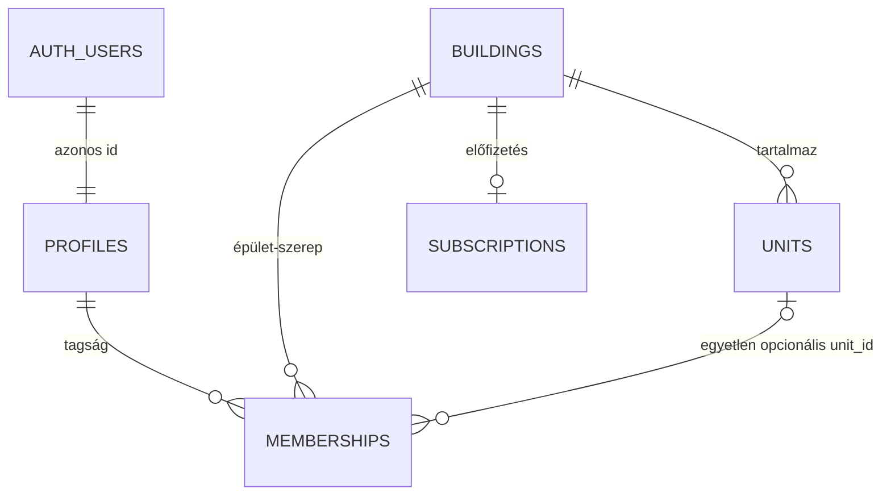

# 01 – Jelenlegi állapot és résanalízis

## Audit-határ

Ez a fejezet a 2026-08-27-i repository állapotot vizsgálja. CodeGraph-first feltárás, célzott forrásolvasás és a verziózott SQL alapján készült. Nem történt live Supabase-lekérdezés, ezért az itt szereplő adatbázis-megállapítások **repository-bizonyítékok**, nem production-state igazolások.

## Rövid minősítés

**BIZONYÍTOTT:** a PanelLakóban már van több épületet listázó picker, épületazonosítós route, aktív membership ellenőrzés és épületenkénti subscription.

**BIZONYÍTOTT:** ez még nem valódi, adatbázis által kikényszerített multitenancy. A tenant-izolációt a nyitott demo RLS, a kevert membership modell, a hiányos write-scope és az egységkapcsolatok integritási hiánya blokkolja.

**HOLD:** valódi személyes, pénzügyi vagy mérőadatokkal több független lakóközösséget nem szabad erre a policy-készletre ráengedni.

## Jelenlegi relációs modell

### Bizonyított jelenlegi elemek

| Terület | Jelenlegi megoldás | Bizonyíték | Értékelés |
|---|---|---|---|
| Auth identity | `auth.users` + azonos UUID-jú `profiles` | `supabase/schema.sql:7-13` | jó alap |
| Felhasználói szerep | globális `profiles.role` és épületszintű `memberships.role` párhuzamosan | `supabase/schema.sql:11`, `44-53` | két igazságforrás |
| Épület | UUID, név, szabad szöveges cím | `supabase/schema.sql:15-20` | nincs kanonikus cím/egyediség |
| Albetét | UUID + opcionális `building_id` + címke | `supabase/schema.sql:22-35` | `building_id` tévesen nullable |
| Tagság | profile + building + opcionális unit + role | `supabase/schema.sql:44-53` | négy fogalom összemosva |
| Több épület | `get_my_buildings()` és `/app` picker | `supabase/migrations/20260516_get_my_buildings_rpc.sql`, `app/app/page.tsx` | működő UX-alap |
| Épület route | `/w/[buildingId]`, session + membership ellenőrzés | `app/w/[buildingId]/page.tsx:49-87` | route-shell megvan |
| Jelszavas auth | `signInWithPassword()` | `app/login/page.tsx:34-50` | csak belépés |
| Regisztráció | nincs `signUp()`, `/register`, recovery vagy onboarding | repository-keresés | hiányzik |
| Címkeresés | strukturált OSM autocomplete, `external_id` | `app/api/location/autocomplete/route.ts:104-148`, `supabase/migrations/20260522002_osm_addresses.sql` | újrahasznosítható adatforrás |
| Subscription | épületenként egy subscription | `supabase/schema.sql:555-573` | workspace-re migrálható |

## Ami már valódi érték és megőrzendő

1. **UUID-alap:** a profiles, buildings, units és memberships már UUID-t használ; nem kell integer→UUID nagy migráció.
2. **Épületválasztó UX:** a felhasználó már egyetlen accounttal több épületet lát.
3. **Route-kontextus:** az URL már tartalmaz scope-azonosítót.
4. **Server-side user ellenőrzés:** az érintett oldalak `auth.getUser()`-t használnak.
5. **Membership RPC-alap:** a `get_my_buildings()` és `validate_building_membership()` jó kiindulópont, de a visszatérési szerződésük nem alkalmas több szerepre és több albetétre.
6. **Cím-adatbázis:** az OSM autocomplete strukturált mezőket és külső azonosítót ad; ezt címjelöltként újra lehet használni.
7. **Épületszintű subscription:** egyszerűen workspace-szintre terelhető.
8. **Dátumdetermináció:** az aktivitási naptár szerverről kapott magyar napkulccsal dolgozik; a kontrasztjavításnak ezt változatlanul kell hagynia.

## Kritikus modellhibák

### 1. A membership nem tud több albetétet modellezni

A `UNIQUE(profile_id, building_id, role)` miatt egy ember ugyanabban az épületben ugyanazzal a szereppel csak egy membership sort kaphat. Mivel az `unit_id` ezen a soron van, az alábbi valós eset nem fér el:

- Henrik három lakás tulajdonosa ugyanabban a házban;
- Henrik egy lakás tulajdonosa és egy másik lakás lakója;
- két vagy több személy ugyanannak a lakásnak társtulajdonosa;
- egy tulajdonos nem lakik ott, de több bérlő igen;
- egy személy több ház több albetétjéhez kapcsolódik.

A `versioning/240524_51_v0.9.29_profil-oldal-address-dedup.md` már felismerte ezt és külön `resident_unit_links` táblát javasolt. A mostani célmodell továbbviszi ezt az irányt, de a tulajdont és bentlakást is különválasztja.

### 2. Lehetséges cross-building unit kapcsolat

A `memberships.building_id` és `memberships.unit_id` két független idegen kulcs. Nincs olyan constraint, amely biztosítaná, hogy az albetét ugyanahhoz az épülethez tartozik, mint a membership.

Ugyanez a veszély megjelenik több kapcsolaton is, például ticket–unit, meter reading–unit, announcement–unit, attendance–unit és vote–unit esetén. Az alkalmazásoldali ellenőrzés nem elég: összetett tenant FK szükséges.

### 3. Tulajdonos csak szöveg

A `units.owner_name` denormalizált szöveg:

- nincs személyhez vagy szervezethez kapcsolva;
- nem kezel társtulajdonost;
- nem tárolja a magántulajdoni hányadot;
- nem időbeli;
- nem igazolt;
- nem alkalmas jogosultság levezetésére.

A jelenlegi `ownership_share` az albetét közös tulajdoni hányadának tűnik; ezt nem szabad összekeverni azzal, hogy az adott albetéten belül ki mekkora tulajdonrésszel bír.

### 4. Globális és workspace-szerep ütközik

A `profiles.role` globális, a `memberships.role` épületszintű. Egy személy azonban lehet:

- az A házban lakó;
- a B házban tulajdonos;
- a C és D házban közös képviselő;
- az E házban bizottsági tag.

Ezt globális role nem írhatja le. A profil role-ját ki kell vezetni a jogosultsági igazságforrásból.

### 5. Több szerep már ma is nondeterminisztikus

A constraint több különböző role sort enged ugyanarra a személy–épület párra. A kód több helyen az első sort választja:

- `app/w/[buildingId]/page.tsx` → `.limit(1)` és `memberships[0]`;
- `lib/data.ts` → resident unitra `.maybeSingle()`;
- több subpage → `memberships[0]`;
- `validate_building_membership()` → `LIMIT 1`.

A `get_my_buildings()` role szerint is csoportosít, így több role esetén ugyanaz az épület több kártyaként jelenhet meg. A cél RPC-nek workspace-enként egy sort és külön role/capability tömböt kell adnia.

## Nincs még valódi létrehozási/onboarding folyamat

Repository-szinten nincs olyan user-facing action vagy route, amely:

- épületet hoz létre;
- workspace-t hoz létre;
- albetétet hoz létre;
- lakót vagy tulajdonost meghív;
- meglévő lakó claimjét fogadja;
- képviselői mandátumot igazol;
- self-managed házat bootstrapel.

Az `/app` üres állapota jelenleg azt mondja, hogy a rendszergazda rendeli az épületet a fiókhoz. Ez admin-seedelt demóhoz elég, önkiszolgáló SaaS onboardinghoz nem.

## Auth-rés

Az `/login` két **belépési** módot kínál:

- magic link → `signInWithOtp()`;
- email+jelszó → `signInWithPassword()`.

Nincs:

- `signUp()`;
- email-megerősítés utáni idempotens profil-létrehozás;
- elfelejtett jelszó és recovery;
- jelszó beállítása auth invite után;
- membership invitation;
- join request;
- invitation/claim callback;
- üres, még workspace nélküli account onboardingja.

A jelszavas belépés megléte tehát nem egyenlő a jelszavas regisztrációval.

## Tenant-scope problémák a jelenlegi adatfolyamban

### Írások

A dashboard több műveleténél a kiválasztott `buildingId` nincs végigvezetve, vagy opcionális kliensadatként érkezik:

- ticket létrehozás és státuszváltás;
- mérőállás;
- dokumentumfeltöltés;
- pénzügyi és közgyűlési űrlapoknál a `global` fallback UUID-mezőbe kerülhet;
- több action csak azt ellenőrzi, hogy van-e user, azt nem, hogy az adott erőforráson van-e megfelelő capabilityje.

**Célállapot:** a kliens által küldött workspace/building/unit ID csak kérés. A szerver a userből és a cél erőforrásból újra levezeti az engedélyt, majd egy atomi command/RPC hajtja végre a műveletet.

### Olvasások

`lib/data.ts` jelenleg:

- több táblát building scope-pal olvas, de `work_orders` és `audit_logs` lekérdezése nem scoped;
- resident unit hiányában a ház első 12 albetétjére eshet vissza;
- üres Supabase-eredményt mock/demo rekordokkal helyettesít.

Egy új, valóban üres workspace így más ház demoadatát mutathatná. A mock fallback csak explicit demo/sandbox környezetben maradhat, hitelesített éles tenant route-on nem.

## RLS – jelenleg a legsúlyosabb blocker

A `supabase/schema.sql:259` maga is „Demo policies” megjegyzéssel jelöli a policy-ket. Ezután több tenant- és PII-tábla SELECT policy-ja `USING (true)`, több INSERT/UPDATE policy pedig `WITH CHECK (true)` vagy `USING (true)`.

Ez azt jelenti, hogy:

- a route membership ellenőrzése csak UI-/route-gate;
- közvetlen Supabase-kérés másik ház UUID-jával elérhet adatot;
- az UUID kiszámíthatatlansága nem védelem;
- egy új restriktív policy hozzáadása önmagában nem javít, mert a permisszív policy-k alapértelmezésben OR kapcsolatban állnak;
- a régi `true` policy-k explicit eltávolítása a cutover része kell legyen.

Külön Storage-probléma, hogy a dokumentumbucket jelenlegi policy-ja minden authenticated user számára széles műveleti jogot ad. A DB és Storage authorization szerződésnek azonosnak kell lennie.

## Jogosultsági dokumentációs drift

Három eltérő igazságforrás látszik:

1. `lib/types.ts` hat runtime role-ja;
2. `.governance/roles_permissions.md` eltérő, ékezetes kódjai és részben más jelentései;
3. `docs/ROLE_PERMISSION_MATRIX.md` UI-ból következtetett mátrixa.

Példák:

- a governance-dokumentum a `bizottság` szerepet közös képviselővel mossa össze;
- a runtime-ban külön `kozos_kepviselo` és `bizottsag` szerepel;
- a tulajdonos hol fizető/admin jellegű, hol resident-szerű;
- a könyvelő egyes route-okon admin-like, máshol csak pénzügyi olvasó;
- nincs delegálási lejárat, scope vagy capability-szűkítés.

A célrendszerben a role template csak emberileg érthető csomag; az engedélyezés capability + kapcsolat + scope alapján történik.

## Címállapot

`buildings.address` jelenleg szabad szöveg és nem egyedi. Hasznos alap viszont az `osm_addresses` és az autocomplete:

- irányítószám;
- település;
- kerület;
- utca és közterületjelleg;
- házszám;
- koordináta;
- külső OSM-azonosító.

Az OSM rekord azonban nem jogi címigazolás, és az OSM `external_id` nem KCR-azonosító. Címjelöltként és keresési forrásként használható, végleges identitásként csak forrás- és verifikációs állapottal.

## Aktivitási naptár – pontos hibakép

`components/dashboard/activity-calendar.tsx` jelenleg:

- 8 px-es heti sorcímkéket használ (`:244`);
- 9 px-es hétköznapfejléceket használ (`:255`);
- 6 px-es hónapjelölést használ (`:270`);
- 8 px-es legendát használ (`:290`);
- a 49 cellában egyáltalán nem rendereli a nap sorszámát;
- a jövőbeli cellára teljes `opacity` osztályt tesz, ami később a szöveget is halványítaná.

A színbridge több tokennél technikailag AA-közeli vagy AA feletti kontrasztot ad, de a 6–9 px betűméret és a hiányzó napszám miatt a tartalom ténylegesen nem olvasható. A részletes javítási és tesztterv a [08-as fejezetben](./08-activity-calendar-contrast-plan.md) található.

## Repository-szintű migrációs kockázatok

| Kockázat | Miért veszélyes? | Kötelező preflight |
|---|---|---|
| Live schema drift | A `schema.sql`, migrációk és runtime DDL nem biztos, hogy egyezik az élessel | teljes schema dump és diff |
| Nullable tenant kulcsok | új RLS-nél adatok eltűnnek, constraintek elbuknak | null-sor leltár és karantén |
| Cross-building linkek | composite FK validálás megbukhat | mismatch riport minden kapcsolatra |
| Címduplikáció | normalizálás után több rekord ugyanarra a címre eshet | fingerprint csoportosítás és review queue |
| Role-konfliktus | globális és building role más eredményt adhat | felhasználó–workspace role reconciliation |
| Több membership | `.single()` és első-sor logika hibázik | több aktív role audit |
| `owner_name` backfill | név alapján nem lehet biztonságosan accountot azonosítani | manuális/pending egyeztetés |
| Demo UUID-k | bemutató hozzáférés regressziója | külön demo fixture és canary |
| Subscription kötés | a fizető, kezelő és tenant nem feltétlen ugyanaz | billing ownership ADR |
| Security-definer recursion | RLS helper önmagát hívhatja vagy túl sokat engedhet | private helper review és negatív teszt |

## Meglévő dokumentumok státusza

Az alábbi fájlok hasznos történeti anyagok, de a jelen állapothoz részben elavultak:

- `docs/TECHNICAL_ARCHITECTURE.md` még query-paraméteres role routingot ír;
- `docs/DATA_FLOW_AND_ENTITY_REFERENCE.md` azt állítja, hogy nincs building scope, miközben több olvasás már scoped, mások továbbra sem;
- `docs/BUSINESS_SYSTEM_REFERENCE.md` single-building MVP és már nem aktuális picker-állapotot kever;
- `.governance/roles_permissions.md` nem egyezik a runtime role-unionnal.

Az implementáció megkezdésekor ezek vagy erre a csomagra mutató történeti jelölést, vagy célzott frissítést igényelnek; különben újra több jogosultsági igazságforrás keletkezik.

## Auditkonklúzió

A jelenlegi megoldást nem kell kidobni. Meg kell tartani a UUID-kat, pickert, route-kontextust, címkeresést és épületszintű adatmodellt, de a `memberships` táblát nem szabad tovább terhelni. A biztonságos következő lépés additív új domainmodell, adat-egyeztetés, központi authorization contract, majd fokozatos RLS-cutover.
