# 02 – Cél domainmodell és relációk

## Modellalkotási elv

Ez a fejezet logikai célmodellt ír le. A táblanevek és mezők implementációs szerződésként szolgálnak, de még nem végrehajtható SQL. A tényleges migráció előtt a live Supabase-verziót, a deployolt sémát és a jelenlegi adatok minőségét külön ellenőrizni kell.

A modell öt, egymástól független kérdésre ad külön választ:

1. **Ki jelentkezett be?** → auth account és profil.
2. **Ki a valós domain-szereplő?** → személy vagy szervezet.
3. **Melyik lakóközösség adataihoz van hozzáférése?** → workspace membership.
4. **Milyen adminisztratív felhatalmazása van?** → mandátum, role assignment, delegáció.
5. **Melyik albetéthez milyen jogviszony köti?** → tulajdon és bentlakás.

Ezek közül egyik sem helyettesíti a másikat.

## Fogalmi hierarchia

| Fogalom | Jelentés | Biztonsági szerep |
|---|---|---|
| Account | Supabase bejelentkezési identitás | session és `auth.uid()` |
| Profile | UI-név, locale, értesítési preferenciák | nem tárol tenant role-t |
| Party | természetes személy vagy szervezet | jogviszonyok alanya |
| Workspace | lakóközösség/társasházi közösség digitális tere | tenant- és RLS-határ |
| Physical building | címmel rendelkező fizikai épület/épülettömb | geo- és épületmaster-adat |
| Unit | albetét/lakás/helyiség | unit-scope és pénzügyi/mérő kapcsolat |
| Membership | account hozzáférése egy workspace-hez | belépési alap, önmagában nem adminjog |
| Membership period | ugyanazon membership hozzáférési epizódja | kilépés/visszatérés története |
| Mandate | képviselői vagy közösségi adminisztratív felhatalmazás | jogcím és érvényesség |
| Role assignment | rögzített capability-csomag hozzárendelése | operatív engedélycsomag |
| Delegation | részjogok továbbadása időkorláttal | szűkített helyettesítés |
| Ownership | party–unit tulajdonkapcsolat | tulajdonosi funkciók |
| Legal right | party–unit nem tulajdoni jogcím, pl. haszonélvezet | külön joghatás, nem tulajdoni hányad |
| Occupancy | személy–unit bentlakási/használati kapcsolat | lakói funkciók |
| Community creation request | még nem onboardingolt cím/közösség kérelme | provisional, nem ad tagságot vagy adminjogot |

## Kanonikus enum- és státuszregiszter

Az implementáció DDL-je és generált TypeScript-típusai ebből az egy regiszterből származzanak. A többi fejezetben használt magyar leírás vagy kisbetűs példa nem hoz létre új státuszt.

| Típus | Kanonikus értékek |
|---|---|
| `governance_mode` | `REPRESENTATIVE_MANAGED`, `BOARD_MANAGED`, `SELF_MANAGED` |
| `workspace_status` | `PENDING_VERIFICATION`, `ACTIVE`, `SUSPENDED`, `ARCHIVED`, `MERGED` |
| `person_account_link_status` | `PENDING`, `ACTIVE`, `ENDED` |
| `membership_status` | `PENDING`, `ACTIVE`, `SUSPENDED`, `ENDED` |
| `mandate_type` | `COMMON_REPRESENTATIVE`, `MANAGING_BOARD`, `SELF_MANAGED_COORDINATION` |
| `mandate_status` | `PENDING`, `ACTIVE`, `SUSPENDED`, `EXPIRED`, `REVOKED` |
| `role_assignment_status` | `PENDING`, `ACTIVE`, `SUSPENDED`, `EXPIRED`, `REVOKED` |
| `role_key` | `COMMON_REPRESENTATIVE_ADMIN`, `BOARD_ADMIN`, `SELF_MANAGED_ADMIN`, `DELEGATE_OPERATIONS`, `COMMITTEE_OVERSIGHT`, `ACCOUNTANT`, opcionálisan `BILLING_ADMIN` |
| ownership/occupancy/legal-right verification | `CLAIMED`, `PENDING_VERIFICATION`, `VERIFIED`, `DISPUTED`, `ENDED` |
| `invitation_status` | `PENDING`, `ACCEPTED`, `REVOKED`, `EXPIRED` |
| `join_request_status` | `DRAFT`, `PENDING`, `NEEDS_EVIDENCE`, `APPROVED`, `REJECTED`, `CANCELLED`, `EXPIRED` |
| `community_creation_request_status` | `DRAFT`, `PENDING_VERIFICATION`, `NEEDS_EVIDENCE`, `APPROVED`, `REJECTED`, `CANCELLED`, `EXPIRED` |

Az `ENDED` végállapot okát mindenhol külön reason mező részletezi; nem vezetünk be párhuzamos `LEFT` és `REVOKED` membership státuszt. A mandátum és role assignment viszont megtartja a `REVOKED` állapotot, mert ott a felhatalmazás visszavonása önálló auditjelentés.

## Cél ER-modell

```mermaid
erDiagram
    AUTH_USERS ||--|| PROFILES : "login identity"
    PROFILES ||--o{ PERSON_ACCOUNT_LINKS : "links to person over time"
    PARTIES ||--o| PEOPLE : "person subtype"
    PARTIES ||--o| ORGANIZATIONS : "organization subtype"
    PEOPLE ||--o{ PERSON_ACCOUNT_LINKS : "represented by account over time"

    WORKSPACES ||--o{ WORKSPACE_BUILDINGS : "contains"
    PHYSICAL_BUILDINGS ||--o{ WORKSPACE_BUILDINGS : "linked to"
    PHYSICAL_BUILDINGS ||--o{ BUILDING_ADDRESS_ASSIGNMENTS : "address history"
    ADDRESSES ||--o{ BUILDING_ADDRESS_ASSIGNMENTS : "canonical identity"
    WORKSPACES ||--o{ UNITS : "owns tenant data"
    PHYSICAL_BUILDINGS ||--o{ UNITS : "physically contains"

    PROFILES ||--o{ WORKSPACE_MEMBERSHIPS : "has access"
    WORKSPACES ||--o{ WORKSPACE_MEMBERSHIPS : "members"
    WORKSPACE_MEMBERSHIPS ||--o{ MEMBERSHIP_PERIODS : "access episodes"
    WORKSPACE_MEMBERSHIPS ||--o{ ROLE_ASSIGNMENTS : "gets role bundles"

    PARTIES ||--o{ MANAGEMENT_MANDATES : "acts as representative"
    WORKSPACES ||--o{ MANAGEMENT_MANDATES : "governed by"
    MANAGEMENT_MANDATES ||--o{ DELEGATIONS : "delegates"
    PROFILES ||--o{ DELEGATIONS : "receives"

    PARTIES ||--o{ UNIT_OWNERSHIPS : "owns"
    UNITS ||--o{ UNIT_OWNERSHIPS : "ownership history"
    PARTIES ||--o{ UNIT_LEGAL_RIGHTS : "holds other legal right"
    UNITS ||--o{ UNIT_LEGAL_RIGHTS : "legal right history"
    PEOPLE ||--o{ UNIT_OCCUPANCIES : "occupies"
    UNITS ||--o{ UNIT_OCCUPANCIES : "occupancy history"

    WORKSPACES ||--o{ MEMBERSHIP_INVITATIONS : "invites"
    UNITS o|--o{ MEMBERSHIP_INVITATIONS : "optional unit scope"
    WORKSPACES ||--o{ JOIN_REQUESTS : "receives"
    UNITS o|--o{ JOIN_REQUESTS : "requested unit"
    PROFILES ||--o{ COMMUNITY_CREATION_REQUESTS : "submits"
    ADDRESSES ||--o{ COMMUNITY_CREATION_REQUESTS : "claims provisionally"

    WORKSPACES ||--o{ AUTHORIZATION_AUDIT_EVENTS : "audit boundary"
```



## 1. Identitás és domain-személy

### `auth.users`

Supabase által kezelt login identity. Jelszóhash, email-megerősítés, session és provider identity itt marad. Alkalmazáskód nem ír közvetlenül jelszóhash-t.

### `profiles`

Egy account alkalmazásprofilja.

Ajánlott mezők:

| Mező | Jelentés |
|---|---|
| `id` | UUID, azonos `auth.users.id`-val |
| `display_name` | megjelenített név |
| `locale` | alapértelmezésben `hu-HU` |
| `time_zone` | alapértelmezésben `Europe/Budapest` |
| `phone` | saját profil érzékeny mezője |
| `status` | `ACTIVE`, `SUSPENDED`, `DELETED_PENDING` |
| `created_at`, `updated_at` | technikai időpontok |

Nem kerül bele:

- globális `role`;
- aktuális building/workspace;
- tulajdonosi státusz;
- lakói státusz;
- képviselői státusz.

### `parties`, `people`, `organizations`

A party olyan domain-szereplő, aki jogviszony alanya lehet akkor is, ha nincs PanelLakó-accountja.

`parties`:

- `id` UUID;
- `party_type`: `PERSON` vagy `ORGANIZATION`;
- `display_name`;
- `status`;
- auditmezők.

`people` személy-specifikus, az `organizations` szervezet-specifikus adatokat tárol. A személyes és cégadatokat minimális, célhoz kötött mezőkben kell tartani.

Miért szükséges account nélküli party?

- a közös képviselő felvihet olyan tulajdonost, aki még nem regisztrált;
- egy albetét tulajdonosa lehet cég;
- a kezelő szervezet több munkatársa ugyanazon szervezet nevében járhat el;
- meghívás előtt is lehet hitelesített offline nyilvántartási rekord;
- account törlése nem törölheti a történeti tulajdon- vagy mandátumkapcsolatot.

### `person_account_links`

Az account és a természetes személy összerendelése.

Ajánlott mezők:

- `id` UUID;
- `profile_id` és `person_id`;
- `status`: `PENDING`, `ACTIVE`, `ENDED`;
- `verification_method`, `verified_at`, `verified_by`;
- `valid_from`, `valid_to`, `end_reason`;
- `created_at`, `updated_at`.

Invariánsok:

- normál esetben egy account egy személyhez kapcsolódik;
- egy személyhez normál esetben legfeljebb egy aktív account kapcsolódik;
- részleges unique index védi az aktív `profile_id`-t és aktív `person_id`-t, a lezárt linktörténet megtartható;
- az összerendelés email-megerősítés után, idempotens folyamatban történik;
- az admin nem kapcsolhat idegen accountot személyhez puszta email-egyezés alapján;
- merge vagy recovery csak privilegizált, auditált workflow-val történhet.

#### Ugyanazon offline személy több workspace-ben

Két külön ház adminja ugyanarról az emberről létrehozhat két offline person rekordot. Ezt nem szabad globális, adminok számára kereshető email-/név-egyezéssel megelőzni, mert az más tenantban fennálló kapcsolatot szivárogtatna.

Javasolt privacy-safe feloldás:

1. az admin csak a saját workspace-éhez szükséges minimális person rekordot és meghívót hozza létre;
2. a bejelentkezett személy egyenként, tokennel vagy bizonyított claimmel átveszi a saját kapcsolatait;
3. csak a platform identity command látja, hogy több claimed person rekord tartozhat ugyanahhoz az accounthoz;
4. automatikus merge puszta név- vagy email-egyezés alapján tilos;
5. bizonyított egyezéskor `party_merge_case` készül, rögzített döntéssel és auditált reparent tranzakcióval;
6. a régi person/party UUID `party_alias` rekordként a kanonikus partyra mutat, ezért történeti hivatkozás nem vész el;
7. a másik workspace adminja nem kap jelzést arról, hogy az illetőnek máshol milyen kapcsolata van;
8. vitás vagy bizonytalan esetben a rekordok külön maradnak.

Ehhez javasolt `party_merge_cases` és `party_aliases` technikai tábla. Ezek kizárólag identity-operator/subject-scoped commandon át olvashatók és írhatók; nem részei a normál lakó- vagy képviselői directorynak.

## 2. Workspace – a tenant gyökere

### `workspaces`

Ajánlott mezők:

| Mező | Jelentés |
|---|---|
| `id` | UUID tenant-azonosító |
| `name` | közösség emberi neve |
| `legal_form` | pl. `CONDOMINIUM`, `UNDIVIDED_COMMON_OWNERSHIP`, később más |
| `governance_mode` | `REPRESENTATIVE_MANAGED`, `BOARD_MANAGED`, `SELF_MANAGED` |
| `governance_legal_basis` | jogalap/verifikáció, pl. Tht. 13. § (3) szerinti döntés vagy Ptk. közös tulajdon |
| `status` | `PENDING_VERIFICATION`, `ACTIVE`, `SUSPENDED`, `ARCHIVED`, `MERGED` |
| `created_by_profile_id` | kezdeményező, nem automatikus owner/admin |
| `canonical_workspace_id` | merge után a cél workspace |
| `created_at`, `updated_at`, `archived_at` | lifecycle |

Mit birtokol a workspace?

- közösségi dokumentumok;
- pénzügyi napló és közös költség;
- közgyűlések, határozatok és szavazás;
- kommunikáció;
- tagság és role assignment;
- audit;
- subscription/entitlement kapcsolat;
- tenant-szintű beállítások.

Mit **nem** jelent?

- nem a közös képviselő cége;
- nem egy felhasználói account;
- nem pusztán egy cím;
- nem törlődik képviselőváltáskor;
- nem válik más workspace-szel közös adatbiztonsági térré csak azért, mert ugyanaz a kezelő.

## 3. Fizikai épület és cím

### `physical_buildings`

Globális, minimális fizikai master-entitás:

- `id` UUID;
- `canonical_name`;
- `status`;
- opcionális koordináta/geometria;
- cím-verifikációs állapot;
- összevonási cél;
- nem tartalmaz lakó-, pénzügyi vagy dokumentumadatot.

Egy fizikai épület pontos kanonikus címe aktívan csak egyszer szerepelhet. A globális fizikai master és a tenantadat szétválasztása azért hasznos, mert a levegő-, közlekedési-, zaj-, műholdas és egyéb geocache-ek a helyhez, nem a kezelőhöz kötődnek.

### `workspace_buildings`

Workspace és fizikai épület kapcsolata.

MVP-ben javasolt üzleti constraint:

- egy aktív fizikai épület legfeljebb egy aktív workspace elsődleges épülete;
- egy workspace egy vagy több fizikai épülethez kapcsolódhat;
- konfliktus vagy ritka jogi kivétel platform-review queue-ba kerül, nem automatikus második workspace-be.

A kapcsolótábla lehetővé teszi a későbbi többépületes közösséget anélkül, hogy most teljes telek–épületszárny ontológiát kellene építeni.

### `addresses` és `building_address_assignments`

A részletes modellt az [05-ös fejezet](./05-address-identity-and-deduplication.md) tartalmazza. Fontos különbség:

- az address kanonikus helyazonosság;
- a building_address_assignment időbeli hozzárendelés;
- címváltozás nem hoz létre automatikusan új workspace-t vagy új épületet;
- OSM-azonosító és KCR-azonosító külön forrásmező.

## 4. Albetét

### `units`

Ajánlott mezők:

| Mező | Jelentés |
|---|---|
| `id` | globálisan egyedi UUID |
| `workspace_id` | kötelező tenant-kulcs |
| `physical_building_id` | kötelező fizikai épület |
| `designation` | emberi azonosító, pl. „2/5” |
| `normalized_designation` | épületen belüli egyediséghez |
| `unit_type` | lakás, garázs, tároló, üzlethelyiség stb. |
| `floor`, `door`, `staircase` | strukturált helyjelölés |
| `official_property_id` | opcionális, verifikált külső azonosító |
| `common_share_numerator`, `common_share_denominator` | közös tulajdoni hányad pontos formában |
| `area_m2` | terület |
| `status` | `ACTIVE`, `MERGED`, `SPLIT`, `ARCHIVED` |
| `created_at`, `updated_at` | audit |

Invariánsok:

- `workspace_id` és `physical_building_id` nem null;
- `(workspace_id, physical_building_id)` csak létező aktív workspace–building kapcsolat lehet;
- `(physical_building_id, normalized_designation)` aktívan egyedi;
- `id` nem kerülhet át másik buildingbe;
- split/merge új rekordokkal és történeti kapcsolattal történik, nem ID-újrahasznosítással;
- a `common_share_*` nem azonos egy ember adott lakáson belüli tulajdoni arányával.

## 5. Workspace-hozzáférés

### `workspace_memberships`

Egy account egy workspace-hez való alkalmazás-hozzáférése.

Ajánlott mezők:

- `id` UUID;
- `workspace_id`;
- `profile_id`;
- `status`: aktuális `PENDING`, `ACTIVE`, `SUSPENDED` vagy `ENDED`;
- `source`: invitation, join_request, migration, admin, bootstrap;
- `created_by_profile_id`;
- `primary_context_unit_id` csak UI-alapértelmezésként, **nem jogosultsági forrásként**.

Invariáns:

`UNIQUE(workspace_id, profile_id)` – egy accountnak egy **stabil membership-identitása** van egy workspace-ben. A kilépés és visszatérés nem írja felül a történetet, hanem új access periodot nyit ugyanazon membership alatt. A több szerep és több albetét külön táblákon él.

### `membership_periods`

A membership hozzáférési epizódjainak append-only története:

- `id`, `workspace_id`, `membership_id`;
- `started_at`, `ended_at`;
- `start_reason`, `end_reason`;
- `source_invitation_id` vagy `source_join_request_id` opcionálisan;
- `created_by` és audit referencia.

Részleges unique index biztosítja, hogy egy membershiphez legfeljebb egy nyitott period tartozzon. A membership aktuális `status` mezője tranzakcióban, ugyanazzal az audit eseménnyel követi a nyitott periodot; eltérés reconciliation hibát jelent. A felfüggesztés és újraaktiválás külön állapotesemény, nem a múlt felülírása.

Membership akkor is aktív maradhat, ha egy konkrét occupancy megszűnik, de ugyanott tulajdonosi vagy más albetétkapcsolata tovább él. Ha minden jogviszony megszűnt és nincs adminszerep, policy szerinti grace/lezárás következik.

## 6. Adminisztratív felhatalmazás

### `management_mandates`

A jogi vagy közösségi felhatalmazás ténye, külön a technikai account-jogtól.

Ajánlott típusok:

- `COMMON_REPRESENTATIVE`;
- `MANAGING_BOARD`;
- `SELF_MANAGED_COORDINATION`.

Ajánlott mezők:

- party vagy szervezet;
- workspace;
- mandátumtípus;
- `valid_from`, `valid_to`;
- `status`: `PENDING`, `ACTIVE`, `SUSPENDED`, `EXPIRED`, `REVOKED`;
- verification state és evidence reference;
- kinevező határozat/referencia;
- megszüntetés oka;
- auditmezők.

A mandátum **nem** account. Egy szervezeti mandátumból az organization membership és delegáció alapján kapnak egyes munkatársak technikai jogokat.

### `role_assignments`

Fix, verziózott capability-csomag hozzárendelése egy workspace membershiphez.

Ajánlott role template-ek:

- `COMMON_REPRESENTATIVE_ADMIN`;
- `BOARD_ADMIN`;
- `SELF_MANAGED_ADMIN`;
- `DELEGATE_OPERATIONS`;
- `COMMITTEE_OVERSIGHT`;
- `ACCOUNTANT`;
- `BILLING_ADMIN` külön, ha szükséges.

Mezők:

- `workspace_id`;
- `membership_id`;
- `role_key`;
- `source_mandate_id` vagy `source_delegation_id` a role eredete szerint;
- `valid_from`, `valid_to`;
- `status`;
- `granted_by`, `revoked_by`, `reason`.

Több role assignment megengedett. A permission union csak az aktív, érvényes assignmentekből számolódik, explicit deny/korlátozás esetén a szigorúbb szabály nyer.

`COMMON_REPRESENTATIVE_ADMIN`, `BOARD_ADMIN` és `SELF_MANAGED_ADMIN` esetén a megfelelő, ugyanazon workspace-hez tartozó `source_mandate_id` kötelező. `(workspace_id, source_mandate_id)` összetett FK, command-validáció és – ahol sima CHECK nem elegendő – constraint trigger védi a role/mandate típus- és scope-egyezést. Ezek effektív capabilityje kizárólag a role assignment és a forrásmandátum érvényességi intervallumának metszetében él; a mandate lejárata vagy felfüggesztése azonnal megszünteti az új adminműveletek jogát. `DELEGATE_OPERATIONS` esetén az aktív `(workspace_id, source_delegation_id)` kapcsolat kötelező, és annak scope-ja a felső korlát. Az authorization helper minden kéréskor joinolja az aktuális forrást, nem bízik egy korábban materializált role-stringben.

### `delegations`

Megbízotti/helyettesi jogosultság:

- delegáló mandátum vagy admin membership;
- kedvezményezett profile/membership;
- workspace;
- capability-lista vagy fix delegációs template;
- opcionális building-scope;
- `valid_from`, `valid_to`;
- státusz és visszavonás;
- `can_redelegate = false` alapérték.

Alapértelmezett tiltások delegáltnál:

- nem nevezhet ki közös képviselőt;
- nem változtathat governance módot;
- nem adhat tovább adminjogot;
- nem kezelhet billinget;
- nem indíthat workspace-összevonást;
- nem törölhet auditot;
- csak külön capabilityvel kezelhet lakói/tulajdonosi claimet.

## 7. Tulajdon és bentlakás

### `unit_ownerships`

Party és albetét időbeli N:M kapcsolata.

Ajánlott mezők:

- `id` UUID;
- `workspace_id`, `unit_id`, `party_id`;
- `ownership_type`: `SOLE_OWNER` vagy `CO_OWNER`; a tulajdoni hányad az elsődleges jogi adat;
- `share_numerator`, `share_denominator` az adott albetéten belüli részhez;
- `valid_from`, `valid_to`;
- `status`: `CLAIMED`, `PENDING_VERIFICATION`, `VERIFIED`, `DISPUTED`, `ENDED`;
- `verification_method`, `verified_at`, `verified_by`;
- `source` és minimális evidence reference;
- auditmezők.

Constraint-ek:

- ugyanazon party–unit–ownership_type párból legfeljebb egy nyitott aktív időszak;
- tört számláló és nevező pozitív, a rész legfeljebb 1;
- egy unit aktív tulajdoni részeinek összege ellenőrzési workflow-ban 1, de migrált/függő adatok miatt kezdetben lehet `INCOMPLETE` állapot;
- workspace-unit egyezést összetett FK biztosítja.

### `unit_legal_rights`

A haszonélvezet és más, nem tulajdoni dologi/használati jog **nem** kerül a tulajdoni hányadok közé.

Ajánlott mezők:

- `id`, `workspace_id`, `unit_id`, `party_id`;
- `right_type`: például `USUFRUCT`, `USE_RIGHT`, később jogi review alapján bővíthető;
- `valid_from`, `valid_to`;
- `status` és verification mezők;
- evidence reference és audit.

Ezek a rekordok nem számítanak bele az ownership share 1-es összegébe, és nem adnak automatikusan minden tulajdonosi capabilityt vagy szavazati súlyt. A dokumentum-, pénzügyi, használati és közgyűlési joghatást külön, magyar jogi review alapján kell capabilityre képezni.

### `unit_occupancies`

Természetes személy és albetét bentlakási/használati N:M kapcsolata.

Ajánlott típusok:

- `OWNER_OCCUPANT`;
- `TENANT`;
- `HOUSEHOLD_MEMBER`;
- `AUTHORIZED_OCCUPANT`.

Mezők:

- `workspace_id`, `unit_id`, `person_id`;
- occupancy type;
- `valid_from`, `valid_to`;
- `status` és verification;
- primary contact jelző;
- meghívás/join request referencia;
- auditmezők.

Ha valaki tulajdonos és ott is lakik, két külön kapcsolatot kap. Ez nem redundancia: más funkciót és más élettartamot képvisel.

## 8. Szervezetek és kezelői portfólió

### `organization_memberships`

Munkatárs kapcsolata kezelő szervezethez. Ez nem ad automatikusan hozzáférést a szervezet minden kezelt workspace-éhez.

### `management_mandates`

A kezelő szervezet és workspace közötti aktív mandátum teremti meg a kezelési kapcsolatot. A konkrét munkatárs csak akkor kap hozzáférést, ha:

1. aktív organization member;
2. a szervezetnek aktív mandátuma van az adott workspace-re;
3. a munkatársra aktív delegáció vagy workspace role assignment vonatkozik.

Így a „közös képviselő több házat kezel” N:M portfólió, nem közös tenant.

### MVP-határ

A szervezeti réteg implementálása későbbre halasztható, ha az első verzió csak személyes közös képviselőt kezel. A séma azonban a mandátumban party-t használjon, hogy később ne kelljen a relációt újratervezni.

## 9. Meghívás és csatlakozási kérelem

### `membership_invitations`

Részletesen a [04-es fejezetben](./04-registration-and-onboarding.md). Domain-szinten a meghívás tervezett, még nem aktív kapcsolatot képvisel.

### `join_requests`

Egy account kérése egy létező workspace és opcionális unit-kapcsolat iránt. Nem membership és nem tulajdonjog.

Javasolt kért kapcsolat:

- resident/occupant;
- owner/co-owner;
- representative claim egy már létező workspace-re.

A kliens nem állíthat `APPROVED` állapotot és nem választhat jóváhagyót.

### `community_creation_requests`

Új címhez vagy még nem onboardingolt közösséghez indított, **nem tagságot adó** request. Ez különül el a már létező workspace-re beadott `join_requests` folyamattól.

Ajánlott mezők:

- `id`, `claimant_profile_id`, opcionális `claimant_party_id`;
- canonical `address_id` és provisional `physical_building_id`;
- tervezett `legal_form`, unit count és `governance_mode`;
- `governance_legal_basis` és evidence reference;
- `status`: `DRAFT`, `PENDING_VERIFICATION`, `NEEDS_EVIDENCE`, `APPROVED`, `REJECTED`, `EXPIRED`, `CANCELLED`;
- `address_lease_expires_at`;
- reviewer, döntési indok és auditmezők;
- `approved_at`, `activation_expires_at`, opcionális `activated_workspace_id`, `activated_at` és activation idempotency key.

Egy aktív címlease címenként csak egy lehet, rövid lejárattal. A request – még `APPROVED` státuszban is – nem teszi a claimantet lakóvá, tulajdonossá vagy adminná. A claimant csak a saját requestjéhez tartozó draftot és státuszt kezelheti. A külön, idempotens managed/self-managed activation command újraellenőrzi a request érvényességét és a saját jogi/biztonsági kapuit, majd egy tranzakcióban hozza létre az aktív workspace-et, building linket, membershipet és membership periodot, a megfelelő mandátumot és role assignmentet; csak ezután tölti az `activated_*` mezőket.

## 10. Tenant-integritási minta

Minden tenant-erőforrás közvetlen `workspace_id`-t kap még akkor is, ha a unit/building láncból származtatható. Ez tudatos denormalizálás:

- egyszerűbb és gyorsabb RLS;
- minden sor önmagában scope-olható;
- könnyebb indexelés és partitioning;
- egyszerűbb audit és export.

A denormalizálás csak összetett FK-val biztonságos. Például logikailag:

```text
units: UNIQUE(workspace_id, id)
workspace_buildings: UNIQUE(workspace_id, physical_building_id)
meter_devices: FK(workspace_id, unit_id) -> units(workspace_id, id)
meter_readings: FK(workspace_id, unit_id) -> units(workspace_id, id)
unit_ownerships: FK(workspace_id, unit_id) -> units(workspace_id, id)
unit_legal_rights: FK(workspace_id, unit_id) -> units(workspace_id, id)
unit_occupancies: FK(workspace_id, unit_id) -> units(workspace_id, id)
```

Így másik workspace-ben létező UUID nem kapcsolható az aktuális workspace sorához.

## 11. Élettartam és törlés

| Entitás | Normál megszüntetés | Mi marad meg? |
|---|---|---|
| Account | deaktiválás/törlési kérés | történeti party/jogviszony pseudonymizált referenciával |
| Workspace membership | `ENDED` | role-, invite- és audit history |
| Role assignment | `valid_to`/`REVOKED` | grant/revoke esemény |
| Mandátum | `EXPIRED`/`REVOKED` | teljes képviseleti történet |
| Ownership | `valid_to`/`ENDED` | korábbi tulajdoni állapot |
| Legal right | `valid_to`/`ENDED` | korábbi haszonélvezeti/használati jog |
| Occupancy | `valid_to`/`ENDED` | korábbi lakói állapot retention szerint |
| Unit | `MERGED`/`SPLIT`/`ARCHIVED` | utód/előd kapcsolat |
| Building/address | history assignment | régi cím és merge alias |

Cascade delete csak technikai, még nem használt child rekordokra alkalmazható. Jogi, pénzügyi, képviseleti és audit-történet nem tűnhet el account- vagy membership-törléssel.

## 12. Példák, amelyeket a modellnek natívan kezelnie kell

### Ugyanaz a személy több szerepben

```text
Henrik account
└── Henrik person
    ├── Workspace A: membership + Unit A/1 occupancy
    ├── Workspace B: membership + Unit B/2 és B/3 ownership
    ├── Workspace C: membership + common representative role assignment
    └── Workspace D: membership + committee role assignment
```

### Társtulajdon és bérlők

```text
Unit X
├── ownership: Anna 1/2
├── ownership: Béla 1/2
├── occupancy: Csilla TENANT
└── occupancy: Dániel HOUSEHOLD_MEMBER
```

Mind a négy fél külön accounttal vagy account nélkül is szerepelhet. Anna és Béla tulajdonosi dokumentumot és saját pénzügyi információt láthat; Csilla és Dániel lakói műveleteket végezhet a policy szerint, de nem kap automatikus szavazati jogot.

### Képviselőváltás

```text
Workspace W
├── régi mandate: Kezelő A, valid_to = váltás napja
├── új mandate: Kezelő B, valid_from = váltás napja
└── minden unit-, document-, finance- és auditadat változatlan workspace-ben marad
```

## 13. Tudatosan elkerült túlbonyolítás

Az első production-hardened kiadásban nem szükséges:

- tetszőleges ügyfél által szerkeszthető policy-nyelv;
- általános graph authorization engine;
- több száz custom role;
- automatikus ingatlan-nyilvántartási integráció;
- minden címkivétel automatikus feloldása;
- teljes telek–épületszárny–lépcsőház ontológia.

Kötelező viszont a tiszta entitásszétválasztás, fix role template-ek, explicit capability-k, időbeli relációk, tenant FK-k és default-deny RLS. Ezek hiánya később sokkal drágább újratervezést okozna.

## Nyitott ADR-ek

1. Az első verzióban kell-e organization UI, vagy a party-séma mögött csak személyes képviselői flow indul?
2. Az `UNDIVIDED_COMMON_OWNERSHIP` jogi formát már MVP-ben engedjük-e, vagy csak `SELF_MANAGED` governance címkeként kezeljük?
3. A több fizikai épület/workspace kapcsolat legyen-e éles funkció az első körben, vagy csak sémaszintű előkészítés?
4. Milyen evidence metadata marad meg és meddig tulajdonosi/képviselői ellenőrzés után?
5. Ki jogosult unit designation javítására úgy, hogy a történeti hivatkozások ne törjenek?
