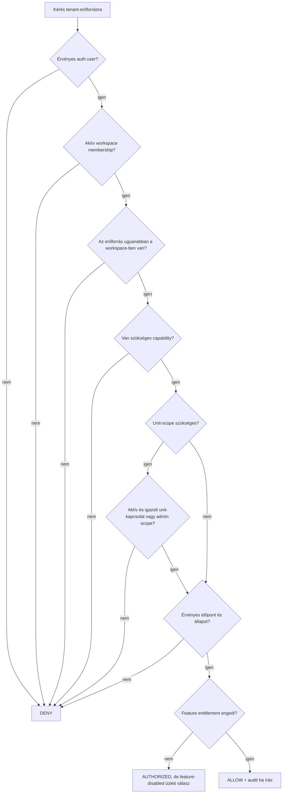

# 03 – Szerepkörök, képességek, RLS és Storage

## Cél

A PanelLakó jogosultsági modellje ne egyetlen `role` enumra épüljön. A szükséges modell hibrid:

- **RBAC:** emberileg érthető, fix role template-ek;
- **ReBAC:** workspace-, unit-, tulajdon-, bentlakás-, mandátum- és delegációs kapcsolatok;
- **ABAC:** státusz, időbeli érvényesség, dokumentumláthatóság, governance mód, erőforrásállapot;
- **RLS:** adatbázisszintű, fail-closed tenant- és objektumszűrés;
- **backend command check:** ugyanazon szabályok újraellenőrzése, üzleti tranzakció és audit.

Az UI-ban elrejtett gomb csak felhasználói élmény, nem biztonsági kontroll.

## Három külön hozzáférési sík

| Sík | Kiinduló bizonyíték | Engedhető adat/művelet | Nem engedhető |
|---|---|---|---|
| Minimalizált publikus lookup | anonim vagy hitelesített kérés + rate limit | kanonikus megjelenítési cím, épületazonosító, csatlakozási lehetőség | lakó, tulajdonos, unit-foglaltság, tartozás vagy bármely PII |
| Subject-scoped onboarding | `auth.uid()` és/vagy érvényes, hash-ellenőrzött egyszeri app-token | saját signup/recovery, saját invitation accept, saját join/claim submit/status, community creation request és request-draft | más kérelme, workspace-adat vagy önmagának jóváhagyott role/relationship |
| Tenant-erőforrás | aktív membership + capability/reláció + scope + érvényes állapot | a policy szerint engedett közösségi/unit erőforrás | minden más workspace és minden nem delegált művelet |

A membershipet létrehozó invitation/claim folyamat értelemszerűen nem követelhet előre aktív membershipet. Ezeket külön commandok védik a caller/token, cél-email, cél-workspace/unit, státusz és jóváhagyói authority együttes ellenőrzésével.

## Jogosultsági döntés



Fontos: a feature entitlement nem ad jogosultságot. Csak egy már jogosult művelet termékcsomag szerinti elérhetőségét szűkítheti.

Ez a flow nem a publikus lookup és nem a pre-membership onboarding döntési fája; azok a fenti, szűk síkokon futnak.

## Role template-ek és jogi/technikai jelentésük

| Role template | Ki kaphatja? | Mit jelent? | Mit nem jelent? |
|---|---|---|---|
| `COMMON_REPRESENTATIVE_ADMIN` | igazolt személy/szervezet aktív mandátummal | széles operatív házkezelés | nem birtokolja a tenantot |
| `BOARD_ADMIN` | intézőbizottsági felhatalmazott | közösségi adminisztráció | nem automatikusan minden bizottsági tag |
| `SELF_MANAGED_ADMIN` | igazolt önkezelt közösségi koordinátor | technikai adminisztráció | nem jogi „közös képviselő” cím |
| `DELEGATE_OPERATIONS` | képviselő/megbízó által kijelölt személy | szűkített operatív jogok | nem adhat tovább adminjogot |
| `COMMITTEE_OVERSIGHT` | számvizsgáló/bizottsági tag | ellenőrzési és audit read | nem módosít operatív adatot alapból |
| `ACCOUNTANT` | könyvelő | pénzügyi feldolgozás/riport | nem kezel tagságot vagy mandate-et |
| `BILLING_ADMIN` | explicit kijelölt fizetői admin | előfizetés és számlázás | nem jelent lakói vagy épületadmin jogot |

A `RESIDENT` és `OWNER` nem role template: unit-relationship. UI-címkeként megjelenhetnek, de az authorization forrása az aktív `unit_occupancies` és `unit_ownerships` rekord.

## Kockázati szint és step-up hitelesítés

Az authorization azt dönti el, hogy a személy elvileg jogosult-e. A magas kockázatú command ezen felül aktuális erős hitelesítést igényel.

`aal2` és rövid, product által rögzített reauthentication ablak kötelező legalább:

- közös képviselői mandátum aktiválásához/átadásához/visszavonásához;
- admin- vagy delegált capability kiadásához;
- ownership/occupancy claim jóváhagyásához nagy kockázatú adatkör esetén;
- tömeges lakói PII exporthoz;
- bankszámla-, billing- vagy kifizetési adat változtatásához;
- nagy hatású pénzügyi záráshoz és dokumentumtömeg publikálásához;
- break-glass művelethez, ha később egyáltalán bevezetjük.

A „friss `aal2`” két, egymástól külön ellenőrzött feltétel:

1. az aláírás, issuer, audience, lejárat és subject szerint validált JWT `aal` állítása pontosan `aal2`;
2. a JWT `amr[]` listájában a konfigurált, valóban második faktornak minősített módszerek közül a legújabb bejegyzés `timestamp` értéke a capabilityhez rendelt reauthentication ablakon belül van.

Az `aal2` önmagában a session hitelesítési erősségét, nem a második faktor használatának frissességét bizonyítja. Az `amr.method` elfogadási listáját a ténylegesen engedélyezett Supabase faktorokhoz és contract tesztekhez kell kötni; egy általános `otp` bejegyzés nem minősíthető automatikusan második faktornak. Hiányzó, ismeretlen vagy túl régi `amr` esetén a magas kockázatú command step-up választ ad.

A kliensoldali MFA képernyő nem kontroll. A command/API végzi az authoritative `aal` + `amr.timestamp` ellenőrzést. Az erre alkalmas adatbázisműveleteknél restrictive RLS/policy kiegészítően kikényszerítheti az `aal2` szintet és szükség szerint a frissességet, de service-key vagy más RLS-bypass út esetén is kötelező a caller JWT-jének vagy egy rövid életű, egyszer használható, userhez, sessionhöz és konkrét commandhoz kötött step-up ticketnek a szerveroldali validálása. A kliens által küldött időbélyeg nem hitelesítési forrás. Stale vagy `aal1` session step-up választ kap, nem csendes deny-t vagy automatikus logoutot.

## Capability-katalógus

### Workspace és épület

| Capability | Hatás |
|---|---|
| `workspace.read` | közös workspace-alapadat és közös dashboard |
| `workspace.settings.read` | beállítások megtekintése |
| `workspace.settings.manage` | nem biztonságkritikus beállítások kezelése |
| `workspace.governance.manage` | governance mód és mandátumfolyamat |
| `workspace.archive` | archiválási kérelem, külön jóváhagyással |
| `building.read` | fizikai épület alapadatai |
| `building.manage` | épületmaster adatok és címjavítási kérelem |
| `unit.directory.read_masked` | albetétlista PII nélkül |
| `unit.read_all` | minden albetét operatív adatainak olvasása |
| `unit.manage` | albetétek létrehozása/javítása/archiválása |

### Tagság, személyek és képviselet

| Capability | Hatás |
|---|---|
| `membership.invite` | alkalmazásszintű meghívás |
| `membership.approve` | lakói csatlakozási kérelem jóváhagyása |
| `membership.suspend` | hozzáférés felfüggesztése |
| `unit_relation.propose` | pending tulajdon/lakhatás felvétele |
| `unit_relation.verify` | kapcsolat bizonyítékának jóváhagyása |
| `unit_legal_right.verify` | haszonélvezeti/egyéb jogcím külön verifikációja, jogi policy alapján |
| `role.grant_limited` | nem admin role kiosztása |
| `role.grant_admin` | admin role kiosztása; különösen szűk |
| `delegation.manage` | megbízotti jogok adása/visszavonása |
| `mandate.manage` | képviselői/board mandate kezelése |
| `governance.transfer` | adminisztráció átadása, kétoldalú flow |
| `member.directory.read_minimal` | név + unit-kapcsolat minimális nézetben |
| `member.contact.read` | email/telefon olvasás, külön privacy-jog |

### Lakói és unit műveletek

| Capability | Scope |
|---|---|
| `ticket.create` | saját kapcsolt unit vagy common area |
| `ticket.read_own` | saját ticket/unit |
| `ticket.manage_all` | workspace összes ticketje |
| `meter.submit_own_unit` | aktív saját unit |
| `meter.read_own_unit` | aktív saját unit |
| `meter.manage_all` | workspace összes mérője/leolvasása |
| `document.common.read` | közös lakói dokumentum |
| `document.owner.read` | csak tulajdonosoknak |
| `document.unit.read` | saját unitra címzett |
| `document.publish` | dokumentum feltöltés és célzás |
| `announcement.read` | közös közlemény |
| `announcement.publish` | közlemény létrehozása |
| `environment.read` | környezet, közlekedés, szolgáltatások |

### Pénzügy és közgyűlés

| Capability | Scope |
|---|---|
| `finance.unit.read` | tulajdonolt vagy explicit engedett unit |
| `finance.workspace.read` | teljes workspace pénzügy |
| `finance.write` | könyvelési művelet |
| `finance.export` | export, különösen érzékeny |
| `meeting.read` | jogosult közösségi résztvevő |
| `meeting.manage` | közgyűlés és napirend kezelése |
| `vote.cast` | aktuális, igazolt szavazati jog és időablak |
| `vote.audit` | aggregált/ellenőrzési nézet |
| `audit.read` | workspace audit olvasása |
| `billing.manage` | subscription kezelése |

## Alapértelmezett hozzáférési mátrix

Jelölés: `S` = saját unit; `W` = teljes workspace; `R` = olvasás; `M` = kezelés; `—` = nincs alapjog. A delegált oszlop mindig a konkrét delegáció által szűkül.

| Funkció | Lakó/occupant | Tulajdonos | Közös képviselő | Self-managed admin | Megbízott | Bizottság | Könyvelő |
|---|---:|---:|---:|---:|---:|---:|---:|
| Workspace dashboard | R | R | W | W | delegált | R | R |
| Környezet/közlekedés/szolgáltatások | R | R | R | R | R | R | R |
| Saját unit adat | S | S | W | W | delegált | R-min | pénzügyi scope |
| Összes unit teljes adat | — | — | W | W | delegált | R-min | pénzügyi mezők |
| Hibajegy létrehozás | S/common | S/common | W | W | delegált | saját | saját |
| Hibajegy triage/státusz | — | — | M | M | delegált | R | — |
| Saját mérő diktálás | S | S | W | W | delegált | — | — |
| Összes mérő kezelése | — | — | M | M | delegált | R | R/M külön granttal |
| Közös dokumentum | R | R | R/M | R/M | delegált | R | R |
| Tulajdonosi dokumentum | — | R | R/M | R/M | delegált | R | R pénzügyi scope-ban |
| Saját unit pénzügy | opcionális | R | W | W | delegált | R felügyeleti policy szerint | W |
| Teljes pénzügy | — | — | R/M | R/M | delegált | R | R/M |
| Közgyűlés olvasás | policy szerint | R | M | M | delegált | R | R releváns részek |
| Szavazás | csak külön jogcímmel | tulajdoni jog alapján | nem önmagában | nem önmagában | — | saját tulajdonjog alapján | — |
| Lakó meghívás | — | saját unitra opcionális | M | M | delegált | — | — |
| Claim jóváhagyás | — | saját unitra opcionális | M | M | külön grant | kontroll/R | — |
| Role/mandate kezelés | — | — | korlátozott M | korlátozott M | — | — | — |
| Billing | — | külön kijelöléssel | külön capability | külön capability | — | — | külön kijelöléssel |
| Audit | saját esemény | saját + policy | W | W | delegált | R | pénzügyi audit |

A `unit_legal_rights` – például haszonélvezet – nem kerül automatikusan a Tulajdonos oszlopba. Saját kapcsolatának minimális olvasásán túl csak jogcímtípusonként, jogi review után rögzített capabilityt kaphat; nem számít tulajdoni hányadba, és nem ad automatikus szavazati, pénzügyi vagy owner-document jogot.

### Nyitott termékdöntések a mátrixhoz

- Lakó láthat-e saját unit közösköltség-egyenleget tulajdonosi engedéllyel?
- Igazolt tulajdonos jóváhagyhat-e occupancy claimet csak a saját unitjára?
- Bizottsági tag láthat-e személyszintű pénzügyi részleteket, vagy csak aggregált ellenőrzési nézetet?
- A könyvelő írhat-e unit relationshipet, vagy kizárólag pénzügyi adatot?
- Szavazati jog mindig a tulajdonból következik-e, vagy külön meghatalmazás is modellezendő?

Ezeket explicit policyként kell lezárni; a kód nem találgathat.

## Scope-szabályok

### Workspace-scope

A legtöbb közösségi erőforrás közvetlen `workspace_id`-t kap. A user csak akkor látja, ha aktív membershipje van és a szükséges capability megvan.

### Building-scope

Fizikai épülethez kötött adatoknál a `physical_building_id` is szükséges. A buildingnek aktív kapcsolatban kell állnia a workspace-szel.

### Unit-scope

Unit-adat akkor érhető el, ha:

- aktív ownership/occupancy van az adott unitra; vagy
- workspace-admin capability minden unitra kiterjed; vagy
- explicit, szűk delegáció az adott unitra vonatkozik.

Másik unit azonosítójának megadása nem emelheti a scope-ot.

### Személyes mező-scope

Azonos workspace-tagság nem jelenti automatikusan más lakók emailjének, telefonszámának, pénzügyének vagy tulajdoni hányadának láthatóságát.

Ajánlott projekciók:

- saját teljes profil;
- minimális lakókönyv: display name, unit designation, kapcsolat címkéje, ha az üzleti cél indokolja;
- admin contact view külön capabilityvel;
- pénzügyi contact view csak könyvelési célra;
- public building search nézet PII nélkül.

## RLS-architektúra

### Alapszabályok

1. Minden exposed tenanttáblán RLS aktív.
2. Policy hiányában default deny.
3. Külön policy készül `SELECT`, `INSERT`, `UPDATE`, `DELETE` műveletre.
4. Policy-k explicit `TO authenticated` célzást kapnak.
5. `INSERT` esetén `WITH CHECK`; `UPDATE` esetén `USING` és `WITH CHECK` is szükséges.
6. A jelenlegi permisszív policy-ket a cutoverrel egy release-egységben el kell távolítani.
7. A service/secret key csak trusted server környezetben élhet.
8. A policy `auth.uid()`-ból indul, soha nem kliens által küldött actor ID-ból.
9. Dinamikus membership/role/unit kapcsolat nem kerül biztonsági igazságként `user_metadata`-ba.
10. View csak `security_invoker` vagy külön review-olt, minimalizált RPC lehet a tényleges PostgreSQL-verzió figyelembevételével.

### Privát authorization helper-ek

Javasolt, nem exposed sémában:

- `is_active_workspace_member(workspace_id)`;
- `has_workspace_capability(workspace_id, capability)`;
- `has_unit_capability(workspace_id, unit_id, capability)`;
- `has_active_ownership(workspace_id, unit_id)`;
- `has_active_occupancy(workspace_id, unit_id)`;
- `is_platform_operator_with_active_grant()`.

Követelmények:

- caller az `auth.uid()`;
- fix/üres `search_path` és teljesen kvalifikált objektumnevek;
- minimális `EXECUTE` grant;
- nincs membership policyből önmagába visszamutató RLS-rekurzió;
- stabil és jól indexelhető predikátum;
- lejárt/suspended/ended kapcsolatok kizárása;
- unit/workspace composite egyezés;
- adversarial teszt legalább két-három workspace-szel.

### RLS-policy kategóriák

| Tábla | SELECT | INSERT/UPDATE/DELETE |
|---|---|---|
| `profiles` | saját teljes profil; mások csak minimalizált view/RPC | csak saját nem biztonsági mezők |
| `parties`/`people` | saját domainperson; mások csak célhoz kötött, maszkolt projection | create/link/merge/end kizárólag identity command |
| `person_account_links` | kizárólag saját aktív/pending link és privilegizált merge-case scope | link/merge/recovery command; közvetlen kliensírás tiltott |
| `party_aliases`/`party_merge_cases` | érintett subject minimális státusza; más tenant adminja nem látja | identity merge/resolve command, platform-scope audit és `aal2` |
| `organizations`/`organization_memberships` | saját aktív szervezeti kapcsolat vagy mandate-admin minimális projection | organization membership command; önmagának role-adás tiltott |
| `workspaces` | aktív membership; public keresés külön view | csak atomi bootstrap/admin command |
| `physical_buildings`/`addresses` | minimális public vagy authenticated lookup | privilegizált canonicalization command |
| `workspace_buildings`/`building_address_assignments` | publikus lookupban csak minimalizált projection; tenantban aktív membership | link/claim/merge command; direkt kliensírás tiltott |
| `workspace_memberships` | saját sor; admin minimális directory | közvetlen kliens INSERT/DELETE tiltott |
| `role_assignments` | saját effektív role; admin/audit scope | csak role-grant command |
| `management_mandates` | érintett party saját státusza; workspace governance/audit scope | verify/activate/transfer/end command, magas kockázatnál `aal2` |
| `delegations` | delegáló és kedvezményezett saját sora; governance/audit scope | grant/revoke command; delegáló authority aktuális metszete |
| `units` | saját unit vagy capability szerinti lista | `unit.manage` command |
| ownership/occupancy/legal rights | saját kapcsolat; admin/ellenőrző scope | claim/approve/end command, jogcímtípusonként |
| invitations | meghívó admin + címzett státusz | issue/accept/revoke command |
| join requests | kérelmező + jogosult approver | submit/review/cancel command |
| community creation requests | kérelmező saját státusza; platform/legal reviewer | submit/evidence/review/expire command; önmagát nem hagyhatja jóvá |
| documents | visibility + relationship + capability | publish/update/archive command |
| finance | saját ownership vagy pénzügyi capability | könyvelési command |
| audit | saját esemény vagy `audit.read` | kizárólag backend tranzakció |

A publikus lookup a fenti base táblákat nem teszi közvetlenül olvashatóvá: külön, oszlopminimalizált view/RPC generikus hibaüzenettel és rate limittel szolgálja ki. A table owner, service-role és `BYPASSRLS` utak külön privileged-surface auditot igényelnek; az RLS nem helyettesíti a grants és service-secret kezelését.

### Miért nem elég a route guard?

A böngésző Supabase Data API-n keresztül közvetlenül is kérhet adatot. A route ellenőrzés megkerülhető, és egy kliens által küldött UUID manipulálható. Az RLS az utolsó adatbázis-határ; a backend check pedig a felhasználóbarát hibát, üzleti tranzakciót és auditot adja.

## Command/RPC határ

Biztonságkritikus írások nem lehetnek tetszőleges `.insert()` hívások a kliensből. Atomi command/RPC szükséges például:

- workspace létrehozás;
- cím claim és building link;
- unit import/létrehozás;
- invitation kibocsátás/elfogadás/visszavonás;
- join request jóváhagyás;
- ownership/occupancy verifikáció és lezárás;
- role/delegation grant/revoke;
- mandate átadás;
- utolsó admin eltávolítás;
- workspace merge;
- dokumentum publikálás és Storage metadata létrehozás.

Minden command:

1. a callert sessionből állapítja meg;
2. zárolja a szükséges sorokat rögzített sorrendben;
3. újraellenőrzi az aktuális státuszt és capabilityt;
4. kikényszeríti a scope-ot;
5. idempotency keyt kezel, ahol újraküldés lehetséges;
6. ugyanabban a tranzakcióban ír auditot;
7. generikus hibát ad olyan konfliktusnál, amely más tenant adatának létezését szivárogtatná.

## Meghívás- és membership-hardening

- Közvetlen kliens membership INSERT/DELETE tilos.
- `workspace_id`, `profile_id` és a kapcsolat identity mezői létrehozás után immutábilisak.
- Meghívás elfogadása email-egyezést, lejáratot, token-használatlanságot és cél-scope-ot ellenőriz.
- Az invitation accept idempotens ugyanazon account/scope esetén.
- A megbízott alapból csak resident/owner invitationt kezdeményezhet, admin role-t nem.
- Utolsó aktív főadmin nem távolítható el elfogadott utód vagy platform-review nélkül.
- Saját szerep felminősítése tiltott.
- Bulk import ugyanazt a központi invitation commandot használja; nincs kerülő insert.

## Storage authorization

A dokumentumfájl útvonala javasoltan az alábbi, de ezt trusted server command képzi vagy szigorúan validálja; a kliens által beküldött path és metadata nem authorization-bizonyíték:

```text
workspace/{workspace_id}/documents/{document_id}/versions/{version_id}/{safe_filename}
```

A DB dokumentumsor tartalmazza:

- workspace;
- visibility: `COMMON`, `OWNERS`, `RESIDENTS`, `SPECIFIC_UNITS`, `ADMINS`, `FINANCE`;
- opcionális unit célzások külön kapcsolótáblán;
- current version;
- retention class;
- uploader és audit.

Storage policy:

- nem elég az objektum owner mezője;
- a path/metadata workspace- és document-ID-ját authoritative DB mappinghez kell kötni;
- membershipet, capabilityt és dokumentum audience/scope-ot az adatbázisból kell ellenőrizni;
- listázás, letöltés, feltöltés, update és delete külön policy;
- az útvonal workspace ID-ját össze kell vetni a DB dokumentumsorral;
- signed URL csak már autorizált dokumentumra készül;
- service key használat auditált szerverfolyamat;
- bucket-wide authenticated read/write/delete tilos.

## Audit

Az authorization audit nem kliens által szabadon írható napló. A védett command ugyanabban a tranzakcióban írja.

Minimum mezők:

| Mező | Tartalom |
|---|---|
| `workspace_id` | tenant |
| `actor_profile_id` | bejelentkezett account |
| `actor_party_id` | domain-személy/szervezet, ha van |
| `acting_via_mandate_id` | melyik mandátum alapján |
| `acting_via_delegation_id` | melyik delegálás alapján |
| `action` | canonical eseménykód |
| `target_type`, `target_id` | célrekord |
| `before`, `after` | minimalizált változáskép |
| `reason` | kötelező érzékeny műveletnél |
| `request_id`, `idempotency_key` | korreláció |
| `occurred_at` | szerveridő |

Az audit append-only. PII-retention és hozzáférés külön policy; az audit sem válhat minden lakó számára teljes személyesadat-listává.

## Előfizetés és authorization szétválasztása

A jelenlegi middleware subscription/trial ellenőrzése nem membership authorization. A célrendszerben:

- authorization válaszol: „jogosult-e erre az adatra/műveletre?”;
- entitlement válaszol: „az előfizetési csomag engedi-e ezt a feature-t?”;
- billing ownership válaszol: „ki fizet?”;
- egyik sem következik automatikusan a másikból.

Lejárt subscription esetén termékdöntés kell a grace/read-only/export szabályról, de az nem adhat más tenant adataihoz hozzáférést és nem törölheti a jogviszonyokat.

## Kötelező negatív tesztmátrix

Minden tenant-erőforrásra és műveletre:

- anonim;
- hitelesített, workspace nélküli account;
- másik workspace lakója;
- ugyanazon workspace másik unitjának lakója;
- saját unit lakója;
- saját unit tulajdonosa;
- aktív képviselő;
- lejárt képviselői mandátum;
- korlátozott megbízott;
- visszavont delegáció;
- bizottsági read-only szerep;
- könyvelő;
- suspended membership;
- archivált workspace;
- trusted service folyamat.

Műveletek:

- `SELECT`, `INSERT`, `UPDATE`, `DELETE`;
- közvetlen REST/PostgREST;
- RPC;
- Server Action/API;
- Storage list/get/upload/update/delete;
- másik workspace UUID-jának behelyettesítése;
- másik unit UUID-jának behelyettesítése;
- lejárt/elfogyasztott invitation token;
- role/status mass assignment;
- párhuzamos accept/approve/revoke.

## Security release gate

**PASS** csak akkor adható, ha:

- a permisszív legacy policy-k nem élnek;
- a policy inventory és GRANT inventory teljes;
- minden tenanttábla negatív tesztje futott valós PostgreSQL-en;
- a közvetlen Data API és Storage próbák is tiltást adnak;
- legalább két workspace és három account szerepel a tesztben;
- a last-admin, delegation-expiry és cross-unit invariáns bizonyított;
- a command audit ugyanabban a tranzakcióban keletkezik;
- az app oldali üres állapot nem mock adatra esik vissza.
