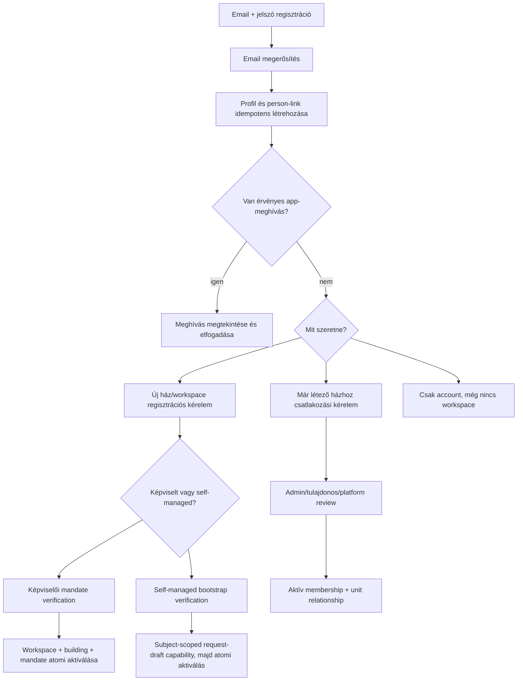
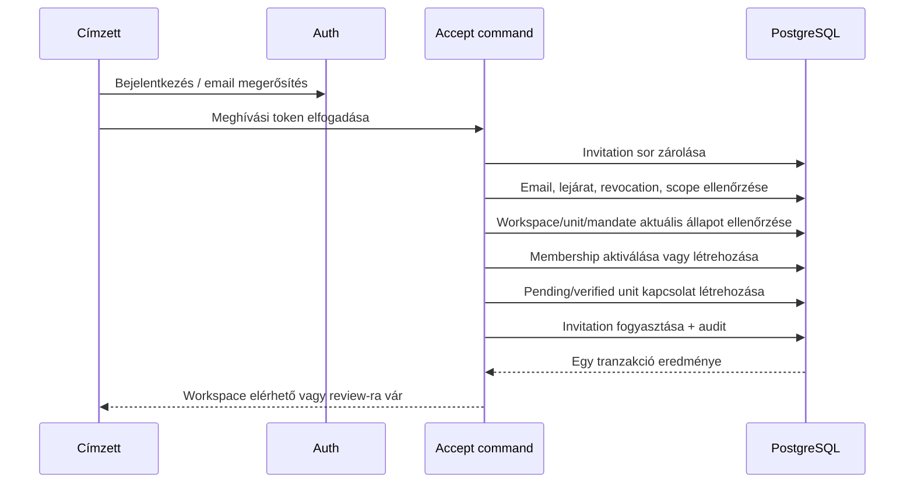
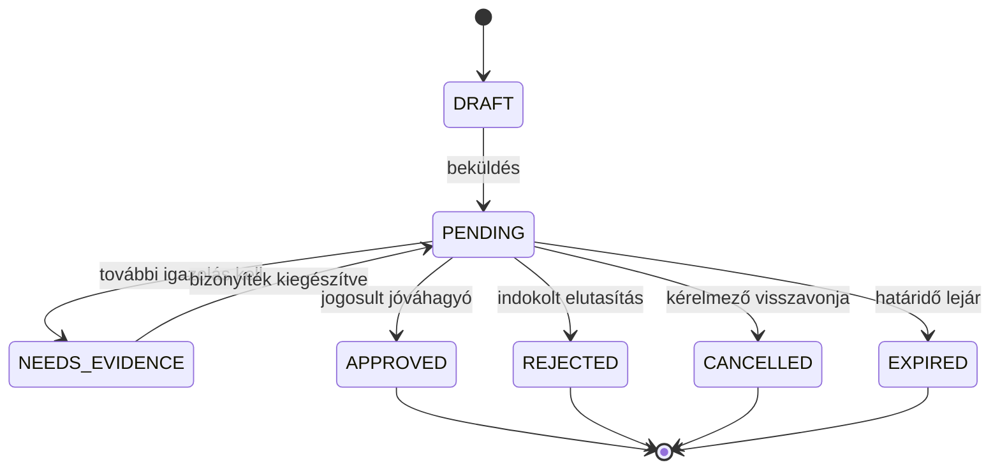

# 04 – Regisztráció, meghívás, csatlakozás és self-managed onboarding

## Alapelv: account létrehozás ≠ épülethozzáférés

Az account-regisztráció csak azt bizonyítja, hogy a felhasználó uralja az emailcímet és létrejött egy hitelesített login identity. Nem bizonyítja, hogy:

- az adott címen lakik;
- az albetét tulajdonosa;
- közös képviselő;
- egy kezelőcég munkatársa;
- jogosult más lakók adatainak kezelésére.

Minden ilyen jog külön, auditált domain-folyamat eredménye.

## Onboarding áttekintés



## 1. Email+jelszó regisztráció

### Javasolt képernyők

1. **Bejelentkezés**
   - email+jelszó;
   - magic link opcionális alternatíva;
   - elfelejtett jelszó.
2. **Regisztráció**
   - név;
   - email;
   - jelszó + megerősítés;
   - adatkezelési tájékoztató és szükséges checkboxok;
   - CAPTCHA/rate-limit állapot.
3. **Email megerősítésre vár**
   - generikus, email-enumerációt kerülő visszajelzés;
   - újraküldés rate limit mellett.
4. **Auth callback**
   - PKCE kódcsere;
   - idempotens profil/person bootstrap;
   - eredeti invitation vagy onboarding intent visszaállítása.
5. **Workspace nélküli kezdőoldal**
   - meghívások;
   - csatlakozási kérelem;
   - új közösség kezdeményezése.

### Auth-követelmények

- Supabase `signUp({ email, password })` és email-megerősítés;
- SSR/Next.js esetén PKCE callback;
- saját production SMTP;
- egységes provider-, szerver- és kliensoldali password policy;
- minimumként hosszú jelszó, kiszivárgott jelszó elleni védelem csomagfüggően;
- rate limit és CAPTCHA/Turnstile a visszaélési pontokon;
- jelszó reset generikus válasszal;
- redirect allowlist;
- auth hiba ne árulja el egyértelműen, hogy egy email másik workspace-ben létezik-e.

Lakói/owner account létrehozható `aal1` szinten, de adminisztratív mandátum, admin role vagy magas kockázatú delegáció aktiválása előtt MFA-enrollment és a 03-as fejezet szerinti friss `aal2` step-up (`aal2` + megfelelő `amr.method` + ablakon belüli `amr.timestamp`) szükséges. A recovery/faktorcsere külön auditált folyamat; elveszett MFA nem kerülhető meg egy ügyintéző által beállított ideiglenes jelszóval.

### Profil-bootstrap

A profil létrehozása legyen idempotens. A célállapot:

- `auth.users` létrejött;
- `profiles` létrejött;
- személy party és account-link létrejött vagy biztonságosan pending;
- még nincs automatikus workspace membership;
- nincs automatikus role assignment;
- nincs automatikus ownership/occupancy.

A jelenlegi `profiles.full_name`, `email`, `role` non-null modell miatt az auth bekapcsolása önmagában nem elég. Előbb ki kell vezetni a globális role-követelményt és definiálni kell a bootstrap tranzakciót.

## 2. Magic link szerepe

A magic link megmaradhat kényelmi bejelentkezésként. Nem kell választani magic link **vagy** jelszó között:

- új user email+jelszóval regisztrálhat;
- később jelszóval vagy magic linkkel is beléphet ugyanabba az identitybe;
- account linking és email-változtatás külön védett flow;
- magic link sem fogadhat el automatikusan building role-t a domain invitation ellenőrzése nélkül.

## 3. Alkalmazásmeghívás

### Két külön meghívási rendszer

1. **Supabase Auth invite**
   - auth account létrehozásának kényelmi mechanizmusa;
   - trusted server + secret key;
   - meglévő confirmed userre hibázhat;
   - rövid, provider által kezelt lejárat.
2. **PanelLakó membership invitation**
   - workspace/unit/relationship/role üzleti szándék;
   - új és meglévő userre egyaránt működik;
   - saját lejárat, visszavonás, audit és approval;
   - ez teremti meg a domain-hozzáférést elfogadáskor.

A kettőt nem szabad egy rekordnak vagy egyetlen linknek tekinteni.

### `membership_invitations` logikai mezői

| Mező | Funkció |
|---|---|
| `id` | UUID |
| `workspace_id` | cél tenant |
| `email_normalized` | címzett mailbox |
| `target_unit_id` | opcionális konkrét albetét |
| `requested_relationship_type` | occupancy/ownership/other |
| `requested_role_template` | csak jogosult adminmeghívásnál |
| `invited_party_id` | opcionális előzetes személyrekord |
| `token_hash` | nyers token soha nem tárolódik |
| `expires_at` | alkalmazásszintű lejárat |
| `accepted_at`, `accepted_by_profile_id` | fogyasztás |
| `revoked_at`, `revoked_by_profile_id` | visszavonás |
| `issued_by_profile_id` | actor |
| `issued_under_mandate_id` / `issued_under_delegation_id` | a kibocsátói authority eredete |
| `requires_approval` | elfogadás után kell-e review |
| `status` | `PENDING`, `ACCEPTED`, `REVOKED`, `EXPIRED` |
| `idempotency_key` | dupla issue/accept ellen |

### Kibocsátási szabályok

- email normalizálás és validáció;
- token kriptográfiailag erős, egyszer használható;
- újrameghívás tokenrotációval, régi link érvénytelenítésével;
- a kibocsátó capabilityje és scope-ja minden esetben ellenőrzött;
- az elfogadás current-authority szemantikát használ: a forrásmandátum/delegáció lejárata vagy visszavonása a még függő meghívót érvényteleníti;
- új jogosult admin ilyenkor új tokent ad ki; a régi token nem aktiválható újra;
- megbízott csak delegált invitation típust adhat;
- owner invitation külön verifikációt igényelhet;
- admin role meghívás külön, szigorúbb flow;
- a meghívás nem hoz létre aktív membershipet a címzett elfogadása előtt;
- bulk import ugyanazt a commandot használja.

### Elfogadás atomi folyamata



Kötelező concurrency-szabály:

- ugyanazt a tokent két párhuzamos kérésből csak az egyik fogyaszthatja el;
- idempotens retry ugyanannak a usernek ugyanazt az eredményt adja;
- más emaillel belépett account generikus elutasítást kap;
- elfogadás közben visszavont invitation nem aktiválhat hozzáférést.

## 4. Közös képviselő lakót visz fel

A „lakó regisztrálása” két külön műveletet jelenthet.

### A. Nyilvántartási személy felvétele account nélkül

A jogosult admin:

- létrehozhat minimális party/person rekordot;
- megadhatja az albetétet és a tervezett relationship típust;
- pending vagy offline-verified állapotot rögzíthet a policy szerint;
- meghívást küldhet az érintett emailjére.

Ez lehetővé teszi a teljes lakó-/tulajdonosi nyilvántartást akkor is, ha valaki nem akar vagy még nem tud belépni.

### B. Digitális hozzáférés biztosítása

Az admin nem:

- választ jelszót a lakónak;
- foglal le globális auth accountot a lakó nevében;
- jelöl más által uralt emailt megerősítettnek;
- ad korlátlan role-t egyetlen kliens insertből.

Helyette invitation készül. A mailbox birtokosa saját maga regisztrál vagy belép és elfogadja.

### Mi történik, ha az email már regisztrált?

- nem készül második auth user;
- az app invitation ugyanúgy létrejön;
- a címzett belép és elfogadja;
- az email létezését a kibocsátónak nem kell részletes auth státusszal felfedni;
- domain-szinten generikus „meghívás elküldve” válasz adható.

## 5. Lakó önbejelentése egy meglévő épülethez

### Követelmény

Lakó csak olyan workspace/building/unit felé adhat be kérelmet, amely már létezik a PanelLakóban. A kérelem soha nem hoz létre automatikusan új épületet vagy aktív jogot.

### Biztonságos keresési modell

A publikus vagy authenticated building lookup csak minimalizált adatot ad:

- közösség/épület megjelenített neve;
- kanonikus cím;
- esetleg „csatlakozás kérhető” státusz;
- soha nem ad lakónevet, emailt, tulajdonost, egyenleget vagy occupancy státuszt.

Unit kiválasztási opciók:

1. **Invitation code + unit scope** – legerősebb;
2. **Building join code + saját unit designation** – jó kompromisszum;
3. **Vak kérelem** – a user megadja saját ajtó/albetét jelét, az admin párosítja;
4. teljes unit-lista csak akkor, ha az adatvédelmi döntés ezt engedi, PII nélkül.

A rendszer ne jelezze vissza, hogy „ebben a lakásban már X Y lakik”. Ütközésnél generikus review üzenet kell.

### `join_requests` állapotgép



Javasolt mezők:

- kérelmező profile/person;
- workspace és target unit;
- requested relationship;
- felhasználó által adott, minimalizált indok;
- evidence metadata;
- státusz és version/lock mező;
- reviewer és döntési indok;
- created/reviewed/expires időpont;
- dedup/idempotency kulcs.

### Ki hagyhat jóvá?

| Kérelem | Elsődleges jóváhagyó | Alternatíva |
|---|---|---|
| Occupancy/lakó | aktív képviselő vagy erre delegált admin | igazolt tulajdonos kizárólag saját unitra, ha termékpolicy engedi |
| Ownership/tulajdonos | képviselő + evidence review | platform-review vitás/első esetben |
| Delegate | aktív mandate-tulajdonos/főadmin | nincs lakói önjóváhagyás |
| Common representative | meglévő governance transfer vagy platform-verification | közgyűlési/mandátum evidence |
| Self-managed admin | bootstrap-verification | több tulajdonosi megerősítés/platform review |

Jóváhagyás egy tranzakcióban:

- ellenőrzi a reviewer aktuális capabilityjét;
- újraellenőrzi workspace/unit kapcsolatot;
- létrehozza vagy aktiválja a neutral membershipet;
- létrehozza a megfelelő occupancy/ownership kapcsolatot;
- nem ad tulajdonosi adminjogot automatikusan;
- lezárja a requestet;
- auditot ír.

## 6. Közös képviselő új épületet/workspace-t regisztrál

### Előfeltételek

- hitelesített account;
- személy vagy szervezet party;
- cím kiválasztása strukturált forrásból;
- címütközés-vizsgálat;
- a Tht. 55/A–55/D szerinti tisztségviselői/ingatlan-nyilvántartási adat elérhetőségi vizsgálata és – ha jogszerűen hozzáférhető – elsődleges egyeztetése;
- a hatályos Tht. 64/A szerinti, **2026. október 31-ig** élő átmeneti időszakban nyilvántartási bejegyzés hiányában kizárólag hitelt érdemlő képviseleti bizonyíték + manuális review alkalmazható; az így aktivált bizonyíték lejárata nem nyúlhat a törvényi cutoff utánra;
- **2026. november 1-től** általános kinevezési okirat vagy közgyűlési határozat önmagában nem aktiválhat képviselői mandate-et/admin role-t: igazolt nyilvántartási bejegyzés kell, API hiányában hivatalos kivonat manuális ellenőrzésével; eltérés esetén csak dispute case nyílhat, aktív adminjog nem;
- a 03-as fejezet szerinti friss `aal2` step-up a mandate/admin role aktiválásakor;
- feltételek és adatkezelés elfogadása.

A cutoff fail-closed szerveroldali szabály, nem konfigurálható UI-szöveg. Legkésőbb 2026. szeptember 30-án kötelező jogi/source re-check dönt arról, hogy változott-e a határidő vagy a bizonyítás módja; ellenőrzött jogszabályváltozás nélkül a 2026. november 1-jei szigorítás automatikusan életbe lép a későbbi implementációban.

### Atomi create-flow

```mermaid
sequenceDiagram
    participant R as Képviselő
    participant Q as submit_managed_community_request
    participant V as Reviewer
    participant A as activate_managed_community
    participant DB as PostgreSQL
    R->>Q: canonical address + közösség + governance intent
    Q->>DB: címlease + creation request + evidence ref
    DB-->>R: subject-scoped request státusz; nincs tenantjog
    V->>DB: nyilvántartási/jogi bizonyíték review
    V->>DB: request APPROVED vagy NEEDS_EVIDENCE/REJECTED
    R->>A: approved request + friss MFA step-up
    A->>DB: request/cím zárolás + kapuk újbóli ellenőrzése
    A->>DB: ACTIVE workspace + building link
    A->>DB: ACTIVE membership + period + mandate + role
    A->>DB: billing/entitlement kapcsolat + audit
    DB-->>A: teljes siker vagy teljes rollback
```

A képviselői flow az ellenőrzés előtt is request-only: a `community_creation_request` és a lejáró címlease nem tenant, nem membership és nem mandate. A reviewer approval önmagában sem ad hozzáférést. Az `activate_managed_community` csak jóváhagyott, még érvényes request, aktuálisan újraellenőrzött nyilvántartási/jogi kapu és a claimanthez kötött friss MFA mellett futhat; ekkor minden aktív rekord egy tranzakcióban keletkezik. Nem maradhat félkész állapotban:

- aktív workspace effektív admin nélkül;
- building cím nélkül;
- building workspace nélkül;
- subscription árva buildingre;
- aktív common representative role aktív mandate nélkül.

### Albetétek felvétele

Módok:

- kézi egyenként;
- kontrollált CSV import;
- sablonból generálás, majd review.

Követelmények:

- unit designation normalizálás;
- épületen belüli egyediség;
- preview és konfliktuslista;
- ugyanaz az atomi command per batch/chunk;
- partial failure jelentés;
- actor és import run audit;
- import nem hozhat létre auth accountot;
- owner name csak pending party-ként vagy legacy labelként kerülhet be.

## 7. Közös képviselő nélküli, kis ház

### Jogi és termékmegkülönböztetés

`governance_mode = SELF_MANAGED` nem egyszerűen azt jelenti, hogy jelenleg nem ismerünk közös képviselőt. Aktiválásához rögzíteni és ellenőrizni kell:

- a `legal_form` értéket;
- a lakások/albetétek jogilag releváns számát;
- a `governance_legal_basis` értéket;
- a közösség döntését vagy más szükséges bizonyítékot.

A Tht. 13. § (3) szerinti szervezeti út legfeljebb hatlakásos társasháznál, a közösség döntésétől függően kezelhető; osztatlan közös tulajdon esetén külön Ptk.-jogalap szükséges. Hatnál több lakás, vitatott jogalap vagy pusztán hiányzó képviselői adat esetén a request assisted legal-review queue-ba kerül, nem aktiválódik automatikusan `SELF_MANAGED` módban.

Érvényes `SELF_MANAGED` esetén a rendszer nem hoz létre fiktív `COMMON_REPRESENTATIVE` mandate-et. A technikai admin címkéje:

- `SELF_MANAGED_ADMIN`; vagy
- felületen „Közösségi koordinátor”.

Ez nem jogi minősítés, hanem platformhozzáférés.

Ez a folyamat kivétel a „lakó csak meglévő épülethez csatlakozhat” szabály alól: itt a claimant nem lakói hozzáférést ad magának, hanem ellenőrzésre váró közösség-/épületfelvételi kérelmet indít. A normál resident claim továbbra is kizárólag aktív, már nyilvántartott épületre és unitra engedett.

### Bootstrap-folyamat

1. User account és email megerősítés.
2. Kanonikus címkeresés.
3. Ha a cím már létezik: join/bootstrap claim a meglévő rekordhoz; nincs duplikáció.
4. Ha nem létezik: community creation request `PENDING_VERIFICATION` állapotban, rövid lejáratú, megújítható címlease-szel.
5. Fizikai building candidate és minimális unit inventory **request-draftként** rögzül; ez még nem tenantadat és nem membership.
6. Alapító saját ownership/occupancy claimje.
7. Verification policy:
   - legal form, unit count és governance legal basis ellenőrzése;
   - Tht. 13. § (3) szerinti közösségi döntés vagy alkalmazandó Ptk.-jogalap;
   - dokumentumalapú review; és/vagy
   - legalább két független igazolt tulajdonosi megerősítés; és/vagy
   - platformmoderáció.
8. A claimant kizárólag saját requestjére szóló, subject-scoped draft capabilityt kap; role assignmentet és workspace-hozzáférést nem.
9. Feltételek, MFA-enrollment és a 03-as fejezet szerinti friss `aal2` step-up teljesülésekor egy activation tranzakció létrehozza az aktív workspace-et, building linket, aktív membershipet és első membership periodot, `SELF_MANAGED_COORDINATION` mandate-et és `SELF_MANAGED_ADMIN` role assignmentet.

A címlease lejár, ha a claimant határidőben nem ad bizonyítékot; az ilyen request nem blokkolhat későbbi igazolt onboardingot. Ismételt foglalási kísérlet rate limitet és abuse review-t kap.

### Verification előtti claimant capabilityk

Ellenőrzés előtt, kizárólag a saját community creation request scope-jában megengedhető:

- saját profil és claim kezelése;
- épület/unit struktúra request-draftolása;
- további tulajdonosi megerősítés meghívása;
- általános, nem személyes geo/környezeti feature-ek.

Tiltott:

- más lakók PII-jének olvasása;
- pénzügyi adatok kezelése;
- tulajdonosi jogok egyoldalú kiosztása;
- dokumentumok tömeges importja valódi címzettekre;
- workspace membership, role/delegation vagy mandate grant;
- workspace törlés/merge;
- közös képviselői cím használata.

### Későbbi képviselőválasztás

Ha a közösség később közös képviselőt választ:

- a workspace és minden adat marad;
- új `COMMON_REPRESENTATIVE` mandate indul;
- a self-managed admin role lezárható vagy szűkíthető;
- a változás kétoldalú elfogadású, auditált governance transition;
- az utolsó admin guard biztosítja, hogy ne legyen hozzáférés nélküli tenant.

## 8. Képviselőváltás és adminátadás

Ez külön, explicit workflow; nem egyszerű role update.

Lépések:

1. átadási kezdeményezés;
2. új személy/szervezet és mandate intent;
3. evidence és közösségi döntés referencia;
4. új fél elfogadása;
5. cutover időpont;
6. új mandate/role aktiválása;
7. régi mandate lezárása;
8. delegációk felülvizsgálata vagy automatikus lezárása;
9. billing-contact külön döntése;
10. átadási audit és export/checklist.

Invariáns: legalább egy aktív, igazolt főadmin marad, kivéve explicit platform-karantént.

## 9. Meghatalmazott és helyettes

A helyettes nem „második közös képviselő”. A delegáció:

- konkrét workspace-re szól;
- konkrét capability-ket ad;
- időben korlátozott;
- a mandátum megszűnésével alapból megszűnik;
- nem delegálható tovább alapból;
- bármikor visszavonható;
- minden érzékeny művelet auditjában látszik, hogy a user melyik delegáció alapján járt el.

Javasolt delegációs sablonok:

- operatív ticketkezelő;
- lakói adminisztrátor;
- dokumentumkezelő;
- pénzügyi asszisztens;
- teljes operatív megbízott – governance és billing nélkül.

## 10. Visszaélés- és privacy-védelem

- building search rate limit és CAPTCHA szükség szerint;
- címkeresés nem ad occupancy vagy membership találati részleteket;
- generic conflict üzenet rejtett tenant létezésénél;
- join request spam limit user/cím/unit szerint;
- evidence fájl külön titkos bucketben, rövid retentionnel;
- reviewer csak szükséges evidence-et lát;
- elfogadás előtt account email egyezés;
- invite token hash-elve;
- reset/invite response nem segít account enumerationben;
- self-managed bootstrap nem ad azonnali széles adminjogot;
- minden role/relationship mass-assignment mező szerveroldalon felülírt vagy elutasított;
- support hozzáférés külön break-glass, időkorlátos és indokolt.

## 11. UX-állapotok

Az onboarding mindenhol mutassa, hogy a user **hol tart**, és ne mossa össze a státuszokat:

| Állapot | UI-szöveg lényege |
|---|---|
| Account unconfirmed | „Erősítsd meg az emailcímedet.” |
| Account confirmed, no workspace | „Még nincs aktív lakóközösségi hozzáférésed.” |
| Invitation pending | „Meghívást kaptál – ellenőrizd a címet és albetétet.” |
| Join request pending | „A csatlakozási kérelmed jóváhagyásra vár.” |
| Needs evidence | „További igazolás szükséges.” |
| Approved | „A hozzáférésed aktív.” |
| Rejected | indok + újrakérelem/fellebbezési út |
| Suspended | generikus hozzáférési státusz + support út |
| Mandate expiring | időben előre jelzett átadás/megújítás |

## 12. Elfogadási forgatókönyvek

1. Új email+jelszavas account workspace nélkül biztonságosan beléphet onboardingra, de egy tenantadatot sem lát.
2. Meglévő account invitationt fogad el anélkül, hogy második auth user keletkezne.
3. Új account a regisztráció után visszatalál az eredeti invitationhöz.
4. Lejárt, visszavont vagy más emailhez tartozó token nem aktivál hozzáférést.
5. Képviselő account nélkül nyilvántartási személyt vihet fel, de nem állíthat neki jelszót.
6. Lakó csak meglévő épülethez/unitra kérhet csatlakozást.
7. Lakó nem látja, ki lakik a kiválasztott unitban.
8. Claim jóváhagyása membershipet és relationshipet egy tranzakcióban aktivál.
9. Két párhuzamos jóváhagyás nem készít dupla aktív kapcsolatot.
10. Self-managed claimant ellenőrzés előtt csak a saját requestjére szóló subject-scoped draft capabilityt kap; nincs workspace membershipje, mandate-je vagy role-ja.
11. Képviselőváltás nem módosítja a lakók/tulajdonosok relációit.
12. Delegáció lejárata után ugyanaz a session nem végezhet új privilegizált műveletet pusztán régi JWT claim alapján.
13. `aal2` session túl régi kvalifikáló `amr.timestamp` mellett step-upot kér, friss és engedélyezett második faktorral enged.
14. Ismeretlen vagy első faktort jelölő `amr.method` nem fogadható el friss MFA-ként.
15. A 2026. október 31-i átmeneti időpontban a hitelt érdemlő dokumentumos képviselői út csak manuális review-val és legfeljebb cutoffig érvényes bizonyítékkal aktiválható.
16. 2026. november 1-jén ugyanaz az általános kinevezési dokumentum nyilvántartási bejegyzés igazolása nélkül fail-closed; legfeljebb dispute case keletkezhet, aktív mandate/role nem.
17. `APPROVED` managed community request önmagában sem hoz létre workspace-et, membershipet vagy adminjogot.
18. Két párhuzamos `activate_managed_community` hívás ugyanarra a requestre egy aktív workspace-et és egy aktív elsődleges adminláncot eredményez; a másik idempotens eredményt vagy konfliktust kap, duplikáció nélkül.
