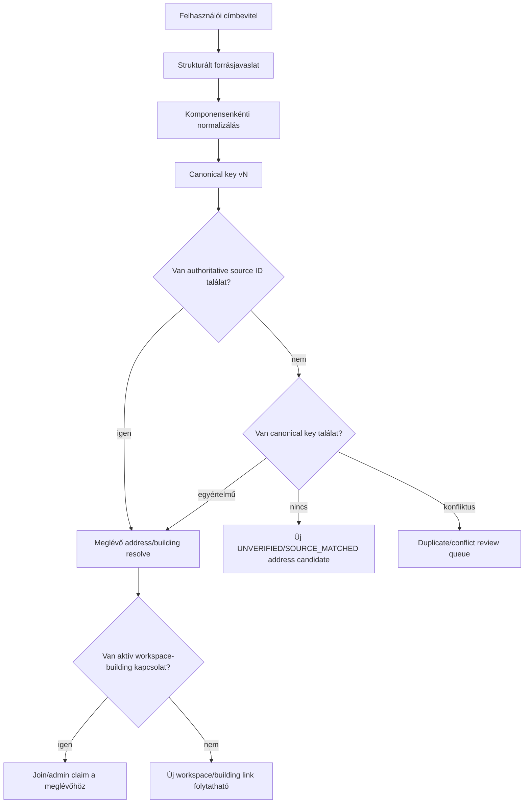

# 05 – Címidentitás, egyszeriség és duplikációkezelés

## Üzleti követelmény

„Egy lakótömb pontos címmel csak egyszer szerepelhet a rendszerben.”

Ezt nem a `buildings.address TEXT UNIQUE` oldja meg. A cél egy kanonikus, strukturált címidentitás és egy tranzakciós claim/merge folyamat.

## Miért nem elég a szöveg?

Az alábbiak ugyanazt a helyet jelenthetik:

```text
1135 Budapest, Gidófalvy Lajos utca 9.
Budapest XIII., Gidófalvy Lajos u. 9
HU, 1135 Budapest, Gidófalvy Lajos utca 9
1135 BUDAPEST GIDÓFALVY LAJOS UTCA 9
```

Ugyanakkor a túl agresszív normalizálás tévesen összevonhat különböző címeket. Ékezetek eldobása, kötőjelek törlése vagy házszámtartomány egyszerűsítése nem lehet végleges identitási szabály emberi review nélkül.

## Hivatalos modellből következő döntés

A hatályos [322/2024. (XI. 6.) Korm. rendelet stabil NJT/ELI nézete](https://njt.jog.gov.hu/eli/R/2024/Korm/322) 126. §-a strukturált címelemként kezeli többek között az épület, lépcsőház, szint és önálló rendeltetési egység ajtajának/bejáratának jelét; a 128. § (2)–(3) szerint a KCR-bejegyzés egyedi azonosító kódot kap, a módosított vagy törölt adat pedig visszakereshető történeti állományban marad. A korábbi 345/2014. Korm. rendeletet 2024. november 7-től hatályon kívül helyezték, ezért az nem használható aktuális jogforrásként. Architekturális következmények:

- a cím külön entitás;
- a fizikai épület külön entitás;
- az albetét külön entitás;
- címváltozás történeti assignment, nem új login tenant;
- egy authoritative külső cím-ID értékesebb, mint a formázott szöveg;
- a külső azonosító forrását és verifikációját is tárolni kell.

Az implementáció előtt jogi/adatforrás-hozzáférési ellenőrzés szükséges; a fenti struktúra nem jelenti azt, hogy a PanelLakó automatikusan hozzáfér a KCR-hez, a repository OSM adatbázisa pedig nem azonos a KCR-rel.

## Címrétegek

| Szint | Példa | Mire használjuk? |
|---|---|---|
| Telek/site | helyrajzi vagy fizikai terület | későbbi komplex ingatlanmodell |
| Building | 1135 Budapest, Gidófalvy Lajos utca 9. | fizikai building identity |
| Entrance/staircase | A lépcsőház | buildingen belüli navigáció, ha releváns |
| Unit | II. emelet 5. | albetét címkézés/címzés |
| Postal/contact | levelezési cím | nem feltétlen fizikai identity |

A building canonical key nem tartalmazza az albetét ajtó/floor mezőit. Az albetét egyedisége building + unit designation alapján él.

## `addresses` célmezők

| Mező | Jelentés |
|---|---|
| `id` | UUID |
| `country_code` | `HU` |
| `postal_code` | irányítószám |
| `settlement` | település |
| `district` | kerület, ha van |
| `settlement_part` | településrész, ha van |
| `street_name` | közterület neve |
| `street_type` | utca, út, tér stb. canonical formában |
| `house_number_from`, `house_number_to` | szám vagy tartomány |
| `house_number_suffix` | pl. A |
| `building_mark` | külön épületjel, ha a cím része |
| `address_level` | BUILDING, ENTRANCE, UNIT, POSTAL |
| `formatted_address` | emberi megjelenítés |
| `canonical_key` | normalizált technikai fingerprint |
| `canonicalization_version` | algoritmus verziója |
| `source_system` | KCR, OSM, manual, import |
| `source_record_id` | forrásazonosító |
| `verification_status` | UNVERIFIED, SOURCE_MATCHED, VERIFIED, DISPUTED |
| `lat`, `lon` | koordináta, pontossággal |
| `valid_from`, `valid_to` | cím élettartama |
| `superseded_by_address_id` | címváltozás/összevonás |
| `created_at`, `updated_at` | audit |

## Források és prioritás

Javasolt forrásprioritás:

1. jogszerűen elérhető hivatalos cím-/ingatlan-azonosító;
2. ellenőrzött admin- vagy dokumentumalapú cím;
3. repository-ban már létező OSM címjelölt;
4. Nominatim fallback;
5. manuális cím, `UNVERIFIED` státuszban.

A források nem írják felül automatikusan egymást. Egy address recordhoz source assertion history tartozhat:

- melyik forrás mit állított;
- mikor;
- milyen confidence/verification mellett;
- melyik lett canonical.

## Meglévő PanelLakó-alap

Az `osm_addresses` már tartalmaz több strukturált mezőt és egyedi `external_id`-t, az autocomplete pedig normalizált címjavaslatot, koordinátát, confidence-et és forrást ad.

Újrahasznosítható:

- keresés és felhasználói címkiválasztás;
- postcode/settlement/street/house number előtöltés;
- koordináta;
- OSM source reference.

Nem használható közvetlenül:

- jogi tulajdon vagy képviselet igazolására;
- egyetlen, megkérdőjelezhetetlen cím-SSOT-ként;
- OSM `external_id` KCR-ID-ként;
- szöveges normalizálás kizárólagos duplikáció-döntőjeként.

## Canonicalization pipeline



### Normalizálási szabályok

- Unicode normalizálás és whitespace rendezés;
- kontrollált kis-/nagybetű-kezelés;
- közterületjelleg canonical szótár (`u.` → `utca`) kereséshez;
- kerület canonical numerikus formája, megjelenítésben római is lehet;
- házszám és suffix külön mező;
- házszámtartomány megőrzése;
- pontok és vesszők csak formázási szinten;
- ékezetes canonical érték megőrzése;
- aliasok külön keresési mezőben;
- algoritmusverzió tárolása.

A canonicalization változásakor nem szabad csendben minden kulcsot átírni. Új verzió, dry-run collision riport, review és kontrollált migráció kell.

## Egyediség

### Authoritative ID

Ha van ellenőrzött hivatalos külső azonosító:

- `(source_system, source_record_id)` egyedi az aktív, verified rekordokra;
- ugyanaz a forrás-ID nem rendelhető két building address identityhez.

### Fallback canonical key

- `canonical_key` + `address_level` aktívan egyedi;
- manuális/gyenge confidence találat ütközésnél nem auto-merge, hanem review;
- a DB constraint az utolsó versenyhelyzet-védelem;
- a kliensoldali „már létezik” check csak UX.

### Building assignment

A `building_address_assignments` javasolt mezői:

- `physical_building_id`;
- `address_id`;
- `role`: PRIMARY, ENTRANCE, POSTAL, HISTORICAL;
- `valid_from`, `valid_to`;
- `is_verified`;
- source/audit.

Invariánsok:

- egy fizikai buildingnek egyszerre pontosan egy aktív primary címe van;
- egy building-level canonical address egyszerre legfeljebb egy aktív fizikai building primary címe;
- postal alias vagy entrance külön assignment lehet;
- régi cím historyként megmarad.

## Tranzakciós create – versenyhelyzet nélkül

Hibás minta:

```text
SELECT, hogy létezik-e
majd külön INSERT
```

Két párhuzamos kérés mindkettő „nem létezik” választ kaphat.

Helyes tervezés:

1. canonical address resolve;
2. unique keyre támaszkodó insert/upsert egyetlen commandban;
3. releváns address/building sor zárolása;
4. workspace-building aktív kapcsolat ellenőrzése;
5. ütközéskor meglévő rekordra claim/join ág;
6. generikus konfliktusválasz, amely nem szivárogtat tenant-PII-t;
7. audit és idempotency key.

Elfogadási teszt: két párhuzamos, azonos című workspace-create kérésből legfeljebb egy aktív fizikai building és egy normál create eredmény jöhet létre.

## Ha a cím már létezik

### Lakó

- csak join requestet indíthat a meglévő workspace/building felé;
- nem láthat lakólistát vagy unit occupancy státuszt;
- nem készíthet második épületet eltérő írásmóddal.

### Új közös képviselő

- admin/mandate claimet indít;
- a rendszer jelzi, hogy a cím már nyilvántartott, de nem ad ki privát adatot;
- meglévő adminnak átadási request, vagy platform-review;
- új workspace csak legitim, review-olt kivételben.

### Self-managed alapító

- bootstrap claim a meglévő címre;
- ellenőrzésig kizárólag a saját community creation requestjére szóló subject-scoped request-draft capability; nincs workspace membership, mandate vagy role;
- nem veheti át automatikusan a tenantot.

## Valós kivételek

Az „egy pontos cím egyszer” szabály mellett is lehetnek bizonytalan esetek:

- saroképület két hivatalos címmel;
- egy helyrajzi egységen több épület;
- egy postal address alatt több fizikailag külön épületjel;
- egy épületben több, jogilag eltérő közösség;
- címváltozás/utcanév-változás;
- házszámösszevonás vagy -megosztás;
- lépcsőház a hivatalos cím része vagy csak belső jelölés;
- OSM és hivatalos forrás eltérése;
- cím még nincs a forrásban.

Ezek miatt kell:

- `DISPUTED`/`NEEDS_REVIEW` állapot;
- alias és history;
- emberi merge/split döntés;
- bizonyíték és indok;
- tenantadatot nem törlő összevonás.

## Duplikációfeloldás

### Detect

Riportcsoportok:

- azonos verified source ID;
- azonos canonical key;
- nagyon közeli koordináta + hasonló cím;
- azonos postcode/street/house, eltérő formázás;
- aktív workspace-ek ugyanazon fizikai címgyanún.

### Review

A reviewer látja:

- strukturált címmezők;
- források és confidence;
- koordináták;
- building/workspace státuszok minimális adminnézetben;
- kapcsolódó adatdarabszámok;
- merge kockázat.

### Merge

Merge nem hard delete:

1. canonical physical building kiválasztása;
2. loser `MERGED` állapot és `canonical_building_id`;
3. address alias/history megőrzése;
4. tenant linkek és geocache-ek kontrollált átirányítása;
5. unit és tenantadat csak külön validáció után mozgatható;
6. régi route/ID redirect vagy compatibility lookup;
7. teljes audit;
8. export/rollback manifest.

Két aktív, valódi tenantadatot automatikusan soha nem szabad puszta címhasonlóság alapján összevonni.

## Privacy a címkeresésben

A building/address search válasza minimalizált:

```text
display_name
formatted_address
join_available
public_building_id vagy opaque claim target
```

Nem tartalmaz:

- tagságok számát, ha ez nem szükséges;
- neveket;
- emaileket/telefonokat;
- unit lakottságot;
- pénzügyi vagy ticket adatot;
- közös képviselő személyes elérhetőségét alapból.

Az FK/unique conflict error is szivárogtathat rejtett rekordlétezést. Az API ilyen hibát domain-szintű, generikus eredményre fordít.

## Migráció a jelenlegi `buildings.address` mezőről

1. Live building lista és címmezők exportja.
2. Strukturált parse + OSM candidate párosítás, csak javaslatként.
3. Canonical key v1 dry run.
4. Collision csoportok emberi review-ja.
5. Minden current buildinghez address + physical building rekord.
6. Egy workspace per current building backfill.
7. Assignment `LEGACY_UNVERIFIED` vagy `SOURCE_MATCHED` státusszal.
8. Constraint csak a konfliktusok rendezése után validálható.
9. Az eredeti szöveg `legacy_address_text`/source history formában megmarad.
10. UI először read-only canonical címet mutat, javítás claim/review útján történik.

## Elfogadási feltételek

- ugyanazon cím formázási variánsai nem hoznak létre két buildinget;
- eltérő valódi házszámok nem olvadnak össze;
- ékezet/utcanév normalizálás nem okoz silent merge-et;
- két párhuzamos create esetén egy winner van;
- meglévő cím lakói join flow-ra kerülnek;
- meglévő cím új képviselője mandate claimre kerül;
- címkeresés nem fed fel PII-t;
- címváltozás megőrzi a building/workspace ID-t és történetet;
- merge után a régi ID/alias feloldható;
- unit címke nem lesz globális unique, csak physical building scope-ban;
- OSM source ID és hivatalos source ID nem keveredik.
