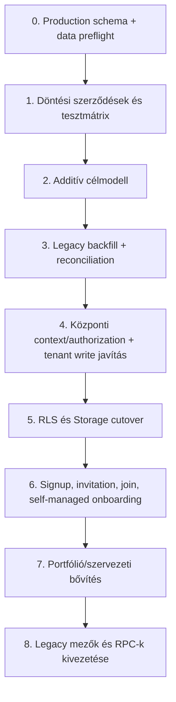

# 06 – Migrációs, rollout- és tesztterv

## Cél

A jelenlegi building-scoped demóalapot úgy kell valódi multitenant rendszerré alakítani, hogy:

- a meglévő demófiókok és `/w/{uuid}` linkek megmaradjanak;
- ne legyen big-bang adatvesztés vagy hozzáférési kiesés;
- a nyitott RLS ne maradjon új onboarding mellett;
- az új RLS ne kapcsolódjon rá tenant nélküli/hibás írásokra;
- minden fázis mérhető, visszaellenőrizhető és – a destruktív cleanup előtt – visszagörgethető legyen.

## Kritikus sorrend

Az 5. fázis kötelező kapu a nyilvános regisztráció és valós lakói onboarding előtt.

## Fázis 0 – Production preflight

### 0.1 Authority és sémaforrás

A repository-ban jelenleg:

- aggregált `supabase/schema.sql`;
- sok külön migráció;
- runtime/admin route-ba ágyazott DDL-nyomok;
- nincs bizonyítottan használt, generált Supabase `Database` TypeScript típus;
- a repository-séma és az éles projekt közti drift nincs ebben a körben igazolva.

Kötelező bizonyíték:

- production schema dump;
- migration history;
- extension- és PostgreSQL-verzió;
- table/column/constraint/index inventory;
- RLS policy és GRANT inventory;
- function/view trigger inventory;
- Storage bucket/policy inventory;
- Auth provider, SMTP, email-confirm, redirect, CAPTCHA, rate-limit és MFA/AAL konfiguráció;
- társasházi tisztségviselői/ingatlan-nyilvántartási adat jogszerű elérhetőségének/integrálhatóságának bizonyítéka; a Tht. 64/A szerinti általános dokumentumos fallback csak 2026. október 31-ig, hitelt érdemlő bizonyítékkal és manuális review-val tervezhető;
- row count és null/duplikációs riport;
- a fix demo UUID-k elkülönítése.

Semmilyen új constraintet nem szabad csak a repository `schema.sql` alapján productionben futtatni.

### 0.2 Adatminőségi riportok

Kötelezően felderítendő:

1. `units.building_id IS NULL`;
2. membership unitja más buildinghez tartozik;
3. ticket/reading unitja más buildinghez tartozik;
4. announcement target unit és announcement building eltérés;
5. meeting attendance/vote unit mismatch;
6. work order ticket/vendor/building mismatch;
7. tenant nélküli dokumentum, ticket, meter, meeting, finance, audit;
8. ugyanazon profile több aktív role-ja egy buildingben;
9. `.single()`-t törő duplikátumok;
10. azonos vagy normalizálás után azonos building címek;
11. több workspace-hez tévesen közös rekordok;
12. `owner_name` névütközések;
13. subscription nélküli és több subscriptiones buildingek;
14. mock/demo eredetű production rekordok;
15. open Storage objektumok és path-scope hiányok.

Az eredmény négy kategóriába kerül:

- automatikusan javítható;
- determinisztikusan backfillelhető;
- kézi review kell;
- karantén, mert a tenant nem bizonyítható.

### 0.3 Döntési jegyzőkönyvek

Implementáció előtt lezárandó ADR-ek:

- tenant = community workspace;
- MVP-ben 1 workspace = 1 building használat vagy azonnali több-building;
- self-managed legal form, legfeljebb hatlakásos Tht. 13. § (3) jogalap, más Ptk.-jogalap és verification szabály;
- ownership/occupancy evidence és retention;
- delegált capability-sablonok;
- billing payer és workspace subscription kapcsolata;
- lakó által látható unit-directory mértéke;
- tulajdonosi szavazati/meghatalmazási modell;
- címkonfliktus reviewer és SLA;
- lejárt subscription read-only/export szabálya.
- magas kockázatú capabilityk `aal2`, elfogadott MFA `amr.method` listája és `amr.timestamp`-alapú reauthentication ablaka;
- képviselői verification jogszabályi cutoffja: kötelező source/jogi re-check legkésőbb 2026. szeptember 30-án, fail-closed átállás 2026. november 1-jén, ha az aktuális jog nem változik.

## Fázis 1 – Szerződés és tesztelőállítás

Mielőtt production adatot mozgatunk:

- canonical role/capability registry;
- status state machine-ek;
- target entity contract;
- error taxonomy;
- audit event catalog;
- auth callback contract;
- invite/join idempotency contract;
- tenant fixture-ek legalább három workspace-szel;
- allow/deny permission matrix géppel futtatható formában;
- demo-flow canary.

### Hibaosztályok

| Kódjelleg | Jelentés | Privacy-viselkedés |
|---|---|---|
| unauthenticated | nincs hiteles user | login |
| forbidden | nincs capability/scope | generikus tiltás |
| not_found | nincs vagy nem látható | ugyanaz a válasz cross-tenant esetén |
| conflict | duplikáció vagy race | ne fedjen fel rejtett tenantot |
| pending_verification | domain review kell | státuszoldal |
| feature_unavailable | jogosult, de entitlement hiányzik | pricing/read-only UX |
| stale_state | concurrency/version konfliktus | biztonságos retry |

## Fázis 2 – Additív célmodell

Új táblák/kapcsolatok a régiek törlése nélkül:

- workspaces;
- parties/people/organizations, person account link, party alias és merge case;
- physical_buildings;
- addresses + building address history;
- workspace_buildings;
- workspace_memberships;
- membership_periods;
- role_assignments;
- management_mandates;
- delegations;
- unit_ownerships;
- unit_legal_rights;
- unit_occupancies;
- membership_invitations;
- join_requests;
- community_creation_requests és lejáró address lease;
- authorization audit;
- workspace subscription/billing link.

Minden új tenanttábla:

- `workspace_id NOT NULL`, amikor értelmezhető;
- UUID PK;
- created/updated/lifecycle mezők;
- RLS kezdettől default deny;
- csak backfill/service command számára kontrollált írás;
- megfelelő `(workspace_id, id)` unique key a composite FK-khoz;
- index az RLS és state machine predikátumokra.

### Legacy ID-kompatibilitás

Javasolt backfill:

- minden jelenlegi `buildings.id` értékhez létrejön `workspaces.id = buildings.id`;
- a `/w/{buildingId}` URL így átmenetileg ugyanazzal az UUID-val workspace route-ként működhet;
- ugyanahhoz a current buildinghez új `physical_building_id` tartozhat;
- az ID-egyezés csak legacy kompatibilitás, később nem feltételezhető minden workspace–building páron.

Ez minimalizálja a link-, subscription- és demóregressziót.

## Fázis 3 – Backfill és reconciliation

### 3.1 Profiles és people

- minden profile-ból person party;
- account–person link;
- globális `profiles.role` csak migrációs input, nem céljogosultság;
- email/telefon privacy mezők review;
- duplikált személyek nem olvadnak össze név alapján.

### 3.2 Buildings, workspaces és address

- egy workspace per current building;
- egy physical building per current building, konfliktus esetén review;
- current `address` parse és source-match;
- legacy raw text megőrzése;
- address assignment `LEGACY_UNVERIFIED`/`SOURCE_MATCHED` státusszal;
- canonical unique csak collision resolution után validálható.

### 3.3 Units

- `workspace_id` backfill a current buildingből;
- null building unitok karanténba;
- normalized designation dry run;
- composite FK mismatch javítás;
- `owner_name` nem válik automatikusan verified owner party-vá;
- `owner_name` legacy labelként vagy pending party candidate-ként marad.

### 3.4 Memberships

Minden `(profile_id, building_id)` csoportból egy stabil neutral `workspace_membership` és egy migrációs forrású nyitott `membership_period`.

Role mapping:

| Legacy role | Cél |
|---|---|
| `kozos_kepviselo` | pending/active common representative mandate + admin assignment, evidence státusztól függően |
| `megbizott` | delegációs candidate; nem automatikus korlátlan admin |
| `bizottsag` | committee oversight assignment |
| `konyvelo` | accountant assignment |
| `tulajdonos` + unit | `unit_ownership` `LEGACY_UNVERIFIED` vagy policy szerinti verified |
| `lako` + unit | `unit_occupancy` `LEGACY_UNVERIFIED` |
| `lako`/`tulajdonos` unit nélkül | review queue; nem találgatunk |

Ha egy legacy user ugyanabban a buildingben több role sort kapott, mindegyik külön target relationship/assignment lesz. A cél membershipből továbbra is egy marad.

### 3.5 Subscription

- current `subscriptions.building_id` a legacy azonos ID miatt workspace subscriptionre mapelhető;
- a payer/billing account külön mezőben vagy kapcsolótáblán jelenik meg;
- trial/demo state megmarad;
- előfizetés nem generál role-t vagy membershipet.

### 3.6 Tenant nélküli rekordok

Tiltott stratégia: „rendeljük az első/demo buildinghez”.

Helyes stratégia:

- determinisztikus parent lánc esetén backfill;
- bizonytalan esetben quarantine table/report;
- admin review;
- a migrációs gate addig HOLD, amíg érzékeny tenant nélküli sor marad.

## Fázis 4 – Központi authorization és write cutover

### 4.1 Új read context

`get_my_workspaces()` cél-szerződés:

- workspace-enként pontosan egy sor;
- workspace/building display data;
- membership status;
- aktív role template-ek tömbje;
- effektív capability-k;
- saját unitok listája és relationship típusai;
- governance és subscription/entitlement összefoglaló külön mezőben;
- nincs role szerinti duplikált kártya.

`get_workspace_context(workspace_id)`:

- nem egyetlen `role` és `unit_id`;
- role assignmentek;
- delegációk;
- ownership/occupancy unit-lista;
- authorizationhoz szükséges állapot;
- UI primary unit csak convenience mező.

A régi `get_my_buildings()` átmeneti wrapper lehet. A `validate_building_membership()` `LIMIT 1` eredménye többé nem használható biztonsági döntéshez.

### 4.2 Központi command réteg

Minden tenant write átvezetése:

- workspace ID kötelező route/context adat;
- target building/unit parentje újraellenőrzött;
- actor sessionből;
- capability szerveroldalon;
- atomi DB command;
- audit ugyanabban a tranzakcióban;
- kliens nem küldhet role/status/actor mezőt szabadon.

### 4.3 Jelenlegi konkrét javítási lista

Mielőtt az RLS szigorodik:

- ticket create/update kapjon kötelező workspace és object authorizationt;
- meter reading kapjon kötelező unitot és relationship ellenőrzést;
- document upload/publish kapjon workspace-t és Storage scope-ot;
- finance/meeting `global` UUID fallback megszüntetése;
- work order és audit read kötelező workspace scope;
- resident unit hiánya ne listázza a ház első 12 unitját;
- production authenticated route üres eredménye ne essen mock adatra;
- dashboard GET közbeni building geocode write kerüljön privilegizált/background folyamatba;
- metadata és subpage lekérdezések ugyanazt a context helper-t használják;
- query error ne legyen csendben mock/üres success.

### 4.4 Shadow read

Feature flag mögött párhuzamosan számolható:

- legacy building list vs új workspace list;
- legacy role vs role assignment;
- legacy unit_id vs relationship unit-lista;
- legacy tenant scope vs új composite scope.

A shadow eredmény csak telemetria, nem user-válasz. PII nem kerülhet logba. Eltérés esetén reconciliation queue.

### 4.5 Dual write

Tartós alkalmazásoldali kettős írás kerülendő. Ha átmenetileg szükséges:

- egyetlen central command írja mindkét modellt egy tranzakcióban; vagy
- rövid életű DB compatibility trigger;
- minden divergence mérve;
- explicit sunset dátum/gate;
- nincs olyan kliensút, amely csak az egyik modellt írja.

## Fázis 5 – RLS és Storage cutover

### Táblánkénti sorrend

1. új authorization helper-ek és unit tesztek;
2. profile/minimal directory privacy;
3. workspace/membership/role/relationship táblák;
4. units/buildings/addresses;
5. tickets/meters;
6. documents + Storage;
7. finance;
8. meetings/votes;
9. communications;
10. work orders/vendors;
11. audit;
12. aggregált view/RPC-k.

Minden táblánál egy release-egységben:

- GRANT review;
- régi permisszív policy drop;
- új explicit operation policy;
- app query/action fix;
- direct Data API allow/deny test;
- cross-tenant adversarial test;
- observability;
- rollback terv.

### Miért veszélyes csak új policy-t hozzáadni?

A PostgreSQL permisszív policy-k alapértelmezésben OR-ként kombinálódnak. Egy meglévő `USING (true)` mellett az új tenant-filter nem szigorít semmit. A régi nyitott policy eltávolítása tehát nem későbbi cleanup, hanem a security cutover része.

### Rollback

Rollback nem jelentheti a nyitott policy-k tartós visszaállítását valódi adatok mellett. Lehetséges biztonságos rollback:

- feature read-only/maintenance mód;
- új onboarding leállítása;
- korábbi, szintén tenant-safe policy verzió;
- route flag visszaállítás;
- additív táblák érintetlenül hagyása;
- adatváltozás replay manifest alapján.

## Fázis 6 – Signup és domain onboarding

Csak az 5. fázis PASS után:

- email+jelszó signup;
- auth callback/profile bootstrap;
- invitation issue/accept/revoke;
- resident/owner join request;
- manager által felvitt pending person;
- representative building creation;
- self-managed bootstrap;
- admin transfer;
- password recovery;
- abuse protection.

Rollout:

1. belső teszt tenant;
2. fix demo account canary;
3. egy üres pilot workspace;
4. meghívásos pilot;
5. self-managed pilot;
6. szélesebb regisztráció.

## Fázis 7 – Kezelői portfólió és szervezetek

Külön release, ha az alaprendszer stabil:

- management organizations;
- organization memberships;
- organization mandate;
- staff delegation több workspace-re;
- portfolio aggregation;
- billing account több workspace-re;
- szervezeti offboarding és tömeges mandátumátadás.

Egy szervezet tagsága továbbra sem ad automatikus hozzáférést minden workspace-hez.

## Fázis 8 – Legacy cleanup

Csak akkor, ha:

- hívásgráfban nincs legacy caller;
- shadow diff tartósan nulla;
- migrációs audit és export kész;
- rollback időablak lejárt;
- production telemetry nem jelez legacy olvasást/írást.

Kivezethető:

- `profiles.role` mint authority;
- `memberships.role`;
- `memberships.unit_id`;
- `units.owner_name` mint jogosultsági adat;
- legacy `get_my_buildings()`/`validate_building_membership()`;
- mock fallback az autentikált production data pathból;
- nullable tenant kulcsok;
- compatibility triggers/views.

Hard drop külön, explicit destructive migration és backup után történhet.

## Tesztstratégia

### 1. Schema contract

- UUID PK minden target entityn;
- NOT NULL tenant kulcs;
- unique és composite FK;
- status check/enums;
- immutábilis identity mezők;
- utolsó admin guard;
- aktív időszakok ütközési szabálya;
- token hash/expiry/one-time constraint.

### 2. Migration tests

- empty DB;
- current demo fixture;
- user több buildinggel;
- user több role-lal;
- user több unittal;
- null tenant sor;
- cross-building mismatch;
- címduplikáció;
- owner_name collision;
- migration második futtatása idempotens;
- rollback/forward replay.

### 3. Authorization/RLS tests

Minden resource × operation × actor kombináció. Kötelező közvetlen Postgres/PostgREST és Storage teszt, nem csak UI.

Külön kötelező:

- anonim public building lookup csak minimalizált mezőkkel;
- hitelesített, membership nélküli user saját join/claim submit/status művelete;
- ugyanaz a user semmilyen tenant base táblát nem olvashat;
- invitation token csak a címzett identityhez és cél-scope-hoz használható;
- `anon`, `authenticated`, service-role, table-owner és hibás grant felület külön auditja;
- kliens által hamisított Storage path/metadata nem ad hozzáférést;
- ugyanaz az erőforrás-ID más workspace actorával deny/not-found, existence leak nélkül;
- magas kockázatú command `aal1` sessionnel step-up választ ad;
- `aal2`, de túl régi vagy hiányzó/ismeretlen kvalifikáló `amr.timestamp`/`amr.method` mellett szintén step-upot ad;
- friss, engedélyezett MFA `amr` + `aal2` + capability mellett enged;
- service-key/RLS-bypass command callerhez kötött JWT vagy egyszer használható step-up ticket nélkül deny; kliens által küldött időbélyeg nem elegendő.

### 4. Workflow tests

- signup/confirm/recovery;
- invitation new és existing emailre;
- wrong email, expired, revoked, replay token;
- concurrent invitation accept;
- join approve/reject/cancel;
- manager adds offline person;
- két workspace-ben létrehozott offline person privacy-safe claim/merge/alias folyamata;
- self-managed request-draft capability → reviewer által atomikusan aktivált workspace/membership/mandate/role;
- self-managed lejáró címlease és anti-squatting újrapróbálkozás;
- hatnál több lakás vagy bizonytalan legal basis nem aktiválódik automatikusan self-managed módban;
- `submit_managed_community_request` igazolás/friss MFA nélkül csak subject-scoped request-draftot, evidence referenciát és lejáró címlease-t hoz létre; workspace, membership, period, mandate, role és tenant-admin hozzáférés nincs;
- `activate_managed_community` kizárólag approved, nem lejárt request, aktuálisan újraellenőrzött nyilvántartási/jogi kapu és claimanthez kötött friss MFA mellett hozza létre az aktív workspace-et, building linket, membershipet, membership periodot, mandate-et és `COMMON_REPRESENTATIVE_ADMIN` role-t egy tranzakcióban;
- mandate transfer;
- delegation expiry/revoke;
- issuer mandate lejárata érvényteleníti a függő invitationt, új admin új tokent ad ki;
- friss `aal2` + kvalifikáló `amr.timestamp` step-up mandate/delegation/PII-export műveletnél;
- Tht. 64/A képviselői átmeneti szabály időhatártesztje 2026. október 31. és 2026. november 1. két oldalán;
- last-admin prevention.

### 5. Domain-szcenáriók

| Szcenárió | Kötelező eredmény |
|---|---|
| A user A-ban lakó, B-ben 3 unit tulajdonosa, C-ben képviselő | mindhárom context helyes, nincs duplikált workspace card |
| Egy közös képviselő két workspace-t kezel, de eltérő megbízottakat és capabilityket ad | mindkét portfóliókártya helyes; delegáció nem folyik át; A-ból B rekordja 0 sor/deny |
| Egy unitnak 2 tulajdonosa és 3 lakója | minden reláció külön és időbeli |
| Ugyanaz az offline személy két házban külön rekordként szerepel, majd mindkét invite-ot elfogadja | auditált canonical person/alias feloldás; egyik admin sem látja a másik tenantkapcsolatát |
| Lakó kiköltözik, de másik unit tulajdonosa | occupancy lezárul, membership megmarad |
| Haszonélvezeti jog aktív egy uniton | nem számít tulajdoni hányadba és csak explicit legal-right capabilityt ad |
| Képviselő mandátuma lejár | új admin write tiltott, history megmarad |
| Képviselő általános kinevezési dokumentummal 2026. október 31-én, nyilvántartási bejegyzés nélkül | csak hitelt érdemlő bizonyíték + manuális review alapján, legfeljebb cutoffig érvényes átmeneti aktiválás |
| Ugyanez 2026. november 1-jén | fail-closed; nyilvántartási bejegyzés bizonyítása nélkül nincs aktív mandate/admin role, csak dispute case |
| Delegált próbál admin role-t adni | deny |
| Más workspace unit UUID-ja | deny/0 sor, nincs existence leak |
| Két azonos cím create párhuzamosan | egy canonical building, másik claim/conflict |
| Üres új workspace | valódi üres állapot, nincs Gidófalvy mock adat |
| Subscription lejár | policy szerinti feature state, nincs tenant-scope változás |
| Régi `/w/{uuid}` URL | kompatibilisen működik a migrációs ablakban |

### 6. Browser/regresszió

- desktop és mobil workspace picker;
- több role/unit context;
- regisztráció és callback;
- invitation deep link;
- building search privacy;
- admin member management;
- owner vs resident eltérő nézet;
- self-managed request-draft és aktivált állapot;
- billing és trial;
- minden meglévő ticket/document/meter/finance/meeting flow;
- 0 console error/hydration warning;
- back/forward route működés;
- magyar dátum/időzóna változatlan.

## Observability

Mérendő, PII-minimalizált események:

- authorization deny resource/capability kategóriával;
- cross-tenant mismatch attempt;
- invitation issue/accept/fail reason kategória;
- join request lifecycle;
- duplicate address collision;
- shadow read mismatch;
- RLS 0-row unexpected result;
- mock fallback productionben – ennek nullának kell lennie;
- last-admin guard;
- mandate/delegation expiry;
- migration batch és quarantine számok.

Nem logolható nyersen:

- invitation token;
- jelszó/reset token;
- evidence dokumentum;
- teljes email/telefon, ha nem szükséges;
- más tenant rejtett rekordjának azonosítója publikus hibában.

## Fájlszintű hatástérkép a későbbi implementációhoz

| Terület | Jelenlegi fő fájlok | Várható irány |
|---|---|---|
| Auth UI | `app/login/page.tsx`, auth callback | login/register/recovery szétválasztás |
| Picker | `app/app/page.tsx` | `get_my_workspaces()`, egy kártya/workspace |
| Workspace route | `app/w/[buildingId]/page.tsx`, subpage layoutok | közös context helper, nem első membership |
| Data reads | `lib/data.ts` | kötelező workspace scope, hibakezelés, no mock fallback |
| Types | `lib/types.ts` | role helyett context/capability/relationship típusok |
| Actions | `app/actions/*` | central command + object auth + audit |
| API routes | `app/api/*` | BOLA-safe scope helper |
| Schema | `supabase/schema.sql`, migrations | additív target schema + RLS |
| Storage | document bucket migration/actions | workspace path + visibility RLS |
| Billing | middleware, billing/Stripe routes | authorizationtól külön workspace entitlement |
| Governance docs | role/architecture docs | egy canonical permission source |

Ez nem implementációs fájllista, hanem blast-radius térkép. Minden konkrét round előtt CodeGraph újraindexelés és aktuális caller-audit szükséges.

## Release bizonyíték formátuma

Minden fázis végén külön kell jelenteni:

- **PASS:** ténylegesen lefutott és ellenőrzött;
- **HOLD:** ismert blocker;
- **NOT_RUN:** nem futott, nem következtethető;
- **BIZONYÍTOTT production:** csak live/hosted teszttel;
- **BIZONYÍTOTT local:** nem állítható róla, hogy production proof.

A migráció csak akkor halad a következő fázisba, ha a fázis kapui PASS állapotúak és a quarantine kivételek dokumentáltak.
