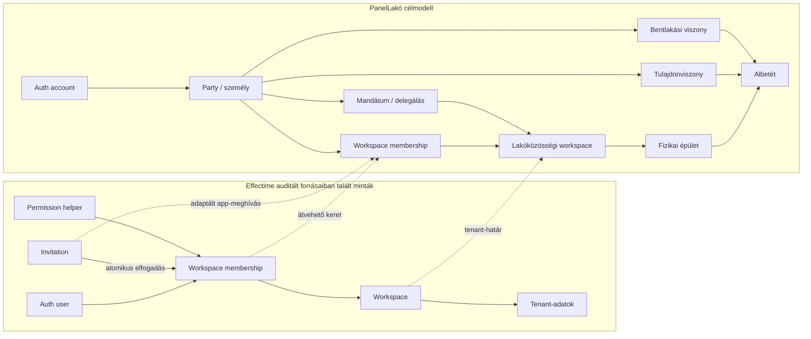

# 07 – Effectime minták: mit veszünk át, mit alakítunk át és mit nem

## Audit-határ

Az összehasonlítás a felhasználó által megadott `C:\Work\Github\effectime-app-enterprise-a95029a1` repository célzott, olvasási auditja. Az Effectime munkafája az auditkor erősen módosított volt, ezért ott nem történt szerkesztés. A migration fájlban talált minta nem automatikusan éles állapot vagy jó megoldás; csak a PanelLakó követelményeivel újraellenőrzött elveket vesszük át.

## Rövid döntés

Az auditált Effectime migrációkban és forráskódban használható **workspace + membership + atomikus command + policy-hardening** minták találhatók. Ez nem állítás az Effectime live deploymentjének teljes, fail-closed állapotáról. A PanelLakóban gazdagabb kapcsolati modell kell, mert a hozzáférés mellett külön kell modellezni a fizikai ingatlant, albetétet, személyt/szervezetet, tulajdont, bentlakást, közös képviselői mandátumot, megbízotti delegálást és a közös képviselő nélküli önigazgatást.



Az auditált Effectime-mintakészlet jó kiindulás, de a PanelLakóban a membership nem hordozhatja magában a teljes ingatlanjogi és lakhatási valóságot.

## 1. Workspace és membership külön entitás

**Effectime-bizonyíték:** `supabase/migrations/20260411121759_06c32329-ad1b-4f04-82cd-03eb0febdeb1.sql:2-148` külön workspace-, membership- és invitation-rekordokat, UUID-kat, tagsági státuszt és workspace/user egyediséget vezet be.

**PanelLakó-döntés:** az elvet átvenni, a szerepmodellt nem egy az egyben másolni.

- `workspace_membership` mondja meg, hogy egy accounttal összekapcsolt személy beléphet-e a lakóközösség digitális terébe.
- A membership nem mondja meg, hogy a személy tulajdonos, lakó vagy közös képviselő.
- A membership állapota a célmodell szerint `PENDING`, `ACTIVE`, `SUSPENDED` vagy `ENDED`; az `ENDED` külön `end_reason` értéke jelzi például a saját kilépést vagy adminisztratív visszavonást.
- Egy account/workspace párhoz egy stabil membership-identitás és legfeljebb egy nyitott `membership_period` tartozzon; a több funkció külön role assignmentből és domainrelációból álljon össze.

Így nem jön létre több tagsági sor ugyanarra az emberre csak azért, mert egyszerre tulajdonos és lakó. A hozzáférés egy helyen felfüggeszthető, miközben a jogviszonytörténet megmarad.

## 2. Atomikus workspace-bootstrap

**Effectime-bizonyíték:** `supabase/migrations/20260514210834_v3_33_1_stabilization_reconciliation.sql:27-98` egy tranzakcióban hozza létre a workspace-t, owner membershipet, tenantkapcsolatot és subscription-alapot.

**PanelLakó-döntés:** szűk, idempotens request/activation commandok kellenek; az Effectime tranzakciós bootstrap mintája az aktiválási fázisban vehető át, a PanelLakó képviseleti és jogszabályi kapuival kiegészítve.

### Képviselő által kezelt ház

Ez kétfázisú, hogy verification előtt kezelt háznál se keletkezzen tenant vagy adminjog:

1. `submit_managed_community_request`: a hitelesített claimant kanonikus címre rövid életű address lease-t, `community_creation_request` rekordot, saját request-draftot és evidence referenciát hoz létre. A fizikai building master csak provisional globális rekord lehet; workspace, membership, membership period, mandate és role nem keletkezik.
2. Jogosult reviewer a hivatalos nyilvántartási/jogi bizonyítékot ellenőrzi, és a requestet `APPROVED`, `NEEDS_EVIDENCE` vagy `REJECTED` állapotba viszi. Ez még nem ad tenantjogot.
3. `activate_managed_community`: a claimant vagy a claimanthez kötött, egyszer használható step-up ticketet fogyasztó szerverfolyamat csak jóváhagyott, nem lejárt request, a 04-es fejezet szerinti aktuálisan újraellenőrzött jogi/nyilvántartási kapu és a 03-as fejezet szerinti friss `aal2` + kvalifikáló `amr.timestamp` mellett fut.
4. Az activation egy tranzakcióban resolve-olja/létrehozza a building mastert, létrehozza az `ACTIVE REPRESENTATIVE_MANAGED` workspace-et és `workspace_buildings` linket, az aktív membershipet és első membership periodot, az aktív `COMMON_REPRESENTATIVE` mandate-et, valamint a hozzá kötött `COMMON_REPRESENTATIVE_ADMIN` role assignmentet, audit- és – termékpolicy szerint – entitlement-alappal.
5. Idempotenciakulcs, request- és címzárolás akadályozza meg a dupla aktiválást; bármely hiba teljes rollback.

### Önszerveződő kis ház

Ez kétfázisú, hogy verification előtt ne keletkezzen tenant-admin jog:

1. `submit_self_managed_community_request`: hitelesített claimant saját, subject-scoped community creation requestet, request-draftot és lejáró címlease-t hoz létre. Nincs workspace, membership, membership period, mandate vagy role assignment.
2. `activate_self_managed_community`: jogosult reviewer csak a `legal_form`, releváns unit count, `governance_legal_basis`, bizonyítékok, MFA-enrollment és a PanelLakó `aal2` + kvalifikáló `amr.timestamp` frissességi szerződésének ellenőrzése után, egy tranzakcióban hozza létre az aktív workspace-et, `workspace_buildings` linket, aktív membershipet és első membership periodot, `SELF_MANAGED_COORDINATION` mandate-et és `SELF_MANAGED_ADMIN` role assignmentet. A Tht. 13. § (3) szerinti út legfeljebb hatlakásos társasházra alkalmazható.

Nem jön létre fiktív `COMMON_REPRESENTATIVE` mandate; a role felületi neve „Közösségi koordinátor”, és csak a legitim `SELF_MANAGED_COORDINATION` mandátum metszetében effektív.

`ACTIVE` workspace nem maradhat igazolt főadmin nélkül. A normál managed és self-managed onboarding verification előtt request-only; `PENDING_VERIFICATION` workspace legfeljebb migrációs/operátori kivételben létezhet, role, membership period, tenantadat-hozzáférés és effektív capability nélkül. Címfoglalás nélküli épület vagy részlegesen aktivált tenant nem maradhat vissza hiba után.

A pending címfoglalás nem lehet korlátlan: rövid lejáratú lease, rate limit, bizonyíték-bekérési határidő és platform-visszavonás védi a valós címet az anti-squatting visszaéléstől. Lejárt request nem blokkolhatja egy igazolt közösség onboardingját.

## 3. A jogosultsági helper a hívóhoz kötött

**Effectime-bizonyíték:** `supabase/migrations/20260717132000_v3_51_3_reproducibility_and_atomic_settings.sql:90-179` a permission ellenőrzést a tényleges hívóhoz köti, és érzékeny permission-definíció módosítását owner-szintre szűkíti.

**PanelLakó-döntés:** kötelezően átvenni.

- A kliens által küldött `profile_id`, `user_id`, `role` vagy `workspace_id` nem bizonyíték.
- Minden helper a `auth.uid()` identitásból indul, azon keresztül oldja fel a kapcsolt személyt és aktív membershipet.
- A helper paraméterként kaphat erőforrás-azonosítót, de a hívó azonosítóját nem.
- A dinamikus tagság és delegálás adatbázis-igazság legyen, ne hosszú időre cache-elt JWT-állítás.

Javasolt szemantika:

```text
can_access_unit(unit_id, capability)
  := auth.uid()
     -> aktív account-person link
     -> aktív workspace membership
     -> érvényes szerep / mandátum / tulajdon / bentlakás
     -> unit.workspace_id egyezés
     -> capability és erőforrásállapot ellenőrzés
```

## 4. Atomikus invitation-kiadás és -elfogadás

**Effectime-bizonyíték:** `supabase/migrations/20260717133000_v3_51_3_atomic_invitation_acceptance.sql` lejáratot, tokenrotációt, szerepkörhöz kötött kiadást, email-egyezést, fix zárolási sorrendet és atomikus elfogadást kezel.

**PanelLakó-döntés:** átvenni és szigorítani.

- A Supabase Auth meghívó és a PanelLakó domainmeghívó két külön rekord és állapotgép.
- A PanelLakó csak a domainmeghívó token hashét tárolja; a nyers token kizárólag a kiküldött URL-ben él.
- Elfogadáskor egyszerre történik a token, lejárat, email, cél-workspace, cél-unit és meghívói jogosultság ellenőrzése.
- Siker esetén ugyanabban a tranzakcióban jön létre vagy aktiválódik a membership és a jóváhagyott kapcsolat.
- Ugyanazon token ismételt elfogadása idempotens, de nem ad új jogosultságot.
- User-editable auth metadata soha nem választhat workspace-t vagy szerepkört.

**Authority-lifecycle döntés:** az issuer felhatalmazását elfogadáskor az aktuális állapot szerint újra kell ellenőrizni. A mandátum/role/delegáció lejárata vagy visszavonása automatikusan érvényteleníti az abból még függő meghívásokat. Az új, jogosult admin új tokent adhat ki; a régi token nem éled újra. Külön, közösségi határozatból eredő meghívás csak explicit későbbi ADR-rel térhet el ettől.

## 5. Összetett tenant idegen kulcs

**Effectime-bizonyíték:** `supabase/migrations/20260719143000_v3_51_6_atomic_member_profile_save.sql:739-819` egy konkrét allocation→membership kapcsolatnál `UNIQUE(id, workspace_id)` és összetett FK használatával adatbázisszinten akadályoz cross-workspace összekapcsolást. Ez bizonyított referencia-minta, nem annak bizonyítéka, hogy minden Effectime-tenantkapcsolat így védett.

**PanelLakó-döntés:** minden tenant-kapcsolatnál kötelező.

```text
units: UNIQUE(workspace_id, id)
workspace_buildings: UNIQUE(workspace_id, physical_building_id)
unit_scoped_documents: FK(workspace_id, unit_id) -> units(workspace_id, id)
meter_devices: FK(workspace_id, unit_id) -> units(workspace_id, id)
tickets: FK(workspace_id, physical_building_id)
         -> workspace_buildings(workspace_id, physical_building_id)
unit_ownerships: FK(workspace_id, unit_id) -> units(workspace_id, id)
unit_occupancies: FK(workspace_id, unit_id) -> units(workspace_id, id)
```

A `physical_buildings` master globális és nem tartalmaz `workspace_id`-t; a tenantkötést a `workspace_buildings` kapcsolat és az azon keresztül érvényesített összetett kulcs adja.

A más tenantból származó UUID így már az adatbázis integritási rétegén elbukik.

## 6. Más felhasználó jelszavát admin sem állítja be

**Effectime-bizonyíték:**

- `src/hooks/useAuth.tsx:194-214` valódi `signUp` és `signInWithPassword` flow;
- `supabase/functions/create-workspace-user/index.ts:1-23` kifejezetten tiltja, hogy admin más embernek jelszót válasszon.

**PanelLakó-döntés:** változtatás nélkül átvenni az elvet.

- A közös képviselő/megbízott létrehozhat offline személyrekordot és pending lakó/tulajdon kapcsolatot.
- Meghívhatja az illetőt saját account létrehozására vagy meglévő account kapcsolására.
- Nem láthatja, nem állíthatja be és nem küldheti el az illető jelszavát.
- Jelszó-helyreállítás kizárólag az auth szolgáltató ellenőrzött csatornáján történik.

## 7. Entitlement nem jogosultság

Az Effectime workspace-bootstrap és subscription kapcsolata hasznos minta, de a döntéseket külön kell tartani:

- **authorization:** ki érhet el workspace-t vagy erőforrást;
- **entitlement:** az adott workspace csomagja mely funkciókat engedi;
- **billing responsibility:** ki fizet és milyen portfólióra;
- **legal mandate:** ki képviseli a közösséget.

Egy kezelőcég fizethet több workspace előfizetéséért anélkül, hogy a billing rekord önmagában lakói vagy dokumentum-hozzáférést adna.

## Átvételi mátrix

| Effectime minta | PanelLakó döntés | Adaptáció oka |
|---|---|---|
| Workspace mint tenant | **Átvenni** | A közösség adattere független a képviselőtől. |
| Külön membership és státusz | **Átvenni** | A hozzáférési lifecycle külön kezelhető. |
| Atomikus workspace-bootstrap | **Átvenni** | Nem maradhat félkész tenant. |
| Atomikus invite accept | **Átvenni és hash-tokenre szigorítani** | Replay, tokenlopás és részleges írás ellen. |
| Caller-bound permission helper | **Átvenni** | A kliens nem választhat identitást vagy jogot. |
| Összetett tenant FK | **Átvenni** | DB-szintű cross-tenant védelem. |
| Egyetlen role mező mindenre | **Elutasítani** | Nem fejezi ki a tulajdon, bentlakás, mandátum és delegálás eltérését. |
| Korlátlan egyedi szerepkörök az első verzióban | **Elhalasztani** | Permission-drift és auditálhatatlanság veszélye. |
| Közvetlen membership/invite INSERT | **Elutasítani** | Megkerülheti az invariánsokat és auditot. |
| UI-only feature/permission gate | **Elutasítani** | Nem biztonsági kontroll. |
| Product schema = tenant isolation | **Elutasítani** | A schemafelosztás nem helyettesíti a sor- és objektumscope-ot. |
| Admin választ jelszót másnak | **Elutasítani** | Account-tulajdonlási és biztonsági kockázat. |

## PanelLakó-specifikus command contractok

A membership-, szerep-, mandátum-, tulajdon- és bentlakási táblák közvetlen kliensírása tiltott. A módosítás szűk tranzakciós parancsokon keresztül történik.

| Command | Kezdeményező | Tranzakciós invariáns |
|---|---|---|
| `submit_managed_community_request` | hitelesített claimant | saját request-draft + evidence ref + lejáró címlease; nincs workspace/membership/period/mandate/role |
| `activate_managed_community` | approved request claimant friss MFA-val, vagy caller-bound step-up ticketet fogyasztó jogosult szerverfolyamat | aktuálisan újraellenőrzött nyilvántartási/jogi kapu; aktív workspace + building link + membership + period + mandate + `COMMON_REPRESENTATIVE_ADMIN` role atomikusan |
| `submit_self_managed_community_request` | hitelesített claimant | saját request-draft + lejáró címlease; nincs workspace/membership/period/mandate/role |
| `activate_self_managed_community` | jogosult reviewer + claimant friss `aal2`/kvalifikáló `amr` | legal form/basis verification; aktív workspace + building link + membership + első period + coordination mandate + admin role atomikusan |
| `invite_person_to_unit` | capabilityvel bíró admin | a cél-unit ugyanabban a workspace-ben van |
| `accept_unit_invitation` | meghívott account | email + token + státusz + unit + workspace atomikusan egyezik |
| `submit_unit_claim` | hitelesített account | csak meglévő épület/albetét; nem aktivál saját jogot |
| `approve_unit_claim` | felhatalmazott, nem az igénylő | separation of duties és audit |
| `assign_delegated_capabilities` | aktív mandátumos admin | nem lehet szélesebb a delegáló jogánál |
| `close_occupancy` | jogosult fél/admin | történet lezárul, nem törlődik |
| `transfer_common_representation` | governance folyamat | új mandátum és régi lezárása konzisztens |
| `revoke_workspace_member` | admin/governance | utolsó-admin guard és függő feladatok kezelése |

## Last-admin és képviselőváltási védelem

**Effectime-forrásminta:** `supabase/migrations/20260717132000_v3_51_3_reproducibility_and_atomic_settings.sql:1138-1275` korlátozza a közvetlen membership INSERT/DELETE-et és a saját role/status módosítását; `supabase/functions/delete-account/index.ts:175-203` blokkolja a sole owner account törlését. Ez forráskód-bizonyíték, nem live deployment igazolás.

- `REPRESENTATIVE_MANAGED` módban legalább egy aktív, igazolt mandátum vagy szabályozott átadási folyamat kell.
- `SELF_MANAGED` módban legalább egy aktív koordinátor kell, vagy platform által felügyelt helyreállítás indul.
- Az utolsó admin nem vonhatja vissza magát elfogadott utód nélkül.
- A lejárt mandátum nem hosszabbodik meg automatikusan technikai kényelemből.
- A hozzáférés-visszavonás és a jogi mandátum lezárása külön, de összehangolt esemény.

## Profilminimalizálás

PanelLakóban cél szerint minimalizált nézetek kellenek:

- `workspace_member_directory`: csak működéshez szükséges név és szerepkijelzés;
- `unit_contact_projection`: csak konkrét ügyintézéshez engedélyezett elérhetőség;
- `public_building_lookup`: cím- és épületazonosító, személyes adatok nélkül;
- `admin_identity_review`: csak magas jogosultsággal és auditált célhoz;
- `self_profile`: a felhasználó saját teljes profilja.

Az azonos épület nem teszi automatikusan láthatóvá más lakók emailcímét, telefonszámát, tulajdoni hányadát vagy tartozását.

## Nem másolandó Effectime-kockázatok

### Szerepkör-drift

Ha role template, custom role és permission override egyszerre korlátlanul írható, az állapot auditálhatatlanná válhat. Az első PanelLakó multitenant verzió fix role template-eket és explicit delegált capability-ket használjon. Egyedi szerepkör csak későbbi külön tervvel jöhet.

### Közvetlen invitation- vagy membership-írás

Admin CRUD nem írhat közvetlenül ezekbe a táblákba. A command réteg biztosítja a meghívó jogosultságát, cél-workspace-et, cél-unitot, email-normalizálást, tokenéletciklust és auditot.

### Nyers token tárolása

PanelLakóban hash tárolandó. Adatszivárgás esetén a táblából ne lehessen aktív meghívólinket előállítani.

### Schemafelosztás mint biztonsági érv

Más PostgreSQL schema lehet szervezési eszköz, de a tenant-izoláció bizonyítéka a `workspace_id`, összetett FK, RLS, command authorization és negatív teszt.

## Elfogadási feltételek

Egy Effectime-minta csak akkor tekinthető ténylegesen átvettnek, ha:

1. PanelLakó-domainnéven és invariánsokkal specifikált;
2. a live Supabase-sémára reprodukálható migráció készült;
3. az RLS nem támaszkodik user-editable metadata mezőre;
4. pozitív út mellett cross-tenant és privilege-escalation negatív teszt is létezik;
5. UI-gate és adatbázis-gate ugyanazt a capabilityt használja;
6. az audit megmondja, ki, mikor, milyen minőségben és milyen bizonyíték alapján változtatott;
7. a rollback nem nyitja vissza a permisszív policy-kat;
8. a képviselő nélküli ház nem kap félrevezető jogi szerepnevet.

## MVP és későbbi szakasz

### Első biztonságos multitenant kiadás

- fix admin role template-ek;
- workspace membership lifecycle;
- tulajdon és bentlakás külön kapcsolata;
- managed és self-managed bootstrap;
- email+jelszó signup;
- app-level invite és resident claim;
- caller-bound authorization;
- összetett tenant FK-k;
- fail-closed RLS és Storage;
- last-admin guard;
- auditált mandátumátadás.

### Későbbi bővítés

- egyedi szerepsablonok;
- kezelőcégen belüli részletes hierarchia;
- korlátozott alvállalkozói portál;
- platformmoderációs case-management;
- gépi cím- és bizonyíték-egyeztetés;
- időkorlátos, auditált break-glass support session.

## Következtetés

Az Effectime nem kész, átemelhető PanelLakó-modul. Az auditált forrásokban talált legértékesebb minták a tranzakciós és biztonsági fegyelmet mutatják: külön workspace, explicit membership, caller-bound jogosultság, atomikus meghívás, összetett tenant FK és utolsó-admin védelem. A PanelLakó ezeket időbeli ingatlan- és személykapcsolati modellel egészíti ki, majd saját negatív tesztekkel bizonyítja.
