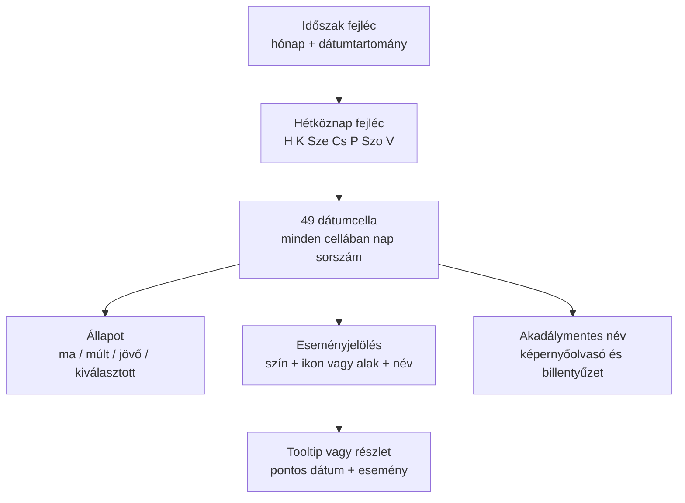

# 08 – Aktivitási naptár kontraszt- és olvashatósági terv

## Hatókör

Ez a fejezet a dashboard aktivitási naptárának felhasználó által jelzett olvashatósági hibáját tervezi meg. Ebben a körben nem történt komponens- vagy CSS-módosítás.

Érintett elsődleges forrás: `components/dashboard/activity-calendar.tsx`.

## BIZONYÍTOTT jelenlegi probléma

A repository jelenlegi komponensében:

- a hét sorcímkéi körülbelül `8px` méretűek;
- a hét napjainak fejléce körülbelül `9px` méretű;
- a hónap-/dátumjelzések körülbelül `6px` méretűek;
- a jelmagyarázat körülbelül `8px` méretű;
- a 49 naptárcella nem jeleníti meg a nap sorszámát;
- a jövőbeli állapot teljes elemre alkalmazott opacityvel a szöveget is tovább halványíthatja;
- a dátumot nagyrészt pozícióból, apró peremcímkékből és esetleges eseménypontból kell kikövetkeztetni.

Ezért a hiba nem pusztán egy rossz szürke árnyalat. A legfontosabb információ egy része hiányzik, a meglévő címkék pedig olyan kicsik, hogy technikailag megfelelő színkontraszt mellett is nehezen olvashatók.

## Célállapot

A naptár első ránézésre megválaszolja:

1. melyik hónapot és dátumtartományt látom;
2. melyik oszlop melyik hétköznap;
3. az egyes cellák melyik naptári napot jelentik;
4. melyik nap a mai nap;
5. melyik napnak milyen eseménye van;
6. mi jövőbeli, mi elmúlt és mi interaktív;
7. mit jelent az egyes eseménytípusok színe vagy alakja.

## Tipográfiai szerződés

A következő értékek implementációs célértékek, nem ebben a körben elvégzett CSS-módosítások.

| Elem | Javasolt minimum | Súly | Kontrasztcél | Indok |
|---|---:|---:|---:|---|
| Időszak/hónap fejléc | 13–14 px | 600 | legalább 7:1 | Elsődleges tájékozódási pont. |
| Hétköznapok | 11–12 px | 600 | legalább 7:1 | Minden cella értelmezéséhez szükséges. |
| Cellán belüli nap sorszám | 11–12 px | 600 | legalább 7:1 | Alapvető dátuminformáció. |
| Hetek/dátumtartomány másodlagos címkéje | legalább 11 px | 500 | legalább 4.5:1 | Hasznos, de nem egyedüli tájékozódás. |
| Jelmagyarázat | legalább 11 px | 500 | legalább 4.5:1 | Események értelmezéséhez szükséges. |
| Tooltip szöveg | legalább 12 px | 400/500 | legalább 4.5:1 | Interaktív részlet, nem lehet mikroszöveg. |

A WCAG 2.2 normál szövegre 4.5:1 minimumot ír le. A PanelLakó célja az alapvető, kisméretű dátumcímkéknél ennél szigorúbb, legalább 7:1 célérték, mert a naptár sűrű, a felhasználók életkora és látási képessége változó, és a dátum nem dekoráció.

## Szín- és állapotszerződés

### Ne az egész cellát halványítsuk

Jövőbeli vagy inaktív állapotnál nem szabad a teljes elemre `opacity` értéket tenni, ha az a szöveget is érinti. Helyette külön tokennel változzon a cella háttere, kerete, eseményjele és szükség esetén a másodlagos szöveg színe. A nap sorszáma minden érvényes cellában olvasható maradjon.

### A szín ne legyen egyetlen jelentéshordozó

A hibabejelentés, közgyűlés, mérőóra-határidő és szavazás ne csak különböző színű pont legyen. A színt egészítse ki eltérő alak vagy ikon, szöveges eseménynév a részletnézetben és teljes képernyőolvasó-label.

### Állapotok prioritása

Ha egy cellában több állapot találkozik, a vizuális sorrend:

1. billentyűzetfókusz;
2. kiválasztott nap;
3. mai nap;
4. esemény;
5. jövő/múlt háttérkülönbség.

A fókuszgyűrűt egyik kitöltés vagy eseménypont sem fedheti el.

### Nem szöveges kontraszt

A fontos cellakeret, fókuszjel, kiválasztás és eseménymarker a közvetlen háttérhez képest legalább 3:1 kontrasztot célozzon. A marker kis mérete miatt a látható átmérő és környezet is külön ellenőrzendő.

## Cella tartalmi szerződés

Minden valós naptári napot jelentő cella tartalmazzon:

- látható nap-sorszámot (`1`–`31`);
- gépi `dateKey` értéket `YYYY-MM-DD` formátumban;
- teljes magyar akadálymentes nevet, például `2026. augusztus 27., csütörtök`;
- állapotot: múlt/ma/jövő;
- eseményszámot és eseménytípusokat, ha vannak;
- interaktív elem esetén natív gombot vagy linket, nem kattintható `div`-et.

Üres rácspozíció csak akkor lehet, ha valóban nem reprezentál napot. A jelenlegi folytonos 49 napos nézetben mind a 49 cellának legyen dátumneve.

## Javasolt cellaállapotok

### Esemény nélküli nap

- jól olvasható nap-sorszám;
- finom, de felismerhető háttér;
- hover nélkül is értelmezhető.

### Mai nap

- `aria-current='date'` szemantika;
- legalább 3:1 nem szöveges kontrasztú jelölés;
- a nap-sorszám szövegkontrasztja nem csökkenhet.

### Egy esemény

- a nap-sorszám változatlanul látszik;
- a marker nem takarja a számot;
- a tooltip/részlet teljes dátumot és eseménynevet ad.

### Több esemény

- ne zsúfoljunk több mikropontot olvashatatlanul;
- legfeljebb két elsődleges jel és `+N` összesítő, vagy egy aggregált marker;
- a hozzáférhető név felsorolja az összes típust és darabszámot.

### Jövőbeli nap

- a háttér lehet semlegesebb;
- a dátumszám normál olvashatóságú marad;
- a releváns jövőbeli esemény ne tűnjön letiltottnak.

## Layout és reszponzív terv

### Nagy desktop

- hét oszlop azonos szélességgel;
- a címkéknek fixen fenntartott függőleges hely;
- a nap-sorszámok nem skálázódnak 11 px alá;
- a hosszabb magyar hónapnév sem ütközik a navigációs nyilakkal.

### Közepes desktop / keskeny dashboard-kártya

- a naptár ne zsugorítsa a szöveget;
- inkább kapjon nagyobb minimumszélességet vagy kerüljön teljes szélességű sorba;
- a legend több sorba törhet;
- a hétcímkék rövid magyar alakja mellett accessible nevük teljes.

### Mobil

A mobil stratégia külön product döntés. Elfogadható egy kompakt havi naptár teljes dátumszámokkal, vagy következő-esemény idővonal külön teljes naptár nézettel. Nem elfogadható a desktop 49 cellás rács egyszerű lekicsinyítése mikroszöveggé.

## Időzóna- és regressziós invariánsok

A kontrasztjavítás nem ronthatja el a v0.9.36-ban stabilizált dátumlogikát. Megőrzendő:

- a szerver által átadott magyar `calendarDate` pillanatkép;
- UTC-alapú determinisztikus dátumaritmetika;
- `Europe/Budapest` üzleti időzóna;
- SSR és kliens azonos első renderje;
- az eseménypontok meglévő dátumkulcs-számítása;
- a hétkezdés és 49 napos tartomány jelenlegi üzleti értelme, amíg product döntés nem változtatja meg.

A vizuális javítás nem használhat render közben új `Date()` pillanatot, implicit böngésző-lokális formázást vagy kliens-only dátumkorrekciót.

## Implementációs blast radius

### Elsődleges

- `components/dashboard/activity-calendar.tsx`;
- a komponens szín- és tipográfiai tokenjei;
- az aktivitási naptár unit tesztjei.

### Másodlagos

- dashboard környezeti blokk layoutja;
- legend és tooltip közös primitívek, ha azokat használja;
- screenshot/browser regression referencia;
- akadálymentességi ellenőrzések.

### Nem változhat mellékhatásként

- dashboard actionök és eseményadat-lekérés;
- auth/membership;
- ticket-, meeting- vagy meter workflow;
- események kategorizálása;
- időzóna-kontraktus.

## Végrehajtási sorrend

1. **Mérési baseline:** tényleges computed foreground/background párok kontrasztmérése, nem színek ránézésre becslése.
2. **Tartalom:** nap-sorszám és teljes hozzáférhető dátum mind a 49 cellában.
3. **Tipográfia:** 6–9 px címkék kivezetése, legalább 11–12 px megjelenés.
4. **Állapot:** teljes elem opacity eltávolítása; külön szöveg-, háttér- és marker-tokenek.
5. **Interakció:** natív fókuszálható cella csak tényleges művelet/részlet esetén; tooltip nem csak hoverrel.
6. **Legenda:** legalább 11 px, szín mellett szöveg és eseménynév.
7. **Reszponzív layout:** a naptár ne kényszerüljön a minimális olvashatóság alá.
8. **Automatikus és browser QA:** kontraszt, dátumok, fókusz, időzóna és overflow.

## Teszt- és elfogadási mátrix

| Kapu | Ellenőrzés | Elfogadás |
|---|---|---|
| Dátumtartalom | 49 cella render | 49/49 helyes nap-sorszám és teljes accessible date |
| Hétcímkék | H–V | mind látható, legalább 11 px, nincs levágás |
| Szövegkontraszt | computed color mérés | normál szöveg ≥4.5:1; kritikus kis dátumcímke cél ≥7:1 |
| Nem szöveges kontraszt | fókusz/ma/kiválasztás/marker | releváns háttérhez ≥3:1 |
| Színfüggetlenség | eseménytípusok | név vagy alak is közli a jelentést |
| Billentyűzet | Tab, Enter/Space, Escape | logikus fókuszsorrend; részlet elérhető |
| Képernyőolvasó | cellanevek | teljes dátum + állapot + esemény darabszám |
| Időzóna | UTC/Budapest határnap | nincs napeltolódás vagy hydration mismatch |
| Eseményregresszió | ismert fixture-ek | marker ugyanazon `dateKey` cellában marad |
| Desktop 1440×900 | valós dashboard | minden címke látszik, nincs overlap/overflow |
| Keskeny desktop | dashboard töréspont | nem zsugorodik 11 px alá; szükség esetén reflow |
| Mobil 375×812 | választott stratégia | nincs mikroszöveg vagy oldal-overflow |
| Zoom | 200% | információ és vezérlés nem vész el |
| Téma | támogatott témák | minden computed színpár megfelel |

## Tesztstratégia

### Unit/contract

- a 49 dátumkulcs folytonos és egyedi;
- a mai nap pontosan egyszer kap `aria-current='date'` állapotot;
- minden cellanév tartalmaz teljes dátumot;
- több esemény aggregálása determinisztikus;
- a meglévő timezone fixture-ek változatlanul átmennek;
- nincs locale-függő SSR/client eltérés.

### Komponens/a11y

- nincs névtelen interaktív elem vagy pozitív `tabindex`;
- hover nélkül is hozzáférhető minden lényegi adat;
- a legend és marker párosítás programozottan értelmezhető;
- automatikus axe szabályok mellett kézi fókuszteszt is készül.

### Browser és vizuális regresszió

- autentikált dashboard fixture 1440×900, keskeny desktop és 375×812;
- 100% és 200% zoom;
- esemény nélküli, egyeseményes, többszörös és mai napi állapot;
- screenshot diff mellett DOM/computed-style bizonyíték;
- konzolhiba és hydration warning: 0.

## Kész definíció

A hiba nem tekinthető megoldottnak attól, hogy a rács sötétebb lett. Akkor kész, ha a dátumok ténylegesen megjelennek, a kis címkék mérten olvashatók, a jelentés nem csak színből következik, a fókusz és képernyőolvasó út működik, valamint a budapesti időzóna és eseményelhelyezés regresszió nélkül megmarad.
