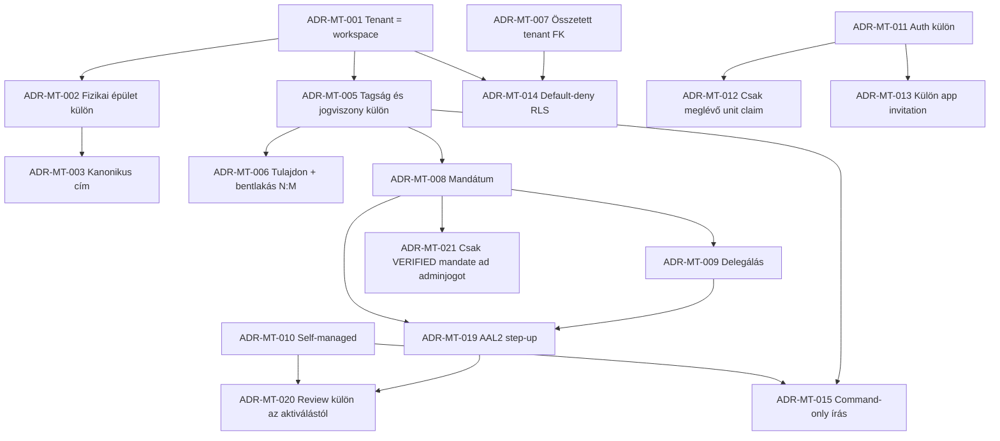

# 09 – Hivatalos források, architekturális döntések és nyitott kérdések

## A dokumentum szerepe

Ez a fejezet rögzíti, mely hivatalos technikai és jogi források támasztják alá a tervet, mely következtetés bizonyított, melyik PanelLakó-specifikus döntés, és mit kell még üzleti vagy jogi oldalról lezárni.

Az internetes forrásokat 2026-08-27-én ellenőriztük. A jogszabályi hivatkozások nem minősülnek jogi tanácsnak; implementáció és valós lakói onboarding előtt magyar társasházi és adatvédelmi jogi felülvizsgálat szükséges.

## Hivatalos technikai források

| Forrás | Bizonyított alapelv | PanelLakóban levont döntés |
|---|---|---|
| [Supabase – Password-based Auth](https://supabase.com/docs/guides/auth/passwords) | Támogatott email+jelszó signup/signin és konfigurálható email-megerősítés. | A magic link megmaradhat, de elsőrendű `signUp`, signin és recovery UX készül. |
| [Supabase – Row Level Security](https://supabase.com/docs/guides/database/postgres/row-level-security) | Engedélyezett RLS mellett a normál sorhozzáférés policy nélkül default deny, de a grants külön kapu; table owner, `BYPASSRLS` és service-role út megkerülheti, a nem sorjellegű műveleteket pedig nem az RLS védi. | Minden tenanttábla fail-closed RLS-t, minimális grantot, caller-bound helpert és negatív BOLA/bypass auditot kap; service secret nem kerül kliensre. |
| [PostgreSQL – Row Security Policies](https://www.postgresql.org/docs/current/ddl-rowsecurity.html) | RLS alkalmazható policy nélkül default deny; több policy kombinációja számít. | A teljes policyhalmazt együtt kell tesztelni, véletlen permisszív szabály nélkül. |
| [PostgreSQL – Constraints](https://www.postgresql.org/docs/current/ddl-constraints.html) | Unique és foreign key kényszerek biztosítják a relációs integritást. | UUID mellett összetett `(id, workspace_id)` kulcsok védik a tenant-scope-ot. |
| [Supabase – Inviting users](https://supabase.com/docs/guides/auth/users#inviting-users) | Auth user meghívása trusted server művelet; az Auth-életciklus nem domainjogosultság. | Külön Auth invitation és külön PanelLakó app invitation szükséges. |
| [Supabase Storage – Access control](https://supabase.com/docs/guides/storage/security/access-control) | A Storage objektumok hozzáférése RLS-policykkal szabályozható. | Az objektumutat szerver képzi/validálja; a policy authoritative DB mappingből, membershipből és capabilityből dönt. Kliens által küldött út vagy metadata önmagában nem authz-forrás. |
| [Supabase – Multi-Factor Authentication](https://supabase.com/docs/guides/auth/auth-mfa) | A session `aal1`/`aal2` szintje backend-, API- és restrictive RLS-policyban is kikényszeríthető; a felületi MFA-flow önmagában nem védelem. | Képviselőváltás, delegálás, claim-jóváhagyás, PII-export és más magas kockázatú capability szerveroldali step-up ellenőrzést igényel. |
| [Supabase – JWT Claims Reference](https://supabase.com/docs/guides/auth/jwt-fields) | Az `amr[]` bejegyzések hitelesítési módszert és Unix `timestamp` értéket hordoznak; az `aal2` a többfaktoros session erősségét jelzi. | A frissességhez nem elég az `aal2`: a command/API a kvalifikáló `amr.method` legújabb `timestamp` értékét is az adott capability reauth ablakához méri. |
| [OWASP – Authorization Cheat Sheet](https://cheatsheetseries.owasp.org/cheatsheets/Authorization_Cheat_Sheet.html) | Least privilege, deny-by-default és kérésenkénti jogosultság-ellenőrzés ajánlott. | Az UI-elrejtés nem kontroll; minden command és lekérés szerver/DB oldalon ellenőrzött. |
| [OWASP API1:2023 – Broken Object Level Authorization](https://owasp.org/API-Security/editions/2023/en/0xa1-broken-object-level-authorization/) | Az objektumazonosító ismerete nem jogosít hozzáférésre. | Minden workspace-, unit-, document- és ticket-ID cross-tenant negatív tesztet kap. |
| [W3C WCAG 2.2 – Contrast Minimum](https://www.w3.org/WAI/WCAG22/Understanding/contrast-minimum) | Normál szövegnél legalább 4.5:1 kontraszt szükséges. | A naptár kritikus kis dátumcímkéi ennél szigorúbb, 7:1 PanelLakó-termékcélt, minimum 11–12 px méretet és látható nap-sorszámot kapnak. |
| [W3C WCAG 2.2 – Non-text Contrast](https://www.w3.org/WAI/WCAG22/Understanding/non-text-contrast) | A szükséges UI-állapotok és jelentéshordozó grafikai elemek kontrasztja legalább 3:1. | Fókusz, mai/kiválasztott nap, eseménymarker és szükséges cellahatár a tényleges szomszédos háttérrel mérendő. |
| [W3C WCAG 2.2 – Use of Color](https://www.w3.org/WAI/WCAG22/Understanding/use-of-color) | A szín nem lehet az információ egyetlen vizuális hordozója. | Az eseménytípushoz szín mellett alak/ikon, látható név vagy más vizuális jel is kell. |
| [EDPB – Data protection by design and by default](https://www.edpb.europa.eu/documents/guideline/guidelines-42019-on-article-25-data-protection-by-design-and-by-default_en) | Adatminimalizálás és alapértelmezett korlátozás már tervezéskor szükséges. | A publikus kereső nem ad ki lakói PII-t; a profilnézetek cél szerint minimalizált projekciók. |

## Magyar jogi és nyilvántartási források

| Forrás | Releváns megállapítás | Tervezési következmény |
|---|---|---|
| [322/2024. (XI. 6.) Korm. rendelet – KCR és címkezelés, 123–134. §](https://njt.jog.gov.hu/eli/R/2024/Korm/322) | A 126. § strukturált címelemeket sorol fel az épület/lépcsőház/szint/ajtó szintig; a 128. § egyedi kódot és történeti állományt ír le. | A raw `address TEXT UNIQUE` helyett strukturált kanonikus cím, forrásazonosító/fingerprint és történeti alias kell. A hatályon kívüli 345/2014. rendelet nem aktuális forrás. |
| [Társasházi törvény – aktuális, stabil NJT/ELI nézet](https://njt.jog.gov.hu/eli/TV/2003/133) | A 13. § (3) a legfeljebb hatlakásos társasház közösségi döntéséhez köti a szervezeti szabályok alkalmazását. Az 55/A. § (2) nyilvántartási bejegyzéshez köti a tisztségviselő tevékenységét; a 64/A. § csak 2026. október 31-ig enged átmeneti, hitelt érdemlő igazolásra támaszkodó működést bejegyzés nélkül. | `SELF_MANAGED` csak rögzített `legal_form` és `governance_legal_basis` alapján aktiválható. Képviselőnél a nyilvántartási bejegyzés igazolása az alapkapu; általános dokumentumos kivétel csak a 64/A átmeneti időszakában, manuális review-val és cutoffot nem meghaladó érvénnyel használható. 2026. november 1-től bejegyzés nélkül nincs aktív mandate/admin role, kivéve ha egy addig ellenőrzött jogszabályváltozás mást ír elő. |
| [2021. évi C. törvény az ingatlan-nyilvántartásról](https://njt.hu/jogszabaly/2021-100-00-00) | Az ingatlan- és jogosulti adatok hivatalos nyilvántartási jelentéssel bírnak. | A PanelLakó claim nem hoz létre jogi tulajdonjogot; bizonyítékforrás, ellenőrző és időpont auditálandó. |

## Forrásértelmezési korlátok

### KCR és OSM nem ugyanaz

A repositoryban meglévő OpenStreetMap alapú címkereső jó UX-kiindulópont, de nem hivatalos jogi cím- vagy tulajdonjog-forrás. A célmodell ezért tárolja a normalizált címet, külső forrás típusát/azonosítóját, verifikációs állapotot, manuális döntést és alias-/merge-történetet.

### Auth email-megerősítés nem lakcímigazolás

Az email megerősítése csak az emailcsatorna feletti kontrollt bizonyítja. Nem bizonyít tulajdont, bentlakást, képviseletet vagy kezelőcéges munkaviszonyt.

### UUID nem jogosultsági védelem

A nehezen kitalálható UUID nem authorization. Minden objektumra külön workspace- és capability-ellenőrzés kell.

### Constraint hiba információt szivárogtathat

Egy unique vagy foreign key hiba RLS mellett is jelezheti, hogy cím, email vagy azonosító már létezik. A publikus onboarding ezért generikus választ, kontrollált command réteget és rate limitet igényel; nem adhat vissza belső constraint-nevet vagy más tenant létezését.

## Architektúra-döntési napló

### ADR-MT-001 – Tenant-határ

**Döntés:** a tenant a `community_workspace`.

**Miért:** a lakóközösség adatai túlélnek képviselő-, kezelőcég- és lakóváltást. A workspace stabil együttműködési tér, a szereplők időben változnak.

**Elutasítva:** tenant = közös képviselő account vagy kezelőcég; ez képviselőváltáskor adatköltöztetést és túl széles portfólió-hozzáférést okozna.

### ADR-MT-002 – Workspace és fizikai épület különválasztása

**Döntés:** a workspace egy vagy több fizikai épületet foghat össze; a fizikai épület a kanonikus címhez kötődik.

**Miért:** egy közösségnek lehet több lépcsőháza/címe, miközben helyalapú adatok az épülethez, közgyűlés és pénzügy a közösséghez tartoznak.

### ADR-MT-003 – Globális fizikai címidentitás

**Döntés:** ugyanaz a kanonikus cím nem hozhat létre két aktív fizikai épületet; ütközéskor claim/review/merge flow indul.

**Miért:** raw szöveges unique nem kezeli a normalizációt, címváltozást, több forrást és versenyhelyzetet.

### ADR-MT-004 – Auth account és domainperson külön

**Döntés:** `auth.users` login identity; a valós személy/szervezet külön `party` rekord.

**Miért:** a képviselő offline lakót is felvehet, aki később saját accountot kapcsol. Szervezet és természetes személy sem azonos auth userrel.

### ADR-MT-005 – Membership, role és jogviszony külön

**Döntés:** workspace membership, admin role assignment, ownership és occupancy külön táblák.

**Miért:** ugyanaz a személy egyszerre lehet lakó és tulajdonos több albetétben, máshol képviselő. Egyetlen role enum ezt veszteségesen modellezné.

### ADR-MT-006 – Tulajdon és bentlakás időbeli N:M

**Döntés:** egy személy több albetéthez, egy albetét több személyhez kapcsolódhat; minden kapcsolat érvényességi intervallummal és státusszal él.

**Miért:** társtulajdon, bérlet, családtag, költözés és portfóliótulajdon csak így ábrázolható történetvesztés nélkül.

### ADR-MT-007 – Albetét UUID és tenantkötés

**Döntés:** minden albetét globális UUID-t kap, pontosan egy fizikai épülethez és workspace-hez tartozik; összetett FK-k védik a scope-ot.

**Miért:** az UUID identitást ad, a composite FK biztosítja, hogy más workspace rekordja ne kapcsolódhasson hozzá.

### ADR-MT-008 – Képviselet mandátum, nem örök role

**Döntés:** a közös képviselői jogosultság időben érvényes, bizonyítékhoz és szervezethez köthető mandate rekord.

**Miért:** a képviselő változhat; az audit megmarad, az új műveleti jog viszont lejár.

### ADR-MT-009 – Megbízott capability-delegálás

**Döntés:** a megbízott nem korlátlan admin, hanem a delegálóénál nem szélesebb, időben és scope-ban korlátozott capability-csomag.

**Miért:** lehet ticketkezelő, könyvelő vagy dokumentumadmin anélkül, hogy lakói PII-hez vagy képviseletátadáshoz hozzáférne.

### ADR-MT-010 – Self-managed governance

**Döntés:** a közös képviselő hiánya önmagában nem választ governance módot. `SELF_MANAGED` csak rögzített `legal_form`, igazolt `governance_legal_basis` és az alkalmazandó jogi feltételek alapján aktiválható. A Tht. 13. § (3) szerinti út legfeljebb hatlakásos társasháznál, a közösség döntésének megfelelően alkalmazható; osztatlan közös tulajdonnál külön Ptk.-jogalap szükséges. Más vagy bizonytalan eset assisted legal-review queue-ba kerül.

**Miért:** a kis házakat nem szabad kizárni, de a puszta „nincs képviselő” állapot lehet hiányos adat vagy rendezetlen governance is. A technikai koordinátor nem fiktív közös képviselő.

### ADR-MT-011 – Accountregisztráció külön a hozzáféréstől

**Döntés:** email+jelszó vagy magic-link account után még meghívást kell elfogadni vagy claimet benyújtani.

**Miért:** az email birtoklása nem lakás- vagy épületjog.

### ADR-MT-012 – Csak meglévő épülethez/albetéthez lakói claim

**Döntés:** lakó önkiszolgálóan csak már regisztrált, aktív épülethez és albetéthez kérhet kapcsolatot.

**Miért:** megakadályozza az ál-épületeket és duplikált címeket. Ha nincs találat, épületfelvételi kérelmet indíthat, de nem hoz létre azonnal tenantot.

### ADR-MT-013 – App invitation külön az Auth invitationtől

**Döntés:** Auth invitation accountéletciklust, app invitation workspace-/unit-scope-ot és kívánt relációt kezel.

**Miért:** meglévő account, lejárt Auth-link, emailváltás és domainjóváhagyás külön életciklus.

### ADR-MT-014 – Default-deny RLS és Storage

**Döntés:** minden tenantadat és dokumentum elérése workspace- és objektumszintű, fail-closed policyval történik.

**Miért:** routing és UUID nem biztonsági határ; a jelenlegi demo policy valódi adatokkal nem elfogadható.

### ADR-MT-015 – Command-only kapcsolati írás

**Döntés:** membershipet, mandátumot, delegálást, tulajdont, bentlakást és meghívást csak tranzakciós, auditált command módosíthat.

**Miért:** közvetlen CRUD nem tudja megbízhatóan fenntartani az összes kereszt-entitás invariánst.

### ADR-MT-016 – Entitlement külön az authorizationtől

**Döntés:** a csomag/fizető meghatározza, mely funkció engedélyezett; nem ad automatikusan adat-hozzáférést.

**Miért:** kezelőcég fizethet portfólióért, de a munkatárs hozzáférése továbbra is mandátum és delegálás alapján dől el.

### ADR-MT-017 – Nincs globális demo fallback éles tenantban

**Döntés:** valódi tenant üres állapota üres állapotként jelenik meg; demoadat csak explicit demo workspace-ben használható.

**Miért:** egy friss közösség más címet, lakást vagy pénzügyi adatot hihet sajátjának, és a scope-hibák rejtve maradnak.

### ADR-MT-018 – Naptári olvashatóság tartalmi követelmény

**Döntés:** minden dátumcella látható nap-sorszámot kap; a kritikus kis címkék 7:1 termékcélt kapnak, teljes elem opacity nélkül.

**Miért:** a jelenlegi probléma részben hiányzó információ, nem kizárólag színválasztás.

### ADR-MT-019 – MFA és kockázatalapú step-up

**Döntés:** a magas kockázatú capabilityhez valid `aal2` session és rövid reauthentication ablak kell. A frissességet a command/API a konfigurált másodikfaktor-módszerhez tartozó legújabb JWT `amr.timestamp` alapján ellenőrzi; az RLS kiegészítő kontroll, service-key út esetén nem helyettesíti a caller-bound step-up validálását.

**Miért:** egy ellopott jelszó vagy magic-link session önmagában ne legyen elég mandátumátadáshoz, delegáláshoz, claim-jóváhagyáshoz, tömeges PII-exporthoz vagy pénzügyi/billing változtatáshoz. UI-only MFA gate nem biztonsági kontroll.

### ADR-MT-020 – A platform-review és a claimant-aktiválás külön autoritás

**Döntés:** a platform-review csak `APPROVED` állapotot és append-only
bizonyíték-provenance-t hoz létre. Aktív workspace-et kizárólag az eredeti
kérelmező indíthat friss AAL2-vel, még érvényes approval alapján.

**Miért:** a service-role felülvizsgálat nem helyettesítheti a kérelmezőhöz
kötött MFA-t, a kérelmező pedig nem tudja saját bizonyítékát review nélkül
tenantjoggá alakítani. Két külön kompromittált autoritás kell a jogosulatlan
aktiváláshoz.

### ADR-MT-021 – Effektív adminjoghoz verifikált mandátum kell

**Döntés:** az `ACTIVE` admin role assignment és `ACTIVE` mandate önmagában nem
elég; a forrásmandátum `verification_status = VERIFIED` állapota is kötelező.

**Miért:** a legacy backfill vagy egy puszta claim technikailag létrehozhat aktív
kapcsolati rekordot, de nem bizonyít képviseleti jogot. A provenance állapota az
authorization döntés része, nem csak audit-metaadat.

## Döntési függőségek

## Nyitott termék- és jogi döntések

Ezeket az érintett produkciós rollout előtt producttal, tulajdonossal és szükség szerint jogásszal kell lezárni.

| ID | Kérdés | Miért blokkoló? | Javasolt alapértelmezés |
|---|---|---|---|
| OPEN-01 | Hogyan érhető el és ellenőrizhető a Tht. 55/A–55/D szerinti társasházi tisztségviselői/ingatlan-nyilvántartási adat, és hogyan hajtjuk végre a 64/A cutoffot? | Magas kockázatú adminhozzáférést ad, az integráció/jogszerű hozzáférés még nem bizonyított, az átmeneti kivétel pedig 2026. október 31-én lejár. | Elsődlegesen hivatalos nyilvántartási egyezés. 2026. október 31-ig hitelt érdemlő kinevezési bizonyíték + manuális review lehet időkorlátos fallback; 2026. november 1-től csak a bejegyzés hivatalos bizonyítása aktiválhat mandate-et, API hiányában hivatalos kivonat manuális ellenőrzésével. Hard source/jogi re-check: legkésőbb 2026. szeptember 30. |
| OPEN-02 | Mi igazolja a tulajdonosi claimet? | Pénzügy, szavazás és PII érintett. | Meghívás vagy dokumentált review; self-assertion nem elég. |
| OPEN-03 | Mi igazolja a bentlakást? | Mérőóra, lakói dokumentum és kommunikáció függ tőle. | Unit admin/tulajdonosi jóváhagyás vagy meghívás; időbeli lezárás. |
| OPEN-04 | Milyen fellebbezési és renewal folyamat egészítse ki a manuális self-managed platform-review-t? | A Tht. 13. § (3) és a Ptk.-jogalap technikai kapuja elkészült, de a vitás/elévült bizonyíték operatív kezelése még termék- és jogi döntés. | A v0.10.1-ben nincs automatikus attestation-kvórum: legal form + lakásszám + típusos közösségi döntés/jogalap + manuális review + lejáró approval az alap; vitánál nincs aktiválás. |
| OPEN-05 | Ki láthat lakónévjegyzéket és milyen mezőkkel? | Lakói PII és adatminimalizálás. | Alapból nincs teljes lista; célhoz kötött projection. |
| OPEN-06 | A bérlő mely dokumentumosztályokat láthatja? | Tulajdonosi és lakói tartalom eltér. | Audience policy: resident/owner/unit/admin/workspace. |
| OPEN-07 | Ki diktálhat közös vagy egyedi mérőt? | Csalás, téves mérés és több lakó egy unitban. | Unit relation + meter scope + időablak + audit. |
| OPEN-08 | Mi a kezelőcég billingmodellje több workspace-re? | Csomag és portfóliókezelés függ tőle. | Külön billing account; semmilyen implicit hozzáférés. |
| OPEN-09 | Mi történik vitatott cím- vagy képviseleti claimnél? | Kettős admin és adatszivárgás veszélye. | Magas kockázatú műveletek freeze; case workflow és fellebbezés. |
| OPEN-10 | Meddig őrizzük a lezárt kapcsolatot és auditot? | GDPR és bizonyíthatóság egyensúlya. | Adatkategóriánként retention matrix jogi reviewval. |
| OPEN-11 | Kell-e platformoperator break-glass hozzáférés? | Supportigény és magas kockázat. | Nincs impersonation; csak időkorlátos, indokolt, dupla jóváhagyásos session, ha kell. |
| OPEN-12 | Mi a lakótömb, lépcsőház és több cím pontos fogalma? | Adatmodell és onboarding UX függ tőle. | Workspace → building → section/staircase → unit; section az MVP után, valós igénynél. |
| OPEN-13 | Hogyan kezeljük a tulajdoni hányadot és szavazati jogot? | A kettő nem mindig azonos. | Külön ownership share és governance voting weight, explicit forrással. |
| OPEN-14 | Mi legyen a mobil aktivitási naptár? | 49 cella kis képernyőn nem olvasható. | Következő események lista + teljes naptár külön nézetben. |
| OPEN-15 | Pontosan mely capabilityk, mely `amr.method` értékek és mekkora frissességi ablak igényel `aal2` step-upot? | A túl laza szabály account takeover kockázat, a túl szigorú napi használati súrlódás; az `aal2` önmagában nem bizonyít recenciát. | A 03-as fejezet magas kockázatú listája kötelező minimum; product/security threat model rögzíti a method allowlistet és az `amr.timestamp` ablakot, contract teszt pedig bizonyítja a tényleges Supabase claimformát. |

## Adatvédelmi minimum

- A nyilvános címkeresés csak épületazonosítót, megjelenítési címet és csatlakozási lehetőséget ad; lakót, albetétszámot, tartozást vagy foglaltságot nem.
- A „van-e ilyen email?” kérdésre az onboarding ne adjon account-enumerációt segítő választ.
- Bizonyítékfájl külön, szigorú Storage-scope-pal, lejárattal és hozzáférési audittal tárolandó.
- A lakóköltözés lezárja a bentlakási hozzáférést, de nem törli automatikusan a szükséges auditot.
- A kezelőcég munkatársa csak aktív szervezeti tagság + mandátum + delegálás metszetében dolgozhat.
- Support vagy superadmin hozzáférés nem lehet csendes és korlátlan.
- Export, törlés, helyesbítés és hozzáférési naplózás személy- és workspace-scope-ban is tervezendő.

## Implementáció előtti forrásfrissítési kapu

Az első SQL-migráció előtt kötelező:

1. a fenti Supabase dokumentáció aktuális verziójának újraellenőrzése;
2. a live Auth, SMTP, redirect, CAPTCHA és rate-limit konfiguráció auditja;
3. az éles RLS- és Storage policy-k lekérése;
4. a KCR- és társasházi jogi értelmezés szakértői felülvizsgálata, a képviselői átmeneti szabály hard re-checkje legkésőbb 2026. szeptember 30-án, és ellenőrzött jogváltozás hiányában a dokumentum-only út fail-closed cutoffja 2026. november 1-jén;
5. a claimbizonyítékok adatkezelési tájékoztatójának és retention szabályának elfogadása;
6. az ADR-ek státuszának `ACCEPTED`, `SUPERSEDED` vagy `REJECTED` jelölése.

## Végső tervezési álláspont

A PanelLakó valódi multitenancyje nem attól kész, hogy több `building_id` jelenik meg a felületen. Akkor kész, ha a tenant, fizikai ingatlan, login identity, személy, tagság, tulajdon, bentlakás, képviselet és delegálás külön, időben követhető reláció; minden kapcsolatot adatbázis-, command- és RLS-invariáns véd; az onboarding nem tud saját magának jogot adni; és a self-managed közösségek félrevezető jogi szerep nélkül is teljes értékű használók.
