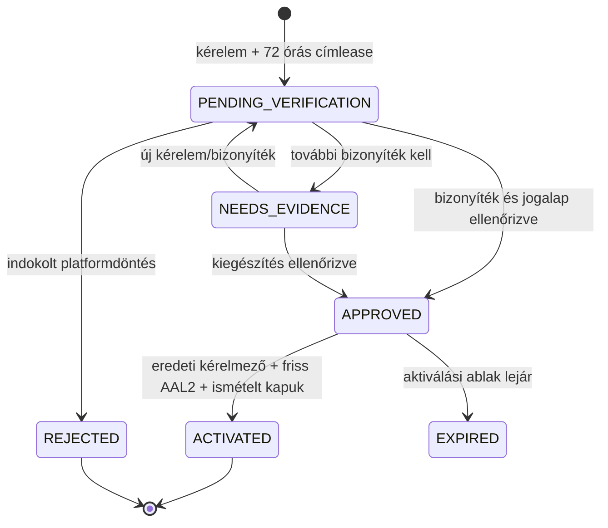

# PanelLakó multitenancy – platform-review és közösségaktiválás (v0.10.1)

**Dátum:** 2026-08-28
**Állapot:** repository-szintű implementáció; live Supabase-migráció és produkciós deploy nem történt
**Előzmény:** [v0.10.0 implementációs állapot](./10-implementation-status-v0.10.0.md)

## 1. Lezárt cél

A v0.10.0-ban szándékosan request-only állapotban hagyott újközösség-felvétel
most végrehajtható, de nem egyetlen adminisztrátori kattintással. A folyamat két,
egymástól független jogosultsági aktusra bomlik:

1. a platform megbízható szerveroldali review-folyamata ellenőrzi a címet, a
   működési modellt, a jogalapot és az átlátszatlan bizonyítékreferenciákat;
2. a kérelem eredeti beküldője friss AAL2/TOTP munkamenettel aktiválja az
   előzetesen jóváhagyott közösséget.

Sem az attestációk száma, sem fuzzy címegyezés, sem a platform-review önmagában
nem hoz létre workspace-et, tagságot, mandátumot vagy adminszerepet.

## 2. Új adatbázis-szerződés

Az additív `20260828122000_community_activation_review.sql` migráció:

- append-only `community_creation_reviews` történetet hoz létre;
- a review-azonosítót, az aktiválási határidőt és az aktiválás valamennyi
  provenance-azonosítóját a `community_creation_requests` rekordhoz köti;
- az `ACTIVATED` állapotot terminális, teljes rekordalakkal engedi;
- a legal formot `CONDOMINIUM` vagy `UNDIVIDED_COMMON_OWNERSHIP` értékre, az
  albetétszámot 1–5000 tartományra korlátozza;
- subject-scoped sajátkérelem-listát, service-role review-listát, review-commandot
  és claimant-bound aktiváló commandot ad;
- minden új tábla RLS-t és explicit grant/revoke szerződést kap.

### Append-only review

A review-sor nem módosítható és nem törölhető. Tartalmazza:

- a request azonosítóját;
- normalizált reviewer actort;
- opcionális, tényleges profile-kapcsolatot;
- döntést és kötelező indoklást;
- ellenőrzési módszert;
- kizárólag átlátszatlan bizonyítékreferenciákat;
- reviewer-scope-olt idempotency kulcsot;
- létrehozási időpontot.

Név, lakcím, dokumentumtartalom vagy nyers fájl nem kerülhet a reference
mezőbe. A referencia formája például `official-register:<opaque-id>` vagy
`community-resolution:<opaque-id>`; az érzékeny dokumentum külön, hozzáférés-
vezérelt tárban marad.

## 3. Jogi és governance routing

| Működési mód | Jelenleg aktiválható jogi forma | Elfogadott ellenőrzési mód | Fail-closed szabály |
|---|---|---|---|
| `REPRESENTATIVE_MANAGED` | `CONDOMINIUM` | `OFFICIAL_REGISTER` | más legal form vagy bizonyíték nem hoz létre közös képviselői mandátumot |
| `REPRESENTATIVE_MANAGED` | `CONDOMINIUM` | `SIGNED_MANDATE` | csak a Tht. 64/A szerinti átmenetben; aktiváláskor is újraellenőrzött hard cutoff |
| `BOARD_MANAGED` | `CONDOMINIUM` | `OFFICIAL_REGISTER` vagy átmenetileg `SIGNED_MANDATE` | self-managed határozat nem használható |
| `SELF_MANAGED` | `CONDOMINIUM`, legfeljebb 6 albetét | `SELF_MANAGED_RESOLUTION` | 6 fölött assisted legal review, automatikus aktiválás nincs |
| `SELF_MANAGED` | `UNDIVIDED_COMMON_OWNERSHIP` | `SELF_MANAGED_RESOLUTION` + külön Ptk.-jogalap referencia | mindkét típusos bizonyíték kötelező |

A társasházi törvény hatályos 64/A. §-a szerint az átmeneti, nyilvántartástól
független képviseleti igazolás 2026. október 31-ig alkalmazható. A kód ezért
2026. november 1-jétől szerveroldalon elutasítja a puszta `SIGNED_MANDATE`
aktiválást, és az előtte létrejövő átmeneti mandátum sem maradhat érvényes a
cutoff után. A legfeljebb hatlakásos társasház külön szabályát a Tht. 13. § (3)
adja; ez nem jelent automatikus founder-admin jogot, továbbra is dokumentált
közösségi döntés és platform-review kell.

Hivatalos forrás: [2003. évi CXXXIII. törvény a társasházakról – Nemzeti Jogszabálytár](https://njt.hu/jogszabaly/2003-133-00-00).

## 4. Két jogosultsági autoritás

### 4.1. Platform-review

A `/api/superadmin/community-requests` route:

- először a meglévő, aláírt superadmin munkamenetet ellenőrzi;
- state-changing kérésnél same-origin `Origin`/`Host` és `Sec-Fetch-Site`
  ellenőrzést végez;
- méret-, mező-, UUID-, státusz-, módszer-, bizonyíték- és rate-limit kapukat
  alkalmaz;
- a reviewer identityt kizárólag a szerver `SUPERADMIN_EMAIL` értékéből veszi,
  kliensből soha;
- a request valódi legal form/governance értékét service-role lekérdezésből
  ellenőrzi;
- a felületi referenciasort típusos JSON objektummá alakítja;
- csak ezután hívja a service-role-only review RPC-t.

Az `APPROVE` eredménye `APPROVED`, nem `ACTIVE`: a review önmagában nem ad
tenantjogot. A review RPC a kérelmező saját reviewer-emaillel történő
jóváhagyását is elutasítja.

### 4.2. Kérelmezői aktiválás

Az `activate_approved_community_creation_request` kizárólag akkor futhat, ha:

- `auth.uid()` megegyezik az eredeti `claimant_profile_id` értékkel;
- a request `APPROVED`, nem aktivált és nem lejárt;
- az approval provenance egy append-only `APPROVE` review-ra mutat;
- az Auth által kiadott JWT `aal2` szintű, és a kvalifikáló MFA időpont legfeljebb
  15 perces;
- a governance-jogalap és bizonyíték az aktiválás pillanatában is érvényes;
- a cím továbbra sem tartozik másik aktív közösséghez;
- a foglalt UUID-k még szabadok;
- a kérelmező igazolt profile–person kapcsolata aktív.

Az MFA-hiba strukturált `MFA_STEP_UP_REQUIRED` kódot ad. Az onboarding erre a
`/account/security?next=/onboarding` útvonalra irányít, majd ugyanaz az
idempotens aktiválás újrapróbálható.

## 5. Atomi aktiválási eredmény

Egyetlen PostgreSQL-tranzakció hozza létre:

1. a legacy-kompatibilis `buildings` rekordot;
2. az `ACTIVE` `physical_buildings` és `workspaces` rekordot ugyanazzal a
   fenntartott UUID-val;
3. a workspace–building és building–address kapcsolatot;
4. a kérelemben ellenőrzött számú, kezdeti `APARTMENT` albetétet;
5. a kérelmező semleges, aktív workspace-tagságát és nyitott membership periodját;
6. a működési módhoz tartozó, `VERIFIED` mandátumot;
7. a mandátumhoz kötött `COMMON_REPRESENTATIVE_ADMIN`, `BOARD_ADMIN` vagy
   `SELF_MANAGED_ADMIN` role assignmentet;
8. ahol jogilag igaz, a legacy role-projekciót;
9. az authorization audit eseményt;
10. az `ACTIVATED` request-státuszt és valamennyi provenance ID-t.

Bármely hiba teljes rollbacket okoz. Nem maradhat aktív workspace cím,
membership, mandátum vagy adminszerep nélkül.

## 6. Fontos kapcsolat-szétválasztás

A kérelmező aktiváláskor közösségi admin/koordinátor lehet, de ettől nem válik
automatikusan egy albetét tulajdonosává vagy lakójává. Ez tudatos védelem:

- a képviselő nem feltétlenül lakik az épületben;
- a self-managed koordinátor technikai szerepe sem bizonyít tulajdont;
- ownership és occupancy csak külön, bizonyítékkal felülvizsgált unit-claimből
  jöhet létre;
- mérődiktálás, saját pénzügy és tulajdonosi szavazás csak a megfelelő, külön
  unit-kapcsolat után érhető el.

Az induló albetétek `1..N` jelölése ideiglenes törzsadat. A jogosult admin a már
megvalósított albetétkezeléssel pontosíthatja őket; import és tömeges átnevezés
továbbra is külön rollout-tétel.

## 7. Mandátum-verifikáció mint authorization-kapu

Az effektív admin-capability nem következhet pusztán egy `ACTIVE` mandate sorból.
A v0.10.1 hardening az admin authority számításában `verification_status =
'VERIFIED'` feltételt is követel. Emiatt a régi adatokból létrehozott `CLAIMED`
mandátumok nem válnak észrevétlenül teljes adminjoggá.

A fix, szintetikus bemutatófiók külön, exact UUID + email + demo-flag egyezéssel
kap migrációs verifikációt, így a nyilvános prezentációs környezet működése
megmarad. Ez a kivétel más fiókra, címre vagy workspace-re nem általánosítható.

## 8. Idempotencia és versenyhelyzetek

- reviewer actor + review idempotency key egyedi;
- claimant + activation command + idempotency key egyedi;
- ugyanaz az aktiválási request ismételt hívásra ugyanazokat a létrehozott
  azonosítókat adja vissza;
- request sorzár és address-scope advisory transaction lock sorosítja az azonos
  címért versenyző aktiválásokat;
- aktiválás előtt ismételt exact-address ellenőrzés fut;
- fuzzy találat csak review-jelölt, automatikus merge soha.

## 9. Felületek

### Superadmin

Az új „Közösségi kérelmek” fül:

- státusz szerint listáz;
- megmutatja a címet, legal formot, governance módot és albetétszámot;
- csak a governance-hez megengedett verification methodot kínálja;
- validálja a típusos opaque reference-eket;
- külön megerősítést kér az approval előtt;
- egyértelműen jelzi, hogy az approval után még a kérelmező MFA-aktiválása kell.

### Onboarding

A kérelmező saját creation requestjei megjelennek a create ágon. `APPROVED` és
még érvényes requestnél elérhető az MFA-védett aktiváló művelet; lejárt ablaknál
nem jelenik meg aktív CTA. Siker után a rendszer az új workspace-re irányít.

Minden új szöveg a magyar és angol locale resource-ban azonos kulcsszerkezettel
szerepel, a komponensek a közös `useI18n()` hookot használják.

## 10. Bizonyítási állapot

Az ellenőrzési eredmények a lezáró [v0.10.1 verziózási jegyzőkönyvben](../../../versioning/28082602_v0.10.1_community-activation-closure.md)
szerepelnek. A repository-szintű PASS nem jelent hosted vagy produkciós PASS-t.

### Továbbra is HOLD produkció előtt

- read-only live schema/data/RLS/Storage drift audit;
- backup és visszaállítási próba;
- staging Supabase apply és két-tenant adversarial E2E;
- Supabase Auth SMTP/redirect/TOTP ellenőrzés;
- a jelenlegi env-backed superadmin azonosítás cseréje névre szóló, visszavonható,
  AAL2-es platform-operator identityre;
- legacy, nem demo `CLAIMED` képviseleti mandátumok egyenkénti review-ja;
- jogi/source re-check legkésőbb 2026. szeptember 30-án a 2026. október 31-i
  cutoff változatlanságáról;
- feature-flag rollout, canary és dokumentált rollback.

Live adatbázis-módosítás, deploy, commit és push nem része ennek a repository-
szintű implementációs körnek.

A staff-, agency-, content-, outbox-, vote- és tenant API lezárás egységes
implementációs állapotát a [12. fejezet](./12-operational-multitenancy-closure-v0.10.1.md)
rögzíti.
