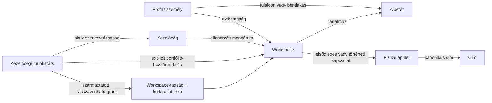

# PanelLakó multitenancy – operatív lezárás (v0.10.1)

**Dátum:** 2026-08-28
**Állapot:** repository-szintű implementációs jelölt; éles Supabase-migráció és produkciós deploy nem történt
**Előzmény:** [v0.10.0 alapimplementáció](./10-implementation-status-v0.10.0.md) és [közösségaktiválás](./11-community-review-and-activation-v0.10.1.md)

## 1. Lezárt termékhatár

A v0.10.1 a multitenancy tervből azokat az operatív folyamatokat zárja le,
amelyek nélkül a domainmodell önmagában még nem adott volna biztonságosan
használható többépületes rendszert:

- platform által ellenőrzött új közösség létrehozása és kérelmezői aktiválása;
- emailhez kötött lakói, tulajdonosi, munkatársi és megbízotti meghívások;
- kezelőcéges portfólió, központi staff és explicit házankénti jogosultság;
- dokumentum- és közleményközönség tenant- és albetétszintű védelme;
- címzettképzés és kézbesítési outbox ugyanabból az authorization-predikátumból;
- közgyűlési jelenlét és tulajdonosi szavazás szerver által származtatott joga;
- reminder, ticket, pénzügy, mérőóra, munkalap, utility, storage, környezet és
  közlekedés workspace-határolása;
- adatbázis-szintű kompozit workspace-integritás és default-deny RLS.

A tenant továbbra is a lakóközösségi `workspace`. A kezelőcég portfóliógyökér,
de nem válik tenanttá, és egy kezelőcégi munkaviszony önmagában egyetlen ház
adatához sem ad hozzáférést.

## 2. Végleges kapcsolatmodell



Az agency-munkatárs effektív tenantjogának konjunkciója:

```text
engedélyezett =
  aktív kezelőcégi munkaviszony
  ÉS aktív, VERIFIED kezelőcégi mandátum a workspace-re
  ÉS explicit, aktív portfólió-hozzárendelés
  ÉS aktív, a hozzárendelésből származtatott workspace grant
  ÉS a role által adott megfelelő capability
  ÉS az erőforrás workspace-scope-ja megegyezik
  ÉS minden időbeli érvényességi ablak nyitott
```

Ez megszünteti a „100 ház = 100 kézzel karbantartott, egymástól független
szerepkör” problémát, de nem vezeti be az ellenkező, veszélyes szélsőséget sem,
amelyben az agency összes dolgozója automatikusan minden házat lát.

## 3. Adatbázis-migrációk és felelősségük

| Migráció | Lezárt szerződés |
|---|---|
| `20260828120000_multitenancy_foundation.sql` | Workspace-, cím-, épület-, albetét-, party-, membership-, relationship-, mandate-, delegation-, role-, invitation- és audit-alapmodell. |
| `20260828121000_multitenancy_rls_cutover.sql` | Új és legacy tenanttáblák fail-closed RLS/Storage cutoverje és workspace-aware cache-védelem. |
| `20260828122000_community_activation_review.sql` | Kétfázisú platform-review, címjelölt-feloldás és kérelmezői AAL2-aktiválás. |
| `20260828123000_staff_invitation_closure.sql` | Emailhez kötött, lejáró, egyszer használható staff/owner invitation; delegálási és owner-claim korlátok. |
| `20260828124000_content_audience_closure.sql` | Típusos közlemény- és dokumentumközönség, albetétcélzás, acknowledgement és Storage-predikátum. |
| `20260828125000_vote_integrity_closure.sql` | Explicit szavazásnyitás, profile-bound attendance, tulajdonosi entitlement és egy albetét/határozat/ballot invariáns. |
| `20260828126000_multitenancy_integrity_closure.sql` | Aktiválási provenance és `document_units` kompozit workspace-idegen kulcsok. |
| `20260828127000_announcement_delivery_outbox.sql` | Idempotens, profilazonosító-alapú kézbesítési outbox ugyanazzal az audience-predikátummal. |
| `20260828128000_content_command_closure.sql` | Tranzakcionális dokumentumközönség-parancs, származtatott audience és arbitrary-profile helper tiltása. |
| `20260828129000_agency_portfolio_workflow.sql` | Kezelőcég, munkatársi meghívás, explicit workspace-portfólió, grant-projekció és visszavonási életciklus. |

Minden magas kockázatú command `SECURITY DEFINER`, fixált `search_path`, explicit
grant/revoke, caller-bound `auth.uid()`, capability-, scope-, idő- és ahol kell
AAL2-ellenőrzés mellett fut. A publikus táblák közvetlen írása nem kerülőút a
commandok körül.

## 4. Közösség létrehozása és cím-egyszeriség

Az új ház nem közvetlen `INSERT` eredménye. A kérelmező foglalási lease-szel és
normalizált címmel kérelmet hoz létre. A platform-folyamat:

1. exact és `pg_trgm` fuzzy címjelölteket keres;
2. legal form, governance mód, jogalap és típusos, átlátszatlan
   bizonyítékreferencia alapján dönt;
3. 0,85 vagy nagyobb fuzzy találatnál explicit `NOT_DUPLICATE` vagy
   `LINK_EXISTING` operátori feloldást követel;
4. append-only review-t ír, de jóváhagyáskor még nem ad tenantjogot;
5. az eredeti kérelmező friss AAL2 munkamenetével, ismételt cím- és jogalapkapu
   után egy tranzakcióban hozza létre a workspace-et, épületet, albetéteket,
   tagságot, VERIFIED mandátumot és admin role-t.

Fuzzy egyezés soha nem automatikus merge. Az aktiválás teljes provenance-alakot
követel; részleges, admin nélküli vagy mandátum nélküli aktív workspace nem
maradhat vissza.

## 5. Tagság, tulajdon, bentlakás és munkatárs

### 5.1. Lakó és tulajdonos

- Fiók csak identitás; tenantjogot nem ad.
- Csatlakozási kérelem csak már aktív workspace és annak aktív albetétje felé
  hozható létre.
- A `RESIDENT` és `OWNER` külön relationship; ugyanaz a személy több albetéthez,
  több workspace-ben is kapcsolható.
- A kezelő ellenajánlatot adhat, például tulajdonosi kérés helyett lakói jogot;
  az új jogcímet a kérelmezőnek kell elfogadnia.
- Meghíváskor és elfogadáskor is újraellenőrzött az email, a workspace, az
  albetét és a kibocsátó aktuális jogosultsága.
- Owner invitation csak `CLAIMED` tulajdonosi kapcsolatot hoz létre; pénzügyi,
  dokumentum- és szavazati tulajdonosjog csak külön `VERIFIED` kapcsolatból
  származhat.

### 5.2. Közvetlen megbízott és staff

- A meghívás semleges workspace-tagságot hoz létre, nem lakói albetétkapcsolatot.
- Admin szerepkör nem osztható a korlátozott staff/delegation paranccsal.
- A delegálás explicit capability-listás, lejáró, nem továbbdelegálható és
  visszavonható.
- Elfogadáskor a kibocsátó aktív, aktuális authorityje ismételt kapu; egy
  időközben elvesztett adminjoggal kiadott token nem léptet be munkatársat.

### 5.3. Kezelőcég és portfólió

- Kezelőcéget csak friss AAL2 munkamenettel lehet létrehozni.
- A staff meghívás emailhez kötött, lejáró, egyszer használható és auditált.
- Egy agency csak olyan workspace-re rendelhető, ahol a hozzárendelőnek aktív,
  közvetlen, `VERIFIED` mandátumból származó admin authorityje van.
- Az agency-mandátum nem élhet tovább a forrásmandátumnál.
- A munkatárs agency-role-ja kanonikus workspace role/capability készletre
  vetül; a projekció eredete nyomon követett.
- Staff-revoke vagy portfolio-end lezárja a kizárólag e projekcióból származó
  grantokat, de nem töröl független, más jogalapú workspace-tagságot vagy role-t.

## 6. Dokumentumok, közlemények és kézbesítés

A láthatóság nem kliensoldali címke. Az adatbázis ugyanazt az audience-szabályt
használja a dokumentum metaadatára, az albetétcélzásra, az olvasási
visszaigazolásra és a Storage objektumra.

Dokumentumközönség váltásakor egyetlen RPC:

1. zárolja a dokumentumot;
2. ellenőrzi a `document.manage` capabilityt és a workspace-et;
3. validálja, hogy minden célalbetét ugyanahhoz a workspace-hez tartozik;
4. egy tranzakcióban cseréli a láthatóságot és a kapcsolótáblát;
5. idempotencia- és auditrekordot ír.

Az `audience` származtatott mező; közvetlen átírása adatbázis-hibát ad. Az olyan
régi SECURITY DEFINER helperek, amelyek tetszőleges profile ID-ra válaszoltak,
nem futtathatók `authenticated` szerepből; a policyk kizárólag `auth.uid()`-hoz
kötött wrapperen keresztül kérdeznek.

A közlemény kézbesítési outbox csak profilazonosítót tárol, emailcímet nem. A
címzettek az aktív workspace-tagság és ugyanazon `can_read_announcement`
predikátum metszetéből származnak. A worker kizárólag service-role-ból olvashat
és frissíthet; a tényleges külső email worker telepítése külön üzemeltetési HOLD.

## 7. Közgyűlési szavazás

Szavazat csak explicit `OPEN` szavazási állapotban adható le. A jelenlét
profile-hoz kötött és a ballot után nem írható át vagy törölhető.

- tulajdonos csak saját, aktív `VERIFIED` tulajdonosi kapcsolatával rögzíthet
  jelenlétet és szavazhat;
- manager más nevében csak explicit `voter_profile_id` megadásával, azonos
  jelenléti rekorddal és igazolt tulajdonosi joggal szavazhat;
- implicit „manager mint tulajdonos”, másik albetét vagy nem tulajdonos profil
  fail-closed;
- a kliens nem adhat saját szavazati súlyt vagy tulajdoni hányadot;
- közvetlen attendance- és vote-írás helyett kizárólag a command RPC-k
  használhatók.

## 8. Meglévő modulok tenant-hardeningja

Az alkalmazás szerverműveletei a route-ban kapott building/workspace UUID-t csak
lokátornak tekintik. A tényleges context szerveroldali feloldásból származik.
Ez érinti többek között:

- ticketeket és munkalapokat;
- pénzügyet és exportot;
- mérőállást és szolgáltatói API-t;
- remindert, értesítést és push-t;
- Stripe checkout/portal/webhook folyamatot;
- storage signed URL-t;
- zaj-, hulladék-, környezeti és közlekedési cache-eket.

A koordináta-alapú, tenantadatot nem olvasó közadat-route publikus maradhat. A
building-ID-ból tenant/cache adatot olvasó útvonal workspace-tagságot és
`environment.read` capabilityt követel. A gépi háttérfrissítések külön,
időzítésbiztosan ellenőrzött service secretet használnak.

## 9. Regresszióvédelmi invariánsok

1. A meglévő `/w/<legacy-building-uuid>` URL-ek változatlanul működhetnek.
2. A fix demófiókok lejárat nélküli bemutató-hozzáférése megmarad.
3. Auth-regisztráció, ismert UUID vagy UI-ban megjelenő role label nem jogosultság.
4. Más workspace objektumának létezése generikus hibán túl nem szivároghat.
5. Minden tenantkapcsolatot kompozit FK vagy scope-trigger is véd, ahol a legacy
   séma ezt lehetővé teszi.
6. Tulajdon, bentlakás, tagság, mandátum és staff-viszony nem olvad össze.
7. Lejárt vagy visszavont mandátumból/delegációból új művelet nem engedélyezett.
8. Visszavonás történetet zár le; audit- és pénzügyi sorokat nem töröl.
9. Származtatott közönség, címzettlista és szavazati jog nem bízható a kliensre.
10. Legacy kompatibilitási projekció csak ugyanabban a DB-tranzakcióban készülhet.

## 10. Bizonyítási modell

A lezárás négy külön bizonyítási szintet tart fenn:

| Szint | Mit bizonyít | Mit nem bizonyít |
|---|---|---|
| Statikus/invariáns teszt | A forrásban jelen van a várt authorization-, scope- és grant/revoke szerződés. | Nem bizonyít PostgreSQL futásidejű viselkedést. |
| Izolált PostgreSQL 18 | A migráció apply/reapply, constraint, RLS, RPC, tranzakció és negatív támadási canary működik. | Nem bizonyít live Supabase driftmentességet. |
| TypeScript/lint/build | Az alkalmazás lokálisan fordul, a szerződések típushelyesek és a route-gráf felépül. | Nem bizonyít hitelesített böngészős vagy hosted flow-t. |
| Staging/production E2E | Valódi Auth, SMTP, Storage, környezeti konfiguráció és két-tenant folyamat működik. | Ebben a körben nem futott. |

A konkrét parancsok, tesztszámok és eredmények a
[v0.10.1 verziózási jegyzőkönyvben](../../../versioning/28082602_v0.10.1_community-activation-closure.md)
szerepelnek.

## 11. Produkciós HOLD-ok

Repository-szinten a funkció implementálható jelölt, de éles használathoz még
kötelező:

1. read-only live schema-, data-, RLS-, Storage-, function- és orphan-audit;
2. adatbázis-mentés és bizonyított visszaállítás;
3. staging/Supabase branch apply és idempotens reapply;
4. két-tenant adversarial E2E valódi auth-identitásokkal;
5. SMTP, redirect allowlist, TOTP enrollment és step-up böngészős ellenőrzése;
6. névre szóló, visszavonható, AAL2-es platform-operator identity az env-backed
   superadmin helyett;
7. mandátum-, evidence- és jogi source-reconciliation az időbeli cutoffok előtt;
8. külső announcement-email worker, retry/dead-letter és kézbesítési monitoring;
9. KMS-, kulcslifecycle-, backup- és retention-terv a valódi crypto-shreddinghez;
10. feature flag, canary, megfigyelési küszöb és dokumentált rollback.

Live adatbázis-módosítás, deploy, commit és push nem része ennek a repository-
szintű lezárásnak.
