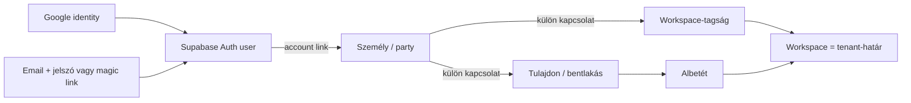
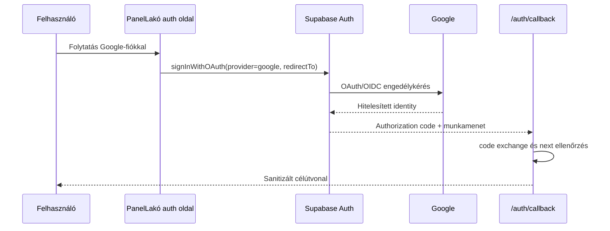
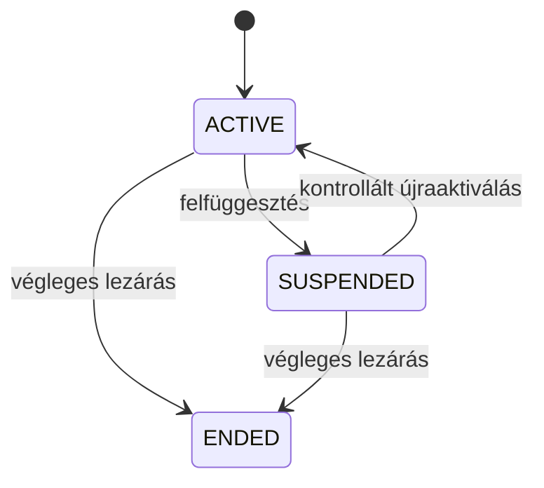

# PanelLakó multitenancy – Google Auth, lakónyilvántartás és authorization hardening (v0.10.4)

**Dátum:** 2026-08-29

**Branch:** `codex/google-oauth-multitenancy-completion`

**Állapot:** v0.10.4 implementáció productionben; v0.10.5 provider-, deploy-, DB- és baseline tenant-izolációs lezárás PASS

**Előzmény:** [v0.10.1 operatív lezárás](./12-operational-multitenancy-closure-v0.10.1.md) és [v0.10.3 production bizonyíték](../../../versioning/29082601_v0.10.3_production-multitenancy-closure.md)

## 1. Eredmény és tényleges határ

A v0.10.4 a már élesített v0.10.3 multitenancy-alapra építve az alábbi, korábban
hiányzó operatív folyamatokat készíti elő repository-szinten:

- Google-fiókos belépés és fióklétrehozás a meglévő email+jelszó és magic-link
  módok mellett;
- kizárólag a normalizált workspace-RPC-kből származó, fail-closed alkalmazási
  tenant-context;
- a capability, aktív workspace, aktív tagság és ellenőrzött mandátum teljes
  provenance-láncának helyreállítása;
- tenantbiztos push-címzettképzés;
- auth-fiók nélkül is felvehető személyek, valamint tulajdonosi és bentlakási
  kapcsolataik történeti nyilvántartása;
- tagság felfüggesztése, lezárása és kontrollált újraaktiválása;
- meghívó-visszavonás, kérelmezői csatlakozás-visszavonás és bizonyítékpótlás;
- legfeljebb 500 albetét kontrollált CSV-előnézete és atomi importja;
- a teljes új felületi kiegészítés magyar és angol lokalizációja.

Az öt új migráció titkosított backup után a production adatbázison lefutott, a
ledger és a read-only sémaverifikáció PASS. A v0.10.4 alkalmazáskód mainre
merge-elve és productionbe deployolva. A v0.10.5 lezárásban a Google Cloud
projekt, External OAuth app és web kliens mellé a Supabase provider, a kanonikus
Site URL és allowlist is éles konfigurációt kapott. A hosted authorize canary,
a renderelt auth UI, a post-rollout DB Verify és a baseline két-tenant negatív
próba PASS. A dedikált Google tesztidentitással végigvitt consent/callback/
account-linking kör ettől külön **NOT_RUN** bizonyítási határ.

## 2. Változatlan domainalapelvek

A Google identity és a lakónyilvántartás bevezetése nem módosítja a tenant
fogalmát:

Az invariánsok:

1. Az identity provider csak fiókot hitelesít; tenantot, albetétet, szerepkört,
   tulajdont vagy kezelői mandátumot nem ad.
2. A workspace-tagság, a tulajdon, a bentlakás, a role és a mandátum külön
   életciklusú rekord.
3. Egy személy több albetéthez és több workspace-hez kapcsolódhat.
4. Egy auth-fiók nélküli személy nyilvántartható tulajdonosként vagy lakóként,
   de ettől nem kap digitális hozzáférést.
5. Egy UUID ismerete, Google-bejelentkezés vagy UI-ban látható role-címke nem
   authorization-bizonyíték.
6. Minden magas kockázatú állapotváltás capability-, scope-, idempotencia-,
   audit- és ahol szükséges AAL2-kaput használ.

## 3. Google-fiókos regisztráció és belépés

### 3.1. Alkalmazási folyamat

A `/register` és `/login` oldal közös, akadálymentes Google-gombot használ.
Mindkét oldal a Supabase `signInWithOAuth` hívását indítja `google` providerrel,
majd a meglévő `/auth/callback` route-ra tér vissza.

A visszatérési útvonal szabályai:

- a `next` értéket a közös `sanitizeReturnTo` szerződés tisztítja;
- abszolút külső URL, protokoll-relative útvonal és nem engedélyezett cél nem
  használható open redirectként;
- regisztráció alapértelmezett célja `/onboarding`;
- belépés alapértelmezett célja `/app`;
- a már meglévő invitation/onboarding `next` útvonal megmarad, így az OAuth nem
  töri meg a meghívás beváltását vagy a csatlakozási folyamatot;
- az OAuth kérés nem küld workspace-, albetét- vagy role-metaadatot a kliensből.

### 3.2. Miért ugyanaz a gomb regisztrációhoz és belépéshez?

A Supabase/Google OAuth flow az identity provider szintjén kezeli, hogy a
Google-azonosítóhoz már tartozik-e Auth user. A termékoldali különbség a
visszatérési cél:

- új fióknál az onboarding folytatódik;
- meglévő fióknál a workspace-választó vagy a sanitizált meghívási cél nyílik.

Ez elkerüli a párhuzamos „Google-regisztráció” és „Google-belépés” backend
implementációt, miközben a két felület szövege és felhasználói szándéka külön
marad.

### 3.3. Production konfigurációs előfeltételek

A repository-kód önmagában nem kapcsol be külső identity providert. Hosted
működéshez mindegyik feltétel szükséges:

1. Google Cloud OAuth web client létrehozása;
2. a Google authorized redirect URI értéke:
   `https://wzromwxpjlyrqbdiapep.supabase.co/auth/v1/callback`;
3. a Supabase Google provider engedélyezése valódi kliens-ID-val és secrettel;
4. a Supabase redirect allowlistben legalább
   `https://panellako.hu/auth/callback` engedélyezése;
5. a consent screen, support email és domain-verifikáció üzemi ellenőrzése;
6. hosted regisztráció, meglévő fiókos belépés, elutasított consent,
   callback-hiba és invitation-visszatérés böngészős E2E-je.

**Aktuális tényhatár (2026-08-30):** a dedikált Google Cloud projekt és kliens,
a Supabase provider read-back, a kanonikus callback allowlist, a PKCE-s hosted
authorize canary és a renderelt `/login` + `/register` Google-gomb bizonyított.
Az ideiglenes GitHub credentialek és a letöltött kliens-JSON törölve, maradvány
0. Teljes consent/callback/account-linking E2E-hez külön teszt Google identity
szükséges; a valódi credential továbbra sem kerülhet repositoryba,
dokumentációba vagy naplóba.

## 4. Fail-closed workspace authorization

### 4.1. Legacy fallback eltávolítása

Az alkalmazás workspace-listája és workspace-contextje kizárólag:

- `get_my_workspaces`;
- `get_workspace_context`

RPC-ből származhat. Hiányzó vagy hibás RPC esetén az eredmény üres vagy `null`;
a kód nem esik vissza `get_my_buildings`, legacy `memberships.role`, mock vagy
szintetizált capability használatára.

Ennek oka, hogy a legacy role nem hordozza a forrásmandátum, delegáció,
érvényességi idő és workspace-státusz teljes bizonyítékát. A részleges fallback
látszólagos rendelkezésre állást adna, de authorization-eszkalációt okozhatna.

### 4.2. Capability provenance helyreállítása

A `20260829120000_authorization_push_recipient_closure.sql` forward-only
migráció a központi `private.has_workspace_capability` függvényben megköveteli:

- az `ACTIVE` workspace-et;
- az `ACTIVE` workspace-tagságot;
- a nyitott membership periodot;
- az aktív és időben érvényes role assignmentet;
- közös képviselői, board-admin vagy self-managed admin role esetén az aktív,
  időben érvényes és `VERIFIED` forrásmandátumot;
- delegált role esetén az aktív delegációt, annak capability-allowlistjét és az
  aktív, `VERIFIED` forrásmandátumot;
- tulajdonosi szavazatnál külön a `VERIFIED` tulajdonosi entitlementet.

Az `effective_capabilities` ugyanazt a kaput hívja, ezért a UI-context és az
adatbázis authorization döntése nem térhet el pusztán materializált role-adat
miatt.

### 4.3. Tenantbiztos push-címzettképzés

A push API először `announcement.publish` capabilityt ellenőriz, majd a címzett
profilokat a service-role számára kizárólagosan elérhető
`resolve_workspace_push_recipients(workspace_id, target_role)` RPC oldja fel.

A resolver:

- csak aktív workspace aktív, nyitott időszakú tagjait veszi figyelembe;
- `all`, `lako` és `manager` célcsoportot enged;
- a manager-besorolást az effektív role/mandate/delegation láncból származtatja;
- idegen workspace tagságát nem vonja be;
- nem enged közvetlen authenticated futtatást;
- nem szivárogtat profile ID listát a kliensnek.

## 5. Offline személy- és albetétkapcsolati nyilvántartás

### 5.1. Miért kell auth-fiók nélküli személy?

A társasház jogi és operatív nyilvántartása nem tehető függővé attól, hogy
minden tulajdonos vagy lakó regisztrált-e már. A képviselő ezért felvehet egy
személyt névvel, majd ugyanazt a személyt több albetéthez kapcsolhatja. A
digitális hozzáférés csak későbbi, ellenőrzött `person_account_links` és aktív
workspace-tagság után jöhet létre.

### 5.2. Támogatott kapcsolatok

| Felületi kapcsolat | Domainírás | Tulajdoni hányad | Hozzáférést ad? |
|---|---|---:|---|
| Tulajdonos | `unit_ownerships` | igen | nem automatikusan |
| Tulajdonos és bentlakó | ownership + occupancy | igen | nem automatikusan |
| Bérlő/lakó | `unit_occupancies` | nem | nem automatikusan |
| Háztartástag | `unit_occupancies` | nem | nem automatikusan |
| Meghatalmazott bentlakó | `unit_occupancies` | nem | nem automatikusan |

A `create_workspace_person_relationship` command:

- `unit_relation.verify` capabilityt és 15 percen belüli AAL2-t követel;
- csak azonos, aktív workspace aktív albetétjéhez ír;
- meglévő személyt csak akkor fogad el, ha már ugyanazon workspace
  nyilvántartási körében van;
- tulajdonosi hányadot validál, occupancyhez hányadot nem enged;
- átlátszatlan bizonyítékreferenciát követel, nem nyers PII-dokumentumot;
- idempotens command receiptet és audit eseményt ír;
- az `OWNER_OCCUPANT` két domainkapcsolatát egyetlen tranzakcióban hozza létre;
- a szükséges legacy projekciót ugyanabban az adatbázis-tranzakcióban egyezteti.

### 5.3. Kapcsolattörténet és review

A `list_workspace_unit_relationships` egységes, tenant-szűrt nézetben adja vissza
a tulajdonosi és occupancy kapcsolatokat, beleértve a státuszt, forrást,
bizonyítékreferenciát, hányadot, érvényességi időt és lezárási okot.

A `review_workspace_unit_relationship` támogatja:

- `VERIFY`: ellenőrzött kapcsolat és bizonyíték;
- `DISPUTE`: vitatott kapcsolat indokkal;
- `END`: történeti lezárás indokkal.

Az állapotváltozás külön, immutable eseménytáblába kerül. A kapcsolatot nem
törli és nem írja felül történet nélkül.

## 6. Workspace-tagság életciklusa

A tagság és a személy–albetét kapcsolat továbbra sem azonos. Az admin a
`membership.suspend` capabilityvel az alábbi átmeneteket kérheti:

Biztonsági szabályok:

- a művelet friss AAL2-t, okot, idempotency keyt és auditot igényel;
- önmaga tagságát az admin ezzel a paranccsal nem módosíthatja;
- az utolsó effektív admin nem függeszthető fel és nem zárható le;
- felfüggesztés lezárja az aktuális membership periodot és az abból származó
  aktív jogosultságokat;
- újraaktiválás csak `SUSPENDED` állapotból lehetséges, új membership perioddal;
- `ENDED` állapot végleges; e command nem használható reaktiválására;
- minden átmenet append-only `workspace_membership_status_events` nyomot hagy.

## 7. Meghívási és csatlakozási életciklus

### 7.1. Meghívó visszavonása

Az arra jogosult admin csak `PENDING` membership invitationt vonhat vissza.
A művelet:

- `membership.invite` capabilityt és 15 percen belüli AAL2-t kér;
- kötelező, korlátozott hosszúságú indokot tárol;
- idempotens és auditált;
- a token későbbi beváltását a `REVOKED` státusz kizárja.

### 7.2. Saját csatlakozási kérelem visszavonása

A kérelmező kizárólag a saját, `DRAFT`, `PENDING` vagy `NEEDS_EVIDENCE`
kérelmét zárhatja le. A command optimista verzióellenőrzést használ; régi UI
állapotból érkező kérés `JOIN_REQUEST_VERSION_CONFLICT` hibával áll meg, nem írja
felül az időközben született kezelői döntést.

### 7.3. Bizonyítékpótlás

`NEEDS_EVIDENCE` állapotban a kérelmező 1–10 átlátszatlan
bizonyítékreferenciát adhat hozzá. A teljes készlet immutable
`join_request_evidence_events` eseményben marad, a kérelem verziója nő, állapota
pedig `PENDING` lesz. Nyitott `COUNTER_OFFER` esetén a két folyamat nem mosódik
össze: előbb az ellenajánlatot kell kezelni.

### 7.4. Explicit tulajdoni hányad és ellenajánlat-konkurencia

Tulajdonosi vagy tulajdonos-bentlakói jogviszonyhoz a rendszer nem talál ki
`1/1` tulajdoni hányadot. A számláló és nevező kötelezően, ugyanabban a
folyamatban halad végig:

- közvetlen adminisztrátori kapcsolatfelvétel és review;
- lakói csatlakozási kérelem és jóváhagyás;
- közös képviselői meghívás és beváltás;
- tulajdonosi ellenajánlat és kérelmezői elfogadás.

Nem tulajdonosi jogviszony tulajdoni hányadot nem hordozhat. A régi kliens-RPC
aláírások rolling deploy kompatibilitásból megmaradnak, de tulajdonosi kérésnél
hányad nélkül fail-closed állnak meg.

Az ellenajánlat elfogadása sorzár alatt ellenőrzi, hogy a kérelem továbbra is
`NEEDS_EVIDENCE`, nem járt le, és az elfogadott ajánlat a legújabb feloldatlan
ajánlat. Régi, felülírt, lejárt vagy terminális kérelemhez tartozó ajánlat nem
nyithatja újra a folyamatot; ugyanazon sikeres parancs biztonságos újrapróbálása
idempotens marad.

## 8. Atomi albetét-CSV import

### 8.1. Kliens és előnézet

A workspace-admin felület vessző- vagy pontosvessző-elválasztású CSV-t fogad,
magyar és angol fejléc-aliasokkal. Egy csomag 1–500 sort tartalmazhat. Az
előnézet a szerveroldali `preview_workspace_unit_import` RPC-t hívja, ezért a
kliens parser nem az adatbázis-integritás forrása.

Egy sor legalább:

- albetét-megnevezést;
- kategóriát (`APARTMENT`, `GARAGE`, `STORAGE`, `COMMERCIAL`, `OTHER`);
- opcionális szülő-megnevezést

tartalmaz. Az előnézet minden sorhoz `READY`, `CONFLICT` vagy `INVALID`
eredményt ad.

### 8.2. Adatbázis-kapuk

A közös belső validátor ellenőrzi többek között:

- az aktív workspace és a kompatibilis primary physical building invariánst;
- a normalizált megnevezés érvényességét;
- a csomagon belüli és meglévő albetétek közötti duplikációt;
- a támogatott kategóriát;
- a szülő létezését azonos workspace-ben és fizikai épületben;
- az önmagára mutató vagy ciklikus parent-kapcsolatot;
- a parent-child kategória és relation konzisztenciáját.

### 8.3. Apply szerződés

Az `apply_workspace_unit_import`:

- `unit.manage` capabilityt és 15 percen belüli AAL2-t követel;
- ugyanazzal a validátorral újraellenőrzi az egész csomagot;
- workspace-szintű advisory lockkal sorosítja a párhuzamos bulk importokat;
- konfliktus esetén `applied=false` eredményt ad és egyetlen albetétet sem hagy
  részlegesen létrehozva;
- egy tranzakcióban írja a normalizált és legacy kompatibilitási oszlopokat;
- a kapcsolt garázs/tároló `ACCESSORY_OF` relációit ugyanabban a tranzakcióban
  hozza létre;
- idempotens, SHA-256 request fingerprintet és immutable import receiptet
  használ;
- siker esetén audit eseményt és soronkénti létrehozott UUID eredményt ad.

## 9. Lokalizáció és felületi integráció

Az új auth, relationship registry, membership lifecycle, invitation/join
lifecycle és unit import felületi szövegek a meglévő i18n-rendszerben magyar és
angol kulcsot kaptak. Az adminfelület capability alapján jeleníti meg az egyes
műveleteket; a gomb elrejtése ugyanakkor nem authorization-kontroll, minden
command a szerver és az adatbázis oldalán újraellenőrzött.

## 10. Migrációs leltár

| Migráció | Felelősség |
|---|---|
| `20260829110000_workspace_relationship_registry.sql` | Offline személy, ownership/occupancy registry és history, membership suspend/end/reactivate, last-admin védelem, capability-kiegészítés. |
| `20260829120000_authorization_push_recipient_closure.sql` | Capability provenance, aktív workspace-kapu, effektív capability és service-role-only push-címzettfeloldás. |
| `20260829130000_invitation_join_lifecycle.sql` | Meghívó-visszavonás, saját join cancel, verziózott evidence resubmit és immutable evidence event. |
| `20260829140000_workspace_unit_bulk_import.sql` | 1–500 soros előnézet, közös validátor, AAL2-es atomi apply, import receipt és audit. |
| `20260829150000_ownership_share_join_flow_closure.sql` | Explicit tulajdoni hányad az invitation/join/counter-offer teljes láncában, valamint stale/expired/terminal offer védelem. |

Mind az öt migráció forward-only és explicit tranzakciót használ. A
repository-beli jelenlétük nem bizonyít production alkalmazást.

## 11. Tudatosan nem implementált, döntést igénylő területek

| Terület | Állapot | Miért nincs ebben a körben |
|---|---|---|
| Mandátumátadás képviselőváltáskor | **PRECONDITIONED / HOLD** | Átadó–átvevő authority, jogi bizonyíték, elfogadás, vitatás, cutoff és adatátadási szabály nincs termék/jogi szinten lezárva. |
| Identity/person merge és alias | **PRECONDITIONED / HOLD** | Téves összevonás cross-tenant és adatvédelmi kockázat; claim, szétválasztás és audit szerződés kell. |
| KMS és crypto-shredding | **PRECONDITIONED / HOLD** | DEK lifecycle, rotáció, backup/restore, retention és jogalap nélkül a titkosítás nem teljes törlési folyamat. |
| Cím merge/split/dispute | **PRECONDITIONED / HOLD** | Fuzzy jelölt nem bizonyít azonosságot; operátori authority, fellebbezés és történeti reláció kell. |
| Névre szóló platform-operator | **PRECONDITIONED / HOLD** | A jelenlegi env-backed superadmin helyett visszavonható, AAL2-es, auditált operátori identity külön kontrollsíkot igényel. |

Ezek nem „elfelejtett CRUD képernyők”. Biztonsági és jogi előfeltétel nélkül
történő implementálásuk gyengítené a már kialakított tenant-határt.

## 12. Bizonyítási állapot a lokális release-gate lezárásakor

| Kapu | Állapot | Tényhatár |
|---|---|---|
| Célzott migrációs contract Vitest | **PASS – 5 fájl, 37/37 teszt** | Registry, push, invitation lifecycle, bulk import és ownership-share closure. |
| Teljes Vitest | **PASS – 52 fájl, 324/324 teszt** | A teljes közös repository-diff, benne a production OAuth-workflow szerződése. |
| TypeScript | **PASS** | `npm run typecheck`. |
| ESLint | **PASS** | `npm run lint`. |
| Next.js production build | **PASS** | Helyi production build, 73/73 statikus oldal, `BUILD_ID=uNOl2tVsBk-ZtgnVoYD-X`; ez nem hosted proof. |
| Kombinált migráció apply/reapply/runtime canary | **PASS** | PostgreSQL 18.4; 110000–150000 apply + teljes reapply, mind az 5 canary a reapply után ismét PASS. |
| Production backup | **PASS** | AES-256-GCM + DPAPI, SHA-256 és visszafejtési ellenőrzés, 42 tábla/11 Auth user/33 Storage objektum. |
| Production Supabase migráció | **PASS** | Az öt új migráció külön workflow-runban, ledgerrel. |
| Production DB Verify | **PASS** | `33301298898`; minden kötelező kapu igaz, hiánylisták üresek. |
| Google Cloud OAuth projekt/app/kliens | **PASS** | External/public production consent, pontos Supabase callback. |
| Supabase Google provider | **PASS** | workflow `33301124824`; propagációs retry után Google authorize canary PASS. |
| Hosted auth felületek | **PASS** | `/login` és `/register` HTTP 200; mindkét Google-gomb renderelt, látható és engedélyezett. |
| Hosted Google authorize szerződés | **PASS** | HTTP 302 a `accounts.google.com` hostra, S256 PKCE, `openid`, `email`, `profile`. |
| Teljes Google account lifecycle E2E | **NOT_RUN** | Nincs dedikált teszt identity; személyes account-választás/consent/account-linking nem történt. |
| Hosted két-tenant baseline | **PASS** | run `443d35c7-f43b-419e-a1a4-87b3b907c11d`; manager 2, resident 1 tenant; negatív RPC/RLS/dashboard ellenőrzés és 11 táblás `cleanupVerified=true`. |
| Registry/lifecycle/import adversarial hosted E2E | **NOT_RUN** | Offline személy, több albetétes személy, suspended membership és concurrent import külön bővített canaryt igényel. |
| Production alkalmazásdeploy | **PASS** | merge `74c19280d4b793026764758fbb4ff18208a7208d`; Vercel `dpl_qjC3ao2gKt8q73bmWnNXRbshuZLb` READY. |
| Commit / push | **PASS** | v0.10.4 PR #261; v0.10.5 production closure PR #265. |

## 13. Production lezárás és bővített bizonyítási backlog

A providerbekötés, main deploy, post-deploy DB Verify és baseline két-tenant
negatív canary teljesült. A v0.10.4/v0.10.5 funkciók production kiadási állapota
lezárt; az alábbiak nem hiányzó alapimplementációk, hanem további, elkülönített
assurance-szintek:

1. dedikált Google tesztidentitással új/meglévő fiók, consent-elutasítás,
   callback-hiba, invitation return-to és account-linking browser E2E;
2. offline személy, több albetétes személy, felfüggesztett tagság és concurrent
   import bővített hosted adversarial E2E;
3. a külön `PRECONDITIONED / HOLD` döntési területek csak a hozzájuk tartozó
   jogi, adatvédelmi és operátori előfeltételek lezárása után implementálhatók.
