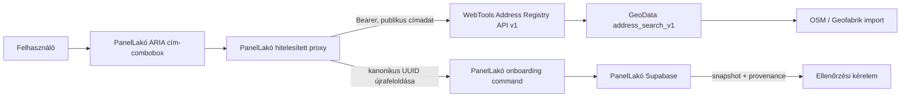

# Shared GeoData Address Registry v1

**Verzió:** PanelLakó v0.10.6
**Dátum:** 2026-08-30
**Hatókör:** magyarországi épületszintű címkeresés, kanonikus címidentitás és közösségi onboarding
**Adatforrás:** OpenStreetMap, elsődlegesen Geofabrik Hungary extractből betöltve
**Rendszerhatár:** külön GeoData Supabase projekt; a PanelLakó tenant-adatbázisa változatlanul külön projekt

## 1. Vezetői döntés

A `buuoyyfzincmbxafvihc` GeoData projektben már felépített OSM-címállományt
nem másoljuk át a PanelLakó alkalmazás-adatbázisába. A GeoData egy önálló,
verziózott, több alkalmazás által fogyasztható publikus referenciaadat-síkot
ad. A PanelLakó kizárólag szerverről, egy szűk olvasási API-n keresztül éri el.

Ez a felosztás egyszerre biztosítja, hogy:

- az egyszer betöltött és normalizált magyar címállomány több termékben újrahasznosítható;
- a PanelLakó user-, lakó-, workspace-, albetét- és jogosultsági adatai soha ne kerüljenek a GeoData projektbe;
- a GeoData service-role kulcsa soha ne kerüljön a PanelLakóba;
- a címforrás frissítése ne igényeljen minden fogyasztóban külön ETL-t;
- a PanelLakó auditálható cím-snapshotot őrizzen akkor is, ha a közös registry átmenetileg nem elérhető.

## 2. Rendszerhatárok



### GeoData tartalmazhat

- OSM node/way/relation forrásazonosítót;
- normalizált országot, irányítószámot, települést és közterületet;
- házszámot, tartományt, toldalékot és épületjelölést;
- publikus koordinátát és annak pontossági osztályát;
- dataset- és normalizálási verziót;
- keresési indexeket és publikus forrás-attribúciót.

### GeoData nem tartalmazhat

- PanelLakó felhasználót, sessiont vagy auth tokent;
- személyt, lakót, tulajdonost vagy kezelői munkatársat;
- workspace-et, tagságot, role-t, capabilityt vagy mandátumot;
- onboarding kérelem üzleti adatait;
- tenant dokumentumot, pénzügyet, mérőállást vagy auditadatot.

## 3. Kanonikus címkontraktus

A fogyasztói API verziója `1.0`. Egy kiválasztható találat kötelező mezői:

| Mező | Invariáns |
|---|---|
| `canonicalAddressId` | az aktuális normalizált címidentitás RFC 4122 UUID v5 értéke; korábbi UUID-k ugyanazon OSM source-lineage mentén feloldhatók |
| `sourceSystem` | `OSM` |
| `sourceRecordId` | `osm:node:<id>`, `osm:way:<id>` vagy `osm:relation:<id>` |
| `countryCode` | PanelLakóban kizárólag `HU` |
| `postalCode` | magyar címnél pontosan négy számjegy |
| `addressLevel` | kizárólag `BUILDING` |
| `latitude`, `longitude` | együtt szám vagy együtt `null` |
| `matchType` | `EXACT_HOUSE`, `PREFIX_HOUSE` vagy `FUZZY` |
| `datasetVersion` | az importált állomány verziója |
| `normalizationVersion` | a címképzési algoritmus verziója |
| `attribution` | kötelező OpenStreetMap-attribúció és hivatalos copyright URL |

A kanonikus UUID az aktuális normalizált címidentitásból determinisztikusan
készül, ezért változatlan normalizált rekordnál importonként stabil. Ha egy
forrásjavítás miatt a normalizált identitás változik, az append-only lineage
tábla a korábbi UUID-t ugyanazon OSM forrásrekord jelenlegi UUID-jára irányítja.
A resolve válasz ezt nem rejti el: külön közli a kért és feloldott UUID-t, az
`EXACT` vagy `LINEAGE_REDIRECT` típust és a forrásazonosítót. A PanelLakó csak e
mezők teljes belső egyezése esetén fogad redirectet, mindig a jelenlegi
kanonikus UUID-t tárolja, miközben az immutable kérelem-snapshot megőrzi az adott
üzleti parancsnál ténylegesen látott verziót. Az idempotencia stabil kulcsa nem a
változható normalizált UUID, hanem az OSM source-lineage.

## 4. Keresési és ajánlási logika

1. A kliens legalább három karakter után, 350 ms debounce-dzsal indít keresést.
2. A PanelLakó proxy előbb hitelesíti a felhasználót és adatbázisban atomikusan fogyasztja a felhasználói kvótát.
3. A WebTools API ellenőrzi a külön consumer bearer tokent és a bemenetet.
4. Az adatbázis minimum négy normalizált, nem pusztán általános/numerikus karaktert követel.
5. A `pg_trgm` KNN index legfeljebb 256 jelöltet ad a költséges rangsorolásnak.
6. A rangsor exact házszámot, prefixet, tokenegyezést és fuzzy hasonlóságot különböztet meg.
7. Legfeljebb nyolc, épületszintű magyar találat tér vissza.
8. A teljes kérés adatbázis-oldali időkorlátot és alkalmazásoldali timeoutot kap.

A publikus Nominatim szolgáltatást nem használjuk gépelés közbeni
autocomplete-ként. Az ingyenes OSM-adatot saját importból és saját indexből
szolgáljuk ki; így a felhasználói élmény és a terhelhetőség nem függ egy
közösségi végpont méltányos használati korlátaitól.

## 5. PanelLakó onboarding trust boundary

A böngészőben kiválasztott cím még nem megbízható adat. A kliens ezért csak az
opaque `canonicalAddressId` értéket küldi be. A szerver a mentés előtt újra
feloldja az azonosítót a registryből, majd csak az így visszakapott, validált
mezőkből készít snapshotot.

```text
kliens választás
  -> auth + kvóta
  -> szerveroldali resolve(canonical UUID)
  -> HU + BUILDING + négyjegyű irányítószám ellenőrzés
  -> idempotens service-only command
  -> review queue, tenantjog nélkül
```

Fontos állapotok:

- `SOURCE_MATCHED`: a cím publikus forrásból kanonikusan feloldható; ez nem bizonyít tulajdont vagy képviseleti jogot;
- `UNVERIFIED`: kézi címmegadás, amely mindig emberi ellenőrzési sorba kerül;
- `VERIFIED`: platform-felülvizsgálattal elfogadott cím;
- `DISPUTED`: ütköző vagy vitatott cím, automatikusan nem írható felül.

Sem a címkiválasztás, sem a kérelem létrehozása nem aktivál workspace-et,
tagságot, role-t, mandátumot vagy adminjogot. A már aktív közösség címének
felismerése a csatlakozási folyamat felé irányít.

## 6. Adatbázis-védelem

- A böngésző nem hívhat közvetlenül service-only onboarding vagy profilíró RPC-t.
- A korábbi, gyengébb `create_community_creation_request(...)` RPC execute joga vissza van vonva `PUBLIC`, `anon` és `authenticated` szerepektől.
- A registry provenance mezők közvetlen, nem megbízható módosítását trigger tiltja.
- A cím-snapshot létrehozás után immutable; változás új verziót vagy külön review-műveletet igényel.
- Az idempotency fingerprint ugyanazt a kérést biztonságosan újrahasznosítja.
- A lejárt és élő kérelmek külön, korlátos sorlogikát kapnak.
- A kvóta felhasználónként és művelettípusonként atomikus, így több app-instance sem tudja megkerülni.
- `VERIFIED` és `DISPUTED` címeket egy friss OSM-import nem írhat felül automatikusan.

## 7. Hozzáférési modell a GeoData oldalon

A támogatott HTTP API bearer tokent követel, és nem enged service-role vagy
secret Supabase kulcsot consumer credentialként. A backend a saját,
szerveroldali publishable/anon kulcsával kizárólag három olvasási RPC-t ér el:

- `suggest_addresses_v1`
- `resolve_address_v1`
- `reverse_addresses_v1`

Az alap OSM-címadat publikus referenciaadat. Emiatt az adatbázis consumer RPC-k
`anon` szerepkörből is végrehajthatók, de szigorú limit, minimum query,
statement timeout és csak publikus projekció védi őket. A bearer a támogatott
HTTP gateway használatát szabályozza; nem tekintjük az OSM-adat titkossági
határának. Az alap- és importtáblák, az admin/ETL RPC-k és minden írás továbbra
is default-deny.

## 8. Újrahasznosítás más alkalmazásokban

Más terméknek csak a v1 HTTP-kontraktust kell implementálnia. Tilos:

- a GeoData tábla közvetlen lekérdezésére építeni;
- Supabase service-role kulcsot fogyasztó alkalmazásba másolni;
- a megjelenített formázott címet stabil azonosítóként használni;
- személyes vagy tenantadatot a GeoData projektbe írni.

Ajánlott integráció:

1. külön consumer token alkalmazásonként;
2. szerveroldali proxy és alkalmazásszintű user/IP kvóta;
3. azonosító újrafeloldása minden magas bizalmi szintű mentés előtt;
4. explicit lineage-redirect validálás, majd a jelenlegi kanonikus UUID mentése;
5. lokális, verziózott snapshot a fogyasztó saját adatbázisában;
6. forrás-attribúció megjelenítése minden találati felületen;
7. abortálható, debounced, billentyűzettel kezelhető combobox;
8. explicit manual-review fallback hiányos OSM-lefedettség esetére.

## 9. Frissítés és adatminőség

Az OSM/Geofabrik import nem írja át a nyers `osm_addresses` állományt. A
`address_search_v1` egy újraépíthető, normalizált projekció. A frissítési kör:

1. Hungary extract letöltése és forrás/hash rögzítése;
2. OPL feldolgozás, beleértve a szabványos UTF-8 `%HH` és a korábbi legacy escape formátumot;
3. staging import és determinisztikus projekció rebuild;
4. postcode-, building-level-, duplikáció- és karakterkódolási canary;
5. index és reprezentatív `EXPLAIN ANALYZE` teljesítménykapu;
6. dataset version publikálása;
7. regresszió esetén az előző projekció megtartása vagy visszaállítása.

Az OSM-ben nem szereplő valós címekhez a PanelLakó kézi review útja kötelező.
Később KCR vagy más hiteles magyar címforrás adapterként kapcsolható be, de az
API-kontraktus és a PanelLakó tenant-határ nem változik.

## 10. Kötelező release-kapuk

- migration apply és reapply tiszta PostgreSQL 18 adatbázison;
- `anon` csak a három publikus read RPC-t hajthatja végre;
- `authenticated` nem örökölhet korábbi explicit consumer grantot;
- PanelLakó legacy onboarding RPC közvetlen authenticated hívása tiltott;
- route behavior tesztek: 401, 400, 429/503, cache és válaszkontraktus;
- két külön user kvótája és profiladatai izoláltak;
- provenance-hamisítás és kereszt-user olvasás tiltott;
- unit-, TypeScript- és production build PASS mindkét repositoryban;
- a teljes, közel 800 ezer soros corpuson KNN query plan és válaszidő mérve;
- deployment után hosted suggest/resolve/reverse és PanelLakó onboarding smoke;
- git historyban korábban szereplő kulcsok rotációja a fogyasztói leltár alapján.

## 11. Állításhatár

Lokális teszt vagy kis mintatáblás canary nem bizonyítja a teljes production
corpus teljesítményét, a hosted authot vagy az éles onboardingot. Ezeket csak a
konkrét deployment-azonosítóval, adatbázis-migrációs ledgerrel és hosted
smoke-eredménnyel szabad PASS-nak nevezni.
