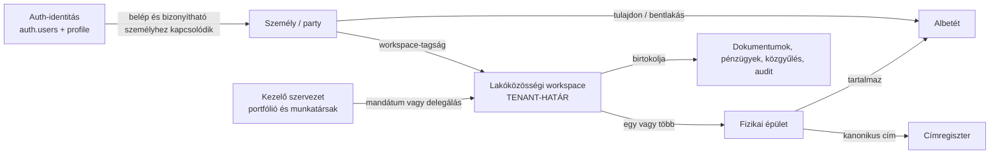
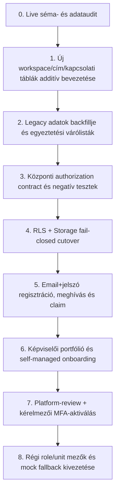

# PanelLakó multitenancy – célarchitektúra és bevezetési terv

**Állapot:** v0.10.5 production rollout lezárva; adatbázis-, alkalmazás-, OAuth provider- és tenant-izolációs kapuk PASS
**Dátum:** 2026-08-30
**Hatókör:** identitás, workspace, fizikai épület, cím, albetét, személyek, tulajdon, bentlakás, képviselet, delegálás, regisztráció, meghívás, RLS és kompatibilis migráció
**Élesítési határ:** a v0.10.4 öt új, `20260829110000`–`20260829150000` közötti migrációja productionben ledgerrel és read-only verifierrel PASS; a v0.10.5 alkalmazás main deployja, Supabase Google provider canaryja és hosted két-tenant E2E-je szintén PASS. Dedikált teszt Google-identitással végigvitt consent/callback/account-linking E2E nem futott

## Vezetői döntés

A PanelLakó adatbiztonsági tenant-határa a **lakóközösségi workspace** legyen, ne a közös képviselő felhasználói fiókja, kezelőcége vagy a puszta címszöveg.

Ebből következik:

- egy workspace egy társasházi vagy önszerveződő lakóközösség folytonos digitális tere;
- egy workspace egy vagy több fizikai épületet foghat össze;
- egy fizikai épület pontos, kanonikus címe csak egyszer szerepelhet a globális cím-/épületregiszterben;
- egy közös képviselő vagy kezelőcég több workspace-re kaphat időben korlátozott mandátumot;
- a képviselőváltás nem költözteti át és nem osztja új tenantba a ház adatait;
- a workspace-tagság, a szerepkör, a tulajdon és a bentlakás négy külön kapcsolat;
- egy személy tetszőleges számú albetét tulajdonosa és/vagy lakója lehet, akár több workspace-ben;
- jogilag alkalmas, igazolt közös képviselő nélküli kis ház ugyanazt a modellt használja `SELF_MANAGED` irányítási móddal; a puszta képviselőhiány önmagában nem elég;
- a technikai `SELF_MANAGED_ADMIN` role (felületi neve: „Közösségi koordinátor”) nem állít jogi értelemben vett közös képviselői státuszt;
- bármely account flow — Google, email+jelszó vagy magic link — csak identitást
  hitelesít; hozzáférést önmagában nem ad.

## Bizonyossági jelölések

- **BIZONYÍTOTT:** a jelenlegi repository-kódból, sémából vagy hivatalos forrásból közvetlenül igazolható.
- **JAVASOLT:** a célarchitektúra része; még nincs implementálva.
- **NYITOTT DÖNTÉS:** üzleti, jogi vagy termékdöntést igényel az implementáció előtt.
- **HOLD:** valódi lakói adatokkal nem biztonságos élesíteni, amíg az adott kapu nem teljesül.

A v0.10.4 öt új migrációját titkosított, visszaellenőrzött backup után a
production adatbázisra alkalmaztuk; a migrációs ledger és a read-only DB Verify
PASS. A lokális PostgreSQL 18.4 apply/reapply és runtime canary, a teljes 324
teszt, a TypeScript, lint és production build szintén PASS. A v0.10.5 main CI,
Vercel production deploy, provider-workflow, független Google authorize canary,
renderelt auth UI és hosted két-tenant negatív próba külön production
bizonyítékkal zárult; a részleteket a v0.10.5 verziójegyzőkönyv tartalmazza.

## A csomag felépítése

1. [Jelenlegi állapot és résanalízis](./01-current-state-audit.md)
2. [Cél domainmodell és relációk](./02-target-domain-model.md)
3. [Szerepkörök, képességek, RLS és Storage](./03-authorization-and-rls.md)
4. [Regisztráció, meghívás, csatlakozás és self-managed folyamatok](./04-registration-and-onboarding.md)
5. [Címidentitás, egyszeriség és duplikációkezelés](./05-address-identity-and-deduplication.md)
6. [Migrációs, rollout- és tesztterv](./06-migration-rollout-and-tests.md)
7. [Effectime minták: mit veszünk át és mit nem](./07-effectime-patterns.md)
8. [Aktivitási naptár kontrasztjavítási terv](./08-activity-calendar-contrast-plan.md)
9. [Hivatalos források és döntési nyomvonal](./09-sources-and-decision-log.md)
10. [v0.10.0 implementációs állapot és V7 döntési mátrix](./10-implementation-status-v0.10.0.md)
11. [v0.10.1 platform-review és kérelmezői MFA-aktiválás](./11-community-review-and-activation-v0.10.1.md)
12. [v0.10.1 operatív multitenancy-lezárás](./12-operational-multitenancy-closure-v0.10.1.md)
13. [v0.10.4 Google Auth, lakónyilvántartás és authorization hardening](./13-google-auth-and-resident-registry-v0.10.4.md)
14. [v0.10.6 közös GeoData Address Registry és biztonságos cím-onboarding](./14-shared-address-registry-v0.10.6.md)

## A három külön rendszerhatár



### Miért nem a közös képviselő a tenant?

A közös képviselő cserélhető szereplő. Ha ő lenne a tenant tulajdonosa vagy a tenant maga, képviselőváltáskor a lakóközösség teljes történetének, dokumentumainak és jogosultságainak költöztetése vagy másolása válna szükségessé. Ez adatvédelmi és integritási kockázat. A képviselő ezért **mandátummal kapcsolódik** a workspace-hez; nem birtokolja annak adatbiztonsági határát.

### Miért nem a fizikai épület a teljes domain gyökere?

Egy társasházi közösség több lépcsőházat, épületszárnyat vagy címet is kezelhet. Ugyanakkor a környezeti, közlekedési és geoadatok a fizikai helyhez kötődnek, a pénzügyek és közgyűlések viszont a közösséghez. A workspace és a fizikai épület különválasztása egyszerre teszi lehetővé:

- a többcímes lakótömböket;
- a cím egyszeriségét;
- a fizikai/helyalapú cache-ek megosztását;
- a tenantadatok szigorú elkülönítését;
- a képviselőváltást adatköltöztetés nélkül.

## Alapelv: kapcsolat nem egyenlő jogosultsággal

Az engedély nem egyetlen szerepkör-stringből következik. Az alábbi formula **tenant-erőforrás elérésére** vonatkozik; a PII-mentes publikus épületlookup és a tagság előtti, saját identityhez vagy egyszer használható tokenhez kötött onboarding külön, szűk authorization sík.

```text
engedélyezett =
  hitelesített identitás
  ÉS aktív workspace-tagság
  ÉS aktív szerep vagy reláció
  ÉS megfelelő capability
  ÉS az erőforrás scope-ja megegyezik
  ÉS a kapcsolat időben érvényes
  ÉS az erőforrás állapota engedi a műveletet
```

Tagság előtt kizárólag:

- minimalizált publikus cím-/épületkeresés;
- saját account regisztrációja, megerősítése és helyreállítása;
- saját címre kiadott, érvényes domainmeghívó elfogadása;
- saját join/claim kérelem létrehozása és állapotának lekérése;
- saját managed vagy self-managed community creation request és draft kezelése, tenantjog nélkül

engedhető. Ezek egyike sem ad általános tenantolvasást.

Példák:

- az aktív lakó diktálhat a saját albetétjéhez tartozó mérőre;
- a tulajdonos akkor is láthat tulajdonosi dokumentumot és saját egyenleget, ha nem lakik ott;
- a lakó nem kap automatikusan tulajdonosi szavazati jogot;
- a megbízott kizárólag a delegált képességeket kapja, nem egy korlátlan „admin” szerepet;
- a lejárt képviselői mandátum azonnal megszünteti az új műveletek jogosultságát, miközben a történeti audit megmarad;
- UUID ismerete önmagában soha nem jogosít egy másik workspace vagy albetét elérésére.

## Nem alkuképes invariánsok

1. Minden fő entitás belső azonosítója UUID.
2. Minden tenantadat-sorhoz tartozik nem null `workspace_id`.
3. Minden fizikai albetét pontosan egy fizikai épülethez és egy workspace-hez tartozik.
4. A cross-tenant hibát az adatbázis összetett idegen kulccsal is akadályozza, nem csak TypeScript.
5. Ugyanaz a kanonikus fizikai cím nem hozhat létre két aktív fizikaiépület-rekordot.
6. Egy személy és egy albetét között több, időben változó kapcsolat lehet, de az egymásnak ellentmondó aktív állapotokat constraint vagy tranzakció akadályozza.
7. Tulajdon, bentlakás, workspace-hozzáférés és adminisztratív mandátum nem ugyanaz a rekord.
8. A kliens nem választhat saját maga jóváhagyott szerepet, workspace-t vagy albetétjogot.
9. Minden engedélyezett művelet szerver- és adatbázisoldalon is ellenőrzött; UI-elrejtés nem biztonsági kontroll.
10. Minden meghívás egyszer használható, lejáró, visszavonható és auditált.
11. A jogviszonyok történetét lezárjuk (`valid_to`, `revoked_at`), nem felülírjuk vagy töröljük.
12. Éles, hitelesített tenant route nem helyettesíthet üres adatot globális demoadattal.

## Implementációs sorrend röviden



A sorrend szándékos. Új lakói onboardingot nem szabad a jelenlegi nyitott RLS-re ráengedni; ugyanakkor az RLS-t sem szabad a jelenlegi, részben tenant nélküli műveletekre egyszerre rákapcsolni, mert az csendes működéskiesést okozna.

## Release-kapuk

### v0.10.5 production closure

- **PASS:** Supabase Google provider, kanonikus Site URL és redirect allowlist;
- **PASS:** public authorize canary Google célhosttal, S256 PKCE-vel és
  `openid`, `email`, `profile` scope-okkal;
- **PASS:** main CI, Vercel production deploy, valamint a renderelt `/login` és
  `/register` Google-gomb;
- **PASS:** post-rollout read-only DB Verify;
- **PASS:** valódi manager/resident sessionnel futó hosted két-tenant negatív
  próba és 0 rekordos fixture-cleanup;
- **NOT_RUN bizonyítási határ:** dedikált Google tesztidentitással végigvitt új
  fiók, consent-elutasítás, callback-hiba, invitation return-to és
  account-linking böngészős E2E. Személyes Google-fiók nem használható release-
  fixture-ként.

### PRECONDITIONED / HOLD – külön döntés nélkül nem implementálható tervrészek

Ezek nem blokkolják a v0.10.4 elkészült funkcióinak kontrollált rolloutját, de
nem állíthatók a multitenancy terv teljesített részeként, amíg a saját
előfeltételük nincs lezárva:

- identity/person merge és alias folyamat tenantadat-szivárgás nélkül;
- fuzzy címjelöltek operátori merge/split/dispute folyamata;
- névre szóló, visszavonható és AAL2-es platform-operator identity a jelenlegi
  env-backed superadmin munkamenet helyett;
- KMS/DEK, backup, retention és helyreállítási szerződés a
  crypto-shreddinghez;
- hivatalos nyilvántartási bizonyíték operatív beszerzési/megőrzési folyamata és
  2026. szeptember 30-i kötelező jogi source re-check;
- export, archiválás és mandátumátadás folyamatának elfogadása.

### Későbbi, nem blokkoló bővítés

- több kezelőcég közötti alvállalkozói delegálás;
- egyedi workspace-szerepsablonok;
- hivatalos cím- vagy ingatlan-nyilvántartási integráció, ha jogszerű hozzáférés rendelkezésre áll;
- összetett telek/épületszárny/lépcsőház hierarchia;
- tulajdonosi jogi személyek teljes KYC-folyamata;
- időkorlátos platform-support „break glass” munkamenet.

## Döntési állapot

Az architektúra implementálható alapot ad. Az újközösség-aktiváláshoz tartozó
self-managed legal form/jogalap, típusos bizonyíték, kérelmezői AAL2 és Tht.
64/A cutoff szerződését a [11. fejezet](./11-community-review-and-activation-v0.10.1.md)
lezárta. Az alábbi szélesebb döntéscsaládokat továbbra sem szabad kódban
találgatni; a teljes lista és javasolt alapértékek a [09-es döntési naplóban](./09-sources-and-decision-log.md) vannak:

1. Mi számít elfogadható bizonyítéknak tulajdonosi, lakói és képviselői claimnél, és hogyan érhető el a hivatalos tisztségviselői nyilvántartás?
2. Milyen fellebbezési, dispute- és többoldalú megerősítési folyamat kell a jelenlegi manuális platform-review mellé?
3. A díjfizető lehet-e kezelőcég több workspace-re, miközben előfizetés és adat-hozzáférés külön fogalom marad?
4. Mely magas kockázatú capabilityhez milyen `aal2`, elfogadott MFA `amr.method` és `amr.timestamp`-alapú reauth ablak szükséges?
5. Milyen adatmegőrzési, profile projection és identity-merge szabály felel meg az adatminimalizálásnak?

Ezeket az érintett rollout előtt döntési jegyzőkönyvben kell lezárni.
